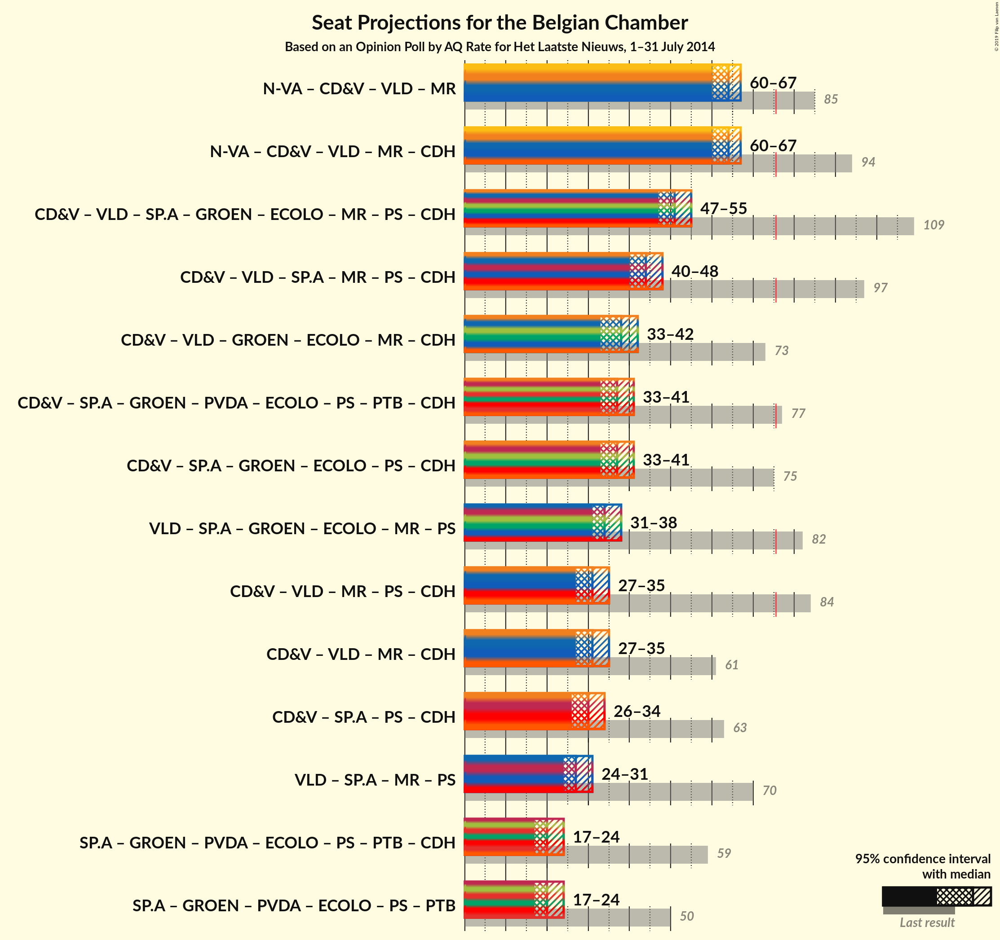

# Opinion Poll by AQ Rate for Het Laatste Nieuws, July 2014

Areas included: Flanders

<a href="#voting-intentions">Voting Intentions</a> | <a href="#seats">Seats</a> | <a href="#coalitions">Coalitions</a> | <a href="#technical-information">Technical Information</a>

## Voting Intentions

### Confidence Intervals

| Party | Last Result | Poll Result | 80% Confidence Interval | 90% Confidence Interval | 95% Confidence Interval | 99% Confidence Interval |
|:-----:|:-----------:|:-----------:|:-----------------------:|:-----------------------:|:-----------------------:|:-----------------------:|
| N-VA | 20.3% | 33.0% | 31.0–35.0% |30.4–35.6% |29.9–36.1% |29.0–37.1% |
| CD&V | 11.6% | 17.7% | 16.2–19.5% |15.7–20.0% |15.3–20.4% |14.6–21.3% |
| Open Vld | 9.8% | 15.5% | 14.0–17.1% |13.6–17.6% |13.2–18.0% |12.5–18.8% |
| sp.a | 8.8% | 14.5% | 13.1–16.2% |12.7–16.6% |12.4–17.0% |11.7–17.8% |
| Groen | 5.3% | 9.0% | 7.8–10.3% |7.5–10.7% |7.3–11.1% |6.8–11.7% |
| Vlaams Belang | 3.7% | 5.8% | 4.9–6.9% |4.6–7.3% |4.4–7.5% |4.0–8.1% |
| PVDA | 1.8% | 3.1% | 2.4–4.0% |2.3–4.2% |2.1–4.4% |1.8–4.9% |

*Note:* The poll result column reflects the actual value used in the calculations. Published results may vary slightly, and in addition be rounded to fewer digits.

## Seats

### Confidence Intervals

| Party | Last Result | Median | 80% Confidence Interval | 90% Confidence Interval | 95% Confidence Interval | 99% Confidence Interval |
|:-----:|:-----------:|:------:|:-----------------------:|:-----------------------:|:-----------------------:|:-----------------------:|
| <a href="#n-va">N-VA</a> | 33 | 33 | 31–35 |30–36 |29–37 |28–37 |
| <a href="#cd&v">CD&V</a> | 18 | 17 | 14–18 |14–18 |13–19 |13–21 |
| <a href="#open-vld">Open Vld</a> | 14 | 13 | 12–17 |12–17 |12–17 |11–18 |
| <a href="#sp.a">sp.a</a> | 13 | 13 | 12–15 |11–15 |11–16 |9–17 |
| <a href="#groen">Groen</a> | 6 | 6 | 5–9 |5–9 |5–10 |5–10 |
| <a href="#vlaams-belang">Vlaams Belang</a> | 3 | 3 | 2–5 |1–6 |1–6 |0–7 |
| <a href="#pvda">PVDA</a> | 0 | 0 | 0 |0 |0 |0 |

### N-VA

*For a full overview of the results for this party, see the [N-VA](party-nva.html) page.*

| Number of Seats | Probability | Accumulated | Special Marks |
|:---------------:|:-----------:|:-----------:|:-------------:|
| 27 | 0.1% | 100% |  |
| 28 | 0.6% | 99.9% |  |
| 29 | 4% | 99.2% |  |
| 30 | 5% | 95% |  |
| 31 | 19% | 91% |  |
| 32 | 20% | 71% |  |
| 33 | 16% | 51% | Last Result, Median |
| 34 | 17% | 34% |  |
| 35 | 10% | 17% |  |
| 36 | 3% | 7% |  |
| 37 | 3% | 4% |  |
| 38 | 0.3% | 0.4% |  |
| 39 | 0.1% | 0.1% |  |
| 40 | 0% | 0% |  |

### CD&V

*For a full overview of the results for this party, see the [CD&V](party-cdv.html) page.*

| Number of Seats | Probability | Accumulated | Special Marks |
|:---------------:|:-----------:|:-----------:|:-------------:|
| 13 | 5% | 100% |  |
| 14 | 9% | 95% |  |
| 15 | 8% | 86% |  |
| 16 | 12% | 78% |  |
| 17 | 18% | 66% | Median |
| 18 | 44% | 48% | Last Result |
| 19 | 2% | 4% |  |
| 20 | 0.9% | 2% |  |
| 21 | 1.4% | 2% |  |
| 22 | 0.1% | 0.1% |  |
| 23 | 0% | 0% |  |

### Open Vld

*For a full overview of the results for this party, see the [Open Vld](party-openvld.html) page.*

| Number of Seats | Probability | Accumulated | Special Marks |
|:---------------:|:-----------:|:-----------:|:-------------:|
| 11 | 1.0% | 100% |  |
| 12 | 20% | 98.9% |  |
| 13 | 33% | 79% | Median |
| 14 | 14% | 46% | Last Result |
| 15 | 7% | 32% |  |
| 16 | 10% | 25% |  |
| 17 | 13% | 15% |  |
| 18 | 2% | 2% |  |
| 19 | 0% | 0% |  |

### sp.a

*For a full overview of the results for this party, see the [sp.a](party-spa.html) page.*

| Number of Seats | Probability | Accumulated | Special Marks |
|:---------------:|:-----------:|:-----------:|:-------------:|
| 9 | 0.7% | 100% |  |
| 10 | 2% | 99.3% |  |
| 11 | 4% | 98% |  |
| 12 | 7% | 93% |  |
| 13 | 49% | 86% | Last Result, Median |
| 14 | 18% | 37% |  |
| 15 | 15% | 19% |  |
| 16 | 3% | 4% |  |
| 17 | 0.8% | 1.0% |  |
| 18 | 0.2% | 0.2% |  |
| 19 | 0% | 0% |  |

### Groen

*For a full overview of the results for this party, see the [Groen](party-groen.html) page.*

| Number of Seats | Probability | Accumulated | Special Marks |
|:---------------:|:-----------:|:-----------:|:-------------:|
| 5 | 11% | 100% |  |
| 6 | 40% | 89% | Last Result, Median |
| 7 | 14% | 50% |  |
| 8 | 25% | 36% |  |
| 9 | 6% | 10% |  |
| 10 | 4% | 4% |  |
| 11 | 0.3% | 0.4% |  |
| 12 | 0.1% | 0.1% |  |
| 13 | 0% | 0% |  |

### Vlaams Belang

*For a full overview of the results for this party, see the [Vlaams Belang](party-vlaamsbelang.html) page.*

| Number of Seats | Probability | Accumulated | Special Marks |
|:---------------:|:-----------:|:-----------:|:-------------:|
| 0 | 0.9% | 100% |  |
| 1 | 6% | 99.1% |  |
| 2 | 42% | 94% |  |
| 3 | 11% | 52% | Last Result, Median |
| 4 | 9% | 41% |  |
| 5 | 27% | 32% |  |
| 6 | 5% | 6% |  |
| 7 | 1.0% | 1.0% |  |
| 8 | 0.1% | 0.1% |  |
| 9 | 0% | 0% |  |

### PVDA

*For a full overview of the results for this party, see the [PVDA](party-pvda.html) page.*

| Number of Seats | Probability | Accumulated | Special Marks |
|:---------------:|:-----------:|:-----------:|:-------------:|
| 0 | 100% | 100% | Last Result, Median |

## Coalitions

### Confidence Intervals

| Coalition | Last Result | Median | Majority? | 80% Confidence Interval | 90% Confidence Interval | 95% Confidence Interval | 99% Confidence Interval |
|:---------:|:-----------:|:------:|:---------:|:-----------------------:|:-----------------------:|:-----------------------:|:-----------------------:|

## Technical Information

### Opinion Poll

+ **Pollster:** AQ Rate
+ **Media:** Het Laatste Nieuws
+ **Fieldwork period:** July 2014

### Calculations

+ **Sample size:** 880
+ **Simulations done:** 524,288
+ **Error estimate:** 2.21%

