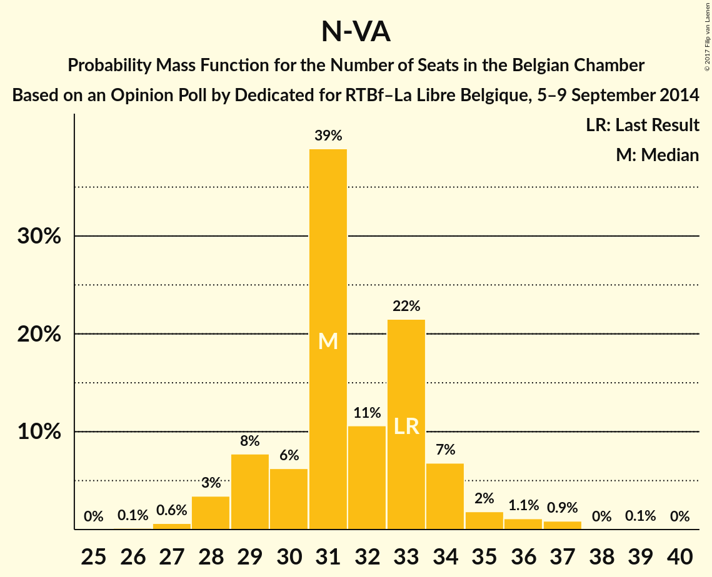
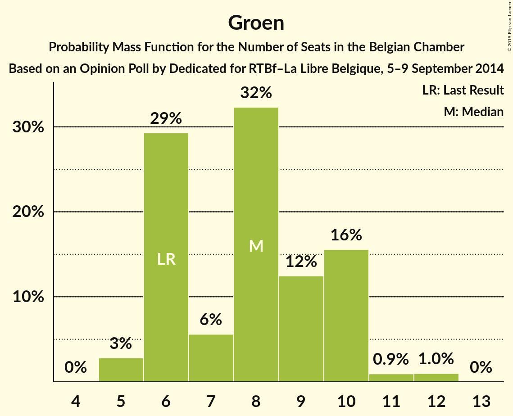

# Opinion Poll by Dedicated for RTBf–La Libre Belgique, 5–9 September 2014

Areas included: Flanders, Wallonia

<a href="#voting-intentions">Voting Intentions</a> | <a href="#seats">Seats</a> | <a href="#coalitions">Coalitions</a> | <a href="#technical-information">Technical Information</a>

## Voting Intentions

### Confidence Intervals

| Party | Last Result | Poll Result | 80% Confidence Interval | 90% Confidence Interval | 95% Confidence Interval | 99% Confidence Interval |
|:-----:|:-----------:|:-----------:|:-----------------------:|:-----------------------:|:-----------------------:|:-----------------------:|
| N-VA | 20.3% | 21.4% | 29.9–34.1% |29.3–34.8% |28.8–35.3% |27.8–36.3% |
| CD&V | 11.6% | 11.8% | 16.0–19.5% |15.6–20.0% |15.2–20.5% |14.4–21.4% |
| Open Vld | 9.8% | 10.3% | 13.9–17.2% |13.4–17.7% |13.0–18.1% |12.3–19.0% |
| PS | 11.7% | 10.3% | N/A |N/A |N/A |N/A |
| sp.a | 8.8% | 10.0% | 13.5–16.8% |13.1–17.3% |12.7–17.7% |12.0–18.5% |
| MR | 9.6% | 8.9% | N/A |N/A |N/A |N/A |
| Groen | 5.3% | 6.4% | 8.4–11.1% |8.0–11.5% |7.7–11.9% |7.2–12.6% |
| cdH | 5.0% | 4.2% | N/A |N/A |N/A |N/A |
| Vlaams Belang | 3.7% | 3.7% | 4.6–6.8% |4.4–7.1% |4.2–7.4% |3.8–8.0% |
| Ecolo | 3.3% | 2.8% | N/A |N/A |N/A |N/A |
| PTB | 2.0% | 2.7% | N/A |N/A |N/A |N/A |
| PVDA | 1.8% | 2.1% | 2.5–4.1% |2.3–4.4% |2.1–4.6% |1.9–5.1% |
| Parti Populaire | 1.5% | 1.7% | N/A |N/A |N/A |N/A |
| DéFI | 1.8% | 0.6% | N/A |N/A |N/A |N/A |
| Piratenpartij | 0.3% | 0.5% | 0.5–1.3% |0.4–1.5% |0.4–1.6% |0.2–2.0% |
| La Droite | 0.4% | 0.5% | N/A |N/A |N/A |N/A |
| Lijst Dedecker | 0.4% | 0.4% | 0.4–1.2% |0.3–1.3% |0.3–1.5% |0.2–1.8% |
| PIRATE | 0.1% | 0.3% | N/A |N/A |N/A |N/A |
| Wallonie d’Abord | 0.2% | 0.3% | N/A |N/A |N/A |N/A |
| Debout les Belges | 0.9% | 0.3% | N/A |N/A |N/A |N/A |
| FW | 0.1% | 0.3% | N/A |N/A |N/A |N/A |
| R.W.F. | 0.1% | 0.2% | N/A |N/A |N/A |N/A |

*Note:* The poll result column reflects the actual value used in the calculations. Published results may vary slightly, and in addition be rounded to fewer digits.

## Seats

### Confidence Intervals

| Party | Last Result | Median | 80% Confidence Interval | 90% Confidence Interval | 95% Confidence Interval | 99% Confidence Interval |
|:-----:|:-----------:|:------:|:-----------------------:|:-----------------------:|:-----------------------:|:-----------------------:|
| <a href="#n-va">N-VA</a> | 33 | 31 | 29–34 |29–34 |28–35 |27–37 |
| <a href="#cd&v">CD&V</a> | 18 | 17 | 14–18 |13–19 |13–19 |13–21 |
| <a href="#open-vld">Open Vld</a> | 14 | 14 | 12–17 |12–17 |12–18 |11–18 |
| <a href="#ps">PS</a> | 23 | 19 | 19 |19 |19 |19 |
| <a href="#sp.a">sp.a</a> | 13 | 13 | 13–15 |12–16 |11–17 |10–18 |
| <a href="#mr">MR</a> | 20 | 17 | 17 |17 |17 |15–17 |
| <a href="#groen">Groen</a> | 6 | 8 | 6–10 |6–10 |5–10 |5–12 |
| <a href="#cdh">cdH</a> | 9 | 7 | 7 |7 |7 |7 |
| <a href="#vlaams-belang">Vlaams Belang</a> | 3 | 3 | 2–5 |1–6 |1–6 |0–7 |
| <a href="#ecolo">Ecolo</a> | 6 | 1 | 1 |1 |1 |1–3 |
| <a href="#ptb">PTB</a> | 2 | 2 | 2 |2 |2 |2–3 |
| <a href="#pvda">PVDA</a> | 0 | 0 | 0 |0 |0 |0 |
| <a href="#parti-populaire">Parti Populaire</a> | 1 | 2 | 2 |2 |2 |1–2 |
| <a href="#défi">DéFI</a> | 2 | 0 | 0 |0 |0 |0 |
| <a href="#piratenpartij">Piratenpartij</a> | 0 | 0 | 0 |0 |0 |0 |
| <a href="#la-droite">La Droite</a> | 0 | 0 | 0 |0 |0 |0 |
| <a href="#lijst-dedecker">Lijst Dedecker</a> | 0 | 0 | 0–1 |0–1 |0–1 |0–1 |
| <a href="#pirate">PIRATE</a> | 0 | 0 | 0 |0 |0 |0 |
| <a href="#wallonie-d’abord">Wallonie d’Abord</a> | 0 | 0 | 0 |0 |0 |0 |
| <a href="#debout-les-belges">Debout les Belges</a> | 0 | 0 | 0 |0 |0 |0 |
| <a href="#fw">FW</a> | 0 | 0 | 0 |0 |0 |0 |
| <a href="#r.w.f.">R.W.F.</a> | 0 | 0 | 0 |0 |0 |0 |

### N-VA

*For a full overview of the results for this party, see the [N-VA](party-nva.html) page.*

| Number of Seats | Probability | Accumulated | Special Marks |
|:---------------:|:-----------:|:-----------:|:-------------:|
| 26 | 0.1% | 100% |  |
| 27 | 0.6% | 99.8% |  |
| 28 | 3% | 99.2% |  |
| 29 | 8% | 96% |  |
| 30 | 6% | 88% |  |
| 31 | 39% | 82% | Median |
| 32 | 11% | 43% |  |
| 33 | 22% | 32% | Last Result |
| 34 | 7% | 11% |  |
| 35 | 2% | 4% |  |
| 36 | 1.1% | 2% |  |
| 37 | 0.9% | 1.0% |  |
| 38 | 0% | 0.1% |  |
| 39 | 0.1% | 0.1% |  |
| 40 | 0% | 0% |  |

### CD&V

*For a full overview of the results for this party, see the [CD&V](party-cdv.html) page.*

| Number of Seats | Probability | Accumulated | Special Marks |
|:---------------:|:-----------:|:-----------:|:-------------:|
| 13 | 8% | 100% |  |
| 14 | 9% | 92% |  |
| 15 | 11% | 83% |  |
| 16 | 15% | 72% |  |
| 17 | 16% | 57% | Median |
| 18 | 35% | 41% | Last Result |
| 19 | 4% | 6% |  |
| 20 | 1.4% | 2% |  |
| 21 | 0.6% | 0.7% |  |
| 22 | 0.1% | 0.1% |  |
| 23 | 0% | 0% |  |

### Open Vld

*For a full overview of the results for this party, see the [Open Vld](party-openvld.html) page.*

| Number of Seats | Probability | Accumulated | Special Marks |
|:---------------:|:-----------:|:-----------:|:-------------:|
| 10 | 0.1% | 100% |  |
| 11 | 2% | 99.9% |  |
| 12 | 18% | 98% |  |
| 13 | 29% | 80% |  |
| 14 | 13% | 51% | Last Result, Median |
| 15 | 6% | 38% |  |
| 16 | 10% | 32% |  |
| 17 | 19% | 21% |  |
| 18 | 2% | 3% |  |
| 19 | 0% | 0.1% |  |
| 20 | 0% | 0% |  |

### PS

*For a full overview of the results for this party, see the [PS](party-ps.html) page.*

| Number of Seats | Probability | Accumulated | Special Marks |
|:---------------:|:-----------:|:-----------:|:-------------:|
| 18 | 0.4% | 100% |  |
| 19 | 99.6% | 99.6% | Median |
| 20 | 0% | 0% |  |
| 21 | 0% | 0% |  |
| 22 | 0% | 0% |  |
| 23 | 0% | 0% | Last Result |

### sp.a

*For a full overview of the results for this party, see the [sp.a](party-spa.html) page.*

| Number of Seats | Probability | Accumulated | Special Marks |
|:---------------:|:-----------:|:-----------:|:-------------:|
| 9 | 0.4% | 100% |  |
| 10 | 0.7% | 99.6% |  |
| 11 | 3% | 98.9% |  |
| 12 | 6% | 96% |  |
| 13 | 47% | 90% | Last Result, Median |
| 14 | 18% | 44% |  |
| 15 | 17% | 25% |  |
| 16 | 4% | 8% |  |
| 17 | 3% | 4% |  |
| 18 | 0.8% | 0.9% |  |
| 19 | 0.1% | 0.1% |  |
| 20 | 0% | 0% |  |

### MR

*For a full overview of the results for this party, see the [MR](party-mr.html) page.*

| Number of Seats | Probability | Accumulated | Special Marks |
|:---------------:|:-----------:|:-----------:|:-------------:|
| 14 | 0.4% | 100% |  |
| 15 | 0.4% | 99.6% |  |
| 16 | 0% | 99.2% |  |
| 17 | 99.2% | 99.2% | Median |
| 18 | 0% | 0% |  |
| 19 | 0% | 0% |  |
| 20 | 0% | 0% | Last Result |

### Groen

*For a full overview of the results for this party, see the [Groen](party-groen.html) page.*

| Number of Seats | Probability | Accumulated | Special Marks |
|:---------------:|:-----------:|:-----------:|:-------------:|
| 5 | 3% | 100% |  |
| 6 | 34% | 97% | Last Result |
| 7 | 4% | 63% |  |
| 8 | 31% | 59% | Median |
| 9 | 10% | 28% |  |
| 10 | 17% | 18% |  |
| 11 | 0.5% | 1.2% |  |
| 12 | 0.7% | 0.7% |  |
| 13 | 0% | 0% |  |

### cdH

*For a full overview of the results for this party, see the [cdH](party-cdh.html) page.*

| Number of Seats | Probability | Accumulated | Special Marks |
|:---------------:|:-----------:|:-----------:|:-------------:|
| 5 | 0.4% | 100% |  |
| 6 | 0% | 99.6% |  |
| 7 | 99.6% | 99.6% | Median |
| 8 | 0% | 0% |  |
| 9 | 0% | 0% | Last Result |

### Vlaams Belang

*For a full overview of the results for this party, see the [Vlaams Belang](party-vlaamsbelang.html) page.*

| Number of Seats | Probability | Accumulated | Special Marks |
|:---------------:|:-----------:|:-----------:|:-------------:|
| 0 | 2% | 100% |  |
| 1 | 6% | 98% |  |
| 2 | 37% | 92% |  |
| 3 | 22% | 55% | Last Result, Median |
| 4 | 11% | 33% |  |
| 5 | 16% | 22% |  |
| 6 | 5% | 6% |  |
| 7 | 0.5% | 0.6% |  |
| 8 | 0% | 0% |  |

### Ecolo

*For a full overview of the results for this party, see the [Ecolo](party-ecolo.html) page.*

| Number of Seats | Probability | Accumulated | Special Marks |
|:---------------:|:-----------:|:-----------:|:-------------:|
| 1 | 99.2% | 100% | Median |
| 2 | 0% | 0.8% |  |
| 3 | 0.4% | 0.8% |  |
| 4 | 0.4% | 0.4% |  |
| 5 | 0% | 0% |  |
| 6 | 0% | 0% | Last Result |

### PTB

*For a full overview of the results for this party, see the [PTB](party-ptb.html) page.*

| Number of Seats | Probability | Accumulated | Special Marks |
|:---------------:|:-----------:|:-----------:|:-------------:|
| 2 | 99.2% | 100% | Last Result, Median |
| 3 | 0.4% | 0.8% |  |
| 4 | 0% | 0.4% |  |
| 5 | 0% | 0.4% |  |
| 6 | 0.4% | 0.4% |  |
| 7 | 0% | 0% |  |

### PVDA

*For a full overview of the results for this party, see the [PVDA](party-pvda.html) page.*

| Number of Seats | Probability | Accumulated | Special Marks |
|:---------------:|:-----------:|:-----------:|:-------------:|
| 0 | 100% | 100% | Last Result, Median |

### Parti Populaire

*For a full overview of the results for this party, see the [Parti Populaire](party-partipopulaire.html) page.*

| Number of Seats | Probability | Accumulated | Special Marks |
|:---------------:|:-----------:|:-----------:|:-------------:|
| 1 | 0.8% | 100% | Last Result |
| 2 | 99.2% | 99.2% | Median |
| 3 | 0% | 0% |  |

### DéFI

*For a full overview of the results for this party, see the [DéFI](party-dfi.html) page.*

| Number of Seats | Probability | Accumulated | Special Marks |
|:---------------:|:-----------:|:-----------:|:-------------:|
| 0 | 100% | 100% | Median |
| 1 | 0% | 0% |  |
| 2 | 0% | 0% | Last Result |

### Piratenpartij

*For a full overview of the results for this party, see the [Piratenpartij](party-piratenpartij.html) page.*

| Number of Seats | Probability | Accumulated | Special Marks |
|:---------------:|:-----------:|:-----------:|:-------------:|
| 0 | 100% | 100% | Last Result, Median |

### La Droite

*For a full overview of the results for this party, see the [La Droite](party-ladroite.html) page.*

| Number of Seats | Probability | Accumulated | Special Marks |
|:---------------:|:-----------:|:-----------:|:-------------:|
| 0 | 100% | 100% | Last Result, Median |

### Lijst Dedecker

*For a full overview of the results for this party, see the [Lijst Dedecker](party-lijstdedecker.html) page.*

| Number of Seats | Probability | Accumulated | Special Marks |
|:---------------:|:-----------:|:-----------:|:-------------:|
| 0 | 76% | 100% | Last Result, Median |
| 1 | 23% | 24% |  |
| 2 | 0.2% | 0.2% |  |
| 3 | 0% | 0% |  |

### PIRATE

*For a full overview of the results for this party, see the [PIRATE](party-pirate.html) page.*

| Number of Seats | Probability | Accumulated | Special Marks |
|:---------------:|:-----------:|:-----------:|:-------------:|
| 0 | 100% | 100% | Last Result, Median |

### Wallonie d’Abord

*For a full overview of the results for this party, see the [Wallonie d’Abord](party-walloniedabord.html) page.*

| Number of Seats | Probability | Accumulated | Special Marks |
|:---------------:|:-----------:|:-----------:|:-------------:|
| 0 | 100% | 100% | Last Result, Median |

### Debout les Belges

*For a full overview of the results for this party, see the [Debout les Belges](party-deboutlesbelges.html) page.*

| Number of Seats | Probability | Accumulated | Special Marks |
|:---------------:|:-----------:|:-----------:|:-------------:|
| 0 | 100% | 100% | Last Result, Median |

### FW

*For a full overview of the results for this party, see the [FW](party-fw.html) page.*

| Number of Seats | Probability | Accumulated | Special Marks |
|:---------------:|:-----------:|:-----------:|:-------------:|
| 0 | 100% | 100% | Last Result, Median |

### R.W.F.

*For a full overview of the results for this party, see the [R.W.F.](party-rwf.html) page.*

| Number of Seats | Probability | Accumulated | Special Marks |
|:---------------:|:-----------:|:-----------:|:-------------:|
| 0 | 100% | 100% | Last Result, Median |

## Coalitions

### Confidence Intervals

| Coalition | Last Result | Median | Majority? | 80% Confidence Interval | 90% Confidence Interval | 95% Confidence Interval | 99% Confidence Interval |
|:---------:|:-----------:|:------:|:---------:|:-----------------------:|:-----------------------:|:-----------------------:|:-----------------------:|
| CD&V – Open Vld – PS – sp.a – MR – Groen – cdH – Ecolo | 109 | 96 | 100% | 93–99 | 93–100 | 93–100 | 90–101 |
| CD&V – Open Vld – PS – sp.a – MR – cdH | 97 | 88 | 100% | 85–90 | 84–90 | 84–91 | 81–93 |
| N-VA – CD&V – Open Vld – MR – cdH | 94 | 86 | 100% | 84–89 | 82–90 | 81–90 | 80–91 |
| N-VA – CD&V – Open Vld – MR | 85 | 79 | 95% | 77–82 | 76–83 | 74–83 | 73–84 |
| CD&V – Open Vld – PS – MR – cdH | 84 | 74 | 24% | 71–76 | 70–77 | 69–77 | 68–79 |
| Open Vld – PS – sp.a – MR – Groen – Ecolo | 82 | 72 | 6% | 70–75 | 69–76 | 69–77 | 67–79 |
| CD&V – PS – sp.a – Groen – cdH – Ecolo – PTB – PVDA | 77 | 67 | 0% | 64–70 | 63–70 | 62–71 | 62–72 |
| CD&V – PS – sp.a – Groen – cdH – Ecolo | 75 | 65 | 0% | 62–68 | 61–68 | 60–69 | 60–70 |
| Open Vld – PS – sp.a – MR | 70 | 63 | 0% | 61–67 | 61–67 | 60–68 | 59–69 |
| CD&V – PS – sp.a – cdH | 63 | 56 | 0% | 54–59 | 53–59 | 52–60 | 51–61 |
| CD&V – Open Vld – MR – cdH | 61 | 55 | 0% | 52–57 | 51–58 | 50–58 | 49–60 |
| PS – sp.a – Groen – cdH – Ecolo – PTB – PVDA | 59 | 50 | 0% | 48–53 | 48–54 | 47–55 | 46–56 |
| PS – sp.a – Groen – Ecolo – PTB – PVDA | 50 | 43 | 0% | 41–46 | 41–47 | 40–48 | 39–49 |
| CD&V – Open Vld – MR – Groen – cdH – Ecolo | 73 | 25 | 0% | 25 | 25 | 25 | 25 |

### CD&V – Open Vld – PS – sp.a – MR – Groen – cdH – Ecolo

| Number of Seats | Probability | Accumulated | Special Marks |
|:---------------:|:-----------:|:-----------:|:-------------:|
| 89 | 0.2% | 100% |  |
| 90 | 0.4% | 99.8% |  |
| 91 | 0.4% | 99.4% |  |
| 92 | 1.3% | 99.0% |  |
| 93 | 10% | 98% |  |
| 94 | 6% | 88% |  |
| 95 | 23% | 82% |  |
| 96 | 17% | 59% | Median |
| 97 | 23% | 43% |  |
| 98 | 7% | 20% |  |
| 99 | 7% | 13% |  |
| 100 | 5% | 6% |  |
| 101 | 0.4% | 0.8% |  |
| 102 | 0.4% | 0.5% |  |
| 103 | 0.1% | 0.1% |  |
| 104 | 0% | 0% |  |
| 105 | 0% | 0% |  |
| 106 | 0% | 0% |  |
| 107 | 0% | 0% |  |
| 108 | 0% | 0% |  |
| 109 | 0% | 0% | Last Result |

### CD&V – Open Vld – PS – sp.a – MR – cdH

| Number of Seats | Probability | Accumulated | Special Marks |
|:---------------:|:-----------:|:-----------:|:-------------:|
| 80 | 0.2% | 100% |  |
| 81 | 0.4% | 99.8% |  |
| 82 | 0.8% | 99.4% |  |
| 83 | 0.9% | 98.7% |  |
| 84 | 7% | 98% |  |
| 85 | 11% | 91% |  |
| 86 | 13% | 79% |  |
| 87 | 12% | 66% | Median |
| 88 | 24% | 54% |  |
| 89 | 14% | 30% |  |
| 90 | 11% | 16% |  |
| 91 | 2% | 5% |  |
| 92 | 1.0% | 2% |  |
| 93 | 0.9% | 1.0% |  |
| 94 | 0.1% | 0.2% |  |
| 95 | 0% | 0% |  |
| 96 | 0% | 0% |  |
| 97 | 0% | 0% | Last Result |

### N-VA – CD&V – Open Vld – MR – cdH

| Number of Seats | Probability | Accumulated | Special Marks |
|:---------------:|:-----------:|:-----------:|:-------------:|
| 79 | 0.1% | 100% |  |
| 80 | 1.0% | 99.9% |  |
| 81 | 2% | 98.9% |  |
| 82 | 2% | 97% |  |
| 83 | 4% | 95% |  |
| 84 | 12% | 91% |  |
| 85 | 14% | 79% |  |
| 86 | 16% | 66% | Median |
| 87 | 21% | 49% |  |
| 88 | 14% | 29% |  |
| 89 | 6% | 15% |  |
| 90 | 7% | 9% |  |
| 91 | 2% | 2% |  |
| 92 | 0.3% | 0.4% |  |
| 93 | 0.1% | 0.1% |  |
| 94 | 0% | 0% | Last Result |

### N-VA – CD&V – Open Vld – MR

| Number of Seats | Probability | Accumulated | Special Marks |
|:---------------:|:-----------:|:-----------:|:-------------:|
| 72 | 0% | 100% |  |
| 73 | 0.9% | 99.9% |  |
| 74 | 2% | 99.0% |  |
| 75 | 2% | 97% |  |
| 76 | 4% | 95% | Majority |
| 77 | 12% | 91% |  |
| 78 | 14% | 79% |  |
| 79 | 16% | 66% | Median |
| 80 | 21% | 49% |  |
| 81 | 14% | 29% |  |
| 82 | 6% | 15% |  |
| 83 | 7% | 9% |  |
| 84 | 2% | 2% |  |
| 85 | 0.3% | 0.4% | Last Result |
| 86 | 0.1% | 0.1% |  |
| 87 | 0% | 0% |  |

### CD&V – Open Vld – PS – MR – cdH

| Number of Seats | Probability | Accumulated | Special Marks |
|:---------------:|:-----------:|:-----------:|:-------------:|
| 66 | 0% | 100% |  |
| 67 | 0.1% | 99.9% |  |
| 68 | 1.4% | 99.9% |  |
| 69 | 3% | 98% |  |
| 70 | 5% | 96% |  |
| 71 | 7% | 91% |  |
| 72 | 6% | 84% |  |
| 73 | 25% | 78% |  |
| 74 | 16% | 53% | Median |
| 75 | 13% | 37% |  |
| 76 | 17% | 24% | Majority |
| 77 | 5% | 7% |  |
| 78 | 1.3% | 2% |  |
| 79 | 0.5% | 1.0% |  |
| 80 | 0.4% | 0.5% |  |
| 81 | 0.1% | 0.1% |  |
| 82 | 0% | 0% |  |
| 83 | 0% | 0% |  |
| 84 | 0% | 0% | Last Result |

### Open Vld – PS – sp.a – MR – Groen – Ecolo

| Number of Seats | Probability | Accumulated | Special Marks |
|:---------------:|:-----------:|:-----------:|:-------------:|
| 65 | 0.1% | 100% |  |
| 66 | 0% | 99.9% |  |
| 67 | 0.7% | 99.9% |  |
| 68 | 1.1% | 99.1% |  |
| 69 | 6% | 98% |  |
| 70 | 13% | 92% |  |
| 71 | 8% | 79% |  |
| 72 | 23% | 71% | Median |
| 73 | 9% | 47% |  |
| 74 | 19% | 39% |  |
| 75 | 14% | 20% |  |
| 76 | 3% | 6% | Majority |
| 77 | 2% | 3% |  |
| 78 | 1.0% | 2% |  |
| 79 | 0.6% | 0.6% |  |
| 80 | 0% | 0% |  |
| 81 | 0% | 0% |  |
| 82 | 0% | 0% | Last Result |

### CD&V – PS – sp.a – Groen – cdH – Ecolo – PTB – PVDA

| Number of Seats | Probability | Accumulated | Special Marks |
|:---------------:|:-----------:|:-----------:|:-------------:|
| 60 | 0% | 100% |  |
| 61 | 0.3% | 99.9% |  |
| 62 | 4% | 99.7% |  |
| 63 | 3% | 96% |  |
| 64 | 8% | 93% |  |
| 65 | 16% | 85% |  |
| 66 | 14% | 68% |  |
| 67 | 13% | 54% | Median |
| 68 | 13% | 42% |  |
| 69 | 10% | 28% |  |
| 70 | 14% | 18% |  |
| 71 | 3% | 4% |  |
| 72 | 1.3% | 2% |  |
| 73 | 0.3% | 0.5% |  |
| 74 | 0.1% | 0.2% |  |
| 75 | 0% | 0% |  |
| 76 | 0% | 0% | Majority |
| 77 | 0% | 0% | Last Result |

### CD&V – PS – sp.a – Groen – cdH – Ecolo

| Number of Seats | Probability | Accumulated | Special Marks |
|:---------------:|:-----------:|:-----------:|:-------------:|
| 58 | 0% | 100% |  |
| 59 | 0.3% | 99.9% |  |
| 60 | 4% | 99.7% |  |
| 61 | 3% | 96% |  |
| 62 | 8% | 93% |  |
| 63 | 16% | 85% |  |
| 64 | 14% | 68% |  |
| 65 | 13% | 54% | Median |
| 66 | 13% | 41% |  |
| 67 | 10% | 28% |  |
| 68 | 14% | 18% |  |
| 69 | 3% | 4% |  |
| 70 | 1.3% | 2% |  |
| 71 | 0.2% | 0.3% |  |
| 72 | 0.1% | 0.1% |  |
| 73 | 0% | 0% |  |
| 74 | 0% | 0% |  |
| 75 | 0% | 0% | Last Result |

### Open Vld – PS – sp.a – MR

| Number of Seats | Probability | Accumulated | Special Marks |
|:---------------:|:-----------:|:-----------:|:-------------:|
| 57 | 0.1% | 100% |  |
| 58 | 0.2% | 99.9% |  |
| 59 | 0.4% | 99.7% |  |
| 60 | 3% | 99.3% |  |
| 61 | 10% | 96% |  |
| 62 | 13% | 86% |  |
| 63 | 24% | 73% | Median |
| 64 | 9% | 49% |  |
| 65 | 12% | 40% |  |
| 66 | 13% | 27% |  |
| 67 | 11% | 14% |  |
| 68 | 0.8% | 3% |  |
| 69 | 1.4% | 2% |  |
| 70 | 0.3% | 0.3% | Last Result |
| 71 | 0% | 0% |  |

### CD&V – PS – sp.a – cdH

| Number of Seats | Probability | Accumulated | Special Marks |
|:---------------:|:-----------:|:-----------:|:-------------:|
| 50 | 0.2% | 100% |  |
| 51 | 0.3% | 99.8% |  |
| 52 | 3% | 99.5% |  |
| 53 | 6% | 97% |  |
| 54 | 11% | 91% |  |
| 55 | 15% | 80% |  |
| 56 | 21% | 65% | Median |
| 57 | 21% | 44% |  |
| 58 | 9% | 23% |  |
| 59 | 11% | 14% |  |
| 60 | 2% | 3% |  |
| 61 | 0.7% | 0.9% |  |
| 62 | 0.1% | 0.2% |  |
| 63 | 0.1% | 0.1% | Last Result |
| 64 | 0% | 0% |  |

### CD&V – Open Vld – MR – cdH

| Number of Seats | Probability | Accumulated | Special Marks |
|:---------------:|:-----------:|:-----------:|:-------------:|
| 47 | 0% | 100% |  |
| 48 | 0.1% | 99.9% |  |
| 49 | 1.4% | 99.9% |  |
| 50 | 3% | 98% |  |
| 51 | 4% | 96% |  |
| 52 | 7% | 91% |  |
| 53 | 6% | 84% |  |
| 54 | 25% | 78% |  |
| 55 | 16% | 53% | Median |
| 56 | 14% | 37% |  |
| 57 | 17% | 24% |  |
| 58 | 5% | 7% |  |
| 59 | 1.3% | 2% |  |
| 60 | 0.5% | 1.0% |  |
| 61 | 0.4% | 0.5% | Last Result |
| 62 | 0.1% | 0.1% |  |
| 63 | 0% | 0% |  |

### PS – sp.a – Groen – cdH – Ecolo – PTB – PVDA

| Number of Seats | Probability | Accumulated | Special Marks |
|:---------------:|:-----------:|:-----------:|:-------------:|
| 44 | 0.2% | 100% |  |
| 45 | 0.1% | 99.8% |  |
| 46 | 1.3% | 99.7% |  |
| 47 | 2% | 98% |  |
| 48 | 21% | 96% |  |
| 49 | 12% | 76% |  |
| 50 | 18% | 64% | Median |
| 51 | 14% | 46% |  |
| 52 | 17% | 32% |  |
| 53 | 8% | 15% |  |
| 54 | 3% | 7% |  |
| 55 | 3% | 4% |  |
| 56 | 0.5% | 0.6% |  |
| 57 | 0.1% | 0.1% |  |
| 58 | 0% | 0% |  |
| 59 | 0% | 0% | Last Result |

### PS – sp.a – Groen – Ecolo – PTB – PVDA

| Number of Seats | Probability | Accumulated | Special Marks |
|:---------------:|:-----------:|:-----------:|:-------------:|
| 37 | 0.2% | 100% |  |
| 38 | 0.1% | 99.8% |  |
| 39 | 1.3% | 99.7% |  |
| 40 | 2% | 98% |  |
| 41 | 21% | 96% |  |
| 42 | 12% | 76% |  |
| 43 | 18% | 64% | Median |
| 44 | 14% | 46% |  |
| 45 | 17% | 32% |  |
| 46 | 8% | 15% |  |
| 47 | 4% | 7% |  |
| 48 | 3% | 4% |  |
| 49 | 0.5% | 0.8% |  |
| 50 | 0.1% | 0.3% | Last Result |
| 51 | 0.1% | 0.2% |  |
| 52 | 0% | 0.1% |  |
| 53 | 0% | 0% |  |

### CD&V – Open Vld – MR – Groen – cdH – Ecolo

| Number of Seats | Probability | Accumulated | Special Marks |
|:---------------:|:-----------:|:-----------:|:-------------:|
| 22 | 0.4% | 100% |  |
| 23 | 0% | 99.6% |  |
| 24 | 0% | 99.6% |  |
| 25 | 99.2% | 99.6% |  |
| 26 | 0.4% | 0.4% |  |
| 27 | 0% | 0% |  |
| 28 | 0% | 0% |  |
| 29 | 0% | 0% |  |
| 30 | 0% | 0% |  |
| 31 | 0% | 0% |  |
| 32 | 0% | 0% |  |
| 33 | 0% | 0% |  |
| 34 | 0% | 0% |  |
| 35 | 0% | 0% |  |
| 36 | 0% | 0% |  |
| 37 | 0% | 0% |  |
| 38 | 0% | 0% |  |
| 39 | 0% | 0% |  |
| 40 | 0% | 0% |  |
| 41 | 0% | 0% |  |
| 42 | 0% | 0% |  |
| 43 | 0% | 0% |  |
| 44 | 0% | 0% |  |
| 45 | 0% | 0% |  |
| 46 | 0% | 0% |  |
| 47 | 0% | 0% |  |
| 48 | 0% | 0% |  |
| 49 | 0% | 0% |  |
| 50 | 0% | 0% |  |
| 51 | 0% | 0% |  |
| 52 | 0% | 0% |  |
| 53 | 0% | 0% |  |
| 54 | 0% | 0% |  |
| 55 | 0% | 0% |  |
| 56 | 0% | 0% |  |
| 57 | 0% | 0% |  |
| 58 | 0% | 0% |  |
| 59 | 0% | 0% |  |
| 60 | 0% | 0% |  |
| 61 | 0% | 0% |  |
| 62 | 0% | 0% |  |
| 63 | 0% | 0% |  |
| 64 | 0% | 0% | Median |
| 65 | 0% | 0% |  |
| 66 | 0% | 0% |  |
| 67 | 0% | 0% |  |
| 68 | 0% | 0% |  |
| 69 | 0% | 0% |  |
| 70 | 0% | 0% |  |
| 71 | 0% | 0% |  |
| 72 | 0% | 0% |  |
| 73 | 0% | 0% | Last Result |

## Technical Information

### Opinion Poll

+ **Polling firm:** Dedicated
+ **Commissioner(s):** RTBf–La Libre Belgique
+ **Fieldwork period:** 5–9 September 2014

### Calculations

+ **Sample size:** 1185
+ **Simulations done:** 1,048,576
+ **Error estimate:** 1.69%

