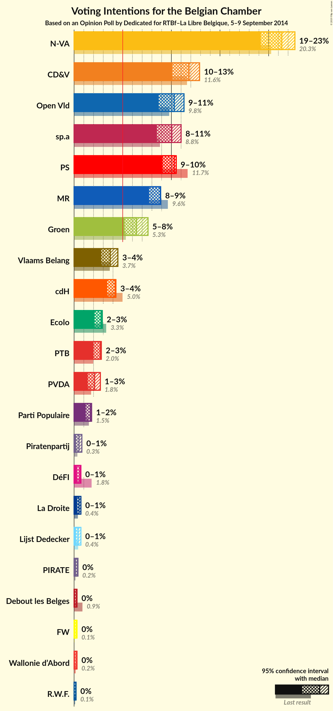
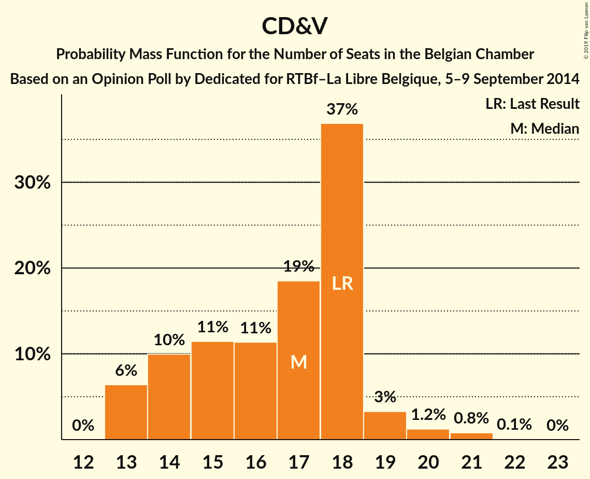
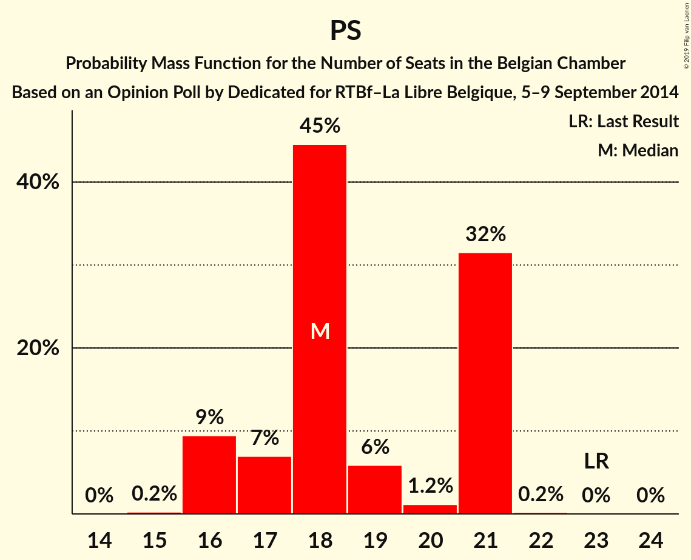
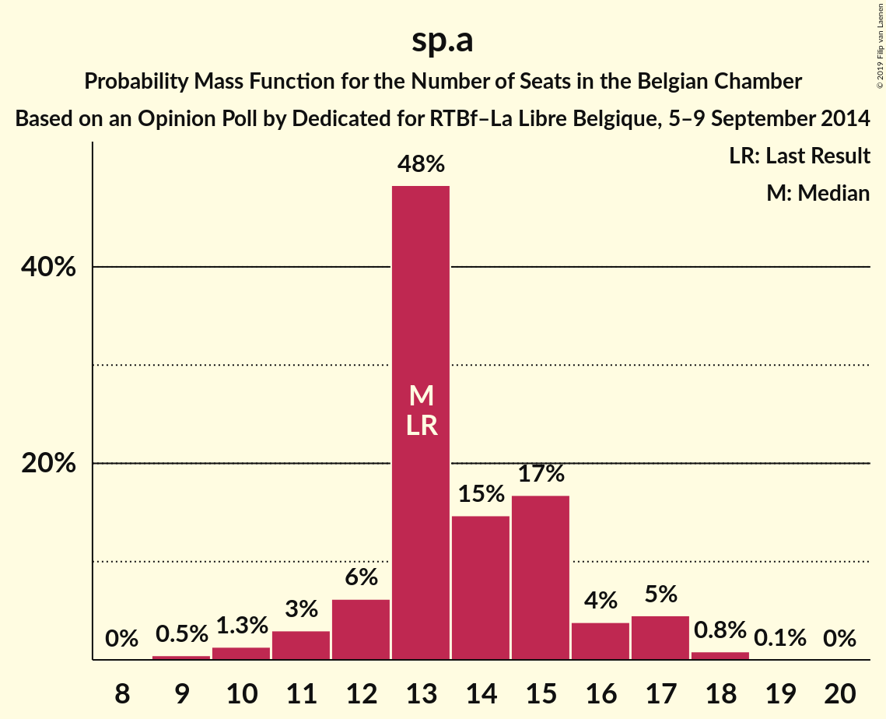
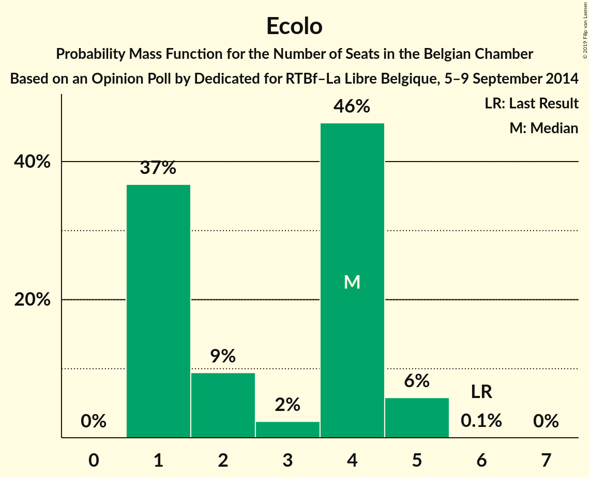
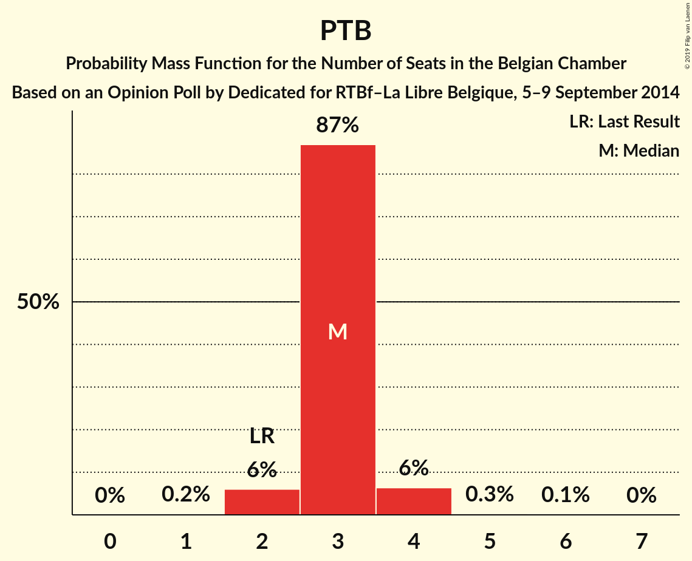
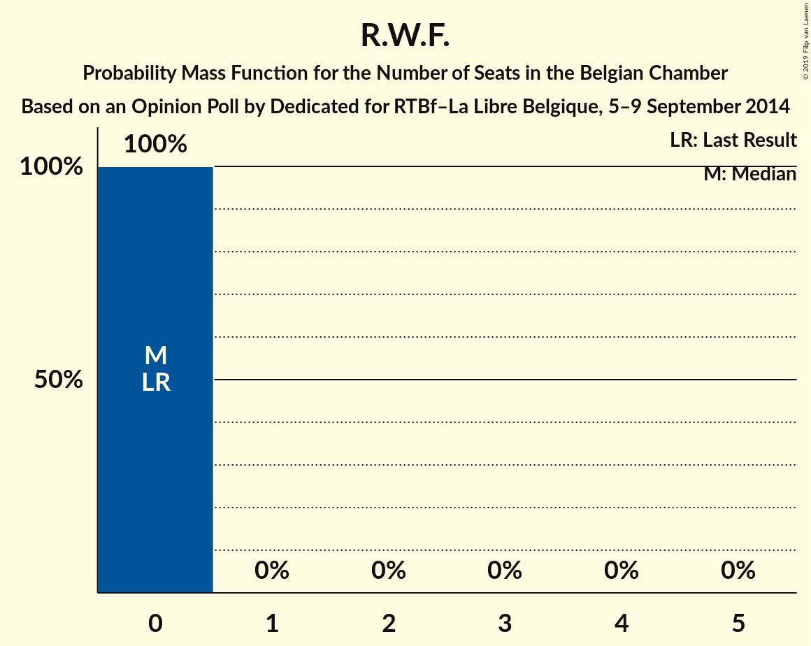

# Opinion Poll by Dedicated for RTBf–La Libre Belgique, 5–9 September 2014

Areas included: Flanders, Wallonia

<a href="#voting-intentions">Voting Intentions</a> | <a href="#seats">Seats</a> | <a href="#coalitions">Coalitions</a> | <a href="#technical-information">Technical Information</a>

## Voting Intentions

### Confidence Intervals

| Party | Last Result | Poll Result | 80% Confidence Interval | 90% Confidence Interval | 95% Confidence Interval | 99% Confidence Interval |
|:-----:|:-----------:|:-----------:|:-----------------------:|:-----------------------:|:-----------------------:|:-----------------------:|
| N-VA | 20.3% | 21.4% | 29.9–34.1% |29.3–34.8% |28.8–35.3% |27.8–36.3% |
| CD&V | 11.6% | 11.8% | 16.0–19.5% |15.6–20.0% |15.2–20.5% |14.4–21.4% |
| Open Vld | 9.8% | 10.3% | 13.9–17.2% |13.4–17.7% |13.0–18.1% |12.3–19.0% |
| PS | 11.7% | 10.3% | N/A |N/A |N/A |N/A |
| sp.a | 8.8% | 10.0% | 13.5–16.8% |13.1–17.3% |12.7–17.7% |12.0–18.5% |
| MR | 9.6% | 8.9% | N/A |N/A |N/A |N/A |
| Groen | 5.3% | 6.4% | 8.4–11.1% |8.0–11.5% |7.7–11.9% |7.2–12.6% |
| cdH | 5.0% | 4.2% | N/A |N/A |N/A |N/A |
| Vlaams Belang | 3.7% | 3.7% | 4.6–6.8% |4.4–7.1% |4.2–7.4% |3.8–8.0% |
| Ecolo | 3.3% | 2.8% | N/A |N/A |N/A |N/A |
| PTB | 2.0% | 2.7% | N/A |N/A |N/A |N/A |
| PVDA | 1.8% | 2.1% | 2.5–4.1% |2.3–4.4% |2.1–4.6% |1.9–5.1% |
| Parti Populaire | 1.5% | 1.7% | N/A |N/A |N/A |N/A |
| DéFI | 1.8% | 0.6% | N/A |N/A |N/A |N/A |
| Piratenpartij | 0.3% | 0.5% | 0.5–1.3% |0.4–1.5% |0.4–1.6% |0.2–2.0% |
| La Droite | 0.4% | 0.5% | N/A |N/A |N/A |N/A |
| Lijst Dedecker | 0.4% | 0.4% | 0.4–1.2% |0.3–1.3% |0.3–1.5% |0.2–1.8% |
| PIRATE | 0.1% | 0.3% | N/A |N/A |N/A |N/A |
| Wallonie d’Abord | 0.2% | 0.3% | N/A |N/A |N/A |N/A |
| Debout les Belges | 0.9% | 0.3% | N/A |N/A |N/A |N/A |
| FW | 0.1% | 0.3% | N/A |N/A |N/A |N/A |
| R.W.F. | 0.1% | 0.2% | N/A |N/A |N/A |N/A |

*Note:* The poll result column reflects the actual value used in the calculations. Published results may vary slightly, and in addition be rounded to fewer digits.

## Seats

### Confidence Intervals

| Party | Last Result | Median | 80% Confidence Interval | 90% Confidence Interval | 95% Confidence Interval | 99% Confidence Interval |
|:-----:|:-----------:|:------:|:-----------------------:|:-----------------------:|:-----------------------:|:-----------------------:|
| <a href="#n-va">N-VA</a> | 33 | 31 | 29–34 |29–34 |28–35 |27–37 |
| <a href="#cd&v">CD&V</a> | 18 | 17 | 14–18 |13–19 |13–19 |13–21 |
| <a href="#open-vld">Open Vld</a> | 14 | 14 | 12–17 |12–17 |12–18 |11–18 |
| <a href="#ps">PS</a> | 23 | 18 | 18 |17–18 |17–19 |15–20 |
| <a href="#sp.a">sp.a</a> | 13 | 13 | 13–15 |12–16 |11–17 |10–18 |
| <a href="#mr">MR</a> | 20 | 14 | 14–15 |14–18 |14–19 |14–19 |
| <a href="#groen">Groen</a> | 6 | 8 | 6–10 |6–10 |5–10 |5–12 |
| <a href="#cdh">cdH</a> | 9 | 7 | 7 |7 |4–8 |4–8 |
| <a href="#vlaams-belang">Vlaams Belang</a> | 3 | 3 | 2–5 |1–6 |1–6 |0–7 |
| <a href="#ecolo">Ecolo</a> | 6 | 4 | 4 |2–4 |2–5 |1–5 |
| <a href="#ptb">PTB</a> | 2 | 3 | 3 |3–4 |3–4 |2–4 |
| <a href="#pvda">PVDA</a> | 0 | 0 | 0 |0 |0 |0 |
| <a href="#parti-populaire">Parti Populaire</a> | 1 | 2 | 1–2 |1–2 |0–2 |0–2 |
| <a href="#défi">DéFI</a> | 2 | 0 | 0 |0 |0 |0 |
| <a href="#piratenpartij">Piratenpartij</a> | 0 | 0 | 0 |0 |0 |0 |
| <a href="#la-droite">La Droite</a> | 0 | 0 | 0 |0 |0 |0 |
| <a href="#lijst-dedecker">Lijst Dedecker</a> | 0 | 0 | 0–1 |0–1 |0–1 |0–1 |
| <a href="#pirate">PIRATE</a> | 0 | 0 | 0 |0 |0 |0 |
| <a href="#wallonie-d’abord">Wallonie d’Abord</a> | 0 | 0 | 0 |0 |0 |0 |
| <a href="#debout-les-belges">Debout les Belges</a> | 0 | 0 | 0 |0 |0 |0 |
| <a href="#fw">FW</a> | 0 | 0 | 0 |0 |0 |0 |
| <a href="#r.w.f.">R.W.F.</a> | 0 | 0 | 0 |0 |0 |0 |

### N-VA

*For a full overview of the results for this party, see the [N-VA](party-n-va.html) page.*

| Number of Seats | Probability | Accumulated | Special Marks |
|:---------------:|:-----------:|:-----------:|:-------------:|
| 26 | 0.1% | 100% |  |
| 27 | 0.6% | 99.8% |  |
| 28 | 3% | 99.2% |  |
| 29 | 8% | 96% |  |
| 30 | 6% | 88% |  |
| 31 | 39% | 82% | Median |
| 32 | 11% | 43% |  |
| 33 | 22% | 32% | Last Result |
| 34 | 7% | 11% |  |
| 35 | 2% | 4% |  |
| 36 | 1.1% | 2% |  |
| 37 | 0.9% | 1.0% |  |
| 38 | 0% | 0.1% |  |
| 39 | 0.1% | 0.1% |  |
| 40 | 0% | 0% |  |

### CD&V

*For a full overview of the results for this party, see the [CD&V](party-cdv.html) page.*

| Number of Seats | Probability | Accumulated | Special Marks |
|:---------------:|:-----------:|:-----------:|:-------------:|
| 13 | 8% | 100% |  |
| 14 | 9% | 92% |  |
| 15 | 11% | 83% |  |
| 16 | 15% | 72% |  |
| 17 | 16% | 57% | Median |
| 18 | 35% | 41% | Last Result |
| 19 | 4% | 6% |  |
| 20 | 1.4% | 2% |  |
| 21 | 0.6% | 0.7% |  |
| 22 | 0.1% | 0.1% |  |
| 23 | 0% | 0% |  |

### Open Vld

*For a full overview of the results for this party, see the [Open Vld](party-openvld.html) page.*

| Number of Seats | Probability | Accumulated | Special Marks |
|:---------------:|:-----------:|:-----------:|:-------------:|
| 10 | 0.1% | 100% |  |
| 11 | 2% | 99.9% |  |
| 12 | 18% | 98% |  |
| 13 | 29% | 80% |  |
| 14 | 13% | 51% | Last Result, Median |
| 15 | 6% | 38% |  |
| 16 | 10% | 32% |  |
| 17 | 19% | 21% |  |
| 18 | 2% | 3% |  |
| 19 | 0% | 0.1% |  |
| 20 | 0% | 0% |  |

### PS

*For a full overview of the results for this party, see the [PS](party-ps.html) page.*

| Number of Seats | Probability | Accumulated | Special Marks |
|:---------------:|:-----------:|:-----------:|:-------------:|
| 15 | 0.6% | 100% |  |
| 16 | 0.3% | 99.4% |  |
| 17 | 7% | 99.1% |  |
| 18 | 87% | 92% | Median |
| 19 | 3% | 4% |  |
| 20 | 1.0% | 1.4% |  |
| 21 | 0.2% | 0.4% |  |
| 22 | 0.2% | 0.2% |  |
| 23 | 0% | 0% | Last Result |

### sp.a

*For a full overview of the results for this party, see the [sp.a](party-spa.html) page.*

| Number of Seats | Probability | Accumulated | Special Marks |
|:---------------:|:-----------:|:-----------:|:-------------:|
| 9 | 0.4% | 100% |  |
| 10 | 0.7% | 99.6% |  |
| 11 | 3% | 98.9% |  |
| 12 | 6% | 96% |  |
| 13 | 47% | 90% | Last Result, Median |
| 14 | 18% | 44% |  |
| 15 | 17% | 25% |  |
| 16 | 4% | 8% |  |
| 17 | 3% | 4% |  |
| 18 | 0.8% | 0.9% |  |
| 19 | 0.1% | 0.1% |  |
| 20 | 0% | 0% |  |

### MR

*For a full overview of the results for this party, see the [MR](party-mr.html) page.*

| Number of Seats | Probability | Accumulated | Special Marks |
|:---------------:|:-----------:|:-----------:|:-------------:|
| 13 | 0.1% | 100% |  |
| 14 | 88% | 99.9% | Median |
| 15 | 3% | 12% |  |
| 16 | 3% | 9% |  |
| 17 | 0.9% | 6% |  |
| 18 | 2% | 5% |  |
| 19 | 3% | 3% |  |
| 20 | 0% | 0.1% | Last Result |
| 21 | 0% | 0% |  |

### Groen

*For a full overview of the results for this party, see the [Groen](party-groen.html) page.*

| Number of Seats | Probability | Accumulated | Special Marks |
|:---------------:|:-----------:|:-----------:|:-------------:|
| 5 | 3% | 100% |  |
| 6 | 34% | 97% | Last Result |
| 7 | 4% | 63% |  |
| 8 | 31% | 59% | Median |
| 9 | 10% | 28% |  |
| 10 | 17% | 18% |  |
| 11 | 0.5% | 1.2% |  |
| 12 | 0.7% | 0.7% |  |
| 13 | 0% | 0% |  |

### cdH

*For a full overview of the results for this party, see the [cdH](party-cdh.html) page.*

| Number of Seats | Probability | Accumulated | Special Marks |
|:---------------:|:-----------:|:-----------:|:-------------:|
| 4 | 3% | 100% |  |
| 5 | 0.8% | 97% |  |
| 6 | 0.3% | 96% |  |
| 7 | 93% | 96% | Median |
| 8 | 3% | 3% |  |
| 9 | 0.1% | 0.2% | Last Result |
| 10 | 0% | 0.1% |  |
| 11 | 0.1% | 0.1% |  |
| 12 | 0% | 0% |  |

### Vlaams Belang

*For a full overview of the results for this party, see the [Vlaams Belang](party-vlaamsbelang.html) page.*

| Number of Seats | Probability | Accumulated | Special Marks |
|:---------------:|:-----------:|:-----------:|:-------------:|
| 0 | 2% | 100% |  |
| 1 | 6% | 98% |  |
| 2 | 37% | 92% |  |
| 3 | 22% | 55% | Last Result, Median |
| 4 | 11% | 33% |  |
| 5 | 16% | 22% |  |
| 6 | 5% | 6% |  |
| 7 | 0.5% | 0.6% |  |
| 8 | 0% | 0% |  |

### Ecolo

*For a full overview of the results for this party, see the [Ecolo](party-ecolo.html) page.*

| Number of Seats | Probability | Accumulated | Special Marks |
|:---------------:|:-----------:|:-----------:|:-------------:|
| 1 | 2% | 100% |  |
| 2 | 4% | 98% |  |
| 3 | 1.5% | 94% |  |
| 4 | 90% | 92% | Median |
| 5 | 3% | 3% |  |
| 6 | 0% | 0% | Last Result |

### PTB

*For a full overview of the results for this party, see the [PTB](party-ptb.html) page.*

| Number of Seats | Probability | Accumulated | Special Marks |
|:---------------:|:-----------:|:-----------:|:-------------:|
| 1 | 0.5% | 100% |  |
| 2 | 2% | 99.5% | Last Result |
| 3 | 89% | 98% | Median |
| 4 | 8% | 8% |  |
| 5 | 0.3% | 0.3% |  |
| 6 | 0% | 0% |  |

### PVDA

*For a full overview of the results for this party, see the [PVDA](party-pvda.html) page.*

| Number of Seats | Probability | Accumulated | Special Marks |
|:---------------:|:-----------:|:-----------:|:-------------:|
| 0 | 100% | 100% | Last Result, Median |

### Parti Populaire

*For a full overview of the results for this party, see the [Parti Populaire](party-partipopulaire.html) page.*

| Number of Seats | Probability | Accumulated | Special Marks |
|:---------------:|:-----------:|:-----------:|:-------------:|
| 0 | 5% | 100% |  |
| 1 | 7% | 95% | Last Result |
| 2 | 89% | 89% | Median |
| 3 | 0% | 0% |  |

### DéFI

*For a full overview of the results for this party, see the [DéFI](party-défi.html) page.*

| Number of Seats | Probability | Accumulated | Special Marks |
|:---------------:|:-----------:|:-----------:|:-------------:|
| 0 | 100% | 100% | Median |
| 1 | 0% | 0% |  |
| 2 | 0% | 0% | Last Result |

### Piratenpartij

*For a full overview of the results for this party, see the [Piratenpartij](party-piratenpartij.html) page.*

| Number of Seats | Probability | Accumulated | Special Marks |
|:---------------:|:-----------:|:-----------:|:-------------:|
| 0 | 100% | 100% | Last Result, Median |

### La Droite

*For a full overview of the results for this party, see the [La Droite](party-ladroite.html) page.*

| Number of Seats | Probability | Accumulated | Special Marks |
|:---------------:|:-----------:|:-----------:|:-------------:|
| 0 | 100% | 100% | Last Result, Median |

### Lijst Dedecker

*For a full overview of the results for this party, see the [Lijst Dedecker](party-lijstdedecker.html) page.*

| Number of Seats | Probability | Accumulated | Special Marks |
|:---------------:|:-----------:|:-----------:|:-------------:|
| 0 | 76% | 100% | Last Result, Median |
| 1 | 23% | 24% |  |
| 2 | 0.2% | 0.2% |  |
| 3 | 0% | 0% |  |

### PIRATE

*For a full overview of the results for this party, see the [PIRATE](party-pirate.html) page.*

| Number of Seats | Probability | Accumulated | Special Marks |
|:---------------:|:-----------:|:-----------:|:-------------:|
| 0 | 100% | 100% | Last Result, Median |

### Wallonie d’Abord

*For a full overview of the results for this party, see the [Wallonie d’Abord](party-wallonied’abord.html) page.*

| Number of Seats | Probability | Accumulated | Special Marks |
|:---------------:|:-----------:|:-----------:|:-------------:|
| 0 | 100% | 100% | Last Result, Median |

### Debout les Belges

*For a full overview of the results for this party, see the [Debout les Belges](party-deboutlesbelges.html) page.*

| Number of Seats | Probability | Accumulated | Special Marks |
|:---------------:|:-----------:|:-----------:|:-------------:|
| 0 | 100% | 100% | Last Result, Median |

### FW

*For a full overview of the results for this party, see the [FW](party-fw.html) page.*

| Number of Seats | Probability | Accumulated | Special Marks |
|:---------------:|:-----------:|:-----------:|:-------------:|
| 0 | 100% | 100% | Last Result, Median |

### R.W.F.

*For a full overview of the results for this party, see the [R.W.F.](party-rwf.html) page.*

| Number of Seats | Probability | Accumulated | Special Marks |
|:---------------:|:-----------:|:-----------:|:-------------:|
| 0 | 100% | 100% | Last Result, Median |

## Coalitions

### Confidence Intervals

| Coalition | Last Result | Median | Majority? | 80% Confidence Interval | 90% Confidence Interval | 95% Confidence Interval | 99% Confidence Interval |
|:---------:|:-----------:|:------:|:---------:|:-----------------------:|:-----------------------:|:-----------------------:|:-----------------------:|
| CD&V – Open Vld – PS – sp.a – MR – Groen – cdH – Ecolo | 109 | 95 | 100% | 92–98 | 92–99 | 91–99 | 89–101 |
| CD&V – Open Vld – PS – sp.a – MR – cdH | 97 | 84 | 100% | 81–86 | 80–87 | 80–88 | 78–90 |
| N-VA – CD&V – Open Vld – MR – cdH | 94 | 84 | 100% | 81–87 | 80–87 | 79–88 | 77–90 |
| N-VA – CD&V – Open Vld – MR | 85 | 77 | 69% | 74–80 | 73–81 | 72–82 | 70–84 |
| Open Vld – PS – sp.a – MR – Groen – Ecolo | 82 | 72 | 6% | 69–75 | 68–76 | 68–77 | 66–78 |
| CD&V – Open Vld – PS – MR – cdH | 84 | 70 | 1.3% | 67–73 | 66–74 | 65–75 | 64–76 |
| CD&V – PS – sp.a – Groen – cdH – Ecolo – PTB – PVDA | 77 | 70 | 0.3% | 67–73 | 65–73 | 65–74 | 63–75 |
| CD&V – PS – sp.a – Groen – cdH – Ecolo | 75 | 67 | 0% | 63–70 | 62–70 | 62–71 | 60–72 |
| Open Vld – PS – sp.a – MR | 70 | 60 | 0% | 57–63 | 57–65 | 56–65 | 55–68 |
| CD&V – PS – sp.a – cdH | 63 | 55 | 0% | 52–58 | 52–58 | 51–59 | 50–60 |
| PS – sp.a – Groen – cdH – Ecolo – PTB – PVDA | 59 | 53 | 0% | 51–56 | 50–57 | 49–58 | 47–59 |
| CD&V – Open Vld – MR – cdH | 61 | 52 | 0% | 49–55 | 48–56 | 47–57 | 46–59 |
| PS – sp.a – Groen – Ecolo – PTB – PVDA | 50 | 46 | 0% | 44–49 | 43–50 | 42–51 | 40–52 |
| CD&V – Open Vld – MR – Groen – cdH – Ecolo | 73 | 25 | 0% | 25 | 25–27 | 25–27 | 24–28 |

### CD&V – Open Vld – PS – sp.a – MR – Groen – cdH – Ecolo

| Number of Seats | Probability | Accumulated | Special Marks |
|:---------------:|:-----------:|:-----------:|:-------------:|
| 88 | 0.2% | 100% |  |
| 89 | 0.3% | 99.8% |  |
| 90 | 0.4% | 99.5% |  |
| 91 | 2% | 99.0% |  |
| 92 | 8% | 97% |  |
| 93 | 7% | 89% |  |
| 94 | 21% | 82% |  |
| 95 | 17% | 62% | Median |
| 96 | 21% | 45% |  |
| 97 | 8% | 23% |  |
| 98 | 8% | 15% |  |
| 99 | 5% | 7% |  |
| 100 | 1.0% | 2% |  |
| 101 | 0.5% | 0.8% |  |
| 102 | 0.2% | 0.2% |  |
| 103 | 0% | 0% |  |
| 104 | 0% | 0% |  |
| 105 | 0% | 0% |  |
| 106 | 0% | 0% |  |
| 107 | 0% | 0% |  |
| 108 | 0% | 0% |  |
| 109 | 0% | 0% | Last Result |

### CD&V – Open Vld – PS – sp.a – MR – cdH

| Number of Seats | Probability | Accumulated | Special Marks |
|:---------------:|:-----------:|:-----------:|:-------------:|
| 76 | 0.1% | 100% | Majority |
| 77 | 0.3% | 99.9% |  |
| 78 | 0.6% | 99.6% |  |
| 79 | 1.1% | 99.0% |  |
| 80 | 6% | 98% |  |
| 81 | 10% | 92% |  |
| 82 | 12% | 81% |  |
| 83 | 12% | 69% | Median |
| 84 | 22% | 57% |  |
| 85 | 14% | 35% |  |
| 86 | 12% | 21% |  |
| 87 | 4% | 9% |  |
| 88 | 2% | 5% |  |
| 89 | 2% | 2% |  |
| 90 | 0.5% | 0.7% |  |
| 91 | 0.2% | 0.3% |  |
| 92 | 0.1% | 0.1% |  |
| 93 | 0% | 0% |  |
| 94 | 0% | 0% |  |
| 95 | 0% | 0% |  |
| 96 | 0% | 0% |  |
| 97 | 0% | 0% | Last Result |

### N-VA – CD&V – Open Vld – MR – cdH

| Number of Seats | Probability | Accumulated | Special Marks |
|:---------------:|:-----------:|:-----------:|:-------------:|
| 76 | 0% | 100% | Majority |
| 77 | 0.8% | 99.9% |  |
| 78 | 2% | 99.1% |  |
| 79 | 2% | 98% |  |
| 80 | 4% | 96% |  |
| 81 | 11% | 92% |  |
| 82 | 13% | 81% |  |
| 83 | 16% | 69% | Median |
| 84 | 20% | 53% |  |
| 85 | 14% | 33% |  |
| 86 | 7% | 20% |  |
| 87 | 8% | 12% |  |
| 88 | 3% | 5% |  |
| 89 | 1.2% | 2% |  |
| 90 | 0.5% | 0.8% |  |
| 91 | 0.2% | 0.4% |  |
| 92 | 0.1% | 0.2% |  |
| 93 | 0% | 0% |  |
| 94 | 0% | 0% | Last Result |

### N-VA – CD&V – Open Vld – MR

| Number of Seats | Probability | Accumulated | Special Marks |
|:---------------:|:-----------:|:-----------:|:-------------:|
| 70 | 0.8% | 100% |  |
| 71 | 2% | 99.1% |  |
| 72 | 2% | 98% |  |
| 73 | 3% | 96% |  |
| 74 | 11% | 92% |  |
| 75 | 13% | 82% |  |
| 76 | 15% | 69% | Median, Majority |
| 77 | 19% | 54% |  |
| 78 | 14% | 34% |  |
| 79 | 7% | 21% |  |
| 80 | 8% | 14% |  |
| 81 | 3% | 6% |  |
| 82 | 2% | 3% |  |
| 83 | 0.7% | 1.5% |  |
| 84 | 0.4% | 0.7% |  |
| 85 | 0.3% | 0.4% | Last Result |
| 86 | 0.1% | 0.1% |  |
| 87 | 0% | 0% |  |

### Open Vld – PS – sp.a – MR – Groen – Ecolo

| Number of Seats | Probability | Accumulated | Special Marks |
|:---------------:|:-----------:|:-----------:|:-------------:|
| 64 | 0.1% | 100% |  |
| 65 | 0.1% | 99.9% |  |
| 66 | 0.7% | 99.8% |  |
| 67 | 1.3% | 99.1% |  |
| 68 | 6% | 98% |  |
| 69 | 12% | 92% |  |
| 70 | 9% | 80% |  |
| 71 | 21% | 72% | Median |
| 72 | 10% | 51% |  |
| 73 | 18% | 41% |  |
| 74 | 13% | 23% |  |
| 75 | 4% | 10% |  |
| 76 | 3% | 6% | Majority |
| 77 | 2% | 3% |  |
| 78 | 1.0% | 1.4% |  |
| 79 | 0.2% | 0.3% |  |
| 80 | 0.1% | 0.2% |  |
| 81 | 0% | 0.1% |  |
| 82 | 0% | 0% | Last Result |

### CD&V – Open Vld – PS – MR – cdH

| Number of Seats | Probability | Accumulated | Special Marks |
|:---------------:|:-----------:|:-----------:|:-------------:|
| 63 | 0.1% | 100% |  |
| 64 | 1.2% | 99.9% |  |
| 65 | 2% | 98.7% |  |
| 66 | 4% | 96% |  |
| 67 | 6% | 92% |  |
| 68 | 7% | 86% |  |
| 69 | 22% | 79% |  |
| 70 | 15% | 57% | Median |
| 71 | 14% | 42% |  |
| 72 | 16% | 28% |  |
| 73 | 6% | 12% |  |
| 74 | 3% | 6% |  |
| 75 | 2% | 3% |  |
| 76 | 0.9% | 1.3% | Majority |
| 77 | 0.2% | 0.4% |  |
| 78 | 0.1% | 0.1% |  |
| 79 | 0% | 0% |  |
| 80 | 0% | 0% |  |
| 81 | 0% | 0% |  |
| 82 | 0% | 0% |  |
| 83 | 0% | 0% |  |
| 84 | 0% | 0% | Last Result |

### CD&V – PS – sp.a – Groen – cdH – Ecolo – PTB – PVDA

| Number of Seats | Probability | Accumulated | Special Marks |
|:---------------:|:-----------:|:-----------:|:-------------:|
| 61 | 0.1% | 100% |  |
| 62 | 0.2% | 99.8% |  |
| 63 | 0.4% | 99.7% |  |
| 64 | 1.0% | 99.2% |  |
| 65 | 4% | 98% |  |
| 66 | 4% | 94% |  |
| 67 | 9% | 90% |  |
| 68 | 16% | 81% |  |
| 69 | 14% | 65% |  |
| 70 | 12% | 51% | Median |
| 71 | 13% | 39% |  |
| 72 | 10% | 27% |  |
| 73 | 13% | 17% |  |
| 74 | 3% | 4% |  |
| 75 | 1.3% | 2% |  |
| 76 | 0.2% | 0.3% | Majority |
| 77 | 0.1% | 0.1% | Last Result |
| 78 | 0% | 0% |  |

### CD&V – PS – sp.a – Groen – cdH – Ecolo

| Number of Seats | Probability | Accumulated | Special Marks |
|:---------------:|:-----------:|:-----------:|:-------------:|
| 58 | 0.1% | 100% |  |
| 59 | 0.3% | 99.8% |  |
| 60 | 0.5% | 99.6% |  |
| 61 | 1.2% | 99.1% |  |
| 62 | 4% | 98% |  |
| 63 | 4% | 93% |  |
| 64 | 9% | 90% |  |
| 65 | 16% | 80% |  |
| 66 | 14% | 65% |  |
| 67 | 12% | 51% | Median |
| 68 | 12% | 38% |  |
| 69 | 10% | 26% |  |
| 70 | 12% | 16% |  |
| 71 | 3% | 4% |  |
| 72 | 1.3% | 2% |  |
| 73 | 0.2% | 0.3% |  |
| 74 | 0.1% | 0.1% |  |
| 75 | 0% | 0% | Last Result |

### Open Vld – PS – sp.a – MR

| Number of Seats | Probability | Accumulated | Special Marks |
|:---------------:|:-----------:|:-----------:|:-------------:|
| 53 | 0% | 100% |  |
| 54 | 0.1% | 99.9% |  |
| 55 | 0.5% | 99.8% |  |
| 56 | 3% | 99.3% |  |
| 57 | 9% | 96% |  |
| 58 | 12% | 87% |  |
| 59 | 21% | 75% | Median |
| 60 | 10% | 54% |  |
| 61 | 13% | 44% |  |
| 62 | 13% | 32% |  |
| 63 | 11% | 19% |  |
| 64 | 2% | 8% |  |
| 65 | 3% | 5% |  |
| 66 | 1.0% | 2% |  |
| 67 | 0.6% | 1.5% |  |
| 68 | 0.5% | 0.9% |  |
| 69 | 0.3% | 0.4% |  |
| 70 | 0% | 0.1% | Last Result |
| 71 | 0% | 0.1% |  |
| 72 | 0% | 0% |  |

### CD&V – PS – sp.a – cdH

| Number of Seats | Probability | Accumulated | Special Marks |
|:---------------:|:-----------:|:-----------:|:-------------:|
| 48 | 0.1% | 100% |  |
| 49 | 0.4% | 99.9% |  |
| 50 | 0.7% | 99.6% |  |
| 51 | 3% | 98.8% |  |
| 52 | 7% | 96% |  |
| 53 | 11% | 89% |  |
| 54 | 15% | 78% |  |
| 55 | 20% | 63% | Median |
| 56 | 20% | 42% |  |
| 57 | 9% | 23% |  |
| 58 | 10% | 14% |  |
| 59 | 2% | 4% |  |
| 60 | 0.8% | 1.1% |  |
| 61 | 0.2% | 0.3% |  |
| 62 | 0.1% | 0.1% |  |
| 63 | 0% | 0% | Last Result |

### PS – sp.a – Groen – cdH – Ecolo – PTB – PVDA

| Number of Seats | Probability | Accumulated | Special Marks |
|:---------------:|:-----------:|:-----------:|:-------------:|
| 45 | 0.1% | 100% |  |
| 46 | 0.1% | 99.9% |  |
| 47 | 0.9% | 99.8% |  |
| 48 | 0.9% | 98.9% |  |
| 49 | 2% | 98% |  |
| 50 | 3% | 96% |  |
| 51 | 20% | 92% |  |
| 52 | 12% | 72% |  |
| 53 | 18% | 61% | Median |
| 54 | 13% | 43% |  |
| 55 | 16% | 30% |  |
| 56 | 7% | 14% |  |
| 57 | 3% | 7% |  |
| 58 | 3% | 3% |  |
| 59 | 0.4% | 0.5% | Last Result |
| 60 | 0.1% | 0.1% |  |
| 61 | 0% | 0% |  |

### CD&V – Open Vld – MR – cdH

| Number of Seats | Probability | Accumulated | Special Marks |
|:---------------:|:-----------:|:-----------:|:-------------:|
| 46 | 1.2% | 100% |  |
| 47 | 2% | 98.8% |  |
| 48 | 4% | 97% |  |
| 49 | 6% | 92% |  |
| 50 | 6% | 86% |  |
| 51 | 23% | 80% |  |
| 52 | 15% | 57% | Median |
| 53 | 14% | 42% |  |
| 54 | 16% | 28% |  |
| 55 | 6% | 12% |  |
| 56 | 3% | 6% |  |
| 57 | 1.3% | 3% |  |
| 58 | 0.8% | 1.4% |  |
| 59 | 0.4% | 0.6% |  |
| 60 | 0.1% | 0.2% |  |
| 61 | 0% | 0% | Last Result |

### PS – sp.a – Groen – Ecolo – PTB – PVDA

| Number of Seats | Probability | Accumulated | Special Marks |
|:---------------:|:-----------:|:-----------:|:-------------:|
| 39 | 0.1% | 100% |  |
| 40 | 0.5% | 99.9% |  |
| 41 | 0.5% | 99.4% |  |
| 42 | 2% | 98.9% |  |
| 43 | 3% | 97% |  |
| 44 | 20% | 94% |  |
| 45 | 12% | 74% |  |
| 46 | 18% | 62% | Median |
| 47 | 14% | 44% |  |
| 48 | 16% | 30% |  |
| 49 | 8% | 14% |  |
| 50 | 3% | 7% | Last Result |
| 51 | 3% | 3% |  |
| 52 | 0.5% | 0.6% |  |
| 53 | 0.1% | 0.1% |  |
| 54 | 0% | 0% |  |

### CD&V – Open Vld – MR – Groen – cdH – Ecolo

| Number of Seats | Probability | Accumulated | Special Marks |
|:---------------:|:-----------:|:-----------:|:-------------:|
| 21 | 0.1% | 100% |  |
| 22 | 0.1% | 99.9% |  |
| 23 | 0.2% | 99.8% |  |
| 24 | 0.4% | 99.6% |  |
| 25 | 90% | 99.2% |  |
| 26 | 3% | 9% |  |
| 27 | 5% | 6% |  |
| 28 | 0.5% | 0.6% |  |
| 29 | 0% | 0% |  |
| 30 | 0% | 0% |  |
| 31 | 0% | 0% |  |
| 32 | 0% | 0% |  |
| 33 | 0% | 0% |  |
| 34 | 0% | 0% |  |
| 35 | 0% | 0% |  |
| 36 | 0% | 0% |  |
| 37 | 0% | 0% |  |
| 38 | 0% | 0% |  |
| 39 | 0% | 0% |  |
| 40 | 0% | 0% |  |
| 41 | 0% | 0% |  |
| 42 | 0% | 0% |  |
| 43 | 0% | 0% |  |
| 44 | 0% | 0% |  |
| 45 | 0% | 0% |  |
| 46 | 0% | 0% |  |
| 47 | 0% | 0% |  |
| 48 | 0% | 0% |  |
| 49 | 0% | 0% |  |
| 50 | 0% | 0% |  |
| 51 | 0% | 0% |  |
| 52 | 0% | 0% |  |
| 53 | 0% | 0% |  |
| 54 | 0% | 0% |  |
| 55 | 0% | 0% |  |
| 56 | 0% | 0% |  |
| 57 | 0% | 0% |  |
| 58 | 0% | 0% |  |
| 59 | 0% | 0% |  |
| 60 | 0% | 0% |  |
| 61 | 0% | 0% |  |
| 62 | 0% | 0% |  |
| 63 | 0% | 0% |  |
| 64 | 0% | 0% | Median |
| 65 | 0% | 0% |  |
| 66 | 0% | 0% |  |
| 67 | 0% | 0% |  |
| 68 | 0% | 0% |  |
| 69 | 0% | 0% |  |
| 70 | 0% | 0% |  |
| 71 | 0% | 0% |  |
| 72 | 0% | 0% |  |
| 73 | 0% | 0% | Last Result |

## Technical Information

### Opinion Poll

+ **Polling firm:** Dedicated
+ **Commissioner(s):** RTBf–La Libre Belgique
+ **Fieldwork period:** 5–9 September 2014

### Calculations

+ **Sample size:** 1185
+ **Simulations done:** 1,048,576
+ **Error estimate:** 1.69%

