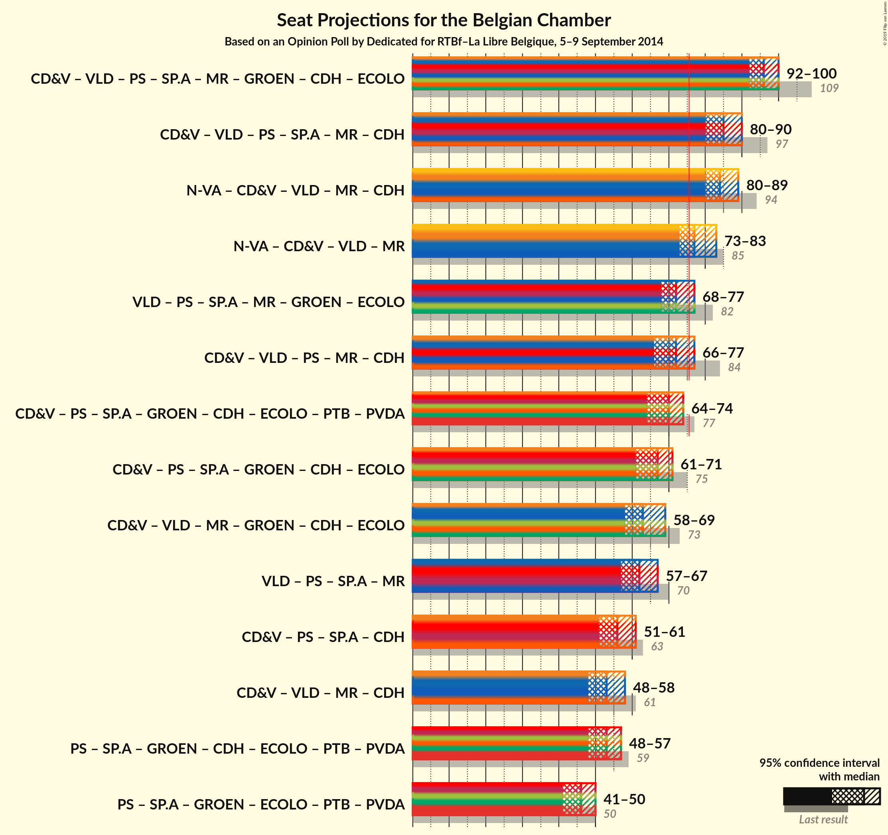

# Opinion Poll by Dedicated for RTBf–La Libre Belgique, 5–9 September 2014

Areas included: Flanders, Wallonia

<a href="#voting-intentions">Voting Intentions</a> | <a href="#seats">Seats</a> | <a href="#coalitions">Coalitions</a> | <a href="#technical-information">Technical Information</a>

## Voting Intentions

### Confidence Intervals

| Party | Last Result | Poll Result | 80% Confidence Interval | 90% Confidence Interval | 95% Confidence Interval | 99% Confidence Interval |
|:-----:|:-----------:|:-----------:|:-----------------------:|:-----------------------:|:-----------------------:|:-----------------------:|
| N-VA | 20.3% | 21.4% | 29.9–34.1% |29.3–34.8% |28.8–35.3% |27.8–36.3% |
| CD&V | 11.6% | 11.8% | 16.0–19.5% |15.6–20.0% |15.2–20.5% |14.4–21.4% |
| Open Vld | 9.8% | 10.3% | 13.9–17.2% |13.4–17.7% |13.0–18.1% |12.3–19.0% |
| PS | 11.7% | 10.3% | N/A |N/A |N/A |N/A |
| sp.a | 8.8% | 10.0% | 13.5–16.8% |13.1–17.3% |12.7–17.7% |12.0–18.5% |
| MR | 9.6% | 8.9% | N/A |N/A |N/A |N/A |
| Groen | 5.3% | 6.4% | 8.4–11.1% |8.0–11.5% |7.7–11.9% |7.2–12.6% |
| cdH | 5.0% | 4.2% | N/A |N/A |N/A |N/A |
| Vlaams Belang | 3.7% | 3.7% | 4.6–6.8% |4.4–7.1% |4.2–7.4% |3.8–8.0% |
| Ecolo | 3.3% | 2.8% | N/A |N/A |N/A |N/A |
| PTB | 2.0% | 2.7% | N/A |N/A |N/A |N/A |
| PVDA | 1.8% | 2.1% | 2.5–4.1% |2.3–4.4% |2.1–4.6% |1.9–5.1% |
| Parti Populaire | 1.5% | 1.7% | N/A |N/A |N/A |N/A |
| DéFI | 1.8% | 0.6% | N/A |N/A |N/A |N/A |
| Piratenpartij | 0.3% | 0.5% | 0.5–1.3% |0.4–1.5% |0.4–1.6% |0.2–2.0% |
| La Droite | 0.4% | 0.5% | N/A |N/A |N/A |N/A |
| Lijst Dedecker | 0.4% | 0.4% | 0.4–1.2% |0.3–1.3% |0.3–1.5% |0.2–1.8% |
| PIRATE | 0.1% | 0.3% | N/A |N/A |N/A |N/A |
| Wallonie d’Abord | 0.2% | 0.3% | N/A |N/A |N/A |N/A |
| Debout les Belges | 0.9% | 0.3% | N/A |N/A |N/A |N/A |
| FW | 0.1% | 0.3% | N/A |N/A |N/A |N/A |
| R.W.F. | 0.1% | 0.2% | N/A |N/A |N/A |N/A |

*Note:* The poll result column reflects the actual value used in the calculations. Published results may vary slightly, and in addition be rounded to fewer digits.

## Seats

### Confidence Intervals

| Party | Last Result | Median | 80% Confidence Interval | 90% Confidence Interval | 95% Confidence Interval | 99% Confidence Interval |
|:-----:|:-----------:|:------:|:-----------------------:|:-----------------------:|:-----------------------:|:-----------------------:|
| <a href="#n-va">N-VA</a> | 33 | 32 | 29–34 |29–35 |28–36 |27–37 |
| <a href="#cd&v">CD&V</a> | 18 | 17 | 14–18 |14–19 |13–20 |13–21 |
| <a href="#open-vld">Open Vld</a> | 14 | 13 | 12–17 |12–17 |12–17 |11–18 |
| <a href="#ps">PS</a> | 23 | 18 | 17–20 |16–20 |16–21 |16–22 |
| <a href="#sp.a">sp.a</a> | 13 | 13 | 13–15 |12–15 |12–16 |10–18 |
| <a href="#mr">MR</a> | 20 | 16 | 14–17 |14–18 |14–19 |12–19 |
| <a href="#groen">Groen</a> | 6 | 8 | 6–10 |6–10 |5–10 |5–12 |
| <a href="#cdh">cdH</a> | 9 | 7 | 5–8 |4–8 |4–8 |4–8 |
| <a href="#vlaams-belang">Vlaams Belang</a> | 3 | 2 | 1–5 |1–5 |0–6 |0–7 |
| <a href="#ecolo">Ecolo</a> | 6 | 3 | 1–5 |1–5 |1–5 |1–6 |
| <a href="#ptb">PTB</a> | 2 | 3 | 2–4 |2–4 |2–5 |1–5 |
| <a href="#pvda">PVDA</a> | 0 | 0 | 0 |0 |0 |0 |
| <a href="#parti-populaire">Parti Populaire</a> | 1 | 1 | 0–2 |0–2 |0–2 |0–2 |
| <a href="#défi">DéFI</a> | 2 | 0 | 0 |0 |0 |0 |
| <a href="#piratenpartij">Piratenpartij</a> | 0 | 0 | 0 |0 |0 |0 |
| <a href="#la-droite">La Droite</a> | 0 | 0 | 0 |0 |0 |0 |
| <a href="#lijst-dedecker">Lijst Dedecker</a> | 0 | 0 | 0–1 |0–1 |0–1 |0–1 |
| <a href="#pirate">PIRATE</a> | 0 | 0 | 0 |0 |0 |0 |
| <a href="#wallonie-d’abord">Wallonie d’Abord</a> | 0 | 0 | 0 |0 |0 |0 |
| <a href="#debout-les-belges">Debout les Belges</a> | 0 | 0 | 0 |0 |0 |0 |
| <a href="#fw">FW</a> | 0 | 0 | 0 |0 |0 |0 |
| <a href="#r.w.f.">R.W.F.</a> | 0 | 0 | 0 |0 |0 |0 |

### N-VA

*For a full overview of the results for this party, see the [N-VA](party-nva.html) page.*

| Number of Seats | Probability | Accumulated | Special Marks |
|:---------------:|:-----------:|:-----------:|:-------------:|
| 26 | 0.2% | 100% |  |
| 27 | 0.6% | 99.8% |  |
| 28 | 3% | 99.2% |  |
| 29 | 8% | 96% |  |
| 30 | 12% | 88% |  |
| 31 | 22% | 75% |  |
| 32 | 16% | 53% | Median |
| 33 | 18% | 37% | Last Result |
| 34 | 12% | 19% |  |
| 35 | 4% | 7% |  |
| 36 | 2% | 3% |  |
| 37 | 0.8% | 0.9% |  |
| 38 | 0% | 0.1% |  |
| 39 | 0% | 0% |  |

### CD&V

*For a full overview of the results for this party, see the [CD&V](party-cdv.html) page.*

| Number of Seats | Probability | Accumulated | Special Marks |
|:---------------:|:-----------:|:-----------:|:-------------:|
| 13 | 5% | 100% |  |
| 14 | 7% | 95% |  |
| 15 | 11% | 88% |  |
| 16 | 17% | 77% |  |
| 17 | 17% | 60% | Median |
| 18 | 33% | 43% | Last Result |
| 19 | 7% | 10% |  |
| 20 | 1.5% | 3% |  |
| 21 | 1.3% | 1.4% |  |
| 22 | 0.1% | 0.1% |  |
| 23 | 0% | 0% |  |

### Open Vld

*For a full overview of the results for this party, see the [Open Vld](party-openvld.html) page.*

| Number of Seats | Probability | Accumulated | Special Marks |
|:---------------:|:-----------:|:-----------:|:-------------:|
| 11 | 2% | 100% |  |
| 12 | 17% | 98% |  |
| 13 | 36% | 80% | Median |
| 14 | 10% | 44% | Last Result |
| 15 | 9% | 35% |  |
| 16 | 6% | 26% |  |
| 17 | 19% | 21% |  |
| 18 | 2% | 2% |  |
| 19 | 0.1% | 0.1% |  |
| 20 | 0% | 0% |  |

### PS

*For a full overview of the results for this party, see the [PS](party-ps.html) page.*

| Number of Seats | Probability | Accumulated | Special Marks |
|:---------------:|:-----------:|:-----------:|:-------------:|
| 15 | 0.1% | 100% |  |
| 16 | 7% | 99.9% |  |
| 17 | 6% | 93% |  |
| 18 | 63% | 87% | Median |
| 19 | 12% | 23% |  |
| 20 | 7% | 11% |  |
| 21 | 2% | 4% |  |
| 22 | 2% | 2% |  |
| 23 | 0.1% | 0.1% | Last Result |
| 24 | 0% | 0% |  |

### sp.a

*For a full overview of the results for this party, see the [sp.a](party-spa.html) page.*

| Number of Seats | Probability | Accumulated | Special Marks |
|:---------------:|:-----------:|:-----------:|:-------------:|
| 9 | 0.4% | 100% |  |
| 10 | 0.4% | 99.6% |  |
| 11 | 0.9% | 99.1% |  |
| 12 | 3% | 98% |  |
| 13 | 53% | 95% | Last Result, Median |
| 14 | 18% | 42% |  |
| 15 | 20% | 24% |  |
| 16 | 2% | 4% |  |
| 17 | 1.3% | 2% |  |
| 18 | 0.9% | 0.9% |  |
| 19 | 0% | 0% |  |

### MR

*For a full overview of the results for this party, see the [MR](party-mr.html) page.*

| Number of Seats | Probability | Accumulated | Special Marks |
|:---------------:|:-----------:|:-----------:|:-------------:|
| 11 | 0.1% | 100% |  |
| 12 | 0.6% | 99.9% |  |
| 13 | 0.4% | 99.3% |  |
| 14 | 27% | 98.9% |  |
| 15 | 12% | 71% |  |
| 16 | 16% | 60% | Median |
| 17 | 35% | 44% |  |
| 18 | 4% | 9% |  |
| 19 | 4% | 4% |  |
| 20 | 0.3% | 0.4% | Last Result |
| 21 | 0.1% | 0.1% |  |
| 22 | 0% | 0% |  |

### Groen

*For a full overview of the results for this party, see the [Groen](party-groen.html) page.*

| Number of Seats | Probability | Accumulated | Special Marks |
|:---------------:|:-----------:|:-----------:|:-------------:|
| 5 | 4% | 100% |  |
| 6 | 27% | 96% | Last Result |
| 7 | 4% | 69% |  |
| 8 | 38% | 65% | Median |
| 9 | 16% | 27% |  |
| 10 | 9% | 11% |  |
| 11 | 1.5% | 2% |  |
| 12 | 0.8% | 0.8% |  |
| 13 | 0% | 0% |  |

### cdH

*For a full overview of the results for this party, see the [cdH](party-cdh.html) page.*

| Number of Seats | Probability | Accumulated | Special Marks |
|:---------------:|:-----------:|:-----------:|:-------------:|
| 4 | 6% | 100% |  |
| 5 | 7% | 94% |  |
| 6 | 2% | 87% |  |
| 7 | 60% | 84% | Median |
| 8 | 24% | 25% |  |
| 9 | 0.1% | 0.2% | Last Result |
| 10 | 0.1% | 0.1% |  |
| 11 | 0% | 0% |  |

### Vlaams Belang

*For a full overview of the results for this party, see the [Vlaams Belang](party-vlaamsbelang.html) page.*

| Number of Seats | Probability | Accumulated | Special Marks |
|:---------------:|:-----------:|:-----------:|:-------------:|
| 0 | 4% | 100% |  |
| 1 | 9% | 96% |  |
| 2 | 51% | 87% | Median |
| 3 | 6% | 37% | Last Result |
| 4 | 7% | 30% |  |
| 5 | 18% | 23% |  |
| 6 | 4% | 5% |  |
| 7 | 1.1% | 1.1% |  |
| 8 | 0.1% | 0.1% |  |
| 9 | 0% | 0% |  |

### Ecolo

*For a full overview of the results for this party, see the [Ecolo](party-ecolo.html) page.*

| Number of Seats | Probability | Accumulated | Special Marks |
|:---------------:|:-----------:|:-----------:|:-------------:|
| 1 | 15% | 100% |  |
| 2 | 23% | 85% |  |
| 3 | 18% | 62% | Median |
| 4 | 30% | 44% |  |
| 5 | 14% | 14% |  |
| 6 | 0.6% | 0.6% | Last Result |
| 7 | 0% | 0% |  |

### PTB

*For a full overview of the results for this party, see the [PTB](party-ptb.html) page.*

| Number of Seats | Probability | Accumulated | Special Marks |
|:---------------:|:-----------:|:-----------:|:-------------:|
| 1 | 1.2% | 100% |  |
| 2 | 26% | 98.8% | Last Result |
| 3 | 46% | 73% | Median |
| 4 | 24% | 27% |  |
| 5 | 3% | 3% |  |
| 6 | 0.2% | 0.2% |  |
| 7 | 0% | 0% |  |

### PVDA

*For a full overview of the results for this party, see the [PVDA](party-pvda.html) page.*

| Number of Seats | Probability | Accumulated | Special Marks |
|:---------------:|:-----------:|:-----------:|:-------------:|
| 0 | 100% | 100% | Last Result, Median |

### Parti Populaire

*For a full overview of the results for this party, see the [Parti Populaire](party-partipopulaire.html) page.*

| Number of Seats | Probability | Accumulated | Special Marks |
|:---------------:|:-----------:|:-----------:|:-------------:|
| 0 | 33% | 100% |  |
| 1 | 39% | 67% | Last Result, Median |
| 2 | 28% | 28% |  |
| 3 | 0% | 0% |  |

### DéFI

*For a full overview of the results for this party, see the [DéFI](party-dfi.html) page.*

| Number of Seats | Probability | Accumulated | Special Marks |
|:---------------:|:-----------:|:-----------:|:-------------:|
| 0 | 100% | 100% | Median |
| 1 | 0% | 0% |  |
| 2 | 0% | 0% | Last Result |

### Piratenpartij

*For a full overview of the results for this party, see the [Piratenpartij](party-piratenpartij.html) page.*

| Number of Seats | Probability | Accumulated | Special Marks |
|:---------------:|:-----------:|:-----------:|:-------------:|
| 0 | 100% | 100% | Last Result, Median |

### La Droite

*For a full overview of the results for this party, see the [La Droite](party-ladroite.html) page.*

| Number of Seats | Probability | Accumulated | Special Marks |
|:---------------:|:-----------:|:-----------:|:-------------:|
| 0 | 100% | 100% | Last Result, Median |

### Lijst Dedecker

*For a full overview of the results for this party, see the [Lijst Dedecker](party-lijstdedecker.html) page.*

| Number of Seats | Probability | Accumulated | Special Marks |
|:---------------:|:-----------:|:-----------:|:-------------:|
| 0 | 77% | 100% | Last Result, Median |
| 1 | 23% | 23% |  |
| 2 | 0.1% | 0.1% |  |
| 3 | 0% | 0% |  |

### PIRATE

*For a full overview of the results for this party, see the [PIRATE](party-pirate.html) page.*

| Number of Seats | Probability | Accumulated | Special Marks |
|:---------------:|:-----------:|:-----------:|:-------------:|
| 0 | 100% | 100% | Last Result, Median |

### Wallonie d’Abord

*For a full overview of the results for this party, see the [Wallonie d’Abord](party-walloniedabord.html) page.*

| Number of Seats | Probability | Accumulated | Special Marks |
|:---------------:|:-----------:|:-----------:|:-------------:|
| 0 | 100% | 100% | Last Result, Median |

### Debout les Belges

*For a full overview of the results for this party, see the [Debout les Belges](party-deboutlesbelges.html) page.*

| Number of Seats | Probability | Accumulated | Special Marks |
|:---------------:|:-----------:|:-----------:|:-------------:|
| 0 | 100% | 100% | Last Result, Median |

### FW

*For a full overview of the results for this party, see the [FW](party-fw.html) page.*

| Number of Seats | Probability | Accumulated | Special Marks |
|:---------------:|:-----------:|:-----------:|:-------------:|
| 0 | 100% | 100% | Last Result, Median |

### R.W.F.

*For a full overview of the results for this party, see the [R.W.F.](party-rwf.html) page.*

| Number of Seats | Probability | Accumulated | Special Marks |
|:---------------:|:-----------:|:-----------:|:-------------:|
| 0 | 100% | 100% | Last Result, Median |

## Coalitions

### Confidence Intervals

| Coalition | Last Result | Median | Majority? | 80% Confidence Interval | 90% Confidence Interval | 95% Confidence Interval | 99% Confidence Interval |
|:---------:|:-----------:|:------:|:---------:|:-----------------------:|:-----------------------:|:-----------------------:|:-----------------------:|
| CD&V – Open Vld – PS – sp.a – MR – Groen – cdH – Ecolo | 109 | 96 | 100% | 93–99 | 92–100 | 91–101 | 90–102 |
| CD&V – Open Vld – PS – sp.a – MR – cdH | 97 | 85 | 100% | 82–89 | 81–90 | 80–91 | 78–92 |
| N-VA – CD&V – Open Vld – MR – cdH | 94 | 85 | 100% | 82–89 | 81–89 | 80–90 | 79–91 |
| N-VA – CD&V – Open Vld – MR | 85 | 78 | 88% | 75–81 | 74–83 | 73–83 | 72–85 |
| Open Vld – PS – sp.a – MR – Groen – Ecolo | 82 | 72 | 11% | 70–76 | 69–77 | 68–78 | 67–79 |
| CD&V – PS – sp.a – Groen – cdH – Ecolo – PTB – PVDA | 77 | 69 | 1.4% | 66–73 | 65–74 | 64–75 | 62–76 |
| CD&V – PS – sp.a – Groen – cdH – Ecolo | 75 | 66 | 0% | 63–70 | 62–71 | 61–71 | 59–73 |
| Open Vld – PS – sp.a – MR | 70 | 62 | 0% | 58–65 | 58–66 | 57–67 | 56–69 |
| CD&V – PS – sp.a – cdH | 63 | 55 | 0% | 52–59 | 52–60 | 51–60 | 49–62 |
| CD&V – Open Vld – MR – cdH | 61 | 54 | 0% | 50–57 | 49–58 | 48–59 | 47–60 |
| PS – sp.a – Groen – cdH – Ecolo – PTB – PVDA | 59 | 52 | 0% | 49–56 | 49–57 | 48–57 | 46–59 |

### CD&V – Open Vld – PS – sp.a – MR – Groen – cdH – Ecolo

| Number of Seats | Probability | Accumulated | Special Marks |
|:---------------:|:-----------:|:-----------:|:-------------:|
| 88 | 0.1% | 100% |  |
| 89 | 0.4% | 99.9% |  |
| 90 | 0.6% | 99.5% |  |
| 91 | 1.4% | 98.9% |  |
| 92 | 3% | 97% |  |
| 93 | 6% | 95% |  |
| 94 | 13% | 89% |  |
| 95 | 16% | 76% | Median |
| 96 | 17% | 61% |  |
| 97 | 14% | 44% |  |
| 98 | 11% | 29% |  |
| 99 | 9% | 18% |  |
| 100 | 6% | 9% |  |
| 101 | 2% | 3% |  |
| 102 | 0.6% | 0.8% |  |
| 103 | 0.1% | 0.2% |  |
| 104 | 0.1% | 0.1% |  |
| 105 | 0% | 0% |  |
| 106 | 0% | 0% |  |
| 107 | 0% | 0% |  |
| 108 | 0% | 0% |  |
| 109 | 0% | 0% | Last Result |

### CD&V – Open Vld – PS – sp.a – MR – cdH

| Number of Seats | Probability | Accumulated | Special Marks |
|:---------------:|:-----------:|:-----------:|:-------------:|
| 77 | 0.1% | 100% |  |
| 78 | 0.4% | 99.8% |  |
| 79 | 1.4% | 99.4% |  |
| 80 | 2% | 98% |  |
| 81 | 4% | 96% |  |
| 82 | 8% | 91% |  |
| 83 | 10% | 84% |  |
| 84 | 11% | 74% | Median |
| 85 | 14% | 64% |  |
| 86 | 14% | 50% |  |
| 87 | 12% | 36% |  |
| 88 | 10% | 25% |  |
| 89 | 8% | 15% |  |
| 90 | 4% | 7% |  |
| 91 | 2% | 3% |  |
| 92 | 0.7% | 0.9% |  |
| 93 | 0.2% | 0.2% |  |
| 94 | 0.1% | 0.1% |  |
| 95 | 0% | 0% |  |
| 96 | 0% | 0% |  |
| 97 | 0% | 0% | Last Result |

### N-VA – CD&V – Open Vld – MR – cdH

| Number of Seats | Probability | Accumulated | Special Marks |
|:---------------:|:-----------:|:-----------:|:-------------:|
| 77 | 0.1% | 100% |  |
| 78 | 0.2% | 99.9% |  |
| 79 | 0.7% | 99.6% |  |
| 80 | 2% | 98.9% |  |
| 81 | 4% | 97% |  |
| 82 | 7% | 93% |  |
| 83 | 9% | 87% |  |
| 84 | 13% | 77% |  |
| 85 | 17% | 65% | Median |
| 86 | 15% | 48% |  |
| 87 | 12% | 33% |  |
| 88 | 10% | 21% |  |
| 89 | 7% | 11% |  |
| 90 | 2% | 4% |  |
| 91 | 1.4% | 2% |  |
| 92 | 0.4% | 0.5% |  |
| 93 | 0.1% | 0.1% |  |
| 94 | 0% | 0% | Last Result |

### N-VA – CD&V – Open Vld – MR

| Number of Seats | Probability | Accumulated | Special Marks |
|:---------------:|:-----------:|:-----------:|:-------------:|
| 70 | 0.1% | 100% |  |
| 71 | 0.2% | 99.9% |  |
| 72 | 0.6% | 99.7% |  |
| 73 | 2% | 99.1% |  |
| 74 | 4% | 97% |  |
| 75 | 6% | 94% |  |
| 76 | 9% | 88% | Majority |
| 77 | 13% | 79% |  |
| 78 | 16% | 66% | Median |
| 79 | 14% | 50% |  |
| 80 | 15% | 36% |  |
| 81 | 12% | 22% |  |
| 82 | 5% | 10% |  |
| 83 | 3% | 5% |  |
| 84 | 1.1% | 2% |  |
| 85 | 0.4% | 0.5% | Last Result |
| 86 | 0.1% | 0.1% |  |
| 87 | 0% | 0% |  |

### Open Vld – PS – sp.a – MR – Groen – Ecolo

| Number of Seats | Probability | Accumulated | Special Marks |
|:---------------:|:-----------:|:-----------:|:-------------:|
| 65 | 0% | 100% |  |
| 66 | 0.2% | 99.9% |  |
| 67 | 0.7% | 99.8% |  |
| 68 | 2% | 99.1% |  |
| 69 | 7% | 97% |  |
| 70 | 11% | 90% |  |
| 71 | 14% | 79% | Median |
| 72 | 16% | 65% |  |
| 73 | 16% | 49% |  |
| 74 | 12% | 34% |  |
| 75 | 10% | 22% |  |
| 76 | 6% | 11% | Majority |
| 77 | 3% | 5% |  |
| 78 | 2% | 3% |  |
| 79 | 0.5% | 0.9% |  |
| 80 | 0.2% | 0.3% |  |
| 81 | 0.1% | 0.1% |  |
| 82 | 0% | 0.1% | Last Result |
| 83 | 0% | 0% |  |

### CD&V – PS – sp.a – Groen – cdH – Ecolo – PTB – PVDA

| Number of Seats | Probability | Accumulated | Special Marks |
|:---------------:|:-----------:|:-----------:|:-------------:|
| 60 | 0.1% | 100% |  |
| 61 | 0.2% | 99.9% |  |
| 62 | 0.5% | 99.7% |  |
| 63 | 1.2% | 99.2% |  |
| 64 | 3% | 98% |  |
| 65 | 4% | 95% |  |
| 66 | 7% | 91% |  |
| 67 | 9% | 84% |  |
| 68 | 14% | 75% |  |
| 69 | 13% | 61% | Median |
| 70 | 14% | 48% |  |
| 71 | 11% | 34% |  |
| 72 | 10% | 22% |  |
| 73 | 6% | 13% |  |
| 74 | 4% | 7% |  |
| 75 | 2% | 3% |  |
| 76 | 1.0% | 1.4% | Majority |
| 77 | 0.2% | 0.4% | Last Result |
| 78 | 0.1% | 0.2% |  |
| 79 | 0% | 0% |  |

### CD&V – PS – sp.a – Groen – cdH – Ecolo

| Number of Seats | Probability | Accumulated | Special Marks |
|:---------------:|:-----------:|:-----------:|:-------------:|
| 57 | 0.1% | 100% |  |
| 58 | 0.3% | 99.9% |  |
| 59 | 0.5% | 99.6% |  |
| 60 | 1.3% | 99.1% |  |
| 61 | 2% | 98% |  |
| 62 | 5% | 96% |  |
| 63 | 6% | 91% |  |
| 64 | 10% | 85% |  |
| 65 | 12% | 75% |  |
| 66 | 15% | 63% | Median |
| 67 | 14% | 48% |  |
| 68 | 13% | 33% |  |
| 69 | 9% | 21% |  |
| 70 | 6% | 12% |  |
| 71 | 3% | 6% |  |
| 72 | 2% | 2% |  |
| 73 | 0.6% | 0.9% |  |
| 74 | 0.2% | 0.3% |  |
| 75 | 0.1% | 0.1% | Last Result |
| 76 | 0% | 0% | Majority |

### Open Vld – PS – sp.a – MR

| Number of Seats | Probability | Accumulated | Special Marks |
|:---------------:|:-----------:|:-----------:|:-------------:|
| 55 | 0.2% | 100% |  |
| 56 | 0.7% | 99.8% |  |
| 57 | 3% | 99.1% |  |
| 58 | 8% | 96% |  |
| 59 | 10% | 88% |  |
| 60 | 11% | 78% | Median |
| 61 | 15% | 67% |  |
| 62 | 15% | 52% |  |
| 63 | 12% | 37% |  |
| 64 | 8% | 26% |  |
| 65 | 9% | 17% |  |
| 66 | 4% | 8% |  |
| 67 | 3% | 5% |  |
| 68 | 1.0% | 2% |  |
| 69 | 0.4% | 0.5% |  |
| 70 | 0.1% | 0.1% | Last Result |
| 71 | 0% | 0% |  |

### CD&V – PS – sp.a – cdH

| Number of Seats | Probability | Accumulated | Special Marks |
|:---------------:|:-----------:|:-----------:|:-------------:|
| 47 | 0% | 100% |  |
| 48 | 0.1% | 99.9% |  |
| 49 | 0.5% | 99.8% |  |
| 50 | 1.2% | 99.3% |  |
| 51 | 3% | 98% |  |
| 52 | 6% | 95% |  |
| 53 | 10% | 89% |  |
| 54 | 13% | 80% |  |
| 55 | 17% | 67% | Median |
| 56 | 17% | 50% |  |
| 57 | 13% | 33% |  |
| 58 | 8% | 20% |  |
| 59 | 7% | 12% |  |
| 60 | 4% | 6% |  |
| 61 | 1.0% | 2% |  |
| 62 | 0.4% | 0.6% |  |
| 63 | 0.2% | 0.2% | Last Result |
| 64 | 0% | 0% |  |

### CD&V – Open Vld – MR – cdH

| Number of Seats | Probability | Accumulated | Special Marks |
|:---------------:|:-----------:|:-----------:|:-------------:|
| 45 | 0% | 100% |  |
| 46 | 0.3% | 99.9% |  |
| 47 | 0.8% | 99.7% |  |
| 48 | 2% | 98.9% |  |
| 49 | 3% | 97% |  |
| 50 | 6% | 93% |  |
| 51 | 10% | 87% |  |
| 52 | 13% | 77% |  |
| 53 | 13% | 64% | Median |
| 54 | 13% | 51% |  |
| 55 | 13% | 38% |  |
| 56 | 11% | 25% |  |
| 57 | 6% | 14% |  |
| 58 | 4% | 8% |  |
| 59 | 3% | 4% |  |
| 60 | 1.0% | 1.2% |  |
| 61 | 0.2% | 0.2% | Last Result |
| 62 | 0% | 0% |  |

### PS – sp.a – Groen – cdH – Ecolo – PTB – PVDA

| Number of Seats | Probability | Accumulated | Special Marks |
|:---------------:|:-----------:|:-----------:|:-------------:|
| 45 | 0.1% | 100% |  |
| 46 | 0.5% | 99.8% |  |
| 47 | 1.0% | 99.3% |  |
| 48 | 3% | 98% |  |
| 49 | 6% | 95% |  |
| 50 | 8% | 89% |  |
| 51 | 16% | 82% |  |
| 52 | 16% | 66% | Median |
| 53 | 16% | 50% |  |
| 54 | 13% | 34% |  |
| 55 | 10% | 21% |  |
| 56 | 5% | 11% |  |
| 57 | 3% | 5% |  |
| 58 | 1.4% | 2% |  |
| 59 | 0.6% | 0.9% | Last Result |
| 60 | 0.2% | 0.3% |  |
| 61 | 0.1% | 0.1% |  |
| 62 | 0% | 0% |  |

## Technical Information

### Opinion Poll

+ **Pollster:** Dedicated
+ **Media:** RTBf–La Libre Belgique
+ **Fieldwork period:** 5–9 September 2014

### Calculations

+ **Sample size:** 1185
+ **Simulations done:** 4,194,304
+ **Error estimate:** 2.70%

