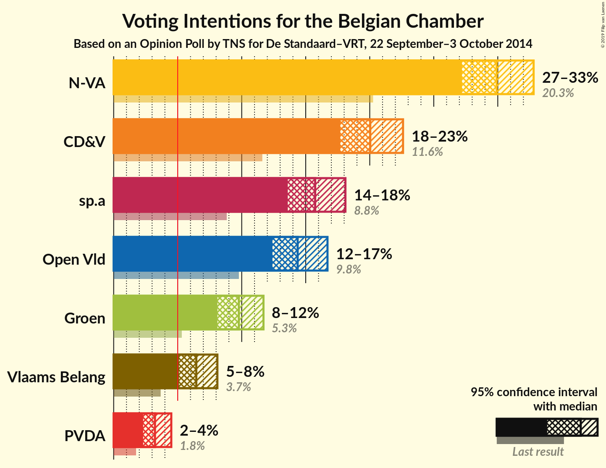
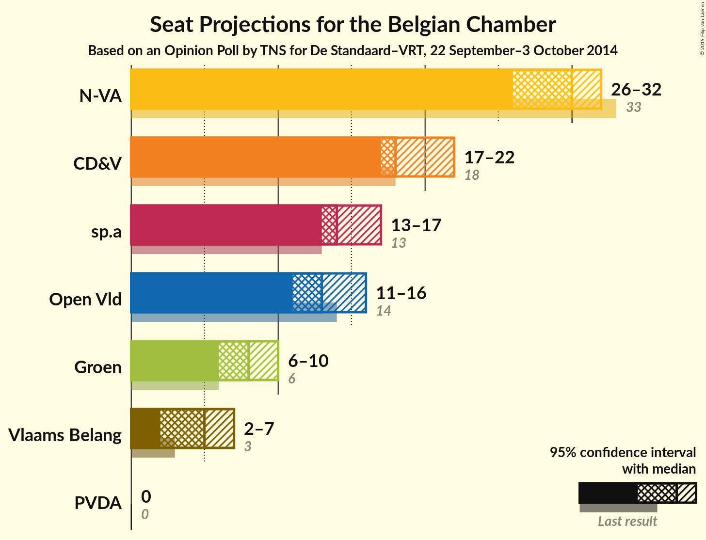
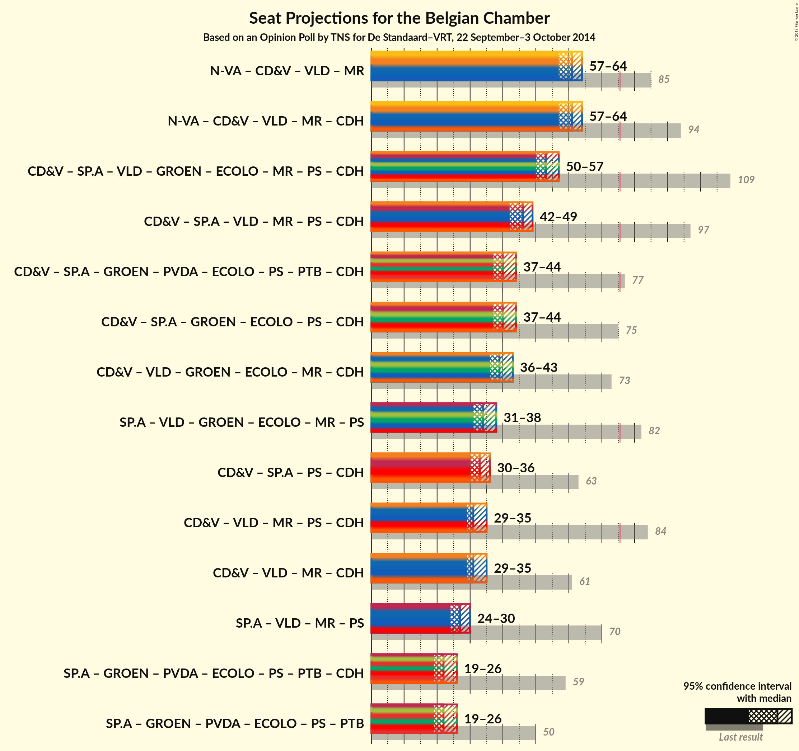

# Opinion Poll by TNS for De Standaard–VRT, 22 September–3 October 2014

<a href="#voting-intentions">Voting Intentions</a> | <a href="#seats">Seats</a> | <a href="#coalitions">Coalitions</a> | <a href="#technical-information">Technical Information</a>

## Voting Intentions

### Confidence Intervals

| Party | Last Result | Poll Result | 80% Confidence Interval | 90% Confidence Interval | 95% Confidence Interval | 99% Confidence Interval |
|:-----:|:-----------:|:-----------:|:-----------------------:|:-----------------------:|:-----------------------:|:-----------------------:|
| N-VA | 20.3% | 29.9% | 28.1–31.8% |27.6–32.3% |27.2–32.8% |26.3–33.7% |
| CD&V | 11.6% | 20.0% | 18.5–21.7% |18.1–22.2% |17.7–22.6% |17.0–23.4% |
| sp.a | 8.8% | 15.7% | 14.4–17.3% |14.0–17.7% |13.6–18.1% |13.0–18.9% |
| Open Vld | 9.8% | 14.4% | 13.0–15.9% |12.7–16.3% |12.3–16.7% |11.7–17.4% |
| Groen | 5.3% | 9.8% | 8.7–11.1% |8.4–11.4% |8.1–11.8% |7.6–12.4% |
| Vlaams Belang | 3.7% | 6.5% | 5.6–7.5% |5.3–7.9% |5.1–8.1% |4.7–8.7% |
| PVDA | 1.8% | 3.2% | 2.6–4.1% |2.4–4.3% |2.3–4.5% |2.0–4.9% |

*Note:* The poll result column reflects the actual value used in the calculations. Published results may vary slightly, and in addition be rounded to fewer digits.

## Seats

### Confidence Intervals

| Party | Last Result | Median | 80% Confidence Interval | 90% Confidence Interval | 95% Confidence Interval | 99% Confidence Interval |
|:-----:|:-----------:|:------:|:-----------------------:|:-----------------------:|:-----------------------:|:-----------------------:|
| <a href="#n-va">N-VA</a> | 33 | 30 | 27–31 |26–32 |26–32 |25–34 |
| <a href="#cd&v">CD&V</a> | 18 | 18 | 18–21 |18–22 |17–22 |15–23 |
| <a href="#sp.a">sp.a</a> | 13 | 14 | 13–16 |13–17 |13–17 |12–18 |
| <a href="#open-vld">Open Vld</a> | 14 | 13 | 12–14 |11–15 |11–16 |11–17 |
| <a href="#groen">Groen</a> | 6 | 8 | 6–9 |6–10 |6–10 |5–12 |
| <a href="#vlaams-belang">Vlaams Belang</a> | 3 | 5 | 2–6 |2–6 |2–7 |1–7 |
| <a href="#pvda">PVDA</a> | 0 | 0 | 0 |0 |0 |0 |

### N-VA

*For a full overview of the results for this party, see the [N-VA](party-nva.html) page.*

| Number of Seats | Probability | Accumulated | Special Marks |
|:---------------:|:-----------:|:-----------:|:-------------:|
| 24 | 0.2% | 100% |  |
| 25 | 0.5% | 99.8% |  |
| 26 | 5% | 99.3% |  |
| 27 | 9% | 94% |  |
| 28 | 15% | 85% |  |
| 29 | 19% | 70% |  |
| 30 | 24% | 51% | Median |
| 31 | 20% | 27% |  |
| 32 | 4% | 7% |  |
| 33 | 1.5% | 2% | Last Result |
| 34 | 0.7% | 0.7% |  |
| 35 | 0% | 0% |  |

### CD&V

*For a full overview of the results for this party, see the [CD&V](party-cdv.html) page.*

| Number of Seats | Probability | Accumulated | Special Marks |
|:---------------:|:-----------:|:-----------:|:-------------:|
| 13 | 0.1% | 100% |  |
| 14 | 0.2% | 99.9% |  |
| 15 | 0.5% | 99.8% |  |
| 16 | 1.1% | 99.3% |  |
| 17 | 3% | 98% |  |
| 18 | 53% | 95% | Last Result, Median |
| 19 | 21% | 42% |  |
| 20 | 9% | 21% |  |
| 21 | 7% | 12% |  |
| 22 | 4% | 5% |  |
| 23 | 1.0% | 1.1% |  |
| 24 | 0.1% | 0.1% |  |
| 25 | 0% | 0% |  |

### sp.a

*For a full overview of the results for this party, see the [sp.a](party-spa.html) page.*

| Number of Seats | Probability | Accumulated | Special Marks |
|:---------------:|:-----------:|:-----------:|:-------------:|
| 10 | 0.1% | 100% |  |
| 11 | 0.4% | 99.9% |  |
| 12 | 1.1% | 99.5% |  |
| 13 | 43% | 98% | Last Result |
| 14 | 17% | 56% | Median |
| 15 | 25% | 38% |  |
| 16 | 8% | 13% |  |
| 17 | 4% | 6% |  |
| 18 | 2% | 2% |  |
| 19 | 0% | 0% |  |

### Open Vld

*For a full overview of the results for this party, see the [Open Vld](party-openvld.html) page.*

| Number of Seats | Probability | Accumulated | Special Marks |
|:---------------:|:-----------:|:-----------:|:-------------:|
| 10 | 0.3% | 100% |  |
| 11 | 7% | 99.7% |  |
| 12 | 39% | 92% |  |
| 13 | 41% | 54% | Median |
| 14 | 6% | 12% | Last Result |
| 15 | 3% | 6% |  |
| 16 | 2% | 3% |  |
| 17 | 1.4% | 1.4% |  |
| 18 | 0.1% | 0.1% |  |
| 19 | 0% | 0% |  |

### Groen

*For a full overview of the results for this party, see the [Groen](party-groen.html) page.*

| Number of Seats | Probability | Accumulated | Special Marks |
|:---------------:|:-----------:|:-----------:|:-------------:|
| 5 | 2% | 100% |  |
| 6 | 23% | 98% | Last Result |
| 7 | 13% | 76% |  |
| 8 | 32% | 63% | Median |
| 9 | 21% | 30% |  |
| 10 | 7% | 10% |  |
| 11 | 2% | 2% |  |
| 12 | 0.6% | 0.6% |  |
| 13 | 0% | 0% |  |

### Vlaams Belang

*For a full overview of the results for this party, see the [Vlaams Belang](party-vlaamsbelang.html) page.*

| Number of Seats | Probability | Accumulated | Special Marks |
|:---------------:|:-----------:|:-----------:|:-------------:|
| 1 | 0.5% | 100% |  |
| 2 | 19% | 99.4% |  |
| 3 | 14% | 81% | Last Result |
| 4 | 9% | 67% |  |
| 5 | 39% | 57% | Median |
| 6 | 14% | 18% |  |
| 7 | 4% | 5% |  |
| 8 | 0.3% | 0.3% |  |
| 9 | 0% | 0% |  |

### PVDA

*For a full overview of the results for this party, see the [PVDA](party-pvda.html) page.*

| Number of Seats | Probability | Accumulated | Special Marks |
|:---------------:|:-----------:|:-----------:|:-------------:|
| 0 | 100% | 100% | Last Result, Median |

## Coalitions

### Confidence Intervals

| Coalition | Last Result | Median | Majority? | 80% Confidence Interval | 90% Confidence Interval | 95% Confidence Interval | 99% Confidence Interval |
|:---------:|:-----------:|:------:|:---------:|:-----------------------:|:-----------------------:|:-----------------------:|:-----------------------:|

## Technical Information

### Opinion Poll

+ **Pollster:** TNS
+ **Media:** De Standaard–VRT
+ **Fieldwork period:** 22 September–3 October 2014

### Calculations

+ **Sample size:** 1023
+ **Simulations done:** 4,194,304
+ **Error estimate:** 1.16%

