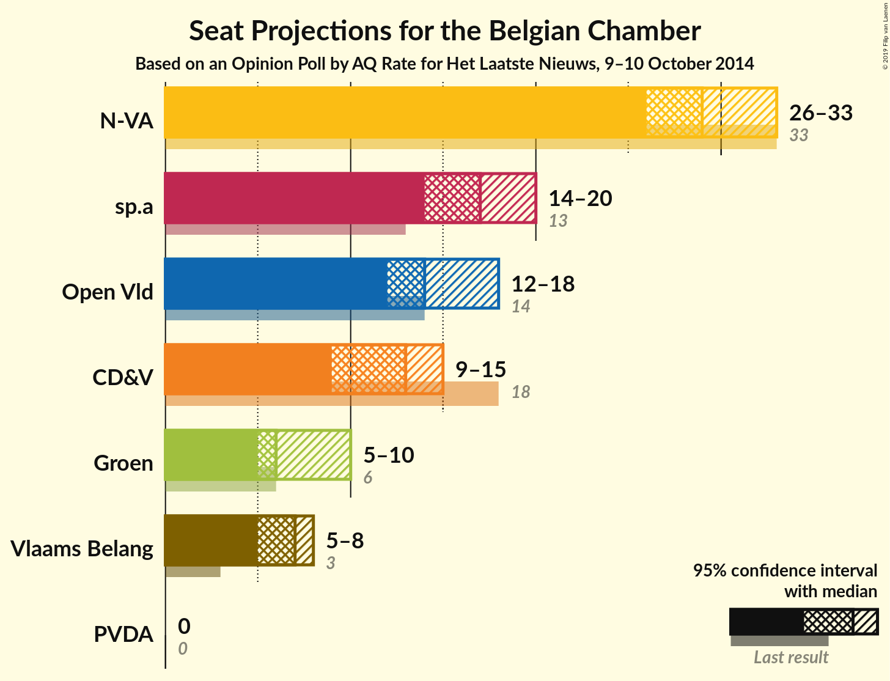
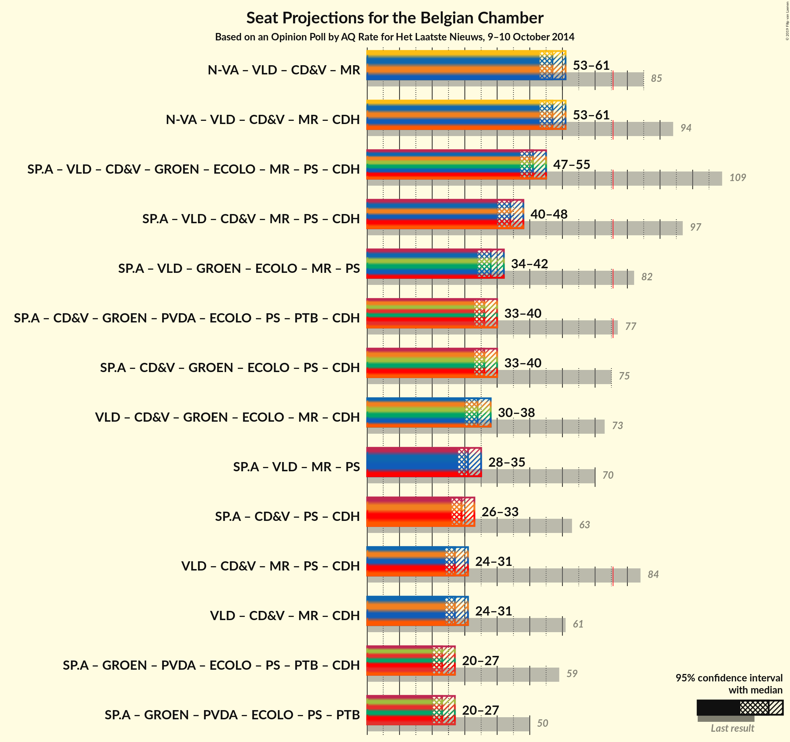

# Opinion Poll by AQ Rate for Het Laatste Nieuws, 9–10 October 2014

Areas included: Flanders

<a href="#voting-intentions">Voting Intentions</a> | <a href="#seats">Seats</a> | <a href="#coalitions">Coalitions</a> | <a href="#technical-information">Technical Information</a>

## Voting Intentions

### Confidence Intervals

| Party | Last Result | Poll Result | 80% Confidence Interval | 90% Confidence Interval | 95% Confidence Interval | 99% Confidence Interval |
|:-----:|:-----------:|:-----------:|:-----------------------:|:-----------------------:|:-----------------------:|:-----------------------:|
| N-VA | 20.3% | 30.0% | 27.9–32.1% |27.4–32.7% |26.9–33.2% |25.9–34.3% |
| sp.a | 8.8% | 18.0% | 16.3–19.8% |15.9–20.3% |15.5–20.8% |14.7–21.7% |
| Open Vld | 9.8% | 16.0% | 14.4–17.8% |14.0–18.2% |13.6–18.7% |12.9–19.6% |
| CD&V | 11.6% | 14.0% | 12.5–15.7% |12.1–16.1% |11.8–16.6% |11.1–17.4% |
| Groen | 5.3% | 9.0% | 7.8–10.4% |7.5–10.8% |7.2–11.2% |6.7–11.9% |
| Vlaams Belang | 3.7% | 8.0% | 6.9–9.4% |6.6–9.7% |6.3–10.1% |5.8–10.8% |
| PVDA | 1.8% | 3.0% | 2.3–3.9% |2.2–4.2% |2.0–4.4% |1.8–4.9% |

*Note:* The poll result column reflects the actual value used in the calculations. Published results may vary slightly, and in addition be rounded to fewer digits.

## Seats

### Confidence Intervals

| Party | Last Result | Median | 80% Confidence Interval | 90% Confidence Interval | 95% Confidence Interval | 99% Confidence Interval |
|:-----:|:-----------:|:------:|:-----------------------:|:-----------------------:|:-----------------------:|:-----------------------:|
| <a href="#n-va">N-VA</a> | 33 | 29 | 27–32 |26–33 |26–33 |25–34 |
| <a href="#sp.a">sp.a</a> | 13 | 17 | 15–19 |14–19 |14–20 |13–21 |
| <a href="#open-vld">Open Vld</a> | 14 | 14 | 12–17 |12–18 |12–18 |11–18 |
| <a href="#cd&v">CD&V</a> | 18 | 13 | 11–13 |10–15 |9–15 |9–17 |
| <a href="#groen">Groen</a> | 6 | 7 | 5–9 |5–9 |5–10 |5–11 |
| <a href="#vlaams-belang">Vlaams Belang</a> | 3 | 7 | 5–8 |5–8 |5–8 |2–8 |
| <a href="#pvda">PVDA</a> | 0 | 0 | 0 |0 |0 |0 |

### N-VA

*For a full overview of the results for this party, see the [N-VA](party-nva.html) page.*

| Number of Seats | Probability | Accumulated | Special Marks |
|:---------------:|:-----------:|:-----------:|:-------------:|
| 24 | 0.4% | 100% |  |
| 25 | 1.2% | 99.6% |  |
| 26 | 4% | 98% |  |
| 27 | 9% | 95% |  |
| 28 | 16% | 86% |  |
| 29 | 24% | 70% | Median |
| 30 | 17% | 47% |  |
| 31 | 16% | 29% |  |
| 32 | 8% | 14% |  |
| 33 | 4% | 5% | Last Result |
| 34 | 0.8% | 1.1% |  |
| 35 | 0.3% | 0.4% |  |
| 36 | 0.1% | 0.1% |  |
| 37 | 0% | 0% |  |

### sp.a

*For a full overview of the results for this party, see the [sp.a](party-spa.html) page.*

| Number of Seats | Probability | Accumulated | Special Marks |
|:---------------:|:-----------:|:-----------:|:-------------:|
| 13 | 2% | 100% | Last Result |
| 14 | 4% | 98% |  |
| 15 | 15% | 94% |  |
| 16 | 22% | 78% |  |
| 17 | 25% | 57% | Median |
| 18 | 21% | 32% |  |
| 19 | 7% | 11% |  |
| 20 | 2% | 4% |  |
| 21 | 1.1% | 1.4% |  |
| 22 | 0.3% | 0.3% |  |
| 23 | 0% | 0% |  |

### Open Vld

*For a full overview of the results for this party, see the [Open Vld](party-openvld.html) page.*

| Number of Seats | Probability | Accumulated | Special Marks |
|:---------------:|:-----------:|:-----------:|:-------------:|
| 11 | 0.7% | 100% |  |
| 12 | 11% | 99.2% |  |
| 13 | 26% | 88% |  |
| 14 | 13% | 62% | Last Result, Median |
| 15 | 15% | 50% |  |
| 16 | 13% | 34% |  |
| 17 | 14% | 21% |  |
| 18 | 7% | 8% |  |
| 19 | 0.3% | 0.4% |  |
| 20 | 0% | 0% |  |

### CD&V

*For a full overview of the results for this party, see the [CD&V](party-cdv.html) page.*

| Number of Seats | Probability | Accumulated | Special Marks |
|:---------------:|:-----------:|:-----------:|:-------------:|
| 8 | 0.2% | 100% |  |
| 9 | 3% | 99.8% |  |
| 10 | 3% | 96% |  |
| 11 | 6% | 94% |  |
| 12 | 13% | 88% |  |
| 13 | 65% | 75% | Median |
| 14 | 5% | 10% |  |
| 15 | 4% | 5% |  |
| 16 | 1.1% | 2% |  |
| 17 | 0.3% | 0.5% |  |
| 18 | 0.2% | 0.2% | Last Result |
| 19 | 0% | 0% |  |

### Groen

*For a full overview of the results for this party, see the [Groen](party-groen.html) page.*

| Number of Seats | Probability | Accumulated | Special Marks |
|:---------------:|:-----------:|:-----------:|:-------------:|
| 4 | 0.1% | 100% |  |
| 5 | 15% | 99.9% |  |
| 6 | 34% | 85% | Last Result |
| 7 | 12% | 51% | Median |
| 8 | 28% | 39% |  |
| 9 | 7% | 11% |  |
| 10 | 3% | 4% |  |
| 11 | 0.5% | 0.8% |  |
| 12 | 0.2% | 0.2% |  |
| 13 | 0% | 0% |  |

### Vlaams Belang

*For a full overview of the results for this party, see the [Vlaams Belang](party-vlaamsbelang.html) page.*

| Number of Seats | Probability | Accumulated | Special Marks |
|:---------------:|:-----------:|:-----------:|:-------------:|
| 2 | 0.5% | 100% |  |
| 3 | 0.7% | 99.5% | Last Result |
| 4 | 0.9% | 98.7% |  |
| 5 | 17% | 98% |  |
| 6 | 25% | 80% |  |
| 7 | 30% | 55% | Median |
| 8 | 24% | 25% |  |
| 9 | 0% | 0.1% |  |
| 10 | 0% | 0% |  |

### PVDA

*For a full overview of the results for this party, see the [PVDA](party-pvda.html) page.*

| Number of Seats | Probability | Accumulated | Special Marks |
|:---------------:|:-----------:|:-----------:|:-------------:|
| 0 | 100% | 100% | Last Result, Median |

## Coalitions

### Confidence Intervals

| Coalition | Last Result | Median | Majority? | 80% Confidence Interval | 90% Confidence Interval | 95% Confidence Interval | 99% Confidence Interval |
|:---------:|:-----------:|:------:|:---------:|:-----------------------:|:-----------------------:|:-----------------------:|:-----------------------:|

## Technical Information

### Opinion Poll

+ **Polling firm:** AQ Rate
+ **Commissioner(s):** Het Laatste Nieuws
+ **Fieldwork period:** 9–10 October 2014

### Calculations

+ **Sample size:** 801
+ **Simulations done:** 1,048,576
+ **Error estimate:** 2.42%

