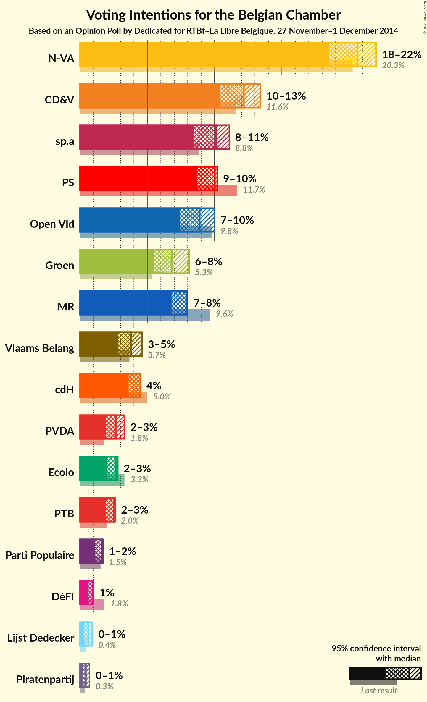

# Opinion Poll by Dedicated for RTBf–La Libre Belgique, 27 November–1 December 2014

<a href="#voting-intentions">Voting Intentions</a> | <a href="#seats">Seats</a> | <a href="#coalitions">Coalitions</a> | <a href="#technical-information">Technical Information</a>

## Voting Intentions

### Confidence Intervals

| Party | Last Result | Poll Result | 80% Confidence Interval | 90% Confidence Interval | 95% Confidence Interval | 99% Confidence Interval |
|:-----:|:-----------:|:-----------:|:-----------------------:|:-----------------------:|:-----------------------:|:-----------------------:|
| N-VA | 20.3% | 30.9% | 28.8–33.1% |28.3–33.7% |27.8–34.3% |26.8–35.3% |
| CD&V | 11.6% | 18.2% | 16.6–20.1% |16.1–20.7% |15.7–21.1% |14.9–22.1% |
| sp.a | 8.8% | 15.1% | 13.6–16.9% |13.2–17.4% |12.8–17.8% |12.1–18.7% |
| Open Vld | 9.8% | 13.3% | 11.9–15.0% |11.5–15.5% |11.1–15.9% |10.4–16.8% |
| Groen | 5.3% | 10.2% | 8.9–11.8% |8.6–12.2% |8.3–12.6% |7.7–13.3% |
| Vlaams Belang | 3.7% | 5.7% | 4.8–6.9% |4.5–7.3% |4.3–7.6% |3.9–8.2% |
| PVDA | 1.8% | 4.0% | 3.2–5.1% |3.0–5.4% |2.8–5.6% |2.5–6.2% |
| Lijst Dedecker | 0.4% | 0.9% | 0.6–1.5% |0.5–1.7% |0.4–1.9% |0.3–2.2% |
| Piratenpartij | 0.3% | 0.6% | 0.4–1.2% |0.3–1.4% |0.3–1.5% |0.2–1.8% |

*Note:* The poll result column reflects the actual value used in the calculations. Published results may vary slightly, and in addition be rounded to fewer digits.

## Seats

### Confidence Intervals

| Party | Last Result | Median | 80% Confidence Interval | 90% Confidence Interval | 95% Confidence Interval | 99% Confidence Interval |
|:-----:|:-----------:|:------:|:-----------------------:|:-----------------------:|:-----------------------:|:-----------------------:|
| <a href="#n-va">N-VA</a> | 33 | 31 | 28–33 |28–34 |27–34 |26–36 |
| <a href="#cd&v">CD&V</a> | 18 | 18 | 15–18 |15–20 |14–21 |13–22 |
| <a href="#sp.a">sp.a</a> | 13 | 14 | 13–16 |13–17 |11–17 |9–18 |
| <a href="#open-vld">Open Vld</a> | 14 | 12 | 11–13 |11–13 |10–15 |9–17 |
| <a href="#groen">Groen</a> | 6 | 9 | 6–11 |6–12 |6–12 |5–12 |
| <a href="#vlaams-belang">Vlaams Belang</a> | 3 | 2 | 2–5 |1–6 |1–6 |0–7 |
| <a href="#pvda">PVDA</a> | 0 | 0 | 0 |0 |0 |0 |
| <a href="#lijst-dedecker">Lijst Dedecker</a> | 0 | 0 | 0–1 |0–1 |0–1 |0–2 |
| <a href="#piratenpartij">Piratenpartij</a> | 0 | 0 | 0 |0 |0 |0 |

### N-VA

*For a full overview of the results for this party, see the [N-VA](party-nva.html) page.*

| Number of Seats | Probability | Accumulated | Special Marks |
|:---------------:|:-----------:|:-----------:|:-------------:|
| 25 | 0.1% | 100% |  |
| 26 | 1.0% | 99.9% |  |
| 27 | 4% | 98.9% |  |
| 28 | 7% | 95% |  |
| 29 | 7% | 88% |  |
| 30 | 10% | 81% |  |
| 31 | 26% | 71% | Median |
| 32 | 21% | 45% |  |
| 33 | 19% | 25% | Last Result |
| 34 | 3% | 5% |  |
| 35 | 0.8% | 2% |  |
| 36 | 1.0% | 1.3% |  |
| 37 | 0.3% | 0.4% |  |
| 38 | 0% | 0% |  |

### CD&V

*For a full overview of the results for this party, see the [CD&V](party-cdv.html) page.*

| Number of Seats | Probability | Accumulated | Special Marks |
|:---------------:|:-----------:|:-----------:|:-------------:|
| 13 | 2% | 100% |  |
| 14 | 2% | 98% |  |
| 15 | 6% | 95% |  |
| 16 | 6% | 89% |  |
| 17 | 19% | 83% |  |
| 18 | 54% | 64% | Last Result, Median |
| 19 | 2% | 10% |  |
| 20 | 5% | 8% |  |
| 21 | 2% | 3% |  |
| 22 | 1.2% | 1.3% |  |
| 23 | 0.1% | 0.1% |  |
| 24 | 0% | 0% |  |

### sp.a

*For a full overview of the results for this party, see the [sp.a](party-spa.html) page.*

| Number of Seats | Probability | Accumulated | Special Marks |
|:---------------:|:-----------:|:-----------:|:-------------:|
| 9 | 0.6% | 100% |  |
| 10 | 1.0% | 99.4% |  |
| 11 | 1.0% | 98% |  |
| 12 | 1.0% | 97% |  |
| 13 | 42% | 96% | Last Result |
| 14 | 26% | 55% | Median |
| 15 | 14% | 29% |  |
| 16 | 8% | 15% |  |
| 17 | 5% | 7% |  |
| 18 | 2% | 2% |  |
| 19 | 0.1% | 0.1% |  |
| 20 | 0% | 0% |  |

### Open Vld

*For a full overview of the results for this party, see the [Open Vld](party-openvld.html) page.*

| Number of Seats | Probability | Accumulated | Special Marks |
|:---------------:|:-----------:|:-----------:|:-------------:|
| 8 | 0.4% | 100% |  |
| 9 | 0.4% | 99.6% |  |
| 10 | 3% | 99.2% |  |
| 11 | 14% | 97% |  |
| 12 | 54% | 83% | Median |
| 13 | 24% | 28% |  |
| 14 | 1.2% | 4% | Last Result |
| 15 | 2% | 3% |  |
| 16 | 0.5% | 1.0% |  |
| 17 | 0.5% | 0.5% |  |
| 18 | 0.1% | 0.1% |  |
| 19 | 0% | 0% |  |

### Groen

*For a full overview of the results for this party, see the [Groen](party-groen.html) page.*

| Number of Seats | Probability | Accumulated | Special Marks |
|:---------------:|:-----------:|:-----------:|:-------------:|
| 5 | 0.6% | 100% |  |
| 6 | 10% | 99.4% | Last Result |
| 7 | 3% | 89% |  |
| 8 | 34% | 87% |  |
| 9 | 21% | 53% | Median |
| 10 | 20% | 32% |  |
| 11 | 7% | 13% |  |
| 12 | 6% | 6% |  |
| 13 | 0% | 0% |  |

### Vlaams Belang

*For a full overview of the results for this party, see the [Vlaams Belang](party-vlaamsbelang.html) page.*

| Number of Seats | Probability | Accumulated | Special Marks |
|:---------------:|:-----------:|:-----------:|:-------------:|
| 0 | 1.2% | 100% |  |
| 1 | 4% | 98.8% |  |
| 2 | 55% | 95% | Median |
| 3 | 7% | 39% | Last Result |
| 4 | 10% | 33% |  |
| 5 | 16% | 22% |  |
| 6 | 4% | 6% |  |
| 7 | 2% | 2% |  |
| 8 | 0.1% | 0.1% |  |
| 9 | 0% | 0% |  |

### PVDA

*For a full overview of the results for this party, see the [PVDA](party-pvda.html) page.*

| Number of Seats | Probability | Accumulated | Special Marks |
|:---------------:|:-----------:|:-----------:|:-------------:|
| 0 | 100% | 100% | Last Result, Median |

### Lijst Dedecker

*For a full overview of the results for this party, see the [Lijst Dedecker](party-lijstdedecker.html) page.*

| Number of Seats | Probability | Accumulated | Special Marks |
|:---------------:|:-----------:|:-----------:|:-------------:|
| 0 | 55% | 100% | Last Result, Median |
| 1 | 44% | 45% |  |
| 2 | 1.0% | 1.0% |  |
| 3 | 0% | 0% |  |

### Piratenpartij

*For a full overview of the results for this party, see the [Piratenpartij](party-piratenpartij.html) page.*

| Number of Seats | Probability | Accumulated | Special Marks |
|:---------------:|:-----------:|:-----------:|:-------------:|
| 0 | 100% | 100% | Last Result, Median |

## Coalitions

### Confidence Intervals

| Coalition | Last Result | Median | Majority? | 80% Confidence Interval | 90% Confidence Interval | 95% Confidence Interval | 99% Confidence Interval |
|:---------:|:-----------:|:------:|:---------:|:-----------------------:|:-----------------------:|:-----------------------:|:-----------------------:|

## Technical Information

### Opinion Poll

+ **Pollster:** Dedicated
+ **Media:** RTBf–La Libre Belgique
+ **Fieldwork period:** 27 November–1 December 2014

### Calculations

+ **Sample size:** 773
+ **Simulations done:** 0
+ **Error estimate:** 100.00%

