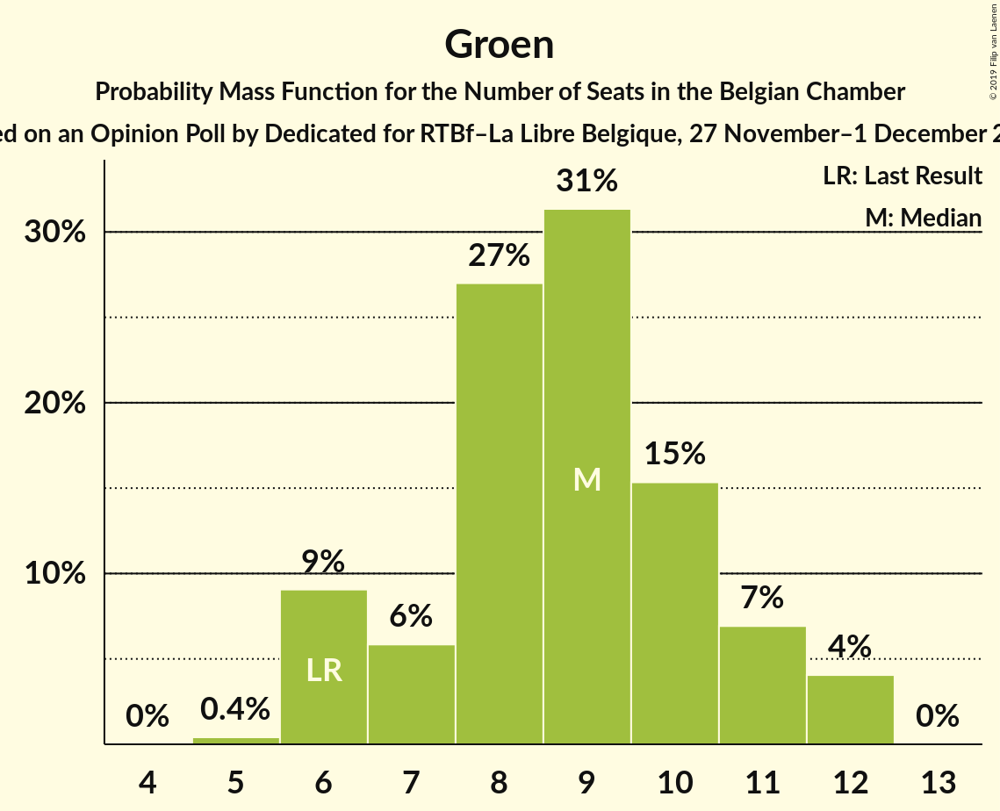
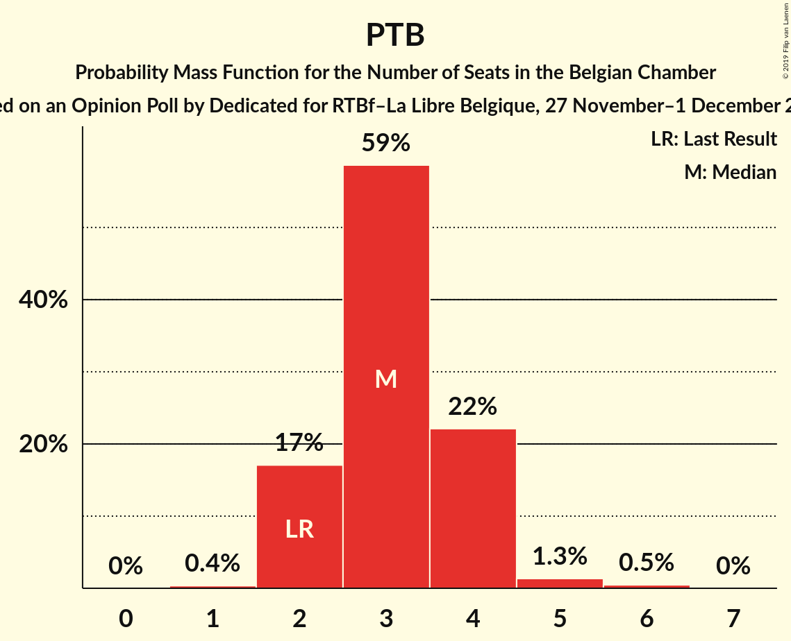

# Opinion Poll by Dedicated for RTBf–La Libre Belgique, 27 November–1 December 2014

Areas included: Flanders, Wallonia

<a href="#voting-intentions">Voting Intentions</a> | <a href="#seats">Seats</a> | <a href="#coalitions">Coalitions</a> | <a href="#technical-information">Technical Information</a>

## Voting Intentions

### Confidence Intervals

| Party | Last Result | Poll Result | 80% Confidence Interval | 90% Confidence Interval | 95% Confidence Interval | 99% Confidence Interval |
|:-----:|:-----------:|:-----------:|:-----------------------:|:-----------------------:|:-----------------------:|:-----------------------:|
| N-VA | 20.3% | 20.6% | 28.8–33.1% |28.3–33.7% |27.8–34.3% |26.8–35.3% |
| CD&V | 11.6% | 12.2% | 16.6–20.1% |16.1–20.7% |15.7–21.1% |14.9–22.1% |
| sp.a | 8.8% | 10.1% | 13.6–16.9% |13.2–17.4% |12.8–17.8% |12.1–18.7% |
| PS | 11.7% | 10.0% | N/A |N/A |N/A |N/A |
| Open Vld | 9.8% | 8.9% | 11.9–15.0% |11.5–15.5% |11.1–15.9% |10.4–16.8% |
| MR | 9.6% | 7.9% | N/A |N/A |N/A |N/A |
| Groen | 5.3% | 6.8% | 8.9–11.8% |8.6–12.2% |8.3–12.6% |7.7–13.3% |
| cdH | 5.0% | 4.5% | N/A |N/A |N/A |N/A |
| Vlaams Belang | 3.7% | 3.8% | 4.8–6.9% |4.5–7.3% |4.3–7.6% |3.9–8.2% |
| PVDA | 1.8% | 2.7% | 3.2–5.1% |3.0–5.4% |2.8–5.6% |2.5–6.2% |
| Ecolo | 3.3% | 2.7% | N/A |N/A |N/A |N/A |
| PTB | 2.0% | 2.5% | N/A |N/A |N/A |N/A |
| Parti Populaire | 1.5% | 1.6% | N/A |N/A |N/A |N/A |
| DéFI | 1.8% | 0.9% | N/A |N/A |N/A |N/A |
| Lijst Dedecker | 0.4% | 0.6% | 0.6–1.5% |0.5–1.7% |0.4–1.9% |0.3–2.2% |
| Piratenpartij | 0.3% | 0.4% | 0.4–1.2% |0.3–1.4% |0.3–1.5% |0.2–1.8% |

*Note:* The poll result column reflects the actual value used in the calculations. Published results may vary slightly, and in addition be rounded to fewer digits.

## Seats

### Confidence Intervals

| Party | Last Result | Median | 80% Confidence Interval | 90% Confidence Interval | 95% Confidence Interval | 99% Confidence Interval |
|:-----:|:-----------:|:------:|:-----------------------:|:-----------------------:|:-----------------------:|:-----------------------:|
| <a href="#n-va">N-VA</a> | 33 | 31 | 29–33 |28–34 |27–35 |26–37 |
| <a href="#cd&v">CD&V</a> | 18 | 18 | 16–20 |15–20 |13–21 |13–22 |
| <a href="#sp.a">sp.a</a> | 13 | 14 | 13–16 |12–17 |11–18 |9–18 |
| <a href="#ps">PS</a> | 23 | 18 | 17–20 |17–21 |16–22 |16–23 |
| <a href="#open-vld">Open Vld</a> | 14 | 12 | 11–13 |10–14 |9–15 |8–17 |
| <a href="#mr">MR</a> | 20 | 14 | 14–16 |13–17 |13–18 |12–18 |
| <a href="#groen">Groen</a> | 6 | 9 | 6–10 |6–11 |6–12 |5–12 |
| <a href="#cdh">cdH</a> | 9 | 7 | 7–8 |7–9 |6–10 |5–11 |
| <a href="#vlaams-belang">Vlaams Belang</a> | 3 | 3 | 1–6 |1–6 |0–6 |0–7 |
| <a href="#pvda">PVDA</a> | 0 | 0 | 0 |0 |0 |0 |
| <a href="#ecolo">Ecolo</a> | 6 | 4 | 1–5 |1–5 |1–5 |1–6 |
| <a href="#ptb">PTB</a> | 2 | 3 | 2–4 |2–4 |2–4 |2–5 |
| <a href="#parti-populaire">Parti Populaire</a> | 1 | 1 | 0–2 |0–2 |0–2 |0–2 |
| <a href="#défi">DéFI</a> | 2 | 0 | 0 |0 |0 |0 |
| <a href="#lijst-dedecker">Lijst Dedecker</a> | 0 | 0 | 0–1 |0–1 |0–1 |0–2 |
| <a href="#piratenpartij">Piratenpartij</a> | 0 | 0 | 0 |0 |0 |0 |

### N-VA

*For a full overview of the results for this party, see the [N-VA](party-n-va.html) page.*

| Number of Seats | Probability | Accumulated | Special Marks |
|:---------------:|:-----------:|:-----------:|:-------------:|
| 25 | 0% | 100% |  |
| 26 | 0.9% | 99.9% |  |
| 27 | 3% | 99.0% |  |
| 28 | 5% | 96% |  |
| 29 | 8% | 91% |  |
| 30 | 10% | 83% |  |
| 31 | 31% | 73% | Median |
| 32 | 26% | 42% |  |
| 33 | 7% | 17% | Last Result |
| 34 | 5% | 9% |  |
| 35 | 2% | 4% |  |
| 36 | 1.2% | 2% |  |
| 37 | 0.7% | 0.7% |  |
| 38 | 0% | 0% |  |

### CD&V

*For a full overview of the results for this party, see the [CD&V](party-cdv.html) page.*

| Number of Seats | Probability | Accumulated | Special Marks |
|:---------------:|:-----------:|:-----------:|:-------------:|
| 13 | 3% | 100% |  |
| 14 | 2% | 97% |  |
| 15 | 4% | 95% |  |
| 16 | 5% | 91% |  |
| 17 | 17% | 86% |  |
| 18 | 53% | 69% | Last Result, Median |
| 19 | 7% | 17% |  |
| 20 | 6% | 10% |  |
| 21 | 3% | 4% |  |
| 22 | 1.1% | 1.4% |  |
| 23 | 0.3% | 0.3% |  |
| 24 | 0% | 0% |  |

### sp.a

*For a full overview of the results for this party, see the [sp.a](party-spa.html) page.*

| Number of Seats | Probability | Accumulated | Special Marks |
|:---------------:|:-----------:|:-----------:|:-------------:|
| 9 | 0.5% | 100% |  |
| 10 | 0.4% | 99.5% |  |
| 11 | 2% | 99.0% |  |
| 12 | 3% | 97% |  |
| 13 | 40% | 94% | Last Result |
| 14 | 22% | 53% | Median |
| 15 | 19% | 31% |  |
| 16 | 7% | 12% |  |
| 17 | 3% | 6% |  |
| 18 | 3% | 3% |  |
| 19 | 0% | 0% |  |

### PS

*For a full overview of the results for this party, see the [PS](party-ps.html) page.*

| Number of Seats | Probability | Accumulated | Special Marks |
|:---------------:|:-----------:|:-----------:|:-------------:|
| 15 | 0.2% | 100% |  |
| 16 | 4% | 99.8% |  |
| 17 | 11% | 96% |  |
| 18 | 48% | 85% | Median |
| 19 | 17% | 36% |  |
| 20 | 10% | 19% |  |
| 21 | 6% | 9% |  |
| 22 | 3% | 3% |  |
| 23 | 0.5% | 0.6% | Last Result |
| 24 | 0% | 0% |  |

### Open Vld

*For a full overview of the results for this party, see the [Open Vld](party-openvld.html) page.*

| Number of Seats | Probability | Accumulated | Special Marks |
|:---------------:|:-----------:|:-----------:|:-------------:|
| 8 | 0.6% | 100% |  |
| 9 | 2% | 99.4% |  |
| 10 | 6% | 97% |  |
| 11 | 29% | 91% |  |
| 12 | 32% | 62% | Median |
| 13 | 24% | 30% |  |
| 14 | 2% | 6% | Last Result |
| 15 | 2% | 4% |  |
| 16 | 1.0% | 2% |  |
| 17 | 0.9% | 1.0% |  |
| 18 | 0.1% | 0.1% |  |
| 19 | 0% | 0% |  |

### MR

*For a full overview of the results for this party, see the [MR](party-mr.html) page.*

| Number of Seats | Probability | Accumulated | Special Marks |
|:---------------:|:-----------:|:-----------:|:-------------:|
| 11 | 0.5% | 100% |  |
| 12 | 2% | 99.5% |  |
| 13 | 5% | 98% |  |
| 14 | 59% | 93% | Median |
| 15 | 13% | 34% |  |
| 16 | 13% | 21% |  |
| 17 | 6% | 9% |  |
| 18 | 2% | 3% |  |
| 19 | 0.2% | 0.2% |  |
| 20 | 0% | 0% | Last Result |

### Groen

*For a full overview of the results for this party, see the [Groen](party-groen.html) page.*

| Number of Seats | Probability | Accumulated | Special Marks |
|:---------------:|:-----------:|:-----------:|:-------------:|
| 5 | 0.5% | 100% |  |
| 6 | 13% | 99.5% | Last Result |
| 7 | 8% | 86% |  |
| 8 | 27% | 78% |  |
| 9 | 32% | 52% | Median |
| 10 | 10% | 20% |  |
| 11 | 5% | 10% |  |
| 12 | 4% | 4% |  |
| 13 | 0% | 0% |  |

### cdH

*For a full overview of the results for this party, see the [cdH](party-cdh.html) page.*

| Number of Seats | Probability | Accumulated | Special Marks |
|:---------------:|:-----------:|:-----------:|:-------------:|
| 4 | 0.3% | 100% |  |
| 5 | 1.1% | 99.6% |  |
| 6 | 1.4% | 98.5% |  |
| 7 | 67% | 97% | Median |
| 8 | 23% | 30% |  |
| 9 | 3% | 7% | Last Result |
| 10 | 3% | 4% |  |
| 11 | 1.4% | 1.4% |  |
| 12 | 0% | 0% |  |

### Vlaams Belang

*For a full overview of the results for this party, see the [Vlaams Belang](party-vlaamsbelang.html) page.*

| Number of Seats | Probability | Accumulated | Special Marks |
|:---------------:|:-----------:|:-----------:|:-------------:|
| 0 | 3% | 100% |  |
| 1 | 7% | 97% |  |
| 2 | 36% | 90% |  |
| 3 | 13% | 54% | Last Result, Median |
| 4 | 10% | 42% |  |
| 5 | 16% | 32% |  |
| 6 | 13% | 16% |  |
| 7 | 2% | 2% |  |
| 8 | 0.1% | 0.1% |  |
| 9 | 0% | 0% |  |

### PVDA

*For a full overview of the results for this party, see the [PVDA](party-pvda.html) page.*

| Number of Seats | Probability | Accumulated | Special Marks |
|:---------------:|:-----------:|:-----------:|:-------------:|
| 0 | 100% | 100% | Last Result, Median |

### Ecolo

*For a full overview of the results for this party, see the [Ecolo](party-ecolo.html) page.*

| Number of Seats | Probability | Accumulated | Special Marks |
|:---------------:|:-----------:|:-----------:|:-------------:|
| 1 | 11% | 100% |  |
| 2 | 22% | 89% |  |
| 3 | 12% | 67% |  |
| 4 | 36% | 55% | Median |
| 5 | 18% | 19% |  |
| 6 | 0.7% | 0.7% | Last Result |
| 7 | 0% | 0% |  |

### PTB

*For a full overview of the results for this party, see the [PTB](party-ptb.html) page.*

| Number of Seats | Probability | Accumulated | Special Marks |
|:---------------:|:-----------:|:-----------:|:-------------:|
| 1 | 0.4% | 100% |  |
| 2 | 18% | 99.6% | Last Result |
| 3 | 57% | 82% | Median |
| 4 | 23% | 24% |  |
| 5 | 1.4% | 2% |  |
| 6 | 0.4% | 0.4% |  |
| 7 | 0% | 0% |  |

### Parti Populaire

*For a full overview of the results for this party, see the [Parti Populaire](party-partipopulaire.html) page.*

| Number of Seats | Probability | Accumulated | Special Marks |
|:---------------:|:-----------:|:-----------:|:-------------:|
| 0 | 27% | 100% |  |
| 1 | 30% | 73% | Last Result, Median |
| 2 | 43% | 43% |  |
| 3 | 0% | 0% |  |

### DéFI

*For a full overview of the results for this party, see the [DéFI](party-défi.html) page.*

| Number of Seats | Probability | Accumulated | Special Marks |
|:---------------:|:-----------:|:-----------:|:-------------:|
| 0 | 100% | 100% | Median |
| 1 | 0% | 0% |  |
| 2 | 0% | 0% | Last Result |

### Lijst Dedecker

*For a full overview of the results for this party, see the [Lijst Dedecker](party-lijstdedecker.html) page.*

| Number of Seats | Probability | Accumulated | Special Marks |
|:---------------:|:-----------:|:-----------:|:-------------:|
| 0 | 60% | 100% | Last Result, Median |
| 1 | 38% | 40% |  |
| 2 | 2% | 2% |  |
| 3 | 0% | 0% |  |

### Piratenpartij

*For a full overview of the results for this party, see the [Piratenpartij](party-piratenpartij.html) page.*

| Number of Seats | Probability | Accumulated | Special Marks |
|:---------------:|:-----------:|:-----------:|:-------------:|
| 0 | 100% | 100% | Last Result, Median |

## Coalitions

### Confidence Intervals

| Coalition | Last Result | Median | Majority? | 80% Confidence Interval | 90% Confidence Interval | 95% Confidence Interval | 99% Confidence Interval |
|:---------:|:-----------:|:------:|:---------:|:-----------------------:|:-----------------------:|:-----------------------:|:-----------------------:|
| CD&V – sp.a – PS – Open Vld – MR – Groen – cdH – Ecolo | 109 | 96 | 100% | 93–99 | 92–100 | 91–101 | 89–102 |
| CD&V – sp.a – PS – Open Vld – MR – cdH | 97 | 84 | 100% | 81–88 | 80–88 | 79–89 | 78–91 |
| N-VA – CD&V – Open Vld – MR – cdH | 94 | 83 | 99.8% | 80–86 | 79–87 | 78–88 | 77–89 |
| N-VA – CD&V – Open Vld – MR | 85 | 75 | 47% | 73–78 | 72–79 | 71–80 | 69–82 |
| CD&V – sp.a – PS – Groen – cdH – Ecolo – PVDA – PTB | 77 | 72 | 11% | 69–76 | 68–77 | 67–77 | 65–79 |
| sp.a – PS – Open Vld – MR – Groen – Ecolo | 82 | 71 | 3% | 68–74 | 67–75 | 66–76 | 65–77 |
| CD&V – PS – Open Vld – MR – cdH | 84 | 70 | 2% | 67–73 | 66–74 | 66–75 | 64–77 |
| CD&V – sp.a – PS – Groen – cdH – Ecolo | 75 | 69 | 0.8% | 66–73 | 65–74 | 64–74 | 62–76 |
| sp.a – PS – Open Vld – MR | 70 | 59 | 0% | 56–62 | 55–63 | 55–64 | 53–65 |
| CD&V – sp.a – PS – cdH | 63 | 58 | 0% | 54–61 | 53–62 | 53–63 | 51–64 |
| sp.a – PS – Groen – cdH – Ecolo – PVDA – PTB | 59 | 55 | 0% | 52–58 | 51–58 | 50–59 | 49–61 |
| CD&V – Open Vld – MR – cdH | 61 | 51 | 0% | 49–55 | 48–56 | 47–56 | 46–58 |
| sp.a – PS – Groen – Ecolo – PVDA – PTB | 50 | 47 | 0% | 44–50 | 43–51 | 43–52 | 41–54 |
| CD&V – Open Vld – MR – Groen – cdH – Ecolo | 73 | 25 | 0% | 23–27 | 23–27 | 22–27 | 22–28 |

### CD&V – sp.a – PS – Open Vld – MR – Groen – cdH – Ecolo

| Number of Seats | Probability | Accumulated | Special Marks |
|:---------------:|:-----------:|:-----------:|:-------------:|
| 88 | 0.2% | 100% |  |
| 89 | 0.3% | 99.8% |  |
| 90 | 0.8% | 99.5% |  |
| 91 | 2% | 98.7% |  |
| 92 | 5% | 97% |  |
| 93 | 8% | 92% |  |
| 94 | 13% | 84% |  |
| 95 | 14% | 71% |  |
| 96 | 17% | 56% | Median |
| 97 | 14% | 40% |  |
| 98 | 11% | 25% |  |
| 99 | 7% | 14% |  |
| 100 | 4% | 6% |  |
| 101 | 2% | 3% |  |
| 102 | 0.5% | 0.8% |  |
| 103 | 0.2% | 0.3% |  |
| 104 | 0.1% | 0.1% |  |
| 105 | 0% | 0% |  |
| 106 | 0% | 0% |  |
| 107 | 0% | 0% |  |
| 108 | 0% | 0% |  |
| 109 | 0% | 0% | Last Result |

### CD&V – sp.a – PS – Open Vld – MR – cdH

| Number of Seats | Probability | Accumulated | Special Marks |
|:---------------:|:-----------:|:-----------:|:-------------:|
| 76 | 0.1% | 100% | Majority |
| 77 | 0.4% | 99.9% |  |
| 78 | 1.2% | 99.5% |  |
| 79 | 2% | 98% |  |
| 80 | 5% | 96% |  |
| 81 | 9% | 91% |  |
| 82 | 11% | 83% |  |
| 83 | 13% | 71% | Median |
| 84 | 15% | 58% |  |
| 85 | 14% | 43% |  |
| 86 | 11% | 30% |  |
| 87 | 8% | 18% |  |
| 88 | 5% | 10% |  |
| 89 | 3% | 5% |  |
| 90 | 1.3% | 2% |  |
| 91 | 0.5% | 0.7% |  |
| 92 | 0.1% | 0.2% |  |
| 93 | 0% | 0.1% |  |
| 94 | 0% | 0% |  |
| 95 | 0% | 0% |  |
| 96 | 0% | 0% |  |
| 97 | 0% | 0% | Last Result |

### N-VA – CD&V – Open Vld – MR – cdH

| Number of Seats | Probability | Accumulated | Special Marks |
|:---------------:|:-----------:|:-----------:|:-------------:|
| 75 | 0.1% | 100% |  |
| 76 | 0.3% | 99.8% | Majority |
| 77 | 0.8% | 99.5% |  |
| 78 | 2% | 98.7% |  |
| 79 | 4% | 97% |  |
| 80 | 9% | 93% |  |
| 81 | 15% | 84% |  |
| 82 | 16% | 69% | Median |
| 83 | 16% | 53% |  |
| 84 | 14% | 37% |  |
| 85 | 9% | 23% |  |
| 86 | 7% | 14% |  |
| 87 | 4% | 7% |  |
| 88 | 2% | 3% |  |
| 89 | 0.8% | 1.3% |  |
| 90 | 0.4% | 0.5% |  |
| 91 | 0.1% | 0.1% |  |
| 92 | 0% | 0% |  |
| 93 | 0% | 0% |  |
| 94 | 0% | 0% | Last Result |

### N-VA – CD&V – Open Vld – MR

| Number of Seats | Probability | Accumulated | Special Marks |
|:---------------:|:-----------:|:-----------:|:-------------:|
| 67 | 0% | 100% |  |
| 68 | 0.1% | 99.9% |  |
| 69 | 0.4% | 99.8% |  |
| 70 | 1.0% | 99.4% |  |
| 71 | 2% | 98% |  |
| 72 | 4% | 96% |  |
| 73 | 11% | 92% |  |
| 74 | 17% | 81% |  |
| 75 | 17% | 64% | Median |
| 76 | 17% | 47% | Majority |
| 77 | 13% | 31% |  |
| 78 | 8% | 17% |  |
| 79 | 5% | 10% |  |
| 80 | 3% | 4% |  |
| 81 | 1.1% | 2% |  |
| 82 | 0.4% | 0.6% |  |
| 83 | 0.2% | 0.2% |  |
| 84 | 0% | 0% |  |
| 85 | 0% | 0% | Last Result |

### CD&V – sp.a – PS – Groen – cdH – Ecolo – PVDA – PTB

| Number of Seats | Probability | Accumulated | Special Marks |
|:---------------:|:-----------:|:-----------:|:-------------:|
| 63 | 0% | 100% |  |
| 64 | 0.1% | 99.9% |  |
| 65 | 0.4% | 99.8% |  |
| 66 | 0.8% | 99.4% |  |
| 67 | 2% | 98.6% |  |
| 68 | 3% | 97% |  |
| 69 | 6% | 94% |  |
| 70 | 10% | 87% |  |
| 71 | 13% | 78% |  |
| 72 | 16% | 65% |  |
| 73 | 15% | 49% | Median |
| 74 | 13% | 34% |  |
| 75 | 9% | 21% |  |
| 76 | 6% | 11% | Majority |
| 77 | 3% | 5% | Last Result |
| 78 | 1.4% | 2% |  |
| 79 | 0.6% | 0.8% |  |
| 80 | 0.2% | 0.3% |  |
| 81 | 0.1% | 0.1% |  |
| 82 | 0% | 0% |  |

### sp.a – PS – Open Vld – MR – Groen – Ecolo

| Number of Seats | Probability | Accumulated | Special Marks |
|:---------------:|:-----------:|:-----------:|:-------------:|
| 63 | 0.1% | 100% |  |
| 64 | 0.3% | 99.9% |  |
| 65 | 0.9% | 99.6% |  |
| 66 | 2% | 98.7% |  |
| 67 | 5% | 97% |  |
| 68 | 10% | 92% |  |
| 69 | 14% | 82% |  |
| 70 | 15% | 68% |  |
| 71 | 16% | 52% | Median |
| 72 | 13% | 37% |  |
| 73 | 10% | 24% |  |
| 74 | 7% | 14% |  |
| 75 | 4% | 7% |  |
| 76 | 2% | 3% | Majority |
| 77 | 0.7% | 1.2% |  |
| 78 | 0.3% | 0.4% |  |
| 79 | 0.1% | 0.2% |  |
| 80 | 0% | 0.1% |  |
| 81 | 0% | 0% |  |
| 82 | 0% | 0% | Last Result |

### CD&V – PS – Open Vld – MR – cdH

| Number of Seats | Probability | Accumulated | Special Marks |
|:---------------:|:-----------:|:-----------:|:-------------:|
| 62 | 0.1% | 100% |  |
| 63 | 0.2% | 99.9% |  |
| 64 | 0.7% | 99.7% |  |
| 65 | 1.4% | 99.0% |  |
| 66 | 3% | 98% |  |
| 67 | 7% | 95% |  |
| 68 | 13% | 88% |  |
| 69 | 15% | 74% | Median |
| 70 | 17% | 59% |  |
| 71 | 15% | 42% |  |
| 72 | 12% | 27% |  |
| 73 | 8% | 16% |  |
| 74 | 4% | 8% |  |
| 75 | 2% | 4% |  |
| 76 | 1.0% | 2% | Majority |
| 77 | 0.4% | 0.6% |  |
| 78 | 0.1% | 0.2% |  |
| 79 | 0% | 0% |  |
| 80 | 0% | 0% |  |
| 81 | 0% | 0% |  |
| 82 | 0% | 0% |  |
| 83 | 0% | 0% |  |
| 84 | 0% | 0% | Last Result |

### CD&V – sp.a – PS – Groen – cdH – Ecolo

| Number of Seats | Probability | Accumulated | Special Marks |
|:---------------:|:-----------:|:-----------:|:-------------:|
| 60 | 0% | 100% |  |
| 61 | 0.2% | 99.9% |  |
| 62 | 0.4% | 99.8% |  |
| 63 | 0.9% | 99.4% |  |
| 64 | 2% | 98.5% |  |
| 65 | 3% | 97% |  |
| 66 | 7% | 93% |  |
| 67 | 10% | 86% |  |
| 68 | 13% | 77% |  |
| 69 | 16% | 63% |  |
| 70 | 15% | 47% | Median |
| 71 | 13% | 33% |  |
| 72 | 9% | 20% |  |
| 73 | 6% | 11% |  |
| 74 | 3% | 5% |  |
| 75 | 1.4% | 2% | Last Result |
| 76 | 0.6% | 0.8% | Majority |
| 77 | 0.2% | 0.3% |  |
| 78 | 0.1% | 0.1% |  |
| 79 | 0% | 0% |  |

### sp.a – PS – Open Vld – MR

| Number of Seats | Probability | Accumulated | Special Marks |
|:---------------:|:-----------:|:-----------:|:-------------:|
| 52 | 0.1% | 100% |  |
| 53 | 0.6% | 99.8% |  |
| 54 | 2% | 99.3% |  |
| 55 | 4% | 98% |  |
| 56 | 9% | 94% |  |
| 57 | 14% | 85% |  |
| 58 | 16% | 71% | Median |
| 59 | 16% | 55% |  |
| 60 | 14% | 39% |  |
| 61 | 11% | 25% |  |
| 62 | 7% | 15% |  |
| 63 | 4% | 8% |  |
| 64 | 2% | 4% |  |
| 65 | 0.9% | 1.4% |  |
| 66 | 0.3% | 0.5% |  |
| 67 | 0.1% | 0.1% |  |
| 68 | 0% | 0% |  |
| 69 | 0% | 0% |  |
| 70 | 0% | 0% | Last Result |

### CD&V – sp.a – PS – cdH

| Number of Seats | Probability | Accumulated | Special Marks |
|:---------------:|:-----------:|:-----------:|:-------------:|
| 49 | 0% | 100% |  |
| 50 | 0.2% | 99.9% |  |
| 51 | 0.6% | 99.8% |  |
| 52 | 2% | 99.2% |  |
| 53 | 3% | 98% |  |
| 54 | 5% | 95% |  |
| 55 | 9% | 90% |  |
| 56 | 14% | 81% |  |
| 57 | 16% | 66% | Median |
| 58 | 16% | 50% |  |
| 59 | 13% | 34% |  |
| 60 | 9% | 21% |  |
| 61 | 6% | 12% |  |
| 62 | 3% | 6% |  |
| 63 | 2% | 3% | Last Result |
| 64 | 0.7% | 1.0% |  |
| 65 | 0.2% | 0.3% |  |
| 66 | 0.1% | 0.1% |  |
| 67 | 0% | 0% |  |

### sp.a – PS – Groen – cdH – Ecolo – PVDA – PTB

| Number of Seats | Probability | Accumulated | Special Marks |
|:---------------:|:-----------:|:-----------:|:-------------:|
| 47 | 0.1% | 100% |  |
| 48 | 0.3% | 99.9% |  |
| 49 | 0.8% | 99.6% |  |
| 50 | 2% | 98.8% |  |
| 51 | 5% | 97% |  |
| 52 | 10% | 92% |  |
| 53 | 13% | 83% |  |
| 54 | 17% | 70% |  |
| 55 | 17% | 53% | Median |
| 56 | 15% | 36% |  |
| 57 | 10% | 21% |  |
| 58 | 6% | 11% |  |
| 59 | 3% | 5% | Last Result |
| 60 | 1.3% | 2% |  |
| 61 | 0.5% | 0.7% |  |
| 62 | 0.1% | 0.2% |  |
| 63 | 0.1% | 0.1% |  |
| 64 | 0% | 0% |  |

### CD&V – Open Vld – MR – cdH

| Number of Seats | Probability | Accumulated | Special Marks |
|:---------------:|:-----------:|:-----------:|:-------------:|
| 44 | 0.1% | 100% |  |
| 45 | 0.3% | 99.9% |  |
| 46 | 1.0% | 99.7% |  |
| 47 | 2% | 98.6% |  |
| 48 | 3% | 97% |  |
| 49 | 8% | 93% |  |
| 50 | 20% | 85% |  |
| 51 | 16% | 66% | Median |
| 52 | 16% | 50% |  |
| 53 | 13% | 33% |  |
| 54 | 9% | 20% |  |
| 55 | 6% | 11% |  |
| 56 | 3% | 5% |  |
| 57 | 1.4% | 2% |  |
| 58 | 0.6% | 0.9% |  |
| 59 | 0.2% | 0.3% |  |
| 60 | 0.1% | 0.1% |  |
| 61 | 0% | 0% | Last Result |

### sp.a – PS – Groen – Ecolo – PVDA – PTB

| Number of Seats | Probability | Accumulated | Special Marks |
|:---------------:|:-----------:|:-----------:|:-------------:|
| 40 | 0.1% | 100% |  |
| 41 | 0.6% | 99.8% |  |
| 42 | 2% | 99.3% |  |
| 43 | 4% | 98% |  |
| 44 | 6% | 94% |  |
| 45 | 11% | 88% |  |
| 46 | 14% | 77% |  |
| 47 | 16% | 63% |  |
| 48 | 15% | 47% | Median |
| 49 | 13% | 31% |  |
| 50 | 9% | 18% | Last Result |
| 51 | 5% | 9% |  |
| 52 | 2% | 4% |  |
| 53 | 1.0% | 2% |  |
| 54 | 0.4% | 0.5% |  |
| 55 | 0.1% | 0.2% |  |
| 56 | 0% | 0.1% |  |
| 57 | 0% | 0% |  |

### CD&V – Open Vld – MR – Groen – cdH – Ecolo

| Number of Seats | Probability | Accumulated | Special Marks |
|:---------------:|:-----------:|:-----------:|:-------------:|
| 21 | 0.4% | 100% |  |
| 22 | 3% | 99.5% |  |
| 23 | 9% | 96% |  |
| 24 | 8% | 88% |  |
| 25 | 39% | 80% |  |
| 26 | 21% | 41% |  |
| 27 | 18% | 20% |  |
| 28 | 2% | 2% |  |
| 29 | 0.1% | 0.1% |  |
| 30 | 0% | 0% |  |
| 31 | 0% | 0% |  |
| 32 | 0% | 0% |  |
| 33 | 0% | 0% |  |
| 34 | 0% | 0% |  |
| 35 | 0% | 0% |  |
| 36 | 0% | 0% |  |
| 37 | 0% | 0% |  |
| 38 | 0% | 0% |  |
| 39 | 0% | 0% |  |
| 40 | 0% | 0% |  |
| 41 | 0% | 0% |  |
| 42 | 0% | 0% |  |
| 43 | 0% | 0% |  |
| 44 | 0% | 0% |  |
| 45 | 0% | 0% |  |
| 46 | 0% | 0% |  |
| 47 | 0% | 0% |  |
| 48 | 0% | 0% |  |
| 49 | 0% | 0% |  |
| 50 | 0% | 0% |  |
| 51 | 0% | 0% |  |
| 52 | 0% | 0% |  |
| 53 | 0% | 0% |  |
| 54 | 0% | 0% |  |
| 55 | 0% | 0% |  |
| 56 | 0% | 0% |  |
| 57 | 0% | 0% |  |
| 58 | 0% | 0% |  |
| 59 | 0% | 0% |  |
| 60 | 0% | 0% |  |
| 61 | 0% | 0% |  |
| 62 | 0% | 0% |  |
| 63 | 0% | 0% |  |
| 64 | 0% | 0% | Median |
| 65 | 0% | 0% |  |
| 66 | 0% | 0% |  |
| 67 | 0% | 0% |  |
| 68 | 0% | 0% |  |
| 69 | 0% | 0% |  |
| 70 | 0% | 0% |  |
| 71 | 0% | 0% |  |
| 72 | 0% | 0% |  |
| 73 | 0% | 0% | Last Result |

## Technical Information

### Opinion Poll

+ **Polling firm:** Dedicated
+ **Commissioner(s):** RTBf–La Libre Belgique
+ **Fieldwork period:** 27 November–1 December 2014

### Calculations

+ **Sample size:** 1158
+ **Simulations done:** 1,048,576
+ **Error estimate:** 1.11%

