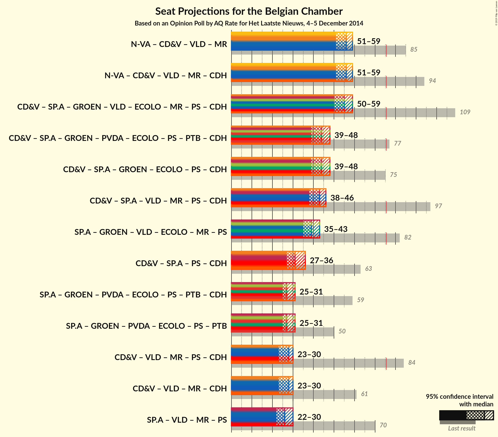

# Opinion Poll by AQ Rate for Het Laatste Nieuws, 4–5 December 2014

<a href="#voting-intentions">Voting Intentions</a> | <a href="#seats">Seats</a> | <a href="#coalitions">Coalitions</a> | <a href="#technical-information">Technical Information</a>

## Voting Intentions

### Confidence Intervals

| Party | Last Result | Poll Result | 80% Confidence Interval | 90% Confidence Interval | 95% Confidence Interval | 99% Confidence Interval |
|:-----:|:-----------:|:-----------:|:-----------------------:|:-----------------------:|:-----------------------:|:-----------------------:|
| N-VA | 20.3% | 28.0% | 26.0–30.1% |25.4–30.7% |25.0–31.2% |24.0–32.2% |
| CD&V | 11.6% | 17.0% | 15.4–18.8% |14.9–19.3% |14.5–19.8% |13.8–20.7% |
| sp.a | 8.8% | 16.0% | 14.4–17.8% |14.0–18.3% |13.6–18.7% |12.9–19.6% |
| Groen | 5.3% | 14.0% | 12.5–15.7% |12.1–16.2% |11.7–16.6% |11.1–17.4% |
| Open Vld | 9.8% | 12.0% | 10.6–13.6% |10.2–14.0% |9.9–14.4% |9.3–15.2% |
| Vlaams Belang | 3.7% | 6.0% | 5.1–7.3% |4.8–7.6% |4.6–7.9% |4.2–8.6% |
| PVDA | 1.8% | 2.0% | 1.5–2.8% |1.4–3.0% |1.2–3.3% |1.0–3.7% |

*Note:* The poll result column reflects the actual value used in the calculations. Published results may vary slightly, and in addition be rounded to fewer digits.

## Seats

### Confidence Intervals

| Party | Last Result | Median | 80% Confidence Interval | 90% Confidence Interval | 95% Confidence Interval | 99% Confidence Interval |
|:-----:|:-----------:|:------:|:-----------------------:|:-----------------------:|:-----------------------:|:-----------------------:|
| <a href="#n-va">N-VA</a> | 33 | 28 | 26–31 |25–31 |24–31 |24–33 |
| <a href="#cd&v">CD&V</a> | 18 | 17 | 13–18 |13–18 |13–18 |13–20 |
| <a href="#sp.a">sp.a</a> | 13 | 15 | 13–18 |13–18 |13–18 |12–19 |
| <a href="#groen">Groen</a> | 6 | 12 | 12–15 |11–16 |11–16 |10–16 |
| <a href="#open-vld">Open Vld</a> | 14 | 11 | 10–12 |8–13 |8–13 |8–14 |
| <a href="#vlaams-belang">Vlaams Belang</a> | 3 | 4 | 2–6 |2–6 |2–7 |1–7 |
| <a href="#pvda">PVDA</a> | 0 | 0 | 0 |0 |0 |0 |

### N-VA

*For a full overview of the results for this party, see the [N-VA](party-nva.html) page.*

| Number of Seats | Probability | Accumulated | Special Marks |
|:---------------:|:-----------:|:-----------:|:-------------:|
| 22 | 0.1% | 100% |  |
| 23 | 0.2% | 99.9% |  |
| 24 | 3% | 99.8% |  |
| 25 | 3% | 96% |  |
| 26 | 14% | 93% |  |
| 27 | 23% | 79% |  |
| 28 | 18% | 56% | Median |
| 29 | 13% | 38% |  |
| 30 | 11% | 25% |  |
| 31 | 13% | 15% |  |
| 32 | 1.3% | 2% |  |
| 33 | 0.3% | 0.5% | Last Result |
| 34 | 0.2% | 0.3% |  |
| 35 | 0% | 0% |  |

### CD&V

*For a full overview of the results for this party, see the [CD&V](party-cdv.html) page.*

| Number of Seats | Probability | Accumulated | Special Marks |
|:---------------:|:-----------:|:-----------:|:-------------:|
| 13 | 12% | 100% |  |
| 14 | 13% | 88% |  |
| 15 | 8% | 75% |  |
| 16 | 9% | 67% |  |
| 17 | 14% | 58% | Median |
| 18 | 42% | 44% | Last Result |
| 19 | 1.4% | 2% |  |
| 20 | 0.4% | 0.7% |  |
| 21 | 0.2% | 0.3% |  |
| 22 | 0.1% | 0.1% |  |
| 23 | 0% | 0% |  |

### sp.a

*For a full overview of the results for this party, see the [sp.a](party-spa.html) page.*

| Number of Seats | Probability | Accumulated | Special Marks |
|:---------------:|:-----------:|:-----------:|:-------------:|
| 10 | 0% | 100% |  |
| 11 | 0.2% | 99.9% |  |
| 12 | 0.4% | 99.7% |  |
| 13 | 21% | 99.3% | Last Result |
| 14 | 19% | 78% |  |
| 15 | 28% | 59% | Median |
| 16 | 11% | 31% |  |
| 17 | 8% | 20% |  |
| 18 | 11% | 12% |  |
| 19 | 0.7% | 0.8% |  |
| 20 | 0.1% | 0.2% |  |
| 21 | 0% | 0% |  |

### Groen

*For a full overview of the results for this party, see the [Groen](party-groen.html) page.*

| Number of Seats | Probability | Accumulated | Special Marks |
|:---------------:|:-----------:|:-----------:|:-------------:|
| 6 | 0% | 100% | Last Result |
| 7 | 0% | 100% |  |
| 8 | 0% | 100% |  |
| 9 | 0.3% | 100% |  |
| 10 | 1.0% | 99.6% |  |
| 11 | 4% | 98.6% |  |
| 12 | 65% | 95% | Median |
| 13 | 11% | 30% |  |
| 14 | 7% | 19% |  |
| 15 | 6% | 12% |  |
| 16 | 5% | 6% |  |
| 17 | 0.2% | 0.3% |  |
| 18 | 0.1% | 0.1% |  |
| 19 | 0% | 0% |  |

### Open Vld

*For a full overview of the results for this party, see the [Open Vld](party-openvld.html) page.*

| Number of Seats | Probability | Accumulated | Special Marks |
|:---------------:|:-----------:|:-----------:|:-------------:|
| 7 | 0.4% | 100% |  |
| 8 | 5% | 99.6% |  |
| 9 | 4% | 94% |  |
| 10 | 12% | 91% |  |
| 11 | 37% | 78% | Median |
| 12 | 35% | 41% |  |
| 13 | 5% | 6% |  |
| 14 | 0.4% | 0.6% | Last Result |
| 15 | 0.1% | 0.2% |  |
| 16 | 0.1% | 0.1% |  |
| 17 | 0% | 0% |  |

### Vlaams Belang

*For a full overview of the results for this party, see the [Vlaams Belang](party-vlaamsbelang.html) page.*

| Number of Seats | Probability | Accumulated | Special Marks |
|:---------------:|:-----------:|:-----------:|:-------------:|
| 0 | 0.4% | 100% |  |
| 1 | 2% | 99.6% |  |
| 2 | 30% | 98% |  |
| 3 | 13% | 67% | Last Result |
| 4 | 8% | 54% | Median |
| 5 | 26% | 46% |  |
| 6 | 15% | 20% |  |
| 7 | 4% | 5% |  |
| 8 | 0.3% | 0.3% |  |
| 9 | 0% | 0% |  |

### PVDA

*For a full overview of the results for this party, see the [PVDA](party-pvda.html) page.*

| Number of Seats | Probability | Accumulated | Special Marks |
|:---------------:|:-----------:|:-----------:|:-------------:|
| 0 | 100% | 100% | Last Result, Median |

## Coalitions

### Confidence Intervals

| Coalition | Last Result | Median | Majority? | 80% Confidence Interval | 90% Confidence Interval | 95% Confidence Interval | 99% Confidence Interval |
|:---------:|:-----------:|:------:|:---------:|:-----------------------:|:-----------------------:|:-----------------------:|:-----------------------:|

## Technical Information

### Opinion Poll

+ **Pollster:** AQ Rate
+ **Media:** Het Laatste Nieuws
+ **Fieldwork period:** 4–5 December 2014

### Calculations

+ **Sample size:** 794
+ **Simulations done:** 0
+ **Error estimate:** 100.00%

