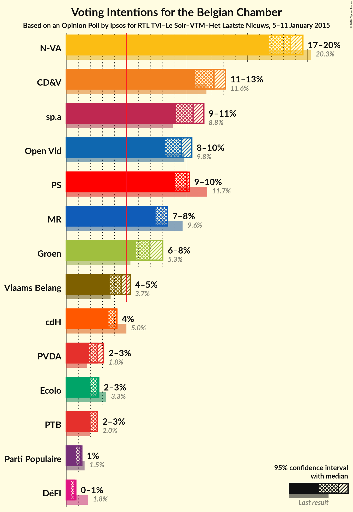
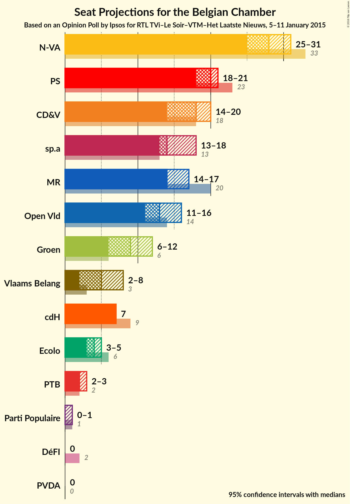
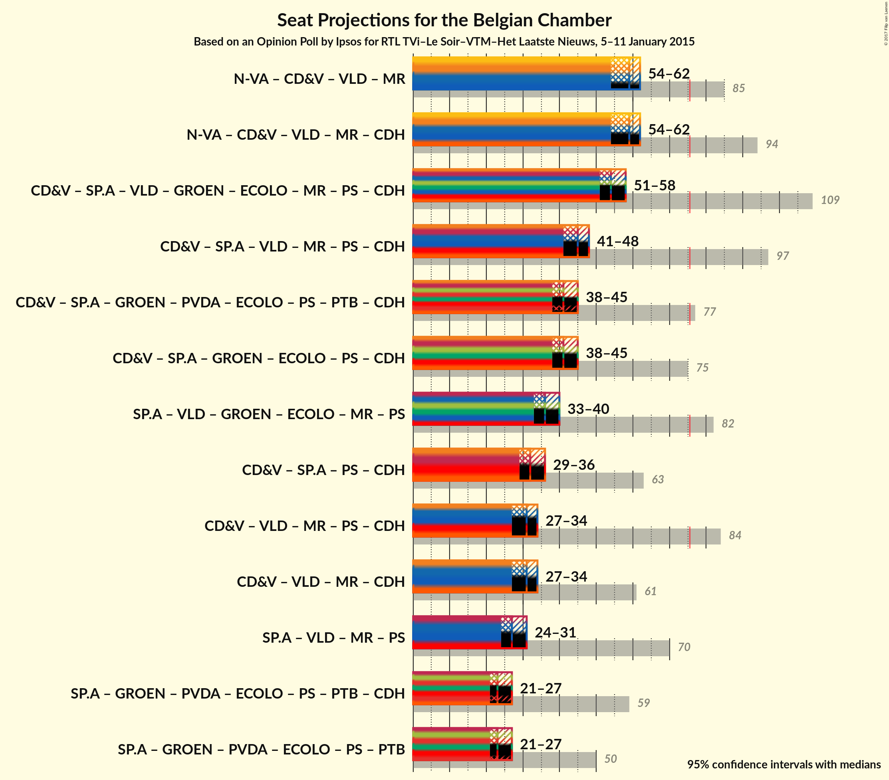

# Opinion Poll by Ipsos for RTL TVi–Le Soir–VTM–Het Laatste Nieuws, 5–11 January 2015

Areas included: Flanders

<a href="#voting-intentions">Voting Intentions</a> | <a href="#seats">Seats</a> | <a href="#coalitions">Coalitions</a> | <a href="#technical-information">Technical Information</a>

## Voting Intentions

### Confidence Intervals

| Party | Last Result | Poll Result | 80% Confidence Interval | 90% Confidence Interval | 95% Confidence Interval | 99% Confidence Interval |
|:-----:|:-----------:|:-----------:|:-----------------------:|:-----------------------:|:-----------------------:|:-----------------------:|
| N-VA | 20.3% | 27.8% | 26.1–29.6% |25.6–30.2% |25.2–30.6% |24.4–31.5% |
| CD&V | 11.6% | 18.3% | 16.8–19.9% |16.4–20.4% |16.1–20.8% |15.4–21.6% |
| sp.a | 8.8% | 15.7% | 14.4–17.3% |14.0–17.7% |13.6–18.1% |13.0–18.8% |
| Open Vld | 9.8% | 14.3% | 13.0–15.8% |12.6–16.2% |12.3–16.6% |11.7–17.3% |
| Groen | 5.3% | 10.4% | 9.2–11.7% |8.9–12.0% |8.6–12.4% |8.1–13.0% |
| Vlaams Belang | 3.7% | 6.8% | 5.9–7.9% |5.6–8.2% |5.4–8.5% |5.0–9.1% |
| PVDA | 1.8% | 3.8% | 3.2–4.7% |3.0–5.0% |2.8–5.2% |2.5–5.6% |

*Note:* The poll result column reflects the actual value used in the calculations. Published results may vary slightly, and in addition be rounded to fewer digits.

## Seats

### Confidence Intervals

| Party | Last Result | Median | 80% Confidence Interval | 90% Confidence Interval | 95% Confidence Interval | 99% Confidence Interval |
|:-----:|:-----------:|:------:|:-----------------------:|:-----------------------:|:-----------------------:|:-----------------------:|
| <a href="#n-va">N-VA</a> | 33 | 28 | 26–30 |25–31 |25–31 |24–32 |
| <a href="#cd&v">CD&V</a> | 18 | 18 | 16–19 |15–19 |14–20 |13–22 |
| <a href="#sp.a">sp.a</a> | 13 | 14 | 13–17 |13–17 |13–18 |12–18 |
| <a href="#open-vld">Open Vld</a> | 14 | 13 | 12–14 |11–15 |11–16 |11–17 |
| <a href="#groen">Groen</a> | 6 | 9 | 7–11 |7–12 |6–12 |6–12 |
| <a href="#vlaams-belang">Vlaams Belang</a> | 3 | 5 | 3–7 |3–7 |2–8 |2–8 |
| <a href="#pvda">PVDA</a> | 0 | 0 | 0 |0 |0 |0 |

### N-VA

*For a full overview of the results for this party, see the [N-VA](party-nva.html) page.*

| Number of Seats | Probability | Accumulated | Special Marks |
|:---------------:|:-----------:|:-----------:|:-------------:|
| 23 | 0.3% | 100% |  |
| 24 | 2% | 99.7% |  |
| 25 | 4% | 98% |  |
| 26 | 22% | 94% |  |
| 27 | 18% | 72% |  |
| 28 | 18% | 53% | Median |
| 29 | 20% | 35% |  |
| 30 | 8% | 15% |  |
| 31 | 7% | 8% |  |
| 32 | 0.6% | 0.7% |  |
| 33 | 0.1% | 0.1% | Last Result |
| 34 | 0% | 0% |  |

### CD&V

*For a full overview of the results for this party, see the [CD&V](party-cdv.html) page.*

| Number of Seats | Probability | Accumulated | Special Marks |
|:---------------:|:-----------:|:-----------:|:-------------:|
| 13 | 1.1% | 100% |  |
| 14 | 2% | 98.9% |  |
| 15 | 4% | 97% |  |
| 16 | 6% | 93% |  |
| 17 | 13% | 87% |  |
| 18 | 58% | 74% | Last Result, Median |
| 19 | 13% | 16% |  |
| 20 | 2% | 4% |  |
| 21 | 0.9% | 2% |  |
| 22 | 0.5% | 0.6% |  |
| 23 | 0.1% | 0.1% |  |
| 24 | 0% | 0% |  |

### sp.a

*For a full overview of the results for this party, see the [sp.a](party-spa.html) page.*

| Number of Seats | Probability | Accumulated | Special Marks |
|:---------------:|:-----------:|:-----------:|:-------------:|
| 10 | 0% | 100% |  |
| 11 | 0.1% | 99.9% |  |
| 12 | 0.4% | 99.8% |  |
| 13 | 39% | 99.5% | Last Result |
| 14 | 14% | 60% | Median |
| 15 | 21% | 46% |  |
| 16 | 16% | 26% |  |
| 17 | 7% | 10% |  |
| 18 | 3% | 3% |  |
| 19 | 0.1% | 0.1% |  |
| 20 | 0% | 0% |  |

### Open Vld

*For a full overview of the results for this party, see the [Open Vld](party-openvld.html) page.*

| Number of Seats | Probability | Accumulated | Special Marks |
|:---------------:|:-----------:|:-----------:|:-------------:|
| 10 | 0.2% | 100% |  |
| 11 | 6% | 99.8% |  |
| 12 | 27% | 93% |  |
| 13 | 50% | 67% | Median |
| 14 | 8% | 17% | Last Result |
| 15 | 5% | 8% |  |
| 16 | 2% | 4% |  |
| 17 | 2% | 2% |  |
| 18 | 0.3% | 0.3% |  |
| 19 | 0% | 0% |  |

### Groen

*For a full overview of the results for this party, see the [Groen](party-groen.html) page.*

| Number of Seats | Probability | Accumulated | Special Marks |
|:---------------:|:-----------:|:-----------:|:-------------:|
| 5 | 0.1% | 100% |  |
| 6 | 4% | 99.9% | Last Result |
| 7 | 8% | 96% |  |
| 8 | 26% | 87% |  |
| 9 | 30% | 61% | Median |
| 10 | 18% | 31% |  |
| 11 | 8% | 13% |  |
| 12 | 5% | 5% |  |
| 13 | 0% | 0% |  |

### Vlaams Belang

*For a full overview of the results for this party, see the [Vlaams Belang](party-vlaamsbelang.html) page.*

| Number of Seats | Probability | Accumulated | Special Marks |
|:---------------:|:-----------:|:-----------:|:-------------:|
| 1 | 0.1% | 100% |  |
| 2 | 5% | 99.9% |  |
| 3 | 9% | 95% | Last Result |
| 4 | 5% | 86% |  |
| 5 | 39% | 81% | Median |
| 6 | 25% | 42% |  |
| 7 | 14% | 17% |  |
| 8 | 3% | 3% |  |
| 9 | 0% | 0% |  |

### PVDA

*For a full overview of the results for this party, see the [PVDA](party-pvda.html) page.*

| Number of Seats | Probability | Accumulated | Special Marks |
|:---------------:|:-----------:|:-----------:|:-------------:|
| 0 | 100% | 100% | Last Result, Median |

## Coalitions

### Confidence Intervals

| Coalition | Last Result | Median | Majority? | 80% Confidence Interval | 90% Confidence Interval | 95% Confidence Interval | 99% Confidence Interval |
|:---------:|:-----------:|:------:|:---------:|:-----------------------:|:-----------------------:|:-----------------------:|:-----------------------:|

## Technical Information

### Opinion Poll

+ **Pollster:** Ipsos
+ **Media:** RTL TVi–Le Soir–VTM–Het Laatste Nieuws
+ **Fieldwork period:** 5–11 January 2015

### Calculations

+ **Sample size:** 1043
+ **Simulations done:** 2,097,152
+ **Error estimate:** 0.91%

