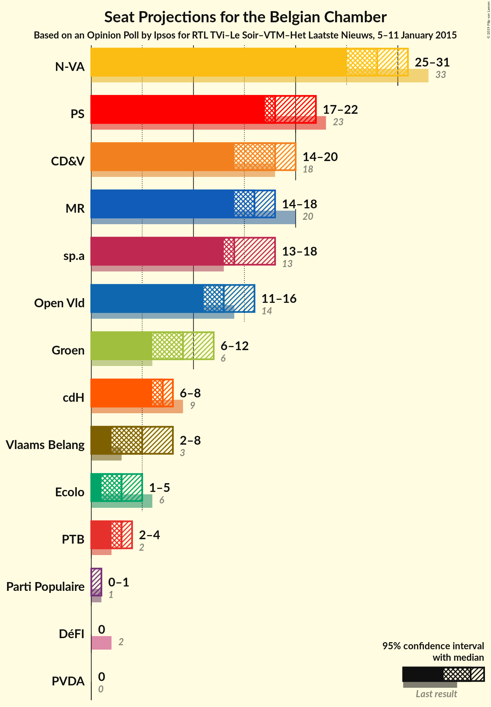
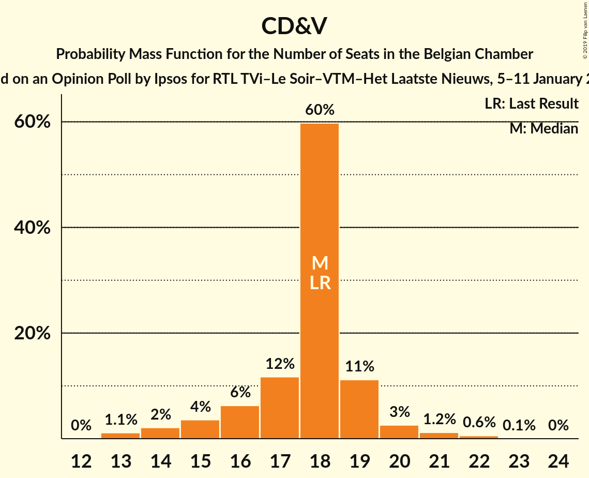
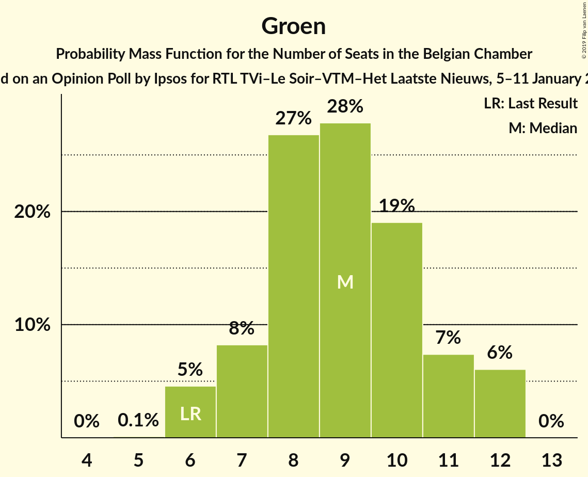
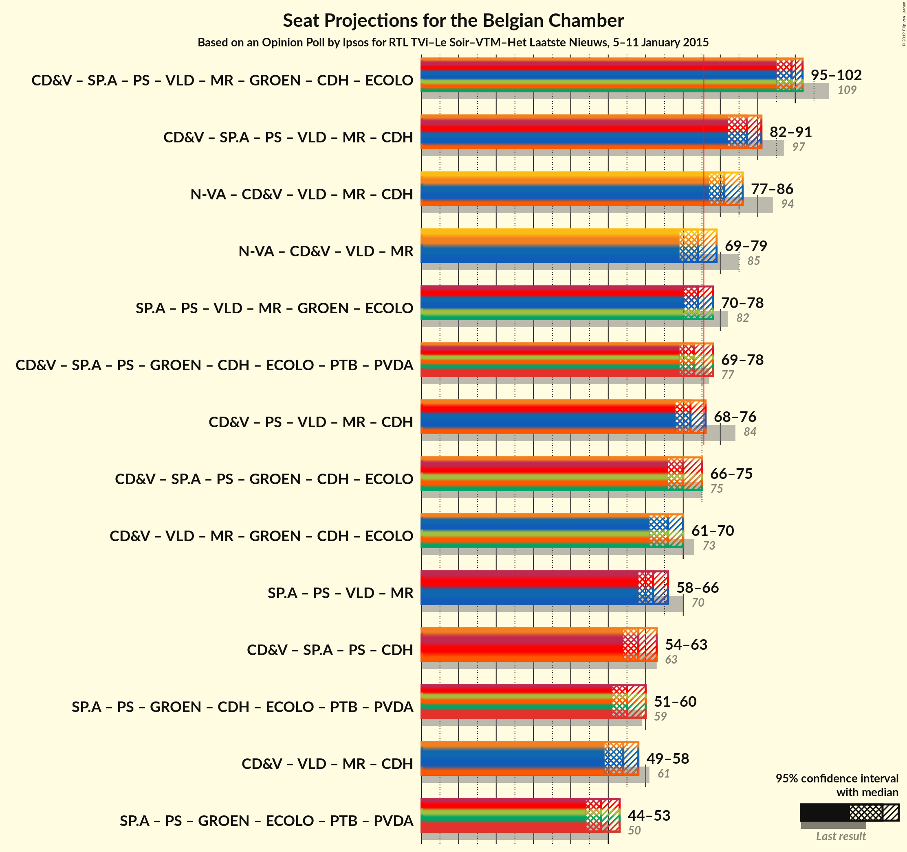

# Opinion Poll by Ipsos for RTL TVi–Le Soir–VTM–Het Laatste Nieuws, 5–11 January 2015

Areas included: Flanders, Wallonia

<a href="#voting-intentions">Voting Intentions</a> | <a href="#seats">Seats</a> | <a href="#coalitions">Coalitions</a> | <a href="#technical-information">Technical Information</a>

## Voting Intentions

### Confidence Intervals

| Party | Last Result | Poll Result | 80% Confidence Interval | 90% Confidence Interval | 95% Confidence Interval | 99% Confidence Interval |
|:-----:|:-----------:|:-----------:|:-----------------------:|:-----------------------:|:-----------------------:|:-----------------------:|
| N-VA | 20.3% | 18.6% | 26.1–29.6% |25.6–30.2% |25.2–30.6% |24.4–31.5% |
| CD&V | 11.6% | 12.2% | 16.8–19.9% |16.4–20.4% |16.1–20.8% |15.4–21.6% |
| sp.a | 8.8% | 10.5% | 14.4–17.3% |14.0–17.7% |13.6–18.1% |13.0–18.8% |
| PS | 11.7% | 10.0% | N/A |N/A |N/A |N/A |
| Open Vld | 9.8% | 9.5% | 13.0–15.8% |12.6–16.2% |12.3–16.6% |11.7–17.3% |
| MR | 9.6% | 8.4% | N/A |N/A |N/A |N/A |
| Groen | 5.3% | 6.9% | 9.2–11.7% |8.9–12.0% |8.6–12.4% |8.1–13.0% |
| Vlaams Belang | 3.7% | 4.5% | 5.9–7.9% |5.6–8.2% |5.4–8.5% |5.0–9.1% |
| cdH | 5.0% | 4.2% | N/A |N/A |N/A |N/A |
| PVDA | 1.8% | 2.6% | 3.2–4.7% |3.0–5.0% |2.8–5.2% |2.5–5.6% |
| Ecolo | 3.3% | 2.6% | N/A |N/A |N/A |N/A |
| PTB | 2.0% | 2.6% | N/A |N/A |N/A |N/A |
| Parti Populaire | 1.5% | 1.2% | N/A |N/A |N/A |N/A |
| DéFI | 1.8% | 0.7% | N/A |N/A |N/A |N/A |

*Note:* The poll result column reflects the actual value used in the calculations. Published results may vary slightly, and in addition be rounded to fewer digits.

## Seats

### Confidence Intervals

| Party | Last Result | Median | 80% Confidence Interval | 90% Confidence Interval | 95% Confidence Interval | 99% Confidence Interval |
|:-----:|:-----------:|:------:|:-----------------------:|:-----------------------:|:-----------------------:|:-----------------------:|
| <a href="#n-va">N-VA</a> | 33 | 28 | 26–30 |25–31 |25–31 |24–32 |
| <a href="#cd&v">CD&V</a> | 18 | 18 | 16–19 |15–19 |14–20 |13–22 |
| <a href="#sp.a">sp.a</a> | 13 | 14 | 13–17 |13–17 |13–18 |12–18 |
| <a href="#ps">PS</a> | 23 | 20 | 19–20 |18–21 |18–21 |18–22 |
| <a href="#open-vld">Open Vld</a> | 14 | 13 | 12–14 |11–15 |11–16 |11–17 |
| <a href="#mr">MR</a> | 20 | 14 | 14–16 |14–17 |14–17 |14–17 |
| <a href="#groen">Groen</a> | 6 | 9 | 7–11 |7–12 |6–12 |6–12 |
| <a href="#vlaams-belang">Vlaams Belang</a> | 3 | 5 | 3–7 |3–7 |2–8 |2–8 |
| <a href="#cdh">cdH</a> | 9 | 7 | 7 |7 |7 |7 |
| <a href="#pvda">PVDA</a> | 0 | 0 | 0 |0 |0 |0 |
| <a href="#ecolo">Ecolo</a> | 6 | 4 | 3–5 |3–5 |3–5 |1–5 |
| <a href="#ptb">PTB</a> | 2 | 2 | 2–3 |2–3 |2–3 |2–4 |
| <a href="#parti-populaire">Parti Populaire</a> | 1 | 0 | 0 |0 |0–1 |0–1 |
| <a href="#défi">DéFI</a> | 2 | 0 | 0 |0 |0 |0 |

### N-VA

*For a full overview of the results for this party, see the [N-VA](party-n-va.html) page.*

| Number of Seats | Probability | Accumulated | Special Marks |
|:---------------:|:-----------:|:-----------:|:-------------:|
| 23 | 0.3% | 100% |  |
| 24 | 2% | 99.6% |  |
| 25 | 5% | 98% |  |
| 26 | 23% | 93% |  |
| 27 | 15% | 70% |  |
| 28 | 18% | 55% | Median |
| 29 | 19% | 36% |  |
| 30 | 10% | 17% |  |
| 31 | 6% | 7% |  |
| 32 | 0.5% | 0.7% |  |
| 33 | 0.1% | 0.1% | Last Result |
| 34 | 0% | 0% |  |

### CD&V

*For a full overview of the results for this party, see the [CD&V](party-cdv.html) page.*

| Number of Seats | Probability | Accumulated | Special Marks |
|:---------------:|:-----------:|:-----------:|:-------------:|
| 13 | 1.1% | 100% |  |
| 14 | 2% | 98.9% |  |
| 15 | 4% | 97% |  |
| 16 | 6% | 93% |  |
| 17 | 12% | 87% |  |
| 18 | 59% | 75% | Last Result, Median |
| 19 | 12% | 16% |  |
| 20 | 2% | 4% |  |
| 21 | 1.1% | 2% |  |
| 22 | 0.6% | 0.6% |  |
| 23 | 0% | 0.1% |  |
| 24 | 0% | 0% |  |

### sp.a

*For a full overview of the results for this party, see the [sp.a](party-spa.html) page.*

| Number of Seats | Probability | Accumulated | Special Marks |
|:---------------:|:-----------:|:-----------:|:-------------:|
| 11 | 0.1% | 100% |  |
| 12 | 0.4% | 99.9% |  |
| 13 | 40% | 99.5% | Last Result |
| 14 | 14% | 59% | Median |
| 15 | 20% | 45% |  |
| 16 | 14% | 25% |  |
| 17 | 8% | 11% |  |
| 18 | 3% | 3% |  |
| 19 | 0.1% | 0.1% |  |
| 20 | 0% | 0% |  |

### PS

*For a full overview of the results for this party, see the [PS](party-ps.html) page.*

| Number of Seats | Probability | Accumulated | Special Marks |
|:---------------:|:-----------:|:-----------:|:-------------:|
| 16 | 0.1% | 100% |  |
| 17 | 0% | 99.9% |  |
| 18 | 9% | 99.9% |  |
| 19 | 37% | 90% |  |
| 20 | 48% | 53% | Median |
| 21 | 5% | 5% |  |
| 22 | 0.6% | 0.8% |  |
| 23 | 0.2% | 0.2% | Last Result |
| 24 | 0% | 0% |  |

### Open Vld

*For a full overview of the results for this party, see the [Open Vld](party-openvld.html) page.*

| Number of Seats | Probability | Accumulated | Special Marks |
|:---------------:|:-----------:|:-----------:|:-------------:|
| 10 | 0.2% | 100% |  |
| 11 | 6% | 99.8% |  |
| 12 | 28% | 93% |  |
| 13 | 47% | 65% | Median |
| 14 | 9% | 18% | Last Result |
| 15 | 5% | 9% |  |
| 16 | 2% | 4% |  |
| 17 | 2% | 2% |  |
| 18 | 0.3% | 0.3% |  |
| 19 | 0% | 0% |  |

### MR

*For a full overview of the results for this party, see the [MR](party-mr.html) page.*

| Number of Seats | Probability | Accumulated | Special Marks |
|:---------------:|:-----------:|:-----------:|:-------------:|
| 13 | 0.3% | 100% |  |
| 14 | 53% | 99.7% | Median |
| 15 | 0.2% | 46% |  |
| 16 | 37% | 46% |  |
| 17 | 9% | 9% |  |
| 18 | 0% | 0% |  |
| 19 | 0% | 0% |  |
| 20 | 0% | 0% | Last Result |

### Groen

*For a full overview of the results for this party, see the [Groen](party-groen.html) page.*

| Number of Seats | Probability | Accumulated | Special Marks |
|:---------------:|:-----------:|:-----------:|:-------------:|
| 5 | 0.1% | 100% |  |
| 6 | 5% | 99.9% | Last Result |
| 7 | 9% | 95% |  |
| 8 | 27% | 87% |  |
| 9 | 28% | 59% | Median |
| 10 | 18% | 31% |  |
| 11 | 7% | 13% |  |
| 12 | 6% | 6% |  |
| 13 | 0% | 0% |  |

### Vlaams Belang

*For a full overview of the results for this party, see the [Vlaams Belang](party-vlaamsbelang.html) page.*

| Number of Seats | Probability | Accumulated | Special Marks |
|:---------------:|:-----------:|:-----------:|:-------------:|
| 1 | 0.1% | 100% |  |
| 2 | 4% | 99.9% |  |
| 3 | 10% | 96% | Last Result |
| 4 | 5% | 86% |  |
| 5 | 41% | 81% | Median |
| 6 | 22% | 40% |  |
| 7 | 15% | 17% |  |
| 8 | 3% | 3% |  |
| 9 | 0% | 0% |  |

### cdH

*For a full overview of the results for this party, see the [cdH](party-cdh.html) page.*

| Number of Seats | Probability | Accumulated | Special Marks |
|:---------------:|:-----------:|:-----------:|:-------------:|
| 6 | 0.1% | 100% |  |
| 7 | 99.5% | 99.9% | Median |
| 8 | 0.1% | 0.4% |  |
| 9 | 0.2% | 0.3% | Last Result |
| 10 | 0.1% | 0.1% |  |
| 11 | 0% | 0% |  |

### PVDA

*For a full overview of the results for this party, see the [PVDA](party-pvda.html) page.*

| Number of Seats | Probability | Accumulated | Special Marks |
|:---------------:|:-----------:|:-----------:|:-------------:|
| 0 | 100% | 100% | Last Result, Median |

### Ecolo

*For a full overview of the results for this party, see the [Ecolo](party-ecolo.html) page.*

| Number of Seats | Probability | Accumulated | Special Marks |
|:---------------:|:-----------:|:-----------:|:-------------:|
| 1 | 0.8% | 100% |  |
| 2 | 0.4% | 99.2% |  |
| 3 | 14% | 98.9% |  |
| 4 | 37% | 85% | Median |
| 5 | 48% | 48% |  |
| 6 | 0% | 0% | Last Result |

### PTB

*For a full overview of the results for this party, see the [PTB](party-ptb.html) page.*

| Number of Seats | Probability | Accumulated | Special Marks |
|:---------------:|:-----------:|:-----------:|:-------------:|
| 2 | 90% | 100% | Last Result, Median |
| 3 | 10% | 10% |  |
| 4 | 0.6% | 0.7% |  |
| 5 | 0% | 0.1% |  |
| 6 | 0.1% | 0.1% |  |
| 7 | 0% | 0% |  |

### Parti Populaire

*For a full overview of the results for this party, see the [Parti Populaire](party-partipopulaire.html) page.*

| Number of Seats | Probability | Accumulated | Special Marks |
|:---------------:|:-----------:|:-----------:|:-------------:|
| 0 | 95% | 100% | Median |
| 1 | 5% | 5% | Last Result |
| 2 | 0.1% | 0.1% |  |
| 3 | 0% | 0% |  |

### DéFI

*For a full overview of the results for this party, see the [DéFI](party-défi.html) page.*

| Number of Seats | Probability | Accumulated | Special Marks |
|:---------------:|:-----------:|:-----------:|:-------------:|
| 0 | 100% | 100% | Median |
| 1 | 0% | 0% |  |
| 2 | 0% | 0% | Last Result |

## Coalitions

### Confidence Intervals

| Coalition | Last Result | Median | Majority? | 80% Confidence Interval | 90% Confidence Interval | 95% Confidence Interval | 99% Confidence Interval |
|:---------:|:-----------:|:------:|:---------:|:-----------------------:|:-----------------------:|:-----------------------:|:-----------------------:|
| CD&V – sp.a – PS – Open Vld – MR – Groen – cdH – Ecolo | 109 | 100 | 100% | 97–102 | 97–103 | 96–103 | 95–105 |
| CD&V – sp.a – PS – Open Vld – MR – cdH | 97 | 87 | 100% | 84–89 | 83–90 | 83–90 | 82–92 |
| N-VA – CD&V – Open Vld – MR – cdH | 94 | 81 | 98% | 77–83 | 77–84 | 76–85 | 75–86 |
| sp.a – PS – Open Vld – MR – Groen – Ecolo | 82 | 75 | 43% | 72–78 | 72–78 | 72–79 | 70–80 |
| CD&V – sp.a – PS – Groen – cdH – Ecolo – PTB – PVDA | 77 | 74 | 27% | 71–77 | 70–78 | 70–78 | 69–79 |
| N-VA – CD&V – Open Vld – MR | 85 | 74 | 19% | 70–76 | 70–77 | 69–78 | 68–79 |
| CD&V – PS – Open Vld – MR – cdH | 84 | 72 | 3% | 70–74 | 69–75 | 69–76 | 67–77 |
| CD&V – sp.a – PS – Groen – cdH – Ecolo | 75 | 72 | 6% | 69–75 | 68–76 | 67–76 | 66–77 |
| sp.a – PS – Open Vld – MR | 70 | 62 | 0% | 60–64 | 59–65 | 59–65 | 58–67 |
| CD&V – sp.a – PS – cdH | 63 | 59 | 0% | 56–61 | 56–62 | 55–62 | 54–64 |
| sp.a – PS – Groen – cdH – Ecolo – PTB – PVDA | 59 | 56 | 0% | 53–59 | 53–60 | 52–61 | 51–62 |
| CD&V – Open Vld – MR – cdH | 61 | 53 | 0% | 50–55 | 50–56 | 49–57 | 47–58 |
| sp.a – PS – Groen – Ecolo – PTB – PVDA | 50 | 49 | 0% | 46–52 | 46–53 | 45–54 | 44–55 |
| CD&V – Open Vld – MR – Groen – cdH – Ecolo | 73 | 26 | 0% | 26–27 | 24–27 | 24–27 | 22–27 |

### CD&V – sp.a – PS – Open Vld – MR – Groen – cdH – Ecolo

| Number of Seats | Probability | Accumulated | Special Marks |
|:---------------:|:-----------:|:-----------:|:-------------:|
| 93 | 0% | 100% |  |
| 94 | 0.1% | 99.9% |  |
| 95 | 0.6% | 99.8% |  |
| 96 | 3% | 99.2% |  |
| 97 | 10% | 96% |  |
| 98 | 13% | 86% |  |
| 99 | 16% | 73% | Median |
| 100 | 17% | 57% |  |
| 101 | 18% | 40% |  |
| 102 | 15% | 22% |  |
| 103 | 5% | 7% |  |
| 104 | 2% | 2% |  |
| 105 | 0.6% | 0.7% |  |
| 106 | 0.1% | 0.2% |  |
| 107 | 0% | 0% |  |
| 108 | 0% | 0% |  |
| 109 | 0% | 0% | Last Result |

### CD&V – sp.a – PS – Open Vld – MR – cdH

| Number of Seats | Probability | Accumulated | Special Marks |
|:---------------:|:-----------:|:-----------:|:-------------:|
| 80 | 0.1% | 100% |  |
| 81 | 0.3% | 99.9% |  |
| 82 | 1.2% | 99.7% |  |
| 83 | 5% | 98% |  |
| 84 | 10% | 94% |  |
| 85 | 15% | 84% |  |
| 86 | 17% | 69% | Median |
| 87 | 15% | 52% |  |
| 88 | 17% | 37% |  |
| 89 | 13% | 19% |  |
| 90 | 4% | 6% |  |
| 91 | 1.1% | 2% |  |
| 92 | 0.5% | 0.7% |  |
| 93 | 0.2% | 0.2% |  |
| 94 | 0% | 0.1% |  |
| 95 | 0% | 0% |  |
| 96 | 0% | 0% |  |
| 97 | 0% | 0% | Last Result |

### N-VA – CD&V – Open Vld – MR – cdH

| Number of Seats | Probability | Accumulated | Special Marks |
|:---------------:|:-----------:|:-----------:|:-------------:|
| 73 | 0.1% | 100% |  |
| 74 | 0.3% | 99.9% |  |
| 75 | 1.1% | 99.6% |  |
| 76 | 3% | 98% | Majority |
| 77 | 7% | 95% |  |
| 78 | 9% | 89% |  |
| 79 | 13% | 80% |  |
| 80 | 16% | 67% | Median |
| 81 | 18% | 51% |  |
| 82 | 14% | 33% |  |
| 83 | 10% | 19% |  |
| 84 | 6% | 9% |  |
| 85 | 2% | 3% |  |
| 86 | 0.6% | 0.9% |  |
| 87 | 0.2% | 0.3% |  |
| 88 | 0.1% | 0.1% |  |
| 89 | 0% | 0% |  |
| 90 | 0% | 0% |  |
| 91 | 0% | 0% |  |
| 92 | 0% | 0% |  |
| 93 | 0% | 0% |  |
| 94 | 0% | 0% | Last Result |

### sp.a – PS – Open Vld – MR – Groen – Ecolo

| Number of Seats | Probability | Accumulated | Special Marks |
|:---------------:|:-----------:|:-----------:|:-------------:|
| 68 | 0% | 100% |  |
| 69 | 0.1% | 99.9% |  |
| 70 | 0.4% | 99.8% |  |
| 71 | 2% | 99.5% |  |
| 72 | 8% | 98% |  |
| 73 | 13% | 90% |  |
| 74 | 17% | 77% | Median |
| 75 | 17% | 60% |  |
| 76 | 18% | 43% | Majority |
| 77 | 14% | 25% |  |
| 78 | 7% | 11% |  |
| 79 | 3% | 4% |  |
| 80 | 0.9% | 1.4% |  |
| 81 | 0.3% | 0.5% |  |
| 82 | 0.1% | 0.1% | Last Result |
| 83 | 0% | 0% |  |

### CD&V – sp.a – PS – Groen – cdH – Ecolo – PTB – PVDA

| Number of Seats | Probability | Accumulated | Special Marks |
|:---------------:|:-----------:|:-----------:|:-------------:|
| 67 | 0.1% | 100% |  |
| 68 | 0.3% | 99.9% |  |
| 69 | 1.0% | 99.5% |  |
| 70 | 4% | 98.5% |  |
| 71 | 9% | 95% |  |
| 72 | 11% | 86% |  |
| 73 | 17% | 75% |  |
| 74 | 16% | 58% | Median |
| 75 | 15% | 41% |  |
| 76 | 12% | 27% | Majority |
| 77 | 8% | 15% | Last Result |
| 78 | 5% | 6% |  |
| 79 | 1.3% | 2% |  |
| 80 | 0.3% | 0.4% |  |
| 81 | 0.1% | 0.1% |  |
| 82 | 0% | 0% |  |

### N-VA – CD&V – Open Vld – MR

| Number of Seats | Probability | Accumulated | Special Marks |
|:---------------:|:-----------:|:-----------:|:-------------:|
| 66 | 0.1% | 100% |  |
| 67 | 0.3% | 99.9% |  |
| 68 | 1.1% | 99.6% |  |
| 69 | 3% | 98% |  |
| 70 | 7% | 95% |  |
| 71 | 9% | 89% |  |
| 72 | 13% | 80% |  |
| 73 | 16% | 66% | Median |
| 74 | 18% | 51% |  |
| 75 | 14% | 33% |  |
| 76 | 10% | 19% | Majority |
| 77 | 6% | 9% |  |
| 78 | 2% | 3% |  |
| 79 | 0.5% | 0.8% |  |
| 80 | 0.2% | 0.3% |  |
| 81 | 0% | 0% |  |
| 82 | 0% | 0% |  |
| 83 | 0% | 0% |  |
| 84 | 0% | 0% |  |
| 85 | 0% | 0% | Last Result |

### CD&V – PS – Open Vld – MR – cdH

| Number of Seats | Probability | Accumulated | Special Marks |
|:---------------:|:-----------:|:-----------:|:-------------:|
| 66 | 0.2% | 100% |  |
| 67 | 0.6% | 99.8% |  |
| 68 | 2% | 99.2% |  |
| 69 | 4% | 98% |  |
| 70 | 8% | 94% |  |
| 71 | 17% | 86% |  |
| 72 | 27% | 69% | Median |
| 73 | 24% | 42% |  |
| 74 | 11% | 18% |  |
| 75 | 4% | 7% |  |
| 76 | 2% | 3% | Majority |
| 77 | 0.7% | 1.0% |  |
| 78 | 0.2% | 0.2% |  |
| 79 | 0% | 0% |  |
| 80 | 0% | 0% |  |
| 81 | 0% | 0% |  |
| 82 | 0% | 0% |  |
| 83 | 0% | 0% |  |
| 84 | 0% | 0% | Last Result |

### CD&V – sp.a – PS – Groen – cdH – Ecolo

| Number of Seats | Probability | Accumulated | Special Marks |
|:---------------:|:-----------:|:-----------:|:-------------:|
| 64 | 0.1% | 100% |  |
| 65 | 0.2% | 99.9% |  |
| 66 | 0.7% | 99.7% |  |
| 67 | 2% | 99.1% |  |
| 68 | 4% | 97% |  |
| 69 | 9% | 93% |  |
| 70 | 11% | 84% |  |
| 71 | 17% | 73% |  |
| 72 | 16% | 56% | Median |
| 73 | 14% | 40% |  |
| 74 | 12% | 26% |  |
| 75 | 8% | 14% | Last Result |
| 76 | 5% | 6% | Majority |
| 77 | 1.3% | 2% |  |
| 78 | 0.3% | 0.4% |  |
| 79 | 0.1% | 0.1% |  |
| 80 | 0% | 0% |  |

### sp.a – PS – Open Vld – MR

| Number of Seats | Probability | Accumulated | Special Marks |
|:---------------:|:-----------:|:-----------:|:-------------:|
| 57 | 0.1% | 100% |  |
| 58 | 2% | 99.9% |  |
| 59 | 8% | 98% |  |
| 60 | 17% | 90% |  |
| 61 | 19% | 73% | Median |
| 62 | 15% | 54% |  |
| 63 | 17% | 39% |  |
| 64 | 14% | 21% |  |
| 65 | 5% | 8% |  |
| 66 | 1.4% | 2% |  |
| 67 | 0.5% | 0.8% |  |
| 68 | 0.2% | 0.3% |  |
| 69 | 0.1% | 0.1% |  |
| 70 | 0% | 0% | Last Result |

### CD&V – sp.a – PS – cdH

| Number of Seats | Probability | Accumulated | Special Marks |
|:---------------:|:-----------:|:-----------:|:-------------:|
| 52 | 0.1% | 100% |  |
| 53 | 0.3% | 99.9% |  |
| 54 | 1.2% | 99.6% |  |
| 55 | 3% | 98% |  |
| 56 | 8% | 95% |  |
| 57 | 16% | 88% |  |
| 58 | 21% | 72% |  |
| 59 | 16% | 51% | Median |
| 60 | 15% | 35% |  |
| 61 | 12% | 19% |  |
| 62 | 5% | 8% |  |
| 63 | 2% | 2% | Last Result |
| 64 | 0.4% | 0.6% |  |
| 65 | 0.1% | 0.2% |  |
| 66 | 0% | 0% |  |

### sp.a – PS – Groen – cdH – Ecolo – PTB – PVDA

| Number of Seats | Probability | Accumulated | Special Marks |
|:---------------:|:-----------:|:-----------:|:-------------:|
| 50 | 0.1% | 100% |  |
| 51 | 0.4% | 99.9% |  |
| 52 | 2% | 99.5% |  |
| 53 | 8% | 97% |  |
| 54 | 10% | 89% |  |
| 55 | 18% | 79% |  |
| 56 | 17% | 62% | Median |
| 57 | 15% | 45% |  |
| 58 | 14% | 29% |  |
| 59 | 7% | 16% | Last Result |
| 60 | 6% | 8% |  |
| 61 | 2% | 3% |  |
| 62 | 0.4% | 0.5% |  |
| 63 | 0.1% | 0.1% |  |
| 64 | 0% | 0% |  |

### CD&V – Open Vld – MR – cdH

| Number of Seats | Probability | Accumulated | Special Marks |
|:---------------:|:-----------:|:-----------:|:-------------:|
| 46 | 0.2% | 100% |  |
| 47 | 0.5% | 99.8% |  |
| 48 | 1.3% | 99.3% |  |
| 49 | 3% | 98% |  |
| 50 | 7% | 95% |  |
| 51 | 15% | 88% |  |
| 52 | 21% | 73% | Median |
| 53 | 18% | 52% |  |
| 54 | 17% | 34% |  |
| 55 | 10% | 17% |  |
| 56 | 4% | 7% |  |
| 57 | 2% | 3% |  |
| 58 | 0.7% | 1.0% |  |
| 59 | 0.2% | 0.3% |  |
| 60 | 0.1% | 0.1% |  |
| 61 | 0% | 0% | Last Result |

### sp.a – PS – Groen – Ecolo – PTB – PVDA

| Number of Seats | Probability | Accumulated | Special Marks |
|:---------------:|:-----------:|:-----------:|:-------------:|
| 43 | 0.1% | 100% |  |
| 44 | 0.4% | 99.9% |  |
| 45 | 2% | 99.4% |  |
| 46 | 8% | 97% |  |
| 47 | 10% | 89% |  |
| 48 | 18% | 79% |  |
| 49 | 17% | 62% | Median |
| 50 | 15% | 45% | Last Result |
| 51 | 14% | 29% |  |
| 52 | 7% | 16% |  |
| 53 | 6% | 8% |  |
| 54 | 2% | 3% |  |
| 55 | 0.4% | 0.5% |  |
| 56 | 0.1% | 0.1% |  |
| 57 | 0% | 0% |  |

### CD&V – Open Vld – MR – Groen – cdH – Ecolo

| Number of Seats | Probability | Accumulated | Special Marks |
|:---------------:|:-----------:|:-----------:|:-------------:|
| 22 | 0.5% | 100% |  |
| 23 | 0.5% | 99.5% |  |
| 24 | 4% | 99.0% |  |
| 25 | 0.1% | 95% |  |
| 26 | 48% | 94% |  |
| 27 | 46% | 46% |  |
| 28 | 0.1% | 0.1% |  |
| 29 | 0% | 0% |  |
| 30 | 0% | 0% |  |
| 31 | 0% | 0% |  |
| 32 | 0% | 0% |  |
| 33 | 0% | 0% |  |
| 34 | 0% | 0% |  |
| 35 | 0% | 0% |  |
| 36 | 0% | 0% |  |
| 37 | 0% | 0% |  |
| 38 | 0% | 0% |  |
| 39 | 0% | 0% |  |
| 40 | 0% | 0% |  |
| 41 | 0% | 0% |  |
| 42 | 0% | 0% |  |
| 43 | 0% | 0% |  |
| 44 | 0% | 0% |  |
| 45 | 0% | 0% |  |
| 46 | 0% | 0% |  |
| 47 | 0% | 0% |  |
| 48 | 0% | 0% |  |
| 49 | 0% | 0% |  |
| 50 | 0% | 0% |  |
| 51 | 0% | 0% |  |
| 52 | 0% | 0% |  |
| 53 | 0% | 0% |  |
| 54 | 0% | 0% |  |
| 55 | 0% | 0% |  |
| 56 | 0% | 0% |  |
| 57 | 0% | 0% |  |
| 58 | 0% | 0% |  |
| 59 | 0% | 0% |  |
| 60 | 0% | 0% |  |
| 61 | 0% | 0% |  |
| 62 | 0% | 0% |  |
| 63 | 0% | 0% |  |
| 64 | 0% | 0% |  |
| 65 | 0% | 0% | Median |
| 66 | 0% | 0% |  |
| 67 | 0% | 0% |  |
| 68 | 0% | 0% |  |
| 69 | 0% | 0% |  |
| 70 | 0% | 0% |  |
| 71 | 0% | 0% |  |
| 72 | 0% | 0% |  |
| 73 | 0% | 0% | Last Result |

## Technical Information

### Opinion Poll

+ **Polling firm:** Ipsos
+ **Commissioner(s):** RTL TVi–Le Soir–VTM–Het Laatste Nieuws
+ **Fieldwork period:** 5–11 January 2015

### Calculations

+ **Sample size:** 1561
+ **Simulations done:** 1,048,576
+ **Error estimate:** 1.04%

