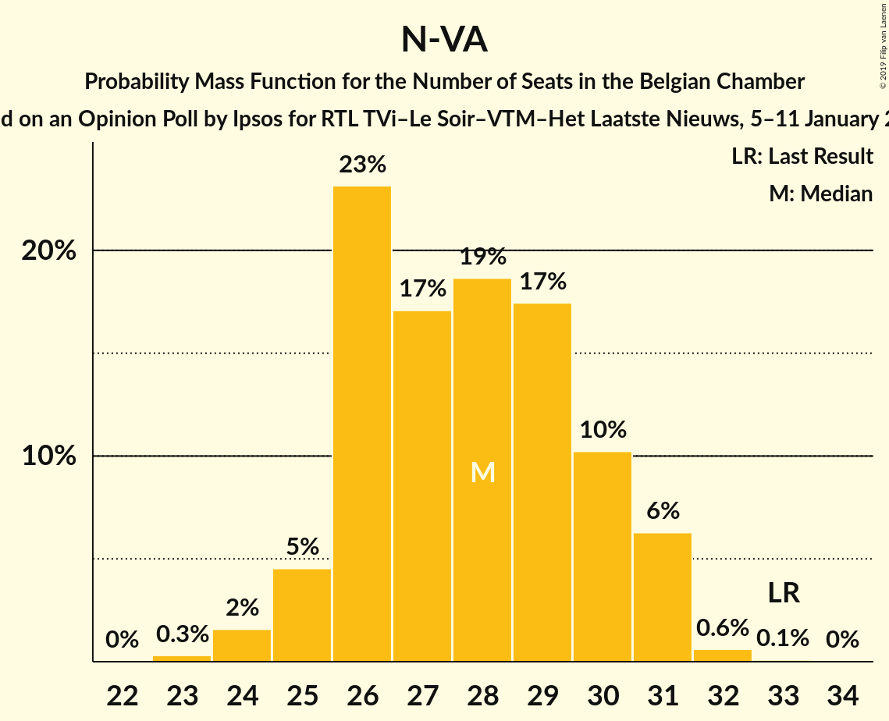
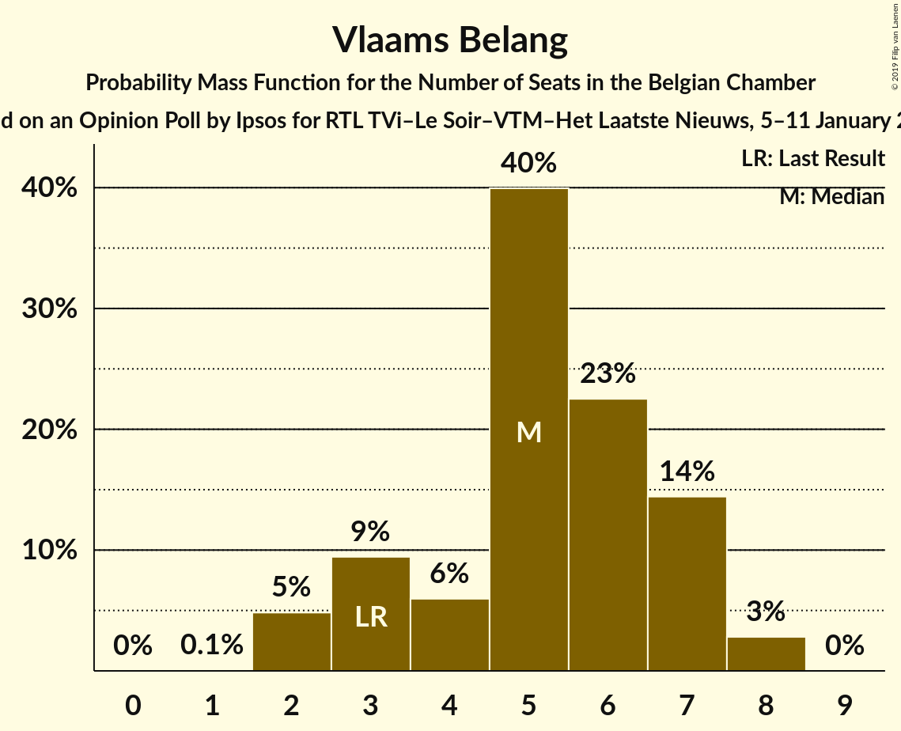

# Opinion Poll by Ipsos for RTL TVi–Le Soir–VTM–Het Laatste Nieuws, 5–11 January 2015

Areas included: Flanders, Wallonia

<a href="#voting-intentions">Voting Intentions</a> | <a href="#seats">Seats</a> | <a href="#coalitions">Coalitions</a> | <a href="#technical-information">Technical Information</a>

## Voting Intentions

### Confidence Intervals

| Party | Last Result | Poll Result | 80% Confidence Interval | 90% Confidence Interval | 95% Confidence Interval | 99% Confidence Interval |
|:-----:|:-----------:|:-----------:|:-----------------------:|:-----------------------:|:-----------------------:|:-----------------------:|
| N-VA | 20.3% | 18.6% | 17.4–19.4% |17.1–19.5% |16.8–19.6% |16.3–19.7% |
| CD&V | 11.6% | 12.2% | 11.2–13.0% |10.9–13.1% |10.7–13.2% |10.3–13.3% |
| sp.a | 8.8% | 10.5% | 9.5–11.2% |9.3–11.3% |9.1–11.4% |8.7–11.4% |
| PS | 11.7% | 10.0% | 9.3–10.1% |9.2–10.2% |9.0–10.2% |8.7–10.2% |
| Open Vld | 9.8% | 9.5% | 8.7–10.2% |8.4–10.3% |8.2–10.4% |7.8–10.4% |
| MR | 9.6% | 8.4% | 7.7–8.4% |7.6–8.4% |7.4–8.4% |7.2–8.4% |
| Groen | 5.3% | 6.9% | 6.1–7.7% |5.9–7.9% |5.8–8.0% |5.4–8.1% |
| Vlaams Belang | 3.7% | 4.5% | 3.9–5.1% |3.8–5.2% |3.6–5.3% |3.3–5.4% |
| cdH | 5.0% | 4.2% | 3.7–4.2% |3.6–4.2% |3.5–4.2% |3.3–4.2% |
| PVDA | 1.8% | 2.6% | 2.1–3.0% |2.0–3.0% |1.9–3.1% |1.7–3.1% |
| Ecolo | 3.3% | 2.6% | 2.2–2.6% |2.1–2.6% |2.0–2.7% |1.9–2.7% |
| PTB | 2.0% | 2.6% | 2.2–2.6% |2.1–2.6% |2.0–2.6% |1.9–2.6% |
| Parti Populaire | 1.5% | 1.2% | 0.9–1.2% |0.9–1.3% |0.8–1.3% |0.7–1.3% |
| DéFI | 1.8% | 0.7% | 0.5–0.8% |0.5–0.8% |0.4–0.8% |0.4–0.8% |

*Note:* The poll result column reflects the actual value used in the calculations. Published results may vary slightly, and in addition be rounded to fewer digits.

## Seats

### Confidence Intervals

| Party | Last Result | Median | 80% Confidence Interval | 90% Confidence Interval | 95% Confidence Interval | 99% Confidence Interval |
|:-----:|:-----------:|:------:|:-----------------------:|:-----------------------:|:-----------------------:|:-----------------------:|
| <a href="#n-va">N-VA</a> | 33 | 28 | 26–30 |25–31 |25–31 |24–32 |
| <a href="#cd&v">CD&V</a> | 18 | 18 | 16–19 |15–19 |14–20 |13–22 |
| <a href="#sp.a">sp.a</a> | 13 | 14 | 13–17 |13–17 |13–18 |12–18 |
| <a href="#ps">PS</a> | 23 | 18 | 18–21 |18–22 |17–22 |17–22 |
| <a href="#open-vld">Open Vld</a> | 14 | 13 | 12–14 |11–15 |11–16 |11–17 |
| <a href="#mr">MR</a> | 20 | 16 | 14–18 |14–18 |14–18 |14–19 |
| <a href="#groen">Groen</a> | 6 | 9 | 7–11 |7–12 |6–12 |6–12 |
| <a href="#vlaams-belang">Vlaams Belang</a> | 3 | 5 | 3–7 |3–7 |2–8 |2–8 |
| <a href="#cdh">cdH</a> | 9 | 7 | 7–8 |7–8 |6–8 |5–9 |
| <a href="#pvda">PVDA</a> | 0 | 0 | 0 |0 |0 |0 |
| <a href="#ecolo">Ecolo</a> | 6 | 3 | 2–5 |1–5 |1–5 |1–5 |
| <a href="#ptb">PTB</a> | 2 | 3 | 3–4 |2–4 |2–4 |2–5 |
| <a href="#parti-populaire">Parti Populaire</a> | 1 | 0 | 0 |0–1 |0–1 |0–2 |
| <a href="#défi">DéFI</a> | 2 | 0 | 0 |0 |0 |0 |

### N-VA

*For a full overview of the results for this party, see the [N-VA](party-n-va.html) page.*

| Number of Seats | Probability | Accumulated | Special Marks |
|:---------------:|:-----------:|:-----------:|:-------------:|
| 23 | 0.3% | 100% |  |
| 24 | 2% | 99.7% |  |
| 25 | 5% | 98% |  |
| 26 | 23% | 94% |  |
| 27 | 17% | 70% |  |
| 28 | 19% | 53% | Median |
| 29 | 17% | 35% |  |
| 30 | 10% | 17% |  |
| 31 | 6% | 7% |  |
| 32 | 0.6% | 0.7% |  |
| 33 | 0.1% | 0.1% | Last Result |
| 34 | 0% | 0% |  |

### CD&V

*For a full overview of the results for this party, see the [CD&V](party-cdv.html) page.*

| Number of Seats | Probability | Accumulated | Special Marks |
|:---------------:|:-----------:|:-----------:|:-------------:|
| 13 | 1.1% | 100% |  |
| 14 | 2% | 98.9% |  |
| 15 | 4% | 97% |  |
| 16 | 6% | 93% |  |
| 17 | 12% | 87% |  |
| 18 | 60% | 75% | Last Result, Median |
| 19 | 11% | 16% |  |
| 20 | 3% | 4% |  |
| 21 | 1.2% | 2% |  |
| 22 | 0.6% | 0.6% |  |
| 23 | 0.1% | 0.1% |  |
| 24 | 0% | 0% |  |

### sp.a

*For a full overview of the results for this party, see the [sp.a](party-spa.html) page.*

| Number of Seats | Probability | Accumulated | Special Marks |
|:---------------:|:-----------:|:-----------:|:-------------:|
| 11 | 0.1% | 100% |  |
| 12 | 0.4% | 99.8% |  |
| 13 | 39% | 99.4% | Last Result |
| 14 | 15% | 61% | Median |
| 15 | 20% | 46% |  |
| 16 | 15% | 26% |  |
| 17 | 8% | 11% |  |
| 18 | 3% | 3% |  |
| 19 | 0.1% | 0.1% |  |
| 20 | 0% | 0% |  |

### PS

*For a full overview of the results for this party, see the [PS](party-ps.html) page.*

| Number of Seats | Probability | Accumulated | Special Marks |
|:---------------:|:-----------:|:-----------:|:-------------:|
| 16 | 0.3% | 100% |  |
| 17 | 4% | 99.7% |  |
| 18 | 60% | 96% | Median |
| 19 | 13% | 36% |  |
| 20 | 12% | 23% |  |
| 21 | 5% | 11% |  |
| 22 | 6% | 6% |  |
| 23 | 0.3% | 0.3% | Last Result |
| 24 | 0% | 0% |  |

### Open Vld

*For a full overview of the results for this party, see the [Open Vld](party-openvld.html) page.*

| Number of Seats | Probability | Accumulated | Special Marks |
|:---------------:|:-----------:|:-----------:|:-------------:|
| 10 | 0.2% | 100% |  |
| 11 | 6% | 99.8% |  |
| 12 | 29% | 93% |  |
| 13 | 47% | 65% | Median |
| 14 | 9% | 18% | Last Result |
| 15 | 4% | 8% |  |
| 16 | 2% | 4% |  |
| 17 | 2% | 2% |  |
| 18 | 0.3% | 0.3% |  |
| 19 | 0% | 0% |  |

### MR

*For a full overview of the results for this party, see the [MR](party-mr.html) page.*

| Number of Seats | Probability | Accumulated | Special Marks |
|:---------------:|:-----------:|:-----------:|:-------------:|
| 13 | 0.1% | 100% |  |
| 14 | 26% | 99.9% |  |
| 15 | 14% | 74% |  |
| 16 | 24% | 60% | Median |
| 17 | 25% | 36% |  |
| 18 | 10% | 11% |  |
| 19 | 0.8% | 0.9% |  |
| 20 | 0.1% | 0.1% | Last Result |
| 21 | 0% | 0% |  |

### Groen

*For a full overview of the results for this party, see the [Groen](party-groen.html) page.*

| Number of Seats | Probability | Accumulated | Special Marks |
|:---------------:|:-----------:|:-----------:|:-------------:|
| 5 | 0.1% | 100% |  |
| 6 | 5% | 99.9% | Last Result |
| 7 | 8% | 95% |  |
| 8 | 27% | 87% |  |
| 9 | 28% | 60% | Median |
| 10 | 19% | 32% |  |
| 11 | 7% | 13% |  |
| 12 | 6% | 6% |  |
| 13 | 0% | 0% |  |

### Vlaams Belang

*For a full overview of the results for this party, see the [Vlaams Belang](party-vlaamsbelang.html) page.*

| Number of Seats | Probability | Accumulated | Special Marks |
|:---------------:|:-----------:|:-----------:|:-------------:|
| 1 | 0.1% | 100% |  |
| 2 | 5% | 99.9% |  |
| 3 | 9% | 95% | Last Result |
| 4 | 6% | 86% |  |
| 5 | 40% | 80% | Median |
| 6 | 23% | 40% |  |
| 7 | 14% | 17% |  |
| 8 | 3% | 3% |  |
| 9 | 0% | 0% |  |

### cdH

*For a full overview of the results for this party, see the [cdH](party-cdh.html) page.*

| Number of Seats | Probability | Accumulated | Special Marks |
|:---------------:|:-----------:|:-----------:|:-------------:|
| 4 | 0.5% | 100% |  |
| 5 | 0.8% | 99.5% |  |
| 6 | 2% | 98.8% |  |
| 7 | 81% | 97% | Median |
| 8 | 16% | 16% |  |
| 9 | 0.4% | 0.6% | Last Result |
| 10 | 0.1% | 0.2% |  |
| 11 | 0.1% | 0.1% |  |
| 12 | 0% | 0% |  |

### PVDA

*For a full overview of the results for this party, see the [PVDA](party-pvda.html) page.*

| Number of Seats | Probability | Accumulated | Special Marks |
|:---------------:|:-----------:|:-----------:|:-------------:|
| 0 | 100% | 100% | Last Result, Median |

### Ecolo

*For a full overview of the results for this party, see the [Ecolo](party-ecolo.html) page.*

| Number of Seats | Probability | Accumulated | Special Marks |
|:---------------:|:-----------:|:-----------:|:-------------:|
| 1 | 10% | 100% |  |
| 2 | 29% | 90% |  |
| 3 | 15% | 61% | Median |
| 4 | 34% | 46% |  |
| 5 | 12% | 12% |  |
| 6 | 0% | 0% | Last Result |

### PTB

*For a full overview of the results for this party, see the [PTB](party-ptb.html) page.*

| Number of Seats | Probability | Accumulated | Special Marks |
|:---------------:|:-----------:|:-----------:|:-------------:|
| 2 | 6% | 100% | Last Result |
| 3 | 75% | 94% | Median |
| 4 | 18% | 19% |  |
| 5 | 0.6% | 0.7% |  |
| 6 | 0.2% | 0.2% |  |
| 7 | 0% | 0% |  |

### Parti Populaire

*For a full overview of the results for this party, see the [Parti Populaire](party-partipopulaire.html) page.*

| Number of Seats | Probability | Accumulated | Special Marks |
|:---------------:|:-----------:|:-----------:|:-------------:|
| 0 | 91% | 100% | Median |
| 1 | 8% | 9% | Last Result |
| 2 | 0.9% | 0.9% |  |
| 3 | 0% | 0% |  |

### DéFI

*For a full overview of the results for this party, see the [DéFI](party-défi.html) page.*

| Number of Seats | Probability | Accumulated | Special Marks |
|:---------------:|:-----------:|:-----------:|:-------------:|
| 0 | 100% | 100% | Median |
| 1 | 0% | 0% |  |
| 2 | 0% | 0% | Last Result |

## Coalitions

### Confidence Intervals

| Coalition | Last Result | Median | Majority? | 80% Confidence Interval | 90% Confidence Interval | 95% Confidence Interval | 99% Confidence Interval |
|:---------:|:-----------:|:------:|:---------:|:-----------------------:|:-----------------------:|:-----------------------:|:-----------------------:|
| CD&V – sp.a – PS – Open Vld – MR – Groen – cdH – Ecolo | 109 | 99 | 100% | 96–101 | 95–102 | 95–102 | 94–104 |
| CD&V – sp.a – PS – Open Vld – MR – cdH | 97 | 87 | 100% | 84–90 | 83–91 | 82–91 | 81–93 |
| N-VA – CD&V – Open Vld – MR – cdH | 94 | 81 | 99.3% | 78–84 | 77–85 | 77–86 | 75–87 |
| N-VA – CD&V – Open Vld – MR | 85 | 74 | 31% | 71–77 | 70–78 | 69–79 | 68–80 |
| sp.a – PS – Open Vld – MR – Groen – Ecolo | 82 | 74 | 25% | 71–77 | 71–77 | 70–78 | 69–80 |
| CD&V – sp.a – PS – Groen – cdH – Ecolo – PTB – PVDA | 77 | 73 | 18% | 70–76 | 69–77 | 69–78 | 67–79 |
| CD&V – PS – Open Vld – MR – cdH | 84 | 72 | 6% | 70–75 | 69–76 | 68–76 | 67–78 |
| CD&V – sp.a – PS – Groen – cdH – Ecolo | 75 | 70 | 0.8% | 67–73 | 66–74 | 66–75 | 64–76 |
| CD&V – Open Vld – MR – Groen – cdH – Ecolo | 73 | 66 | 0% | 63–68 | 62–69 | 61–70 | 59–71 |
| sp.a – PS – Open Vld – MR | 70 | 62 | 0% | 59–65 | 58–66 | 58–66 | 57–68 |
| CD&V – sp.a – PS – cdH | 63 | 58 | 0% | 55–61 | 55–62 | 54–63 | 53–64 |
| sp.a – PS – Groen – cdH – Ecolo – PTB – PVDA | 59 | 55 | 0% | 53–59 | 52–59 | 51–60 | 50–61 |
| CD&V – Open Vld – MR – cdH | 61 | 54 | 0% | 51–56 | 50–57 | 49–58 | 48–59 |
| sp.a – PS – Groen – Ecolo – PTB – PVDA | 50 | 48 | 0% | 45–51 | 45–52 | 44–53 | 43–54 |

### CD&V – sp.a – PS – Open Vld – MR – Groen – cdH – Ecolo

| Number of Seats | Probability | Accumulated | Special Marks |
|:---------------:|:-----------:|:-----------:|:-------------:|
| 93 | 0.2% | 100% |  |
| 94 | 1.0% | 99.8% |  |
| 95 | 4% | 98.8% |  |
| 96 | 10% | 95% |  |
| 97 | 13% | 85% |  |
| 98 | 15% | 72% | Median |
| 99 | 17% | 57% |  |
| 100 | 18% | 40% |  |
| 101 | 15% | 22% |  |
| 102 | 5% | 8% |  |
| 103 | 2% | 2% |  |
| 104 | 0.6% | 0.8% |  |
| 105 | 0.2% | 0.2% |  |
| 106 | 0% | 0% |  |
| 107 | 0% | 0% |  |
| 108 | 0% | 0% |  |
| 109 | 0% | 0% | Last Result |

### CD&V – sp.a – PS – Open Vld – MR – cdH

| Number of Seats | Probability | Accumulated | Special Marks |
|:---------------:|:-----------:|:-----------:|:-------------:|
| 79 | 0% | 100% |  |
| 80 | 0.2% | 99.9% |  |
| 81 | 0.8% | 99.8% |  |
| 82 | 2% | 99.0% |  |
| 83 | 5% | 97% |  |
| 84 | 9% | 91% |  |
| 85 | 13% | 82% |  |
| 86 | 15% | 70% | Median |
| 87 | 16% | 55% |  |
| 88 | 15% | 39% |  |
| 89 | 11% | 24% |  |
| 90 | 8% | 13% |  |
| 91 | 3% | 5% |  |
| 92 | 1.1% | 2% |  |
| 93 | 0.4% | 0.6% |  |
| 94 | 0.1% | 0.2% |  |
| 95 | 0% | 0.1% |  |
| 96 | 0% | 0% |  |
| 97 | 0% | 0% | Last Result |

### N-VA – CD&V – Open Vld – MR – cdH

| Number of Seats | Probability | Accumulated | Special Marks |
|:---------------:|:-----------:|:-----------:|:-------------:|
| 74 | 0.2% | 100% |  |
| 75 | 0.6% | 99.8% |  |
| 76 | 2% | 99.3% | Majority |
| 77 | 4% | 98% |  |
| 78 | 7% | 94% |  |
| 79 | 10% | 87% |  |
| 80 | 13% | 77% |  |
| 81 | 16% | 64% |  |
| 82 | 15% | 48% | Median |
| 83 | 13% | 33% |  |
| 84 | 10% | 20% |  |
| 85 | 6% | 10% |  |
| 86 | 3% | 4% |  |
| 87 | 0.7% | 1.1% |  |
| 88 | 0.3% | 0.4% |  |
| 89 | 0.1% | 0.1% |  |
| 90 | 0% | 0% |  |
| 91 | 0% | 0% |  |
| 92 | 0% | 0% |  |
| 93 | 0% | 0% |  |
| 94 | 0% | 0% | Last Result |

### N-VA – CD&V – Open Vld – MR

| Number of Seats | Probability | Accumulated | Special Marks |
|:---------------:|:-----------:|:-----------:|:-------------:|
| 67 | 0.2% | 100% |  |
| 68 | 0.6% | 99.8% |  |
| 69 | 2% | 99.2% |  |
| 70 | 4% | 97% |  |
| 71 | 7% | 93% |  |
| 72 | 10% | 86% |  |
| 73 | 14% | 76% |  |
| 74 | 16% | 62% |  |
| 75 | 15% | 46% | Median |
| 76 | 13% | 31% | Majority |
| 77 | 10% | 18% |  |
| 78 | 5% | 8% |  |
| 79 | 2% | 3% |  |
| 80 | 0.6% | 0.9% |  |
| 81 | 0.2% | 0.3% |  |
| 82 | 0.1% | 0.1% |  |
| 83 | 0% | 0% |  |
| 84 | 0% | 0% |  |
| 85 | 0% | 0% | Last Result |

### sp.a – PS – Open Vld – MR – Groen – Ecolo

| Number of Seats | Probability | Accumulated | Special Marks |
|:---------------:|:-----------:|:-----------:|:-------------:|
| 68 | 0.2% | 100% |  |
| 69 | 1.0% | 99.7% |  |
| 70 | 3% | 98.8% |  |
| 71 | 8% | 95% |  |
| 72 | 13% | 87% |  |
| 73 | 16% | 74% | Median |
| 74 | 17% | 58% |  |
| 75 | 16% | 41% |  |
| 76 | 14% | 25% | Majority |
| 77 | 7% | 11% |  |
| 78 | 3% | 4% |  |
| 79 | 1.0% | 2% |  |
| 80 | 0.4% | 0.5% |  |
| 81 | 0.1% | 0.1% |  |
| 82 | 0% | 0% | Last Result |

### CD&V – sp.a – PS – Groen – cdH – Ecolo – PTB – PVDA

| Number of Seats | Probability | Accumulated | Special Marks |
|:---------------:|:-----------:|:-----------:|:-------------:|
| 66 | 0.1% | 100% |  |
| 67 | 0.4% | 99.8% |  |
| 68 | 1.3% | 99.4% |  |
| 69 | 4% | 98% |  |
| 70 | 8% | 94% |  |
| 71 | 11% | 87% |  |
| 72 | 14% | 75% | Median |
| 73 | 16% | 62% |  |
| 74 | 15% | 45% |  |
| 75 | 12% | 30% |  |
| 76 | 9% | 18% | Majority |
| 77 | 5% | 9% | Last Result |
| 78 | 3% | 4% |  |
| 79 | 0.8% | 1.0% |  |
| 80 | 0.2% | 0.2% |  |
| 81 | 0% | 0% |  |

### CD&V – PS – Open Vld – MR – cdH

| Number of Seats | Probability | Accumulated | Special Marks |
|:---------------:|:-----------:|:-----------:|:-------------:|
| 65 | 0.1% | 100% |  |
| 66 | 0.3% | 99.9% |  |
| 67 | 0.9% | 99.6% |  |
| 68 | 2% | 98.7% |  |
| 69 | 5% | 97% |  |
| 70 | 10% | 92% |  |
| 71 | 16% | 82% |  |
| 72 | 19% | 65% | Median |
| 73 | 18% | 46% |  |
| 74 | 14% | 28% |  |
| 75 | 8% | 14% |  |
| 76 | 3% | 6% | Majority |
| 77 | 1.3% | 2% |  |
| 78 | 0.6% | 0.8% |  |
| 79 | 0.2% | 0.2% |  |
| 80 | 0% | 0% |  |
| 81 | 0% | 0% |  |
| 82 | 0% | 0% |  |
| 83 | 0% | 0% |  |
| 84 | 0% | 0% | Last Result |

### CD&V – sp.a – PS – Groen – cdH – Ecolo

| Number of Seats | Probability | Accumulated | Special Marks |
|:---------------:|:-----------:|:-----------:|:-------------:|
| 62 | 0% | 100% |  |
| 63 | 0.1% | 99.9% |  |
| 64 | 0.5% | 99.8% |  |
| 65 | 2% | 99.3% |  |
| 66 | 4% | 98% |  |
| 67 | 8% | 94% |  |
| 68 | 12% | 85% |  |
| 69 | 14% | 74% | Median |
| 70 | 16% | 59% |  |
| 71 | 15% | 43% |  |
| 72 | 12% | 28% |  |
| 73 | 8% | 16% |  |
| 74 | 5% | 8% |  |
| 75 | 2% | 3% | Last Result |
| 76 | 0.7% | 0.8% | Majority |
| 77 | 0.1% | 0.2% |  |
| 78 | 0% | 0% |  |

### CD&V – Open Vld – MR – Groen – cdH – Ecolo

| Number of Seats | Probability | Accumulated | Special Marks |
|:---------------:|:-----------:|:-----------:|:-------------:|
| 57 | 0.1% | 100% |  |
| 58 | 0.1% | 99.9% |  |
| 59 | 0.4% | 99.8% |  |
| 60 | 1.0% | 99.4% |  |
| 61 | 3% | 98% |  |
| 62 | 4% | 96% |  |
| 63 | 8% | 91% |  |
| 64 | 12% | 84% |  |
| 65 | 18% | 72% |  |
| 66 | 17% | 53% | Median |
| 67 | 16% | 36% |  |
| 68 | 11% | 21% |  |
| 69 | 7% | 9% |  |
| 70 | 2% | 3% |  |
| 71 | 0.6% | 0.8% |  |
| 72 | 0.2% | 0.2% |  |
| 73 | 0% | 0% | Last Result |

### sp.a – PS – Open Vld – MR

| Number of Seats | Probability | Accumulated | Special Marks |
|:---------------:|:-----------:|:-----------:|:-------------:|
| 56 | 0.2% | 100% |  |
| 57 | 1.1% | 99.8% |  |
| 58 | 4% | 98.7% |  |
| 59 | 9% | 95% |  |
| 60 | 14% | 86% |  |
| 61 | 16% | 72% | Median |
| 62 | 17% | 56% |  |
| 63 | 15% | 39% |  |
| 64 | 11% | 24% |  |
| 65 | 7% | 13% |  |
| 66 | 3% | 5% |  |
| 67 | 1.2% | 2% |  |
| 68 | 0.4% | 0.7% |  |
| 69 | 0.2% | 0.2% |  |
| 70 | 0.1% | 0.1% | Last Result |
| 71 | 0% | 0% |  |

### CD&V – sp.a – PS – cdH

| Number of Seats | Probability | Accumulated | Special Marks |
|:---------------:|:-----------:|:-----------:|:-------------:|
| 51 | 0.1% | 100% |  |
| 52 | 0.3% | 99.9% |  |
| 53 | 1.2% | 99.6% |  |
| 54 | 3% | 98% |  |
| 55 | 6% | 96% |  |
| 56 | 17% | 89% |  |
| 57 | 16% | 73% | Median |
| 58 | 16% | 57% |  |
| 59 | 16% | 41% |  |
| 60 | 12% | 25% |  |
| 61 | 7% | 13% |  |
| 62 | 3% | 7% |  |
| 63 | 2% | 3% | Last Result |
| 64 | 0.8% | 1.1% |  |
| 65 | 0.2% | 0.3% |  |
| 66 | 0% | 0.1% |  |
| 67 | 0% | 0% |  |

### sp.a – PS – Groen – cdH – Ecolo – PTB – PVDA

| Number of Seats | Probability | Accumulated | Special Marks |
|:---------------:|:-----------:|:-----------:|:-------------:|
| 49 | 0.1% | 100% |  |
| 50 | 0.6% | 99.8% |  |
| 51 | 3% | 99.3% |  |
| 52 | 7% | 97% |  |
| 53 | 11% | 90% |  |
| 54 | 14% | 79% | Median |
| 55 | 17% | 66% |  |
| 56 | 15% | 49% |  |
| 57 | 13% | 33% |  |
| 58 | 10% | 20% |  |
| 59 | 6% | 10% | Last Result |
| 60 | 3% | 5% |  |
| 61 | 1.2% | 1.4% |  |
| 62 | 0.2% | 0.3% |  |
| 63 | 0% | 0.1% |  |
| 64 | 0% | 0% |  |

### CD&V – Open Vld – MR – cdH

| Number of Seats | Probability | Accumulated | Special Marks |
|:---------------:|:-----------:|:-----------:|:-------------:|
| 46 | 0.1% | 100% |  |
| 47 | 0.3% | 99.9% |  |
| 48 | 0.7% | 99.7% |  |
| 49 | 2% | 98.9% |  |
| 50 | 4% | 97% |  |
| 51 | 9% | 93% |  |
| 52 | 15% | 84% |  |
| 53 | 17% | 69% |  |
| 54 | 17% | 52% | Median |
| 55 | 15% | 34% |  |
| 56 | 11% | 19% |  |
| 57 | 5% | 8% |  |
| 58 | 2% | 3% |  |
| 59 | 0.8% | 1.2% |  |
| 60 | 0.3% | 0.4% |  |
| 61 | 0.1% | 0.1% | Last Result |
| 62 | 0% | 0% |  |

### sp.a – PS – Groen – Ecolo – PTB – PVDA

| Number of Seats | Probability | Accumulated | Special Marks |
|:---------------:|:-----------:|:-----------:|:-------------:|
| 42 | 0.2% | 100% |  |
| 43 | 0.6% | 99.8% |  |
| 44 | 4% | 99.2% |  |
| 45 | 7% | 95% |  |
| 46 | 11% | 89% |  |
| 47 | 14% | 77% | Median |
| 48 | 16% | 63% |  |
| 49 | 15% | 47% |  |
| 50 | 13% | 32% | Last Result |
| 51 | 9% | 19% |  |
| 52 | 5% | 10% |  |
| 53 | 3% | 4% |  |
| 54 | 1.1% | 1.4% |  |
| 55 | 0.2% | 0.3% |  |
| 56 | 0% | 0.1% |  |
| 57 | 0% | 0% |  |

## Technical Information

### Opinion Poll

+ **Polling firm:** Ipsos
+ **Commissioner(s):** RTL TVi–Le Soir–VTM–Het Laatste Nieuws
+ **Fieldwork period:** 5–11 January 2015

### Calculations

+ **Sample size:** 1561
+ **Simulations done:** 2,097,152
+ **Error estimate:** 0.66%

