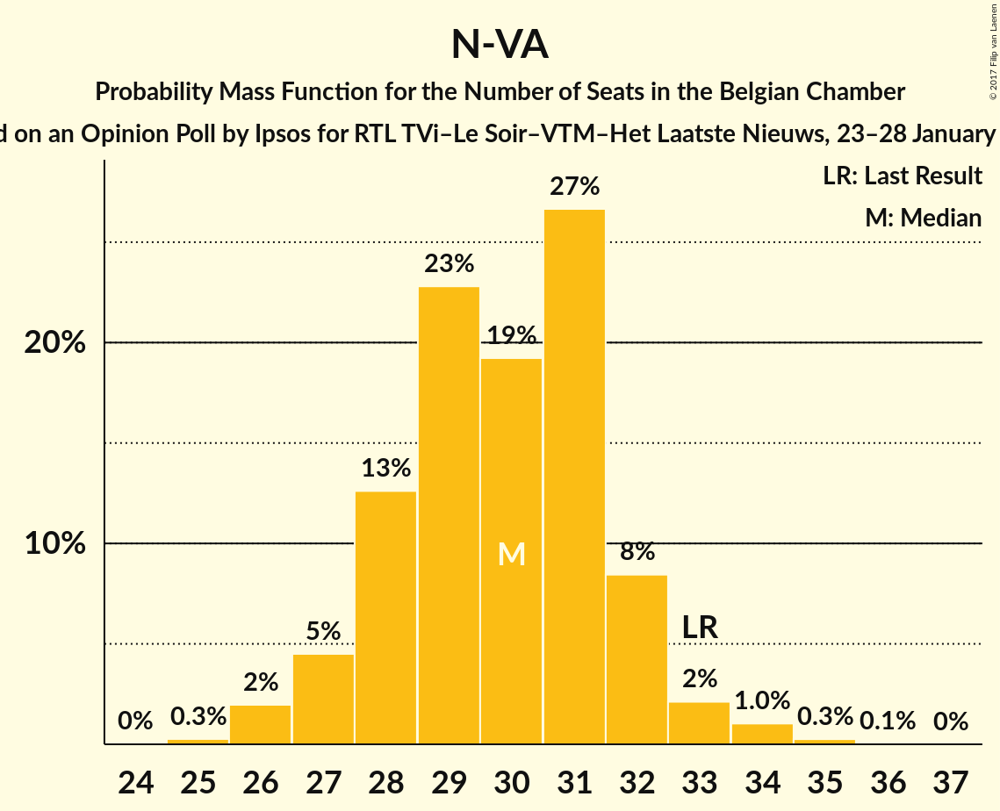
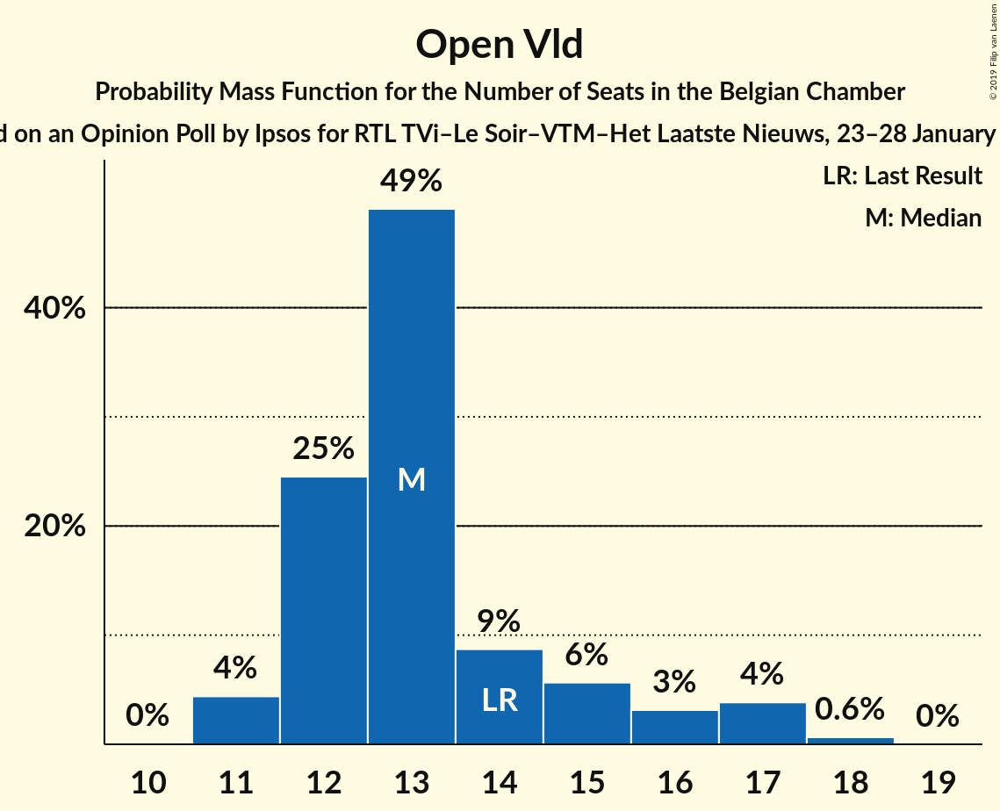
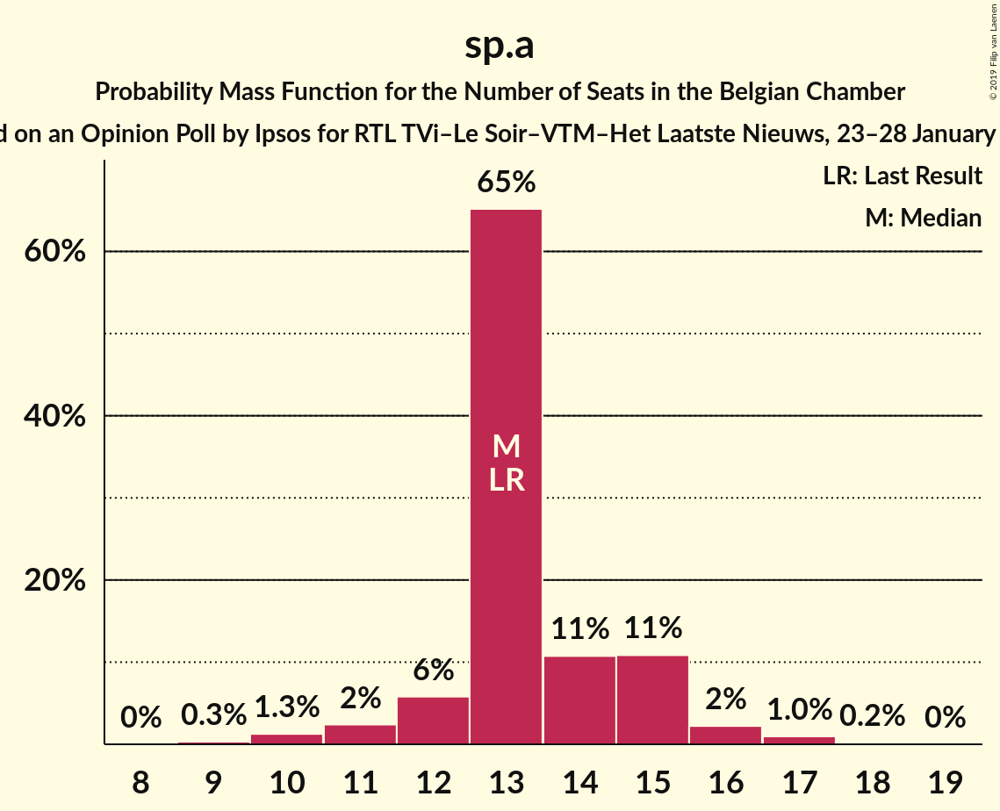
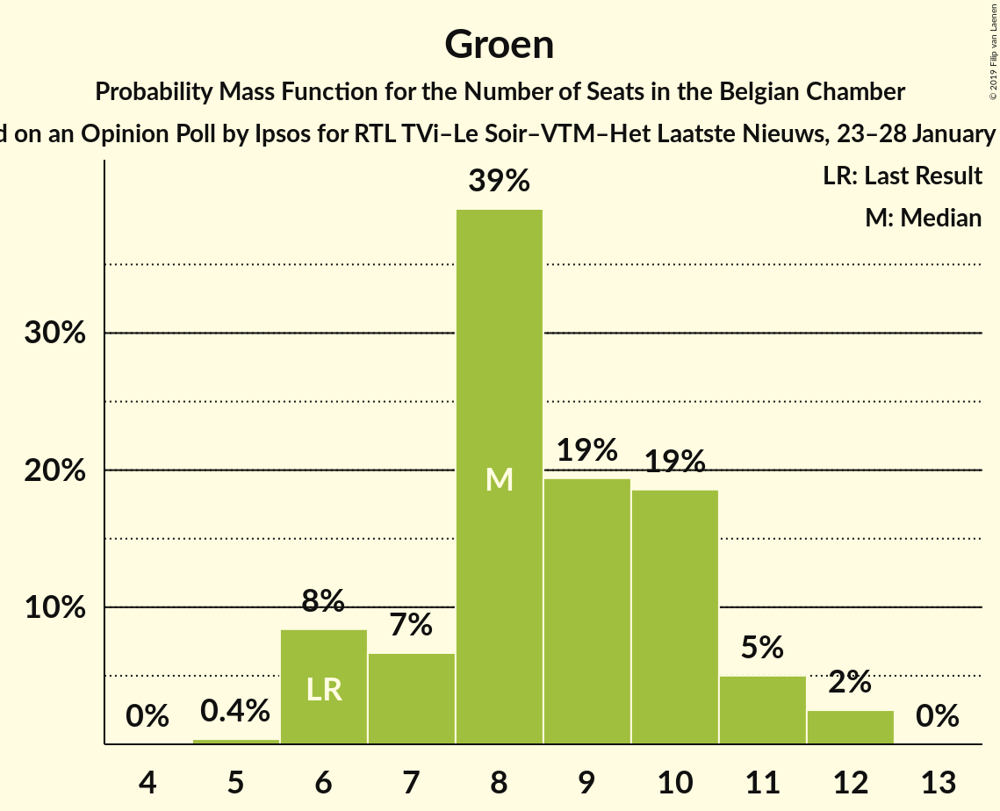

# Opinion Poll by Ipsos for RTL TVi–Le Soir–VTM–Het Laatste Nieuws, 23–28 January 2015

Areas included: Flanders

<a href="#voting-intentions">Voting Intentions</a> | <a href="#seats">Seats</a> | <a href="#coalitions">Coalitions</a> | <a href="#technical-information">Technical Information</a>

## Voting Intentions

### Confidence Intervals

| Party | Last Result | Poll Result | 80% Confidence Interval | 90% Confidence Interval | 95% Confidence Interval | 99% Confidence Interval |
|:-----:|:-----------:|:-----------:|:-----------------------:|:-----------------------:|:-----------------------:|:-----------------------:|
| N-VA | 20.3% | 30.2% | 28.5–32.1% |28.0–32.6% |27.5–33.1% |26.7–34.0% |
| CD&V | 11.6% | 17.1% | 15.7–18.7% |15.3–19.1% |14.9–19.5% |14.3–20.3% |
| Open Vld | 9.8% | 14.9% | 13.5–16.4% |13.2–16.8% |12.8–17.2% |12.2–17.9% |
| sp.a | 8.8% | 14.7% | 13.4–16.2% |13.0–16.6% |12.7–17.0% |12.0–17.7% |
| Groen | 5.3% | 10.2% | 9.1–11.6% |8.8–11.9% |8.5–12.3% |8.0–12.9% |
| Vlaams Belang | 3.7% | 7.6% | 6.7–8.8% |6.4–9.1% |6.2–9.4% |5.7–10.0% |
| PVDA | 1.8% | 3.6% | 2.9–4.4% |2.7–4.7% |2.6–4.9% |2.3–5.3% |

*Note:* The poll result column reflects the actual value used in the calculations. Published results may vary slightly, and in addition be rounded to fewer digits.

## Seats

### Confidence Intervals

| Party | Last Result | Median | 80% Confidence Interval | 90% Confidence Interval | 95% Confidence Interval | 99% Confidence Interval |
|:-----:|:-----------:|:------:|:-----------------------:|:-----------------------:|:-----------------------:|:-----------------------:|
| <a href="#n-va">N-VA</a> | 33 | 30 | 28–32 |27–32 |27–33 |26–34 |
| <a href="#cd&v">CD&V</a> | 18 | 16 | 13–18 |13–18 |13–18 |13–19 |
| <a href="#open-vld">Open Vld</a> | 14 | 13 | 12–15 |12–16 |11–17 |11–18 |
| <a href="#sp.a">sp.a</a> | 13 | 13 | 13–15 |12–15 |11–16 |10–17 |
| <a href="#groen">Groen</a> | 6 | 8 | 7–10 |6–11 |6–12 |6–12 |
| <a href="#vlaams-belang">Vlaams Belang</a> | 3 | 6 | 5–7 |5–8 |5–8 |3–8 |
| <a href="#pvda">PVDA</a> | 0 | 0 | 0 |0 |0 |0 |

### N-VA

*For a full overview of the results for this party, see the [N-VA](party-nva.html) page.*

| Number of Seats | Probability | Accumulated | Special Marks |
|:---------------:|:-----------:|:-----------:|:-------------:|
| 25 | 0.3% | 100% |  |
| 26 | 2% | 99.7% |  |
| 27 | 5% | 98% |  |
| 28 | 13% | 93% |  |
| 29 | 23% | 81% |  |
| 30 | 19% | 58% | Median |
| 31 | 27% | 39% |  |
| 32 | 8% | 12% |  |
| 33 | 2% | 3% | Last Result |
| 34 | 1.0% | 1.4% |  |
| 35 | 0.3% | 0.3% |  |
| 36 | 0.1% | 0.1% |  |
| 37 | 0% | 0% |  |

### CD&V

*For a full overview of the results for this party, see the [CD&V](party-cdv.html) page.*

| Number of Seats | Probability | Accumulated | Special Marks |
|:---------------:|:-----------:|:-----------:|:-------------:|
| 13 | 11% | 100% |  |
| 14 | 12% | 89% |  |
| 15 | 15% | 77% |  |
| 16 | 16% | 62% | Median |
| 17 | 17% | 46% |  |
| 18 | 28% | 29% | Last Result |
| 19 | 0.9% | 1.1% |  |
| 20 | 0.1% | 0.1% |  |
| 21 | 0% | 0% |  |

### Open Vld

*For a full overview of the results for this party, see the [Open Vld](party-openvld.html) page.*

| Number of Seats | Probability | Accumulated | Special Marks |
|:---------------:|:-----------:|:-----------:|:-------------:|
| 11 | 5% | 100% |  |
| 12 | 24% | 95% |  |
| 13 | 50% | 71% | Median |
| 14 | 9% | 21% | Last Result |
| 15 | 5% | 12% |  |
| 16 | 2% | 7% |  |
| 17 | 4% | 4% |  |
| 18 | 0.6% | 0.6% |  |
| 19 | 0% | 0% |  |

### sp.a

*For a full overview of the results for this party, see the [sp.a](party-spa.html) page.*

| Number of Seats | Probability | Accumulated | Special Marks |
|:---------------:|:-----------:|:-----------:|:-------------:|
| 9 | 0.3% | 100% |  |
| 10 | 1.0% | 99.7% |  |
| 11 | 2% | 98.7% |  |
| 12 | 4% | 96% |  |
| 13 | 67% | 92% | Last Result, Median |
| 14 | 10% | 25% |  |
| 15 | 12% | 16% |  |
| 16 | 2% | 3% |  |
| 17 | 0.9% | 1.0% |  |
| 18 | 0.2% | 0.2% |  |
| 19 | 0% | 0% |  |

### Groen

*For a full overview of the results for this party, see the [Groen](party-groen.html) page.*

| Number of Seats | Probability | Accumulated | Special Marks |
|:---------------:|:-----------:|:-----------:|:-------------:|
| 5 | 0.3% | 100% |  |
| 6 | 8% | 99.7% | Last Result |
| 7 | 7% | 92% |  |
| 8 | 40% | 85% | Median |
| 9 | 18% | 45% |  |
| 10 | 19% | 27% |  |
| 11 | 5% | 8% |  |
| 12 | 3% | 3% |  |
| 13 | 0% | 0% |  |

### Vlaams Belang

*For a full overview of the results for this party, see the [Vlaams Belang](party-vlaamsbelang.html) page.*

| Number of Seats | Probability | Accumulated | Special Marks |
|:---------------:|:-----------:|:-----------:|:-------------:|
| 2 | 0.4% | 100% |  |
| 3 | 0.8% | 99.6% | Last Result |
| 4 | 1.2% | 98.8% |  |
| 5 | 32% | 98% |  |
| 6 | 29% | 66% | Median |
| 7 | 27% | 37% |  |
| 8 | 10% | 10% |  |
| 9 | 0% | 0% |  |

### PVDA

*For a full overview of the results for this party, see the [PVDA](party-pvda.html) page.*

| Number of Seats | Probability | Accumulated | Special Marks |
|:---------------:|:-----------:|:-----------:|:-------------:|
| 0 | 100% | 100% | Last Result, Median |

## Coalitions

### Confidence Intervals

| Coalition | Last Result | Median | Majority? | 80% Confidence Interval | 90% Confidence Interval | 95% Confidence Interval | 99% Confidence Interval |
|:---------:|:-----------:|:------:|:---------:|:-----------------------:|:-----------------------:|:-----------------------:|:-----------------------:|

## Technical Information

### Opinion Poll

+ **Polling firm:** Ipsos
+ **Commissioner(s):** RTL TVi–Le Soir–VTM–Het Laatste Nieuws
+ **Fieldwork period:** 23–28 January 2015

### Calculations

+ **Sample size:** 1035
+ **Simulations done:** 1,048,576
+ **Error estimate:** 1.62%

