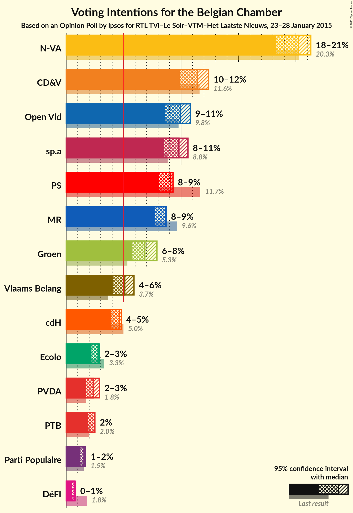
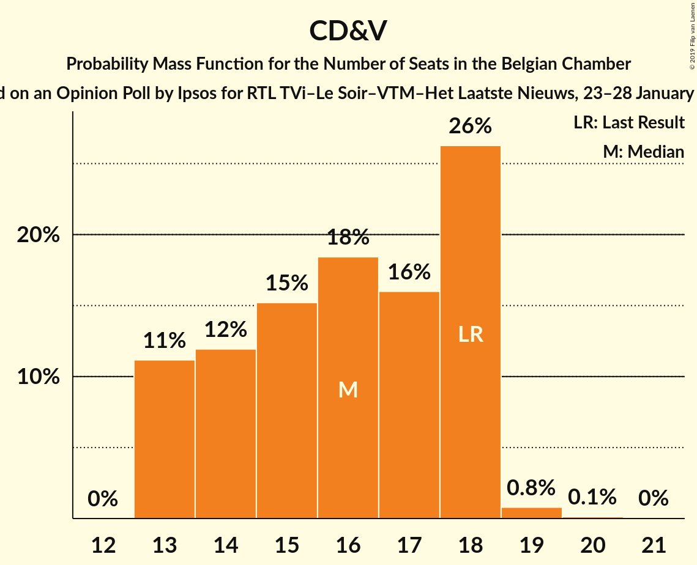
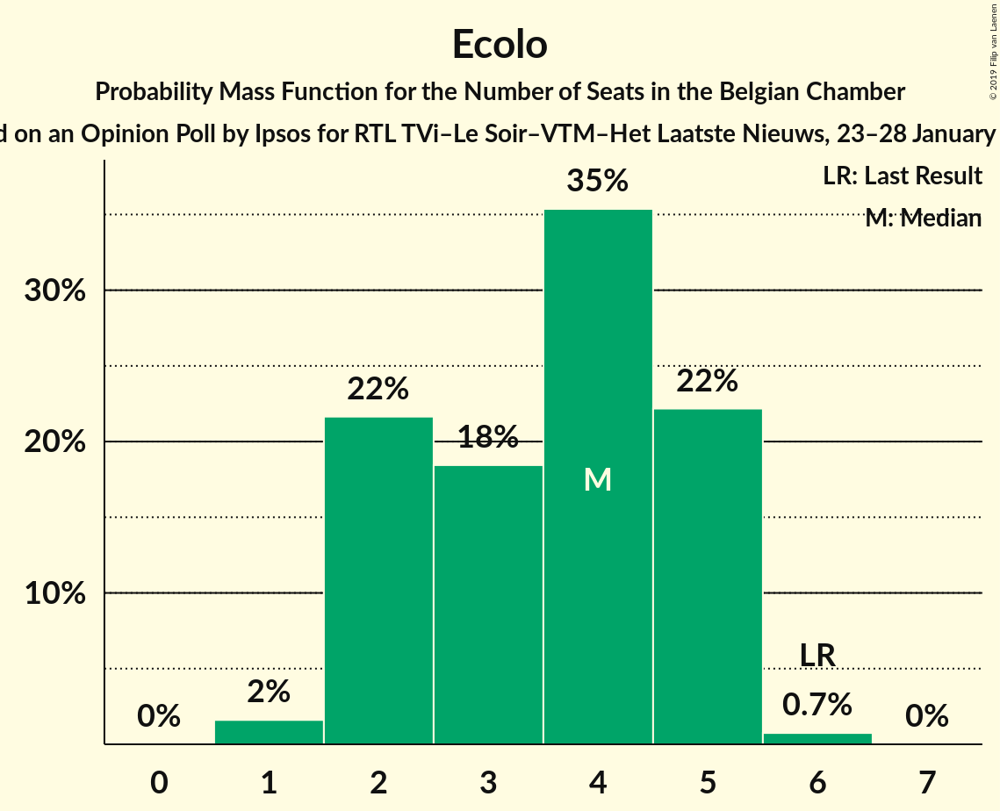
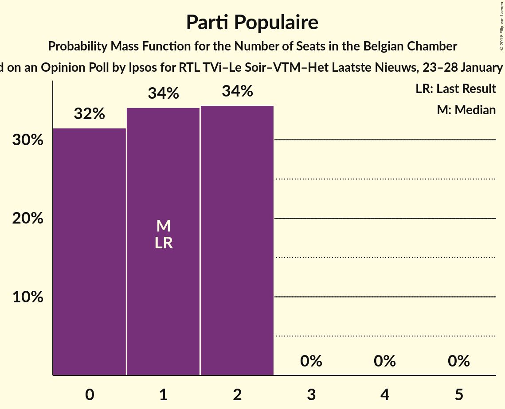

# Opinion Poll by Ipsos for RTL TVi–Le Soir–VTM–Het Laatste Nieuws, 23–28 January 2015

Areas included: Flanders, Wallonia

<a href="#voting-intentions">Voting Intentions</a> | <a href="#seats">Seats</a> | <a href="#coalitions">Coalitions</a> | <a href="#technical-information">Technical Information</a>

## Voting Intentions

### Confidence Intervals

| Party | Last Result | Poll Result | 80% Confidence Interval | 90% Confidence Interval | 95% Confidence Interval | 99% Confidence Interval |
|:-----:|:-----------:|:-----------:|:-----------------------:|:-----------------------:|:-----------------------:|:-----------------------:|
| N-VA | 20.3% | 20.2% | 28.5–32.1% |28.0–32.6% |27.5–33.1% |26.7–34.0% |
| CD&V | 11.6% | 11.4% | 15.7–18.7% |15.3–19.1% |14.9–19.5% |14.3–20.3% |
| Open Vld | 9.8% | 9.9% | 13.5–16.4% |13.2–16.8% |12.8–17.2% |12.2–17.9% |
| sp.a | 8.8% | 9.8% | 13.4–16.2% |13.0–16.6% |12.7–17.0% |12.0–17.7% |
| PS | 11.7% | 9.1% | N/A |N/A |N/A |N/A |
| MR | 9.6% | 8.7% | N/A |N/A |N/A |N/A |
| Groen | 5.3% | 6.8% | 9.1–11.6% |8.8–11.9% |8.5–12.3% |8.0–12.9% |
| Vlaams Belang | 3.7% | 5.1% | 6.7–8.8% |6.4–9.1% |6.2–9.4% |5.7–10.0% |
| cdH | 5.0% | 4.6% | N/A |N/A |N/A |N/A |
| Ecolo | 3.3% | 2.8% | N/A |N/A |N/A |N/A |
| PTB | 2.0% | 2.5% | N/A |N/A |N/A |N/A |
| PVDA | 1.8% | 2.4% | 2.9–4.4% |2.7–4.7% |2.6–4.9% |2.3–5.3% |
| Parti Populaire | 1.5% | 1.5% | N/A |N/A |N/A |N/A |
| DéFI | 1.8% | 0.7% | N/A |N/A |N/A |N/A |

*Note:* The poll result column reflects the actual value used in the calculations. Published results may vary slightly, and in addition be rounded to fewer digits.

## Seats

### Confidence Intervals

| Party | Last Result | Median | 80% Confidence Interval | 90% Confidence Interval | 95% Confidence Interval | 99% Confidence Interval |
|:-----:|:-----------:|:------:|:-----------------------:|:-----------------------:|:-----------------------:|:-----------------------:|
| <a href="#n-va">N-VA</a> | 33 | 30 | 28–32 |27–32 |27–33 |26–34 |
| <a href="#cd&v">CD&V</a> | 18 | 16 | 13–18 |13–18 |13–18 |13–19 |
| <a href="#open-vld">Open Vld</a> | 14 | 13 | 12–15 |12–16 |11–17 |11–18 |
| <a href="#sp.a">sp.a</a> | 13 | 13 | 13–15 |12–15 |11–16 |10–17 |
| <a href="#ps">PS</a> | 23 | 18 | 17–18 |17–18 |17–18 |17–18 |
| <a href="#mr">MR</a> | 20 | 15 | 15 |15 |15 |15–17 |
| <a href="#groen">Groen</a> | 6 | 8 | 7–10 |6–11 |6–12 |6–12 |
| <a href="#vlaams-belang">Vlaams Belang</a> | 3 | 6 | 5–7 |5–8 |5–8 |3–8 |
| <a href="#cdh">cdH</a> | 9 | 8 | 7–8 |7–8 |7–8 |7–8 |
| <a href="#ecolo">Ecolo</a> | 6 | 2 | 2–4 |2–4 |2–4 |2–4 |
| <a href="#ptb">PTB</a> | 2 | 3 | 3 |3 |3 |3 |
| <a href="#pvda">PVDA</a> | 0 | 0 | 0 |0 |0 |0 |
| <a href="#parti-populaire">Parti Populaire</a> | 1 | 2 | 2 |2 |2 |0–2 |
| <a href="#défi">DéFI</a> | 2 | 0 | 0 |0 |0 |0 |

### N-VA

*For a full overview of the results for this party, see the [N-VA](party-n-va.html) page.*

| Number of Seats | Probability | Accumulated | Special Marks |
|:---------------:|:-----------:|:-----------:|:-------------:|
| 25 | 0.3% | 100% |  |
| 26 | 2% | 99.7% |  |
| 27 | 5% | 98% |  |
| 28 | 13% | 93% |  |
| 29 | 23% | 81% |  |
| 30 | 19% | 58% | Median |
| 31 | 27% | 39% |  |
| 32 | 8% | 12% |  |
| 33 | 2% | 3% | Last Result |
| 34 | 1.0% | 1.4% |  |
| 35 | 0.3% | 0.3% |  |
| 36 | 0.1% | 0.1% |  |
| 37 | 0% | 0% |  |

### CD&V

*For a full overview of the results for this party, see the [CD&V](party-cdv.html) page.*

| Number of Seats | Probability | Accumulated | Special Marks |
|:---------------:|:-----------:|:-----------:|:-------------:|
| 13 | 11% | 100% |  |
| 14 | 12% | 89% |  |
| 15 | 15% | 77% |  |
| 16 | 16% | 62% | Median |
| 17 | 17% | 46% |  |
| 18 | 28% | 29% | Last Result |
| 19 | 0.9% | 1.1% |  |
| 20 | 0.1% | 0.1% |  |
| 21 | 0% | 0% |  |

### Open Vld

*For a full overview of the results for this party, see the [Open Vld](party-openvld.html) page.*

| Number of Seats | Probability | Accumulated | Special Marks |
|:---------------:|:-----------:|:-----------:|:-------------:|
| 11 | 5% | 100% |  |
| 12 | 24% | 95% |  |
| 13 | 50% | 71% | Median |
| 14 | 9% | 21% | Last Result |
| 15 | 5% | 12% |  |
| 16 | 2% | 7% |  |
| 17 | 4% | 4% |  |
| 18 | 0.6% | 0.6% |  |
| 19 | 0% | 0% |  |

### sp.a

*For a full overview of the results for this party, see the [sp.a](party-spa.html) page.*

| Number of Seats | Probability | Accumulated | Special Marks |
|:---------------:|:-----------:|:-----------:|:-------------:|
| 9 | 0.3% | 100% |  |
| 10 | 1.0% | 99.7% |  |
| 11 | 2% | 98.7% |  |
| 12 | 4% | 96% |  |
| 13 | 67% | 92% | Last Result, Median |
| 14 | 10% | 25% |  |
| 15 | 12% | 16% |  |
| 16 | 2% | 3% |  |
| 17 | 0.9% | 1.0% |  |
| 18 | 0.2% | 0.2% |  |
| 19 | 0% | 0% |  |

### PS

*For a full overview of the results for this party, see the [PS](party-ps.html) page.*

| Number of Seats | Probability | Accumulated | Special Marks |
|:---------------:|:-----------:|:-----------:|:-------------:|
| 15 | 0.1% | 100% |  |
| 16 | 0% | 99.8% |  |
| 17 | 47% | 99.8% |  |
| 18 | 52% | 52% | Median |
| 19 | 0.1% | 0.1% |  |
| 20 | 0% | 0% |  |
| 21 | 0% | 0% |  |
| 22 | 0% | 0% |  |
| 23 | 0% | 0% | Last Result |

### MR

*For a full overview of the results for this party, see the [MR](party-mr.html) page.*

| Number of Seats | Probability | Accumulated | Special Marks |
|:---------------:|:-----------:|:-----------:|:-------------:|
| 13 | 0.1% | 100% |  |
| 14 | 0% | 99.9% |  |
| 15 | 98.8% | 99.9% | Median |
| 16 | 0.6% | 1.2% |  |
| 17 | 0.3% | 0.6% |  |
| 18 | 0% | 0.3% |  |
| 19 | 0.2% | 0.2% |  |
| 20 | 0.1% | 0.1% | Last Result |
| 21 | 0% | 0% |  |

### Groen

*For a full overview of the results for this party, see the [Groen](party-groen.html) page.*

| Number of Seats | Probability | Accumulated | Special Marks |
|:---------------:|:-----------:|:-----------:|:-------------:|
| 5 | 0.3% | 100% |  |
| 6 | 8% | 99.7% | Last Result |
| 7 | 7% | 92% |  |
| 8 | 40% | 85% | Median |
| 9 | 18% | 45% |  |
| 10 | 19% | 27% |  |
| 11 | 5% | 8% |  |
| 12 | 3% | 3% |  |
| 13 | 0% | 0% |  |

### Vlaams Belang

*For a full overview of the results for this party, see the [Vlaams Belang](party-vlaamsbelang.html) page.*

| Number of Seats | Probability | Accumulated | Special Marks |
|:---------------:|:-----------:|:-----------:|:-------------:|
| 2 | 0.4% | 100% |  |
| 3 | 0.8% | 99.6% | Last Result |
| 4 | 1.2% | 98.8% |  |
| 5 | 32% | 98% |  |
| 6 | 29% | 66% | Median |
| 7 | 27% | 37% |  |
| 8 | 10% | 10% |  |
| 9 | 0% | 0% |  |

### cdH

*For a full overview of the results for this party, see the [cdH](party-cdh.html) page.*

| Number of Seats | Probability | Accumulated | Special Marks |
|:---------------:|:-----------:|:-----------:|:-------------:|
| 6 | 0.3% | 100% |  |
| 7 | 34% | 99.7% |  |
| 8 | 66% | 66% | Median |
| 9 | 0% | 0% | Last Result |

### Ecolo

*For a full overview of the results for this party, see the [Ecolo](party-ecolo.html) page.*

| Number of Seats | Probability | Accumulated | Special Marks |
|:---------------:|:-----------:|:-----------:|:-------------:|
| 2 | 52% | 100% | Median |
| 3 | 14% | 48% |  |
| 4 | 34% | 34% |  |
| 5 | 0.4% | 0.4% |  |
| 6 | 0% | 0% | Last Result |

### PTB

*For a full overview of the results for this party, see the [PTB](party-ptb.html) page.*

| Number of Seats | Probability | Accumulated | Special Marks |
|:---------------:|:-----------:|:-----------:|:-------------:|
| 2 | 0.3% | 100% | Last Result |
| 3 | 99.7% | 99.7% | Median |
| 4 | 0% | 0% |  |

### PVDA

*For a full overview of the results for this party, see the [PVDA](party-pvda.html) page.*

| Number of Seats | Probability | Accumulated | Special Marks |
|:---------------:|:-----------:|:-----------:|:-------------:|
| 0 | 100% | 100% | Last Result, Median |

### Parti Populaire

*For a full overview of the results for this party, see the [Parti Populaire](party-partipopulaire.html) page.*

| Number of Seats | Probability | Accumulated | Special Marks |
|:---------------:|:-----------:|:-----------:|:-------------:|
| 0 | 1.0% | 100% |  |
| 1 | 0.1% | 99.0% | Last Result |
| 2 | 98.9% | 98.9% | Median |
| 3 | 0% | 0% |  |

### DéFI

*For a full overview of the results for this party, see the [DéFI](party-défi.html) page.*

| Number of Seats | Probability | Accumulated | Special Marks |
|:---------------:|:-----------:|:-----------:|:-------------:|
| 0 | 100% | 100% | Median |
| 1 | 0% | 0% |  |
| 2 | 0% | 0% | Last Result |

## Coalitions

### Confidence Intervals

| Coalition | Last Result | Median | Majority? | 80% Confidence Interval | 90% Confidence Interval | 95% Confidence Interval | 99% Confidence Interval |
|:---------:|:-----------:|:------:|:---------:|:-----------------------:|:-----------------------:|:-----------------------:|:-----------------------:|
| CD&V – Open Vld – sp.a – PS – MR – Groen – cdH – Ecolo | 109 | 94 | 100% | 92–96 | 91–97 | 91–98 | 89–99 |
| CD&V – Open Vld – sp.a – PS – MR – cdH | 97 | 83 | 100% | 80–85 | 79–86 | 79–87 | 77–88 |
| N-VA – CD&V – Open Vld – MR – cdH | 94 | 82 | 99.9% | 79–84 | 79–85 | 78–85 | 77–86 |
| N-VA – CD&V – Open Vld – MR | 85 | 74 | 20% | 72–76 | 71–77 | 70–78 | 69–79 |
| Open Vld – sp.a – PS – MR – Groen – Ecolo | 82 | 70 | 0.8% | 68–73 | 68–74 | 67–74 | 66–76 |
| CD&V – Open Vld – PS – MR – cdH | 84 | 69 | 0.3% | 67–72 | 66–73 | 65–73 | 64–75 |
| CD&V – sp.a – PS – Groen – cdH – Ecolo – PTB – PVDA | 77 | 69 | 0% | 67–71 | 66–72 | 65–72 | 64–73 |
| CD&V – sp.a – PS – Groen – cdH – Ecolo | 75 | 66 | 0% | 64–68 | 63–69 | 62–69 | 61–70 |
| Open Vld – sp.a – PS – MR | 70 | 59 | 0% | 57–61 | 57–62 | 56–63 | 55–64 |
| CD&V – sp.a – PS – cdH | 63 | 55 | 0% | 52–57 | 51–57 | 51–58 | 49–60 |
| sp.a – PS – Groen – cdH – Ecolo – PTB – PVDA | 59 | 53 | 0% | 51–55 | 50–56 | 50–56 | 49–57 |
| CD&V – Open Vld – MR – cdH | 61 | 52 | 0% | 49–54 | 49–55 | 48–56 | 47–57 |
| sp.a – PS – Groen – Ecolo – PTB – PVDA | 50 | 45 | 0% | 43–47 | 43–48 | 42–49 | 41–50 |
| CD&V – Open Vld – MR – Groen – cdH – Ecolo | 73 | 25 | 0% | 25–26 | 25–26 | 25–26 | 25–27 |

### CD&V – Open Vld – sp.a – PS – MR – Groen – cdH – Ecolo

| Number of Seats | Probability | Accumulated | Special Marks |
|:---------------:|:-----------:|:-----------:|:-------------:|
| 88 | 0.2% | 100% |  |
| 89 | 0.6% | 99.8% |  |
| 90 | 1.1% | 99.2% |  |
| 91 | 3% | 98% |  |
| 92 | 10% | 95% |  |
| 93 | 19% | 84% | Median |
| 94 | 28% | 65% |  |
| 95 | 20% | 37% |  |
| 96 | 8% | 17% |  |
| 97 | 7% | 10% |  |
| 98 | 2% | 3% |  |
| 99 | 0.9% | 1.0% |  |
| 100 | 0.1% | 0.1% |  |
| 101 | 0% | 0% |  |
| 102 | 0% | 0% |  |
| 103 | 0% | 0% |  |
| 104 | 0% | 0% |  |
| 105 | 0% | 0% |  |
| 106 | 0% | 0% |  |
| 107 | 0% | 0% |  |
| 108 | 0% | 0% |  |
| 109 | 0% | 0% | Last Result |

### CD&V – Open Vld – sp.a – PS – MR – cdH

| Number of Seats | Probability | Accumulated | Special Marks |
|:---------------:|:-----------:|:-----------:|:-------------:|
| 76 | 0.1% | 100% | Majority |
| 77 | 0.4% | 99.9% |  |
| 78 | 1.4% | 99.5% |  |
| 79 | 4% | 98% |  |
| 80 | 8% | 94% |  |
| 81 | 14% | 86% |  |
| 82 | 19% | 72% |  |
| 83 | 19% | 53% | Median |
| 84 | 16% | 34% |  |
| 85 | 11% | 18% |  |
| 86 | 4% | 8% |  |
| 87 | 2% | 4% |  |
| 88 | 0.9% | 1.2% |  |
| 89 | 0.3% | 0.4% |  |
| 90 | 0% | 0% |  |
| 91 | 0% | 0% |  |
| 92 | 0% | 0% |  |
| 93 | 0% | 0% |  |
| 94 | 0% | 0% |  |
| 95 | 0% | 0% |  |
| 96 | 0% | 0% |  |
| 97 | 0% | 0% | Last Result |

### N-VA – CD&V – Open Vld – MR – cdH

| Number of Seats | Probability | Accumulated | Special Marks |
|:---------------:|:-----------:|:-----------:|:-------------:|
| 75 | 0.1% | 100% |  |
| 76 | 0.3% | 99.9% | Majority |
| 77 | 1.1% | 99.6% |  |
| 78 | 3% | 98.6% |  |
| 79 | 8% | 95% |  |
| 80 | 14% | 88% |  |
| 81 | 19% | 74% |  |
| 82 | 22% | 56% | Median |
| 83 | 18% | 34% |  |
| 84 | 10% | 16% |  |
| 85 | 4% | 5% |  |
| 86 | 1.5% | 2% |  |
| 87 | 0.3% | 0.4% |  |
| 88 | 0.1% | 0.1% |  |
| 89 | 0% | 0% |  |
| 90 | 0% | 0% |  |
| 91 | 0% | 0% |  |
| 92 | 0% | 0% |  |
| 93 | 0% | 0% |  |
| 94 | 0% | 0% | Last Result |

### N-VA – CD&V – Open Vld – MR

| Number of Seats | Probability | Accumulated | Special Marks |
|:---------------:|:-----------:|:-----------:|:-------------:|
| 68 | 0.1% | 100% |  |
| 69 | 0.6% | 99.8% |  |
| 70 | 2% | 99.2% |  |
| 71 | 5% | 97% |  |
| 72 | 12% | 92% |  |
| 73 | 16% | 80% |  |
| 74 | 22% | 63% | Median |
| 75 | 21% | 41% |  |
| 76 | 13% | 20% | Majority |
| 77 | 4% | 7% |  |
| 78 | 2% | 3% |  |
| 79 | 0.4% | 0.6% |  |
| 80 | 0.1% | 0.2% |  |
| 81 | 0% | 0.1% |  |
| 82 | 0% | 0% |  |
| 83 | 0% | 0% |  |
| 84 | 0% | 0% |  |
| 85 | 0% | 0% | Last Result |

### Open Vld – sp.a – PS – MR – Groen – Ecolo

| Number of Seats | Probability | Accumulated | Special Marks |
|:---------------:|:-----------:|:-----------:|:-------------:|
| 65 | 0.1% | 100% |  |
| 66 | 0.8% | 99.8% |  |
| 67 | 3% | 99.0% |  |
| 68 | 12% | 96% |  |
| 69 | 18% | 83% | Median |
| 70 | 19% | 65% |  |
| 71 | 20% | 46% |  |
| 72 | 13% | 26% |  |
| 73 | 8% | 14% |  |
| 74 | 4% | 6% |  |
| 75 | 1.4% | 2% |  |
| 76 | 0.5% | 0.8% | Majority |
| 77 | 0.2% | 0.3% |  |
| 78 | 0% | 0.1% |  |
| 79 | 0% | 0% |  |
| 80 | 0% | 0% |  |
| 81 | 0% | 0% |  |
| 82 | 0% | 0% | Last Result |

### CD&V – Open Vld – PS – MR – cdH

| Number of Seats | Probability | Accumulated | Special Marks |
|:---------------:|:-----------:|:-----------:|:-------------:|
| 63 | 0.1% | 100% |  |
| 64 | 0.7% | 99.9% |  |
| 65 | 3% | 99.2% |  |
| 66 | 6% | 97% |  |
| 67 | 10% | 91% |  |
| 68 | 14% | 80% |  |
| 69 | 18% | 66% |  |
| 70 | 18% | 48% | Median |
| 71 | 15% | 30% |  |
| 72 | 10% | 15% |  |
| 73 | 3% | 5% |  |
| 74 | 1.4% | 2% |  |
| 75 | 0.5% | 0.8% |  |
| 76 | 0.2% | 0.3% | Majority |
| 77 | 0% | 0% |  |
| 78 | 0% | 0% |  |
| 79 | 0% | 0% |  |
| 80 | 0% | 0% |  |
| 81 | 0% | 0% |  |
| 82 | 0% | 0% |  |
| 83 | 0% | 0% |  |
| 84 | 0% | 0% | Last Result |

### CD&V – sp.a – PS – Groen – cdH – Ecolo – PTB – PVDA

| Number of Seats | Probability | Accumulated | Special Marks |
|:---------------:|:-----------:|:-----------:|:-------------:|
| 62 | 0.1% | 100% |  |
| 63 | 0.3% | 99.9% |  |
| 64 | 1.1% | 99.6% |  |
| 65 | 3% | 98.5% |  |
| 66 | 4% | 96% |  |
| 67 | 10% | 92% |  |
| 68 | 19% | 82% | Median |
| 69 | 19% | 62% |  |
| 70 | 29% | 43% |  |
| 71 | 8% | 15% |  |
| 72 | 4% | 6% |  |
| 73 | 2% | 2% |  |
| 74 | 0.3% | 0.4% |  |
| 75 | 0.1% | 0.1% |  |
| 76 | 0% | 0% | Majority |
| 77 | 0% | 0% | Last Result |

### CD&V – sp.a – PS – Groen – cdH – Ecolo

| Number of Seats | Probability | Accumulated | Special Marks |
|:---------------:|:-----------:|:-----------:|:-------------:|
| 59 | 0.1% | 100% |  |
| 60 | 0.3% | 99.9% |  |
| 61 | 1.0% | 99.6% |  |
| 62 | 3% | 98.6% |  |
| 63 | 4% | 96% |  |
| 64 | 10% | 92% |  |
| 65 | 20% | 82% | Median |
| 66 | 19% | 62% |  |
| 67 | 29% | 43% |  |
| 68 | 8% | 15% |  |
| 69 | 4% | 6% |  |
| 70 | 2% | 2% |  |
| 71 | 0.3% | 0.4% |  |
| 72 | 0.1% | 0.1% |  |
| 73 | 0% | 0% |  |
| 74 | 0% | 0% |  |
| 75 | 0% | 0% | Last Result |

### Open Vld – sp.a – PS – MR

| Number of Seats | Probability | Accumulated | Special Marks |
|:---------------:|:-----------:|:-----------:|:-------------:|
| 54 | 0.2% | 100% |  |
| 55 | 0.5% | 99.8% |  |
| 56 | 3% | 99.2% |  |
| 57 | 13% | 96% |  |
| 58 | 28% | 83% |  |
| 59 | 24% | 56% | Median |
| 60 | 13% | 31% |  |
| 61 | 9% | 18% |  |
| 62 | 5% | 9% |  |
| 63 | 3% | 4% |  |
| 64 | 0.7% | 1.0% |  |
| 65 | 0.2% | 0.3% |  |
| 66 | 0.1% | 0.1% |  |
| 67 | 0% | 0% |  |
| 68 | 0% | 0% |  |
| 69 | 0% | 0% |  |
| 70 | 0% | 0% | Last Result |

### CD&V – sp.a – PS – cdH

| Number of Seats | Probability | Accumulated | Special Marks |
|:---------------:|:-----------:|:-----------:|:-------------:|
| 48 | 0.1% | 100% |  |
| 49 | 0.4% | 99.9% |  |
| 50 | 2% | 99.4% |  |
| 51 | 4% | 98% |  |
| 52 | 9% | 94% |  |
| 53 | 14% | 84% |  |
| 54 | 17% | 71% |  |
| 55 | 22% | 53% | Median |
| 56 | 14% | 32% |  |
| 57 | 14% | 18% |  |
| 58 | 2% | 4% |  |
| 59 | 1.0% | 1.5% |  |
| 60 | 0.5% | 0.5% |  |
| 61 | 0% | 0.1% |  |
| 62 | 0% | 0% |  |
| 63 | 0% | 0% | Last Result |

### sp.a – PS – Groen – cdH – Ecolo – PTB – PVDA

| Number of Seats | Probability | Accumulated | Special Marks |
|:---------------:|:-----------:|:-----------:|:-------------:|
| 47 | 0.1% | 100% |  |
| 48 | 0.2% | 99.9% |  |
| 49 | 1.1% | 99.7% |  |
| 50 | 5% | 98.6% |  |
| 51 | 8% | 94% |  |
| 52 | 30% | 86% | Median |
| 53 | 20% | 56% |  |
| 54 | 22% | 36% |  |
| 55 | 9% | 14% |  |
| 56 | 4% | 5% |  |
| 57 | 1.2% | 2% |  |
| 58 | 0.3% | 0.4% |  |
| 59 | 0% | 0% | Last Result |

### CD&V – Open Vld – MR – cdH

| Number of Seats | Probability | Accumulated | Special Marks |
|:---------------:|:-----------:|:-----------:|:-------------:|
| 46 | 0.1% | 100% |  |
| 47 | 0.8% | 99.9% |  |
| 48 | 4% | 99.1% |  |
| 49 | 8% | 95% |  |
| 50 | 12% | 87% |  |
| 51 | 17% | 75% |  |
| 52 | 20% | 58% | Median |
| 53 | 19% | 38% |  |
| 54 | 13% | 19% |  |
| 55 | 4% | 7% |  |
| 56 | 2% | 3% |  |
| 57 | 0.7% | 1.0% |  |
| 58 | 0.3% | 0.4% |  |
| 59 | 0% | 0% |  |
| 60 | 0% | 0% |  |
| 61 | 0% | 0% | Last Result |

### sp.a – PS – Groen – Ecolo – PTB – PVDA

| Number of Seats | Probability | Accumulated | Special Marks |
|:---------------:|:-----------:|:-----------:|:-------------:|
| 39 | 0.1% | 100% |  |
| 40 | 0.1% | 99.9% |  |
| 41 | 0.8% | 99.8% |  |
| 42 | 4% | 99.0% |  |
| 43 | 7% | 95% |  |
| 44 | 23% | 89% | Median |
| 45 | 23% | 66% |  |
| 46 | 21% | 43% |  |
| 47 | 13% | 22% |  |
| 48 | 5% | 8% |  |
| 49 | 2% | 3% |  |
| 50 | 0.6% | 0.8% | Last Result |
| 51 | 0.1% | 0.2% |  |
| 52 | 0% | 0% |  |

### CD&V – Open Vld – MR – Groen – cdH – Ecolo

| Number of Seats | Probability | Accumulated | Special Marks |
|:---------------:|:-----------:|:-----------:|:-------------:|
| 25 | 51% | 100% |  |
| 26 | 47% | 49% |  |
| 27 | 0.9% | 1.2% |  |
| 28 | 0% | 0.3% |  |
| 29 | 0.2% | 0.2% |  |
| 30 | 0% | 0% |  |
| 31 | 0% | 0% |  |
| 32 | 0% | 0% |  |
| 33 | 0% | 0% |  |
| 34 | 0% | 0% |  |
| 35 | 0% | 0% |  |
| 36 | 0% | 0% |  |
| 37 | 0% | 0% |  |
| 38 | 0% | 0% |  |
| 39 | 0% | 0% |  |
| 40 | 0% | 0% |  |
| 41 | 0% | 0% |  |
| 42 | 0% | 0% |  |
| 43 | 0% | 0% |  |
| 44 | 0% | 0% |  |
| 45 | 0% | 0% |  |
| 46 | 0% | 0% |  |
| 47 | 0% | 0% |  |
| 48 | 0% | 0% |  |
| 49 | 0% | 0% |  |
| 50 | 0% | 0% |  |
| 51 | 0% | 0% |  |
| 52 | 0% | 0% |  |
| 53 | 0% | 0% |  |
| 54 | 0% | 0% |  |
| 55 | 0% | 0% |  |
| 56 | 0% | 0% |  |
| 57 | 0% | 0% |  |
| 58 | 0% | 0% |  |
| 59 | 0% | 0% |  |
| 60 | 0% | 0% |  |
| 61 | 0% | 0% |  |
| 62 | 0% | 0% | Median |
| 63 | 0% | 0% |  |
| 64 | 0% | 0% |  |
| 65 | 0% | 0% |  |
| 66 | 0% | 0% |  |
| 67 | 0% | 0% |  |
| 68 | 0% | 0% |  |
| 69 | 0% | 0% |  |
| 70 | 0% | 0% |  |
| 71 | 0% | 0% |  |
| 72 | 0% | 0% |  |
| 73 | 0% | 0% | Last Result |

## Technical Information

### Opinion Poll

+ **Polling firm:** Ipsos
+ **Commissioner(s):** RTL TVi–Le Soir–VTM–Het Laatste Nieuws
+ **Fieldwork period:** 23–28 January 2015

### Calculations

+ **Sample size:** 1549
+ **Simulations done:** 1,048,576
+ **Error estimate:** 1.62%

