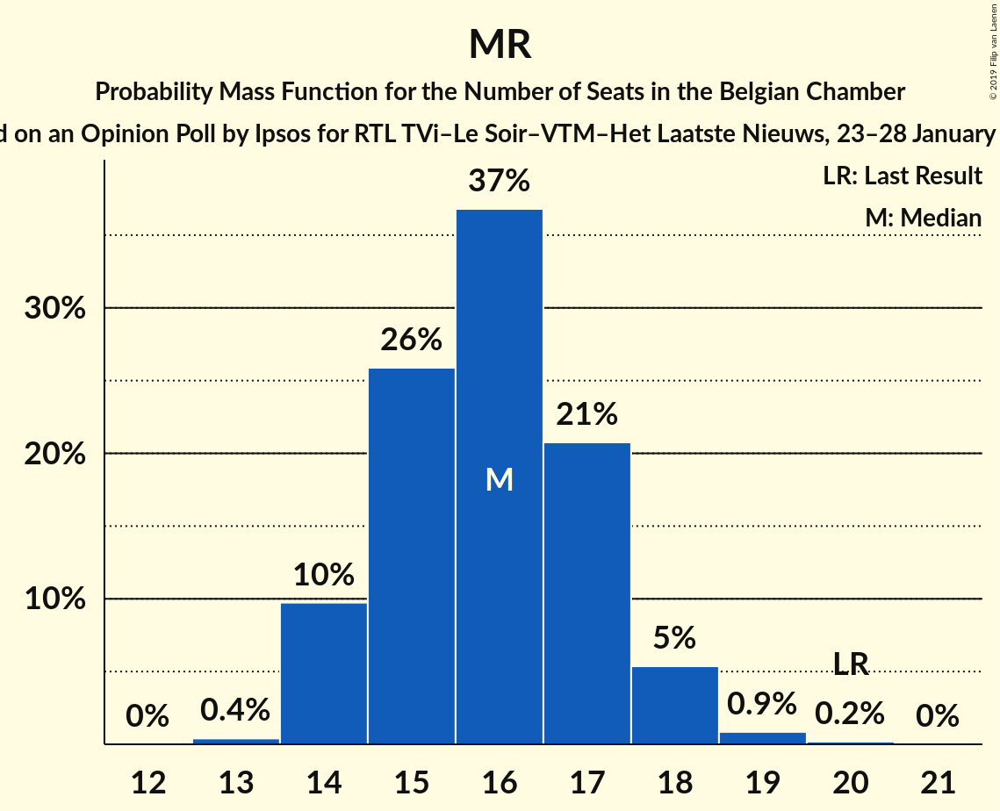
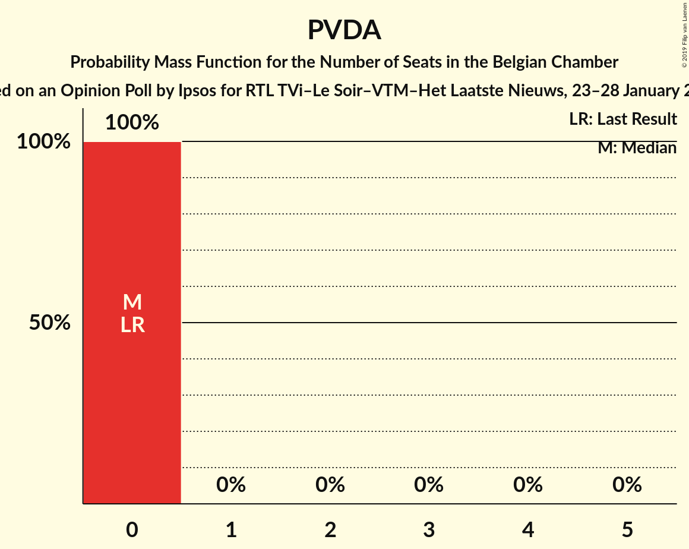

# Opinion Poll by Ipsos for RTL TVi–Le Soir–VTM–Het Laatste Nieuws, 23–28 January 2015

Areas included: Flanders, Wallonia

<a href="#voting-intentions">Voting Intentions</a> | <a href="#seats">Seats</a> | <a href="#coalitions">Coalitions</a> | <a href="#technical-information">Technical Information</a>

## Voting Intentions

### Confidence Intervals

| Party | Last Result | Poll Result | 80% Confidence Interval | 90% Confidence Interval | 95% Confidence Interval | 99% Confidence Interval |
|:-----:|:-----------:|:-----------:|:-----------------------:|:-----------------------:|:-----------------------:|:-----------------------:|
| N-VA | 20.3% | 20.2% | 18.9–21.0% |18.6–21.2% |18.3–21.3% |17.8–21.4% |
| CD&V | 11.6% | 11.4% | 10.4–12.1% |10.2–12.3% |9.9–12.4% |9.5–12.4% |
| Open Vld | 9.8% | 9.9% | 9.0–10.6% |8.8–10.7% |8.6–10.8% |8.2–10.8% |
| sp.a | 8.8% | 9.8% | 8.9–10.4% |8.7–10.6% |8.5–10.6% |8.0–10.7% |
| PS | 11.7% | 9.1% | 8.4–9.2% |8.3–9.3% |8.1–9.3% |7.9–9.3% |
| MR | 9.6% | 8.7% | 7.9–8.6% |7.8–8.6% |7.7–8.7% |7.4–8.7% |
| Groen | 5.3% | 6.8% | 6.1–7.6% |5.9–7.8% |5.7–7.9% |5.4–8.0% |
| Vlaams Belang | 3.7% | 5.1% | 4.4–5.7% |4.2–5.8% |4.1–5.9% |3.8–6.0% |
| cdH | 5.0% | 4.6% | 4.1–4.7% |4.0–4.7% |3.9–4.8% |3.7–4.8% |
| Ecolo | 3.3% | 2.8% | 2.4–2.8% |2.3–2.9% |2.2–2.9% |2.1–2.9% |
| PTB | 2.0% | 2.5% | 2.0–2.5% |2.0–2.5% |1.9–2.5% |1.8–2.5% |
| PVDA | 1.8% | 2.4% | 1.9–2.8% |1.8–2.9% |1.7–2.9% |1.5–2.9% |
| Parti Populaire | 1.5% | 1.5% | 1.3–1.6% |1.2–1.6% |1.2–1.7% |1.1–1.7% |
| DéFI | 1.8% | 0.7% | 0.6–0.8% |0.5–0.8% |0.5–0.8% |0.4–0.8% |

*Note:* The poll result column reflects the actual value used in the calculations. Published results may vary slightly, and in addition be rounded to fewer digits.

## Seats

### Confidence Intervals

| Party | Last Result | Median | 80% Confidence Interval | 90% Confidence Interval | 95% Confidence Interval | 99% Confidence Interval |
|:-----:|:-----------:|:------:|:-----------------------:|:-----------------------:|:-----------------------:|:-----------------------:|
| <a href="#n-va">N-VA</a> | 33 | 30 | 28–32 |27–32 |27–33 |26–34 |
| <a href="#cd&v">CD&V</a> | 18 | 16 | 13–18 |13–18 |13–18 |13–19 |
| <a href="#open-vld">Open Vld</a> | 14 | 13 | 12–15 |12–16 |11–17 |11–18 |
| <a href="#sp.a">sp.a</a> | 13 | 13 | 13–15 |12–15 |11–16 |10–17 |
| <a href="#ps">PS</a> | 23 | 17 | 16–18 |16–18 |16–18 |15–19 |
| <a href="#mr">MR</a> | 20 | 16 | 15–17 |14–18 |14–18 |14–19 |
| <a href="#groen">Groen</a> | 6 | 8 | 7–10 |6–11 |6–11 |6–12 |
| <a href="#vlaams-belang">Vlaams Belang</a> | 3 | 6 | 5–8 |5–8 |4–8 |2–8 |
| <a href="#cdh">cdH</a> | 9 | 7 | 7–8 |7–9 |7–10 |7–11 |
| <a href="#ecolo">Ecolo</a> | 6 | 4 | 2–5 |2–5 |2–5 |1–6 |
| <a href="#ptb">PTB</a> | 2 | 3 | 2–4 |2–4 |2–4 |2–4 |
| <a href="#pvda">PVDA</a> | 0 | 0 | 0 |0 |0 |0 |
| <a href="#parti-populaire">Parti Populaire</a> | 1 | 1 | 0–2 |0–2 |0–2 |0–2 |
| <a href="#défi">DéFI</a> | 2 | 0 | 0 |0 |0 |0 |

### N-VA

*For a full overview of the results for this party, see the [N-VA](party-n-va.html) page.*

| Number of Seats | Probability | Accumulated | Special Marks |
|:---------------:|:-----------:|:-----------:|:-------------:|
| 24 | 0% | 100% |  |
| 25 | 0.3% | 99.9% |  |
| 26 | 2% | 99.7% |  |
| 27 | 5% | 98% |  |
| 28 | 13% | 93% |  |
| 29 | 23% | 80% |  |
| 30 | 20% | 57% | Median |
| 31 | 26% | 38% |  |
| 32 | 8% | 12% |  |
| 33 | 3% | 4% | Last Result |
| 34 | 1.1% | 1.4% |  |
| 35 | 0.3% | 0.3% |  |
| 36 | 0% | 0.1% |  |
| 37 | 0% | 0% |  |

### CD&V

*For a full overview of the results for this party, see the [CD&V](party-cdv.html) page.*

| Number of Seats | Probability | Accumulated | Special Marks |
|:---------------:|:-----------:|:-----------:|:-------------:|
| 13 | 11% | 100% |  |
| 14 | 12% | 89% |  |
| 15 | 15% | 77% |  |
| 16 | 18% | 62% | Median |
| 17 | 16% | 43% |  |
| 18 | 26% | 27% | Last Result |
| 19 | 0.8% | 1.0% |  |
| 20 | 0.1% | 0.2% |  |
| 21 | 0% | 0% |  |

### Open Vld

*For a full overview of the results for this party, see the [Open Vld](party-openvld.html) page.*

| Number of Seats | Probability | Accumulated | Special Marks |
|:---------------:|:-----------:|:-----------:|:-------------:|
| 11 | 4% | 100% |  |
| 12 | 25% | 96% |  |
| 13 | 49% | 71% | Median |
| 14 | 9% | 22% | Last Result |
| 15 | 6% | 13% |  |
| 16 | 3% | 8% |  |
| 17 | 4% | 4% |  |
| 18 | 0.6% | 0.7% |  |
| 19 | 0% | 0% |  |

### sp.a

*For a full overview of the results for this party, see the [sp.a](party-spa.html) page.*

| Number of Seats | Probability | Accumulated | Special Marks |
|:---------------:|:-----------:|:-----------:|:-------------:|
| 9 | 0.3% | 100% |  |
| 10 | 1.3% | 99.7% |  |
| 11 | 2% | 98% |  |
| 12 | 6% | 96% |  |
| 13 | 65% | 90% | Last Result, Median |
| 14 | 11% | 25% |  |
| 15 | 11% | 14% |  |
| 16 | 2% | 3% |  |
| 17 | 1.0% | 1.2% |  |
| 18 | 0.2% | 0.2% |  |
| 19 | 0% | 0% |  |

### PS

*For a full overview of the results for this party, see the [PS](party-ps.html) page.*

| Number of Seats | Probability | Accumulated | Special Marks |
|:---------------:|:-----------:|:-----------:|:-------------:|
| 14 | 0.1% | 100% |  |
| 15 | 1.1% | 99.9% |  |
| 16 | 24% | 98.8% |  |
| 17 | 32% | 75% | Median |
| 18 | 41% | 43% |  |
| 19 | 2% | 2% |  |
| 20 | 0.1% | 0.2% |  |
| 21 | 0% | 0% |  |
| 22 | 0% | 0% |  |
| 23 | 0% | 0% | Last Result |

### MR

*For a full overview of the results for this party, see the [MR](party-mr.html) page.*

| Number of Seats | Probability | Accumulated | Special Marks |
|:---------------:|:-----------:|:-----------:|:-------------:|
| 13 | 0.4% | 100% |  |
| 14 | 8% | 99.6% |  |
| 15 | 25% | 91% |  |
| 16 | 38% | 66% | Median |
| 17 | 22% | 28% |  |
| 18 | 5% | 6% |  |
| 19 | 0.6% | 0.8% |  |
| 20 | 0.1% | 0.2% | Last Result |
| 21 | 0% | 0% |  |

### Groen

*For a full overview of the results for this party, see the [Groen](party-groen.html) page.*

| Number of Seats | Probability | Accumulated | Special Marks |
|:---------------:|:-----------:|:-----------:|:-------------:|
| 5 | 0.4% | 100% |  |
| 6 | 8% | 99.6% | Last Result |
| 7 | 7% | 91% |  |
| 8 | 39% | 85% | Median |
| 9 | 19% | 46% |  |
| 10 | 19% | 26% |  |
| 11 | 5% | 8% |  |
| 12 | 2% | 2% |  |
| 13 | 0% | 0% |  |

### Vlaams Belang

*For a full overview of the results for this party, see the [Vlaams Belang](party-vlaamsbelang.html) page.*

| Number of Seats | Probability | Accumulated | Special Marks |
|:---------------:|:-----------:|:-----------:|:-------------:|
| 2 | 0.7% | 100% |  |
| 3 | 1.1% | 99.3% | Last Result |
| 4 | 2% | 98% |  |
| 5 | 29% | 97% |  |
| 6 | 24% | 68% | Median |
| 7 | 32% | 44% |  |
| 8 | 12% | 12% |  |
| 9 | 0% | 0% |  |

### cdH

*For a full overview of the results for this party, see the [cdH](party-cdh.html) page.*

| Number of Seats | Probability | Accumulated | Special Marks |
|:---------------:|:-----------:|:-----------:|:-------------:|
| 5 | 0.1% | 100% |  |
| 6 | 0.2% | 99.9% |  |
| 7 | 72% | 99.7% | Median |
| 8 | 22% | 28% |  |
| 9 | 3% | 6% | Last Result |
| 10 | 2% | 3% |  |
| 11 | 0.6% | 0.6% |  |
| 12 | 0% | 0% |  |

### Ecolo

*For a full overview of the results for this party, see the [Ecolo](party-ecolo.html) page.*

| Number of Seats | Probability | Accumulated | Special Marks |
|:---------------:|:-----------:|:-----------:|:-------------:|
| 1 | 2% | 100% |  |
| 2 | 21% | 98% |  |
| 3 | 18% | 78% |  |
| 4 | 36% | 59% | Median |
| 5 | 23% | 23% |  |
| 6 | 0.7% | 0.7% | Last Result |
| 7 | 0% | 0% |  |

### PTB

*For a full overview of the results for this party, see the [PTB](party-ptb.html) page.*

| Number of Seats | Probability | Accumulated | Special Marks |
|:---------------:|:-----------:|:-----------:|:-------------:|
| 1 | 0.1% | 100% |  |
| 2 | 24% | 99.9% | Last Result |
| 3 | 62% | 76% | Median |
| 4 | 14% | 14% |  |
| 5 | 0.1% | 0.1% |  |
| 6 | 0% | 0% |  |

### PVDA

*For a full overview of the results for this party, see the [PVDA](party-pvda.html) page.*

| Number of Seats | Probability | Accumulated | Special Marks |
|:---------------:|:-----------:|:-----------:|:-------------:|
| 0 | 100% | 100% | Last Result, Median |

### Parti Populaire

*For a full overview of the results for this party, see the [Parti Populaire](party-partipopulaire.html) page.*

| Number of Seats | Probability | Accumulated | Special Marks |
|:---------------:|:-----------:|:-----------:|:-------------:|
| 0 | 31% | 100% |  |
| 1 | 33% | 69% | Last Result, Median |
| 2 | 36% | 36% |  |
| 3 | 0% | 0% |  |

### DéFI

*For a full overview of the results for this party, see the [DéFI](party-défi.html) page.*

| Number of Seats | Probability | Accumulated | Special Marks |
|:---------------:|:-----------:|:-----------:|:-------------:|
| 0 | 100% | 100% | Median |
| 1 | 0% | 0% |  |
| 2 | 0% | 0% | Last Result |

## Coalitions

### Confidence Intervals

| Coalition | Last Result | Median | Majority? | 80% Confidence Interval | 90% Confidence Interval | 95% Confidence Interval | 99% Confidence Interval |
|:---------:|:-----------:|:------:|:---------:|:-----------------------:|:-----------------------:|:-----------------------:|:-----------------------:|
| CD&V – Open Vld – sp.a – PS – MR – Groen – cdH – Ecolo | 109 | 95 | 100% | 93–98 | 92–98 | 91–99 | 90–101 |
| CD&V – Open Vld – sp.a – PS – MR – cdH | 97 | 83 | 100% | 80–86 | 79–87 | 78–88 | 77–89 |
| N-VA – CD&V – Open Vld – MR – cdH | 94 | 82 | 99.9% | 79–85 | 79–86 | 78–87 | 77–88 |
| N-VA – CD&V – Open Vld – MR | 85 | 75 | 39% | 72–77 | 71–78 | 71–79 | 69–80 |
| Open Vld – sp.a – PS – MR – Groen – Ecolo | 82 | 72 | 5% | 69–75 | 68–75 | 68–76 | 66–78 |
| CD&V – Open Vld – PS – MR – cdH | 84 | 70 | 0.6% | 67–73 | 66–73 | 65–74 | 64–76 |
| CD&V – sp.a – PS – Groen – cdH – Ecolo – PTB – PVDA | 77 | 69 | 0.1% | 66–72 | 65–72 | 64–73 | 63–74 |
| CD&V – sp.a – PS – Groen – cdH – Ecolo | 75 | 66 | 0% | 63–69 | 62–69 | 61–70 | 60–72 |
| CD&V – Open Vld – MR – Groen – cdH – Ecolo | 73 | 65 | 0% | 62–67 | 61–68 | 60–69 | 59–70 |
| Open Vld – sp.a – PS – MR | 70 | 59 | 0% | 57–62 | 56–63 | 56–64 | 55–65 |
| CD&V – sp.a – PS – cdH | 63 | 54 | 0% | 51–56 | 50–57 | 50–58 | 49–59 |
| sp.a – PS – Groen – cdH – Ecolo – PTB – PVDA | 59 | 53 | 0% | 50–55 | 50–56 | 49–57 | 48–58 |
| CD&V – Open Vld – MR – cdH | 61 | 52 | 0% | 50–55 | 49–56 | 48–57 | 47–58 |
| sp.a – PS – Groen – Ecolo – PTB – PVDA | 50 | 46 | 0% | 43–48 | 42–49 | 41–50 | 40–51 |

### CD&V – Open Vld – sp.a – PS – MR – Groen – cdH – Ecolo

| Number of Seats | Probability | Accumulated | Special Marks |
|:---------------:|:-----------:|:-----------:|:-------------:|
| 88 | 0.1% | 100% |  |
| 89 | 0.3% | 99.9% |  |
| 90 | 0.9% | 99.6% |  |
| 91 | 2% | 98.8% |  |
| 92 | 6% | 96% |  |
| 93 | 11% | 91% |  |
| 94 | 19% | 79% | Median |
| 95 | 21% | 61% |  |
| 96 | 18% | 39% |  |
| 97 | 11% | 21% |  |
| 98 | 6% | 11% |  |
| 99 | 3% | 5% |  |
| 100 | 1.3% | 2% |  |
| 101 | 0.4% | 0.5% |  |
| 102 | 0.1% | 0.1% |  |
| 103 | 0% | 0% |  |
| 104 | 0% | 0% |  |
| 105 | 0% | 0% |  |
| 106 | 0% | 0% |  |
| 107 | 0% | 0% |  |
| 108 | 0% | 0% |  |
| 109 | 0% | 0% | Last Result |

### CD&V – Open Vld – sp.a – PS – MR – cdH

| Number of Seats | Probability | Accumulated | Special Marks |
|:---------------:|:-----------:|:-----------:|:-------------:|
| 76 | 0.2% | 100% | Majority |
| 77 | 0.6% | 99.8% |  |
| 78 | 2% | 99.2% |  |
| 79 | 4% | 97% |  |
| 80 | 8% | 93% |  |
| 81 | 13% | 85% |  |
| 82 | 17% | 72% | Median |
| 83 | 17% | 56% |  |
| 84 | 15% | 38% |  |
| 85 | 11% | 24% |  |
| 86 | 7% | 13% |  |
| 87 | 4% | 6% |  |
| 88 | 2% | 3% |  |
| 89 | 0.7% | 1.1% |  |
| 90 | 0.3% | 0.3% |  |
| 91 | 0.1% | 0.1% |  |
| 92 | 0% | 0% |  |
| 93 | 0% | 0% |  |
| 94 | 0% | 0% |  |
| 95 | 0% | 0% |  |
| 96 | 0% | 0% |  |
| 97 | 0% | 0% | Last Result |

### N-VA – CD&V – Open Vld – MR – cdH

| Number of Seats | Probability | Accumulated | Special Marks |
|:---------------:|:-----------:|:-----------:|:-------------:|
| 75 | 0.1% | 100% |  |
| 76 | 0.3% | 99.9% | Majority |
| 77 | 1.1% | 99.6% |  |
| 78 | 3% | 98.5% |  |
| 79 | 6% | 96% |  |
| 80 | 11% | 90% |  |
| 81 | 15% | 79% |  |
| 82 | 19% | 64% | Median |
| 83 | 17% | 45% |  |
| 84 | 13% | 28% |  |
| 85 | 8% | 15% |  |
| 86 | 4% | 7% |  |
| 87 | 2% | 3% |  |
| 88 | 0.7% | 0.9% |  |
| 89 | 0.2% | 0.3% |  |
| 90 | 0.1% | 0.1% |  |
| 91 | 0% | 0% |  |
| 92 | 0% | 0% |  |
| 93 | 0% | 0% |  |
| 94 | 0% | 0% | Last Result |

### N-VA – CD&V – Open Vld – MR

| Number of Seats | Probability | Accumulated | Special Marks |
|:---------------:|:-----------:|:-----------:|:-------------:|
| 68 | 0.1% | 100% |  |
| 69 | 0.4% | 99.9% |  |
| 70 | 1.4% | 99.4% |  |
| 71 | 3% | 98% |  |
| 72 | 7% | 95% |  |
| 73 | 12% | 87% |  |
| 74 | 17% | 75% |  |
| 75 | 20% | 58% | Median |
| 76 | 17% | 39% | Majority |
| 77 | 12% | 21% |  |
| 78 | 6% | 10% |  |
| 79 | 3% | 4% |  |
| 80 | 0.9% | 1.3% |  |
| 81 | 0.3% | 0.4% |  |
| 82 | 0.1% | 0.1% |  |
| 83 | 0% | 0% |  |
| 84 | 0% | 0% |  |
| 85 | 0% | 0% | Last Result |

### Open Vld – sp.a – PS – MR – Groen – Ecolo

| Number of Seats | Probability | Accumulated | Special Marks |
|:---------------:|:-----------:|:-----------:|:-------------:|
| 65 | 0.1% | 100% |  |
| 66 | 0.4% | 99.9% |  |
| 67 | 1.4% | 99.4% |  |
| 68 | 4% | 98% |  |
| 69 | 9% | 94% |  |
| 70 | 15% | 84% |  |
| 71 | 18% | 70% | Median |
| 72 | 17% | 52% |  |
| 73 | 14% | 34% |  |
| 74 | 10% | 20% |  |
| 75 | 6% | 10% |  |
| 76 | 3% | 5% | Majority |
| 77 | 1.1% | 2% |  |
| 78 | 0.4% | 0.6% |  |
| 79 | 0.1% | 0.2% |  |
| 80 | 0% | 0% |  |
| 81 | 0% | 0% |  |
| 82 | 0% | 0% | Last Result |

### CD&V – Open Vld – PS – MR – cdH

| Number of Seats | Probability | Accumulated | Special Marks |
|:---------------:|:-----------:|:-----------:|:-------------:|
| 63 | 0.2% | 100% |  |
| 64 | 0.9% | 99.8% |  |
| 65 | 3% | 98.8% |  |
| 66 | 5% | 96% |  |
| 67 | 9% | 91% |  |
| 68 | 13% | 81% |  |
| 69 | 16% | 68% | Median |
| 70 | 17% | 52% |  |
| 71 | 14% | 35% |  |
| 72 | 10% | 21% |  |
| 73 | 6% | 11% |  |
| 74 | 3% | 5% |  |
| 75 | 1.2% | 2% |  |
| 76 | 0.4% | 0.6% | Majority |
| 77 | 0.1% | 0.2% |  |
| 78 | 0% | 0.1% |  |
| 79 | 0% | 0% |  |
| 80 | 0% | 0% |  |
| 81 | 0% | 0% |  |
| 82 | 0% | 0% |  |
| 83 | 0% | 0% |  |
| 84 | 0% | 0% | Last Result |

### CD&V – sp.a – PS – Groen – cdH – Ecolo – PTB – PVDA

| Number of Seats | Probability | Accumulated | Special Marks |
|:---------------:|:-----------:|:-----------:|:-------------:|
| 61 | 0.1% | 100% |  |
| 62 | 0.2% | 99.9% |  |
| 63 | 0.7% | 99.7% |  |
| 64 | 2% | 98.9% |  |
| 65 | 4% | 97% |  |
| 66 | 7% | 93% |  |
| 67 | 11% | 86% |  |
| 68 | 16% | 75% | Median |
| 69 | 18% | 59% |  |
| 70 | 17% | 40% |  |
| 71 | 13% | 23% |  |
| 72 | 6% | 10% |  |
| 73 | 3% | 4% |  |
| 74 | 1.1% | 2% |  |
| 75 | 0.4% | 0.5% |  |
| 76 | 0.1% | 0.1% | Majority |
| 77 | 0% | 0% | Last Result |

### CD&V – sp.a – PS – Groen – cdH – Ecolo

| Number of Seats | Probability | Accumulated | Special Marks |
|:---------------:|:-----------:|:-----------:|:-------------:|
| 58 | 0.1% | 100% |  |
| 59 | 0.2% | 99.9% |  |
| 60 | 0.7% | 99.7% |  |
| 61 | 2% | 99.0% |  |
| 62 | 4% | 97% |  |
| 63 | 7% | 94% |  |
| 64 | 11% | 87% |  |
| 65 | 16% | 76% | Median |
| 66 | 18% | 60% |  |
| 67 | 18% | 42% |  |
| 68 | 13% | 25% |  |
| 69 | 7% | 11% |  |
| 70 | 3% | 5% |  |
| 71 | 1.2% | 2% |  |
| 72 | 0.4% | 0.5% |  |
| 73 | 0.1% | 0.1% |  |
| 74 | 0% | 0% |  |
| 75 | 0% | 0% | Last Result |

### CD&V – Open Vld – MR – Groen – cdH – Ecolo

| Number of Seats | Probability | Accumulated | Special Marks |
|:---------------:|:-----------:|:-----------:|:-------------:|
| 58 | 0.2% | 100% |  |
| 59 | 0.7% | 99.8% |  |
| 60 | 2% | 99.1% |  |
| 61 | 5% | 97% |  |
| 62 | 8% | 92% |  |
| 63 | 12% | 84% |  |
| 64 | 17% | 72% | Median |
| 65 | 22% | 55% |  |
| 66 | 16% | 32% |  |
| 67 | 8% | 16% |  |
| 68 | 5% | 8% |  |
| 69 | 2% | 3% |  |
| 70 | 0.8% | 1.0% |  |
| 71 | 0.2% | 0.2% |  |
| 72 | 0% | 0.1% |  |
| 73 | 0% | 0% | Last Result |

### Open Vld – sp.a – PS – MR

| Number of Seats | Probability | Accumulated | Special Marks |
|:---------------:|:-----------:|:-----------:|:-------------:|
| 53 | 0.1% | 100% |  |
| 54 | 0.3% | 99.9% |  |
| 55 | 1.0% | 99.6% |  |
| 56 | 4% | 98.6% |  |
| 57 | 10% | 95% |  |
| 58 | 18% | 85% |  |
| 59 | 20% | 67% | Median |
| 60 | 17% | 47% |  |
| 61 | 13% | 29% |  |
| 62 | 8% | 17% |  |
| 63 | 5% | 9% |  |
| 64 | 2% | 4% |  |
| 65 | 1.0% | 1.5% |  |
| 66 | 0.3% | 0.5% |  |
| 67 | 0.1% | 0.1% |  |
| 68 | 0% | 0% |  |
| 69 | 0% | 0% |  |
| 70 | 0% | 0% | Last Result |

### CD&V – sp.a – PS – cdH

| Number of Seats | Probability | Accumulated | Special Marks |
|:---------------:|:-----------:|:-----------:|:-------------:|
| 47 | 0.1% | 100% |  |
| 48 | 0.3% | 99.9% |  |
| 49 | 1.4% | 99.6% |  |
| 50 | 4% | 98% |  |
| 51 | 8% | 94% |  |
| 52 | 13% | 87% |  |
| 53 | 17% | 74% | Median |
| 54 | 19% | 57% |  |
| 55 | 17% | 38% |  |
| 56 | 12% | 21% |  |
| 57 | 6% | 9% |  |
| 58 | 2% | 3% |  |
| 59 | 0.9% | 1.3% |  |
| 60 | 0.3% | 0.3% |  |
| 61 | 0.1% | 0.1% |  |
| 62 | 0% | 0% |  |
| 63 | 0% | 0% | Last Result |

### sp.a – PS – Groen – cdH – Ecolo – PTB – PVDA

| Number of Seats | Probability | Accumulated | Special Marks |
|:---------------:|:-----------:|:-----------:|:-------------:|
| 46 | 0.1% | 100% |  |
| 47 | 0.3% | 99.9% |  |
| 48 | 1.0% | 99.6% |  |
| 49 | 3% | 98.6% |  |
| 50 | 7% | 96% |  |
| 51 | 13% | 89% |  |
| 52 | 18% | 76% | Median |
| 53 | 21% | 58% |  |
| 54 | 16% | 37% |  |
| 55 | 11% | 21% |  |
| 56 | 5% | 9% |  |
| 57 | 2% | 4% |  |
| 58 | 0.9% | 1.2% |  |
| 59 | 0.3% | 0.4% | Last Result |
| 60 | 0.1% | 0.1% |  |
| 61 | 0% | 0% |  |

### CD&V – Open Vld – MR – cdH

| Number of Seats | Probability | Accumulated | Special Marks |
|:---------------:|:-----------:|:-----------:|:-------------:|
| 46 | 0.2% | 100% |  |
| 47 | 0.9% | 99.8% |  |
| 48 | 3% | 98.9% |  |
| 49 | 6% | 96% |  |
| 50 | 10% | 90% |  |
| 51 | 14% | 80% |  |
| 52 | 17% | 66% | Median |
| 53 | 17% | 48% |  |
| 54 | 14% | 31% |  |
| 55 | 9% | 17% |  |
| 56 | 5% | 9% |  |
| 57 | 2% | 4% |  |
| 58 | 0.9% | 1.4% |  |
| 59 | 0.3% | 0.5% |  |
| 60 | 0.1% | 0.1% |  |
| 61 | 0% | 0% | Last Result |

### sp.a – PS – Groen – Ecolo – PTB – PVDA

| Number of Seats | Probability | Accumulated | Special Marks |
|:---------------:|:-----------:|:-----------:|:-------------:|
| 39 | 0.2% | 100% |  |
| 40 | 0.7% | 99.8% |  |
| 41 | 2% | 99.1% |  |
| 42 | 5% | 97% |  |
| 43 | 9% | 93% |  |
| 44 | 14% | 83% |  |
| 45 | 18% | 69% | Median |
| 46 | 20% | 51% |  |
| 47 | 14% | 31% |  |
| 48 | 10% | 17% |  |
| 49 | 5% | 7% |  |
| 50 | 2% | 3% | Last Result |
| 51 | 0.7% | 0.9% |  |
| 52 | 0.2% | 0.2% |  |
| 53 | 0% | 0% |  |

## Technical Information

### Opinion Poll

+ **Polling firm:** Ipsos
+ **Commissioner(s):** RTL TVi–Le Soir–VTM–Het Laatste Nieuws
+ **Fieldwork period:** 23–28 January 2015

### Calculations

+ **Sample size:** 1549
+ **Simulations done:** 2,097,152
+ **Error estimate:** 1.19%

