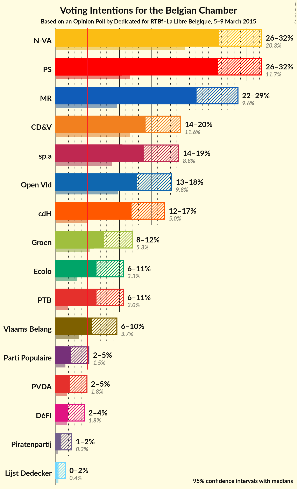
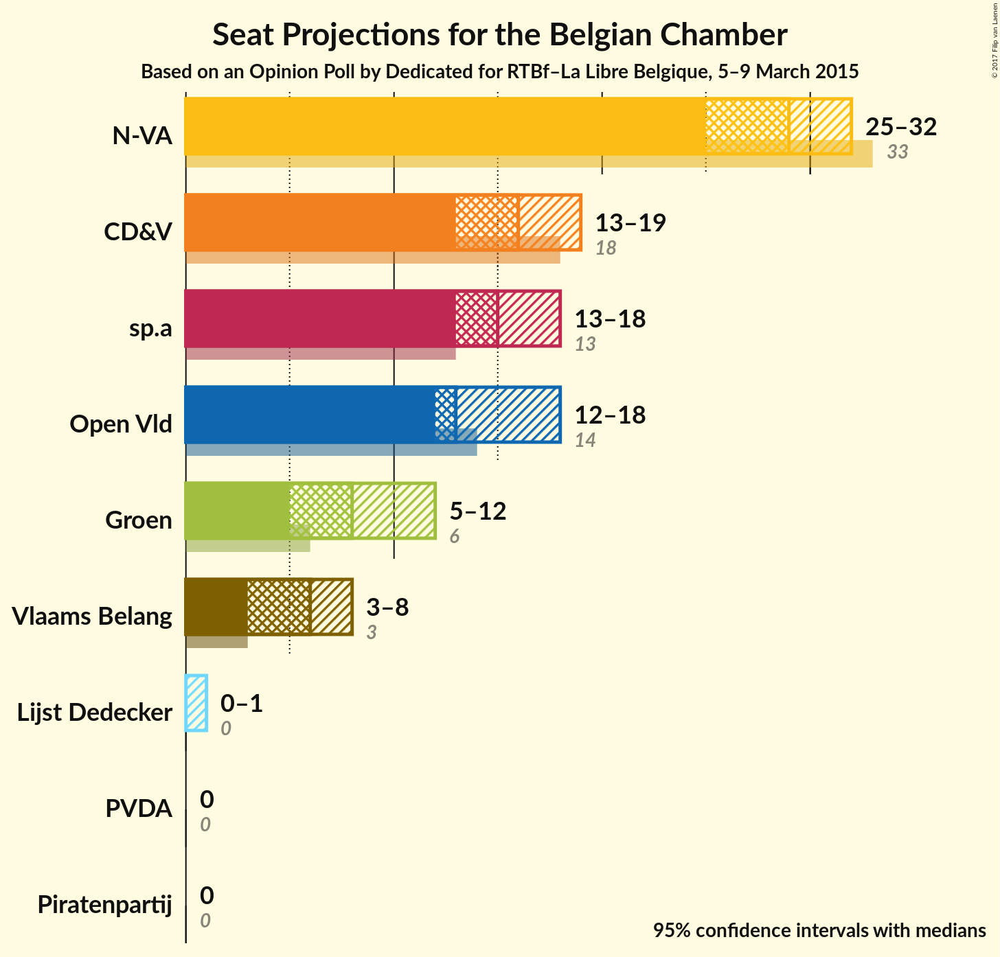
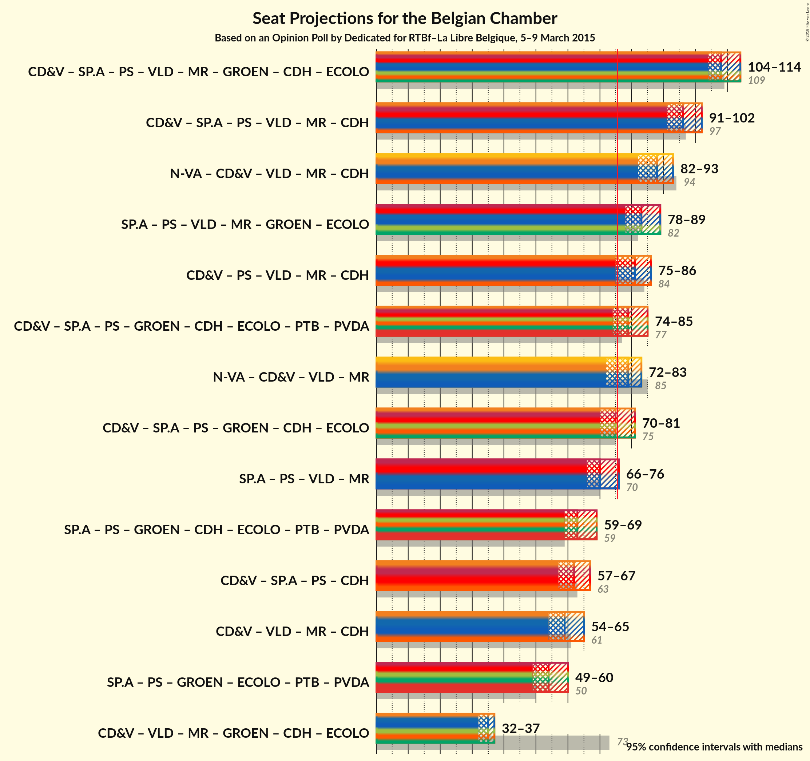

# Opinion Poll by Dedicated for RTBf–La Libre Belgique, 5–9 March 2015

<a href="#voting-intentions">Voting Intentions</a> | <a href="#seats">Seats</a> | <a href="#coalitions">Coalitions</a> | <a href="#technical-information">Technical Information</a>

## Voting Intentions

### Confidence Intervals

| Party | Last Result | Poll Result | 80% Confidence Interval | 90% Confidence Interval | 95% Confidence Interval | 99% Confidence Interval |
|:-----:|:-----------:|:-----------:|:-----------------------:|:-----------------------:|:-----------------------:|:-----------------------:|
| N-VA | 20.3% | 28.8% | 26.7–31.1% |26.1–31.7% |25.5–32.3% |24.5–33.4% |
| CD&V | 11.6% | 16.6% | 14.9–18.6% |14.4–19.1% |14.1–19.6% |13.3–20.6% |
| sp.a | 8.8% | 16.4% | 14.7–18.3% |14.2–18.8% |13.8–19.3% |13.0–20.3% |
| Open Vld | 9.8% | 15.3% | 13.7–17.2% |13.2–17.8% |12.8–18.2% |12.1–19.2% |
| Groen | 5.3% | 9.6% | 8.2–11.1% |7.9–11.6% |7.6–12.0% |7.0–12.8% |
| Vlaams Belang | 3.7% | 7.4% | 6.2–8.8% |5.9–9.2% |5.7–9.6% |5.2–10.3% |
| PVDA | 1.8% | 3.3% | 2.6–4.4% |2.4–4.7% |2.2–5.0% |1.9–5.5% |
| Piratenpartij | 0.3% | 1.3% | 0.9–2.1% |0.8–2.3% |0.7–2.5% |0.5–2.9% |
| Lijst Dedecker | 0.4% | 0.6% | 0.4–1.2% |0.3–1.3% |0.2–1.5% |0.2–1.8% |

*Note:* The poll result column reflects the actual value used in the calculations. Published results may vary slightly, and in addition be rounded to fewer digits.

## Seats

### Confidence Intervals

| Party | Last Result | Median | 80% Confidence Interval | 90% Confidence Interval | 95% Confidence Interval | 99% Confidence Interval |
|:-----:|:-----------:|:------:|:-----------------------:|:-----------------------:|:-----------------------:|:-----------------------:|
| <a href="#n-va">N-VA</a> | 33 | 28 | 26–31 |26–31 |25–32 |24–34 |
| <a href="#cd&v">CD&V</a> | 18 | 15 | 13–18 |13–18 |13–18 |13–19 |
| <a href="#sp.a">sp.a</a> | 13 | 15 | 13–17 |13–18 |13–18 |12–19 |
| <a href="#open-vld">Open Vld</a> | 14 | 13 | 12–17 |12–17 |12–18 |11–18 |
| <a href="#groen">Groen</a> | 6 | 8 | 6–10 |6–10 |5–11 |5–12 |
| <a href="#vlaams-belang">Vlaams Belang</a> | 3 | 6 | 3–8 |3–8 |2–8 |2–8 |
| <a href="#pvda">PVDA</a> | 0 | 0 | 0 |0 |0 |0 |
| <a href="#piratenpartij">Piratenpartij</a> | 0 | 0 | 0 |0 |0 |0 |
| <a href="#lijst-dedecker">Lijst Dedecker</a> | 0 | 0 | 0–1 |0–1 |0–1 |0–1 |

### N-VA

*For a full overview of the results for this party, see the [N-VA](party-nva.html) page.*

| Number of Seats | Probability | Accumulated | Special Marks |
|:---------------:|:-----------:|:-----------:|:-------------:|
| 23 | 0.4% | 100% |  |
| 24 | 2% | 99.5% |  |
| 25 | 2% | 98% |  |
| 26 | 14% | 96% |  |
| 27 | 16% | 82% |  |
| 28 | 17% | 66% | Median |
| 29 | 12% | 50% |  |
| 30 | 13% | 38% |  |
| 31 | 21% | 25% |  |
| 32 | 3% | 4% |  |
| 33 | 0.4% | 0.9% | Last Result |
| 34 | 0.4% | 0.5% |  |
| 35 | 0.1% | 0.1% |  |
| 36 | 0% | 0% |  |

### CD&V

*For a full overview of the results for this party, see the [CD&V](party-cdv.html) page.*

| Number of Seats | Probability | Accumulated | Special Marks |
|:---------------:|:-----------:|:-----------:|:-------------:|
| 11 | 0.1% | 100% |  |
| 12 | 0.3% | 99.9% |  |
| 13 | 22% | 99.6% |  |
| 14 | 11% | 78% |  |
| 15 | 25% | 67% | Median |
| 16 | 9% | 42% |  |
| 17 | 7% | 33% |  |
| 18 | 24% | 26% | Last Result |
| 19 | 2% | 2% |  |
| 20 | 0.1% | 0.2% |  |
| 21 | 0.1% | 0.1% |  |
| 22 | 0% | 0.1% |  |
| 23 | 0% | 0% |  |

### sp.a

*For a full overview of the results for this party, see the [sp.a](party-spa.html) page.*

| Number of Seats | Probability | Accumulated | Special Marks |
|:---------------:|:-----------:|:-----------:|:-------------:|
| 10 | 0.1% | 100% |  |
| 11 | 0.1% | 99.9% |  |
| 12 | 0.5% | 99.8% |  |
| 13 | 18% | 99.3% | Last Result |
| 14 | 12% | 81% |  |
| 15 | 25% | 69% | Median |
| 16 | 18% | 44% |  |
| 17 | 16% | 26% |  |
| 18 | 9% | 9% |  |
| 19 | 0.5% | 0.8% |  |
| 20 | 0.2% | 0.3% |  |
| 21 | 0.1% | 0.1% |  |
| 22 | 0% | 0% |  |

### Open Vld

*For a full overview of the results for this party, see the [Open Vld](party-openvld.html) page.*

| Number of Seats | Probability | Accumulated | Special Marks |
|:---------------:|:-----------:|:-----------:|:-------------:|
| 10 | 0.1% | 100% |  |
| 11 | 2% | 99.9% |  |
| 12 | 16% | 98% |  |
| 13 | 42% | 83% | Median |
| 14 | 14% | 41% | Last Result |
| 15 | 4% | 27% |  |
| 16 | 9% | 23% |  |
| 17 | 10% | 14% |  |
| 18 | 4% | 4% |  |
| 19 | 0.2% | 0.3% |  |
| 20 | 0% | 0% |  |

### Groen

*For a full overview of the results for this party, see the [Groen](party-groen.html) page.*

| Number of Seats | Probability | Accumulated | Special Marks |
|:---------------:|:-----------:|:-----------:|:-------------:|
| 5 | 3% | 100% |  |
| 6 | 23% | 97% | Last Result |
| 7 | 21% | 74% |  |
| 8 | 23% | 53% | Median |
| 9 | 15% | 30% |  |
| 10 | 11% | 14% |  |
| 11 | 2% | 4% |  |
| 12 | 2% | 2% |  |
| 13 | 0% | 0% |  |

### Vlaams Belang

*For a full overview of the results for this party, see the [Vlaams Belang](party-vlaamsbelang.html) page.*

| Number of Seats | Probability | Accumulated | Special Marks |
|:---------------:|:-----------:|:-----------:|:-------------:|
| 1 | 0% | 100% |  |
| 2 | 3% | 99.9% |  |
| 3 | 8% | 97% | Last Result |
| 4 | 3% | 89% |  |
| 5 | 20% | 86% |  |
| 6 | 33% | 66% | Median |
| 7 | 22% | 33% |  |
| 8 | 11% | 11% |  |
| 9 | 0% | 0% |  |

### PVDA

*For a full overview of the results for this party, see the [PVDA](party-pvda.html) page.*

| Number of Seats | Probability | Accumulated | Special Marks |
|:---------------:|:-----------:|:-----------:|:-------------:|
| 0 | 100% | 100% | Last Result, Median |

### Piratenpartij

*For a full overview of the results for this party, see the [Piratenpartij](party-piratenpartij.html) page.*

| Number of Seats | Probability | Accumulated | Special Marks |
|:---------------:|:-----------:|:-----------:|:-------------:|
| 0 | 99.9% | 100% | Last Result, Median |
| 1 | 0.1% | 0.1% |  |
| 2 | 0% | 0% |  |

### Lijst Dedecker

*For a full overview of the results for this party, see the [Lijst Dedecker](party-lijstdedecker.html) page.*

| Number of Seats | Probability | Accumulated | Special Marks |
|:---------------:|:-----------:|:-----------:|:-------------:|
| 0 | 82% | 100% | Last Result, Median |
| 1 | 18% | 18% |  |
| 2 | 0.1% | 0.1% |  |
| 3 | 0% | 0% |  |

## Coalitions

### Confidence Intervals

| Coalition | Last Result | Median | Majority? | 80% Confidence Interval | 90% Confidence Interval | 95% Confidence Interval | 99% Confidence Interval |
|:---------:|:-----------:|:------:|:---------:|:-----------------------:|:-----------------------:|:-----------------------:|:-----------------------:|

## Technical Information

### Opinion Poll

+ **Pollster:** Dedicated
+ **Media:** RTBf–La Libre Belgique
+ **Fieldwork period:** 5–9 March 2015

### Calculations

+ **Sample size:** 691
+ **Simulations done:** 2,097,152
+ **Error estimate:** 1.78%

