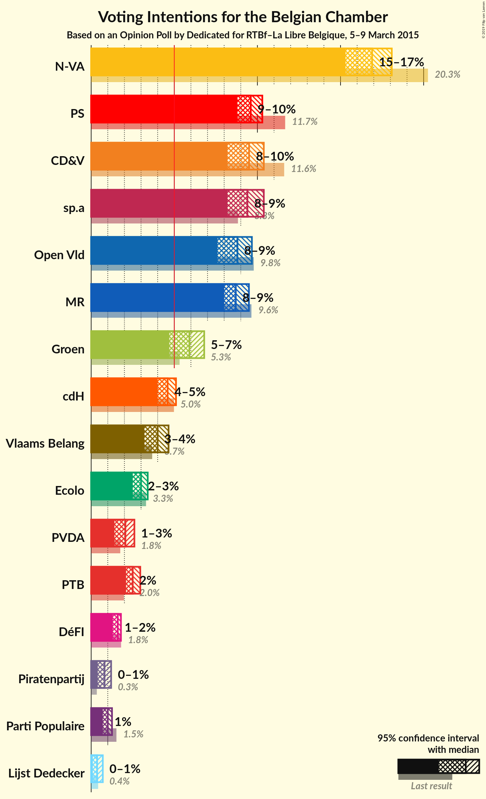
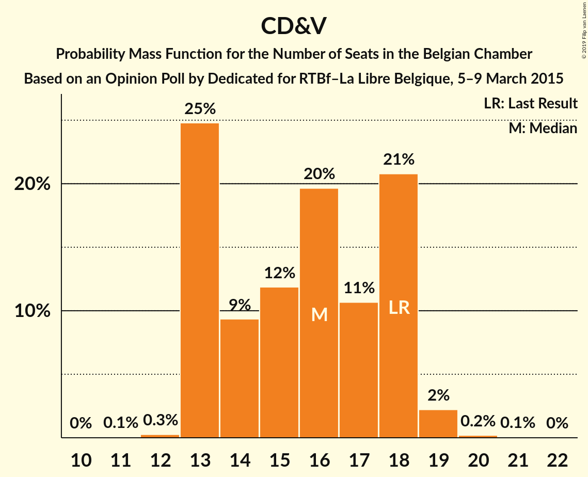
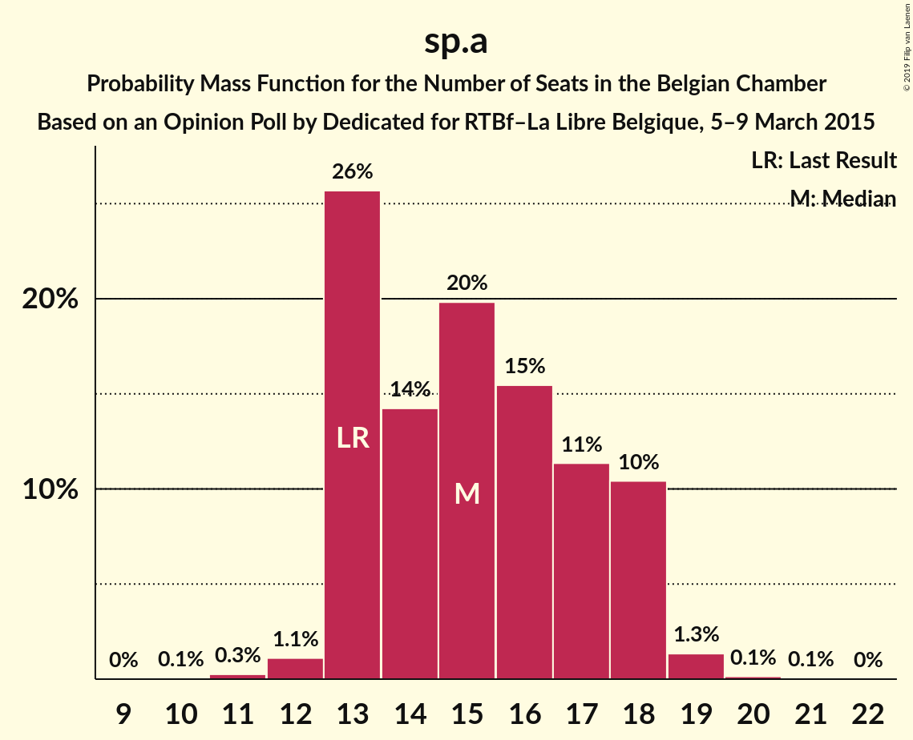
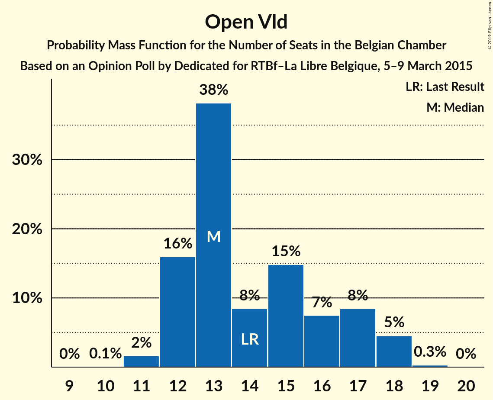
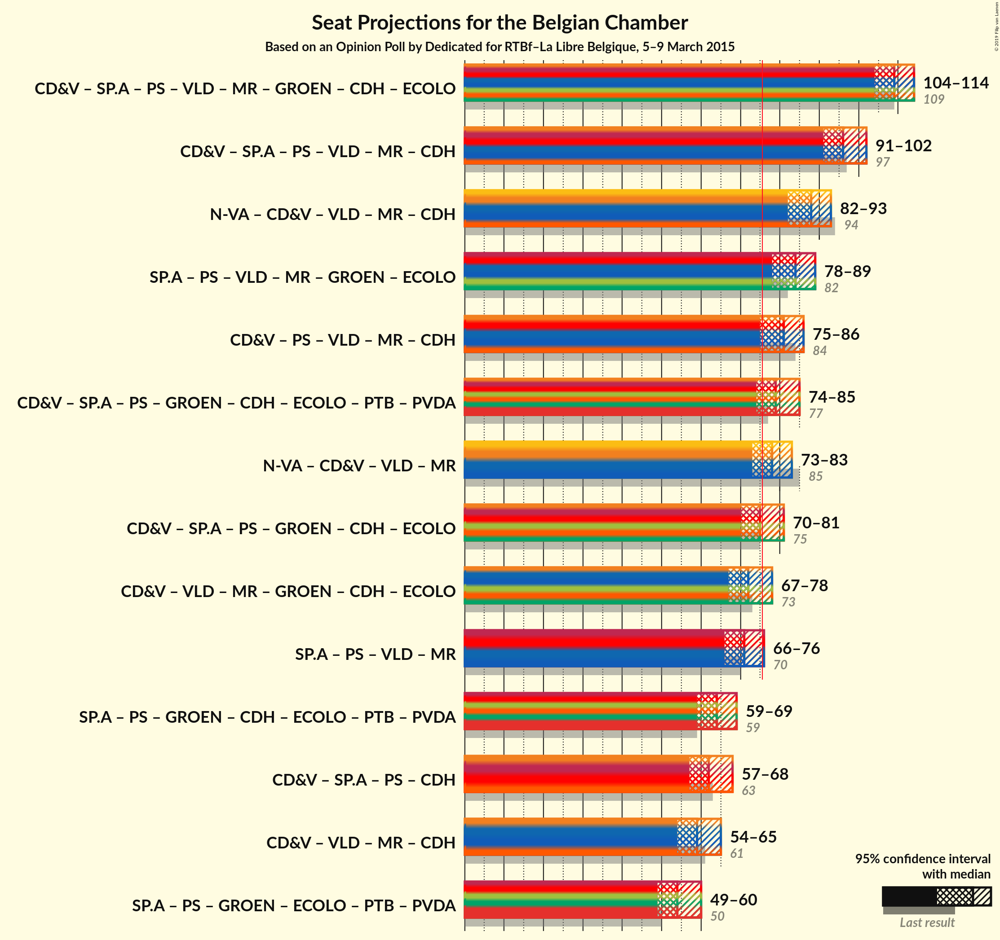

# Opinion Poll by Dedicated for RTBf–La Libre Belgique, 5–9 March 2015

Areas included: Brussels, Flanders, Wallonia

<a href="#voting-intentions">Voting Intentions</a> | <a href="#seats">Seats</a> | <a href="#coalitions">Coalitions</a> | <a href="#technical-information">Technical Information</a>

## Voting Intentions

### Confidence Intervals

| Party | Last Result | Poll Result | 80% Confidence Interval | 90% Confidence Interval | 95% Confidence Interval | 99% Confidence Interval |
|:-----:|:-----------:|:-----------:|:-----------------------:|:-----------------------:|:-----------------------:|:-----------------------:|
| N-VA | 20.3% | 18.1% | 26.7–31.1% |26.1–31.7% |25.5–32.3% |24.5–33.4% |
| CD&V | 11.6% | 10.4% | 14.9–18.6% |14.4–19.1% |14.1–19.6% |13.3–20.6% |
| sp.a | 8.8% | 10.4% | 14.7–18.3% |14.2–18.8% |13.8–19.3% |13.0–20.3% |
| PS | 11.7% | 10.3% | N/A |N/A |N/A |N/A |
| Open Vld | 9.8% | 9.7% | 13.7–17.2% |13.2–17.8% |12.8–18.2% |12.1–19.2% |
| MR | 9.6% | 9.5% | N/A |N/A |N/A |N/A |
| Groen | 5.3% | 5.9% | 8.2–11.1% |7.9–11.6% |7.6–12.0% |7.0–12.8% |
| cdH | 5.0% | 5.1% | N/A |N/A |N/A |N/A |
| Vlaams Belang | 3.7% | 4.7% | 6.2–8.8% |5.9–9.2% |5.7–9.6% |5.2–10.3% |
| Ecolo | 3.3% | 3.4% | N/A |N/A |N/A |N/A |
| PTB | 2.0% | 3.0% | N/A |N/A |N/A |N/A |
| PVDA | 1.8% | 2.1% | 2.6–4.4% |2.4–4.7% |2.2–5.0% |1.9–5.5% |
| DéFI | 1.8% | 1.8% | N/A |N/A |N/A |N/A |
| Parti Populaire | 1.5% | 1.3% | N/A |N/A |N/A |N/A |
| Piratenpartij | 0.3% | 0.8% | 0.9–2.1% |0.8–2.3% |0.7–2.5% |0.5–2.9% |
| Lijst Dedecker | 0.4% | 0.4% | 0.4–1.2% |0.3–1.3% |0.2–1.5% |0.2–1.8% |

*Note:* The poll result column reflects the actual value used in the calculations. Published results may vary slightly, and in addition be rounded to fewer digits.

## Seats

### Confidence Intervals

| Party | Last Result | Median | 80% Confidence Interval | 90% Confidence Interval | 95% Confidence Interval | 99% Confidence Interval |
|:-----:|:-----------:|:------:|:-----------------------:|:-----------------------:|:-----------------------:|:-----------------------:|
| <a href="#n-va">N-VA</a> | 33 | 29 | 26–31 |25–31 |25–32 |24–33 |
| <a href="#cd&v">CD&V</a> | 18 | 16 | 13–18 |13–18 |13–19 |13–19 |
| <a href="#sp.a">sp.a</a> | 13 | 15 | 13–17 |13–18 |13–18 |12–19 |
| <a href="#ps">PS</a> | 23 | 18 | 17–19 |16–20 |16–20 |16–22 |
| <a href="#open-vld">Open Vld</a> | 14 | 13 | 12–17 |12–18 |12–18 |11–18 |
| <a href="#mr">MR</a> | 20 | 16 | 14–17 |14–17 |13–18 |13–19 |
| <a href="#groen">Groen</a> | 6 | 8 | 6–10 |5–10 |5–12 |5–12 |
| <a href="#cdh">cdH</a> | 9 | 7 | 7–10 |7–10 |7–11 |7–11 |
| <a href="#vlaams-belang">Vlaams Belang</a> | 3 | 6 | 4–8 |3–8 |3–8 |2–8 |
| <a href="#ecolo">Ecolo</a> | 6 | 3 | 2–5 |1–5 |1–5 |1–6 |
| <a href="#ptb">PTB</a> | 2 | 3 | 3–4 |3–5 |2–5 |2–6 |
| <a href="#pvda">PVDA</a> | 0 | 0 | 0 |0 |0 |0 |
| <a href="#défi">DéFI</a> | 2 | 0 | 0 |0 |0 |0 |
| <a href="#parti-populaire">Parti Populaire</a> | 1 | 0 | 0–1 |0–1 |0–2 |0–2 |
| <a href="#piratenpartij">Piratenpartij</a> | 0 | 0 | 0 |0 |0 |0 |
| <a href="#lijst-dedecker">Lijst Dedecker</a> | 0 | 0 | 0–1 |0–1 |0–1 |0–1 |

### N-VA

*For a full overview of the results for this party, see the [N-VA](party-n-va.html) page.*

| Number of Seats | Probability | Accumulated | Special Marks |
|:---------------:|:-----------:|:-----------:|:-------------:|
| 23 | 0.3% | 100% |  |
| 24 | 2% | 99.7% |  |
| 25 | 4% | 98% |  |
| 26 | 10% | 94% |  |
| 27 | 12% | 83% |  |
| 28 | 13% | 71% |  |
| 29 | 17% | 58% | Median |
| 30 | 13% | 41% |  |
| 31 | 24% | 28% |  |
| 32 | 3% | 4% |  |
| 33 | 0.7% | 1.2% | Last Result |
| 34 | 0.4% | 0.5% |  |
| 35 | 0% | 0.1% |  |
| 36 | 0% | 0.1% |  |
| 37 | 0% | 0% |  |

### CD&V

*For a full overview of the results for this party, see the [CD&V](party-cdv.html) page.*

| Number of Seats | Probability | Accumulated | Special Marks |
|:---------------:|:-----------:|:-----------:|:-------------:|
| 11 | 0.1% | 100% |  |
| 12 | 0.2% | 99.9% |  |
| 13 | 21% | 99.7% |  |
| 14 | 7% | 78% |  |
| 15 | 13% | 71% |  |
| 16 | 26% | 59% | Median |
| 17 | 11% | 32% |  |
| 18 | 18% | 22% | Last Result |
| 19 | 3% | 3% |  |
| 20 | 0.2% | 0.3% |  |
| 21 | 0.1% | 0.1% |  |
| 22 | 0% | 0% |  |

### sp.a

*For a full overview of the results for this party, see the [sp.a](party-spa.html) page.*

| Number of Seats | Probability | Accumulated | Special Marks |
|:---------------:|:-----------:|:-----------:|:-------------:|
| 10 | 0.1% | 100% |  |
| 11 | 0.2% | 99.9% |  |
| 12 | 0.5% | 99.7% |  |
| 13 | 32% | 99.1% | Last Result |
| 14 | 12% | 67% |  |
| 15 | 21% | 54% | Median |
| 16 | 14% | 34% |  |
| 17 | 12% | 19% |  |
| 18 | 5% | 7% |  |
| 19 | 2% | 2% |  |
| 20 | 0.1% | 0.2% |  |
| 21 | 0.1% | 0.1% |  |
| 22 | 0% | 0% |  |

### PS

*For a full overview of the results for this party, see the [PS](party-ps.html) page.*

| Number of Seats | Probability | Accumulated | Special Marks |
|:---------------:|:-----------:|:-----------:|:-------------:|
| 15 | 0.4% | 100% |  |
| 16 | 8% | 99.5% |  |
| 17 | 19% | 91% |  |
| 18 | 60% | 72% | Median |
| 19 | 6% | 12% |  |
| 20 | 3% | 6% |  |
| 21 | 1.2% | 2% |  |
| 22 | 1.0% | 1.0% |  |
| 23 | 0% | 0% | Last Result |

### Open Vld

*For a full overview of the results for this party, see the [Open Vld](party-openvld.html) page.*

| Number of Seats | Probability | Accumulated | Special Marks |
|:---------------:|:-----------:|:-----------:|:-------------:|
| 10 | 0.1% | 100% |  |
| 11 | 1.4% | 99.9% |  |
| 12 | 16% | 98% |  |
| 13 | 42% | 83% | Median |
| 14 | 3% | 41% | Last Result |
| 15 | 16% | 37% |  |
| 16 | 8% | 22% |  |
| 17 | 8% | 14% |  |
| 18 | 6% | 6% |  |
| 19 | 0.2% | 0.3% |  |
| 20 | 0% | 0% |  |

### MR

*For a full overview of the results for this party, see the [MR](party-mr.html) page.*

| Number of Seats | Probability | Accumulated | Special Marks |
|:---------------:|:-----------:|:-----------:|:-------------:|
| 12 | 0.1% | 100% |  |
| 13 | 3% | 99.8% |  |
| 14 | 29% | 97% |  |
| 15 | 17% | 68% |  |
| 16 | 27% | 51% | Median |
| 17 | 20% | 24% |  |
| 18 | 4% | 4% |  |
| 19 | 0.6% | 0.7% |  |
| 20 | 0.2% | 0.2% | Last Result |
| 21 | 0% | 0% |  |

### Groen

*For a full overview of the results for this party, see the [Groen](party-groen.html) page.*

| Number of Seats | Probability | Accumulated | Special Marks |
|:---------------:|:-----------:|:-----------:|:-------------:|
| 5 | 6% | 100% |  |
| 6 | 23% | 94% | Last Result |
| 7 | 9% | 71% |  |
| 8 | 33% | 62% | Median |
| 9 | 15% | 29% |  |
| 10 | 10% | 14% |  |
| 11 | 1.2% | 4% |  |
| 12 | 3% | 3% |  |
| 13 | 0% | 0% |  |

### cdH

*For a full overview of the results for this party, see the [cdH](party-cdh.html) page.*

| Number of Seats | Probability | Accumulated | Special Marks |
|:---------------:|:-----------:|:-----------:|:-------------:|
| 4 | 0.1% | 100% |  |
| 5 | 0.1% | 99.9% |  |
| 6 | 0.3% | 99.8% |  |
| 7 | 55% | 99.5% | Median |
| 8 | 27% | 44% |  |
| 9 | 6% | 18% | Last Result |
| 10 | 7% | 11% |  |
| 11 | 4% | 4% |  |
| 12 | 0% | 0% |  |

### Vlaams Belang

*For a full overview of the results for this party, see the [Vlaams Belang](party-vlaamsbelang.html) page.*

| Number of Seats | Probability | Accumulated | Special Marks |
|:---------------:|:-----------:|:-----------:|:-------------:|
| 1 | 0.1% | 100% |  |
| 2 | 2% | 99.9% |  |
| 3 | 7% | 98% | Last Result |
| 4 | 4% | 91% |  |
| 5 | 24% | 87% |  |
| 6 | 32% | 63% | Median |
| 7 | 21% | 31% |  |
| 8 | 10% | 10% |  |
| 9 | 0% | 0% |  |

### Ecolo

*For a full overview of the results for this party, see the [Ecolo](party-ecolo.html) page.*

| Number of Seats | Probability | Accumulated | Special Marks |
|:---------------:|:-----------:|:-----------:|:-------------:|
| 1 | 8% | 100% |  |
| 2 | 24% | 92% |  |
| 3 | 21% | 68% | Median |
| 4 | 24% | 47% |  |
| 5 | 23% | 24% |  |
| 6 | 1.3% | 1.3% | Last Result |
| 7 | 0% | 0% |  |

### PTB

*For a full overview of the results for this party, see the [PTB](party-ptb.html) page.*

| Number of Seats | Probability | Accumulated | Special Marks |
|:---------------:|:-----------:|:-----------:|:-------------:|
| 2 | 5% | 100% | Last Result |
| 3 | 50% | 95% | Median |
| 4 | 40% | 45% |  |
| 5 | 4% | 6% |  |
| 6 | 1.4% | 1.4% |  |
| 7 | 0% | 0% |  |

### PVDA

*For a full overview of the results for this party, see the [PVDA](party-pvda.html) page.*

| Number of Seats | Probability | Accumulated | Special Marks |
|:---------------:|:-----------:|:-----------:|:-------------:|
| 0 | 100% | 100% | Last Result, Median |

### DéFI

*For a full overview of the results for this party, see the [DéFI](party-défi.html) page.*

| Number of Seats | Probability | Accumulated | Special Marks |
|:---------------:|:-----------:|:-----------:|:-------------:|
| 0 | 99.9% | 100% | Median |
| 1 | 0% | 0.1% |  |
| 2 | 0% | 0% | Last Result |

### Parti Populaire

*For a full overview of the results for this party, see the [Parti Populaire](party-partipopulaire.html) page.*

| Number of Seats | Probability | Accumulated | Special Marks |
|:---------------:|:-----------:|:-----------:|:-------------:|
| 0 | 87% | 100% | Median |
| 1 | 10% | 13% | Last Result |
| 2 | 3% | 3% |  |
| 3 | 0% | 0% |  |

### Piratenpartij

*For a full overview of the results for this party, see the [Piratenpartij](party-piratenpartij.html) page.*

| Number of Seats | Probability | Accumulated | Special Marks |
|:---------------:|:-----------:|:-----------:|:-------------:|
| 0 | 99.8% | 100% | Last Result, Median |
| 1 | 0.2% | 0.2% |  |
| 2 | 0% | 0% |  |

### Lijst Dedecker

*For a full overview of the results for this party, see the [Lijst Dedecker](party-lijstdedecker.html) page.*

| Number of Seats | Probability | Accumulated | Special Marks |
|:---------------:|:-----------:|:-----------:|:-------------:|
| 0 | 85% | 100% | Last Result, Median |
| 1 | 14% | 15% |  |
| 2 | 0.2% | 0.2% |  |
| 3 | 0% | 0% |  |

## Coalitions

### Confidence Intervals

| Coalition | Last Result | Median | Majority? | 80% Confidence Interval | 90% Confidence Interval | 95% Confidence Interval | 99% Confidence Interval |
|:---------:|:-----------:|:------:|:---------:|:-----------------------:|:-----------------------:|:-----------------------:|:-----------------------:|
| CD&V – sp.a – PS – Open Vld – MR – Groen – cdH – Ecolo | 109 | 96 | 100% | 94–100 | 93–101 | 92–102 | 91–103 |
| CD&V – sp.a – PS – Open Vld – MR – cdH | 97 | 85 | 100% | 82–89 | 81–90 | 81–91 | 79–93 |
| N-VA – CD&V – Open Vld – MR – cdH | 94 | 82 | 98% | 78–85 | 77–86 | 76–87 | 74–88 |
| N-VA – CD&V – Open Vld – MR | 85 | 74 | 30% | 70–77 | 69–78 | 68–79 | 67–80 |
| sp.a – PS – Open Vld – MR – Groen – Ecolo | 82 | 73 | 22% | 70–77 | 69–78 | 68–79 | 67–81 |
| CD&V – sp.a – PS – Groen – cdH – Ecolo – PTB – PVDA | 77 | 71 | 5% | 67–74 | 66–75 | 66–76 | 64–78 |
| CD&V – PS – Open Vld – MR – cdH | 84 | 71 | 4% | 67–74 | 66–75 | 65–76 | 64–78 |
| CD&V – sp.a – PS – Groen – cdH – Ecolo | 75 | 67 | 0.1% | 64–71 | 63–72 | 62–73 | 61–74 |
| sp.a – PS – Open Vld – MR | 70 | 62 | 0% | 58–66 | 58–67 | 57–68 | 56–70 |
| CD&V – sp.a – PS – cdH | 63 | 56 | 0% | 53–60 | 52–61 | 51–61 | 50–63 |
| sp.a – PS – Groen – cdH – Ecolo – PTB – PVDA | 59 | 55 | 0% | 52–59 | 51–60 | 50–60 | 49–61 |
| CD&V – Open Vld – MR – cdH | 61 | 53 | 0% | 49–56 | 48–57 | 47–58 | 46–60 |
| sp.a – PS – Groen – Ecolo – PTB – PVDA | 50 | 47 | 0% | 44–51 | 43–52 | 42–53 | 41–54 |
| CD&V – Open Vld – MR – Groen – cdH – Ecolo | 73 | 27 | 0% | 25–28 | 25–28 | 24–29 | 23–29 |

### CD&V – sp.a – PS – Open Vld – MR – Groen – cdH – Ecolo

| Number of Seats | Probability | Accumulated | Special Marks |
|:---------------:|:-----------:|:-----------:|:-------------:|
| 89 | 0.1% | 100% |  |
| 90 | 0.2% | 99.9% |  |
| 91 | 0.6% | 99.7% |  |
| 92 | 2% | 99.1% |  |
| 93 | 5% | 97% |  |
| 94 | 12% | 92% |  |
| 95 | 18% | 81% |  |
| 96 | 17% | 62% | Median |
| 97 | 12% | 46% |  |
| 98 | 9% | 34% |  |
| 99 | 9% | 24% |  |
| 100 | 8% | 15% |  |
| 101 | 5% | 7% |  |
| 102 | 2% | 3% |  |
| 103 | 0.5% | 0.7% |  |
| 104 | 0.1% | 0.2% |  |
| 105 | 0.1% | 0.1% |  |
| 106 | 0% | 0% |  |
| 107 | 0% | 0% |  |
| 108 | 0% | 0% |  |
| 109 | 0% | 0% | Last Result |

### CD&V – sp.a – PS – Open Vld – MR – cdH

| Number of Seats | Probability | Accumulated | Special Marks |
|:---------------:|:-----------:|:-----------:|:-------------:|
| 78 | 0.1% | 100% |  |
| 79 | 0.6% | 99.8% |  |
| 80 | 2% | 99.2% |  |
| 81 | 5% | 98% |  |
| 82 | 8% | 92% |  |
| 83 | 10% | 84% |  |
| 84 | 12% | 74% |  |
| 85 | 13% | 62% | Median |
| 86 | 12% | 48% |  |
| 87 | 11% | 36% |  |
| 88 | 9% | 25% |  |
| 89 | 7% | 16% |  |
| 90 | 4% | 9% |  |
| 91 | 2% | 5% |  |
| 92 | 1.3% | 2% |  |
| 93 | 0.7% | 1.1% |  |
| 94 | 0.4% | 0.5% |  |
| 95 | 0.1% | 0.1% |  |
| 96 | 0% | 0% |  |
| 97 | 0% | 0% | Last Result |

### N-VA – CD&V – Open Vld – MR – cdH

| Number of Seats | Probability | Accumulated | Special Marks |
|:---------------:|:-----------:|:-----------:|:-------------:|
| 73 | 0.1% | 100% |  |
| 74 | 0.6% | 99.8% |  |
| 75 | 2% | 99.3% |  |
| 76 | 3% | 98% | Majority |
| 77 | 4% | 95% |  |
| 78 | 5% | 91% |  |
| 79 | 7% | 86% |  |
| 80 | 10% | 78% |  |
| 81 | 13% | 69% | Median |
| 82 | 15% | 56% |  |
| 83 | 14% | 41% |  |
| 84 | 12% | 27% |  |
| 85 | 8% | 15% |  |
| 86 | 4% | 7% |  |
| 87 | 2% | 3% |  |
| 88 | 0.6% | 0.9% |  |
| 89 | 0.2% | 0.3% |  |
| 90 | 0.1% | 0.1% |  |
| 91 | 0% | 0% |  |
| 92 | 0% | 0% |  |
| 93 | 0% | 0% |  |
| 94 | 0% | 0% | Last Result |

### N-VA – CD&V – Open Vld – MR

| Number of Seats | Probability | Accumulated | Special Marks |
|:---------------:|:-----------:|:-----------:|:-------------:|
| 65 | 0.1% | 100% |  |
| 66 | 0.3% | 99.9% |  |
| 67 | 1.1% | 99.6% |  |
| 68 | 3% | 98.5% |  |
| 69 | 3% | 96% |  |
| 70 | 5% | 93% |  |
| 71 | 7% | 87% |  |
| 72 | 8% | 81% |  |
| 73 | 12% | 72% |  |
| 74 | 15% | 60% | Median |
| 75 | 15% | 45% |  |
| 76 | 13% | 30% | Majority |
| 77 | 9% | 17% |  |
| 78 | 5% | 7% |  |
| 79 | 2% | 3% |  |
| 80 | 0.6% | 1.0% |  |
| 81 | 0.2% | 0.3% |  |
| 82 | 0.1% | 0.1% |  |
| 83 | 0% | 0% |  |
| 84 | 0% | 0% |  |
| 85 | 0% | 0% | Last Result |

### sp.a – PS – Open Vld – MR – Groen – Ecolo

| Number of Seats | Probability | Accumulated | Special Marks |
|:---------------:|:-----------:|:-----------:|:-------------:|
| 65 | 0.1% | 100% |  |
| 66 | 0.3% | 99.9% |  |
| 67 | 1.1% | 99.6% |  |
| 68 | 3% | 98% |  |
| 69 | 5% | 96% |  |
| 70 | 8% | 91% |  |
| 71 | 12% | 82% |  |
| 72 | 14% | 71% |  |
| 73 | 12% | 57% | Median |
| 74 | 13% | 45% |  |
| 75 | 10% | 32% |  |
| 76 | 9% | 22% | Majority |
| 77 | 7% | 13% |  |
| 78 | 4% | 7% |  |
| 79 | 2% | 3% |  |
| 80 | 0.9% | 2% |  |
| 81 | 0.5% | 0.6% |  |
| 82 | 0.1% | 0.1% | Last Result |
| 83 | 0% | 0% |  |

### CD&V – sp.a – PS – Groen – cdH – Ecolo – PTB – PVDA

| Number of Seats | Probability | Accumulated | Special Marks |
|:---------------:|:-----------:|:-----------:|:-------------:|
| 62 | 0.1% | 100% |  |
| 63 | 0.2% | 99.9% |  |
| 64 | 0.5% | 99.7% |  |
| 65 | 1.5% | 99.2% |  |
| 66 | 3% | 98% |  |
| 67 | 6% | 95% |  |
| 68 | 11% | 89% |  |
| 69 | 13% | 78% |  |
| 70 | 14% | 65% | Median |
| 71 | 16% | 50% |  |
| 72 | 10% | 35% |  |
| 73 | 10% | 24% |  |
| 74 | 6% | 15% |  |
| 75 | 4% | 9% |  |
| 76 | 2% | 5% | Majority |
| 77 | 2% | 2% | Last Result |
| 78 | 0.5% | 0.6% |  |
| 79 | 0.1% | 0.1% |  |
| 80 | 0% | 0% |  |

### CD&V – PS – Open Vld – MR – cdH

| Number of Seats | Probability | Accumulated | Special Marks |
|:---------------:|:-----------:|:-----------:|:-------------:|
| 63 | 0.1% | 100% |  |
| 64 | 0.8% | 99.8% |  |
| 65 | 2% | 99.1% |  |
| 66 | 3% | 97% |  |
| 67 | 6% | 94% |  |
| 68 | 9% | 88% |  |
| 69 | 11% | 79% |  |
| 70 | 14% | 67% | Median |
| 71 | 14% | 53% |  |
| 72 | 13% | 39% |  |
| 73 | 10% | 25% |  |
| 74 | 7% | 15% |  |
| 75 | 4% | 8% |  |
| 76 | 2% | 4% | Majority |
| 77 | 1.0% | 2% |  |
| 78 | 0.6% | 0.8% |  |
| 79 | 0.2% | 0.2% |  |
| 80 | 0% | 0% |  |
| 81 | 0% | 0% |  |
| 82 | 0% | 0% |  |
| 83 | 0% | 0% |  |
| 84 | 0% | 0% | Last Result |

### CD&V – sp.a – PS – Groen – cdH – Ecolo

| Number of Seats | Probability | Accumulated | Special Marks |
|:---------------:|:-----------:|:-----------:|:-------------:|
| 59 | 0.1% | 100% |  |
| 60 | 0.3% | 99.9% |  |
| 61 | 0.9% | 99.5% |  |
| 62 | 2% | 98.7% |  |
| 63 | 4% | 96% |  |
| 64 | 8% | 92% |  |
| 65 | 12% | 84% |  |
| 66 | 14% | 72% |  |
| 67 | 16% | 58% | Median |
| 68 | 13% | 42% |  |
| 69 | 10% | 30% |  |
| 70 | 7% | 19% |  |
| 71 | 5% | 12% |  |
| 72 | 3% | 7% |  |
| 73 | 2% | 3% |  |
| 74 | 0.9% | 1.3% |  |
| 75 | 0.3% | 0.4% | Last Result |
| 76 | 0.1% | 0.1% | Majority |
| 77 | 0% | 0% |  |

### sp.a – PS – Open Vld – MR

| Number of Seats | Probability | Accumulated | Special Marks |
|:---------------:|:-----------:|:-----------:|:-------------:|
| 55 | 0.2% | 100% |  |
| 56 | 0.7% | 99.7% |  |
| 57 | 2% | 99.0% |  |
| 58 | 7% | 97% |  |
| 59 | 8% | 89% |  |
| 60 | 11% | 81% |  |
| 61 | 14% | 70% |  |
| 62 | 14% | 57% | Median |
| 63 | 13% | 43% |  |
| 64 | 10% | 30% |  |
| 65 | 8% | 20% |  |
| 66 | 5% | 12% |  |
| 67 | 3% | 7% |  |
| 68 | 2% | 4% |  |
| 69 | 1.0% | 2% |  |
| 70 | 0.4% | 0.6% | Last Result |
| 71 | 0.1% | 0.1% |  |
| 72 | 0% | 0% |  |

### CD&V – sp.a – PS – cdH

| Number of Seats | Probability | Accumulated | Special Marks |
|:---------------:|:-----------:|:-----------:|:-------------:|
| 49 | 0.2% | 100% |  |
| 50 | 0.5% | 99.8% |  |
| 51 | 2% | 99.3% |  |
| 52 | 4% | 97% |  |
| 53 | 7% | 93% |  |
| 54 | 16% | 86% |  |
| 55 | 15% | 70% |  |
| 56 | 15% | 55% | Median |
| 57 | 12% | 40% |  |
| 58 | 10% | 29% |  |
| 59 | 8% | 18% |  |
| 60 | 5% | 10% |  |
| 61 | 3% | 5% |  |
| 62 | 2% | 2% |  |
| 63 | 0.6% | 0.9% | Last Result |
| 64 | 0.2% | 0.3% |  |
| 65 | 0.1% | 0.1% |  |
| 66 | 0% | 0% |  |

### sp.a – PS – Groen – cdH – Ecolo – PTB – PVDA

| Number of Seats | Probability | Accumulated | Special Marks |
|:---------------:|:-----------:|:-----------:|:-------------:|
| 48 | 0.1% | 100% |  |
| 49 | 0.6% | 99.8% |  |
| 50 | 2% | 99.2% |  |
| 51 | 4% | 97% |  |
| 52 | 10% | 93% |  |
| 53 | 14% | 83% |  |
| 54 | 14% | 68% | Median |
| 55 | 16% | 55% |  |
| 56 | 11% | 39% |  |
| 57 | 10% | 28% |  |
| 58 | 8% | 18% |  |
| 59 | 5% | 11% | Last Result |
| 60 | 4% | 6% |  |
| 61 | 2% | 2% |  |
| 62 | 0.3% | 0.4% |  |
| 63 | 0.1% | 0.1% |  |
| 64 | 0% | 0% |  |

### CD&V – Open Vld – MR – cdH

| Number of Seats | Probability | Accumulated | Special Marks |
|:---------------:|:-----------:|:-----------:|:-------------:|
| 45 | 0.1% | 100% |  |
| 46 | 0.6% | 99.9% |  |
| 47 | 2% | 99.3% |  |
| 48 | 3% | 97% |  |
| 49 | 5% | 94% |  |
| 50 | 9% | 89% |  |
| 51 | 11% | 80% |  |
| 52 | 14% | 69% | Median |
| 53 | 14% | 55% |  |
| 54 | 14% | 41% |  |
| 55 | 10% | 27% |  |
| 56 | 8% | 17% |  |
| 57 | 4% | 9% |  |
| 58 | 2% | 5% |  |
| 59 | 1.1% | 2% |  |
| 60 | 0.7% | 1.0% |  |
| 61 | 0.2% | 0.3% | Last Result |
| 62 | 0% | 0.1% |  |
| 63 | 0% | 0% |  |

### sp.a – PS – Groen – Ecolo – PTB – PVDA

| Number of Seats | Probability | Accumulated | Special Marks |
|:---------------:|:-----------:|:-----------:|:-------------:|
| 40 | 0.1% | 100% |  |
| 41 | 0.6% | 99.8% |  |
| 42 | 2% | 99.3% |  |
| 43 | 4% | 97% |  |
| 44 | 10% | 93% |  |
| 45 | 11% | 84% |  |
| 46 | 15% | 73% |  |
| 47 | 14% | 57% | Median |
| 48 | 13% | 44% |  |
| 49 | 10% | 30% |  |
| 50 | 8% | 20% | Last Result |
| 51 | 6% | 13% |  |
| 52 | 4% | 7% |  |
| 53 | 2% | 3% |  |
| 54 | 0.8% | 0.9% |  |
| 55 | 0.1% | 0.2% |  |
| 56 | 0.1% | 0.1% |  |
| 57 | 0% | 0% |  |

### CD&V – Open Vld – MR – Groen – cdH – Ecolo

| Number of Seats | Probability | Accumulated | Special Marks |
|:---------------:|:-----------:|:-----------:|:-------------:|
| 22 | 0.4% | 100% |  |
| 23 | 1.3% | 99.6% |  |
| 24 | 3% | 98% |  |
| 25 | 9% | 95% |  |
| 26 | 26% | 86% |  |
| 27 | 49% | 60% |  |
| 28 | 8% | 11% |  |
| 29 | 3% | 3% |  |
| 30 | 0.1% | 0.1% |  |
| 31 | 0% | 0% |  |
| 32 | 0% | 0% |  |
| 33 | 0% | 0% |  |
| 34 | 0% | 0% |  |
| 35 | 0% | 0% |  |
| 36 | 0% | 0% |  |
| 37 | 0% | 0% |  |
| 38 | 0% | 0% |  |
| 39 | 0% | 0% |  |
| 40 | 0% | 0% |  |
| 41 | 0% | 0% |  |
| 42 | 0% | 0% |  |
| 43 | 0% | 0% |  |
| 44 | 0% | 0% |  |
| 45 | 0% | 0% |  |
| 46 | 0% | 0% |  |
| 47 | 0% | 0% |  |
| 48 | 0% | 0% |  |
| 49 | 0% | 0% |  |
| 50 | 0% | 0% |  |
| 51 | 0% | 0% |  |
| 52 | 0% | 0% |  |
| 53 | 0% | 0% |  |
| 54 | 0% | 0% |  |
| 55 | 0% | 0% |  |
| 56 | 0% | 0% |  |
| 57 | 0% | 0% |  |
| 58 | 0% | 0% |  |
| 59 | 0% | 0% |  |
| 60 | 0% | 0% |  |
| 61 | 0% | 0% |  |
| 62 | 0% | 0% |  |
| 63 | 0% | 0% | Median |
| 64 | 0% | 0% |  |
| 65 | 0% | 0% |  |
| 66 | 0% | 0% |  |
| 67 | 0% | 0% |  |
| 68 | 0% | 0% |  |
| 69 | 0% | 0% |  |
| 70 | 0% | 0% |  |
| 71 | 0% | 0% |  |
| 72 | 0% | 0% |  |
| 73 | 0% | 0% | Last Result |

## Technical Information

### Opinion Poll

+ **Polling firm:** Dedicated
+ **Commissioner(s):** RTBf–La Libre Belgique
+ **Fieldwork period:** 5–9 March 2015

### Calculations

+ **Sample size:** 1117
+ **Simulations done:** 1,048,576
+ **Error estimate:** 2.19%

