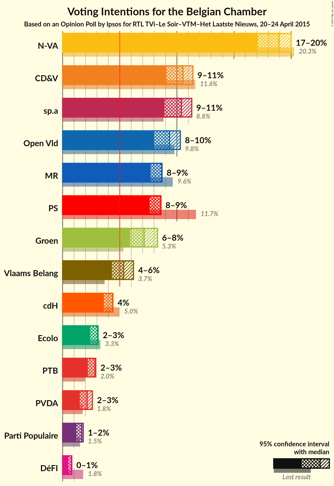
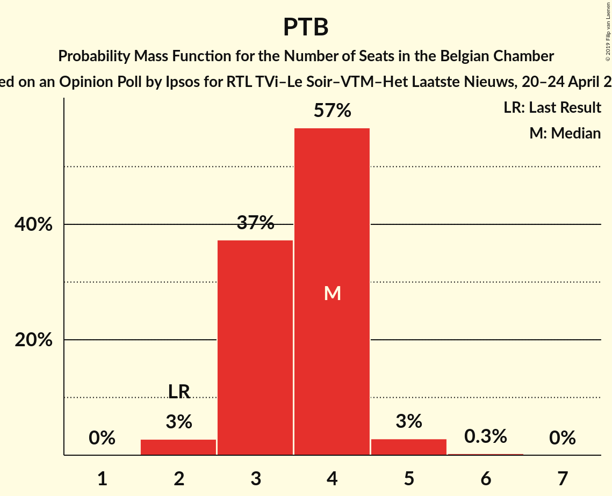
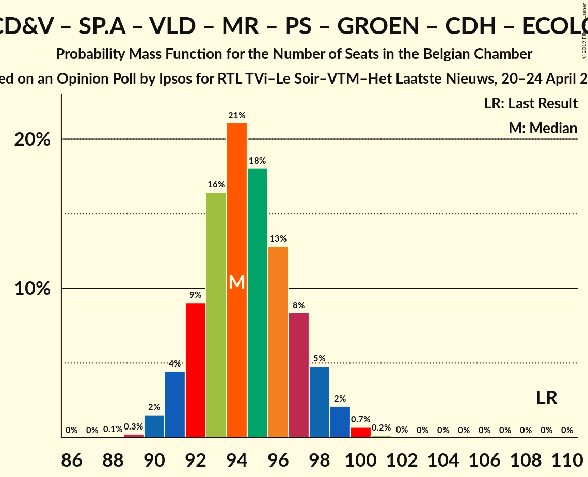
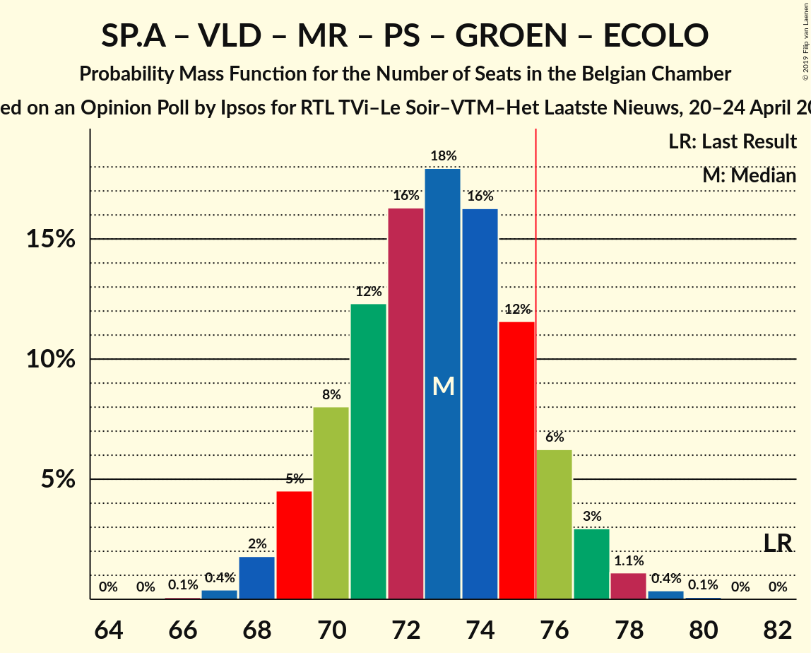
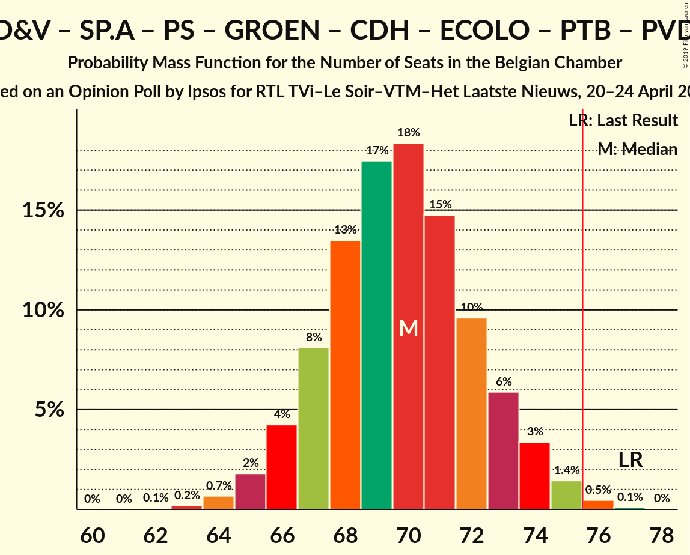
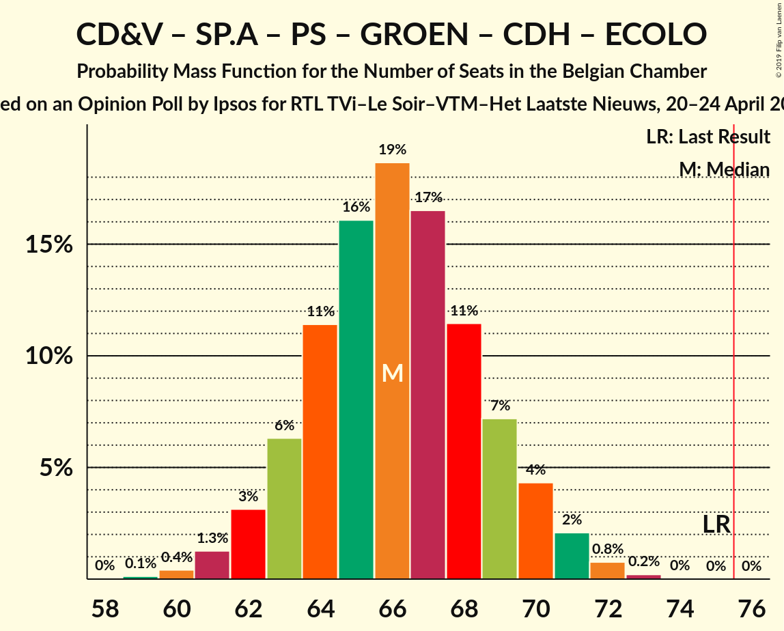
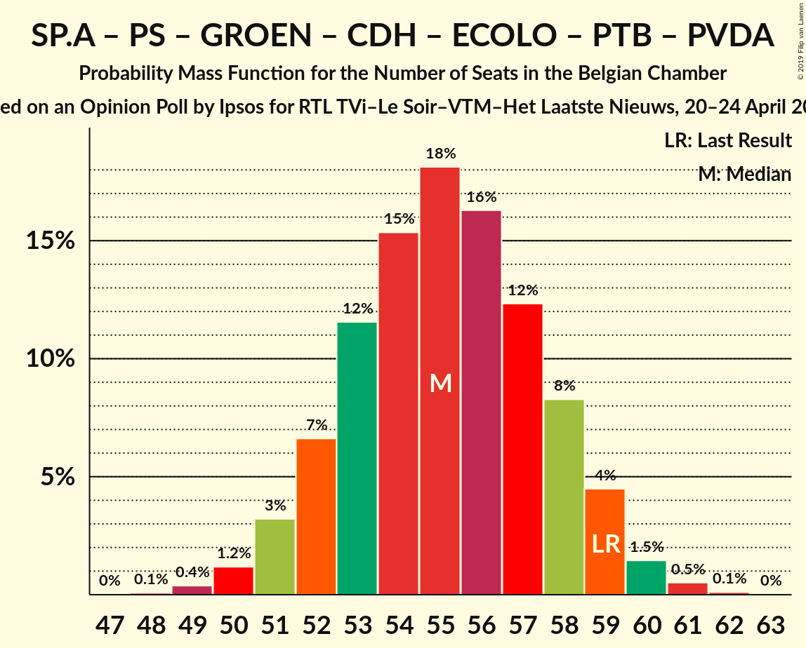
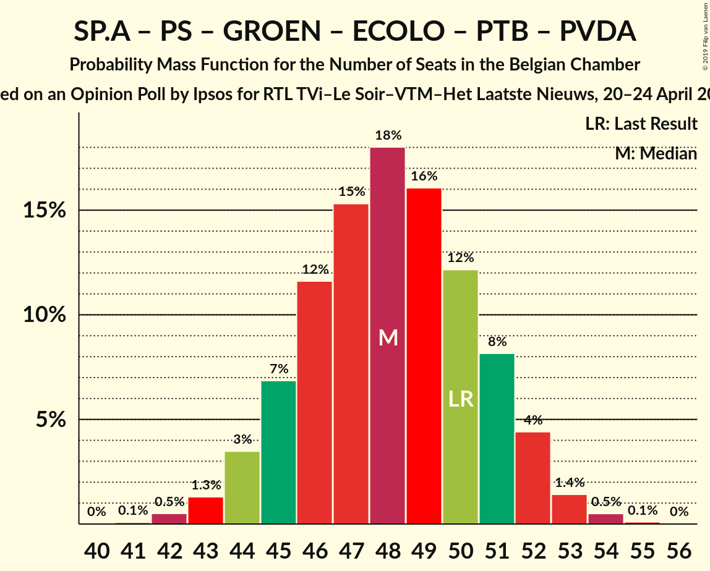

# Opinion Poll by Ipsos for RTL TVi–Le Soir–VTM–Het Laatste Nieuws, 20–24 April 2015

Areas included: Flanders, Wallonia

<a href="#voting-intentions">Voting Intentions</a> | <a href="#seats">Seats</a> | <a href="#coalitions">Coalitions</a> | <a href="#technical-information">Technical Information</a>

## Voting Intentions

### Confidence Intervals

| Party | Last Result | Poll Result | 80% Confidence Interval | 90% Confidence Interval | 95% Confidence Interval | 99% Confidence Interval |
|:-----:|:-----------:|:-----------:|:-----------------------:|:-----------------------:|:-----------------------:|:-----------------------:|
| N-VA | 20.3% | 18.9% | 17.7–19.8% |17.4–19.9% |17.1–20.0% |16.5–20.1% |
| CD&V | 11.6% | 10.5% | 9.5–11.2% |9.3–11.4% |9.1–11.4% |8.7–11.5% |
| sp.a | 8.8% | 10.4% | 9.4–11.1% |9.2–11.2% |8.9–11.3% |8.5–11.4% |
| Open Vld | 9.8% | 9.4% | 8.5–10.1% |8.2–10.2% |8.0–10.3% |7.6–10.3% |
| MR | 9.6% | 8.7% | 7.9–8.6% |7.8–8.7% |7.7–8.7% |7.4–8.7% |
| PS | 11.7% | 8.6% | 7.9–8.6% |7.7–8.6% |7.6–8.6% |7.3–8.6% |
| Groen | 5.3% | 7.1% | 6.3–8.0% |6.1–8.2% |5.9–8.3% |5.6–8.5% |
| Vlaams Belang | 3.7% | 5.3% | 4.6–6.0% |4.4–6.1% |4.3–6.2% |4.0–6.3% |
| cdH | 5.0% | 4.4% | 3.8–4.3% |3.7–4.4% |3.6–4.4% |3.4–4.4% |
| Ecolo | 3.3% | 3.0% | 2.6–3.1% |2.5–3.1% |2.4–3.1% |2.3–3.1% |
| PTB | 2.0% | 2.8% | 2.4–2.9% |2.3–2.9% |2.2–2.9% |2.1–2.9% |
| PVDA | 1.8% | 2.1% | 1.7–2.5% |1.6–2.6% |1.5–2.6% |1.3–2.7% |
| Parti Populaire | 1.5% | 1.7% | 1.4–1.7% |1.3–1.8% |1.2–1.8% |1.1–1.8% |
| DéFI | 1.8% | 0.8% | 0.5–0.8% |0.5–0.8% |0.5–0.8% |0.4–0.8% |

*Note:* The poll result column reflects the actual value used in the calculations. Published results may vary slightly, and in addition be rounded to fewer digits.

## Seats

### Confidence Intervals

| Party | Last Result | Median | 80% Confidence Interval | 90% Confidence Interval | 95% Confidence Interval | 99% Confidence Interval |
|:-----:|:-----------:|:------:|:-----------------------:|:-----------------------:|:-----------------------:|:-----------------------:|
| <a href="#n-va">N-VA</a> | 33 | 29 | 26–31 |26–31 |25–32 |24–33 |
| <a href="#cd&v">CD&V</a> | 18 | 14 | 13–17 |13–18 |13–18 |13–18 |
| <a href="#sp.a">sp.a</a> | 13 | 14 | 13–17 |13–17 |13–17 |12–18 |
| <a href="#open-vld">Open Vld</a> | 14 | 13 | 11–14 |11–15 |11–16 |11–17 |
| <a href="#mr">MR</a> | 20 | 15 | 14–17 |14–18 |14–18 |14–19 |
| <a href="#ps">PS</a> | 23 | 16 | 15–17 |15–18 |15–18 |14–18 |
| <a href="#groen">Groen</a> | 6 | 10 | 8–12 |7–12 |7–12 |6–12 |
| <a href="#vlaams-belang">Vlaams Belang</a> | 3 | 7 | 6–8 |5–8 |5–8 |3–8 |
| <a href="#cdh">cdH</a> | 9 | 7 | 7 |7–8 |6–8 |5–10 |
| <a href="#ecolo">Ecolo</a> | 6 | 4 | 3–5 |2–5 |2–6 |2–6 |
| <a href="#ptb">PTB</a> | 2 | 4 | 3–4 |3–4 |2–5 |2–5 |
| <a href="#pvda">PVDA</a> | 0 | 0 | 0 |0 |0 |0 |
| <a href="#parti-populaire">Parti Populaire</a> | 1 | 2 | 0–2 |0–2 |0–2 |0–2 |
| <a href="#défi">DéFI</a> | 2 | 0 | 0 |0 |0 |0 |

### N-VA

*For a full overview of the results for this party, see the [N-VA](party-n-va.html) page.*

| Number of Seats | Probability | Accumulated | Special Marks |
|:---------------:|:-----------:|:-----------:|:-------------:|
| 23 | 0.1% | 100% |  |
| 24 | 0.9% | 99.9% |  |
| 25 | 2% | 99.0% |  |
| 26 | 11% | 97% |  |
| 27 | 15% | 87% |  |
| 28 | 16% | 72% |  |
| 29 | 26% | 56% | Median |
| 30 | 14% | 30% |  |
| 31 | 12% | 16% |  |
| 32 | 3% | 4% |  |
| 33 | 0.5% | 0.7% | Last Result |
| 34 | 0.2% | 0.2% |  |
| 35 | 0% | 0% |  |

### CD&V

*For a full overview of the results for this party, see the [CD&V](party-cdv.html) page.*

| Number of Seats | Probability | Accumulated | Special Marks |
|:---------------:|:-----------:|:-----------:|:-------------:|
| 11 | 0.1% | 100% |  |
| 12 | 0.3% | 99.9% |  |
| 13 | 37% | 99.6% |  |
| 14 | 18% | 62% | Median |
| 15 | 16% | 45% |  |
| 16 | 12% | 29% |  |
| 17 | 8% | 17% |  |
| 18 | 9% | 9% | Last Result |
| 19 | 0.2% | 0.2% |  |
| 20 | 0% | 0% |  |

### sp.a

*For a full overview of the results for this party, see the [sp.a](party-spa.html) page.*

| Number of Seats | Probability | Accumulated | Special Marks |
|:---------------:|:-----------:|:-----------:|:-------------:|
| 10 | 0.1% | 100% |  |
| 11 | 0.2% | 99.9% |  |
| 12 | 0.7% | 99.7% |  |
| 13 | 32% | 99.0% | Last Result |
| 14 | 18% | 67% | Median |
| 15 | 24% | 49% |  |
| 16 | 14% | 25% |  |
| 17 | 9% | 11% |  |
| 18 | 2% | 2% |  |
| 19 | 0.2% | 0.2% |  |
| 20 | 0% | 0% |  |

### Open Vld

*For a full overview of the results for this party, see the [Open Vld](party-openvld.html) page.*

| Number of Seats | Probability | Accumulated | Special Marks |
|:---------------:|:-----------:|:-----------:|:-------------:|
| 10 | 0.2% | 100% |  |
| 11 | 10% | 99.8% |  |
| 12 | 30% | 90% |  |
| 13 | 46% | 60% | Median |
| 14 | 6% | 13% | Last Result |
| 15 | 3% | 7% |  |
| 16 | 2% | 4% |  |
| 17 | 2% | 2% |  |
| 18 | 0.4% | 0.4% |  |
| 19 | 0% | 0% |  |

### MR

*For a full overview of the results for this party, see the [MR](party-mr.html) page.*

| Number of Seats | Probability | Accumulated | Special Marks |
|:---------------:|:-----------:|:-----------:|:-------------:|
| 13 | 0.3% | 100% |  |
| 14 | 15% | 99.7% |  |
| 15 | 35% | 85% | Median |
| 16 | 32% | 50% |  |
| 17 | 12% | 18% |  |
| 18 | 5% | 5% |  |
| 19 | 0.8% | 0.9% |  |
| 20 | 0.1% | 0.1% | Last Result |
| 21 | 0% | 0% |  |

### PS

*For a full overview of the results for this party, see the [PS](party-ps.html) page.*

| Number of Seats | Probability | Accumulated | Special Marks |
|:---------------:|:-----------:|:-----------:|:-------------:|
| 13 | 0.4% | 100% |  |
| 14 | 2% | 99.6% |  |
| 15 | 17% | 98% |  |
| 16 | 56% | 81% | Median |
| 17 | 18% | 25% |  |
| 18 | 7% | 7% |  |
| 19 | 0.1% | 0.1% |  |
| 20 | 0% | 0% |  |
| 21 | 0% | 0% |  |
| 22 | 0% | 0% |  |
| 23 | 0% | 0% | Last Result |

### Groen

*For a full overview of the results for this party, see the [Groen](party-groen.html) page.*

| Number of Seats | Probability | Accumulated | Special Marks |
|:---------------:|:-----------:|:-----------:|:-------------:|
| 6 | 2% | 100% | Last Result |
| 7 | 4% | 98% |  |
| 8 | 18% | 94% |  |
| 9 | 23% | 76% |  |
| 10 | 29% | 53% | Median |
| 11 | 11% | 24% |  |
| 12 | 13% | 13% |  |
| 13 | 0% | 0% |  |

### Vlaams Belang

*For a full overview of the results for this party, see the [Vlaams Belang](party-vlaamsbelang.html) page.*

| Number of Seats | Probability | Accumulated | Special Marks |
|:---------------:|:-----------:|:-----------:|:-------------:|
| 2 | 0.1% | 100% |  |
| 3 | 0.4% | 99.9% | Last Result |
| 4 | 0.4% | 99.5% |  |
| 5 | 9% | 99.0% |  |
| 6 | 19% | 90% |  |
| 7 | 40% | 71% | Median |
| 8 | 31% | 31% |  |
| 9 | 0% | 0.1% |  |
| 10 | 0% | 0% |  |

### cdH

*For a full overview of the results for this party, see the [cdH](party-cdh.html) page.*

| Number of Seats | Probability | Accumulated | Special Marks |
|:---------------:|:-----------:|:-----------:|:-------------:|
| 4 | 0.3% | 100% |  |
| 5 | 0.9% | 99.7% |  |
| 6 | 2% | 98.8% |  |
| 7 | 90% | 97% | Median |
| 8 | 6% | 7% |  |
| 9 | 0.8% | 1.3% | Last Result |
| 10 | 0.5% | 0.5% |  |
| 11 | 0.1% | 0.1% |  |
| 12 | 0% | 0% |  |

### Ecolo

*For a full overview of the results for this party, see the [Ecolo](party-ecolo.html) page.*

| Number of Seats | Probability | Accumulated | Special Marks |
|:---------------:|:-----------:|:-----------:|:-------------:|
| 1 | 0.2% | 100% |  |
| 2 | 7% | 99.8% |  |
| 3 | 10% | 93% |  |
| 4 | 34% | 83% | Median |
| 5 | 44% | 48% |  |
| 6 | 4% | 4% | Last Result |
| 7 | 0% | 0% |  |

### PTB

*For a full overview of the results for this party, see the [PTB](party-ptb.html) page.*

| Number of Seats | Probability | Accumulated | Special Marks |
|:---------------:|:-----------:|:-----------:|:-------------:|
| 2 | 3% | 100% | Last Result |
| 3 | 37% | 97% |  |
| 4 | 57% | 60% | Median |
| 5 | 3% | 3% |  |
| 6 | 0.3% | 0.3% |  |
| 7 | 0% | 0% |  |

### PVDA

*For a full overview of the results for this party, see the [PVDA](party-pvda.html) page.*

| Number of Seats | Probability | Accumulated | Special Marks |
|:---------------:|:-----------:|:-----------:|:-------------:|
| 0 | 100% | 100% | Last Result, Median |

### Parti Populaire

*For a full overview of the results for this party, see the [Parti Populaire](party-partipopulaire.html) page.*

| Number of Seats | Probability | Accumulated | Special Marks |
|:---------------:|:-----------:|:-----------:|:-------------:|
| 0 | 18% | 100% |  |
| 1 | 26% | 82% | Last Result |
| 2 | 56% | 56% | Median |
| 3 | 0% | 0% |  |

### DéFI

*For a full overview of the results for this party, see the [DéFI](party-défi.html) page.*

| Number of Seats | Probability | Accumulated | Special Marks |
|:---------------:|:-----------:|:-----------:|:-------------:|
| 0 | 100% | 100% | Median |
| 1 | 0% | 0% |  |
| 2 | 0% | 0% | Last Result |

## Coalitions

### Confidence Intervals

| Coalition | Last Result | Median | Majority? | 80% Confidence Interval | 90% Confidence Interval | 95% Confidence Interval | 99% Confidence Interval |
|:---------:|:-----------:|:------:|:---------:|:-----------------------:|:-----------------------:|:-----------------------:|:-----------------------:|
| CD&V – sp.a – Open Vld – MR – PS – Groen – cdH – Ecolo | 109 | 94 | 100% | 92–97 | 91–98 | 91–99 | 90–100 |
| CD&V – sp.a – Open Vld – MR – PS – cdH | 97 | 81 | 99.5% | 78–84 | 77–85 | 77–85 | 76–87 |
| N-VA – CD&V – Open Vld – MR – cdH | 94 | 79 | 91% | 76–82 | 75–82 | 74–83 | 73–85 |
| sp.a – Open Vld – MR – PS – Groen – Ecolo | 82 | 73 | 11% | 70–76 | 69–76 | 69–77 | 68–78 |
| N-VA – CD&V – Open Vld – MR | 85 | 71 | 4% | 69–75 | 68–75 | 67–76 | 66–77 |
| CD&V – sp.a – PS – Groen – cdH – Ecolo – PTB – PVDA | 77 | 70 | 0.6% | 67–73 | 66–74 | 65–74 | 64–76 |
| CD&V – sp.a – PS – Groen – cdH – Ecolo | 75 | 66 | 0% | 63–69 | 63–70 | 62–71 | 60–72 |
| CD&V – Open Vld – MR – PS – cdH | 84 | 66 | 0% | 63–69 | 63–70 | 62–71 | 61–72 |
| CD&V – Open Vld – MR – Groen – cdH – Ecolo | 73 | 64 | 0% | 61–66 | 60–67 | 60–68 | 59–69 |
| sp.a – Open Vld – MR – PS | 70 | 59 | 0% | 56–62 | 56–62 | 55–63 | 54–65 |
| sp.a – PS – Groen – cdH – Ecolo – PTB – PVDA | 59 | 55 | 0% | 52–58 | 52–59 | 51–59 | 50–61 |
| CD&V – sp.a – PS – cdH | 63 | 52 | 0% | 50–55 | 49–56 | 49–57 | 48–58 |
| CD&V – Open Vld – MR – cdH | 61 | 50 | 0% | 47–53 | 47–54 | 46–54 | 45–56 |
| sp.a – PS – Groen – Ecolo – PTB – PVDA | 50 | 48 | 0% | 45–51 | 44–52 | 44–52 | 42–54 |

### CD&V – sp.a – Open Vld – MR – PS – Groen – cdH – Ecolo

| Number of Seats | Probability | Accumulated | Special Marks |
|:---------------:|:-----------:|:-----------:|:-------------:|
| 88 | 0.1% | 100% |  |
| 89 | 0.3% | 99.9% |  |
| 90 | 2% | 99.7% |  |
| 91 | 4% | 98% |  |
| 92 | 9% | 94% |  |
| 93 | 16% | 85% | Median |
| 94 | 21% | 68% |  |
| 95 | 18% | 47% |  |
| 96 | 13% | 29% |  |
| 97 | 8% | 16% |  |
| 98 | 5% | 8% |  |
| 99 | 2% | 3% |  |
| 100 | 0.7% | 0.9% |  |
| 101 | 0.2% | 0.2% |  |
| 102 | 0% | 0% |  |
| 103 | 0% | 0% |  |
| 104 | 0% | 0% |  |
| 105 | 0% | 0% |  |
| 106 | 0% | 0% |  |
| 107 | 0% | 0% |  |
| 108 | 0% | 0% |  |
| 109 | 0% | 0% | Last Result |

### CD&V – sp.a – Open Vld – MR – PS – cdH

| Number of Seats | Probability | Accumulated | Special Marks |
|:---------------:|:-----------:|:-----------:|:-------------:|
| 74 | 0.1% | 100% |  |
| 75 | 0.4% | 99.9% |  |
| 76 | 2% | 99.5% | Majority |
| 77 | 5% | 98% |  |
| 78 | 9% | 93% |  |
| 79 | 15% | 83% | Median |
| 80 | 18% | 69% |  |
| 81 | 18% | 50% |  |
| 82 | 13% | 32% |  |
| 83 | 9% | 19% |  |
| 84 | 5% | 11% |  |
| 85 | 3% | 5% |  |
| 86 | 2% | 2% |  |
| 87 | 0.6% | 0.9% |  |
| 88 | 0.2% | 0.3% |  |
| 89 | 0.1% | 0.1% |  |
| 90 | 0% | 0% |  |
| 91 | 0% | 0% |  |
| 92 | 0% | 0% |  |
| 93 | 0% | 0% |  |
| 94 | 0% | 0% |  |
| 95 | 0% | 0% |  |
| 96 | 0% | 0% |  |
| 97 | 0% | 0% | Last Result |

### N-VA – CD&V – Open Vld – MR – cdH

| Number of Seats | Probability | Accumulated | Special Marks |
|:---------------:|:-----------:|:-----------:|:-------------:|
| 72 | 0.1% | 100% |  |
| 73 | 0.7% | 99.9% |  |
| 74 | 2% | 99.2% |  |
| 75 | 5% | 97% |  |
| 76 | 9% | 91% | Majority |
| 77 | 14% | 82% |  |
| 78 | 17% | 68% | Median |
| 79 | 17% | 51% |  |
| 80 | 13% | 34% |  |
| 81 | 10% | 21% |  |
| 82 | 6% | 11% |  |
| 83 | 3% | 5% |  |
| 84 | 1.2% | 2% |  |
| 85 | 0.4% | 0.6% |  |
| 86 | 0.1% | 0.1% |  |
| 87 | 0% | 0% |  |
| 88 | 0% | 0% |  |
| 89 | 0% | 0% |  |
| 90 | 0% | 0% |  |
| 91 | 0% | 0% |  |
| 92 | 0% | 0% |  |
| 93 | 0% | 0% |  |
| 94 | 0% | 0% | Last Result |

### sp.a – Open Vld – MR – PS – Groen – Ecolo

| Number of Seats | Probability | Accumulated | Special Marks |
|:---------------:|:-----------:|:-----------:|:-------------:|
| 66 | 0.1% | 100% |  |
| 67 | 0.4% | 99.9% |  |
| 68 | 2% | 99.5% |  |
| 69 | 5% | 98% |  |
| 70 | 8% | 93% |  |
| 71 | 12% | 85% |  |
| 72 | 16% | 73% | Median |
| 73 | 18% | 57% |  |
| 74 | 16% | 39% |  |
| 75 | 12% | 22% |  |
| 76 | 6% | 11% | Majority |
| 77 | 3% | 5% |  |
| 78 | 1.1% | 2% |  |
| 79 | 0.4% | 0.5% |  |
| 80 | 0.1% | 0.1% |  |
| 81 | 0% | 0% |  |
| 82 | 0% | 0% | Last Result |

### N-VA – CD&V – Open Vld – MR

| Number of Seats | Probability | Accumulated | Special Marks |
|:---------------:|:-----------:|:-----------:|:-------------:|
| 65 | 0.1% | 100% |  |
| 66 | 0.7% | 99.9% |  |
| 67 | 3% | 99.2% |  |
| 68 | 5% | 97% |  |
| 69 | 9% | 91% |  |
| 70 | 14% | 82% |  |
| 71 | 18% | 67% | Median |
| 72 | 17% | 50% |  |
| 73 | 13% | 33% |  |
| 74 | 10% | 20% |  |
| 75 | 6% | 10% |  |
| 76 | 3% | 4% | Majority |
| 77 | 1.1% | 2% |  |
| 78 | 0.3% | 0.5% |  |
| 79 | 0.1% | 0.1% |  |
| 80 | 0% | 0% |  |
| 81 | 0% | 0% |  |
| 82 | 0% | 0% |  |
| 83 | 0% | 0% |  |
| 84 | 0% | 0% |  |
| 85 | 0% | 0% | Last Result |

### CD&V – sp.a – PS – Groen – cdH – Ecolo – PTB – PVDA

| Number of Seats | Probability | Accumulated | Special Marks |
|:---------------:|:-----------:|:-----------:|:-------------:|
| 62 | 0.1% | 100% |  |
| 63 | 0.2% | 99.9% |  |
| 64 | 0.7% | 99.7% |  |
| 65 | 2% | 99.1% |  |
| 66 | 4% | 97% |  |
| 67 | 8% | 93% |  |
| 68 | 13% | 85% |  |
| 69 | 17% | 71% | Median |
| 70 | 18% | 54% |  |
| 71 | 15% | 36% |  |
| 72 | 10% | 21% |  |
| 73 | 6% | 11% |  |
| 74 | 3% | 5% |  |
| 75 | 1.4% | 2% |  |
| 76 | 0.5% | 0.6% | Majority |
| 77 | 0.1% | 0.1% | Last Result |
| 78 | 0% | 0% |  |

### CD&V – sp.a – PS – Groen – cdH – Ecolo

| Number of Seats | Probability | Accumulated | Special Marks |
|:---------------:|:-----------:|:-----------:|:-------------:|
| 59 | 0.1% | 100% |  |
| 60 | 0.4% | 99.8% |  |
| 61 | 1.3% | 99.4% |  |
| 62 | 3% | 98% |  |
| 63 | 6% | 95% |  |
| 64 | 11% | 89% |  |
| 65 | 16% | 77% | Median |
| 66 | 19% | 61% |  |
| 67 | 17% | 43% |  |
| 68 | 11% | 26% |  |
| 69 | 7% | 15% |  |
| 70 | 4% | 7% |  |
| 71 | 2% | 3% |  |
| 72 | 0.8% | 1.0% |  |
| 73 | 0.2% | 0.3% |  |
| 74 | 0% | 0.1% |  |
| 75 | 0% | 0% | Last Result |

### CD&V – Open Vld – MR – PS – cdH

| Number of Seats | Probability | Accumulated | Special Marks |
|:---------------:|:-----------:|:-----------:|:-------------:|
| 61 | 0.6% | 100% |  |
| 62 | 3% | 99.4% |  |
| 63 | 8% | 96% |  |
| 64 | 14% | 88% |  |
| 65 | 16% | 74% | Median |
| 66 | 16% | 58% |  |
| 67 | 15% | 41% |  |
| 68 | 12% | 26% |  |
| 69 | 8% | 15% |  |
| 70 | 4% | 7% |  |
| 71 | 2% | 3% |  |
| 72 | 0.7% | 1.1% |  |
| 73 | 0.3% | 0.4% |  |
| 74 | 0.1% | 0.1% |  |
| 75 | 0% | 0% |  |
| 76 | 0% | 0% | Majority |
| 77 | 0% | 0% |  |
| 78 | 0% | 0% |  |
| 79 | 0% | 0% |  |
| 80 | 0% | 0% |  |
| 81 | 0% | 0% |  |
| 82 | 0% | 0% |  |
| 83 | 0% | 0% |  |
| 84 | 0% | 0% | Last Result |

### CD&V – Open Vld – MR – Groen – cdH – Ecolo

| Number of Seats | Probability | Accumulated | Special Marks |
|:---------------:|:-----------:|:-----------:|:-------------:|
| 57 | 0% | 100% |  |
| 58 | 0.4% | 99.9% |  |
| 59 | 1.5% | 99.6% |  |
| 60 | 5% | 98% |  |
| 61 | 8% | 93% |  |
| 62 | 12% | 85% |  |
| 63 | 15% | 73% | Median |
| 64 | 18% | 58% |  |
| 65 | 19% | 40% |  |
| 66 | 11% | 21% |  |
| 67 | 6% | 10% |  |
| 68 | 3% | 4% |  |
| 69 | 1.1% | 2% |  |
| 70 | 0.4% | 0.5% |  |
| 71 | 0.1% | 0.1% |  |
| 72 | 0% | 0% |  |
| 73 | 0% | 0% | Last Result |

### sp.a – Open Vld – MR – PS

| Number of Seats | Probability | Accumulated | Special Marks |
|:---------------:|:-----------:|:-----------:|:-------------:|
| 53 | 0.1% | 100% |  |
| 54 | 0.7% | 99.9% |  |
| 55 | 3% | 99.2% |  |
| 56 | 8% | 96% |  |
| 57 | 14% | 88% |  |
| 58 | 17% | 75% | Median |
| 59 | 18% | 57% |  |
| 60 | 16% | 40% |  |
| 61 | 12% | 24% |  |
| 62 | 7% | 12% |  |
| 63 | 3% | 5% |  |
| 64 | 1.2% | 2% |  |
| 65 | 0.5% | 0.7% |  |
| 66 | 0.2% | 0.2% |  |
| 67 | 0.1% | 0.1% |  |
| 68 | 0% | 0% |  |
| 69 | 0% | 0% |  |
| 70 | 0% | 0% | Last Result |

### sp.a – PS – Groen – cdH – Ecolo – PTB – PVDA

| Number of Seats | Probability | Accumulated | Special Marks |
|:---------------:|:-----------:|:-----------:|:-------------:|
| 48 | 0.1% | 100% |  |
| 49 | 0.4% | 99.9% |  |
| 50 | 1.2% | 99.5% |  |
| 51 | 3% | 98% |  |
| 52 | 7% | 95% |  |
| 53 | 12% | 89% |  |
| 54 | 15% | 77% |  |
| 55 | 18% | 62% | Median |
| 56 | 16% | 43% |  |
| 57 | 12% | 27% |  |
| 58 | 8% | 15% |  |
| 59 | 4% | 7% | Last Result |
| 60 | 1.5% | 2% |  |
| 61 | 0.5% | 0.6% |  |
| 62 | 0.1% | 0.1% |  |
| 63 | 0% | 0% |  |

### CD&V – sp.a – PS – cdH

| Number of Seats | Probability | Accumulated | Special Marks |
|:---------------:|:-----------:|:-----------:|:-------------:|
| 46 | 0.1% | 100% |  |
| 47 | 0.3% | 99.9% |  |
| 48 | 1.2% | 99.7% |  |
| 49 | 5% | 98% |  |
| 50 | 12% | 94% |  |
| 51 | 19% | 81% | Median |
| 52 | 20% | 63% |  |
| 53 | 17% | 42% |  |
| 54 | 12% | 26% |  |
| 55 | 7% | 14% |  |
| 56 | 4% | 7% |  |
| 57 | 2% | 3% |  |
| 58 | 0.9% | 1.3% |  |
| 59 | 0.3% | 0.4% |  |
| 60 | 0.1% | 0.1% |  |
| 61 | 0% | 0% |  |
| 62 | 0% | 0% |  |
| 63 | 0% | 0% | Last Result |

### CD&V – Open Vld – MR – cdH

| Number of Seats | Probability | Accumulated | Special Marks |
|:---------------:|:-----------:|:-----------:|:-------------:|
| 45 | 0.6% | 100% |  |
| 46 | 3% | 99.4% |  |
| 47 | 9% | 96% |  |
| 48 | 15% | 87% |  |
| 49 | 17% | 73% | Median |
| 50 | 16% | 56% |  |
| 51 | 15% | 40% |  |
| 52 | 12% | 25% |  |
| 53 | 7% | 13% |  |
| 54 | 4% | 6% |  |
| 55 | 2% | 2% |  |
| 56 | 0.6% | 0.9% |  |
| 57 | 0.2% | 0.3% |  |
| 58 | 0.1% | 0.1% |  |
| 59 | 0% | 0% |  |
| 60 | 0% | 0% |  |
| 61 | 0% | 0% | Last Result |

### sp.a – PS – Groen – Ecolo – PTB – PVDA

| Number of Seats | Probability | Accumulated | Special Marks |
|:---------------:|:-----------:|:-----------:|:-------------:|
| 41 | 0.1% | 100% |  |
| 42 | 0.5% | 99.9% |  |
| 43 | 1.3% | 99.4% |  |
| 44 | 3% | 98% |  |
| 45 | 7% | 95% |  |
| 46 | 12% | 88% |  |
| 47 | 15% | 76% |  |
| 48 | 18% | 61% | Median |
| 49 | 16% | 43% |  |
| 50 | 12% | 27% | Last Result |
| 51 | 8% | 15% |  |
| 52 | 4% | 6% |  |
| 53 | 1.4% | 2% |  |
| 54 | 0.5% | 0.6% |  |
| 55 | 0.1% | 0.1% |  |
| 56 | 0% | 0% |  |

## Technical Information

### Opinion Poll

+ **Polling firm:** Ipsos
+ **Commissioner(s):** RTL TVi–Le Soir–VTM–Het Laatste Nieuws
+ **Fieldwork period:** 20–24 April 2015

### Calculations

+ **Sample size:** 1443
+ **Simulations done:** 2,097,152
+ **Error estimate:** 1.11%

