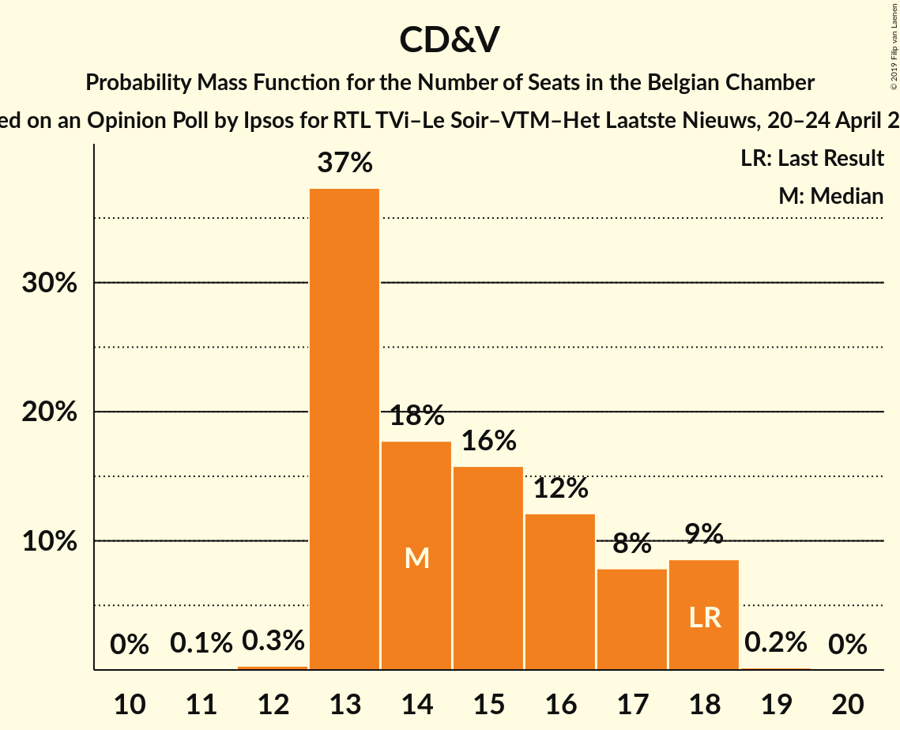
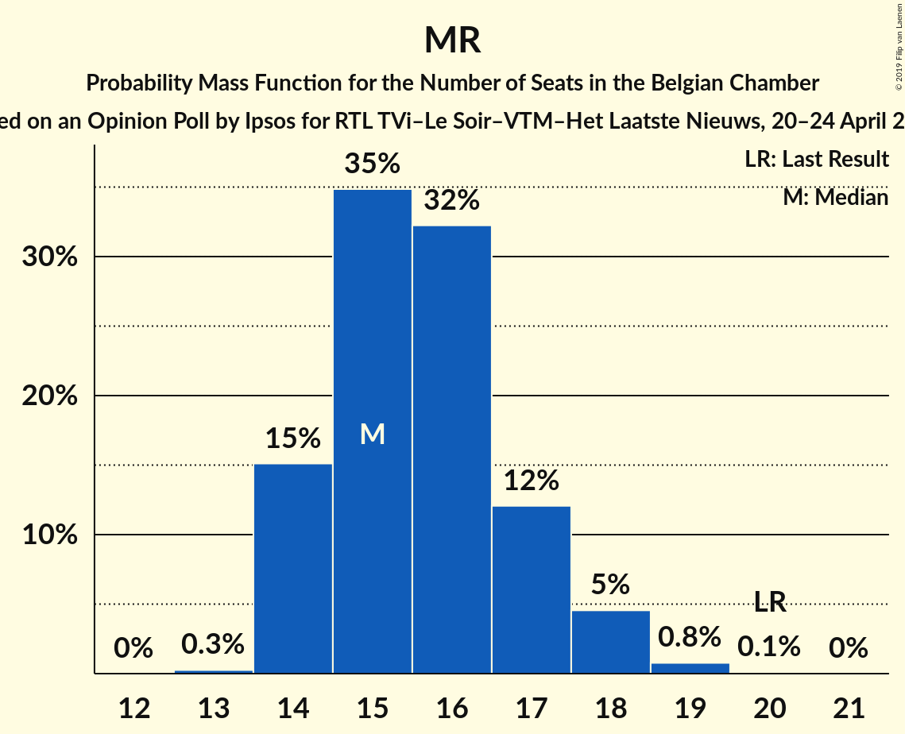
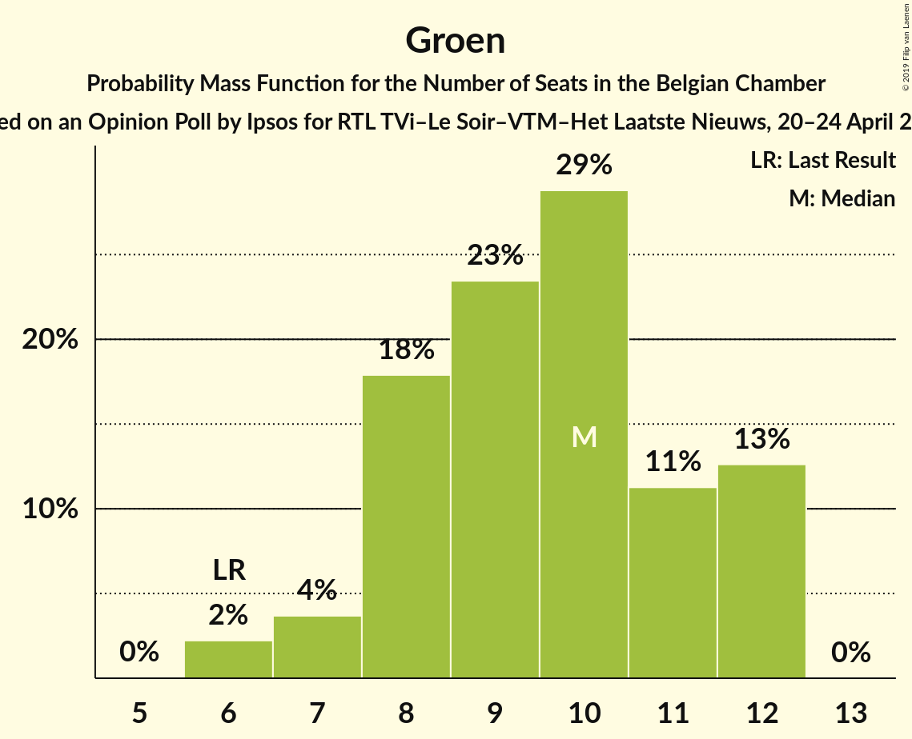
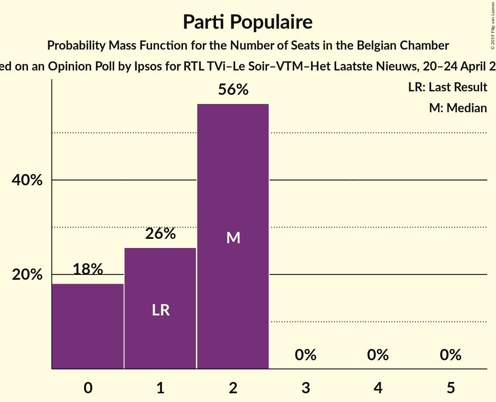
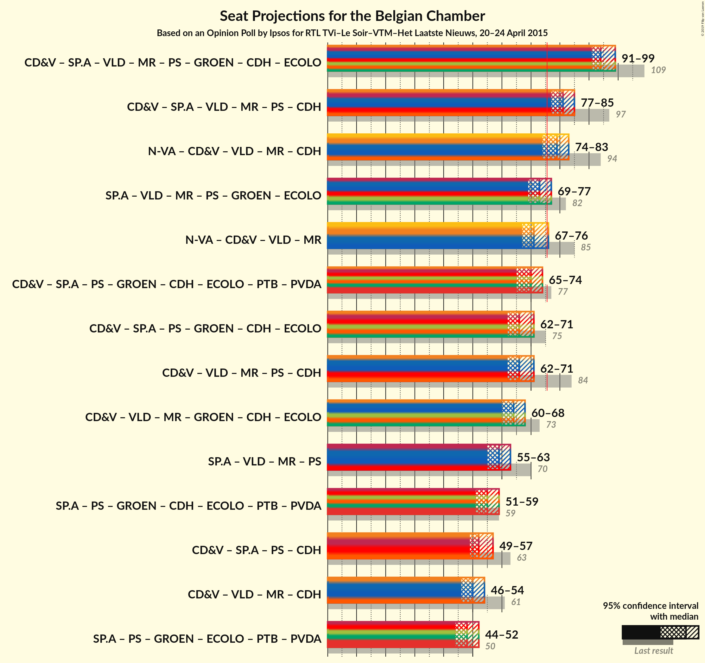

# Opinion Poll by Ipsos for RTL TVi–Le Soir–VTM–Het Laatste Nieuws, 20–24 April 2015

Areas included: Flanders, Wallonia

<a href="#voting-intentions">Voting Intentions</a> | <a href="#seats">Seats</a> | <a href="#coalitions">Coalitions</a> | <a href="#technical-information">Technical Information</a>

## Voting Intentions

### Confidence Intervals

| Party | Last Result | Poll Result | 80% Confidence Interval | 90% Confidence Interval | 95% Confidence Interval | 99% Confidence Interval |
|:-----:|:-----------:|:-----------:|:-----------------------:|:-----------------------:|:-----------------------:|:-----------------------:|
| N-VA | 20.3% | 18.9% | 26.5–30.3% |26.0–30.8% |25.6–31.3% |24.7–32.2% |
| CD&V | 11.6% | 10.5% | 14.4–17.4% |14.0–17.8% |13.6–18.2% |13.0–19.0% |
| sp.a | 8.8% | 10.4% | 14.2–17.2% |13.8–17.6% |13.4–18.0% |12.8–18.8% |
| Open Vld | 9.8% | 9.4% | 12.7–15.5% |12.3–16.0% |12.0–16.4% |11.3–17.1% |
| MR | 9.6% | 8.7% | 24.3–27.9% |23.8–28.5% |23.4–28.9% |22.5–29.9% |
| PS | 11.7% | 8.6% | 24.1–27.7% |23.6–28.3% |23.2–28.7% |22.3–29.6% |
| Groen | 5.3% | 7.1% | 9.5–12.1% |9.2–12.5% |8.9–12.8% |8.4–13.5% |
| Vlaams Belang | 3.7% | 5.3% | 7.0–9.2% |6.7–9.6% |6.5–9.9% |6.0–10.5% |
| cdH | 5.0% | 4.4% | 11.8–14.6% |11.5–15.1% |11.1–15.4% |10.5–16.2% |
| Ecolo | 3.3% | 3.0% | 8.0–10.4% |7.7–10.8% |7.5–11.1% |7.0–11.8% |
| PTB | 2.0% | 2.8% | 7.4–9.8% |7.2–10.1% |6.9–10.4% |6.4–11.1% |
| PVDA | 1.8% | 2.1% | 2.6–4.1% |2.4–4.3% |2.3–4.5% |2.0–5.0% |
| Parti Populaire | 1.5% | 1.7% | 4.2–6.1% |4.0–6.4% |3.8–6.6% |3.5–7.2% |
| DéFI | 1.8% | 0.8% | 1.7–2.9% |1.6–3.2% |1.5–3.3% |1.2–3.7% |

*Note:* The poll result column reflects the actual value used in the calculations. Published results may vary slightly, and in addition be rounded to fewer digits.

## Seats

### Confidence Intervals

| Party | Last Result | Median | 80% Confidence Interval | 90% Confidence Interval | 95% Confidence Interval | 99% Confidence Interval |
|:-----:|:-----------:|:------:|:-----------------------:|:-----------------------:|:-----------------------:|:-----------------------:|
| <a href="#n-va">N-VA</a> | 33 | 29 | 26–31 |26–31 |25–32 |24–33 |
| <a href="#cd&v">CD&V</a> | 18 | 14 | 13–17 |13–18 |13–18 |13–18 |
| <a href="#sp.a">sp.a</a> | 13 | 14 | 13–17 |13–17 |13–17 |12–18 |
| <a href="#open-vld">Open Vld</a> | 14 | 13 | 11–14 |11–15 |11–16 |11–17 |
| <a href="#mr">MR</a> | 20 | 16 | 14–17 |14–18 |14–18 |14–19 |
| <a href="#ps">PS</a> | 23 | 16 | 15–17 |15–18 |14–18 |13–18 |
| <a href="#groen">Groen</a> | 6 | 10 | 8–12 |7–12 |7–12 |6–12 |
| <a href="#vlaams-belang">Vlaams Belang</a> | 3 | 7 | 5–8 |5–8 |5–8 |3–8 |
| <a href="#cdh">cdH</a> | 9 | 7 | 7 |7–8 |6–8 |5–9 |
| <a href="#ecolo">Ecolo</a> | 6 | 4 | 3–5 |2–5 |2–6 |2–6 |
| <a href="#ptb">PTB</a> | 2 | 4 | 3–4 |3–4 |3–5 |2–5 |
| <a href="#pvda">PVDA</a> | 0 | 0 | 0 |0 |0 |0 |
| <a href="#parti-populaire">Parti Populaire</a> | 1 | 2 | 0–2 |0–2 |0–2 |0–2 |
| <a href="#défi">DéFI</a> | 2 | 0 | 0 |0 |0 |0 |

### N-VA

*For a full overview of the results for this party, see the [N-VA](party-n-va.html) page.*

| Number of Seats | Probability | Accumulated | Special Marks |
|:---------------:|:-----------:|:-----------:|:-------------:|
| 23 | 0.1% | 100% |  |
| 24 | 1.0% | 99.9% |  |
| 25 | 1.5% | 98.9% |  |
| 26 | 11% | 97% |  |
| 27 | 14% | 87% |  |
| 28 | 15% | 72% |  |
| 29 | 28% | 58% | Median |
| 30 | 14% | 30% |  |
| 31 | 12% | 16% |  |
| 32 | 3% | 4% |  |
| 33 | 0.5% | 0.7% | Last Result |
| 34 | 0.2% | 0.2% |  |
| 35 | 0% | 0% |  |

### CD&V

*For a full overview of the results for this party, see the [CD&V](party-cdv.html) page.*

| Number of Seats | Probability | Accumulated | Special Marks |
|:---------------:|:-----------:|:-----------:|:-------------:|
| 11 | 0.1% | 100% |  |
| 12 | 0.3% | 99.9% |  |
| 13 | 36% | 99.6% |  |
| 14 | 22% | 64% | Median |
| 15 | 13% | 41% |  |
| 16 | 11% | 28% |  |
| 17 | 8% | 17% |  |
| 18 | 9% | 9% | Last Result |
| 19 | 0.2% | 0.2% |  |
| 20 | 0% | 0% |  |

### sp.a

*For a full overview of the results for this party, see the [sp.a](party-spa.html) page.*

| Number of Seats | Probability | Accumulated | Special Marks |
|:---------------:|:-----------:|:-----------:|:-------------:|
| 10 | 0.1% | 100% |  |
| 11 | 0.2% | 99.9% |  |
| 12 | 0.9% | 99.7% |  |
| 13 | 31% | 98.8% | Last Result |
| 14 | 20% | 68% | Median |
| 15 | 24% | 48% |  |
| 16 | 13% | 24% |  |
| 17 | 9% | 12% |  |
| 18 | 2% | 2% |  |
| 19 | 0.1% | 0.2% |  |
| 20 | 0% | 0% |  |

### Open Vld

*For a full overview of the results for this party, see the [Open Vld](party-openvld.html) page.*

| Number of Seats | Probability | Accumulated | Special Marks |
|:---------------:|:-----------:|:-----------:|:-------------:|
| 10 | 0.2% | 100% |  |
| 11 | 10% | 99.8% |  |
| 12 | 30% | 90% |  |
| 13 | 46% | 59% | Median |
| 14 | 7% | 14% | Last Result |
| 15 | 3% | 6% |  |
| 16 | 2% | 4% |  |
| 17 | 2% | 2% |  |
| 18 | 0.3% | 0.3% |  |
| 19 | 0% | 0% |  |

### MR

*For a full overview of the results for this party, see the [MR](party-mr.html) page.*

| Number of Seats | Probability | Accumulated | Special Marks |
|:---------------:|:-----------:|:-----------:|:-------------:|
| 13 | 0.3% | 100% |  |
| 14 | 14% | 99.7% |  |
| 15 | 31% | 85% |  |
| 16 | 36% | 55% | Median |
| 17 | 13% | 18% |  |
| 18 | 5% | 6% |  |
| 19 | 0.6% | 0.8% |  |
| 20 | 0.1% | 0.1% | Last Result |
| 21 | 0% | 0% |  |

### PS

*For a full overview of the results for this party, see the [PS](party-ps.html) page.*

| Number of Seats | Probability | Accumulated | Special Marks |
|:---------------:|:-----------:|:-----------:|:-------------:|
| 13 | 0.6% | 100% |  |
| 14 | 2% | 99.4% |  |
| 15 | 16% | 97% |  |
| 16 | 55% | 81% | Median |
| 17 | 18% | 26% |  |
| 18 | 7% | 7% |  |
| 19 | 0.1% | 0.1% |  |
| 20 | 0% | 0% |  |
| 21 | 0% | 0% |  |
| 22 | 0% | 0% |  |
| 23 | 0% | 0% | Last Result |

### Groen

*For a full overview of the results for this party, see the [Groen](party-groen.html) page.*

| Number of Seats | Probability | Accumulated | Special Marks |
|:---------------:|:-----------:|:-----------:|:-------------:|
| 6 | 2% | 100% | Last Result |
| 7 | 4% | 98% |  |
| 8 | 18% | 94% |  |
| 9 | 23% | 76% |  |
| 10 | 29% | 53% | Median |
| 11 | 11% | 24% |  |
| 12 | 13% | 13% |  |
| 13 | 0% | 0% |  |

### Vlaams Belang

*For a full overview of the results for this party, see the [Vlaams Belang](party-vlaamsbelang.html) page.*

| Number of Seats | Probability | Accumulated | Special Marks |
|:---------------:|:-----------:|:-----------:|:-------------:|
| 2 | 0.1% | 100% |  |
| 3 | 0.4% | 99.9% | Last Result |
| 4 | 0.3% | 99.5% |  |
| 5 | 10% | 99.1% |  |
| 6 | 18% | 90% |  |
| 7 | 41% | 72% | Median |
| 8 | 31% | 31% |  |
| 9 | 0.1% | 0.1% |  |
| 10 | 0% | 0% |  |

### cdH

*For a full overview of the results for this party, see the [cdH](party-cdh.html) page.*

| Number of Seats | Probability | Accumulated | Special Marks |
|:---------------:|:-----------:|:-----------:|:-------------:|
| 4 | 0.3% | 100% |  |
| 5 | 0.9% | 99.7% |  |
| 6 | 2% | 98.8% |  |
| 7 | 89% | 97% | Median |
| 8 | 6% | 8% |  |
| 9 | 0.9% | 1.4% | Last Result |
| 10 | 0.4% | 0.4% |  |
| 11 | 0.1% | 0.1% |  |
| 12 | 0% | 0% |  |

### Ecolo

*For a full overview of the results for this party, see the [Ecolo](party-ecolo.html) page.*

| Number of Seats | Probability | Accumulated | Special Marks |
|:---------------:|:-----------:|:-----------:|:-------------:|
| 1 | 0.2% | 100% |  |
| 2 | 7% | 99.8% |  |
| 3 | 11% | 93% |  |
| 4 | 38% | 82% | Median |
| 5 | 41% | 44% |  |
| 6 | 4% | 4% | Last Result |
| 7 | 0% | 0% |  |

### PTB

*For a full overview of the results for this party, see the [PTB](party-ptb.html) page.*

| Number of Seats | Probability | Accumulated | Special Marks |
|:---------------:|:-----------:|:-----------:|:-------------:|
| 2 | 2% | 100% | Last Result |
| 3 | 36% | 98% |  |
| 4 | 58% | 61% | Median |
| 5 | 3% | 3% |  |
| 6 | 0.3% | 0.3% |  |
| 7 | 0% | 0% |  |

### PVDA

*For a full overview of the results for this party, see the [PVDA](party-pvda.html) page.*

| Number of Seats | Probability | Accumulated | Special Marks |
|:---------------:|:-----------:|:-----------:|:-------------:|
| 0 | 100% | 100% | Last Result, Median |

### Parti Populaire

*For a full overview of the results for this party, see the [Parti Populaire](party-partipopulaire.html) page.*

| Number of Seats | Probability | Accumulated | Special Marks |
|:---------------:|:-----------:|:-----------:|:-------------:|
| 0 | 20% | 100% |  |
| 1 | 26% | 80% | Last Result |
| 2 | 54% | 54% | Median |
| 3 | 0% | 0% |  |

### DéFI

*For a full overview of the results for this party, see the [DéFI](party-défi.html) page.*

| Number of Seats | Probability | Accumulated | Special Marks |
|:---------------:|:-----------:|:-----------:|:-------------:|
| 0 | 100% | 100% | Median |
| 1 | 0% | 0% |  |
| 2 | 0% | 0% | Last Result |

## Coalitions

### Confidence Intervals

| Coalition | Last Result | Median | Majority? | 80% Confidence Interval | 90% Confidence Interval | 95% Confidence Interval | 99% Confidence Interval |
|:---------:|:-----------:|:------:|:---------:|:-----------------------:|:-----------------------:|:-----------------------:|:-----------------------:|
| CD&V – sp.a – Open Vld – MR – PS – Groen – cdH – Ecolo | 109 | 94 | 100% | 92–97 | 91–98 | 91–99 | 90–100 |
| CD&V – sp.a – Open Vld – MR – PS – cdH | 97 | 81 | 99.5% | 78–84 | 77–85 | 77–86 | 76–87 |
| N-VA – CD&V – Open Vld – MR – cdH | 94 | 79 | 92% | 76–82 | 75–82 | 74–83 | 73–85 |
| sp.a – Open Vld – MR – PS – Groen – Ecolo | 82 | 73 | 11% | 70–76 | 69–76 | 69–77 | 68–79 |
| N-VA – CD&V – Open Vld – MR | 85 | 72 | 4% | 69–75 | 68–75 | 67–76 | 66–77 |
| CD&V – sp.a – PS – Groen – cdH – Ecolo – PTB – PVDA | 77 | 70 | 0.6% | 67–73 | 66–74 | 65–74 | 64–76 |
| CD&V – sp.a – PS – Groen – cdH – Ecolo | 75 | 66 | 0% | 63–69 | 62–70 | 62–71 | 60–72 |
| CD&V – Open Vld – MR – PS – cdH | 84 | 66 | 0% | 63–69 | 63–70 | 62–71 | 61–72 |
| sp.a – Open Vld – MR – PS | 70 | 59 | 0% | 56–62 | 56–63 | 55–63 | 54–65 |
| sp.a – PS – Groen – cdH – Ecolo – PTB – PVDA | 59 | 55 | 0% | 52–58 | 51–59 | 51–59 | 49–61 |
| CD&V – sp.a – PS – cdH | 63 | 52 | 0% | 50–55 | 49–56 | 49–57 | 48–58 |
| CD&V – Open Vld – MR – cdH | 61 | 50 | 0% | 47–53 | 47–54 | 46–55 | 45–56 |
| sp.a – PS – Groen – Ecolo – PTB – PVDA | 50 | 48 | 0% | 45–51 | 44–52 | 44–52 | 42–54 |
| CD&V – Open Vld – MR – Groen – cdH – Ecolo | 73 | 27 | 0% | 26–28 | 25–28 | 25–29 | 25–30 |

### CD&V – sp.a – Open Vld – MR – PS – Groen – cdH – Ecolo

| Number of Seats | Probability | Accumulated | Special Marks |
|:---------------:|:-----------:|:-----------:|:-------------:|
| 88 | 0.1% | 100% |  |
| 89 | 0.3% | 99.9% |  |
| 90 | 1.5% | 99.7% |  |
| 91 | 4% | 98% |  |
| 92 | 9% | 94% |  |
| 93 | 17% | 85% |  |
| 94 | 21% | 68% | Median |
| 95 | 18% | 47% |  |
| 96 | 12% | 29% |  |
| 97 | 8% | 16% |  |
| 98 | 5% | 8% |  |
| 99 | 2% | 3% |  |
| 100 | 0.8% | 1.0% |  |
| 101 | 0.2% | 0.2% |  |
| 102 | 0% | 0% |  |
| 103 | 0% | 0% |  |
| 104 | 0% | 0% |  |
| 105 | 0% | 0% |  |
| 106 | 0% | 0% |  |
| 107 | 0% | 0% |  |
| 108 | 0% | 0% |  |
| 109 | 0% | 0% | Last Result |

### CD&V – sp.a – Open Vld – MR – PS – cdH

| Number of Seats | Probability | Accumulated | Special Marks |
|:---------------:|:-----------:|:-----------:|:-------------:|
| 74 | 0.1% | 100% |  |
| 75 | 0.4% | 99.9% |  |
| 76 | 2% | 99.5% | Majority |
| 77 | 5% | 98% |  |
| 78 | 9% | 93% |  |
| 79 | 15% | 84% |  |
| 80 | 18% | 69% | Median |
| 81 | 18% | 51% |  |
| 82 | 13% | 33% |  |
| 83 | 9% | 20% |  |
| 84 | 5% | 11% |  |
| 85 | 3% | 6% |  |
| 86 | 2% | 3% |  |
| 87 | 0.7% | 1.0% |  |
| 88 | 0.2% | 0.3% |  |
| 89 | 0.1% | 0.1% |  |
| 90 | 0% | 0% |  |
| 91 | 0% | 0% |  |
| 92 | 0% | 0% |  |
| 93 | 0% | 0% |  |
| 94 | 0% | 0% |  |
| 95 | 0% | 0% |  |
| 96 | 0% | 0% |  |
| 97 | 0% | 0% | Last Result |

### N-VA – CD&V – Open Vld – MR – cdH

| Number of Seats | Probability | Accumulated | Special Marks |
|:---------------:|:-----------:|:-----------:|:-------------:|
| 72 | 0.1% | 100% |  |
| 73 | 0.7% | 99.9% |  |
| 74 | 2% | 99.2% |  |
| 75 | 5% | 97% |  |
| 76 | 9% | 92% | Majority |
| 77 | 13% | 83% |  |
| 78 | 17% | 70% |  |
| 79 | 17% | 52% | Median |
| 80 | 14% | 35% |  |
| 81 | 10% | 21% |  |
| 82 | 6% | 11% |  |
| 83 | 3% | 5% |  |
| 84 | 1.3% | 2% |  |
| 85 | 0.5% | 0.6% |  |
| 86 | 0.1% | 0.2% |  |
| 87 | 0% | 0% |  |
| 88 | 0% | 0% |  |
| 89 | 0% | 0% |  |
| 90 | 0% | 0% |  |
| 91 | 0% | 0% |  |
| 92 | 0% | 0% |  |
| 93 | 0% | 0% |  |
| 94 | 0% | 0% | Last Result |

### sp.a – Open Vld – MR – PS – Groen – Ecolo

| Number of Seats | Probability | Accumulated | Special Marks |
|:---------------:|:-----------:|:-----------:|:-------------:|
| 66 | 0.1% | 100% |  |
| 67 | 0.4% | 99.9% |  |
| 68 | 2% | 99.5% |  |
| 69 | 4% | 98% |  |
| 70 | 8% | 93% |  |
| 71 | 12% | 85% |  |
| 72 | 16% | 73% |  |
| 73 | 18% | 57% | Median |
| 74 | 16% | 38% |  |
| 75 | 11% | 22% |  |
| 76 | 6% | 11% | Majority |
| 77 | 3% | 5% |  |
| 78 | 1.2% | 2% |  |
| 79 | 0.4% | 0.5% |  |
| 80 | 0.1% | 0.1% |  |
| 81 | 0% | 0% |  |
| 82 | 0% | 0% | Last Result |

### N-VA – CD&V – Open Vld – MR

| Number of Seats | Probability | Accumulated | Special Marks |
|:---------------:|:-----------:|:-----------:|:-------------:|
| 65 | 0.1% | 100% |  |
| 66 | 0.8% | 99.9% |  |
| 67 | 2% | 99.2% |  |
| 68 | 5% | 97% |  |
| 69 | 9% | 91% |  |
| 70 | 14% | 83% |  |
| 71 | 17% | 69% |  |
| 72 | 18% | 52% | Median |
| 73 | 14% | 34% |  |
| 74 | 10% | 20% |  |
| 75 | 6% | 10% |  |
| 76 | 3% | 4% | Majority |
| 77 | 1.1% | 2% |  |
| 78 | 0.4% | 0.5% |  |
| 79 | 0.1% | 0.1% |  |
| 80 | 0% | 0% |  |
| 81 | 0% | 0% |  |
| 82 | 0% | 0% |  |
| 83 | 0% | 0% |  |
| 84 | 0% | 0% |  |
| 85 | 0% | 0% | Last Result |

### CD&V – sp.a – PS – Groen – cdH – Ecolo – PTB – PVDA

| Number of Seats | Probability | Accumulated | Special Marks |
|:---------------:|:-----------:|:-----------:|:-------------:|
| 62 | 0.1% | 100% |  |
| 63 | 0.2% | 99.9% |  |
| 64 | 0.7% | 99.7% |  |
| 65 | 2% | 99.0% |  |
| 66 | 4% | 97% |  |
| 67 | 8% | 93% |  |
| 68 | 14% | 84% |  |
| 69 | 18% | 71% | Median |
| 70 | 18% | 53% |  |
| 71 | 14% | 35% |  |
| 72 | 9% | 21% |  |
| 73 | 6% | 11% |  |
| 74 | 3% | 5% |  |
| 75 | 1.4% | 2% |  |
| 76 | 0.5% | 0.6% | Majority |
| 77 | 0.1% | 0.1% | Last Result |
| 78 | 0% | 0% |  |

### CD&V – sp.a – PS – Groen – cdH – Ecolo

| Number of Seats | Probability | Accumulated | Special Marks |
|:---------------:|:-----------:|:-----------:|:-------------:|
| 59 | 0.1% | 100% |  |
| 60 | 0.5% | 99.8% |  |
| 61 | 1.3% | 99.4% |  |
| 62 | 3% | 98% |  |
| 63 | 7% | 95% |  |
| 64 | 12% | 88% |  |
| 65 | 17% | 76% | Median |
| 66 | 19% | 60% |  |
| 67 | 16% | 41% |  |
| 68 | 11% | 25% |  |
| 69 | 7% | 15% |  |
| 70 | 4% | 7% |  |
| 71 | 2% | 3% |  |
| 72 | 0.8% | 1.0% |  |
| 73 | 0.2% | 0.3% |  |
| 74 | 0% | 0.1% |  |
| 75 | 0% | 0% | Last Result |

### CD&V – Open Vld – MR – PS – cdH

| Number of Seats | Probability | Accumulated | Special Marks |
|:---------------:|:-----------:|:-----------:|:-------------:|
| 61 | 0.5% | 100% |  |
| 62 | 3% | 99.5% |  |
| 63 | 8% | 97% |  |
| 64 | 14% | 89% |  |
| 65 | 17% | 75% |  |
| 66 | 16% | 58% | Median |
| 67 | 14% | 41% |  |
| 68 | 12% | 27% |  |
| 69 | 8% | 15% |  |
| 70 | 4% | 7% |  |
| 71 | 2% | 3% |  |
| 72 | 0.8% | 1.1% |  |
| 73 | 0.3% | 0.4% |  |
| 74 | 0.1% | 0.1% |  |
| 75 | 0% | 0% |  |
| 76 | 0% | 0% | Majority |
| 77 | 0% | 0% |  |
| 78 | 0% | 0% |  |
| 79 | 0% | 0% |  |
| 80 | 0% | 0% |  |
| 81 | 0% | 0% |  |
| 82 | 0% | 0% |  |
| 83 | 0% | 0% |  |
| 84 | 0% | 0% | Last Result |

### sp.a – Open Vld – MR – PS

| Number of Seats | Probability | Accumulated | Special Marks |
|:---------------:|:-----------:|:-----------:|:-------------:|
| 53 | 0.1% | 100% |  |
| 54 | 0.6% | 99.9% |  |
| 55 | 3% | 99.3% |  |
| 56 | 8% | 96% |  |
| 57 | 13% | 89% |  |
| 58 | 17% | 76% |  |
| 59 | 18% | 58% | Median |
| 60 | 16% | 40% |  |
| 61 | 12% | 24% |  |
| 62 | 7% | 12% |  |
| 63 | 3% | 5% |  |
| 64 | 1.2% | 2% |  |
| 65 | 0.5% | 0.7% |  |
| 66 | 0.2% | 0.2% |  |
| 67 | 0% | 0.1% |  |
| 68 | 0% | 0% |  |
| 69 | 0% | 0% |  |
| 70 | 0% | 0% | Last Result |

### sp.a – PS – Groen – cdH – Ecolo – PTB – PVDA

| Number of Seats | Probability | Accumulated | Special Marks |
|:---------------:|:-----------:|:-----------:|:-------------:|
| 48 | 0.1% | 100% |  |
| 49 | 0.4% | 99.9% |  |
| 50 | 1.2% | 99.5% |  |
| 51 | 3% | 98% |  |
| 52 | 7% | 95% |  |
| 53 | 12% | 88% |  |
| 54 | 15% | 77% |  |
| 55 | 18% | 61% | Median |
| 56 | 16% | 43% |  |
| 57 | 11% | 26% |  |
| 58 | 8% | 15% |  |
| 59 | 5% | 7% | Last Result |
| 60 | 1.4% | 2% |  |
| 61 | 0.6% | 0.7% |  |
| 62 | 0.1% | 0.1% |  |
| 63 | 0% | 0% |  |

### CD&V – sp.a – PS – cdH

| Number of Seats | Probability | Accumulated | Special Marks |
|:---------------:|:-----------:|:-----------:|:-------------:|
| 46 | 0.1% | 100% |  |
| 47 | 0.3% | 99.9% |  |
| 48 | 1.2% | 99.6% |  |
| 49 | 5% | 98% |  |
| 50 | 13% | 93% |  |
| 51 | 19% | 81% | Median |
| 52 | 20% | 62% |  |
| 53 | 16% | 42% |  |
| 54 | 12% | 26% |  |
| 55 | 7% | 14% |  |
| 56 | 4% | 7% |  |
| 57 | 2% | 3% |  |
| 58 | 1.0% | 1.4% |  |
| 59 | 0.3% | 0.4% |  |
| 60 | 0.1% | 0.1% |  |
| 61 | 0% | 0% |  |
| 62 | 0% | 0% |  |
| 63 | 0% | 0% | Last Result |

### CD&V – Open Vld – MR – cdH

| Number of Seats | Probability | Accumulated | Special Marks |
|:---------------:|:-----------:|:-----------:|:-------------:|
| 45 | 0.5% | 100% |  |
| 46 | 3% | 99.5% |  |
| 47 | 8% | 97% |  |
| 48 | 15% | 88% |  |
| 49 | 18% | 73% |  |
| 50 | 16% | 56% | Median |
| 51 | 14% | 40% |  |
| 52 | 12% | 26% |  |
| 53 | 7% | 14% |  |
| 54 | 4% | 7% |  |
| 55 | 2% | 3% |  |
| 56 | 0.6% | 0.9% |  |
| 57 | 0.2% | 0.3% |  |
| 58 | 0.1% | 0.1% |  |
| 59 | 0% | 0% |  |
| 60 | 0% | 0% |  |
| 61 | 0% | 0% | Last Result |

### sp.a – PS – Groen – Ecolo – PTB – PVDA

| Number of Seats | Probability | Accumulated | Special Marks |
|:---------------:|:-----------:|:-----------:|:-------------:|
| 41 | 0.1% | 100% |  |
| 42 | 0.6% | 99.9% |  |
| 43 | 1.3% | 99.3% |  |
| 44 | 4% | 98% |  |
| 45 | 7% | 94% |  |
| 46 | 12% | 87% |  |
| 47 | 15% | 76% |  |
| 48 | 18% | 60% | Median |
| 49 | 16% | 42% |  |
| 50 | 11% | 26% | Last Result |
| 51 | 8% | 15% |  |
| 52 | 5% | 7% |  |
| 53 | 1.4% | 2% |  |
| 54 | 0.6% | 0.7% |  |
| 55 | 0.1% | 0.1% |  |
| 56 | 0% | 0% |  |

### CD&V – Open Vld – MR – Groen – cdH – Ecolo

| Number of Seats | Probability | Accumulated | Special Marks |
|:---------------:|:-----------:|:-----------:|:-------------:|
| 24 | 0.2% | 100% |  |
| 25 | 5% | 99.8% |  |
| 26 | 18% | 95% |  |
| 27 | 60% | 76% |  |
| 28 | 12% | 16% |  |
| 29 | 3% | 4% |  |
| 30 | 1.0% | 1.1% |  |
| 31 | 0% | 0% |  |
| 32 | 0% | 0% |  |
| 33 | 0% | 0% |  |
| 34 | 0% | 0% |  |
| 35 | 0% | 0% |  |
| 36 | 0% | 0% |  |
| 37 | 0% | 0% |  |
| 38 | 0% | 0% |  |
| 39 | 0% | 0% |  |
| 40 | 0% | 0% |  |
| 41 | 0% | 0% |  |
| 42 | 0% | 0% |  |
| 43 | 0% | 0% |  |
| 44 | 0% | 0% |  |
| 45 | 0% | 0% |  |
| 46 | 0% | 0% |  |
| 47 | 0% | 0% |  |
| 48 | 0% | 0% |  |
| 49 | 0% | 0% |  |
| 50 | 0% | 0% |  |
| 51 | 0% | 0% |  |
| 52 | 0% | 0% |  |
| 53 | 0% | 0% |  |
| 54 | 0% | 0% |  |
| 55 | 0% | 0% |  |
| 56 | 0% | 0% |  |
| 57 | 0% | 0% |  |
| 58 | 0% | 0% |  |
| 59 | 0% | 0% |  |
| 60 | 0% | 0% |  |
| 61 | 0% | 0% |  |
| 62 | 0% | 0% |  |
| 63 | 0% | 0% |  |
| 64 | 0% | 0% | Median |
| 65 | 0% | 0% |  |
| 66 | 0% | 0% |  |
| 67 | 0% | 0% |  |
| 68 | 0% | 0% |  |
| 69 | 0% | 0% |  |
| 70 | 0% | 0% |  |
| 71 | 0% | 0% |  |
| 72 | 0% | 0% |  |
| 73 | 0% | 0% | Last Result |

## Technical Information

### Opinion Poll

+ **Polling firm:** Ipsos
+ **Commissioner(s):** RTL TVi–Le Soir–VTM–Het Laatste Nieuws
+ **Fieldwork period:** 20–24 April 2015

### Calculations

+ **Sample size:** 1443
+ **Simulations done:** 1,048,576
+ **Error estimate:** 1.63%

