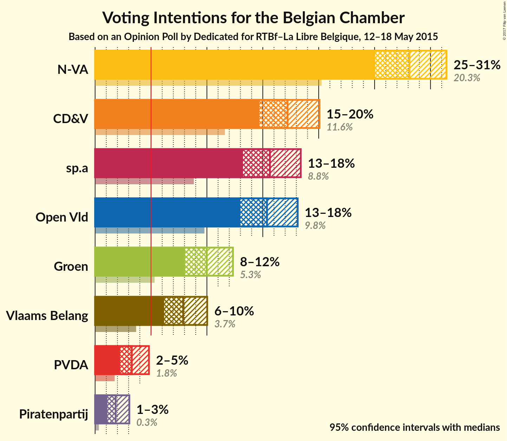
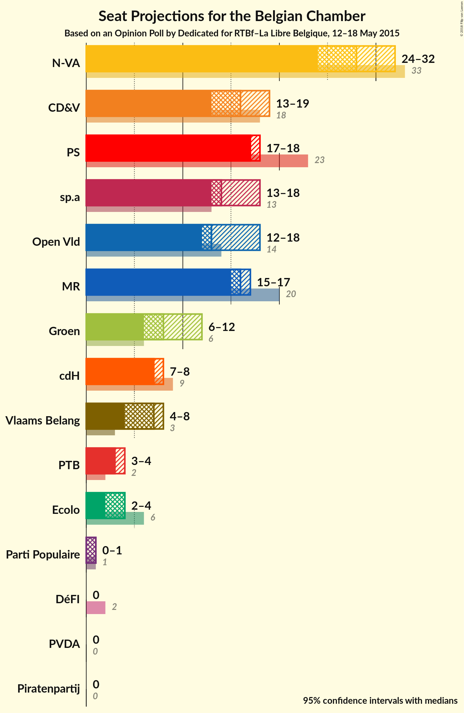
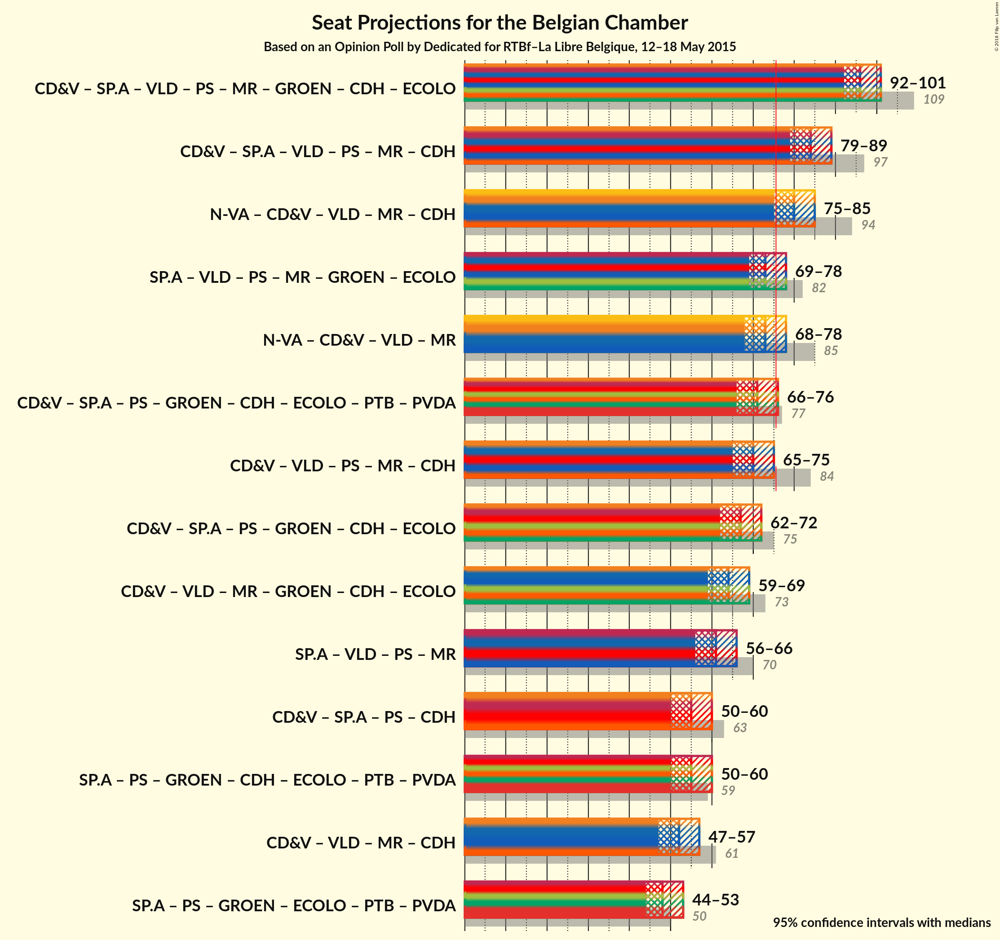

# Opinion Poll by Dedicated for RTBf–La Libre Belgique, 12–18 May 2015

Areas included: Flanders

<a href="#voting-intentions">Voting Intentions</a> | <a href="#seats">Seats</a> | <a href="#coalitions">Coalitions</a> | <a href="#technical-information">Technical Information</a>

## Voting Intentions

### Confidence Intervals

| Party | Last Result | Poll Result | 80% Confidence Interval | 90% Confidence Interval | 95% Confidence Interval | 99% Confidence Interval |
|:-----:|:-----------:|:-----------:|:-----------------------:|:-----------------------:|:-----------------------:|:-----------------------:|
| N-VA | 20.3% | 28.1% | 26.1–30.3% |25.5–30.9% |25.0–31.4% |24.1–32.5% |
| CD&V | 11.6% | 17.2% | 15.6–19.1% |15.1–19.6% |14.7–20.1% |13.9–21.0% |
| sp.a | 8.8% | 15.6% | 14.1–17.4% |13.6–18.0% |13.2–18.4% |12.5–19.3% |
| Open Vld | 9.8% | 15.4% | 13.8–17.2% |13.4–17.7% |13.0–18.1% |12.3–19.0% |
| Groen | 5.3% | 10.0% | 8.7–11.5% |8.4–11.9% |8.0–12.3% |7.5–13.1% |
| Vlaams Belang | 3.7% | 7.9% | 6.8–9.3% |6.4–9.7% |6.2–10.0% |5.7–10.7% |
| PVDA | 1.8% | 3.3% | 2.6–4.3% |2.4–4.6% |2.2–4.8% |1.9–5.3% |
| Piratenpartij | 0.3% | 1.8% | 1.3–2.6% |1.2–2.9% |1.1–3.1% |0.9–3.5% |

*Note:* The poll result column reflects the actual value used in the calculations. Published results may vary slightly, and in addition be rounded to fewer digits.

## Seats

### Confidence Intervals

| Party | Last Result | Median | 80% Confidence Interval | 90% Confidence Interval | 95% Confidence Interval | 99% Confidence Interval |
|:-----:|:-----------:|:------:|:-----------------------:|:-----------------------:|:-----------------------:|:-----------------------:|
| <a href="#n-va">N-VA</a> | 33 | 28 | 25–30 |25–31 |24–31 |23–32 |
| <a href="#cd&v">CD&V</a> | 18 | 16 | 13–18 |13–18 |13–19 |13–20 |
| <a href="#sp.a">sp.a</a> | 13 | 14 | 13–16 |13–17 |12–18 |11–18 |
| <a href="#open-vld">Open Vld</a> | 14 | 13 | 12–17 |12–17 |12–18 |11–18 |
| <a href="#groen">Groen</a> | 6 | 8 | 6–10 |6–11 |6–12 |5–12 |
| <a href="#vlaams-belang">Vlaams Belang</a> | 3 | 7 | 5–8 |5–8 |4–8 |2–8 |
| <a href="#pvda">PVDA</a> | 0 | 0 | 0 |0 |0 |0 |
| <a href="#piratenpartij">Piratenpartij</a> | 0 | 0 | 0 |0 |0 |0–1 |

### N-VA

*For a full overview of the results for this party, see the [N-VA](party-nva.html) page.*

| Number of Seats | Probability | Accumulated | Special Marks |
|:---------------:|:-----------:|:-----------:|:-------------:|
| 22 | 0.1% | 100% |  |
| 23 | 1.0% | 99.9% |  |
| 24 | 4% | 98.9% |  |
| 25 | 6% | 95% |  |
| 26 | 18% | 89% |  |
| 27 | 15% | 71% |  |
| 28 | 20% | 56% | Median |
| 29 | 18% | 36% |  |
| 30 | 10% | 18% |  |
| 31 | 6% | 8% |  |
| 32 | 1.5% | 2% |  |
| 33 | 0.3% | 0.4% | Last Result |
| 34 | 0.1% | 0.1% |  |
| 35 | 0% | 0% |  |

### CD&V

*For a full overview of the results for this party, see the [CD&V](party-cdv.html) page.*

| Number of Seats | Probability | Accumulated | Special Marks |
|:---------------:|:-----------:|:-----------:|:-------------:|
| 12 | 0.1% | 100% |  |
| 13 | 14% | 99.9% |  |
| 14 | 9% | 86% |  |
| 15 | 13% | 77% |  |
| 16 | 15% | 64% | Median |
| 17 | 16% | 49% |  |
| 18 | 28% | 32% | Last Result |
| 19 | 3% | 4% |  |
| 20 | 0.5% | 0.8% |  |
| 21 | 0.3% | 0.4% |  |
| 22 | 0.1% | 0.1% |  |
| 23 | 0% | 0% |  |

### sp.a

*For a full overview of the results for this party, see the [sp.a](party-spa.html) page.*

| Number of Seats | Probability | Accumulated | Special Marks |
|:---------------:|:-----------:|:-----------:|:-------------:|
| 9 | 0.1% | 100% |  |
| 10 | 0.3% | 99.9% |  |
| 11 | 0.6% | 99.6% |  |
| 12 | 2% | 98.9% |  |
| 13 | 41% | 97% | Last Result |
| 14 | 13% | 56% | Median |
| 15 | 20% | 43% |  |
| 16 | 12% | 22% |  |
| 17 | 7% | 10% |  |
| 18 | 3% | 3% |  |
| 19 | 0.2% | 0.3% |  |
| 20 | 0% | 0% |  |

### Open Vld

*For a full overview of the results for this party, see the [Open Vld](party-openvld.html) page.*

| Number of Seats | Probability | Accumulated | Special Marks |
|:---------------:|:-----------:|:-----------:|:-------------:|
| 11 | 2% | 100% |  |
| 12 | 19% | 98% |  |
| 13 | 35% | 79% | Median |
| 14 | 11% | 43% | Last Result |
| 15 | 10% | 32% |  |
| 16 | 7% | 22% |  |
| 17 | 11% | 15% |  |
| 18 | 4% | 4% |  |
| 19 | 0.2% | 0.2% |  |
| 20 | 0% | 0% |  |

### Groen

*For a full overview of the results for this party, see the [Groen](party-groen.html) page.*

| Number of Seats | Probability | Accumulated | Special Marks |
|:---------------:|:-----------:|:-----------:|:-------------:|
| 5 | 2% | 100% |  |
| 6 | 14% | 98% | Last Result |
| 7 | 13% | 84% |  |
| 8 | 31% | 72% | Median |
| 9 | 18% | 41% |  |
| 10 | 15% | 23% |  |
| 11 | 4% | 8% |  |
| 12 | 3% | 3% |  |
| 13 | 0% | 0% |  |

### Vlaams Belang

*For a full overview of the results for this party, see the [Vlaams Belang](party-vlaamsbelang.html) page.*

| Number of Seats | Probability | Accumulated | Special Marks |
|:---------------:|:-----------:|:-----------:|:-------------:|
| 2 | 0.6% | 100% |  |
| 3 | 1.4% | 99.4% | Last Result |
| 4 | 1.1% | 98% |  |
| 5 | 18% | 97% |  |
| 6 | 20% | 78% |  |
| 7 | 32% | 58% | Median |
| 8 | 27% | 27% |  |
| 9 | 0.1% | 0.1% |  |
| 10 | 0% | 0% |  |

### PVDA

*For a full overview of the results for this party, see the [PVDA](party-pvda.html) page.*

| Number of Seats | Probability | Accumulated | Special Marks |
|:---------------:|:-----------:|:-----------:|:-------------:|
| 0 | 100% | 100% | Last Result, Median |

### Piratenpartij

*For a full overview of the results for this party, see the [Piratenpartij](party-piratenpartij.html) page.*

| Number of Seats | Probability | Accumulated | Special Marks |
|:---------------:|:-----------:|:-----------:|:-------------:|
| 0 | 98% | 100% | Last Result, Median |
| 1 | 2% | 2% |  |
| 2 | 0.1% | 0.1% |  |
| 3 | 0% | 0% |  |

## Coalitions

### Confidence Intervals

| Coalition | Last Result | Median | Majority? | 80% Confidence Interval | 90% Confidence Interval | 95% Confidence Interval | 99% Confidence Interval |
|:---------:|:-----------:|:------:|:---------:|:-----------------------:|:-----------------------:|:-----------------------:|:-----------------------:|

## Technical Information

### Opinion Poll

+ **Pollster:** Dedicated
+ **Media:** RTBf–La Libre Belgique
+ **Fieldwork period:** 12–18 May 2015

### Calculations

+ **Sample size:** 761
+ **Simulations done:** 8,388,608
+ **Error estimate:** 2.32%

