# Opinion Poll by Dedicated for RTBf–La Libre Belgique, 12–18 May 2015

Areas included: Flanders, Wallonia

<a href="#voting-intentions">Voting Intentions</a> | <a href="#seats">Seats</a> | <a href="#coalitions">Coalitions</a> | <a href="#technical-information">Technical Information</a>

## Voting Intentions

### Confidence Intervals

| Party | Last Result | Poll Result | 80% Confidence Interval | 90% Confidence Interval | 95% Confidence Interval | 99% Confidence Interval |
|:-----:|:-----------:|:-----------:|:-----------------------:|:-----------------------:|:-----------------------:|:-----------------------:|
| N-VA | 20.3% | 18.8% | 17.4–19.7% |17.0–19.9% |16.7–20.0% |16.1–20.1% |
| CD&V | 11.6% | 11.5% | 10.3–12.3% |10.0–12.5% |9.8–12.6% |9.3–12.7% |
| sp.a | 8.8% | 10.5% | 9.3–11.2% |9.1–11.4% |8.8–11.5% |8.4–11.5% |
| Open Vld | 9.8% | 10.3% | 9.2–11.0% |8.9–11.2% |8.7–11.3% |8.2–11.4% |
| PS | 11.7% | 9.8% | 9.0–10.0% |8.8–10.1% |8.6–10.1% |8.3–10.1% |
| MR | 9.6% | 8.4% | 7.6–8.4% |7.4–8.5% |7.3–8.5% |7.0–8.5% |
| Groen | 5.3% | 6.7% | 5.8–7.5% |5.6–7.8% |5.4–7.9% |5.0–8.0% |
| Vlaams Belang | 3.7% | 5.3% | 4.5–6.0% |4.3–6.2% |4.1–6.3% |3.8–6.4% |
| cdH | 5.0% | 4.2% | 3.6–4.2% |3.5–4.3% |3.4–4.3% |3.2–4.3% |
| Ecolo | 3.3% | 3.0% | 2.5–3.0% |2.4–3.0% |2.3–3.1% |2.1–3.1% |
| PTB | 2.0% | 3.0% | 2.5–3.0% |2.4–3.0% |2.3–3.1% |2.1–3.1% |
| PVDA | 1.8% | 2.2% | 1.7–2.6% |1.6–2.7% |1.5–2.8% |1.3–2.8% |
| Parti Populaire | 1.5% | 1.5% | 1.2–1.6% |1.1–1.6% |1.0–1.6% |0.9–1.6% |
| Piratenpartij | 0.3% | 1.2% | 0.9–1.6% |0.8–1.6% |0.7–1.7% |0.6–1.7% |
| DéFI | 1.8% | 1.0% | 0.7–1.1% |0.7–1.1% |0.6–1.1% |0.5–1.1% |

*Note:* The poll result column reflects the actual value used in the calculations. Published results may vary slightly, and in addition be rounded to fewer digits.

## Seats

### Confidence Intervals

| Party | Last Result | Median | 80% Confidence Interval | 90% Confidence Interval | 95% Confidence Interval | 99% Confidence Interval |
|:-----:|:-----------:|:------:|:-----------------------:|:-----------------------:|:-----------------------:|:-----------------------:|
| <a href="#n-va">N-VA</a> | 33 | 28 | 25–30 |24–31 |24–31 |23–32 |
| <a href="#cd&v">CD&V</a> | 18 | 17 | 13–18 |13–18 |13–19 |13–20 |
| <a href="#sp.a">sp.a</a> | 13 | 14 | 13–16 |13–17 |12–18 |11–18 |
| <a href="#open-vld">Open Vld</a> | 14 | 13 | 12–17 |12–17 |12–18 |11–18 |
| <a href="#ps">PS</a> | 23 | 18 | 16–19 |16–19 |16–20 |15–22 |
| <a href="#mr">MR</a> | 20 | 15 | 14–17 |14–17 |14–18 |13–19 |
| <a href="#groen">Groen</a> | 6 | 8 | 6–10 |6–11 |6–12 |5–12 |
| <a href="#vlaams-belang">Vlaams Belang</a> | 3 | 7 | 5–8 |5–8 |4–8 |2–8 |
| <a href="#cdh">cdH</a> | 9 | 7 | 6–7 |5–8 |5–8 |4–9 |
| <a href="#ecolo">Ecolo</a> | 6 | 4 | 2–5 |2–5 |1–6 |1–6 |
| <a href="#ptb">PTB</a> | 2 | 4 | 3–4 |3–5 |3–5 |2–6 |
| <a href="#pvda">PVDA</a> | 0 | 0 | 0 |0 |0 |0 |
| <a href="#parti-populaire">Parti Populaire</a> | 1 | 1 | 0–2 |0–2 |0–2 |0–2 |
| <a href="#piratenpartij">Piratenpartij</a> | 0 | 0 | 0 |0 |0 |0–1 |
| <a href="#défi">DéFI</a> | 2 | 0 | 0 |0 |0 |0 |

### N-VA

*For a full overview of the results for this party, see the [N-VA](party-n-va.html) page.*

| Number of Seats | Probability | Accumulated | Special Marks |
|:---------------:|:-----------:|:-----------:|:-------------:|
| 22 | 0.1% | 100% |  |
| 23 | 1.1% | 99.9% |  |
| 24 | 4% | 98.8% |  |
| 25 | 7% | 95% |  |
| 26 | 17% | 88% |  |
| 27 | 16% | 71% |  |
| 28 | 19% | 55% | Median |
| 29 | 18% | 37% |  |
| 30 | 10% | 18% |  |
| 31 | 6% | 8% |  |
| 32 | 2% | 2% |  |
| 33 | 0.3% | 0.4% | Last Result |
| 34 | 0.1% | 0.2% |  |
| 35 | 0% | 0% |  |

### CD&V

*For a full overview of the results for this party, see the [CD&V](party-cdv.html) page.*

| Number of Seats | Probability | Accumulated | Special Marks |
|:---------------:|:-----------:|:-----------:|:-------------:|
| 12 | 0% | 100% |  |
| 13 | 14% | 99.9% |  |
| 14 | 9% | 86% |  |
| 15 | 12% | 77% |  |
| 16 | 14% | 65% |  |
| 17 | 16% | 51% | Median |
| 18 | 30% | 34% | Last Result |
| 19 | 3% | 4% |  |
| 20 | 0.5% | 0.8% |  |
| 21 | 0.2% | 0.3% |  |
| 22 | 0.1% | 0.1% |  |
| 23 | 0% | 0% |  |

### sp.a

*For a full overview of the results for this party, see the [sp.a](party-spa.html) page.*

| Number of Seats | Probability | Accumulated | Special Marks |
|:---------------:|:-----------:|:-----------:|:-------------:|
| 9 | 0.1% | 100% |  |
| 10 | 0.3% | 99.9% |  |
| 11 | 0.6% | 99.6% |  |
| 12 | 2% | 99.0% |  |
| 13 | 41% | 97% | Last Result |
| 14 | 12% | 56% | Median |
| 15 | 23% | 44% |  |
| 16 | 12% | 21% |  |
| 17 | 6% | 9% |  |
| 18 | 3% | 3% |  |
| 19 | 0.3% | 0.3% |  |
| 20 | 0% | 0% |  |

### Open Vld

*For a full overview of the results for this party, see the [Open Vld](party-openvld.html) page.*

| Number of Seats | Probability | Accumulated | Special Marks |
|:---------------:|:-----------:|:-----------:|:-------------:|
| 11 | 2% | 100% |  |
| 12 | 17% | 98% |  |
| 13 | 38% | 81% | Median |
| 14 | 13% | 44% | Last Result |
| 15 | 10% | 31% |  |
| 16 | 7% | 21% |  |
| 17 | 10% | 14% |  |
| 18 | 4% | 4% |  |
| 19 | 0.2% | 0.2% |  |
| 20 | 0% | 0% |  |

### PS

*For a full overview of the results for this party, see the [PS](party-ps.html) page.*

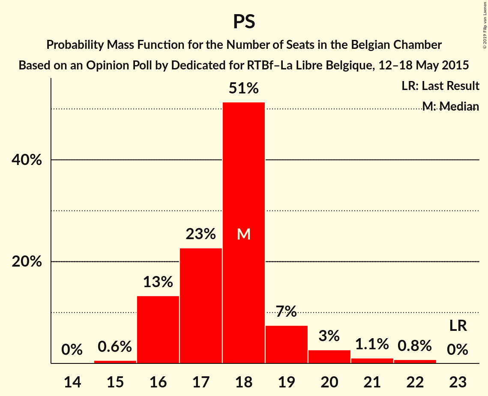

| Number of Seats | Probability | Accumulated | Special Marks |
|:---------------:|:-----------:|:-----------:|:-------------:|
| 15 | 0.6% | 100% |  |
| 16 | 13% | 99.4% |  |
| 17 | 23% | 86% |  |
| 18 | 51% | 63% | Median |
| 19 | 7% | 12% |  |
| 20 | 3% | 5% |  |
| 21 | 1.1% | 2% |  |
| 22 | 0.8% | 0.8% |  |
| 23 | 0% | 0% | Last Result |

### MR

*For a full overview of the results for this party, see the [MR](party-mr.html) page.*

| Number of Seats | Probability | Accumulated | Special Marks |
|:---------------:|:-----------:|:-----------:|:-------------:|
| 11 | 0.1% | 100% |  |
| 12 | 0.3% | 99.9% |  |
| 13 | 2% | 99.6% |  |
| 14 | 46% | 98% |  |
| 15 | 22% | 52% | Median |
| 16 | 19% | 30% |  |
| 17 | 8% | 12% |  |
| 18 | 3% | 3% |  |
| 19 | 0.5% | 0.6% |  |
| 20 | 0.1% | 0.1% | Last Result |
| 21 | 0% | 0% |  |

### Groen

*For a full overview of the results for this party, see the [Groen](party-groen.html) page.*

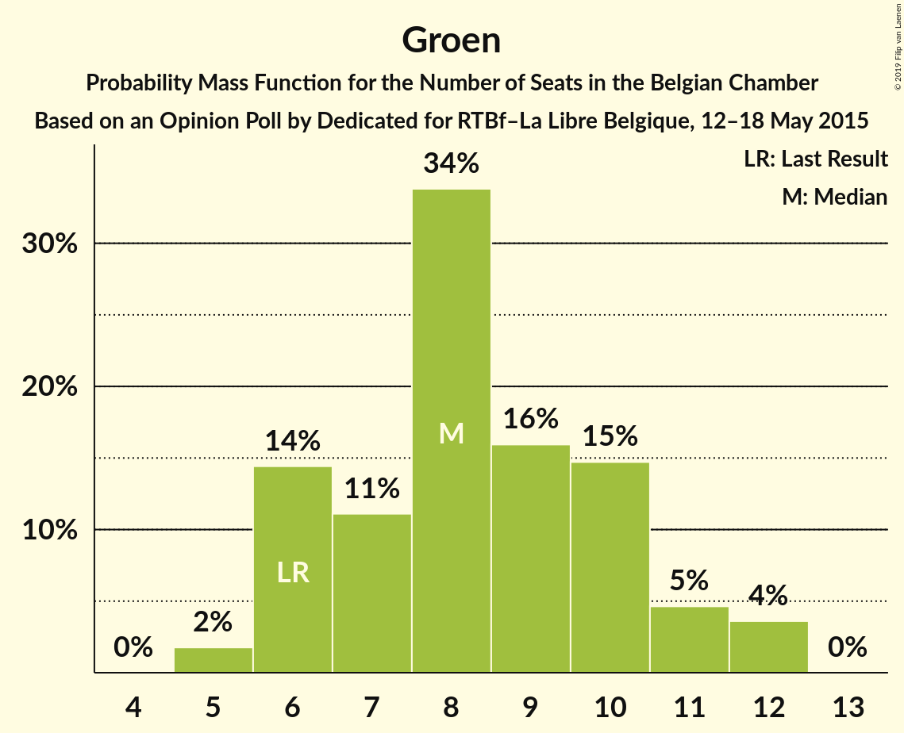

| Number of Seats | Probability | Accumulated | Special Marks |
|:---------------:|:-----------:|:-----------:|:-------------:|
| 5 | 2% | 100% |  |
| 6 | 14% | 98% | Last Result |
| 7 | 11% | 84% |  |
| 8 | 34% | 73% | Median |
| 9 | 16% | 39% |  |
| 10 | 15% | 23% |  |
| 11 | 5% | 8% |  |
| 12 | 4% | 4% |  |
| 13 | 0% | 0% |  |

### Vlaams Belang

*For a full overview of the results for this party, see the [Vlaams Belang](party-vlaamsbelang.html) page.*

| Number of Seats | Probability | Accumulated | Special Marks |
|:---------------:|:-----------:|:-----------:|:-------------:|
| 2 | 0.6% | 100% |  |
| 3 | 1.5% | 99.4% | Last Result |
| 4 | 1.4% | 98% |  |
| 5 | 17% | 97% |  |
| 6 | 23% | 80% |  |
| 7 | 31% | 56% | Median |
| 8 | 25% | 26% |  |
| 9 | 0% | 0.1% |  |
| 10 | 0% | 0% |  |

### cdH

*For a full overview of the results for this party, see the [cdH](party-cdh.html) page.*

| Number of Seats | Probability | Accumulated | Special Marks |
|:---------------:|:-----------:|:-----------:|:-------------:|
| 4 | 2% | 100% |  |
| 5 | 4% | 98% |  |
| 6 | 5% | 94% |  |
| 7 | 80% | 89% | Median |
| 8 | 7% | 8% |  |
| 9 | 0.6% | 1.0% | Last Result |
| 10 | 0.3% | 0.3% |  |
| 11 | 0.1% | 0.1% |  |
| 12 | 0% | 0% |  |

### Ecolo

*For a full overview of the results for this party, see the [Ecolo](party-ecolo.html) page.*

| Number of Seats | Probability | Accumulated | Special Marks |
|:---------------:|:-----------:|:-----------:|:-------------:|
| 1 | 3% | 100% |  |
| 2 | 9% | 97% |  |
| 3 | 9% | 89% |  |
| 4 | 43% | 79% | Median |
| 5 | 34% | 36% |  |
| 6 | 3% | 3% | Last Result |
| 7 | 0% | 0% |  |

### PTB

*For a full overview of the results for this party, see the [PTB](party-ptb.html) page.*

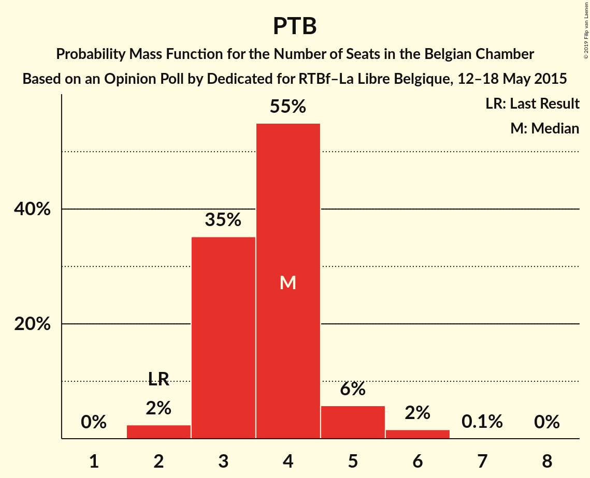

| Number of Seats | Probability | Accumulated | Special Marks |
|:---------------:|:-----------:|:-----------:|:-------------:|
| 2 | 2% | 100% | Last Result |
| 3 | 35% | 98% |  |
| 4 | 55% | 62% | Median |
| 5 | 6% | 7% |  |
| 6 | 2% | 2% |  |
| 7 | 0.1% | 0.1% |  |
| 8 | 0% | 0% |  |

### PVDA

*For a full overview of the results for this party, see the [PVDA](party-pvda.html) page.*

| Number of Seats | Probability | Accumulated | Special Marks |
|:---------------:|:-----------:|:-----------:|:-------------:|
| 0 | 100% | 100% | Last Result, Median |

### Parti Populaire

*For a full overview of the results for this party, see the [Parti Populaire](party-partipopulaire.html) page.*

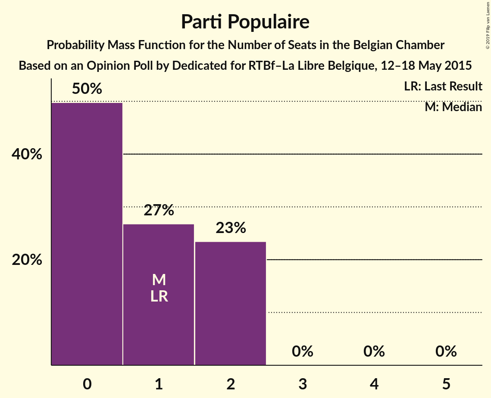

| Number of Seats | Probability | Accumulated | Special Marks |
|:---------------:|:-----------:|:-----------:|:-------------:|
| 0 | 50% | 100% |  |
| 1 | 27% | 50% | Last Result, Median |
| 2 | 23% | 23% |  |
| 3 | 0% | 0% |  |

### Piratenpartij

*For a full overview of the results for this party, see the [Piratenpartij](party-piratenpartij.html) page.*

| Number of Seats | Probability | Accumulated | Special Marks |
|:---------------:|:-----------:|:-----------:|:-------------:|
| 0 | 98.5% | 100% | Last Result, Median |
| 1 | 1.3% | 1.5% |  |
| 2 | 0.1% | 0.1% |  |
| 3 | 0% | 0% |  |

### DéFI

*For a full overview of the results for this party, see the [DéFI](party-défi.html) page.*

| Number of Seats | Probability | Accumulated | Special Marks |
|:---------------:|:-----------:|:-----------:|:-------------:|
| 0 | 99.9% | 100% | Median |
| 1 | 0% | 0.1% |  |
| 2 | 0% | 0% | Last Result |

## Coalitions

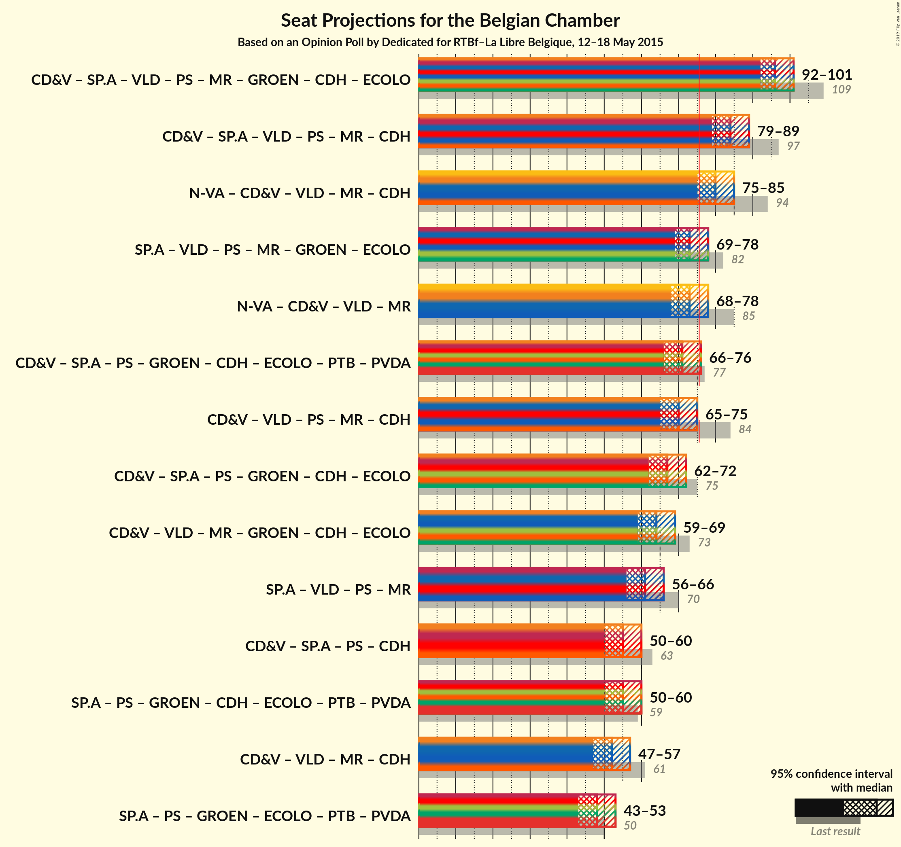

### Confidence Intervals

| Coalition | Last Result | Median | Majority? | 80% Confidence Interval | 90% Confidence Interval | 95% Confidence Interval | 99% Confidence Interval |
|:---------:|:-----------:|:------:|:---------:|:-----------------------:|:-----------------------:|:-----------------------:|:-----------------------:|
| CD&V – sp.a – Open Vld – PS – MR – Groen – cdH – Ecolo | 109 | 96 | 100% | 93–99 | 93–100 | 92–101 | 91–102 |
| CD&V – sp.a – Open Vld – PS – MR – cdH | 97 | 84 | 100% | 81–87 | 80–88 | 79–89 | 78–91 |
| N-VA – CD&V – Open Vld – MR – cdH | 94 | 80 | 95% | 76–83 | 75–84 | 75–85 | 73–86 |
| sp.a – Open Vld – PS – MR – Groen – Ecolo | 82 | 73 | 18% | 70–76 | 69–77 | 69–78 | 67–80 |
| N-VA – CD&V – Open Vld – MR | 85 | 73 | 14% | 70–76 | 69–77 | 68–78 | 67–79 |
| CD&V – sp.a – PS – Groen – cdH – Ecolo – PTB – PVDA | 77 | 71 | 4% | 68–74 | 67–75 | 66–76 | 64–77 |
| CD&V – Open Vld – PS – MR – cdH | 84 | 70 | 1.3% | 66–73 | 65–74 | 65–75 | 63–76 |
| CD&V – sp.a – PS – Groen – cdH – Ecolo | 75 | 67 | 0% | 64–71 | 63–72 | 62–72 | 61–74 |
| CD&V – Open Vld – MR – Groen – cdH – Ecolo | 73 | 64 | 0% | 61–67 | 60–68 | 59–69 | 58–71 |
| sp.a – Open Vld – PS – MR | 70 | 61 | 0% | 58–64 | 57–65 | 56–66 | 55–68 |
| CD&V – sp.a – PS – cdH | 63 | 55 | 0% | 52–58 | 51–59 | 50–60 | 49–61 |
| sp.a – PS – Groen – cdH – Ecolo – PTB – PVDA | 59 | 55 | 0% | 52–58 | 51–59 | 50–60 | 49–61 |
| CD&V – Open Vld – MR – cdH | 61 | 52 | 0% | 49–55 | 48–56 | 47–57 | 46–59 |
| sp.a – PS – Groen – Ecolo – PTB – PVDA | 50 | 48 | 0% | 45–51 | 44–52 | 43–53 | 42–54 |

### CD&V – sp.a – Open Vld – PS – MR – Groen – cdH – Ecolo

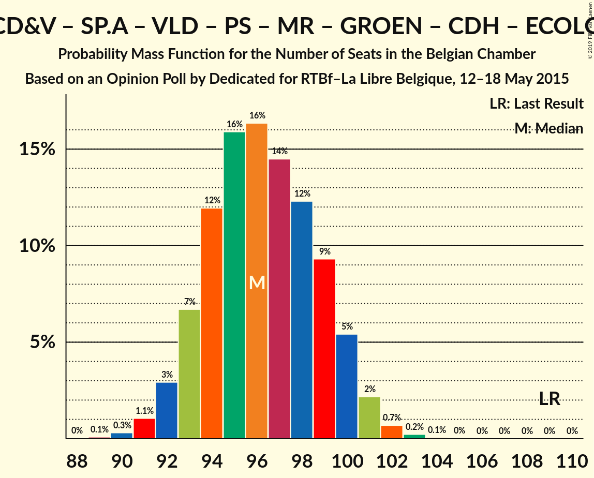

| Number of Seats | Probability | Accumulated | Special Marks |
|:---------------:|:-----------:|:-----------:|:-------------:|
| 89 | 0.1% | 100% |  |
| 90 | 0.3% | 99.9% |  |
| 91 | 1.1% | 99.6% |  |
| 92 | 3% | 98.5% |  |
| 93 | 7% | 96% |  |
| 94 | 12% | 89% |  |
| 95 | 16% | 77% |  |
| 96 | 16% | 61% | Median |
| 97 | 14% | 45% |  |
| 98 | 12% | 30% |  |
| 99 | 9% | 18% |  |
| 100 | 5% | 9% |  |
| 101 | 2% | 3% |  |
| 102 | 0.7% | 1.0% |  |
| 103 | 0.2% | 0.3% |  |
| 104 | 0.1% | 0.1% |  |
| 105 | 0% | 0% |  |
| 106 | 0% | 0% |  |
| 107 | 0% | 0% |  |
| 108 | 0% | 0% |  |
| 109 | 0% | 0% | Last Result |

### CD&V – sp.a – Open Vld – PS – MR – cdH

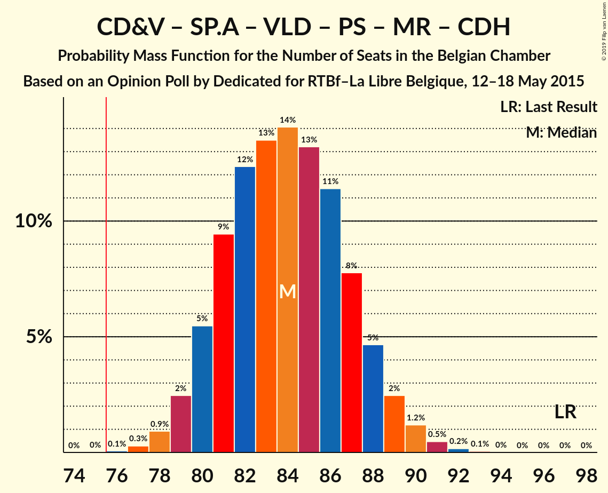

| Number of Seats | Probability | Accumulated | Special Marks |
|:---------------:|:-----------:|:-----------:|:-------------:|
| 76 | 0.1% | 100% | Majority |
| 77 | 0.3% | 99.9% |  |
| 78 | 0.9% | 99.6% |  |
| 79 | 2% | 98.7% |  |
| 80 | 5% | 96% |  |
| 81 | 9% | 91% |  |
| 82 | 12% | 81% |  |
| 83 | 13% | 69% |  |
| 84 | 14% | 55% | Median |
| 85 | 13% | 41% |  |
| 86 | 11% | 28% |  |
| 87 | 8% | 17% |  |
| 88 | 5% | 9% |  |
| 89 | 2% | 4% |  |
| 90 | 1.2% | 2% |  |
| 91 | 0.5% | 0.7% |  |
| 92 | 0.2% | 0.2% |  |
| 93 | 0.1% | 0.1% |  |
| 94 | 0% | 0% |  |
| 95 | 0% | 0% |  |
| 96 | 0% | 0% |  |
| 97 | 0% | 0% | Last Result |

### N-VA – CD&V – Open Vld – MR – cdH

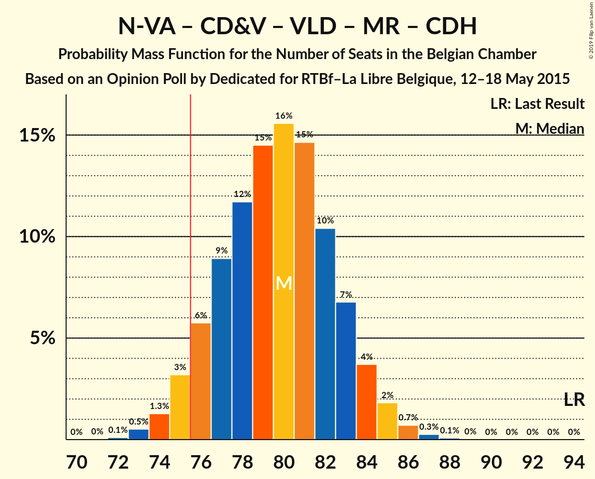

| Number of Seats | Probability | Accumulated | Special Marks |
|:---------------:|:-----------:|:-----------:|:-------------:|
| 72 | 0.1% | 100% |  |
| 73 | 0.5% | 99.9% |  |
| 74 | 1.3% | 99.3% |  |
| 75 | 3% | 98% |  |
| 76 | 6% | 95% | Majority |
| 77 | 9% | 89% |  |
| 78 | 12% | 80% |  |
| 79 | 15% | 68% |  |
| 80 | 16% | 54% | Median |
| 81 | 15% | 38% |  |
| 82 | 10% | 24% |  |
| 83 | 7% | 13% |  |
| 84 | 4% | 7% |  |
| 85 | 2% | 3% |  |
| 86 | 0.7% | 1.1% |  |
| 87 | 0.3% | 0.4% |  |
| 88 | 0.1% | 0.1% |  |
| 89 | 0% | 0% |  |
| 90 | 0% | 0% |  |
| 91 | 0% | 0% |  |
| 92 | 0% | 0% |  |
| 93 | 0% | 0% |  |
| 94 | 0% | 0% | Last Result |

### sp.a – Open Vld – PS – MR – Groen – Ecolo

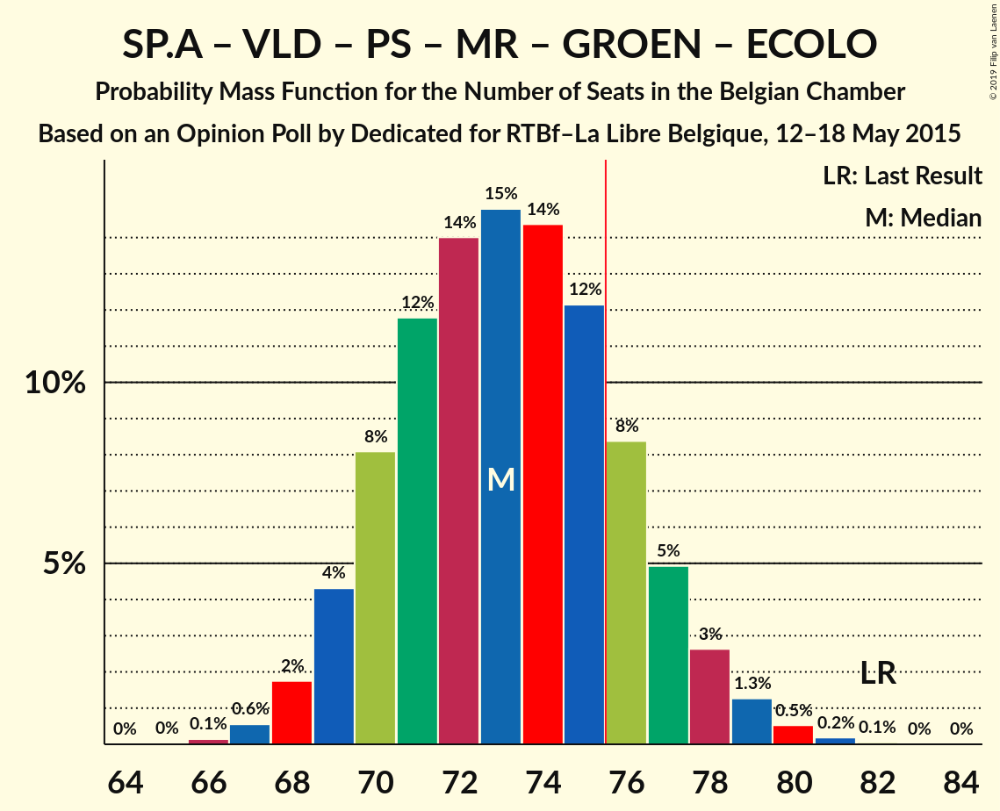

| Number of Seats | Probability | Accumulated | Special Marks |
|:---------------:|:-----------:|:-----------:|:-------------:|
| 66 | 0.1% | 100% |  |
| 67 | 0.6% | 99.8% |  |
| 68 | 2% | 99.3% |  |
| 69 | 4% | 98% |  |
| 70 | 8% | 93% |  |
| 71 | 12% | 85% |  |
| 72 | 14% | 73% | Median |
| 73 | 15% | 59% |  |
| 74 | 14% | 45% |  |
| 75 | 12% | 30% |  |
| 76 | 8% | 18% | Majority |
| 77 | 5% | 10% |  |
| 78 | 3% | 5% |  |
| 79 | 1.3% | 2% |  |
| 80 | 0.5% | 0.8% |  |
| 81 | 0.2% | 0.3% |  |
| 82 | 0.1% | 0.1% | Last Result |
| 83 | 0% | 0% |  |

### N-VA – CD&V – Open Vld – MR

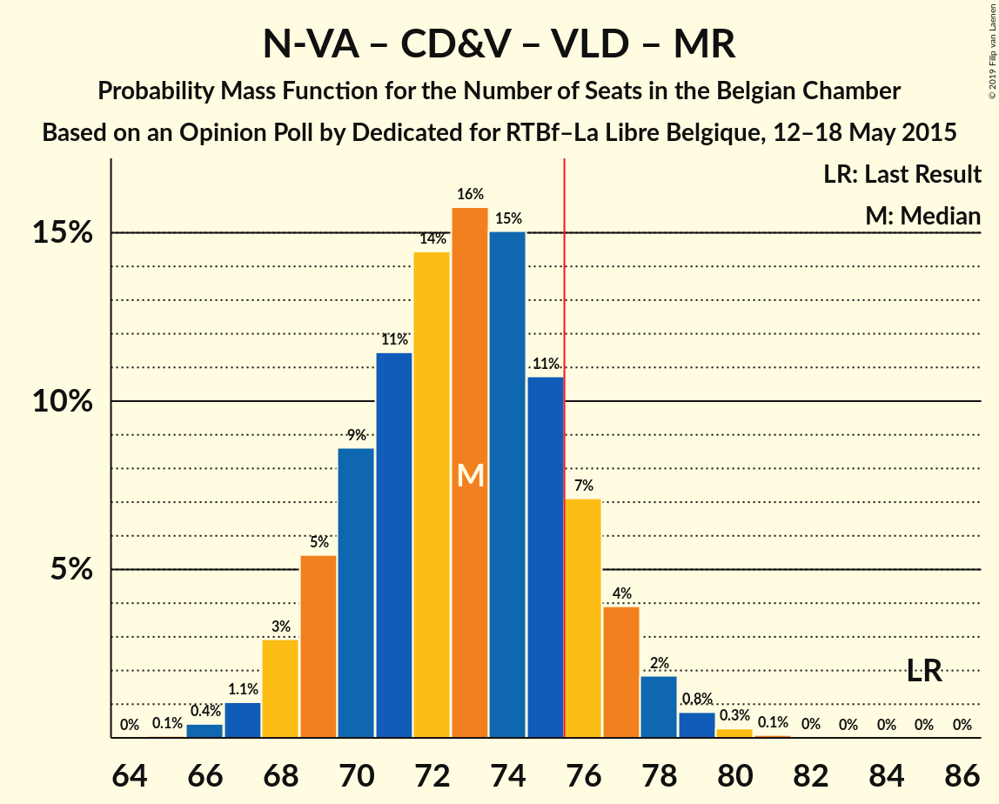

| Number of Seats | Probability | Accumulated | Special Marks |
|:---------------:|:-----------:|:-----------:|:-------------:|
| 65 | 0.1% | 100% |  |
| 66 | 0.4% | 99.9% |  |
| 67 | 1.1% | 99.5% |  |
| 68 | 3% | 98% |  |
| 69 | 5% | 96% |  |
| 70 | 9% | 90% |  |
| 71 | 11% | 81% |  |
| 72 | 14% | 70% |  |
| 73 | 16% | 56% | Median |
| 74 | 15% | 40% |  |
| 75 | 11% | 25% |  |
| 76 | 7% | 14% | Majority |
| 77 | 4% | 7% |  |
| 78 | 2% | 3% |  |
| 79 | 0.8% | 1.2% |  |
| 80 | 0.3% | 0.4% |  |
| 81 | 0.1% | 0.1% |  |
| 82 | 0% | 0% |  |
| 83 | 0% | 0% |  |
| 84 | 0% | 0% |  |
| 85 | 0% | 0% | Last Result |

### CD&V – sp.a – PS – Groen – cdH – Ecolo – PTB – PVDA

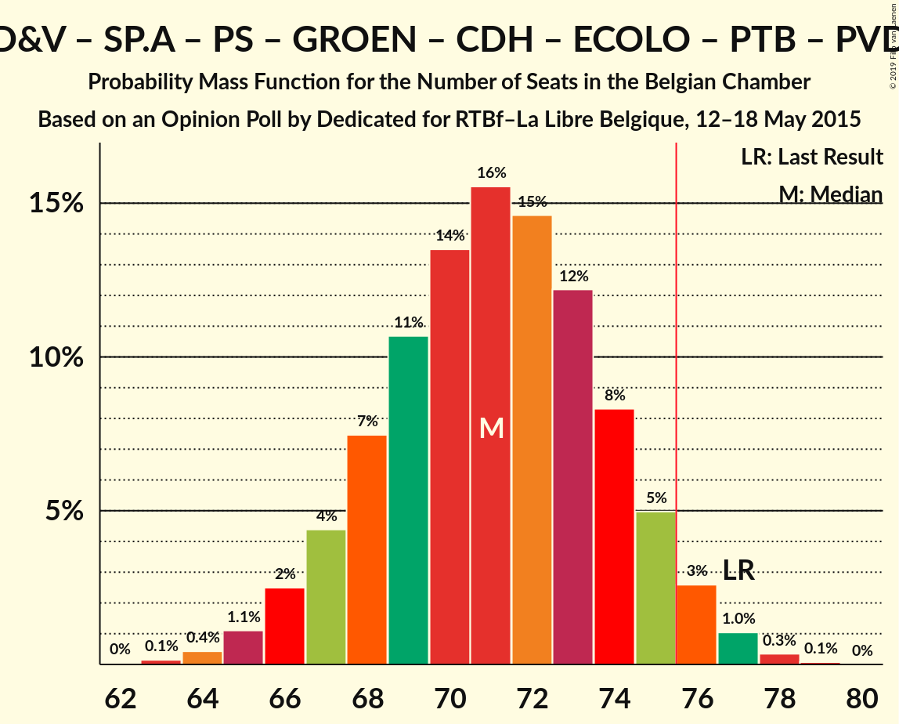

| Number of Seats | Probability | Accumulated | Special Marks |
|:---------------:|:-----------:|:-----------:|:-------------:|
| 62 | 0% | 100% |  |
| 63 | 0.1% | 99.9% |  |
| 64 | 0.4% | 99.8% |  |
| 65 | 1.1% | 99.4% |  |
| 66 | 2% | 98% |  |
| 67 | 4% | 96% |  |
| 68 | 7% | 91% |  |
| 69 | 11% | 84% |  |
| 70 | 14% | 73% |  |
| 71 | 16% | 60% |  |
| 72 | 15% | 44% | Median |
| 73 | 12% | 30% |  |
| 74 | 8% | 17% |  |
| 75 | 5% | 9% |  |
| 76 | 3% | 4% | Majority |
| 77 | 1.0% | 1.5% | Last Result |
| 78 | 0.3% | 0.4% |  |
| 79 | 0.1% | 0.1% |  |
| 80 | 0% | 0% |  |

### CD&V – Open Vld – PS – MR – cdH

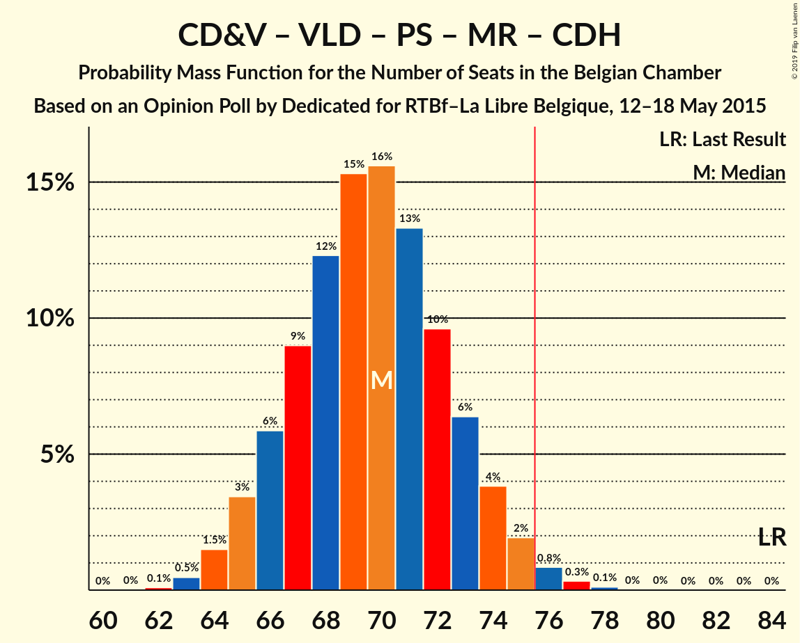

| Number of Seats | Probability | Accumulated | Special Marks |
|:---------------:|:-----------:|:-----------:|:-------------:|
| 62 | 0.1% | 100% |  |
| 63 | 0.5% | 99.9% |  |
| 64 | 1.5% | 99.4% |  |
| 65 | 3% | 98% |  |
| 66 | 6% | 94% |  |
| 67 | 9% | 89% |  |
| 68 | 12% | 80% |  |
| 69 | 15% | 67% |  |
| 70 | 16% | 52% | Median |
| 71 | 13% | 36% |  |
| 72 | 10% | 23% |  |
| 73 | 6% | 13% |  |
| 74 | 4% | 7% |  |
| 75 | 2% | 3% |  |
| 76 | 0.8% | 1.3% | Majority |
| 77 | 0.3% | 0.5% |  |
| 78 | 0.1% | 0.2% |  |
| 79 | 0% | 0% |  |
| 80 | 0% | 0% |  |
| 81 | 0% | 0% |  |
| 82 | 0% | 0% |  |
| 83 | 0% | 0% |  |
| 84 | 0% | 0% | Last Result |

### CD&V – sp.a – PS – Groen – cdH – Ecolo

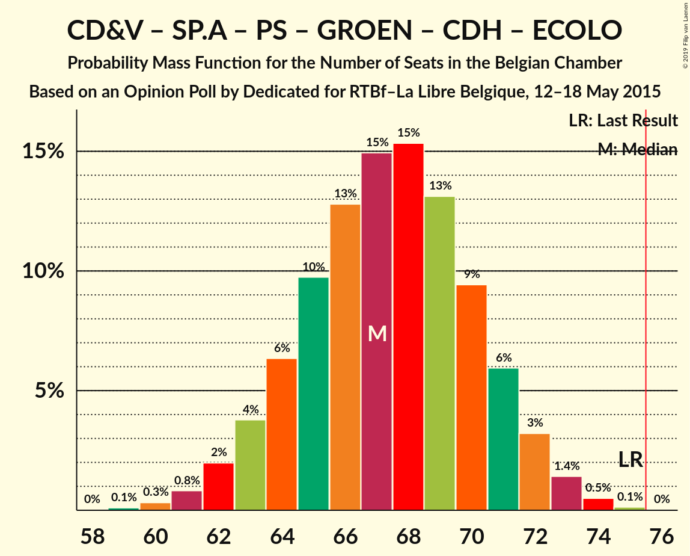

| Number of Seats | Probability | Accumulated | Special Marks |
|:---------------:|:-----------:|:-----------:|:-------------:|
| 59 | 0.1% | 100% |  |
| 60 | 0.3% | 99.9% |  |
| 61 | 0.8% | 99.5% |  |
| 62 | 2% | 98.7% |  |
| 63 | 4% | 97% |  |
| 64 | 6% | 93% |  |
| 65 | 10% | 87% |  |
| 66 | 13% | 77% |  |
| 67 | 15% | 64% |  |
| 68 | 15% | 49% | Median |
| 69 | 13% | 34% |  |
| 70 | 9% | 21% |  |
| 71 | 6% | 11% |  |
| 72 | 3% | 5% |  |
| 73 | 1.4% | 2% |  |
| 74 | 0.5% | 0.7% |  |
| 75 | 0.1% | 0.2% | Last Result |
| 76 | 0% | 0% | Majority |

### CD&V – Open Vld – MR – Groen – cdH – Ecolo

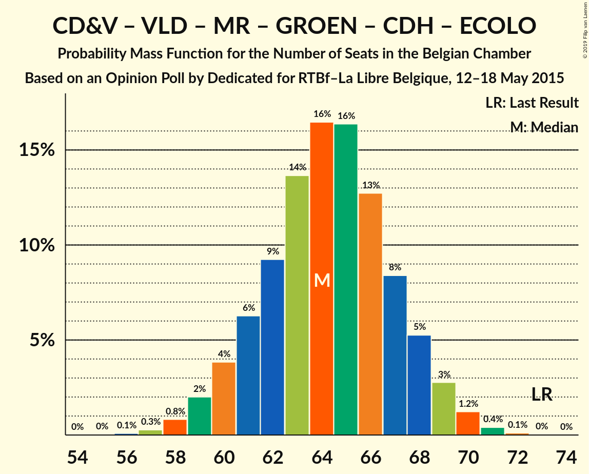

| Number of Seats | Probability | Accumulated | Special Marks |
|:---------------:|:-----------:|:-----------:|:-------------:|
| 56 | 0.1% | 100% |  |
| 57 | 0.3% | 99.9% |  |
| 58 | 0.8% | 99.6% |  |
| 59 | 2% | 98.8% |  |
| 60 | 4% | 97% |  |
| 61 | 6% | 93% |  |
| 62 | 9% | 87% |  |
| 63 | 14% | 77% |  |
| 64 | 16% | 64% | Median |
| 65 | 16% | 47% |  |
| 66 | 13% | 31% |  |
| 67 | 8% | 18% |  |
| 68 | 5% | 10% |  |
| 69 | 3% | 5% |  |
| 70 | 1.2% | 2% |  |
| 71 | 0.4% | 0.5% |  |
| 72 | 0.1% | 0.1% |  |
| 73 | 0% | 0% | Last Result |

### sp.a – Open Vld – PS – MR

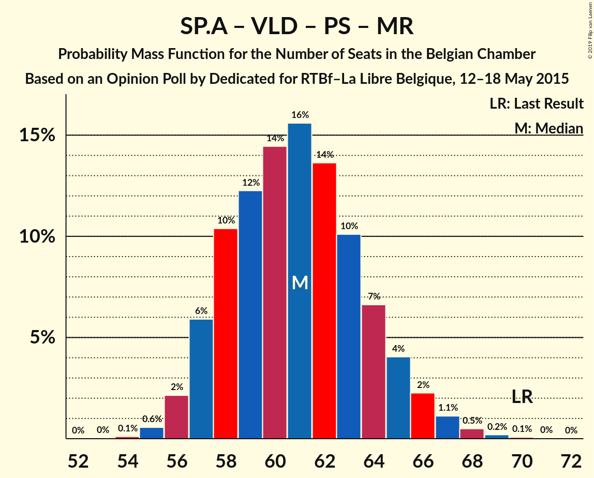

| Number of Seats | Probability | Accumulated | Special Marks |
|:---------------:|:-----------:|:-----------:|:-------------:|
| 54 | 0.1% | 100% |  |
| 55 | 0.6% | 99.9% |  |
| 56 | 2% | 99.3% |  |
| 57 | 6% | 97% |  |
| 58 | 10% | 91% |  |
| 59 | 12% | 81% |  |
| 60 | 14% | 69% | Median |
| 61 | 16% | 54% |  |
| 62 | 14% | 39% |  |
| 63 | 10% | 25% |  |
| 64 | 7% | 15% |  |
| 65 | 4% | 8% |  |
| 66 | 2% | 4% |  |
| 67 | 1.1% | 2% |  |
| 68 | 0.5% | 0.8% |  |
| 69 | 0.2% | 0.3% |  |
| 70 | 0.1% | 0.1% | Last Result |
| 71 | 0% | 0% |  |

### CD&V – sp.a – PS – cdH

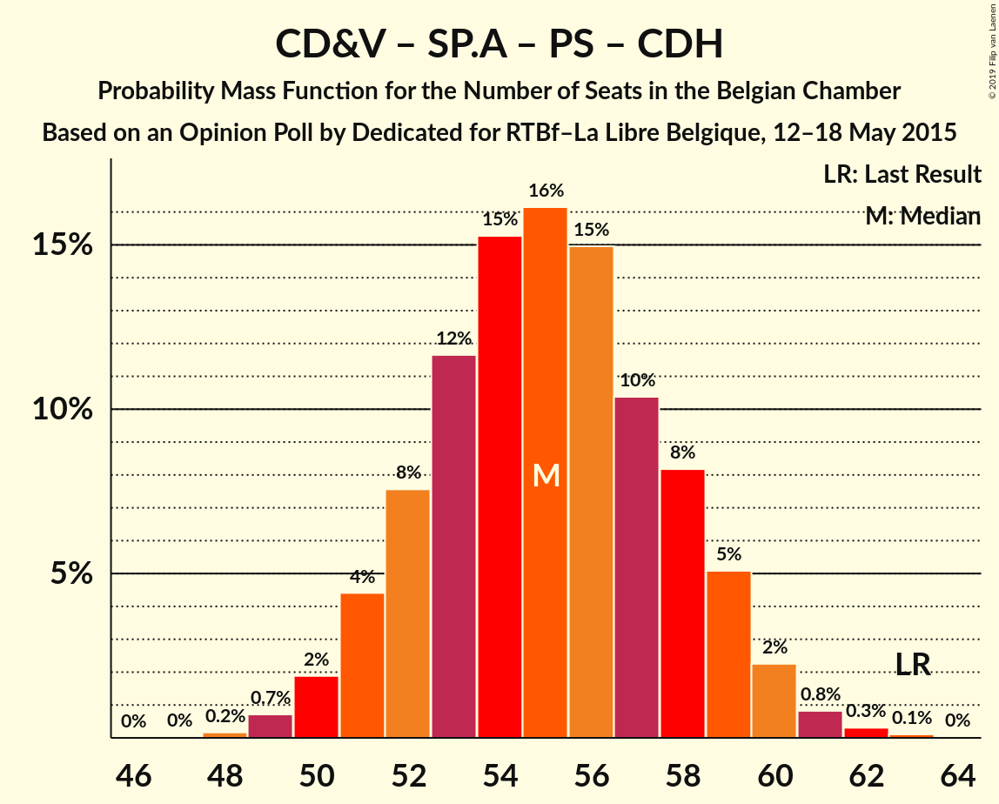

| Number of Seats | Probability | Accumulated | Special Marks |
|:---------------:|:-----------:|:-----------:|:-------------:|
| 47 | 0% | 100% |  |
| 48 | 0.2% | 99.9% |  |
| 49 | 0.7% | 99.8% |  |
| 50 | 2% | 99.1% |  |
| 51 | 4% | 97% |  |
| 52 | 8% | 93% |  |
| 53 | 12% | 85% |  |
| 54 | 15% | 74% |  |
| 55 | 16% | 58% |  |
| 56 | 15% | 42% | Median |
| 57 | 10% | 27% |  |
| 58 | 8% | 17% |  |
| 59 | 5% | 9% |  |
| 60 | 2% | 4% |  |
| 61 | 0.8% | 1.3% |  |
| 62 | 0.3% | 0.5% |  |
| 63 | 0.1% | 0.1% | Last Result |
| 64 | 0% | 0% |  |

### sp.a – PS – Groen – cdH – Ecolo – PTB – PVDA

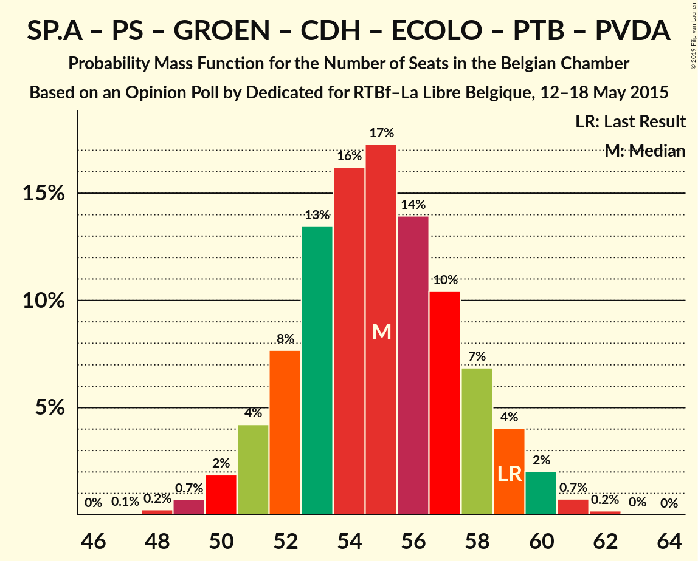

| Number of Seats | Probability | Accumulated | Special Marks |
|:---------------:|:-----------:|:-----------:|:-------------:|
| 47 | 0.1% | 100% |  |
| 48 | 0.2% | 99.9% |  |
| 49 | 0.7% | 99.7% |  |
| 50 | 2% | 98.9% |  |
| 51 | 4% | 97% |  |
| 52 | 8% | 93% |  |
| 53 | 13% | 85% |  |
| 54 | 16% | 72% |  |
| 55 | 17% | 56% | Median |
| 56 | 14% | 38% |  |
| 57 | 10% | 24% |  |
| 58 | 7% | 14% |  |
| 59 | 4% | 7% | Last Result |
| 60 | 2% | 3% |  |
| 61 | 0.7% | 1.0% |  |
| 62 | 0.2% | 0.2% |  |
| 63 | 0% | 0.1% |  |
| 64 | 0% | 0% |  |

### CD&V – Open Vld – MR – cdH

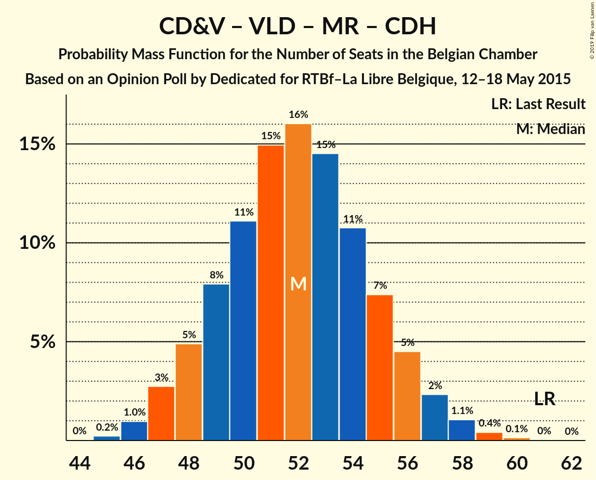

| Number of Seats | Probability | Accumulated | Special Marks |
|:---------------:|:-----------:|:-----------:|:-------------:|
| 45 | 0.2% | 100% |  |
| 46 | 1.0% | 99.7% |  |
| 47 | 3% | 98.8% |  |
| 48 | 5% | 96% |  |
| 49 | 8% | 91% |  |
| 50 | 11% | 83% |  |
| 51 | 15% | 72% |  |
| 52 | 16% | 57% | Median |
| 53 | 15% | 41% |  |
| 54 | 11% | 27% |  |
| 55 | 7% | 16% |  |
| 56 | 5% | 8% |  |
| 57 | 2% | 4% |  |
| 58 | 1.1% | 2% |  |
| 59 | 0.4% | 0.6% |  |
| 60 | 0.1% | 0.2% |  |
| 61 | 0% | 0% | Last Result |

### sp.a – PS – Groen – Ecolo – PTB – PVDA

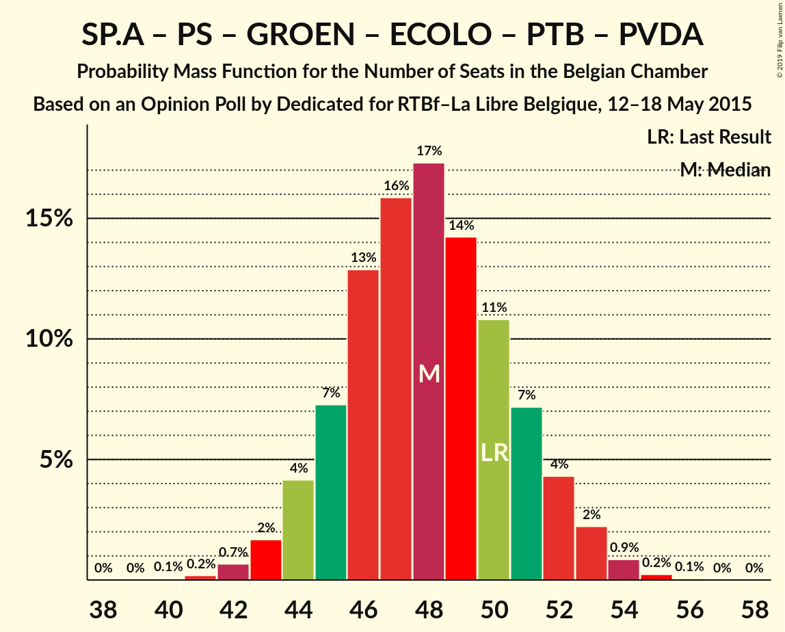

| Number of Seats | Probability | Accumulated | Special Marks |
|:---------------:|:-----------:|:-----------:|:-------------:|
| 40 | 0.1% | 100% |  |
| 41 | 0.2% | 99.9% |  |
| 42 | 0.7% | 99.7% |  |
| 43 | 2% | 99.1% |  |
| 44 | 4% | 97% |  |
| 45 | 7% | 93% |  |
| 46 | 13% | 86% |  |
| 47 | 16% | 73% |  |
| 48 | 17% | 57% | Median |
| 49 | 14% | 40% |  |
| 50 | 11% | 26% | Last Result |
| 51 | 7% | 15% |  |
| 52 | 4% | 8% |  |
| 53 | 2% | 3% |  |
| 54 | 0.9% | 1.2% |  |
| 55 | 0.2% | 0.3% |  |
| 56 | 0.1% | 0.1% |  |
| 57 | 0% | 0% |  |

## Technical Information

### Opinion Poll

+ **Polling firm:** Dedicated
+ **Commissioner(s):** RTBf–La Libre Belgique
+ **Fieldwork period:** 12–18 May 2015

### Calculations

+ **Sample size:** 1138
+ **Simulations done:** 8,388,608
+ **Error estimate:** 1.27%

