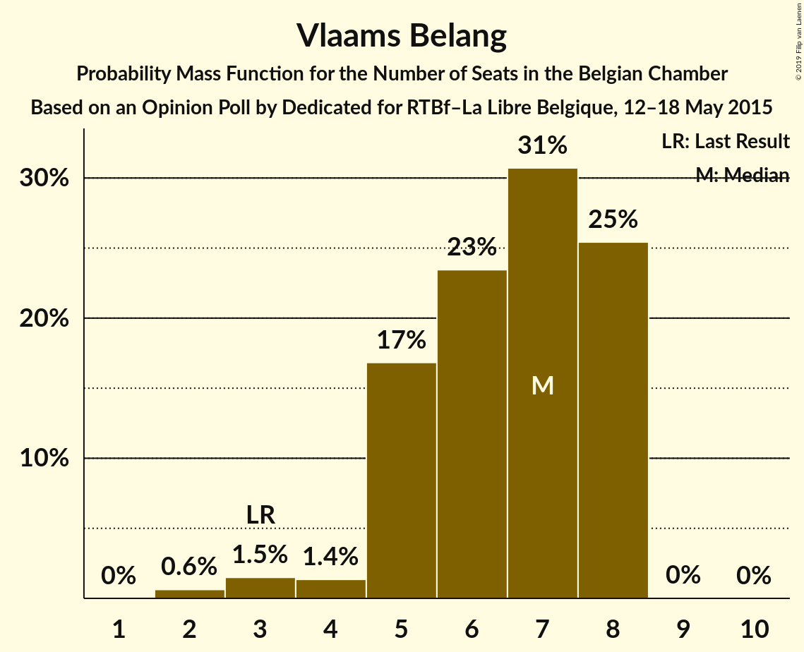
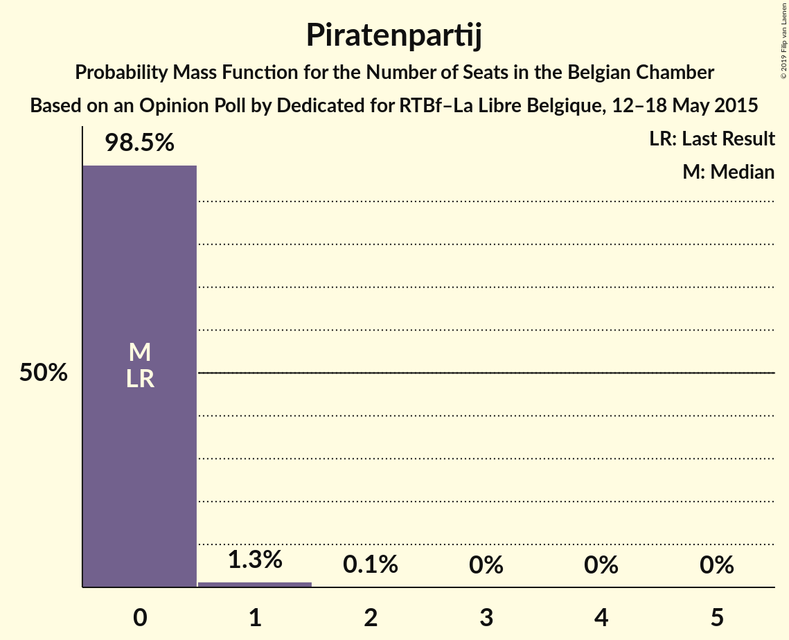

# Opinion Poll by Dedicated for RTBf–La Libre Belgique, 12–18 May 2015

Areas included: Flanders, Wallonia

<a href="#voting-intentions">Voting Intentions</a> | <a href="#seats">Seats</a> | <a href="#coalitions">Coalitions</a> | <a href="#technical-information">Technical Information</a>

## Voting Intentions

### Confidence Intervals

| Party | Last Result | Poll Result | 80% Confidence Interval | 90% Confidence Interval | 95% Confidence Interval | 99% Confidence Interval |
|:-----:|:-----------:|:-----------:|:-----------------------:|:-----------------------:|:-----------------------:|:-----------------------:|
| N-VA | 20.3% | 18.8% | 26.1–30.3% |25.5–30.9% |25.0–31.4% |24.1–32.5% |
| CD&V | 11.6% | 11.5% | 15.6–19.1% |15.1–19.6% |14.7–20.1% |13.9–21.0% |
| sp.a | 8.8% | 10.5% | 14.1–17.4% |13.6–18.0% |13.2–18.4% |12.5–19.3% |
| Open Vld | 9.8% | 10.3% | 13.8–17.2% |13.4–17.7% |13.0–18.1% |12.3–19.0% |
| PS | 11.7% | 9.8% | N/A |N/A |N/A |N/A |
| MR | 9.6% | 8.4% | N/A |N/A |N/A |N/A |
| Groen | 5.3% | 6.7% | 8.7–11.5% |8.4–11.9% |8.0–12.3% |7.5–13.1% |
| Vlaams Belang | 3.7% | 5.3% | 6.8–9.3% |6.4–9.7% |6.2–10.0% |5.7–10.7% |
| cdH | 5.0% | 4.2% | N/A |N/A |N/A |N/A |
| Ecolo | 3.3% | 3.0% | N/A |N/A |N/A |N/A |
| PTB | 2.0% | 3.0% | N/A |N/A |N/A |N/A |
| PVDA | 1.8% | 2.2% | 2.6–4.3% |2.4–4.6% |2.2–4.8% |1.9–5.3% |
| Parti Populaire | 1.5% | 1.5% | N/A |N/A |N/A |N/A |
| Piratenpartij | 0.3% | 1.2% | 1.3–2.6% |1.2–2.9% |1.1–3.1% |0.9–3.5% |
| DéFI | 1.8% | 1.0% | N/A |N/A |N/A |N/A |

*Note:* The poll result column reflects the actual value used in the calculations. Published results may vary slightly, and in addition be rounded to fewer digits.

## Seats

### Confidence Intervals

| Party | Last Result | Median | 80% Confidence Interval | 90% Confidence Interval | 95% Confidence Interval | 99% Confidence Interval |
|:-----:|:-----------:|:------:|:-----------------------:|:-----------------------:|:-----------------------:|:-----------------------:|
| <a href="#n-va">N-VA</a> | 33 | 28 | 25–31 |24–31 |24–32 |23–32 |
| <a href="#cd&v">CD&V</a> | 18 | 16 | 13–18 |13–19 |13–19 |13–20 |
| <a href="#sp.a">sp.a</a> | 13 | 14 | 13–16 |13–17 |13–18 |11–18 |
| <a href="#open-vld">Open Vld</a> | 14 | 13 | 12–17 |12–18 |12–18 |11–18 |
| <a href="#ps">PS</a> | 23 | 17 | 17–18 |17–18 |17–18 |16–18 |
| <a href="#mr">MR</a> | 20 | 16 | 15–16 |15–16 |15–17 |15–17 |
| <a href="#groen">Groen</a> | 6 | 8 | 6–10 |6–11 |6–12 |5–12 |
| <a href="#vlaams-belang">Vlaams Belang</a> | 3 | 7 | 5–8 |5–8 |4–8 |2–8 |
| <a href="#cdh">cdH</a> | 9 | 7 | 7–8 |7–8 |7–8 |7–8 |
| <a href="#ecolo">Ecolo</a> | 6 | 4 | 3–4 |3–4 |2–4 |2–4 |
| <a href="#ptb">PTB</a> | 2 | 3 | 3–4 |3–4 |3–4 |3–4 |
| <a href="#pvda">PVDA</a> | 0 | 0 | 0 |0 |0 |0 |
| <a href="#parti-populaire">Parti Populaire</a> | 1 | 1 | 0–1 |0–1 |0–1 |0–1 |
| <a href="#piratenpartij">Piratenpartij</a> | 0 | 0 | 0 |0 |0 |0–1 |
| <a href="#défi">DéFI</a> | 2 | 0 | 0 |0 |0 |0 |

### N-VA

*For a full overview of the results for this party, see the [N-VA](party-n-va.html) page.*

| Number of Seats | Probability | Accumulated | Special Marks |
|:---------------:|:-----------:|:-----------:|:-------------:|
| 22 | 0.1% | 100% |  |
| 23 | 2% | 99.9% |  |
| 24 | 5% | 98% |  |
| 25 | 7% | 93% |  |
| 26 | 13% | 86% |  |
| 27 | 17% | 73% |  |
| 28 | 16% | 57% | Median |
| 29 | 20% | 40% |  |
| 30 | 10% | 20% |  |
| 31 | 8% | 11% |  |
| 32 | 2% | 3% |  |
| 33 | 0.3% | 0.5% | Last Result |
| 34 | 0.1% | 0.2% |  |
| 35 | 0% | 0% |  |

### CD&V

*For a full overview of the results for this party, see the [CD&V](party-cdv.html) page.*

| Number of Seats | Probability | Accumulated | Special Marks |
|:---------------:|:-----------:|:-----------:|:-------------:|
| 12 | 0% | 100% |  |
| 13 | 13% | 99.9% |  |
| 14 | 12% | 87% |  |
| 15 | 14% | 75% |  |
| 16 | 15% | 62% | Median |
| 17 | 15% | 47% |  |
| 18 | 27% | 32% | Last Result |
| 19 | 4% | 5% |  |
| 20 | 0.5% | 0.8% |  |
| 21 | 0.2% | 0.3% |  |
| 22 | 0.1% | 0.1% |  |
| 23 | 0% | 0% |  |

### sp.a

*For a full overview of the results for this party, see the [sp.a](party-spa.html) page.*

| Number of Seats | Probability | Accumulated | Special Marks |
|:---------------:|:-----------:|:-----------:|:-------------:|
| 9 | 0.1% | 100% |  |
| 10 | 0.3% | 99.9% |  |
| 11 | 0.6% | 99.6% |  |
| 12 | 1.3% | 99.0% |  |
| 13 | 41% | 98% | Last Result |
| 14 | 16% | 57% | Median |
| 15 | 21% | 41% |  |
| 16 | 11% | 20% |  |
| 17 | 6% | 9% |  |
| 18 | 3% | 3% |  |
| 19 | 0.4% | 0.4% |  |
| 20 | 0% | 0% |  |

### Open Vld

*For a full overview of the results for this party, see the [Open Vld](party-openvld.html) page.*

| Number of Seats | Probability | Accumulated | Special Marks |
|:---------------:|:-----------:|:-----------:|:-------------:|
| 11 | 2% | 100% |  |
| 12 | 15% | 98% |  |
| 13 | 38% | 83% | Median |
| 14 | 12% | 45% | Last Result |
| 15 | 13% | 33% |  |
| 16 | 5% | 20% |  |
| 17 | 9% | 15% |  |
| 18 | 5% | 5% |  |
| 19 | 0.3% | 0.3% |  |
| 20 | 0% | 0% |  |

### PS

*For a full overview of the results for this party, see the [PS](party-ps.html) page.*

| Number of Seats | Probability | Accumulated | Special Marks |
|:---------------:|:-----------:|:-----------:|:-------------:|
| 16 | 0.8% | 100% |  |
| 17 | 53% | 99.2% | Median |
| 18 | 46% | 46% |  |
| 19 | 0% | 0% |  |
| 20 | 0% | 0% |  |
| 21 | 0% | 0% |  |
| 22 | 0% | 0% |  |
| 23 | 0% | 0% | Last Result |

### MR

*For a full overview of the results for this party, see the [MR](party-mr.html) page.*

| Number of Seats | Probability | Accumulated | Special Marks |
|:---------------:|:-----------:|:-----------:|:-------------:|
| 14 | 0.3% | 100% |  |
| 15 | 33% | 99.7% |  |
| 16 | 64% | 67% | Median |
| 17 | 3% | 3% |  |
| 18 | 0% | 0% |  |
| 19 | 0% | 0% |  |
| 20 | 0% | 0% | Last Result |

### Groen

*For a full overview of the results for this party, see the [Groen](party-groen.html) page.*

| Number of Seats | Probability | Accumulated | Special Marks |
|:---------------:|:-----------:|:-----------:|:-------------:|
| 5 | 2% | 100% |  |
| 6 | 14% | 98% | Last Result |
| 7 | 11% | 84% |  |
| 8 | 33% | 74% | Median |
| 9 | 16% | 41% |  |
| 10 | 18% | 25% |  |
| 11 | 5% | 8% |  |
| 12 | 3% | 3% |  |
| 13 | 0% | 0% |  |

### Vlaams Belang

*For a full overview of the results for this party, see the [Vlaams Belang](party-vlaamsbelang.html) page.*

| Number of Seats | Probability | Accumulated | Special Marks |
|:---------------:|:-----------:|:-----------:|:-------------:|
| 2 | 0.8% | 100% |  |
| 3 | 2% | 99.2% | Last Result |
| 4 | 2% | 98% |  |
| 5 | 19% | 96% |  |
| 6 | 23% | 77% |  |
| 7 | 28% | 54% | Median |
| 8 | 26% | 26% |  |
| 9 | 0% | 0.1% |  |
| 10 | 0% | 0% |  |

### cdH

*For a full overview of the results for this party, see the [cdH](party-cdh.html) page.*

| Number of Seats | Probability | Accumulated | Special Marks |
|:---------------:|:-----------:|:-----------:|:-------------:|
| 7 | 65% | 100% | Median |
| 8 | 35% | 35% |  |
| 9 | 0% | 0% | Last Result |

### Ecolo

*For a full overview of the results for this party, see the [Ecolo](party-ecolo.html) page.*

| Number of Seats | Probability | Accumulated | Special Marks |
|:---------------:|:-----------:|:-----------:|:-------------:|
| 2 | 3% | 100% |  |
| 3 | 32% | 97% |  |
| 4 | 64% | 65% | Median |
| 5 | 0.4% | 0.4% |  |
| 6 | 0% | 0% | Last Result |

### PTB

*For a full overview of the results for this party, see the [PTB](party-ptb.html) page.*

| Number of Seats | Probability | Accumulated | Special Marks |
|:---------------:|:-----------:|:-----------:|:-------------:|
| 2 | 0.1% | 100% | Last Result |
| 3 | 66% | 99.9% | Median |
| 4 | 34% | 34% |  |
| 5 | 0% | 0% |  |

### PVDA

*For a full overview of the results for this party, see the [PVDA](party-pvda.html) page.*

| Number of Seats | Probability | Accumulated | Special Marks |
|:---------------:|:-----------:|:-----------:|:-------------:|
| 0 | 100% | 100% | Last Result, Median |

### Parti Populaire

*For a full overview of the results for this party, see the [Parti Populaire](party-partipopulaire.html) page.*

| Number of Seats | Probability | Accumulated | Special Marks |
|:---------------:|:-----------:|:-----------:|:-------------:|
| 0 | 46% | 100% |  |
| 1 | 53% | 54% | Last Result, Median |
| 2 | 0.4% | 0.4% |  |
| 3 | 0% | 0% |  |

### Piratenpartij

*For a full overview of the results for this party, see the [Piratenpartij](party-piratenpartij.html) page.*

| Number of Seats | Probability | Accumulated | Special Marks |
|:---------------:|:-----------:|:-----------:|:-------------:|
| 0 | 98% | 100% | Last Result, Median |
| 1 | 1.5% | 2% |  |
| 2 | 0.1% | 0.1% |  |
| 3 | 0% | 0% |  |

### DéFI

*For a full overview of the results for this party, see the [DéFI](party-défi.html) page.*

| Number of Seats | Probability | Accumulated | Special Marks |
|:---------------:|:-----------:|:-----------:|:-------------:|
| 0 | 100% | 100% | Median |
| 1 | 0% | 0% |  |
| 2 | 0% | 0% | Last Result |

## Coalitions

### Confidence Intervals

| Coalition | Last Result | Median | Majority? | 80% Confidence Interval | 90% Confidence Interval | 95% Confidence Interval | 99% Confidence Interval |
|:---------:|:-----------:|:------:|:---------:|:-----------------------:|:-----------------------:|:-----------------------:|:-----------------------:|
| CD&V – sp.a – Open Vld – PS – MR – Groen – cdH – Ecolo | 109 | 97 | 100% | 94–100 | 93–100 | 93–101 | 92–102 |
| CD&V – sp.a – Open Vld – PS – MR – cdH | 97 | 85 | 100% | 82–88 | 81–89 | 81–90 | 79–91 |
| N-VA – CD&V – Open Vld – MR – cdH | 94 | 81 | 99.4% | 78–84 | 77–85 | 76–85 | 75–86 |
| N-VA – CD&V – Open Vld – MR | 85 | 74 | 24% | 70–76 | 69–77 | 69–78 | 68–79 |
| sp.a – Open Vld – PS – MR – Groen – Ecolo | 82 | 73 | 18% | 70–76 | 70–77 | 69–78 | 68–79 |
| CD&V – sp.a – PS – Groen – cdH – Ecolo – PTB – PVDA | 77 | 70 | 2% | 67–74 | 66–74 | 66–75 | 64–77 |
| CD&V – Open Vld – PS – MR – cdH | 84 | 71 | 2% | 68–73 | 67–74 | 66–75 | 65–77 |
| CD&V – sp.a – PS – Groen – cdH – Ecolo | 75 | 67 | 0% | 64–70 | 63–71 | 62–72 | 61–73 |
| CD&V – Open Vld – MR – Groen – cdH – Ecolo | 73 | 65 | 0% | 62–68 | 61–69 | 60–70 | 59–71 |
| sp.a – Open Vld – PS – MR | 70 | 62 | 0% | 59–64 | 58–65 | 58–66 | 57–67 |
| CD&V – sp.a – PS – cdH | 63 | 55 | 0% | 52–58 | 52–59 | 51–60 | 50–61 |
| sp.a – PS – Groen – cdH – Ecolo – PTB – PVDA | 59 | 54 | 0% | 52–57 | 51–58 | 50–59 | 49–60 |
| CD&V – Open Vld – MR – cdH | 61 | 53 | 0% | 50–56 | 49–57 | 49–58 | 48–59 |
| sp.a – PS – Groen – Ecolo – PTB – PVDA | 50 | 47 | 0% | 45–50 | 44–51 | 43–51 | 42–52 |

### CD&V – sp.a – Open Vld – PS – MR – Groen – cdH – Ecolo

| Number of Seats | Probability | Accumulated | Special Marks |
|:---------------:|:-----------:|:-----------:|:-------------:|
| 90 | 0.2% | 100% |  |
| 91 | 0.3% | 99.8% |  |
| 92 | 1.0% | 99.6% |  |
| 93 | 4% | 98.5% |  |
| 94 | 7% | 95% |  |
| 95 | 16% | 88% | Median |
| 96 | 19% | 72% |  |
| 97 | 18% | 53% |  |
| 98 | 12% | 34% |  |
| 99 | 11% | 22% |  |
| 100 | 7% | 11% |  |
| 101 | 2% | 4% |  |
| 102 | 1.2% | 2% |  |
| 103 | 0.3% | 0.4% |  |
| 104 | 0.1% | 0.1% |  |
| 105 | 0% | 0% |  |
| 106 | 0% | 0% |  |
| 107 | 0% | 0% |  |
| 108 | 0% | 0% |  |
| 109 | 0% | 0% | Last Result |

### CD&V – sp.a – Open Vld – PS – MR – cdH

| Number of Seats | Probability | Accumulated | Special Marks |
|:---------------:|:-----------:|:-----------:|:-------------:|
| 78 | 0.1% | 100% |  |
| 79 | 0.5% | 99.8% |  |
| 80 | 2% | 99.4% |  |
| 81 | 4% | 98% |  |
| 82 | 9% | 94% |  |
| 83 | 13% | 84% | Median |
| 84 | 17% | 71% |  |
| 85 | 17% | 55% |  |
| 86 | 14% | 37% |  |
| 87 | 11% | 23% |  |
| 88 | 7% | 13% |  |
| 89 | 3% | 6% |  |
| 90 | 2% | 3% |  |
| 91 | 0.6% | 1.0% |  |
| 92 | 0.3% | 0.3% |  |
| 93 | 0% | 0.1% |  |
| 94 | 0% | 0% |  |
| 95 | 0% | 0% |  |
| 96 | 0% | 0% |  |
| 97 | 0% | 0% | Last Result |

### N-VA – CD&V – Open Vld – MR – cdH

| Number of Seats | Probability | Accumulated | Special Marks |
|:---------------:|:-----------:|:-----------:|:-------------:|
| 74 | 0.1% | 100% |  |
| 75 | 0.6% | 99.9% |  |
| 76 | 2% | 99.4% | Majority |
| 77 | 7% | 97% |  |
| 78 | 8% | 90% |  |
| 79 | 14% | 83% |  |
| 80 | 8% | 69% | Median |
| 81 | 16% | 61% |  |
| 82 | 15% | 44% |  |
| 83 | 17% | 30% |  |
| 84 | 7% | 12% |  |
| 85 | 3% | 5% |  |
| 86 | 1.2% | 2% |  |
| 87 | 0.4% | 0.4% |  |
| 88 | 0% | 0.1% |  |
| 89 | 0% | 0% |  |
| 90 | 0% | 0% |  |
| 91 | 0% | 0% |  |
| 92 | 0% | 0% |  |
| 93 | 0% | 0% |  |
| 94 | 0% | 0% | Last Result |

### N-VA – CD&V – Open Vld – MR

| Number of Seats | Probability | Accumulated | Special Marks |
|:---------------:|:-----------:|:-----------:|:-------------:|
| 67 | 0.2% | 100% |  |
| 68 | 1.1% | 99.7% |  |
| 69 | 4% | 98.6% |  |
| 70 | 7% | 95% |  |
| 71 | 10% | 88% |  |
| 72 | 12% | 78% |  |
| 73 | 11% | 66% | Median |
| 74 | 16% | 55% |  |
| 75 | 16% | 39% |  |
| 76 | 14% | 24% | Majority |
| 77 | 6% | 10% |  |
| 78 | 2% | 4% |  |
| 79 | 0.8% | 1.1% |  |
| 80 | 0.2% | 0.2% |  |
| 81 | 0% | 0% |  |
| 82 | 0% | 0% |  |
| 83 | 0% | 0% |  |
| 84 | 0% | 0% |  |
| 85 | 0% | 0% | Last Result |

### sp.a – Open Vld – PS – MR – Groen – Ecolo

| Number of Seats | Probability | Accumulated | Special Marks |
|:---------------:|:-----------:|:-----------:|:-------------:|
| 66 | 0% | 100% |  |
| 67 | 0.2% | 99.9% |  |
| 68 | 1.2% | 99.7% |  |
| 69 | 3% | 98.5% |  |
| 70 | 7% | 95% |  |
| 71 | 12% | 88% |  |
| 72 | 13% | 77% | Median |
| 73 | 16% | 64% |  |
| 74 | 16% | 48% |  |
| 75 | 14% | 32% |  |
| 76 | 10% | 18% | Majority |
| 77 | 5% | 9% |  |
| 78 | 2% | 4% |  |
| 79 | 1.0% | 2% |  |
| 80 | 0.4% | 0.5% |  |
| 81 | 0.1% | 0.1% |  |
| 82 | 0% | 0% | Last Result |

### CD&V – sp.a – PS – Groen – cdH – Ecolo – PTB – PVDA

| Number of Seats | Probability | Accumulated | Special Marks |
|:---------------:|:-----------:|:-----------:|:-------------:|
| 63 | 0.1% | 100% |  |
| 64 | 0.4% | 99.9% |  |
| 65 | 2% | 99.5% |  |
| 66 | 3% | 98% |  |
| 67 | 7% | 95% |  |
| 68 | 10% | 88% |  |
| 69 | 12% | 78% | Median |
| 70 | 17% | 66% |  |
| 71 | 14% | 49% |  |
| 72 | 15% | 35% |  |
| 73 | 8% | 19% |  |
| 74 | 7% | 11% |  |
| 75 | 3% | 5% |  |
| 76 | 1.4% | 2% | Majority |
| 77 | 0.5% | 0.6% | Last Result |
| 78 | 0.1% | 0.1% |  |
| 79 | 0% | 0% |  |

### CD&V – Open Vld – PS – MR – cdH

| Number of Seats | Probability | Accumulated | Special Marks |
|:---------------:|:-----------:|:-----------:|:-------------:|
| 64 | 0.1% | 100% |  |
| 65 | 0.8% | 99.9% |  |
| 66 | 3% | 99.0% |  |
| 67 | 6% | 96% |  |
| 68 | 10% | 90% |  |
| 69 | 13% | 81% | Median |
| 70 | 15% | 67% |  |
| 71 | 18% | 53% |  |
| 72 | 16% | 35% |  |
| 73 | 9% | 19% |  |
| 74 | 5% | 10% |  |
| 75 | 3% | 5% |  |
| 76 | 1.3% | 2% | Majority |
| 77 | 0.4% | 0.5% |  |
| 78 | 0.1% | 0.1% |  |
| 79 | 0% | 0% |  |
| 80 | 0% | 0% |  |
| 81 | 0% | 0% |  |
| 82 | 0% | 0% |  |
| 83 | 0% | 0% |  |
| 84 | 0% | 0% | Last Result |

### CD&V – sp.a – PS – Groen – cdH – Ecolo

| Number of Seats | Probability | Accumulated | Special Marks |
|:---------------:|:-----------:|:-----------:|:-------------:|
| 60 | 0.1% | 100% |  |
| 61 | 0.5% | 99.9% |  |
| 62 | 2% | 99.4% |  |
| 63 | 4% | 97% |  |
| 64 | 7% | 93% |  |
| 65 | 11% | 86% |  |
| 66 | 13% | 75% | Median |
| 67 | 18% | 62% |  |
| 68 | 16% | 44% |  |
| 69 | 13% | 28% |  |
| 70 | 8% | 15% |  |
| 71 | 4% | 7% |  |
| 72 | 2% | 3% |  |
| 73 | 0.7% | 0.8% |  |
| 74 | 0.1% | 0.2% |  |
| 75 | 0% | 0.1% | Last Result |
| 76 | 0% | 0% | Majority |

### CD&V – Open Vld – MR – Groen – cdH – Ecolo

| Number of Seats | Probability | Accumulated | Special Marks |
|:---------------:|:-----------:|:-----------:|:-------------:|
| 58 | 0.1% | 100% |  |
| 59 | 0.5% | 99.9% |  |
| 60 | 2% | 99.4% |  |
| 61 | 4% | 97% |  |
| 62 | 7% | 93% |  |
| 63 | 11% | 87% |  |
| 64 | 14% | 76% | Median |
| 65 | 19% | 62% |  |
| 66 | 20% | 43% |  |
| 67 | 10% | 24% |  |
| 68 | 7% | 13% |  |
| 69 | 4% | 7% |  |
| 70 | 2% | 3% |  |
| 71 | 0.6% | 0.8% |  |
| 72 | 0.2% | 0.2% |  |
| 73 | 0% | 0% | Last Result |

### sp.a – Open Vld – PS – MR

| Number of Seats | Probability | Accumulated | Special Marks |
|:---------------:|:-----------:|:-----------:|:-------------:|
| 55 | 0.1% | 100% |  |
| 56 | 0.3% | 99.9% |  |
| 57 | 0.8% | 99.6% |  |
| 58 | 6% | 98.9% |  |
| 59 | 17% | 92% |  |
| 60 | 11% | 75% | Median |
| 61 | 13% | 64% |  |
| 62 | 21% | 51% |  |
| 63 | 14% | 30% |  |
| 64 | 9% | 16% |  |
| 65 | 4% | 7% |  |
| 66 | 2% | 4% |  |
| 67 | 1.3% | 2% |  |
| 68 | 0.3% | 0.4% |  |
| 69 | 0.1% | 0.1% |  |
| 70 | 0% | 0% | Last Result |

### CD&V – sp.a – PS – cdH

| Number of Seats | Probability | Accumulated | Special Marks |
|:---------------:|:-----------:|:-----------:|:-------------:|
| 49 | 0.2% | 100% |  |
| 50 | 1.3% | 99.8% |  |
| 51 | 3% | 98% |  |
| 52 | 8% | 95% |  |
| 53 | 11% | 87% |  |
| 54 | 15% | 76% | Median |
| 55 | 19% | 61% |  |
| 56 | 13% | 42% |  |
| 57 | 14% | 29% |  |
| 58 | 7% | 15% |  |
| 59 | 5% | 8% |  |
| 60 | 2% | 3% |  |
| 61 | 0.7% | 0.9% |  |
| 62 | 0.2% | 0.2% |  |
| 63 | 0% | 0% | Last Result |

### sp.a – PS – Groen – cdH – Ecolo – PTB – PVDA

| Number of Seats | Probability | Accumulated | Special Marks |
|:---------------:|:-----------:|:-----------:|:-------------:|
| 48 | 0.1% | 100% |  |
| 49 | 0.4% | 99.9% |  |
| 50 | 3% | 99.5% |  |
| 51 | 4% | 97% |  |
| 52 | 16% | 93% |  |
| 53 | 14% | 77% | Median |
| 54 | 19% | 63% |  |
| 55 | 15% | 44% |  |
| 56 | 11% | 29% |  |
| 57 | 9% | 18% |  |
| 58 | 5% | 9% |  |
| 59 | 3% | 4% | Last Result |
| 60 | 1.2% | 1.4% |  |
| 61 | 0.2% | 0.2% |  |
| 62 | 0% | 0.1% |  |
| 63 | 0% | 0% |  |

### CD&V – Open Vld – MR – cdH

| Number of Seats | Probability | Accumulated | Special Marks |
|:---------------:|:-----------:|:-----------:|:-------------:|
| 47 | 0.2% | 100% |  |
| 48 | 1.3% | 99.8% |  |
| 49 | 4% | 98.5% |  |
| 50 | 7% | 94% |  |
| 51 | 12% | 87% |  |
| 52 | 14% | 75% | Median |
| 53 | 16% | 61% |  |
| 54 | 19% | 45% |  |
| 55 | 14% | 26% |  |
| 56 | 5% | 13% |  |
| 57 | 4% | 7% |  |
| 58 | 2% | 3% |  |
| 59 | 0.6% | 0.8% |  |
| 60 | 0.1% | 0.2% |  |
| 61 | 0% | 0% | Last Result |

### sp.a – PS – Groen – Ecolo – PTB – PVDA

| Number of Seats | Probability | Accumulated | Special Marks |
|:---------------:|:-----------:|:-----------:|:-------------:|
| 41 | 0.1% | 100% |  |
| 42 | 0.6% | 99.9% |  |
| 43 | 3% | 99.3% |  |
| 44 | 6% | 96% |  |
| 45 | 16% | 91% |  |
| 46 | 20% | 75% | Median |
| 47 | 16% | 55% |  |
| 48 | 14% | 38% |  |
| 49 | 10% | 24% |  |
| 50 | 7% | 14% | Last Result |
| 51 | 5% | 7% |  |
| 52 | 2% | 2% |  |
| 53 | 0.3% | 0.4% |  |
| 54 | 0.1% | 0.1% |  |
| 55 | 0% | 0% |  |

## Technical Information

### Opinion Poll

+ **Polling firm:** Dedicated
+ **Commissioner(s):** RTBf–La Libre Belgique
+ **Fieldwork period:** 12–18 May 2015

### Calculations

+ **Sample size:** 1138
+ **Simulations done:** 1,048,576
+ **Error estimate:** 2.94%

