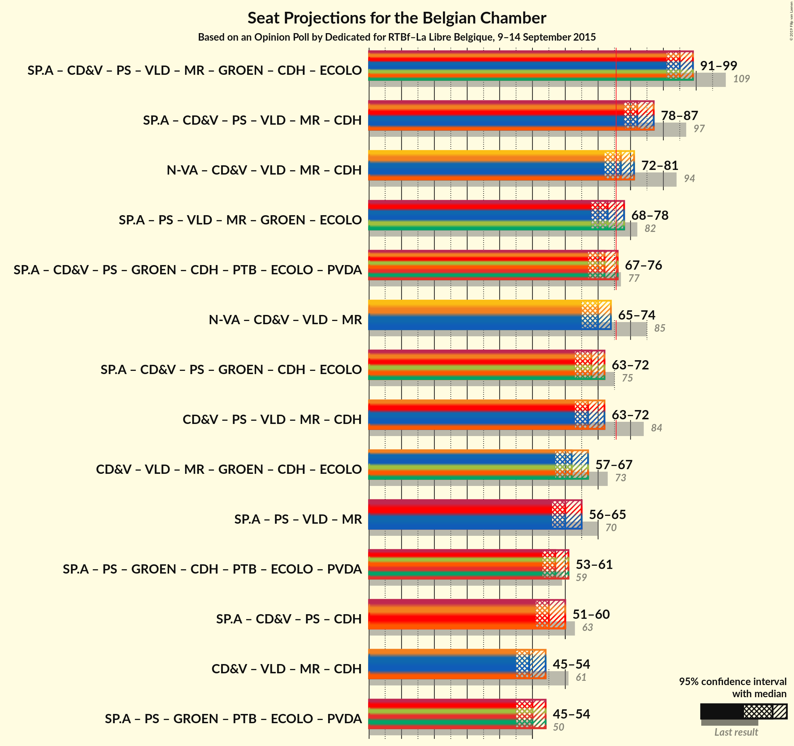

# Opinion Poll by Dedicated for RTBf–La Libre Belgique, 9–14 September 2015

Areas included: Flanders

<a href="#voting-intentions">Voting Intentions</a> | <a href="#seats">Seats</a> | <a href="#coalitions">Coalitions</a> | <a href="#technical-information">Technical Information</a>

## Voting Intentions

### Confidence Intervals

| Party | Last Result | Poll Result | 80% Confidence Interval | 90% Confidence Interval | 95% Confidence Interval | 99% Confidence Interval |
|:-----:|:-----------:|:-----------:|:-----------------------:|:-----------------------:|:-----------------------:|:-----------------------:|
| N-VA | 20.3% | 27.5% | 25.5–29.7% |24.9–30.3% |24.4–30.8% |23.5–31.9% |
| sp.a | 8.8% | 16.2% | 14.6–18.1% |14.2–18.6% |13.8–19.1% |13.0–20.0% |
| CD&V | 11.6% | 16.0% | 14.4–17.8% |13.9–18.3% |13.5–18.8% |12.8–19.7% |
| Open Vld | 9.8% | 14.4% | 12.8–16.1% |12.4–16.6% |12.0–17.1% |11.3–18.0% |
| Groen | 5.3% | 10.1% | 8.8–11.6% |8.4–12.1% |8.1–12.5% |7.5–13.2% |
| Vlaams Belang | 3.7% | 9.7% | 8.4–11.2% |8.0–11.6% |7.7–12.0% |7.2–12.8% |
| PVDA | 1.8% | 3.8% | 3.0–4.8% |2.8–5.1% |2.6–5.4% |2.3–5.9% |
| Piratenpartij | 0.3% | 1.2% | 0.8–1.9% |0.7–2.1% |0.6–2.3% |0.5–2.7% |

*Note:* The poll result column reflects the actual value used in the calculations. Published results may vary slightly, and in addition be rounded to fewer digits.

## Seats

### Confidence Intervals

| Party | Last Result | Median | 80% Confidence Interval | 90% Confidence Interval | 95% Confidence Interval | 99% Confidence Interval |
|:-----:|:-----------:|:------:|:-----------------------:|:-----------------------:|:-----------------------:|:-----------------------:|
| <a href="#n-va">N-VA</a> | 33 | 28 | 25–30 |24–31 |24–31 |23–32 |
| <a href="#sp.a">sp.a</a> | 13 | 15 | 13–17 |13–18 |13–18 |12–19 |
| <a href="#cd&v">CD&V</a> | 18 | 14 | 13–18 |13–18 |13–18 |12–18 |
| <a href="#open-vld">Open Vld</a> | 14 | 13 | 12–15 |11–17 |11–17 |11–18 |
| <a href="#groen">Groen</a> | 6 | 9 | 6–10 |6–11 |6–12 |5–12 |
| <a href="#vlaams-belang">Vlaams Belang</a> | 3 | 8 | 7–8 |7–10 |6–11 |6–12 |
| <a href="#pvda">PVDA</a> | 0 | 0 | 0 |0 |0 |0 |
| <a href="#piratenpartij">Piratenpartij</a> | 0 | 0 | 0 |0 |0 |0 |

### N-VA

*For a full overview of the results for this party, see the [N-VA](party-nva.html) page.*

| Number of Seats | Probability | Accumulated | Special Marks |
|:---------------:|:-----------:|:-----------:|:-------------:|
| 22 | 0.1% | 100% |  |
| 23 | 1.3% | 99.8% |  |
| 24 | 7% | 98.6% |  |
| 25 | 6% | 92% |  |
| 26 | 15% | 86% |  |
| 27 | 16% | 71% |  |
| 28 | 29% | 55% | Median |
| 29 | 11% | 26% |  |
| 30 | 10% | 15% |  |
| 31 | 5% | 6% |  |
| 32 | 0.5% | 0.7% |  |
| 33 | 0.1% | 0.2% | Last Result |
| 34 | 0.1% | 0.1% |  |
| 35 | 0% | 0% |  |

### sp.a

*For a full overview of the results for this party, see the [sp.a](party-spa.html) page.*

| Number of Seats | Probability | Accumulated | Special Marks |
|:---------------:|:-----------:|:-----------:|:-------------:|
| 10 | 0.1% | 100% |  |
| 11 | 0.2% | 99.9% |  |
| 12 | 0.4% | 99.7% |  |
| 13 | 18% | 99.4% | Last Result |
| 14 | 9% | 81% |  |
| 15 | 33% | 72% | Median |
| 16 | 16% | 40% |  |
| 17 | 14% | 24% |  |
| 18 | 8% | 10% |  |
| 19 | 1.3% | 2% |  |
| 20 | 0.3% | 0.4% |  |
| 21 | 0.1% | 0.1% |  |
| 22 | 0% | 0% |  |

### CD&V

*For a full overview of the results for this party, see the [CD&V](party-cdv.html) page.*

| Number of Seats | Probability | Accumulated | Special Marks |
|:---------------:|:-----------:|:-----------:|:-------------:|
| 10 | 0.1% | 100% |  |
| 11 | 0.2% | 99.9% |  |
| 12 | 0.5% | 99.8% |  |
| 13 | 42% | 99.2% |  |
| 14 | 15% | 57% | Median |
| 15 | 12% | 42% |  |
| 16 | 13% | 30% |  |
| 17 | 6% | 18% |  |
| 18 | 11% | 11% | Last Result |
| 19 | 0.4% | 0.5% |  |
| 20 | 0.1% | 0.1% |  |
| 21 | 0% | 0% |  |

### Open Vld

*For a full overview of the results for this party, see the [Open Vld](party-openvld.html) page.*

| Number of Seats | Probability | Accumulated | Special Marks |
|:---------------:|:-----------:|:-----------:|:-------------:|
| 9 | 0% | 100% |  |
| 10 | 0.2% | 99.9% |  |
| 11 | 7% | 99.7% |  |
| 12 | 34% | 93% |  |
| 13 | 38% | 59% | Median |
| 14 | 7% | 21% | Last Result |
| 15 | 7% | 14% |  |
| 16 | 2% | 7% |  |
| 17 | 5% | 6% |  |
| 18 | 0.7% | 0.7% |  |
| 19 | 0% | 0% |  |

### Groen

*For a full overview of the results for this party, see the [Groen](party-groen.html) page.*

| Number of Seats | Probability | Accumulated | Special Marks |
|:---------------:|:-----------:|:-----------:|:-------------:|
| 5 | 1.0% | 100% |  |
| 6 | 13% | 99.0% | Last Result |
| 7 | 5% | 86% |  |
| 8 | 28% | 81% |  |
| 9 | 23% | 53% | Median |
| 10 | 21% | 30% |  |
| 11 | 6% | 9% |  |
| 12 | 3% | 3% |  |
| 13 | 0% | 0% |  |

### Vlaams Belang

*For a full overview of the results for this party, see the [Vlaams Belang](party-vlaamsbelang.html) page.*

| Number of Seats | Probability | Accumulated | Special Marks |
|:---------------:|:-----------:|:-----------:|:-------------:|
| 3 | 0% | 100% | Last Result |
| 4 | 0% | 100% |  |
| 5 | 0.3% | 100% |  |
| 6 | 2% | 99.7% |  |
| 7 | 11% | 97% |  |
| 8 | 79% | 87% | Median |
| 9 | 3% | 8% |  |
| 10 | 2% | 5% |  |
| 11 | 2% | 3% |  |
| 12 | 2% | 2% |  |
| 13 | 0% | 0% |  |

### PVDA

*For a full overview of the results for this party, see the [PVDA](party-pvda.html) page.*

| Number of Seats | Probability | Accumulated | Special Marks |
|:---------------:|:-----------:|:-----------:|:-------------:|
| 0 | 100% | 100% | Last Result, Median |

### Piratenpartij

*For a full overview of the results for this party, see the [Piratenpartij](party-piratenpartij.html) page.*

| Number of Seats | Probability | Accumulated | Special Marks |
|:---------------:|:-----------:|:-----------:|:-------------:|
| 0 | 100% | 100% | Last Result, Median |

## Coalitions

### Confidence Intervals

| Coalition | Last Result | Median | Majority? | 80% Confidence Interval | 90% Confidence Interval | 95% Confidence Interval | 99% Confidence Interval |
|:---------:|:-----------:|:------:|:---------:|:-----------------------:|:-----------------------:|:-----------------------:|:-----------------------:|

## Technical Information

### Opinion Poll

+ **Pollster:** Dedicated
+ **Media:** RTBf–La Libre Belgique
+ **Fieldwork period:** 9–14 September 2015

### Calculations

+ **Sample size:** 745
+ **Simulations done:** 2,097,152
+ **Error estimate:** 1.60%

