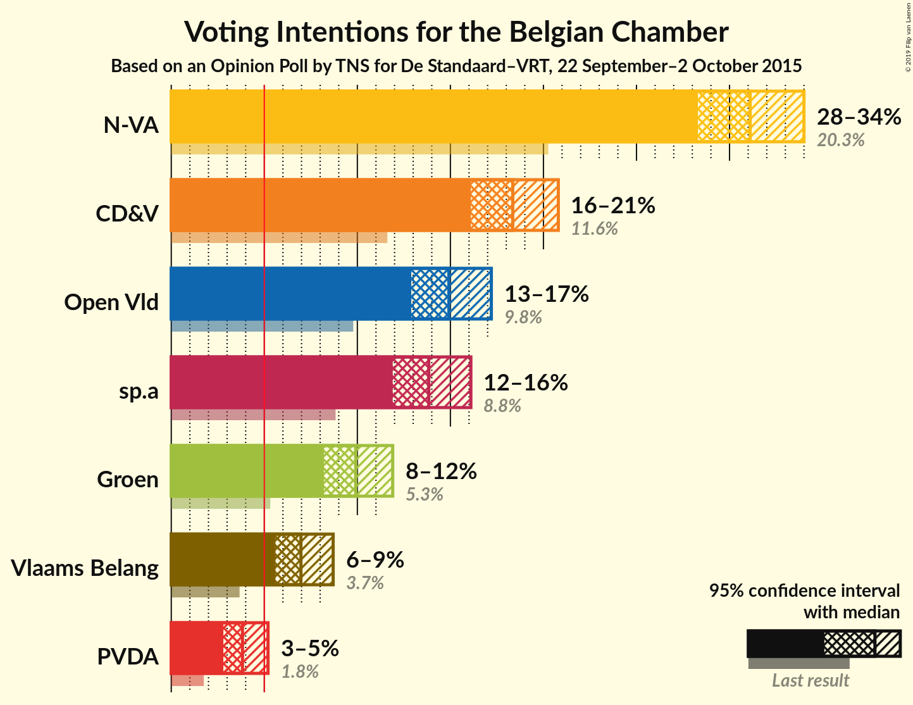
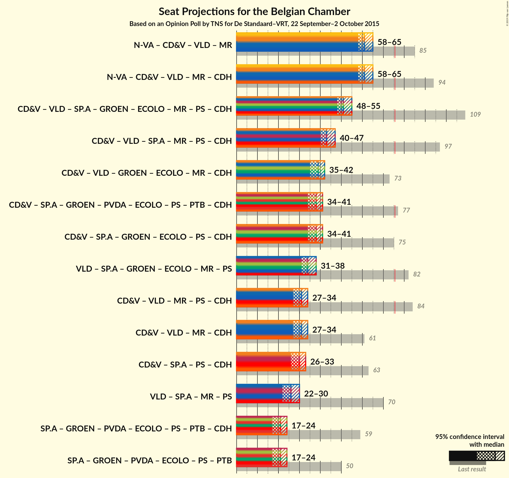

# Opinion Poll by TNS for De Standaard–VRT, 22 September–2 October 2015

<a href="#voting-intentions">Voting Intentions</a> | <a href="#seats">Seats</a> | <a href="#coalitions">Coalitions</a> | <a href="#technical-information">Technical Information</a>

## Voting Intentions

### Confidence Intervals

| Party | Last Result | Poll Result | 80% Confidence Interval | 90% Confidence Interval | 95% Confidence Interval | 99% Confidence Interval |
|:-----:|:-----------:|:-----------:|:-----------------------:|:-----------------------:|:-----------------------:|:-----------------------:|
| N-VA | 20.3% | 31.1% | 29.3–33.0% |28.8–33.6% |28.3–34.0% |27.5–34.9% |
| CD&V | 11.6% | 18.4% | 16.9–20.0% |16.4–20.5% |16.1–20.9% |15.4–21.7% |
| Open Vld | 9.8% | 14.9% | 13.6–16.4% |13.2–16.9% |12.8–17.2% |12.2–18.0% |
| sp.a | 8.8% | 13.8% | 12.5–15.3% |12.2–15.7% |11.8–16.1% |11.2–16.8% |
| Groen | 5.3% | 9.9% | 8.8–11.2% |8.5–11.6% |8.2–11.9% |7.7–12.6% |
| Vlaams Belang | 3.7% | 7.0% | 6.0–8.1% |5.8–8.4% |5.6–8.7% |5.1–9.3% |
| PVDA | 1.8% | 3.8% | 3.2–4.7% |3.0–5.0% |2.8–5.2% |2.5–5.7% |

*Note:* The poll result column reflects the actual value used in the calculations. Published results may vary slightly, and in addition be rounded to fewer digits.

## Seats

### Confidence Intervals

| Party | Last Result | Median | 80% Confidence Interval | 90% Confidence Interval | 95% Confidence Interval | 99% Confidence Interval |
|:-----:|:-----------:|:------:|:-----------------------:|:-----------------------:|:-----------------------:|:-----------------------:|
| <a href="#n-va">N-VA</a> | 33 | 31 | 29–33 |28–34 |28–34 |27–35 |
| <a href="#cd&v">CD&V</a> | 18 | 18 | 16–18 |15–19 |14–20 |13–21 |
| <a href="#open-vld">Open Vld</a> | 14 | 13 | 12–15 |12–16 |11–17 |11–18 |
| <a href="#sp.a">sp.a</a> | 13 | 13 | 11–13 |10–14 |9–15 |9–15 |
| <a href="#groen">Groen</a> | 6 | 8 | 6–10 |6–10 |6–11 |5–12 |
| <a href="#vlaams-belang">Vlaams Belang</a> | 3 | 5 | 3–7 |2–7 |2–7 |2–8 |
| <a href="#pvda">PVDA</a> | 0 | 0 | 0 |0 |0 |0 |

### N-VA

*For a full overview of the results for this party, see the [N-VA](party-nva.html) page.*

| Number of Seats | Probability | Accumulated | Special Marks |
|:---------------:|:-----------:|:-----------:|:-------------:|
| 25 | 0.1% | 100% |  |
| 26 | 0.4% | 99.9% |  |
| 27 | 2% | 99.5% |  |
| 28 | 5% | 98% |  |
| 29 | 20% | 92% |  |
| 30 | 19% | 72% |  |
| 31 | 29% | 53% | Median |
| 32 | 12% | 24% |  |
| 33 | 7% | 12% | Last Result |
| 34 | 5% | 5% |  |
| 35 | 0.5% | 0.8% |  |
| 36 | 0.3% | 0.3% |  |
| 37 | 0.1% | 0.1% |  |
| 38 | 0% | 0% |  |

### CD&V

*For a full overview of the results for this party, see the [CD&V](party-cdv.html) page.*

| Number of Seats | Probability | Accumulated | Special Marks |
|:---------------:|:-----------:|:-----------:|:-------------:|
| 13 | 1.4% | 100% |  |
| 14 | 3% | 98.6% |  |
| 15 | 5% | 95% |  |
| 16 | 14% | 91% |  |
| 17 | 15% | 77% |  |
| 18 | 54% | 62% | Last Result, Median |
| 19 | 5% | 8% |  |
| 20 | 1.3% | 3% |  |
| 21 | 1.0% | 1.2% |  |
| 22 | 0.3% | 0.3% |  |
| 23 | 0% | 0% |  |

### Open Vld

*For a full overview of the results for this party, see the [Open Vld](party-openvld.html) page.*

| Number of Seats | Probability | Accumulated | Special Marks |
|:---------------:|:-----------:|:-----------:|:-------------:|
| 11 | 4% | 100% |  |
| 12 | 24% | 96% |  |
| 13 | 50% | 72% | Median |
| 14 | 7% | 22% | Last Result |
| 15 | 6% | 15% |  |
| 16 | 4% | 9% |  |
| 17 | 4% | 5% |  |
| 18 | 0.7% | 0.7% |  |
| 19 | 0% | 0% |  |

### sp.a

*For a full overview of the results for this party, see the [sp.a](party-spa.html) page.*

| Number of Seats | Probability | Accumulated | Special Marks |
|:---------------:|:-----------:|:-----------:|:-------------:|
| 9 | 3% | 100% |  |
| 10 | 5% | 97% |  |
| 11 | 8% | 92% |  |
| 12 | 12% | 84% |  |
| 13 | 63% | 73% | Last Result, Median |
| 14 | 6% | 10% |  |
| 15 | 3% | 3% |  |
| 16 | 0.4% | 0.5% |  |
| 17 | 0.1% | 0.1% |  |
| 18 | 0% | 0% |  |

### Groen

*For a full overview of the results for this party, see the [Groen](party-groen.html) page.*

| Number of Seats | Probability | Accumulated | Special Marks |
|:---------------:|:-----------:|:-----------:|:-------------:|
| 5 | 1.3% | 100% |  |
| 6 | 17% | 98.7% | Last Result |
| 7 | 7% | 82% |  |
| 8 | 42% | 75% | Median |
| 9 | 18% | 33% |  |
| 10 | 11% | 15% |  |
| 11 | 2% | 3% |  |
| 12 | 0.9% | 0.9% |  |
| 13 | 0% | 0% |  |

### Vlaams Belang

*For a full overview of the results for this party, see the [Vlaams Belang](party-vlaamsbelang.html) page.*

| Number of Seats | Probability | Accumulated | Special Marks |
|:---------------:|:-----------:|:-----------:|:-------------:|
| 2 | 7% | 100% |  |
| 3 | 3% | 93% | Last Result |
| 4 | 7% | 90% |  |
| 5 | 44% | 83% | Median |
| 6 | 24% | 39% |  |
| 7 | 13% | 15% |  |
| 8 | 2% | 2% |  |
| 9 | 0% | 0% |  |

### PVDA

*For a full overview of the results for this party, see the [PVDA](party-pvda.html) page.*

| Number of Seats | Probability | Accumulated | Special Marks |
|:---------------:|:-----------:|:-----------:|:-------------:|
| 0 | 100% | 100% | Last Result, Median |

## Coalitions

### Confidence Intervals

| Coalition | Last Result | Median | Majority? | 80% Confidence Interval | 90% Confidence Interval | 95% Confidence Interval | 99% Confidence Interval |
|:---------:|:-----------:|:------:|:---------:|:-----------------------:|:-----------------------:|:-----------------------:|:-----------------------:|

## Technical Information

### Opinion Poll

+ **Pollster:** TNS
+ **Media:** De Standaard–VRT
+ **Fieldwork period:** 22 September–2 October 2015

### Calculations

+ **Sample size:** 1019
+ **Simulations done:** 0
+ **Error estimate:** 100.00%

