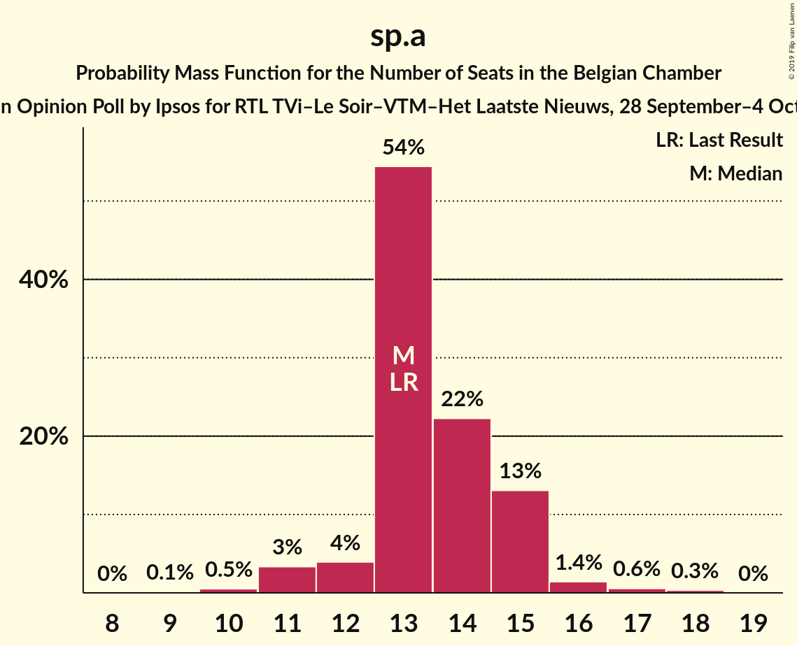
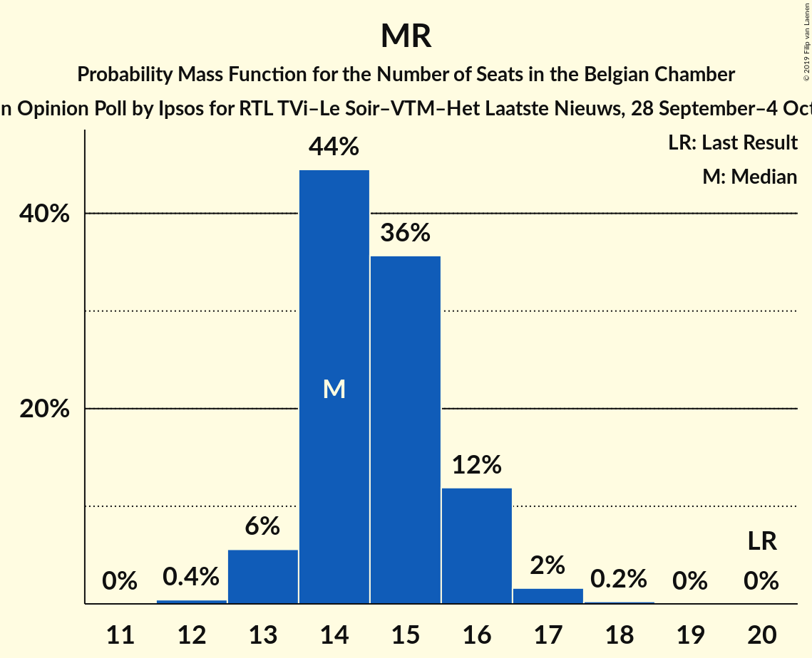
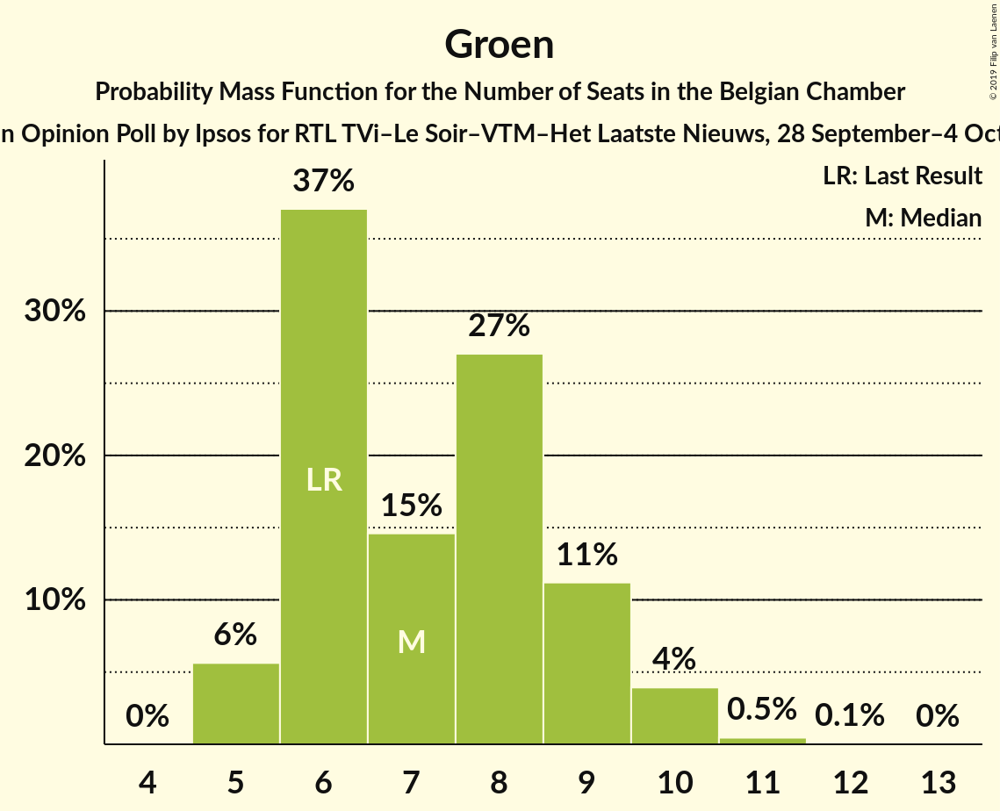
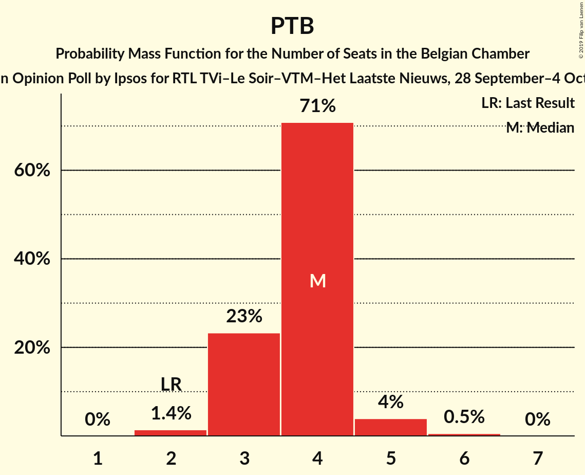
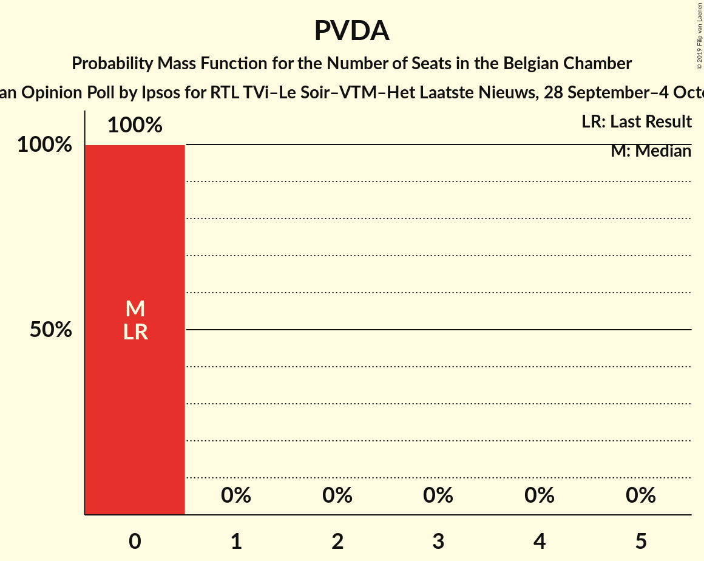
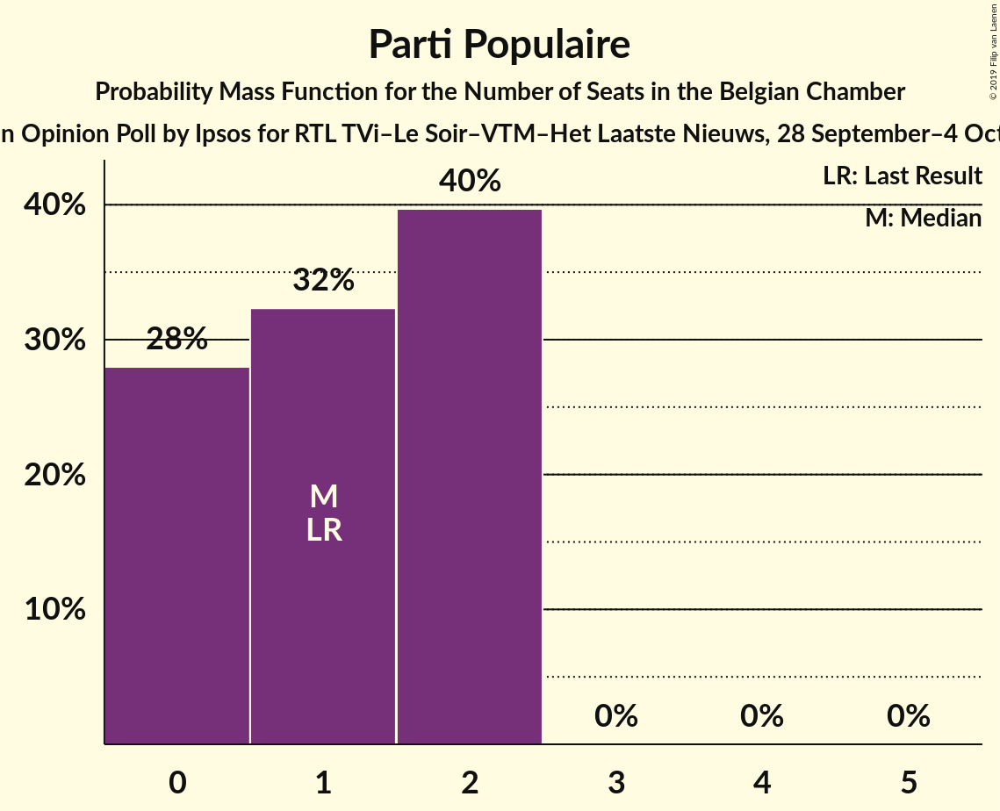

# Opinion Poll by Ipsos for RTL TVi–Le Soir–VTM–Het Laatste Nieuws, 28 September–4 October 2015

Areas included: Flanders, Wallonia

<a href="#voting-intentions">Voting Intentions</a> | <a href="#seats">Seats</a> | <a href="#coalitions">Coalitions</a> | <a href="#technical-information">Technical Information</a>

## Voting Intentions

### Confidence Intervals

| Party | Last Result | Poll Result | 80% Confidence Interval | 90% Confidence Interval | 95% Confidence Interval | 99% Confidence Interval |
|:-----:|:-----------:|:-----------:|:-----------------------:|:-----------------------:|:-----------------------:|:-----------------------:|
| N-VA | 20.3% | 19.3% | 18.0–20.1% |17.7–20.2% |17.5–20.3% |16.9–20.4% |
| CD&V | 11.6% | 11.9% | 10.8–12.6% |10.6–12.8% |10.4–12.8% |9.9–12.9% |
| sp.a | 8.8% | 9.7% | 8.8–10.3% |8.5–10.4% |8.3–10.5% |7.9–10.6% |
| PS | 11.7% | 8.6% | 7.9–8.6% |7.8–8.6% |7.7–8.6% |7.4–8.6% |
| Open Vld | 9.8% | 8.4% | 7.5–9.2% |7.3–9.3% |7.1–9.4% |6.7–9.5% |
| MR | 9.6% | 7.7% | 7.1–7.7% |6.9–7.8% |6.8–7.8% |6.6–7.8% |
| Vlaams Belang | 3.7% | 7.0% | 6.2–7.8% |6.0–8.0% |5.8–8.1% |5.5–8.2% |
| Groen | 5.3% | 6.0% | 5.3–6.7% |5.1–6.9% |4.9–7.0% |4.6–7.1% |
| cdH | 5.0% | 4.4% | 3.9–4.4% |3.8–4.4% |3.7–4.5% |3.5–4.5% |
| Ecolo | 3.3% | 3.0% | 2.6–3.0% |2.5–3.1% |2.4–3.1% |2.3–3.1% |
| PTB | 2.0% | 2.8% | 2.4–2.8% |2.3–2.9% |2.2–2.9% |2.1–2.9% |
| PVDA | 1.8% | 2.7% | 2.2–3.1% |2.1–3.2% |2.0–3.3% |1.8–3.3% |
| Parti Populaire | 1.5% | 1.6% | 1.2–1.6% |1.2–1.6% |1.1–1.6% |1.0–1.6% |
| DéFI | 1.8% | 0.6% | 0.4–0.6% |0.4–0.6% |0.3–0.6% |0.3–0.7% |

*Note:* The poll result column reflects the actual value used in the calculations. Published results may vary slightly, and in addition be rounded to fewer digits.

## Seats

### Confidence Intervals

| Party | Last Result | Median | 80% Confidence Interval | 90% Confidence Interval | 95% Confidence Interval | 99% Confidence Interval |
|:-----:|:-----------:|:------:|:-----------------------:|:-----------------------:|:-----------------------:|:-----------------------:|
| <a href="#n-va">N-VA</a> | 33 | 29 | 27–31 |26–31 |26–32 |24–33 |
| <a href="#cd&v">CD&V</a> | 18 | 18 | 15–18 |14–19 |14–19 |13–21 |
| <a href="#sp.a">sp.a</a> | 13 | 13 | 13–15 |12–15 |11–15 |10–17 |
| <a href="#ps">PS</a> | 23 | 17 | 16–18 |16–18 |15–18 |15–19 |
| <a href="#open-vld">Open Vld</a> | 14 | 12 | 11–12 |11–13 |9–13 |8–14 |
| <a href="#mr">MR</a> | 20 | 14 | 14–16 |13–16 |13–16 |13–17 |
| <a href="#vlaams-belang">Vlaams Belang</a> | 3 | 8 | 8–10 |8–11 |8–12 |7–12 |
| <a href="#groen">Groen</a> | 6 | 7 | 6–9 |5–9 |5–10 |5–11 |
| <a href="#cdh">cdH</a> | 9 | 7 | 7–8 |7–8 |7–9 |7–10 |
| <a href="#ecolo">Ecolo</a> | 6 | 5 | 4–5 |3–6 |3–6 |2–6 |
| <a href="#ptb">PTB</a> | 2 | 4 | 3–4 |3–4 |3–5 |2–6 |
| <a href="#pvda">PVDA</a> | 0 | 0 | 0 |0 |0 |0 |
| <a href="#parti-populaire">Parti Populaire</a> | 1 | 1 | 0–2 |0–2 |0–2 |0–2 |
| <a href="#défi">DéFI</a> | 2 | 0 | 0 |0 |0 |0 |

### N-VA

*For a full overview of the results for this party, see the [N-VA](party-n-va.html) page.*

| Number of Seats | Probability | Accumulated | Special Marks |
|:---------------:|:-----------:|:-----------:|:-------------:|
| 24 | 0.7% | 100% |  |
| 25 | 0.9% | 99.3% |  |
| 26 | 4% | 98% |  |
| 27 | 8% | 95% |  |
| 28 | 25% | 87% |  |
| 29 | 22% | 61% | Median |
| 30 | 21% | 39% |  |
| 31 | 14% | 18% |  |
| 32 | 3% | 4% |  |
| 33 | 0.7% | 1.1% | Last Result |
| 34 | 0.3% | 0.4% |  |
| 35 | 0.1% | 0.1% |  |
| 36 | 0% | 0% |  |

### CD&V

*For a full overview of the results for this party, see the [CD&V](party-cdv.html) page.*

| Number of Seats | Probability | Accumulated | Special Marks |
|:---------------:|:-----------:|:-----------:|:-------------:|
| 13 | 2% | 100% |  |
| 14 | 4% | 98% |  |
| 15 | 5% | 94% |  |
| 16 | 8% | 88% |  |
| 17 | 14% | 81% |  |
| 18 | 62% | 67% | Last Result, Median |
| 19 | 3% | 5% |  |
| 20 | 1.2% | 2% |  |
| 21 | 0.6% | 0.8% |  |
| 22 | 0.1% | 0.2% |  |
| 23 | 0% | 0% |  |

### sp.a

*For a full overview of the results for this party, see the [sp.a](party-spa.html) page.*

| Number of Seats | Probability | Accumulated | Special Marks |
|:---------------:|:-----------:|:-----------:|:-------------:|
| 9 | 0.1% | 100% |  |
| 10 | 0.5% | 99.9% |  |
| 11 | 3% | 99.3% |  |
| 12 | 4% | 96% |  |
| 13 | 57% | 92% | Last Result, Median |
| 14 | 20% | 35% |  |
| 15 | 13% | 16% |  |
| 16 | 1.5% | 2% |  |
| 17 | 0.6% | 0.9% |  |
| 18 | 0.3% | 0.3% |  |
| 19 | 0% | 0% |  |

### PS

*For a full overview of the results for this party, see the [PS](party-ps.html) page.*

| Number of Seats | Probability | Accumulated | Special Marks |
|:---------------:|:-----------:|:-----------:|:-------------:|
| 14 | 0.1% | 100% |  |
| 15 | 3% | 99.9% |  |
| 16 | 43% | 97% |  |
| 17 | 33% | 54% | Median |
| 18 | 19% | 21% |  |
| 19 | 2% | 2% |  |
| 20 | 0% | 0% |  |
| 21 | 0% | 0% |  |
| 22 | 0% | 0% |  |
| 23 | 0% | 0% | Last Result |

### Open Vld

*For a full overview of the results for this party, see the [Open Vld](party-openvld.html) page.*

| Number of Seats | Probability | Accumulated | Special Marks |
|:---------------:|:-----------:|:-----------:|:-------------:|
| 8 | 2% | 100% |  |
| 9 | 1.0% | 98% |  |
| 10 | 2% | 97% |  |
| 11 | 39% | 96% |  |
| 12 | 50% | 57% | Median |
| 13 | 6% | 7% |  |
| 14 | 0.7% | 1.0% | Last Result |
| 15 | 0.2% | 0.3% |  |
| 16 | 0.1% | 0.1% |  |
| 17 | 0% | 0% |  |

### MR

*For a full overview of the results for this party, see the [MR](party-mr.html) page.*

| Number of Seats | Probability | Accumulated | Special Marks |
|:---------------:|:-----------:|:-----------:|:-------------:|
| 12 | 0.4% | 100% |  |
| 13 | 6% | 99.6% |  |
| 14 | 47% | 94% | Median |
| 15 | 34% | 47% |  |
| 16 | 10% | 12% |  |
| 17 | 2% | 2% |  |
| 18 | 0.2% | 0.3% |  |
| 19 | 0% | 0% |  |
| 20 | 0% | 0% | Last Result |

### Vlaams Belang

*For a full overview of the results for this party, see the [Vlaams Belang](party-vlaamsbelang.html) page.*

| Number of Seats | Probability | Accumulated | Special Marks |
|:---------------:|:-----------:|:-----------:|:-------------:|
| 3 | 0% | 100% | Last Result |
| 4 | 0% | 100% |  |
| 5 | 0% | 100% |  |
| 6 | 0.1% | 100% |  |
| 7 | 2% | 99.9% |  |
| 8 | 79% | 98% | Median |
| 9 | 7% | 19% |  |
| 10 | 3% | 12% |  |
| 11 | 4% | 9% |  |
| 12 | 5% | 5% |  |
| 13 | 0.2% | 0.2% |  |
| 14 | 0% | 0% |  |

### Groen

*For a full overview of the results for this party, see the [Groen](party-groen.html) page.*

| Number of Seats | Probability | Accumulated | Special Marks |
|:---------------:|:-----------:|:-----------:|:-------------:|
| 5 | 6% | 100% |  |
| 6 | 34% | 94% | Last Result |
| 7 | 16% | 60% | Median |
| 8 | 29% | 44% |  |
| 9 | 11% | 16% |  |
| 10 | 4% | 4% |  |
| 11 | 0.5% | 0.5% |  |
| 12 | 0.1% | 0.1% |  |
| 13 | 0% | 0% |  |

### cdH

*For a full overview of the results for this party, see the [cdH](party-cdh.html) page.*

| Number of Seats | Probability | Accumulated | Special Marks |
|:---------------:|:-----------:|:-----------:|:-------------:|
| 5 | 0.1% | 100% |  |
| 6 | 0.3% | 99.9% |  |
| 7 | 85% | 99.6% | Median |
| 8 | 10% | 14% |  |
| 9 | 2% | 4% | Last Result |
| 10 | 2% | 2% |  |
| 11 | 0.2% | 0.2% |  |
| 12 | 0% | 0% |  |

### Ecolo

*For a full overview of the results for this party, see the [Ecolo](party-ecolo.html) page.*

| Number of Seats | Probability | Accumulated | Special Marks |
|:---------------:|:-----------:|:-----------:|:-------------:|
| 1 | 0.1% | 100% |  |
| 2 | 2% | 99.9% |  |
| 3 | 6% | 98% |  |
| 4 | 29% | 92% |  |
| 5 | 57% | 63% | Median |
| 6 | 7% | 7% | Last Result |
| 7 | 0% | 0% |  |

### PTB

*For a full overview of the results for this party, see the [PTB](party-ptb.html) page.*

| Number of Seats | Probability | Accumulated | Special Marks |
|:---------------:|:-----------:|:-----------:|:-------------:|
| 2 | 1.1% | 100% | Last Result |
| 3 | 23% | 98.9% |  |
| 4 | 72% | 76% | Median |
| 5 | 4% | 4% |  |
| 6 | 0.6% | 0.6% |  |
| 7 | 0% | 0% |  |

### PVDA

*For a full overview of the results for this party, see the [PVDA](party-pvda.html) page.*

| Number of Seats | Probability | Accumulated | Special Marks |
|:---------------:|:-----------:|:-----------:|:-------------:|
| 0 | 100% | 100% | Last Result, Median |

### Parti Populaire

*For a full overview of the results for this party, see the [Parti Populaire](party-partipopulaire.html) page.*

| Number of Seats | Probability | Accumulated | Special Marks |
|:---------------:|:-----------:|:-----------:|:-------------:|
| 0 | 28% | 100% |  |
| 1 | 31% | 72% | Last Result, Median |
| 2 | 40% | 40% |  |
| 3 | 0% | 0% |  |

### DéFI

*For a full overview of the results for this party, see the [DéFI](party-défi.html) page.*

| Number of Seats | Probability | Accumulated | Special Marks |
|:---------------:|:-----------:|:-----------:|:-------------:|
| 0 | 100% | 100% | Median |
| 1 | 0% | 0% |  |
| 2 | 0% | 0% | Last Result |

## Coalitions

### Confidence Intervals

| Coalition | Last Result | Median | Majority? | 80% Confidence Interval | 90% Confidence Interval | 95% Confidence Interval | 99% Confidence Interval |
|:---------:|:-----------:|:------:|:---------:|:-----------------------:|:-----------------------:|:-----------------------:|:-----------------------:|
| CD&V – sp.a – PS – Open Vld – MR – Groen – cdH – Ecolo | 109 | 93 | 100% | 90–95 | 89–96 | 89–96 | 87–97 |
| CD&V – sp.a – PS – Open Vld – MR – cdH | 97 | 81 | 99.4% | 78–83 | 77–84 | 77–85 | 75–86 |
| N-VA – CD&V – Open Vld – MR – cdH | 94 | 80 | 98% | 77–82 | 77–82 | 76–83 | 74–84 |
| N-VA – CD&V – Open Vld – MR | 85 | 73 | 3% | 70–75 | 70–75 | 69–76 | 67–77 |
| CD&V – sp.a – PS – Groen – cdH – Ecolo – PTB – PVDA | 77 | 70 | 0.4% | 68–73 | 67–73 | 66–74 | 65–75 |
| sp.a – PS – Open Vld – MR – Groen – Ecolo | 82 | 68 | 0% | 66–70 | 65–71 | 64–72 | 63–73 |
| CD&V – PS – Open Vld – MR – cdH | 84 | 68 | 0% | 65–69 | 64–70 | 63–71 | 62–72 |
| CD&V – sp.a – PS – Groen – cdH – Ecolo | 75 | 67 | 0% | 64–69 | 63–70 | 62–70 | 61–72 |
| sp.a – PS – Open Vld – MR | 70 | 56 | 0% | 54–58 | 54–59 | 53–60 | 52–61 |
| CD&V – sp.a – PS – cdH | 63 | 55 | 0% | 52–57 | 51–58 | 51–58 | 50–60 |
| sp.a – PS – Groen – cdH – Ecolo – PTB – PVDA | 59 | 53 | 0% | 51–55 | 50–56 | 50–57 | 48–58 |
| CD&V – Open Vld – MR – cdH | 61 | 51 | 0% | 48–53 | 47–53 | 47–54 | 46–55 |
| sp.a – PS – Groen – Ecolo – PTB – PVDA | 50 | 46 | 0% | 44–48 | 43–49 | 42–49 | 41–51 |
| CD&V – Open Vld – MR – Groen – cdH – Ecolo | 73 | 26 | 0% | 25–27 | 25–28 | 25–28 | 24–29 |

### CD&V – sp.a – PS – Open Vld – MR – Groen – cdH – Ecolo

| Number of Seats | Probability | Accumulated | Special Marks |
|:---------------:|:-----------:|:-----------:|:-------------:|
| 86 | 0.1% | 100% |  |
| 87 | 0.5% | 99.8% |  |
| 88 | 1.3% | 99.3% |  |
| 89 | 3% | 98% |  |
| 90 | 8% | 95% |  |
| 91 | 15% | 87% |  |
| 92 | 19% | 72% |  |
| 93 | 21% | 54% | Median |
| 94 | 17% | 33% |  |
| 95 | 10% | 16% |  |
| 96 | 4% | 6% |  |
| 97 | 1.3% | 2% |  |
| 98 | 0.3% | 0.4% |  |
| 99 | 0.1% | 0.1% |  |
| 100 | 0% | 0% |  |
| 101 | 0% | 0% |  |
| 102 | 0% | 0% |  |
| 103 | 0% | 0% |  |
| 104 | 0% | 0% |  |
| 105 | 0% | 0% |  |
| 106 | 0% | 0% |  |
| 107 | 0% | 0% |  |
| 108 | 0% | 0% |  |
| 109 | 0% | 0% | Last Result |

### CD&V – sp.a – PS – Open Vld – MR – cdH

| Number of Seats | Probability | Accumulated | Special Marks |
|:---------------:|:-----------:|:-----------:|:-------------:|
| 74 | 0.1% | 100% |  |
| 75 | 0.5% | 99.9% |  |
| 76 | 1.4% | 99.4% | Majority |
| 77 | 3% | 98% |  |
| 78 | 6% | 95% |  |
| 79 | 12% | 89% |  |
| 80 | 19% | 78% |  |
| 81 | 23% | 59% | Median |
| 82 | 19% | 36% |  |
| 83 | 10% | 17% |  |
| 84 | 5% | 8% |  |
| 85 | 2% | 3% |  |
| 86 | 0.6% | 0.8% |  |
| 87 | 0.2% | 0.2% |  |
| 88 | 0% | 0% |  |
| 89 | 0% | 0% |  |
| 90 | 0% | 0% |  |
| 91 | 0% | 0% |  |
| 92 | 0% | 0% |  |
| 93 | 0% | 0% |  |
| 94 | 0% | 0% |  |
| 95 | 0% | 0% |  |
| 96 | 0% | 0% |  |
| 97 | 0% | 0% | Last Result |

### N-VA – CD&V – Open Vld – MR – cdH

| Number of Seats | Probability | Accumulated | Special Marks |
|:---------------:|:-----------:|:-----------:|:-------------:|
| 73 | 0.1% | 100% |  |
| 74 | 0.4% | 99.8% |  |
| 75 | 1.0% | 99.4% |  |
| 76 | 2% | 98% | Majority |
| 77 | 7% | 96% |  |
| 78 | 11% | 89% |  |
| 79 | 21% | 78% |  |
| 80 | 26% | 57% | Median |
| 81 | 18% | 31% |  |
| 82 | 9% | 13% |  |
| 83 | 3% | 5% |  |
| 84 | 1.1% | 2% |  |
| 85 | 0.3% | 0.4% |  |
| 86 | 0.1% | 0.1% |  |
| 87 | 0% | 0% |  |
| 88 | 0% | 0% |  |
| 89 | 0% | 0% |  |
| 90 | 0% | 0% |  |
| 91 | 0% | 0% |  |
| 92 | 0% | 0% |  |
| 93 | 0% | 0% |  |
| 94 | 0% | 0% | Last Result |

### N-VA – CD&V – Open Vld – MR

| Number of Seats | Probability | Accumulated | Special Marks |
|:---------------:|:-----------:|:-----------:|:-------------:|
| 66 | 0.2% | 100% |  |
| 67 | 0.5% | 99.8% |  |
| 68 | 1.2% | 99.2% |  |
| 69 | 3% | 98% |  |
| 70 | 7% | 95% |  |
| 71 | 13% | 88% |  |
| 72 | 22% | 75% |  |
| 73 | 25% | 53% | Median |
| 74 | 17% | 28% |  |
| 75 | 7% | 11% |  |
| 76 | 2% | 3% | Majority |
| 77 | 0.7% | 0.9% |  |
| 78 | 0.2% | 0.2% |  |
| 79 | 0% | 0% |  |
| 80 | 0% | 0% |  |
| 81 | 0% | 0% |  |
| 82 | 0% | 0% |  |
| 83 | 0% | 0% |  |
| 84 | 0% | 0% |  |
| 85 | 0% | 0% | Last Result |

### CD&V – sp.a – PS – Groen – cdH – Ecolo – PTB – PVDA

| Number of Seats | Probability | Accumulated | Special Marks |
|:---------------:|:-----------:|:-----------:|:-------------:|
| 63 | 0.1% | 100% |  |
| 64 | 0.3% | 99.9% |  |
| 65 | 0.8% | 99.6% |  |
| 66 | 2% | 98.7% |  |
| 67 | 4% | 97% |  |
| 68 | 10% | 92% |  |
| 69 | 15% | 83% |  |
| 70 | 20% | 68% |  |
| 71 | 21% | 48% | Median |
| 72 | 14% | 27% |  |
| 73 | 8% | 13% |  |
| 74 | 3% | 5% |  |
| 75 | 1.1% | 1.4% |  |
| 76 | 0.3% | 0.4% | Majority |
| 77 | 0.1% | 0.1% | Last Result |
| 78 | 0% | 0% |  |

### sp.a – PS – Open Vld – MR – Groen – Ecolo

| Number of Seats | Probability | Accumulated | Special Marks |
|:---------------:|:-----------:|:-----------:|:-------------:|
| 61 | 0.1% | 100% |  |
| 62 | 0.2% | 99.9% |  |
| 63 | 0.8% | 99.7% |  |
| 64 | 2% | 98.9% |  |
| 65 | 5% | 97% |  |
| 66 | 11% | 91% |  |
| 67 | 18% | 80% |  |
| 68 | 22% | 62% | Median |
| 69 | 19% | 41% |  |
| 70 | 12% | 21% |  |
| 71 | 6% | 9% |  |
| 72 | 2% | 4% |  |
| 73 | 0.9% | 1.2% |  |
| 74 | 0.3% | 0.3% |  |
| 75 | 0.1% | 0.1% |  |
| 76 | 0% | 0% | Majority |
| 77 | 0% | 0% |  |
| 78 | 0% | 0% |  |
| 79 | 0% | 0% |  |
| 80 | 0% | 0% |  |
| 81 | 0% | 0% |  |
| 82 | 0% | 0% | Last Result |

### CD&V – PS – Open Vld – MR – cdH

| Number of Seats | Probability | Accumulated | Special Marks |
|:---------------:|:-----------:|:-----------:|:-------------:|
| 61 | 0.2% | 100% |  |
| 62 | 0.7% | 99.8% |  |
| 63 | 2% | 99.1% |  |
| 64 | 4% | 97% |  |
| 65 | 6% | 93% |  |
| 66 | 14% | 87% |  |
| 67 | 22% | 74% |  |
| 68 | 26% | 52% | Median |
| 69 | 17% | 26% |  |
| 70 | 6% | 9% |  |
| 71 | 2% | 3% |  |
| 72 | 0.8% | 1.1% |  |
| 73 | 0.2% | 0.3% |  |
| 74 | 0% | 0.1% |  |
| 75 | 0% | 0% |  |
| 76 | 0% | 0% | Majority |
| 77 | 0% | 0% |  |
| 78 | 0% | 0% |  |
| 79 | 0% | 0% |  |
| 80 | 0% | 0% |  |
| 81 | 0% | 0% |  |
| 82 | 0% | 0% |  |
| 83 | 0% | 0% |  |
| 84 | 0% | 0% | Last Result |

### CD&V – sp.a – PS – Groen – cdH – Ecolo

| Number of Seats | Probability | Accumulated | Special Marks |
|:---------------:|:-----------:|:-----------:|:-------------:|
| 59 | 0% | 100% |  |
| 60 | 0.2% | 99.9% |  |
| 61 | 0.7% | 99.7% |  |
| 62 | 2% | 99.0% |  |
| 63 | 4% | 97% |  |
| 64 | 9% | 94% |  |
| 65 | 14% | 85% |  |
| 66 | 19% | 71% |  |
| 67 | 22% | 52% | Median |
| 68 | 16% | 30% |  |
| 69 | 9% | 15% |  |
| 70 | 4% | 6% |  |
| 71 | 1.4% | 2% |  |
| 72 | 0.4% | 0.5% |  |
| 73 | 0.1% | 0.1% |  |
| 74 | 0% | 0% |  |
| 75 | 0% | 0% | Last Result |

### sp.a – PS – Open Vld – MR

| Number of Seats | Probability | Accumulated | Special Marks |
|:---------------:|:-----------:|:-----------:|:-------------:|
| 50 | 0.1% | 100% |  |
| 51 | 0.4% | 99.9% |  |
| 52 | 1.2% | 99.5% |  |
| 53 | 3% | 98% |  |
| 54 | 9% | 95% |  |
| 55 | 18% | 86% |  |
| 56 | 25% | 69% | Median |
| 57 | 23% | 44% |  |
| 58 | 12% | 21% |  |
| 59 | 6% | 9% |  |
| 60 | 2% | 3% |  |
| 61 | 0.7% | 0.9% |  |
| 62 | 0.2% | 0.2% |  |
| 63 | 0% | 0% |  |
| 64 | 0% | 0% |  |
| 65 | 0% | 0% |  |
| 66 | 0% | 0% |  |
| 67 | 0% | 0% |  |
| 68 | 0% | 0% |  |
| 69 | 0% | 0% |  |
| 70 | 0% | 0% | Last Result |

### CD&V – sp.a – PS – cdH

| Number of Seats | Probability | Accumulated | Special Marks |
|:---------------:|:-----------:|:-----------:|:-------------:|
| 48 | 0.1% | 100% |  |
| 49 | 0.3% | 99.9% |  |
| 50 | 1.4% | 99.6% |  |
| 51 | 3% | 98% |  |
| 52 | 6% | 95% |  |
| 53 | 11% | 89% |  |
| 54 | 21% | 78% |  |
| 55 | 23% | 56% | Median |
| 56 | 18% | 33% |  |
| 57 | 9% | 15% |  |
| 58 | 4% | 6% |  |
| 59 | 1.4% | 2% |  |
| 60 | 0.4% | 0.5% |  |
| 61 | 0.1% | 0.1% |  |
| 62 | 0% | 0% |  |
| 63 | 0% | 0% | Last Result |

### sp.a – PS – Groen – cdH – Ecolo – PTB – PVDA

| Number of Seats | Probability | Accumulated | Special Marks |
|:---------------:|:-----------:|:-----------:|:-------------:|
| 47 | 0.1% | 100% |  |
| 48 | 0.5% | 99.9% |  |
| 49 | 2% | 99.4% |  |
| 50 | 5% | 98% |  |
| 51 | 12% | 92% |  |
| 52 | 21% | 81% |  |
| 53 | 24% | 60% | Median |
| 54 | 17% | 36% |  |
| 55 | 11% | 18% |  |
| 56 | 5% | 8% |  |
| 57 | 2% | 3% |  |
| 58 | 0.6% | 0.8% |  |
| 59 | 0.1% | 0.2% | Last Result |
| 60 | 0% | 0.1% |  |
| 61 | 0% | 0% |  |

### CD&V – Open Vld – MR – cdH

| Number of Seats | Probability | Accumulated | Special Marks |
|:---------------:|:-----------:|:-----------:|:-------------:|
| 44 | 0% | 100% |  |
| 45 | 0.3% | 99.9% |  |
| 46 | 1.5% | 99.6% |  |
| 47 | 3% | 98% |  |
| 48 | 5% | 95% |  |
| 49 | 8% | 90% |  |
| 50 | 23% | 82% |  |
| 51 | 30% | 59% | Median |
| 52 | 18% | 29% |  |
| 53 | 7% | 11% |  |
| 54 | 3% | 4% |  |
| 55 | 1.0% | 1.3% |  |
| 56 | 0.3% | 0.4% |  |
| 57 | 0.1% | 0.1% |  |
| 58 | 0% | 0% |  |
| 59 | 0% | 0% |  |
| 60 | 0% | 0% |  |
| 61 | 0% | 0% | Last Result |

### sp.a – PS – Groen – Ecolo – PTB – PVDA

| Number of Seats | Probability | Accumulated | Special Marks |
|:---------------:|:-----------:|:-----------:|:-------------:|
| 39 | 0.1% | 100% |  |
| 40 | 0.2% | 99.9% |  |
| 41 | 0.8% | 99.7% |  |
| 42 | 2% | 98.9% |  |
| 43 | 6% | 97% |  |
| 44 | 13% | 90% |  |
| 45 | 22% | 77% |  |
| 46 | 24% | 56% | Median |
| 47 | 16% | 32% |  |
| 48 | 9% | 16% |  |
| 49 | 4% | 6% |  |
| 50 | 1.5% | 2% | Last Result |
| 51 | 0.4% | 0.6% |  |
| 52 | 0.1% | 0.1% |  |
| 53 | 0% | 0% |  |

### CD&V – Open Vld – MR – Groen – cdH – Ecolo

| Number of Seats | Probability | Accumulated | Special Marks |
|:---------------:|:-----------:|:-----------:|:-------------:|
| 24 | 0.7% | 100% |  |
| 25 | 19% | 99.3% |  |
| 26 | 34% | 81% |  |
| 27 | 39% | 46% |  |
| 28 | 6% | 7% |  |
| 29 | 0.9% | 0.9% |  |
| 30 | 0.1% | 0.1% |  |
| 31 | 0% | 0% |  |
| 32 | 0% | 0% |  |
| 33 | 0% | 0% |  |
| 34 | 0% | 0% |  |
| 35 | 0% | 0% |  |
| 36 | 0% | 0% |  |
| 37 | 0% | 0% |  |
| 38 | 0% | 0% |  |
| 39 | 0% | 0% |  |
| 40 | 0% | 0% |  |
| 41 | 0% | 0% |  |
| 42 | 0% | 0% |  |
| 43 | 0% | 0% |  |
| 44 | 0% | 0% |  |
| 45 | 0% | 0% |  |
| 46 | 0% | 0% |  |
| 47 | 0% | 0% |  |
| 48 | 0% | 0% |  |
| 49 | 0% | 0% |  |
| 50 | 0% | 0% |  |
| 51 | 0% | 0% |  |
| 52 | 0% | 0% |  |
| 53 | 0% | 0% |  |
| 54 | 0% | 0% |  |
| 55 | 0% | 0% |  |
| 56 | 0% | 0% |  |
| 57 | 0% | 0% |  |
| 58 | 0% | 0% |  |
| 59 | 0% | 0% |  |
| 60 | 0% | 0% |  |
| 61 | 0% | 0% |  |
| 62 | 0% | 0% |  |
| 63 | 0% | 0% | Median |
| 64 | 0% | 0% |  |
| 65 | 0% | 0% |  |
| 66 | 0% | 0% |  |
| 67 | 0% | 0% |  |
| 68 | 0% | 0% |  |
| 69 | 0% | 0% |  |
| 70 | 0% | 0% |  |
| 71 | 0% | 0% |  |
| 72 | 0% | 0% |  |
| 73 | 0% | 0% | Last Result |

## Technical Information

### Opinion Poll

+ **Polling firm:** Ipsos
+ **Commissioner(s):** RTL TVi–Le Soir–VTM–Het Laatste Nieuws
+ **Fieldwork period:** 28 September–4 October 2015

### Calculations

+ **Sample size:** 1542
+ **Simulations done:** 1,048,576
+ **Error estimate:** 1.48%

