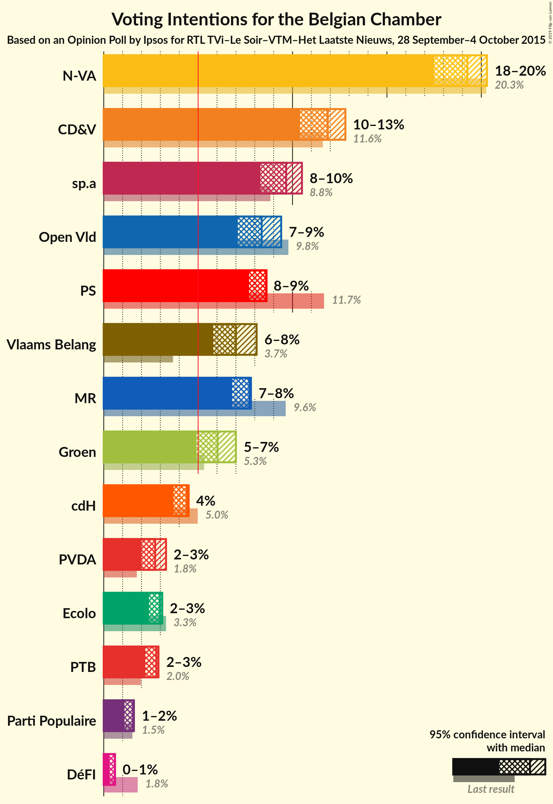
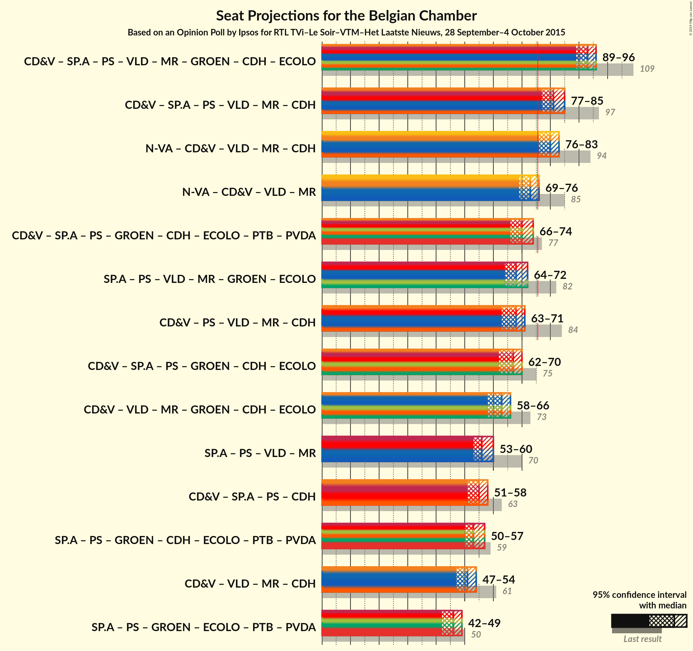

# Opinion Poll by Ipsos for RTL TVi–Le Soir–VTM–Het Laatste Nieuws, 28 September–4 October 2015

Areas included: Flanders

<a href="#voting-intentions">Voting Intentions</a> | <a href="#seats">Seats</a> | <a href="#coalitions">Coalitions</a> | <a href="#technical-information">Technical Information</a>

## Voting Intentions

### Confidence Intervals

| Party | Last Result | Poll Result | 80% Confidence Interval | 90% Confidence Interval | 95% Confidence Interval | 99% Confidence Interval |
|:-----:|:-----------:|:-----------:|:-----------------------:|:-----------------------:|:-----------------------:|:-----------------------:|
| N-VA | 20.3% | 28.8% | 27.1–30.7% |26.6–31.2% |26.1–31.7% |25.3–32.6% |
| CD&V | 11.6% | 17.8% | 16.3–19.4% |15.9–19.8% |15.5–20.2% |14.9–21.0% |
| sp.a | 8.8% | 14.5% | 13.1–16.0% |12.8–16.4% |12.4–16.8% |11.8–17.5% |
| Open Vld | 9.8% | 12.5% | 11.3–13.9% |10.9–14.3% |10.6–14.7% |10.1–15.4% |
| Vlaams Belang | 3.7% | 10.5% | 9.3–11.8% |9.0–12.2% |8.7–12.5% |8.2–13.2% |
| Groen | 5.3% | 9.0% | 8.0–10.3% |7.7–10.6% |7.4–10.9% |7.0–11.6% |
| PVDA | 1.8% | 4.1% | 3.4–5.0% |3.2–5.2% |3.0–5.5% |2.7–5.9% |

*Note:* The poll result column reflects the actual value used in the calculations. Published results may vary slightly, and in addition be rounded to fewer digits.

## Seats

### Confidence Intervals

| Party | Last Result | Median | 80% Confidence Interval | 90% Confidence Interval | 95% Confidence Interval | 99% Confidence Interval |
|:-----:|:-----------:|:------:|:-----------------------:|:-----------------------:|:-----------------------:|:-----------------------:|
| <a href="#n-va">N-VA</a> | 33 | 29 | 27–31 |27–31 |26–32 |24–33 |
| <a href="#cd&v">CD&V</a> | 18 | 18 | 16–18 |15–19 |14–19 |13–21 |
| <a href="#sp.a">sp.a</a> | 13 | 13 | 13–15 |12–15 |11–16 |10–17 |
| <a href="#open-vld">Open Vld</a> | 14 | 12 | 11–12 |10–13 |10–13 |8–14 |
| <a href="#vlaams-belang">Vlaams Belang</a> | 3 | 8 | 8–10 |8–11 |8–12 |7–12 |
| <a href="#groen">Groen</a> | 6 | 7 | 6–9 |5–9 |5–10 |5–11 |
| <a href="#pvda">PVDA</a> | 0 | 0 | 0 |0 |0 |0 |

### N-VA

*For a full overview of the results for this party, see the [N-VA](party-nva.html) page.*

| Number of Seats | Probability | Accumulated | Special Marks |
|:---------------:|:-----------:|:-----------:|:-------------:|
| 24 | 0.8% | 100% |  |
| 25 | 0.8% | 99.2% |  |
| 26 | 3% | 98% |  |
| 27 | 9% | 96% |  |
| 28 | 22% | 87% |  |
| 29 | 25% | 65% | Median |
| 30 | 22% | 40% |  |
| 31 | 14% | 18% |  |
| 32 | 3% | 4% |  |
| 33 | 0.7% | 1.0% | Last Result |
| 34 | 0.2% | 0.3% |  |
| 35 | 0% | 0% |  |

### CD&V

*For a full overview of the results for this party, see the [CD&V](party-cdv.html) page.*

| Number of Seats | Probability | Accumulated | Special Marks |
|:---------------:|:-----------:|:-----------:|:-------------:|
| 13 | 2% | 100% |  |
| 14 | 3% | 98% |  |
| 15 | 5% | 96% |  |
| 16 | 9% | 91% |  |
| 17 | 18% | 82% |  |
| 18 | 57% | 64% | Last Result, Median |
| 19 | 4% | 7% |  |
| 20 | 2% | 2% |  |
| 21 | 0.5% | 0.7% |  |
| 22 | 0.2% | 0.2% |  |
| 23 | 0% | 0% |  |

### sp.a

*For a full overview of the results for this party, see the [sp.a](party-spa.html) page.*

| Number of Seats | Probability | Accumulated | Special Marks |
|:---------------:|:-----------:|:-----------:|:-------------:|
| 9 | 0.1% | 100% |  |
| 10 | 0.7% | 99.9% |  |
| 11 | 4% | 99.3% |  |
| 12 | 2% | 95% |  |
| 13 | 67% | 93% | Last Result, Median |
| 14 | 12% | 26% |  |
| 15 | 11% | 14% |  |
| 16 | 3% | 3% |  |
| 17 | 0.6% | 0.9% |  |
| 18 | 0.2% | 0.2% |  |
| 19 | 0% | 0% |  |

### Open Vld

*For a full overview of the results for this party, see the [Open Vld](party-openvld.html) page.*

| Number of Seats | Probability | Accumulated | Special Marks |
|:---------------:|:-----------:|:-----------:|:-------------:|
| 8 | 1.2% | 100% |  |
| 9 | 1.1% | 98.8% |  |
| 10 | 3% | 98% |  |
| 11 | 40% | 95% |  |
| 12 | 48% | 55% | Median |
| 13 | 6% | 7% |  |
| 14 | 0.7% | 1.0% | Last Result |
| 15 | 0.2% | 0.3% |  |
| 16 | 0.1% | 0.1% |  |
| 17 | 0% | 0% |  |

### Vlaams Belang

*For a full overview of the results for this party, see the [Vlaams Belang](party-vlaamsbelang.html) page.*

| Number of Seats | Probability | Accumulated | Special Marks |
|:---------------:|:-----------:|:-----------:|:-------------:|
| 3 | 0% | 100% | Last Result |
| 4 | 0% | 100% |  |
| 5 | 0% | 100% |  |
| 6 | 0.1% | 100% |  |
| 7 | 2% | 99.9% |  |
| 8 | 78% | 98% | Median |
| 9 | 8% | 20% |  |
| 10 | 4% | 11% |  |
| 11 | 3% | 8% |  |
| 12 | 5% | 5% |  |
| 13 | 0.2% | 0.2% |  |
| 14 | 0% | 0% |  |

### Groen

*For a full overview of the results for this party, see the [Groen](party-groen.html) page.*

| Number of Seats | Probability | Accumulated | Special Marks |
|:---------------:|:-----------:|:-----------:|:-------------:|
| 5 | 5% | 100% |  |
| 6 | 30% | 95% | Last Result |
| 7 | 22% | 64% | Median |
| 8 | 26% | 43% |  |
| 9 | 13% | 17% |  |
| 10 | 4% | 4% |  |
| 11 | 0.5% | 0.5% |  |
| 12 | 0.1% | 0.1% |  |
| 13 | 0% | 0% |  |

### PVDA

*For a full overview of the results for this party, see the [PVDA](party-pvda.html) page.*

| Number of Seats | Probability | Accumulated | Special Marks |
|:---------------:|:-----------:|:-----------:|:-------------:|
| 0 | 100% | 100% | Last Result, Median |

## Coalitions

### Confidence Intervals

| Coalition | Last Result | Median | Majority? | 80% Confidence Interval | 90% Confidence Interval | 95% Confidence Interval | 99% Confidence Interval |
|:---------:|:-----------:|:------:|:---------:|:-----------------------:|:-----------------------:|:-----------------------:|:-----------------------:|

## Technical Information

### Opinion Poll

+ **Pollster:** Ipsos
+ **Media:** RTL TVi–Le Soir–VTM–Het Laatste Nieuws
+ **Fieldwork period:** 28 September–4 October 2015

### Calculations

+ **Sample size:** 1030
+ **Simulations done:** 2,097,152
+ **Error estimate:** 0.93%

