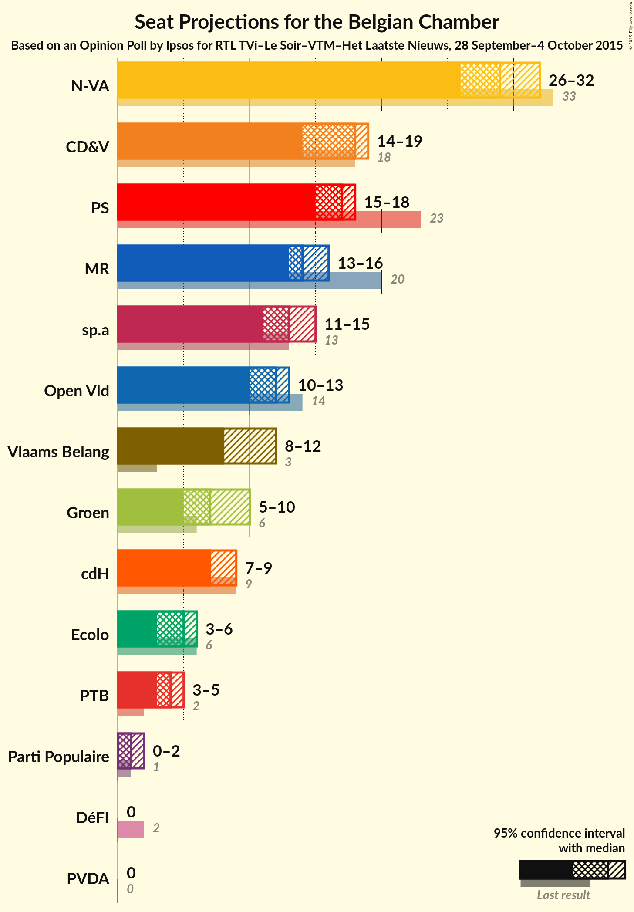
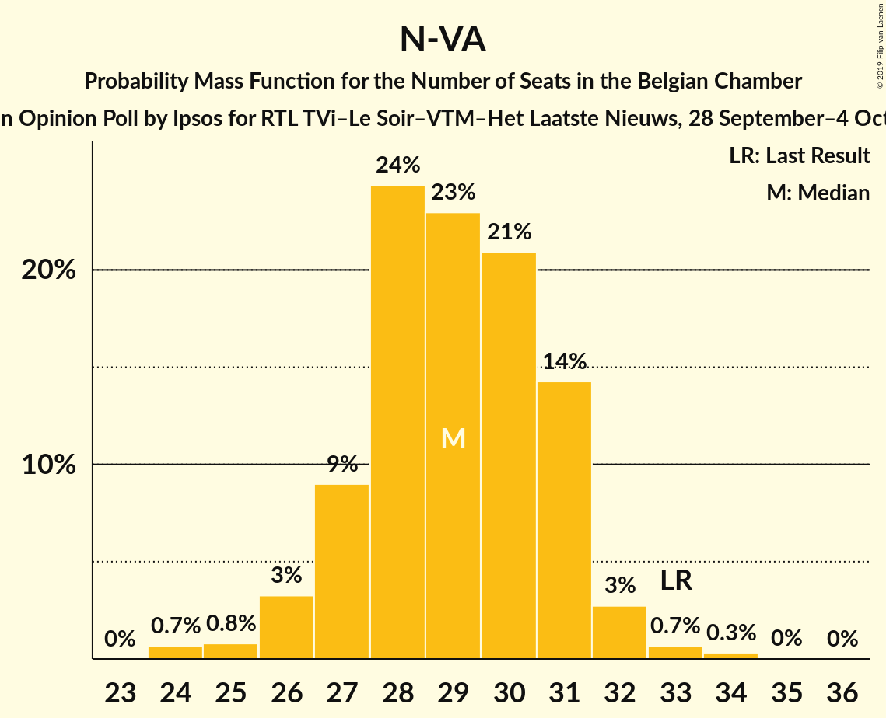
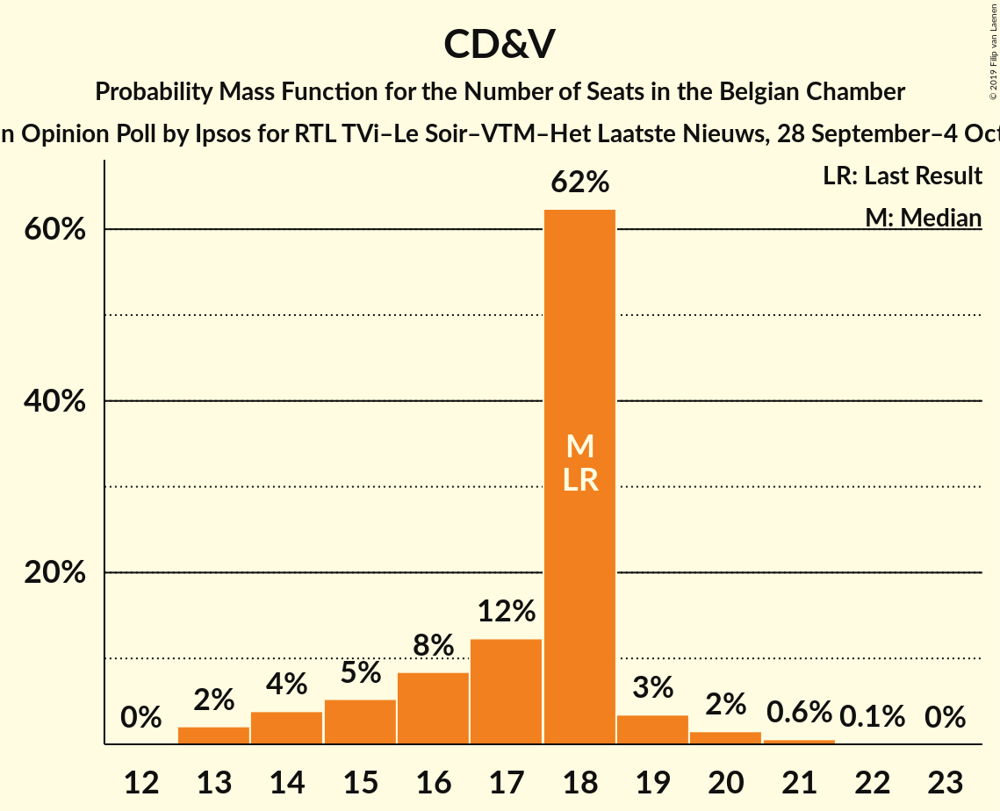
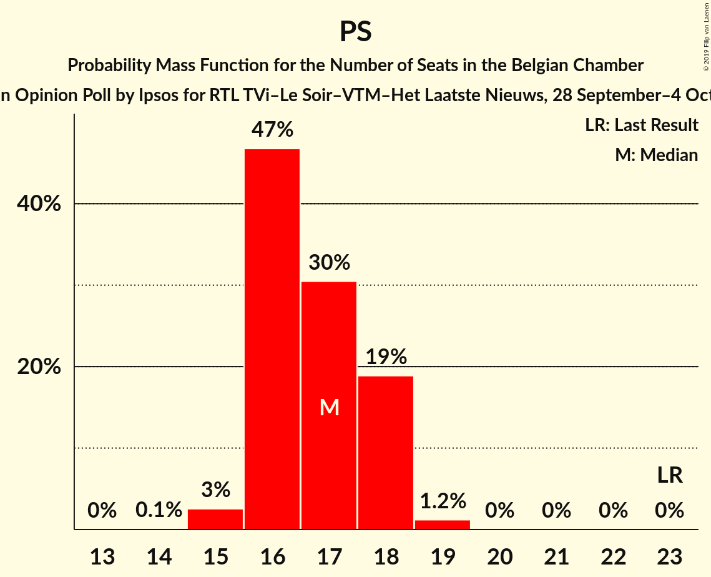
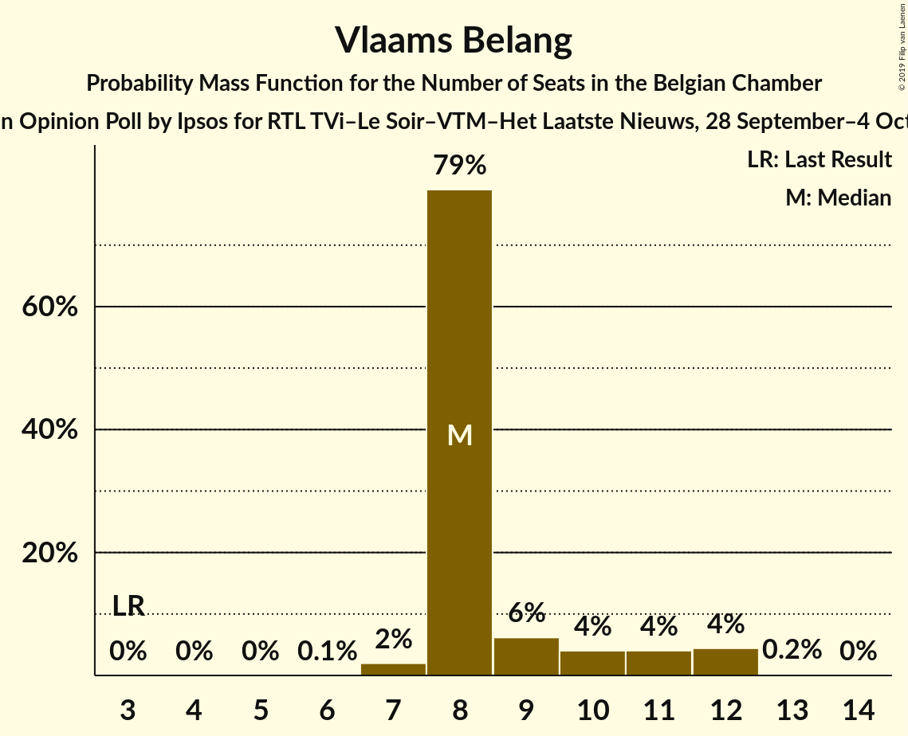
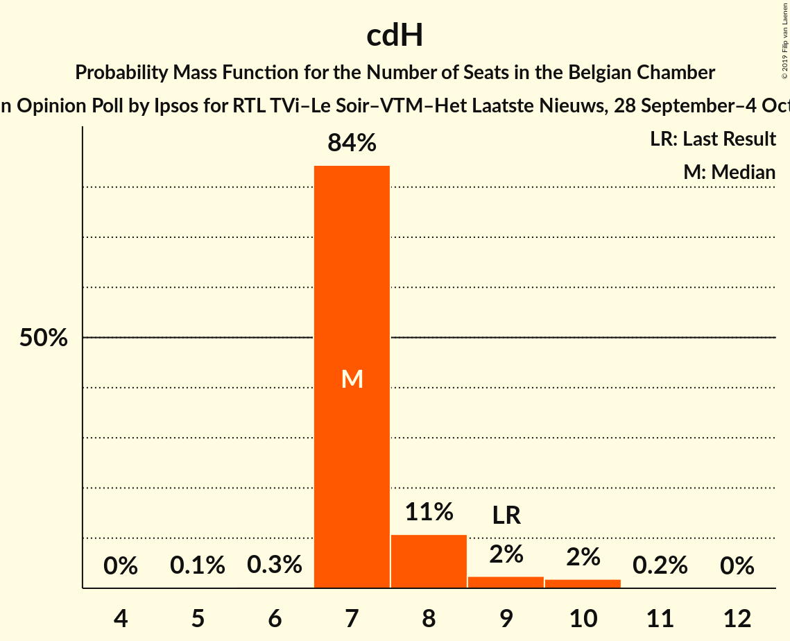

# Opinion Poll by Ipsos for RTL TVi–Le Soir–VTM–Het Laatste Nieuws, 28 September–4 October 2015

Areas included: Flanders, Wallonia

<a href="#voting-intentions">Voting Intentions</a> | <a href="#seats">Seats</a> | <a href="#coalitions">Coalitions</a> | <a href="#technical-information">Technical Information</a>

## Voting Intentions

### Confidence Intervals

| Party | Last Result | Poll Result | 80% Confidence Interval | 90% Confidence Interval | 95% Confidence Interval | 99% Confidence Interval |
|:-----:|:-----------:|:-----------:|:-----------------------:|:-----------------------:|:-----------------------:|:-----------------------:|
| N-VA | 20.3% | 19.3% | 27.1–30.7% |26.6–31.2% |26.1–31.7% |25.3–32.6% |
| CD&V | 11.6% | 11.9% | 16.3–19.4% |15.9–19.8% |15.5–20.2% |14.9–21.0% |
| sp.a | 8.8% | 9.7% | 13.1–16.0% |12.8–16.4% |12.4–16.8% |11.8–17.5% |
| PS | 11.7% | 8.6% | N/A |N/A |N/A |N/A |
| Open Vld | 9.8% | 8.4% | 11.3–13.9% |10.9–14.3% |10.6–14.7% |10.1–15.4% |
| MR | 9.6% | 7.7% | N/A |N/A |N/A |N/A |
| Vlaams Belang | 3.7% | 7.0% | 9.3–11.8% |9.0–12.2% |8.7–12.5% |8.2–13.2% |
| Groen | 5.3% | 6.0% | 8.0–10.3% |7.7–10.6% |7.4–10.9% |7.0–11.6% |
| cdH | 5.0% | 4.4% | N/A |N/A |N/A |N/A |
| Ecolo | 3.3% | 3.0% | N/A |N/A |N/A |N/A |
| PTB | 2.0% | 2.8% | N/A |N/A |N/A |N/A |
| PVDA | 1.8% | 2.7% | 3.4–5.0% |3.2–5.2% |3.0–5.5% |2.7–5.9% |
| Parti Populaire | 1.5% | 1.6% | N/A |N/A |N/A |N/A |
| DéFI | 1.8% | 0.6% | N/A |N/A |N/A |N/A |

*Note:* The poll result column reflects the actual value used in the calculations. Published results may vary slightly, and in addition be rounded to fewer digits.

## Seats

### Confidence Intervals

| Party | Last Result | Median | 80% Confidence Interval | 90% Confidence Interval | 95% Confidence Interval | 99% Confidence Interval |
|:-----:|:-----------:|:------:|:-----------------------:|:-----------------------:|:-----------------------:|:-----------------------:|
| <a href="#n-va">N-VA</a> | 33 | 29 | 27–31 |26–31 |26–32 |24–33 |
| <a href="#cd&v">CD&V</a> | 18 | 18 | 15–18 |14–19 |14–19 |13–21 |
| <a href="#sp.a">sp.a</a> | 13 | 13 | 13–15 |12–15 |11–15 |10–17 |
| <a href="#ps">PS</a> | 23 | 18 | 17–18 |17–18 |17–19 |16–19 |
| <a href="#open-vld">Open Vld</a> | 14 | 12 | 11–12 |11–13 |9–13 |8–14 |
| <a href="#mr">MR</a> | 20 | 14 | 14–18 |14–19 |11–19 |11–19 |
| <a href="#vlaams-belang">Vlaams Belang</a> | 3 | 8 | 8–10 |8–11 |8–12 |7–12 |
| <a href="#groen">Groen</a> | 6 | 7 | 6–9 |5–9 |5–10 |5–11 |
| <a href="#cdh">cdH</a> | 9 | 7 | 7–8 |7–8 |7–8 |7–11 |
| <a href="#ecolo">Ecolo</a> | 6 | 5 | 2–5 |2–5 |2–5 |1–6 |
| <a href="#ptb">PTB</a> | 2 | 3 | 2–4 |2–4 |2–4 |2–6 |
| <a href="#pvda">PVDA</a> | 0 | 0 | 0 |0 |0 |0 |
| <a href="#parti-populaire">Parti Populaire</a> | 1 | 0 | 0–2 |0–2 |0–2 |0–2 |
| <a href="#défi">DéFI</a> | 2 | 0 | 0 |0 |0 |0 |

### N-VA

*For a full overview of the results for this party, see the [N-VA](party-n-va.html) page.*

| Number of Seats | Probability | Accumulated | Special Marks |
|:---------------:|:-----------:|:-----------:|:-------------:|
| 24 | 0.7% | 100% |  |
| 25 | 0.9% | 99.3% |  |
| 26 | 4% | 98% |  |
| 27 | 8% | 95% |  |
| 28 | 25% | 87% |  |
| 29 | 22% | 61% | Median |
| 30 | 21% | 39% |  |
| 31 | 14% | 18% |  |
| 32 | 3% | 4% |  |
| 33 | 0.7% | 1.1% | Last Result |
| 34 | 0.3% | 0.4% |  |
| 35 | 0.1% | 0.1% |  |
| 36 | 0% | 0% |  |

### CD&V

*For a full overview of the results for this party, see the [CD&V](party-cdv.html) page.*

| Number of Seats | Probability | Accumulated | Special Marks |
|:---------------:|:-----------:|:-----------:|:-------------:|
| 13 | 2% | 100% |  |
| 14 | 4% | 98% |  |
| 15 | 5% | 94% |  |
| 16 | 8% | 88% |  |
| 17 | 14% | 81% |  |
| 18 | 62% | 67% | Last Result, Median |
| 19 | 3% | 5% |  |
| 20 | 1.2% | 2% |  |
| 21 | 0.6% | 0.8% |  |
| 22 | 0.1% | 0.2% |  |
| 23 | 0% | 0% |  |

### sp.a

*For a full overview of the results for this party, see the [sp.a](party-spa.html) page.*

| Number of Seats | Probability | Accumulated | Special Marks |
|:---------------:|:-----------:|:-----------:|:-------------:|
| 9 | 0.1% | 100% |  |
| 10 | 0.5% | 99.9% |  |
| 11 | 3% | 99.3% |  |
| 12 | 4% | 96% |  |
| 13 | 57% | 92% | Last Result, Median |
| 14 | 20% | 35% |  |
| 15 | 13% | 16% |  |
| 16 | 1.5% | 2% |  |
| 17 | 0.6% | 0.9% |  |
| 18 | 0.3% | 0.3% |  |
| 19 | 0% | 0% |  |

### PS

*For a full overview of the results for this party, see the [PS](party-ps.html) page.*

| Number of Seats | Probability | Accumulated | Special Marks |
|:---------------:|:-----------:|:-----------:|:-------------:|
| 14 | 0% | 100% |  |
| 15 | 0.4% | 99.9% |  |
| 16 | 2% | 99.5% |  |
| 17 | 24% | 98% |  |
| 18 | 71% | 74% | Median |
| 19 | 3% | 3% |  |
| 20 | 0.1% | 0.1% |  |
| 21 | 0% | 0% |  |
| 22 | 0% | 0% |  |
| 23 | 0% | 0% | Last Result |

### Open Vld

*For a full overview of the results for this party, see the [Open Vld](party-openvld.html) page.*

| Number of Seats | Probability | Accumulated | Special Marks |
|:---------------:|:-----------:|:-----------:|:-------------:|
| 8 | 2% | 100% |  |
| 9 | 1.0% | 98% |  |
| 10 | 2% | 97% |  |
| 11 | 39% | 96% |  |
| 12 | 50% | 57% | Median |
| 13 | 6% | 7% |  |
| 14 | 0.7% | 1.0% | Last Result |
| 15 | 0.2% | 0.3% |  |
| 16 | 0.1% | 0.1% |  |
| 17 | 0% | 0% |  |

### MR

*For a full overview of the results for this party, see the [MR](party-mr.html) page.*

| Number of Seats | Probability | Accumulated | Special Marks |
|:---------------:|:-----------:|:-----------:|:-------------:|
| 11 | 3% | 100% |  |
| 12 | 0.5% | 97% |  |
| 13 | 0.1% | 97% |  |
| 14 | 75% | 96% | Median |
| 15 | 0.2% | 22% |  |
| 16 | 0.1% | 22% |  |
| 17 | 0% | 22% |  |
| 18 | 15% | 22% |  |
| 19 | 6% | 6% |  |
| 20 | 0% | 0% | Last Result |

### Vlaams Belang

*For a full overview of the results for this party, see the [Vlaams Belang](party-vlaamsbelang.html) page.*

| Number of Seats | Probability | Accumulated | Special Marks |
|:---------------:|:-----------:|:-----------:|:-------------:|
| 3 | 0% | 100% | Last Result |
| 4 | 0% | 100% |  |
| 5 | 0% | 100% |  |
| 6 | 0.1% | 100% |  |
| 7 | 2% | 99.9% |  |
| 8 | 79% | 98% | Median |
| 9 | 7% | 19% |  |
| 10 | 3% | 12% |  |
| 11 | 4% | 9% |  |
| 12 | 5% | 5% |  |
| 13 | 0.2% | 0.2% |  |
| 14 | 0% | 0% |  |

### Groen

*For a full overview of the results for this party, see the [Groen](party-groen.html) page.*

| Number of Seats | Probability | Accumulated | Special Marks |
|:---------------:|:-----------:|:-----------:|:-------------:|
| 5 | 6% | 100% |  |
| 6 | 34% | 94% | Last Result |
| 7 | 16% | 60% | Median |
| 8 | 29% | 44% |  |
| 9 | 11% | 16% |  |
| 10 | 4% | 4% |  |
| 11 | 0.5% | 0.5% |  |
| 12 | 0.1% | 0.1% |  |
| 13 | 0% | 0% |  |

### cdH

*For a full overview of the results for this party, see the [cdH](party-cdh.html) page.*

| Number of Seats | Probability | Accumulated | Special Marks |
|:---------------:|:-----------:|:-----------:|:-------------:|
| 5 | 0.2% | 100% |  |
| 6 | 0% | 99.8% |  |
| 7 | 79% | 99.8% | Median |
| 8 | 19% | 20% |  |
| 9 | 0% | 2% | Last Result |
| 10 | 0.1% | 2% |  |
| 11 | 1.4% | 1.4% |  |
| 12 | 0% | 0% |  |

### Ecolo

*For a full overview of the results for this party, see the [Ecolo](party-ecolo.html) page.*

| Number of Seats | Probability | Accumulated | Special Marks |
|:---------------:|:-----------:|:-----------:|:-------------:|
| 1 | 0.8% | 100% |  |
| 2 | 23% | 99.2% |  |
| 3 | 0% | 76% |  |
| 4 | 0.1% | 76% |  |
| 5 | 74% | 76% | Median |
| 6 | 2% | 2% | Last Result |
| 7 | 0% | 0% |  |

### PTB

*For a full overview of the results for this party, see the [PTB](party-ptb.html) page.*

| Number of Seats | Probability | Accumulated | Special Marks |
|:---------------:|:-----------:|:-----------:|:-------------:|
| 2 | 35% | 100% | Last Result |
| 3 | 22% | 65% | Median |
| 4 | 41% | 43% |  |
| 5 | 0.7% | 2% |  |
| 6 | 0.9% | 0.9% |  |
| 7 | 0% | 0% |  |

### PVDA

*For a full overview of the results for this party, see the [PVDA](party-pvda.html) page.*

| Number of Seats | Probability | Accumulated | Special Marks |
|:---------------:|:-----------:|:-----------:|:-------------:|
| 0 | 100% | 100% | Last Result, Median |

### Parti Populaire

*For a full overview of the results for this party, see the [Parti Populaire](party-partipopulaire.html) page.*

| Number of Seats | Probability | Accumulated | Special Marks |
|:---------------:|:-----------:|:-----------:|:-------------:|
| 0 | 59% | 100% | Median |
| 1 | 3% | 41% | Last Result |
| 2 | 38% | 38% |  |
| 3 | 0% | 0% |  |

### DéFI

*For a full overview of the results for this party, see the [DéFI](party-défi.html) page.*

| Number of Seats | Probability | Accumulated | Special Marks |
|:---------------:|:-----------:|:-----------:|:-------------:|
| 0 | 100% | 100% | Median |
| 1 | 0% | 0% |  |
| 2 | 0% | 0% | Last Result |

## Coalitions

### Confidence Intervals

| Coalition | Last Result | Median | Majority? | 80% Confidence Interval | 90% Confidence Interval | 95% Confidence Interval | 99% Confidence Interval |
|:---------:|:-----------:|:------:|:---------:|:-----------------------:|:-----------------------:|:-----------------------:|:-----------------------:|
| CD&V – sp.a – PS – Open Vld – MR – Groen – cdH – Ecolo | 109 | 94 | 100% | 91–96 | 91–96 | 90–97 | 88–98 |
| CD&V – sp.a – PS – Open Vld – MR – cdH | 97 | 82 | 99.9% | 79–86 | 78–86 | 78–87 | 77–88 |
| N-VA – CD&V – Open Vld – MR – cdH | 94 | 80 | 98% | 77–84 | 76–85 | 76–86 | 74–87 |
| N-VA – CD&V – Open Vld – MR | 85 | 72 | 16% | 70–77 | 69–77 | 68–78 | 67–79 |
| CD&V – sp.a – PS – Groen – cdH – Ecolo – PTB – PVDA | 77 | 70 | 1.0% | 67–73 | 66–74 | 65–75 | 64–76 |
| sp.a – PS – Open Vld – MR – Groen – Ecolo | 82 | 69 | 0% | 67–71 | 66–72 | 65–73 | 62–74 |
| CD&V – PS – Open Vld – MR – cdH | 84 | 68 | 0.2% | 66–72 | 65–73 | 64–73 | 63–74 |
| CD&V – sp.a – PS – Groen – cdH – Ecolo | 75 | 68 | 0% | 64–70 | 63–71 | 62–71 | 61–72 |
| sp.a – PS – Open Vld – MR | 70 | 57 | 0% | 55–60 | 54–61 | 54–62 | 52–63 |
| CD&V – sp.a – PS – cdH | 63 | 56 | 0% | 53–58 | 53–58 | 52–59 | 51–60 |
| sp.a – PS – Groen – cdH – Ecolo – PTB – PVDA | 59 | 53 | 0% | 50–56 | 49–57 | 49–57 | 47–59 |
| CD&V – Open Vld – MR – cdH | 61 | 50 | 0% | 48–55 | 47–56 | 46–56 | 45–57 |
| sp.a – PS – Groen – Ecolo – PTB – PVDA | 50 | 46 | 0% | 42–49 | 42–49 | 41–50 | 40–51 |
| CD&V – Open Vld – MR – Groen – cdH – Ecolo | 73 | 26 | 0% | 26–28 | 26–28 | 24–28 | 23–28 |

### CD&V – sp.a – PS – Open Vld – MR – Groen – cdH – Ecolo

| Number of Seats | Probability | Accumulated | Special Marks |
|:---------------:|:-----------:|:-----------:|:-------------:|
| 86 | 0% | 100% |  |
| 87 | 0.1% | 99.9% |  |
| 88 | 0.5% | 99.8% |  |
| 89 | 1.4% | 99.3% |  |
| 90 | 3% | 98% |  |
| 91 | 6% | 95% |  |
| 92 | 15% | 89% |  |
| 93 | 20% | 74% |  |
| 94 | 19% | 55% | Median |
| 95 | 21% | 35% |  |
| 96 | 9% | 14% |  |
| 97 | 3% | 5% |  |
| 98 | 0.9% | 1.2% |  |
| 99 | 0.2% | 0.2% |  |
| 100 | 0% | 0% |  |
| 101 | 0% | 0% |  |
| 102 | 0% | 0% |  |
| 103 | 0% | 0% |  |
| 104 | 0% | 0% |  |
| 105 | 0% | 0% |  |
| 106 | 0% | 0% |  |
| 107 | 0% | 0% |  |
| 108 | 0% | 0% |  |
| 109 | 0% | 0% | Last Result |

### CD&V – sp.a – PS – Open Vld – MR – cdH

| Number of Seats | Probability | Accumulated | Special Marks |
|:---------------:|:-----------:|:-----------:|:-------------:|
| 75 | 0.1% | 100% |  |
| 76 | 0.3% | 99.9% | Majority |
| 77 | 2% | 99.6% |  |
| 78 | 3% | 98% |  |
| 79 | 6% | 95% |  |
| 80 | 8% | 89% |  |
| 81 | 23% | 81% |  |
| 82 | 23% | 58% | Median |
| 83 | 10% | 35% |  |
| 84 | 7% | 25% |  |
| 85 | 8% | 19% |  |
| 86 | 7% | 11% |  |
| 87 | 2% | 4% |  |
| 88 | 1.3% | 2% |  |
| 89 | 0.4% | 0.5% |  |
| 90 | 0.1% | 0.1% |  |
| 91 | 0% | 0% |  |
| 92 | 0% | 0% |  |
| 93 | 0% | 0% |  |
| 94 | 0% | 0% |  |
| 95 | 0% | 0% |  |
| 96 | 0% | 0% |  |
| 97 | 0% | 0% | Last Result |

### N-VA – CD&V – Open Vld – MR – cdH

| Number of Seats | Probability | Accumulated | Special Marks |
|:---------------:|:-----------:|:-----------:|:-------------:|
| 72 | 0.1% | 100% |  |
| 73 | 0.2% | 99.9% |  |
| 74 | 0.7% | 99.7% |  |
| 75 | 1.4% | 99.1% |  |
| 76 | 3% | 98% | Majority |
| 77 | 9% | 95% |  |
| 78 | 12% | 86% |  |
| 79 | 23% | 74% |  |
| 80 | 20% | 51% | Median |
| 81 | 8% | 31% |  |
| 82 | 5% | 24% |  |
| 83 | 4% | 19% |  |
| 84 | 7% | 15% |  |
| 85 | 6% | 8% |  |
| 86 | 2% | 3% |  |
| 87 | 0.5% | 0.7% |  |
| 88 | 0.1% | 0.1% |  |
| 89 | 0% | 0% |  |
| 90 | 0% | 0% |  |
| 91 | 0% | 0% |  |
| 92 | 0% | 0% |  |
| 93 | 0% | 0% |  |
| 94 | 0% | 0% | Last Result |

### N-VA – CD&V – Open Vld – MR

| Number of Seats | Probability | Accumulated | Special Marks |
|:---------------:|:-----------:|:-----------:|:-------------:|
| 65 | 0.1% | 100% |  |
| 66 | 0.3% | 99.9% |  |
| 67 | 0.9% | 99.6% |  |
| 68 | 2% | 98.7% |  |
| 69 | 4% | 97% |  |
| 70 | 9% | 93% |  |
| 71 | 11% | 85% |  |
| 72 | 23% | 73% |  |
| 73 | 20% | 50% | Median |
| 74 | 8% | 29% |  |
| 75 | 5% | 21% |  |
| 76 | 6% | 16% | Majority |
| 77 | 6% | 10% |  |
| 78 | 3% | 4% |  |
| 79 | 0.9% | 1.2% |  |
| 80 | 0.2% | 0.3% |  |
| 81 | 0% | 0.1% |  |
| 82 | 0% | 0% |  |
| 83 | 0% | 0% |  |
| 84 | 0% | 0% |  |
| 85 | 0% | 0% | Last Result |

### CD&V – sp.a – PS – Groen – cdH – Ecolo – PTB – PVDA

| Number of Seats | Probability | Accumulated | Special Marks |
|:---------------:|:-----------:|:-----------:|:-------------:|
| 62 | 0.1% | 100% |  |
| 63 | 0.2% | 99.9% |  |
| 64 | 0.6% | 99.7% |  |
| 65 | 2% | 99.0% |  |
| 66 | 4% | 97% |  |
| 67 | 6% | 94% |  |
| 68 | 11% | 88% |  |
| 69 | 12% | 77% |  |
| 70 | 16% | 65% |  |
| 71 | 16% | 50% | Median |
| 72 | 13% | 33% |  |
| 73 | 12% | 20% |  |
| 74 | 5% | 8% |  |
| 75 | 3% | 4% |  |
| 76 | 0.7% | 1.0% | Majority |
| 77 | 0.2% | 0.3% | Last Result |
| 78 | 0.1% | 0.1% |  |
| 79 | 0% | 0% |  |

### sp.a – PS – Open Vld – MR – Groen – Ecolo

| Number of Seats | Probability | Accumulated | Special Marks |
|:---------------:|:-----------:|:-----------:|:-------------:|
| 60 | 0.1% | 100% |  |
| 61 | 0.2% | 99.9% |  |
| 62 | 0.3% | 99.8% |  |
| 63 | 0.6% | 99.5% |  |
| 64 | 0.8% | 98.9% |  |
| 65 | 2% | 98% |  |
| 66 | 3% | 96% |  |
| 67 | 9% | 93% |  |
| 68 | 19% | 84% |  |
| 69 | 21% | 64% | Median |
| 70 | 27% | 43% |  |
| 71 | 9% | 17% |  |
| 72 | 5% | 8% |  |
| 73 | 2% | 3% |  |
| 74 | 0.5% | 0.7% |  |
| 75 | 0.2% | 0.2% |  |
| 76 | 0% | 0% | Majority |
| 77 | 0% | 0% |  |
| 78 | 0% | 0% |  |
| 79 | 0% | 0% |  |
| 80 | 0% | 0% |  |
| 81 | 0% | 0% |  |
| 82 | 0% | 0% | Last Result |

### CD&V – PS – Open Vld – MR – cdH

| Number of Seats | Probability | Accumulated | Special Marks |
|:---------------:|:-----------:|:-----------:|:-------------:|
| 61 | 0% | 100% |  |
| 62 | 0.1% | 99.9% |  |
| 63 | 0.6% | 99.9% |  |
| 64 | 2% | 99.3% |  |
| 65 | 4% | 97% |  |
| 66 | 5% | 93% |  |
| 67 | 9% | 88% |  |
| 68 | 31% | 79% |  |
| 69 | 23% | 48% | Median |
| 70 | 4% | 25% |  |
| 71 | 3% | 20% |  |
| 72 | 9% | 17% |  |
| 73 | 7% | 8% |  |
| 74 | 0.8% | 1.2% |  |
| 75 | 0.2% | 0.4% |  |
| 76 | 0.1% | 0.2% | Majority |
| 77 | 0% | 0% |  |
| 78 | 0% | 0% |  |
| 79 | 0% | 0% |  |
| 80 | 0% | 0% |  |
| 81 | 0% | 0% |  |
| 82 | 0% | 0% |  |
| 83 | 0% | 0% |  |
| 84 | 0% | 0% | Last Result |

### CD&V – sp.a – PS – Groen – cdH – Ecolo

| Number of Seats | Probability | Accumulated | Special Marks |
|:---------------:|:-----------:|:-----------:|:-------------:|
| 59 | 0.1% | 100% |  |
| 60 | 0.3% | 99.9% |  |
| 61 | 0.6% | 99.6% |  |
| 62 | 2% | 99.0% |  |
| 63 | 4% | 97% |  |
| 64 | 6% | 94% |  |
| 65 | 9% | 88% |  |
| 66 | 14% | 79% |  |
| 67 | 14% | 65% |  |
| 68 | 19% | 51% | Median |
| 69 | 19% | 32% |  |
| 70 | 7% | 13% |  |
| 71 | 4% | 6% |  |
| 72 | 1.1% | 1.4% |  |
| 73 | 0.3% | 0.4% |  |
| 74 | 0.1% | 0.1% |  |
| 75 | 0% | 0% | Last Result |

### sp.a – PS – Open Vld – MR

| Number of Seats | Probability | Accumulated | Special Marks |
|:---------------:|:-----------:|:-----------:|:-------------:|
| 51 | 0.1% | 100% |  |
| 52 | 0.4% | 99.9% |  |
| 53 | 1.3% | 99.5% |  |
| 54 | 4% | 98% |  |
| 55 | 5% | 95% |  |
| 56 | 19% | 90% |  |
| 57 | 30% | 70% | Median |
| 58 | 11% | 41% |  |
| 59 | 11% | 30% |  |
| 60 | 10% | 19% |  |
| 61 | 5% | 9% |  |
| 62 | 2% | 4% |  |
| 63 | 1.0% | 1.4% |  |
| 64 | 0.3% | 0.4% |  |
| 65 | 0.1% | 0.1% |  |
| 66 | 0% | 0% |  |
| 67 | 0% | 0% |  |
| 68 | 0% | 0% |  |
| 69 | 0% | 0% |  |
| 70 | 0% | 0% | Last Result |

### CD&V – sp.a – PS – cdH

| Number of Seats | Probability | Accumulated | Special Marks |
|:---------------:|:-----------:|:-----------:|:-------------:|
| 49 | 0.1% | 100% |  |
| 50 | 0.2% | 99.9% |  |
| 51 | 0.8% | 99.7% |  |
| 52 | 3% | 98.9% |  |
| 53 | 6% | 96% |  |
| 54 | 9% | 90% |  |
| 55 | 17% | 81% |  |
| 56 | 35% | 64% | Median |
| 57 | 18% | 30% |  |
| 58 | 8% | 12% |  |
| 59 | 3% | 4% |  |
| 60 | 0.8% | 1.1% |  |
| 61 | 0.2% | 0.2% |  |
| 62 | 0% | 0% |  |
| 63 | 0% | 0% | Last Result |

### sp.a – PS – Groen – cdH – Ecolo – PTB – PVDA

| Number of Seats | Probability | Accumulated | Special Marks |
|:---------------:|:-----------:|:-----------:|:-------------:|
| 46 | 0.1% | 100% |  |
| 47 | 0.5% | 99.9% |  |
| 48 | 2% | 99.4% |  |
| 49 | 4% | 98% |  |
| 50 | 8% | 93% |  |
| 51 | 11% | 85% |  |
| 52 | 14% | 74% |  |
| 53 | 18% | 60% | Median |
| 54 | 15% | 42% |  |
| 55 | 15% | 27% |  |
| 56 | 6% | 12% |  |
| 57 | 4% | 6% |  |
| 58 | 1.4% | 2% |  |
| 59 | 0.4% | 0.6% | Last Result |
| 60 | 0.1% | 0.2% |  |
| 61 | 0% | 0% |  |

### CD&V – Open Vld – MR – cdH

| Number of Seats | Probability | Accumulated | Special Marks |
|:---------------:|:-----------:|:-----------:|:-------------:|
| 43 | 0% | 100% |  |
| 44 | 0.1% | 99.9% |  |
| 45 | 0.6% | 99.8% |  |
| 46 | 2% | 99.2% |  |
| 47 | 4% | 97% |  |
| 48 | 6% | 93% |  |
| 49 | 8% | 88% |  |
| 50 | 30% | 79% |  |
| 51 | 23% | 50% | Median |
| 52 | 5% | 27% |  |
| 53 | 2% | 22% |  |
| 54 | 3% | 20% |  |
| 55 | 9% | 17% |  |
| 56 | 6% | 8% |  |
| 57 | 0.8% | 1.2% |  |
| 58 | 0.2% | 0.4% |  |
| 59 | 0.1% | 0.2% |  |
| 60 | 0% | 0% |  |
| 61 | 0% | 0% | Last Result |

### sp.a – PS – Groen – Ecolo – PTB – PVDA

| Number of Seats | Probability | Accumulated | Special Marks |
|:---------------:|:-----------:|:-----------:|:-------------:|
| 38 | 0% | 100% |  |
| 39 | 0.3% | 99.9% |  |
| 40 | 1.2% | 99.7% |  |
| 41 | 3% | 98% |  |
| 42 | 7% | 95% |  |
| 43 | 9% | 89% |  |
| 44 | 8% | 80% |  |
| 45 | 14% | 71% |  |
| 46 | 17% | 58% | Median |
| 47 | 15% | 41% |  |
| 48 | 15% | 26% |  |
| 49 | 6% | 11% |  |
| 50 | 3% | 5% | Last Result |
| 51 | 1.2% | 2% |  |
| 52 | 0.2% | 0.4% |  |
| 53 | 0.1% | 0.1% |  |
| 54 | 0% | 0% |  |

### CD&V – Open Vld – MR – Groen – cdH – Ecolo

| Number of Seats | Probability | Accumulated | Special Marks |
|:---------------:|:-----------:|:-----------:|:-------------:|
| 22 | 0.1% | 100% |  |
| 23 | 0.8% | 99.9% |  |
| 24 | 3% | 99.1% |  |
| 25 | 0.5% | 96% |  |
| 26 | 71% | 96% |  |
| 27 | 3% | 25% |  |
| 28 | 21% | 21% |  |
| 29 | 0.1% | 0.2% |  |
| 30 | 0.1% | 0.1% |  |
| 31 | 0% | 0% |  |
| 32 | 0% | 0% |  |
| 33 | 0% | 0% |  |
| 34 | 0% | 0% |  |
| 35 | 0% | 0% |  |
| 36 | 0% | 0% |  |
| 37 | 0% | 0% |  |
| 38 | 0% | 0% |  |
| 39 | 0% | 0% |  |
| 40 | 0% | 0% |  |
| 41 | 0% | 0% |  |
| 42 | 0% | 0% |  |
| 43 | 0% | 0% |  |
| 44 | 0% | 0% |  |
| 45 | 0% | 0% |  |
| 46 | 0% | 0% |  |
| 47 | 0% | 0% |  |
| 48 | 0% | 0% |  |
| 49 | 0% | 0% |  |
| 50 | 0% | 0% |  |
| 51 | 0% | 0% |  |
| 52 | 0% | 0% |  |
| 53 | 0% | 0% |  |
| 54 | 0% | 0% |  |
| 55 | 0% | 0% |  |
| 56 | 0% | 0% |  |
| 57 | 0% | 0% |  |
| 58 | 0% | 0% |  |
| 59 | 0% | 0% |  |
| 60 | 0% | 0% |  |
| 61 | 0% | 0% |  |
| 62 | 0% | 0% |  |
| 63 | 0% | 0% | Median |
| 64 | 0% | 0% |  |
| 65 | 0% | 0% |  |
| 66 | 0% | 0% |  |
| 67 | 0% | 0% |  |
| 68 | 0% | 0% |  |
| 69 | 0% | 0% |  |
| 70 | 0% | 0% |  |
| 71 | 0% | 0% |  |
| 72 | 0% | 0% |  |
| 73 | 0% | 0% | Last Result |

## Technical Information

### Opinion Poll

+ **Polling firm:** Ipsos
+ **Commissioner(s):** RTL TVi–Le Soir–VTM–Het Laatste Nieuws
+ **Fieldwork period:** 28 September–4 October 2015

### Calculations

+ **Sample size:** 1542
+ **Simulations done:** 1,048,576
+ **Error estimate:** 1.48%

