# Opinion Poll by Dedicated for RTBf–La Libre Belgique, 3–7 December 2015

Areas included: Flanders, Wallonia

<a href="#voting-intentions">Voting Intentions</a> | <a href="#seats">Seats</a> | <a href="#coalitions">Coalitions</a> | <a href="#technical-information">Technical Information</a>

## Voting Intentions

### Confidence Intervals

| Party | Last Result | Poll Result | 80% Confidence Interval | 90% Confidence Interval | 95% Confidence Interval | 99% Confidence Interval |
|:-----:|:-----------:|:-----------:|:-----------------------:|:-----------------------:|:-----------------------:|:-----------------------:|
| N-VA | 20.3% | 19.5% | 18.2–20.3% |17.9–20.5% |17.6–20.6% |17.1–20.7% |
| CD&V | 11.6% | 10.0% | 9.1–10.7% |8.9–10.8% |8.7–10.9% |8.2–11.0% |
| sp.a | 8.8% | 9.4% | 8.6–10.1% |8.3–10.2% |8.1–10.3% |7.7–10.4% |
| PS | 11.7% | 9.0% | 8.3–9.1% |8.1–9.2% |8.0–9.2% |7.7–9.2% |
| Open Vld | 9.8% | 8.4% | 7.6–9.2% |7.3–9.4% |7.1–9.5% |6.7–9.6% |
| MR | 9.6% | 8.2% | 7.5–8.2% |7.3–8.2% |7.2–8.3% |7.0–8.3% |
| Vlaams Belang | 3.7% | 8.0% | 7.1–8.8% |6.9–9.0% |6.7–9.1% |6.3–9.3% |
| Groen | 5.3% | 7.7% | 6.9–8.6% |6.7–8.8% |6.5–9.0% |6.1–9.1% |
| cdH | 5.0% | 4.5% | 3.9–4.5% |3.8–4.6% |3.7–4.6% |3.5–4.6% |
| PTB | 2.0% | 3.4% | 2.9–3.5% |2.8–3.5% |2.8–3.5% |2.6–3.5% |
| Ecolo | 3.3% | 3.2% | 2.7–3.2% |2.6–3.2% |2.5–3.2% |2.3–3.2% |
| PVDA | 1.8% | 2.0% | 1.5–2.3% |1.4–2.4% |1.4–2.4% |1.2–2.5% |
| Parti Populaire | 1.5% | 1.8% | 1.5–1.9% |1.4–1.9% |1.3–1.9% |1.2–1.9% |
| DéFI | 1.8% | 1.1% | 0.8–1.1% |0.8–1.2% |0.7–1.2% |0.6–1.2% |

*Note:* The poll result column reflects the actual value used in the calculations. Published results may vary slightly, and in addition be rounded to fewer digits.

## Seats

### Confidence Intervals

| Party | Last Result | Median | 80% Confidence Interval | 90% Confidence Interval | 95% Confidence Interval | 99% Confidence Interval |
|:-----:|:-----------:|:------:|:-----------------------:|:-----------------------:|:-----------------------:|:-----------------------:|
| <a href="#n-va">N-VA</a> | 33 | 29 | 27–31 |26–31 |25–32 |24–33 |
| <a href="#cd&v">CD&V</a> | 18 | 13 | 13–15 |13–16 |12–17 |10–18 |
| <a href="#sp.a">sp.a</a> | 13 | 13 | 11–14 |11–15 |10–15 |9–16 |
| <a href="#ps">PS</a> | 23 | 16 | 15–18 |15–18 |15–18 |14–18 |
| <a href="#open-vld">Open Vld</a> | 14 | 12 | 11–12 |10–13 |8–13 |8–14 |
| <a href="#mr">MR</a> | 20 | 14 | 14–15 |13–16 |13–16 |12–17 |
| <a href="#vlaams-belang">Vlaams Belang</a> | 3 | 10 | 8–12 |8–12 |8–13 |8–13 |
| <a href="#groen">Groen</a> | 6 | 10 | 9–12 |8–12 |8–12 |7–12 |
| <a href="#cdh">cdH</a> | 9 | 7 | 7 |7–8 |6–8 |5–9 |
| <a href="#ptb">PTB</a> | 2 | 4 | 4–5 |4–6 |3–6 |3–7 |
| <a href="#ecolo">Ecolo</a> | 6 | 4 | 3–5 |3–5 |2–6 |2–6 |
| <a href="#pvda">PVDA</a> | 0 | 0 | 0 |0 |0 |0 |
| <a href="#parti-populaire">Parti Populaire</a> | 1 | 2 | 0–2 |0–2 |0–2 |0–2 |
| <a href="#défi">DéFI</a> | 2 | 0 | 0 |0 |0 |0 |

### N-VA

*For a full overview of the results for this party, see the [N-VA](party-n-va.html) page.*

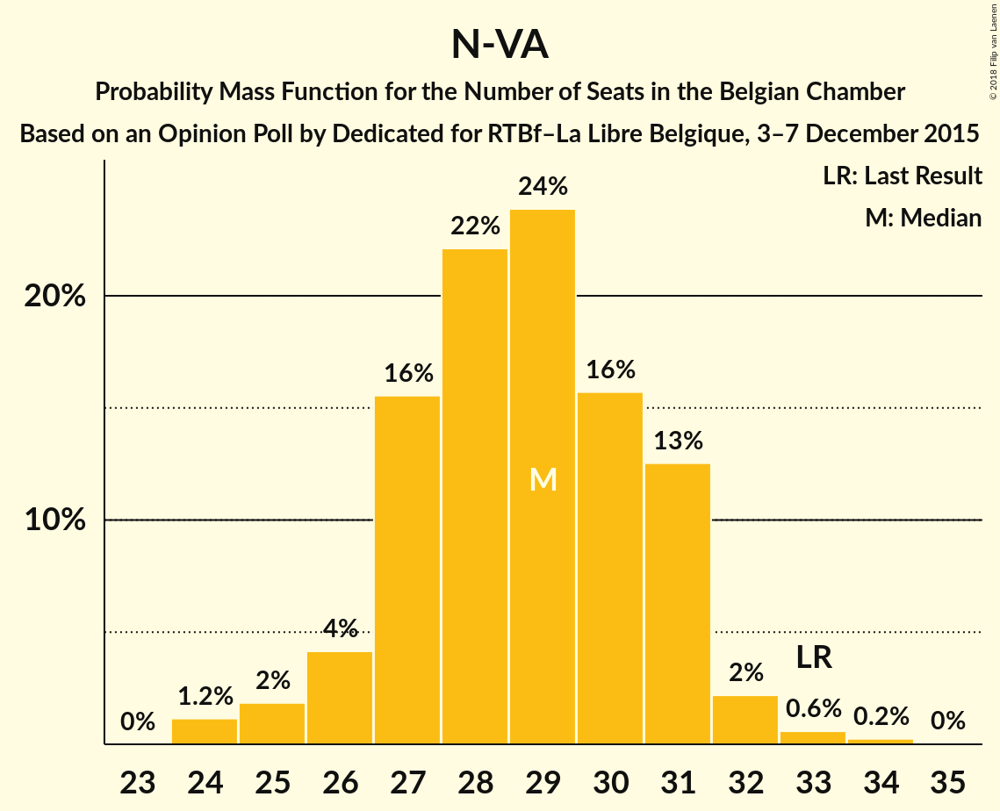

| Number of Seats | Probability | Accumulated | Special Marks |
|:---------------:|:-----------:|:-----------:|:-------------:|
| 24 | 1.1% | 100% |  |
| 25 | 2% | 98.9% |  |
| 26 | 4% | 97% |  |
| 27 | 16% | 93% |  |
| 28 | 21% | 78% |  |
| 29 | 25% | 56% | Median |
| 30 | 16% | 32% |  |
| 31 | 12% | 15% |  |
| 32 | 2% | 3% |  |
| 33 | 0.6% | 0.9% | Last Result |
| 34 | 0.2% | 0.3% |  |
| 35 | 0% | 0% |  |

### CD&V

*For a full overview of the results for this party, see the [CD&V](party-cdv.html) page.*

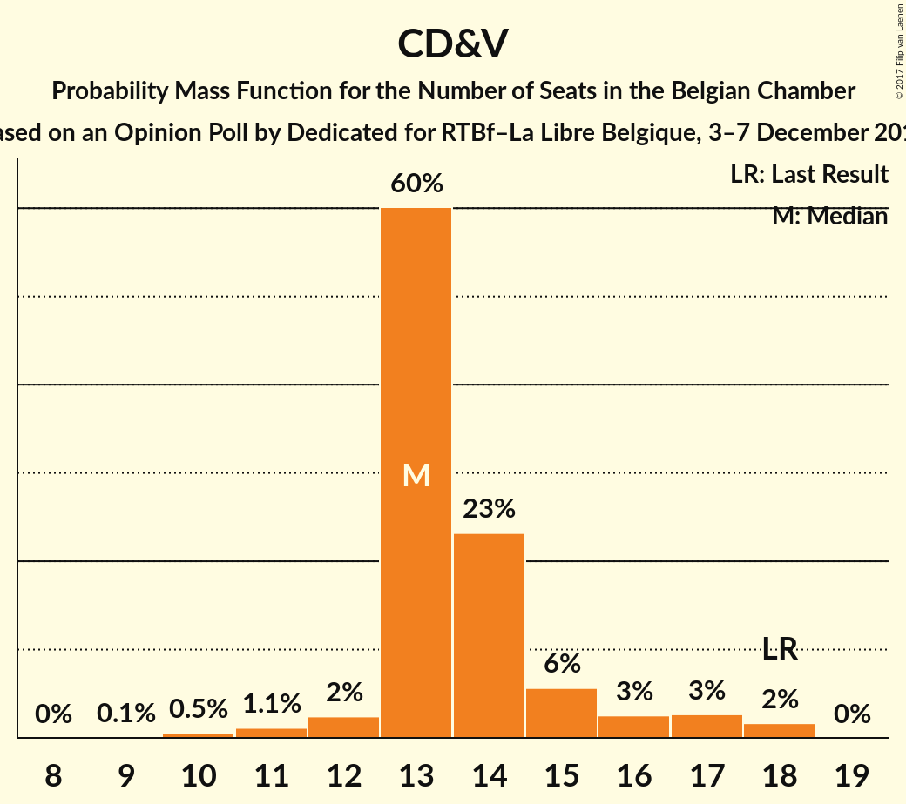

| Number of Seats | Probability | Accumulated | Special Marks |
|:---------------:|:-----------:|:-----------:|:-------------:|
| 9 | 0.1% | 100% |  |
| 10 | 0.6% | 99.9% |  |
| 11 | 0.9% | 99.3% |  |
| 12 | 2% | 98% |  |
| 13 | 62% | 96% | Median |
| 14 | 21% | 34% |  |
| 15 | 5% | 13% |  |
| 16 | 3% | 7% |  |
| 17 | 3% | 4% |  |
| 18 | 2% | 2% | Last Result |
| 19 | 0% | 0% |  |

### sp.a

*For a full overview of the results for this party, see the [sp.a](party-spa.html) page.*

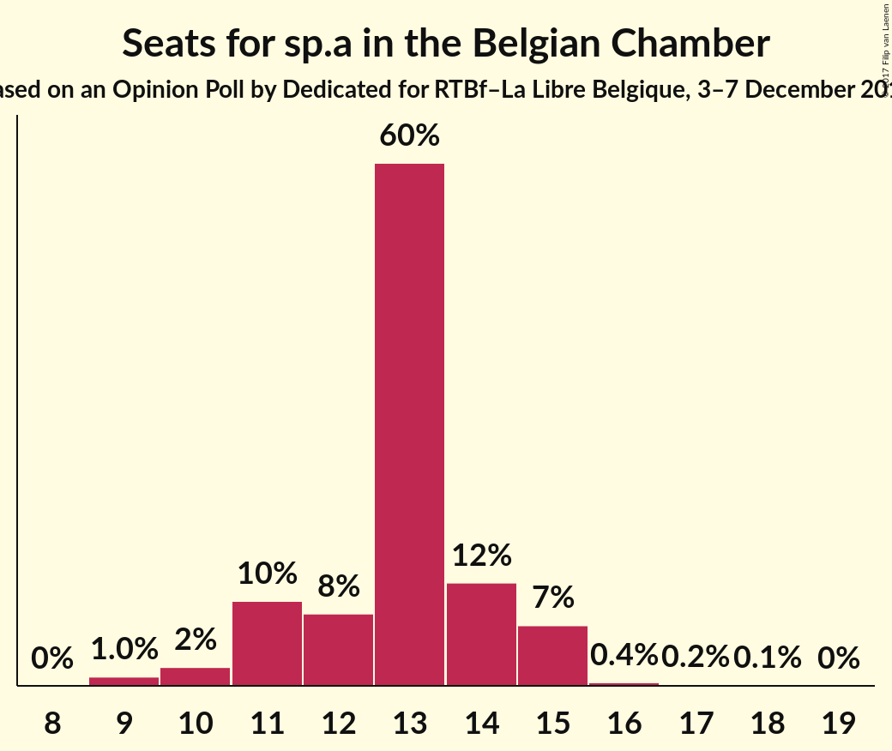

| Number of Seats | Probability | Accumulated | Special Marks |
|:---------------:|:-----------:|:-----------:|:-------------:|
| 9 | 1.0% | 100% |  |
| 10 | 2% | 99.0% |  |
| 11 | 10% | 97% |  |
| 12 | 8% | 87% |  |
| 13 | 58% | 79% | Last Result, Median |
| 14 | 13% | 20% |  |
| 15 | 7% | 8% |  |
| 16 | 0.5% | 0.8% |  |
| 17 | 0.2% | 0.3% |  |
| 18 | 0.1% | 0.1% |  |
| 19 | 0% | 0% |  |

### PS

*For a full overview of the results for this party, see the [PS](party-ps.html) page.*

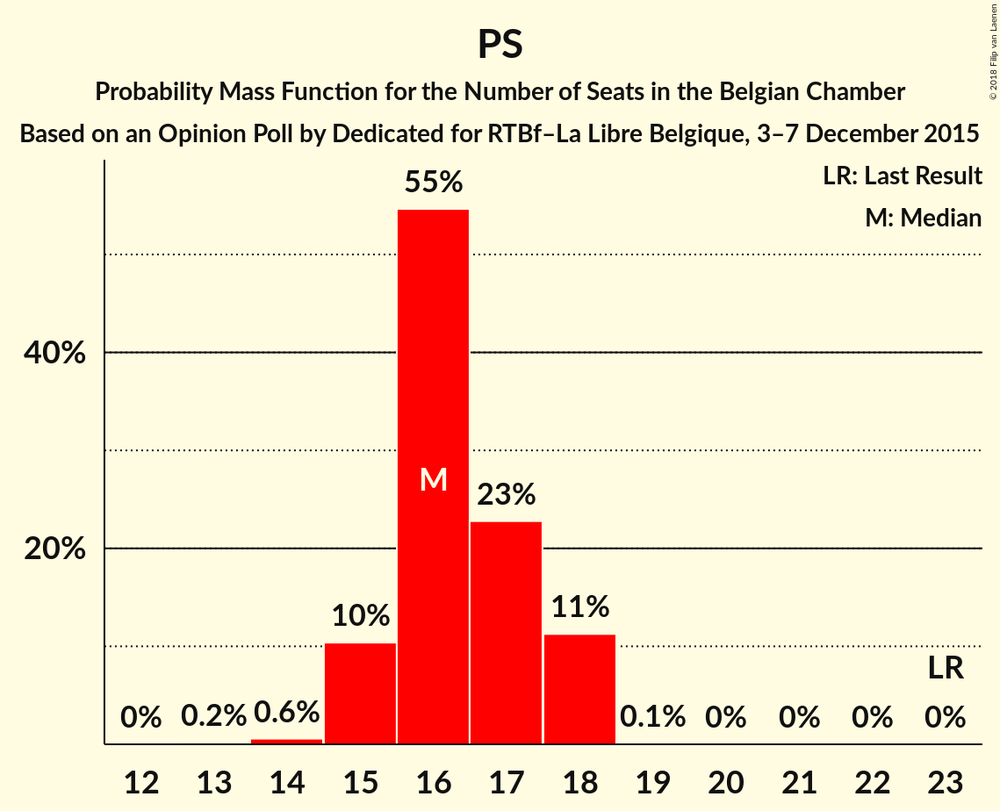

| Number of Seats | Probability | Accumulated | Special Marks |
|:---------------:|:-----------:|:-----------:|:-------------:|
| 13 | 0.2% | 100% |  |
| 14 | 0.6% | 99.8% |  |
| 15 | 10% | 99.2% |  |
| 16 | 55% | 89% | Median |
| 17 | 23% | 34% |  |
| 18 | 11% | 11% |  |
| 19 | 0.1% | 0.2% |  |
| 20 | 0% | 0% |  |
| 21 | 0% | 0% |  |
| 22 | 0% | 0% |  |
| 23 | 0% | 0% | Last Result |

### Open Vld

*For a full overview of the results for this party, see the [Open Vld](party-openvld.html) page.*

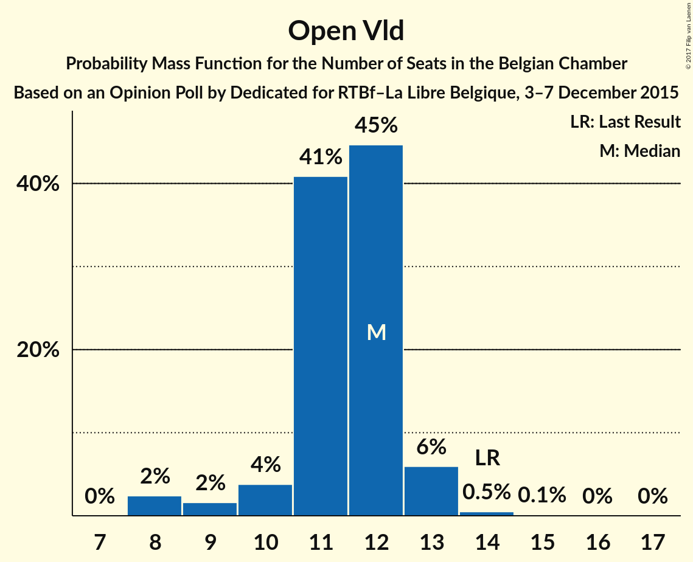

| Number of Seats | Probability | Accumulated | Special Marks |
|:---------------:|:-----------:|:-----------:|:-------------:|
| 8 | 3% | 100% |  |
| 9 | 2% | 97% |  |
| 10 | 4% | 96% |  |
| 11 | 42% | 92% |  |
| 12 | 44% | 50% | Median |
| 13 | 6% | 7% |  |
| 14 | 0.4% | 0.6% | Last Result |
| 15 | 0.1% | 0.2% |  |
| 16 | 0% | 0.1% |  |
| 17 | 0% | 0% |  |

### MR

*For a full overview of the results for this party, see the [MR](party-mr.html) page.*

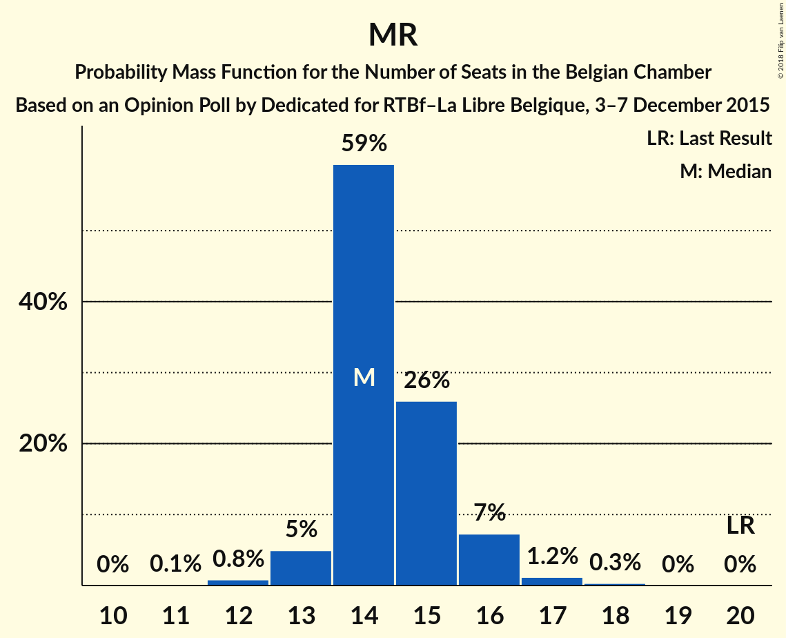

| Number of Seats | Probability | Accumulated | Special Marks |
|:---------------:|:-----------:|:-----------:|:-------------:|
| 11 | 0.1% | 100% |  |
| 12 | 0.6% | 99.9% |  |
| 13 | 4% | 99.3% |  |
| 14 | 62% | 95% | Median |
| 15 | 24% | 33% |  |
| 16 | 7% | 9% |  |
| 17 | 1.2% | 2% |  |
| 18 | 0.3% | 0.3% |  |
| 19 | 0% | 0% |  |
| 20 | 0% | 0% | Last Result |

### Vlaams Belang

*For a full overview of the results for this party, see the [Vlaams Belang](party-vlaamsbelang.html) page.*

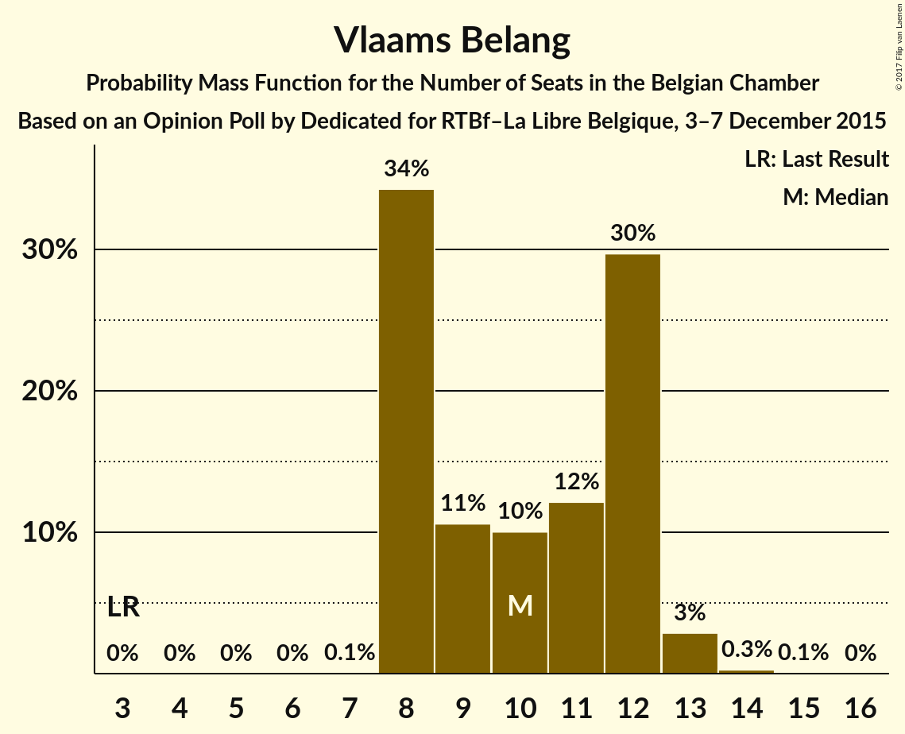

| Number of Seats | Probability | Accumulated | Special Marks |
|:---------------:|:-----------:|:-----------:|:-------------:|
| 3 | 0% | 100% | Last Result |
| 4 | 0% | 100% |  |
| 5 | 0% | 100% |  |
| 6 | 0% | 100% |  |
| 7 | 0.1% | 100% |  |
| 8 | 35% | 99.9% |  |
| 9 | 10% | 65% |  |
| 10 | 10% | 55% | Median |
| 11 | 11% | 44% |  |
| 12 | 30% | 33% |  |
| 13 | 3% | 3% |  |
| 14 | 0.2% | 0.3% |  |
| 15 | 0.1% | 0.1% |  |
| 16 | 0% | 0% |  |

### Groen

*For a full overview of the results for this party, see the [Groen](party-groen.html) page.*

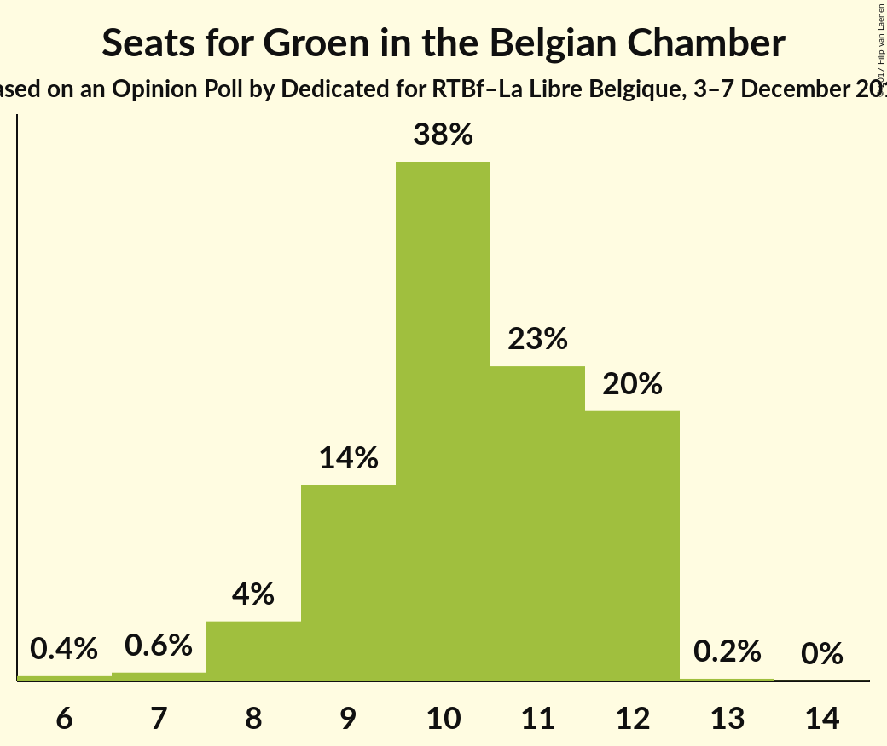

| Number of Seats | Probability | Accumulated | Special Marks |
|:---------------:|:-----------:|:-----------:|:-------------:|
| 6 | 0.4% | 100% | Last Result |
| 7 | 0.6% | 99.6% |  |
| 8 | 4% | 99.0% |  |
| 9 | 14% | 95% |  |
| 10 | 38% | 81% | Median |
| 11 | 23% | 42% |  |
| 12 | 19% | 20% |  |
| 13 | 0.2% | 0.2% |  |
| 14 | 0% | 0% |  |

### cdH

*For a full overview of the results for this party, see the [cdH](party-cdh.html) page.*

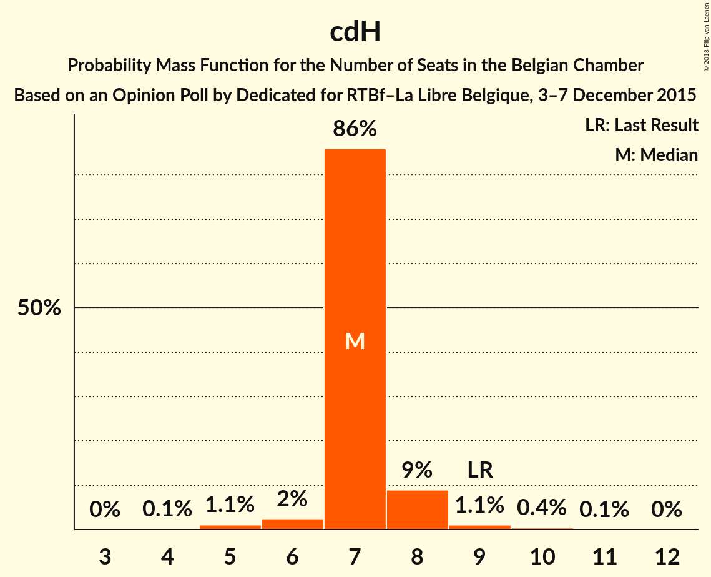

| Number of Seats | Probability | Accumulated | Special Marks |
|:---------------:|:-----------:|:-----------:|:-------------:|
| 4 | 0.1% | 100% |  |
| 5 | 0.8% | 99.9% |  |
| 6 | 2% | 99.0% |  |
| 7 | 87% | 97% | Median |
| 8 | 9% | 10% |  |
| 9 | 1.0% | 1.4% | Last Result |
| 10 | 0.3% | 0.4% |  |
| 11 | 0.1% | 0.1% |  |
| 12 | 0% | 0% |  |

### PTB

*For a full overview of the results for this party, see the [PTB](party-ptb.html) page.*

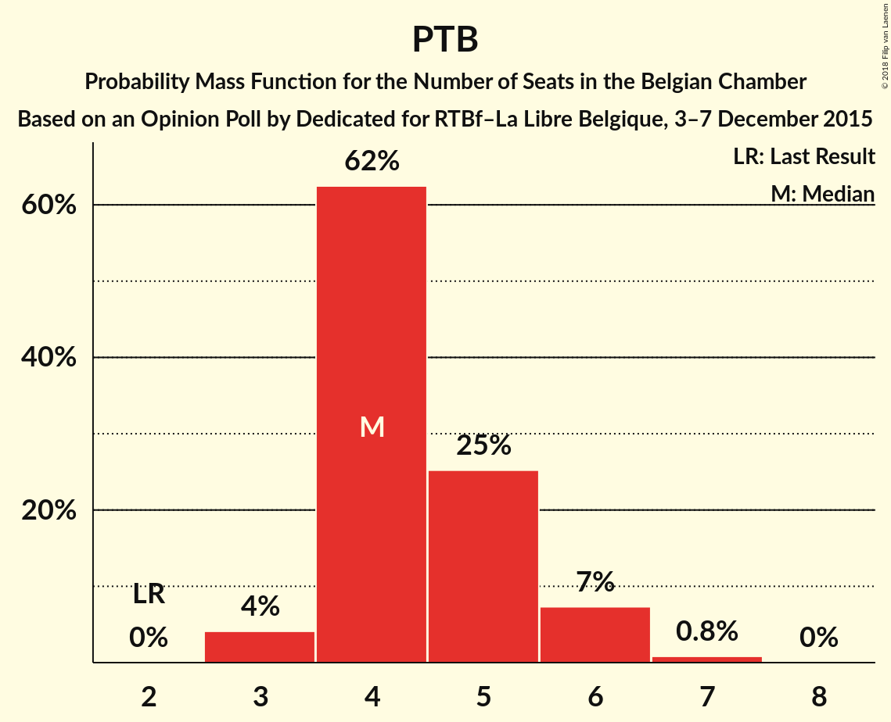

| Number of Seats | Probability | Accumulated | Special Marks |
|:---------------:|:-----------:|:-----------:|:-------------:|
| 2 | 0% | 100% | Last Result |
| 3 | 4% | 100% |  |
| 4 | 62% | 96% | Median |
| 5 | 25% | 33% |  |
| 6 | 7% | 8% |  |
| 7 | 0.8% | 0.8% |  |
| 8 | 0% | 0% |  |

### Ecolo

*For a full overview of the results for this party, see the [Ecolo](party-ecolo.html) page.*

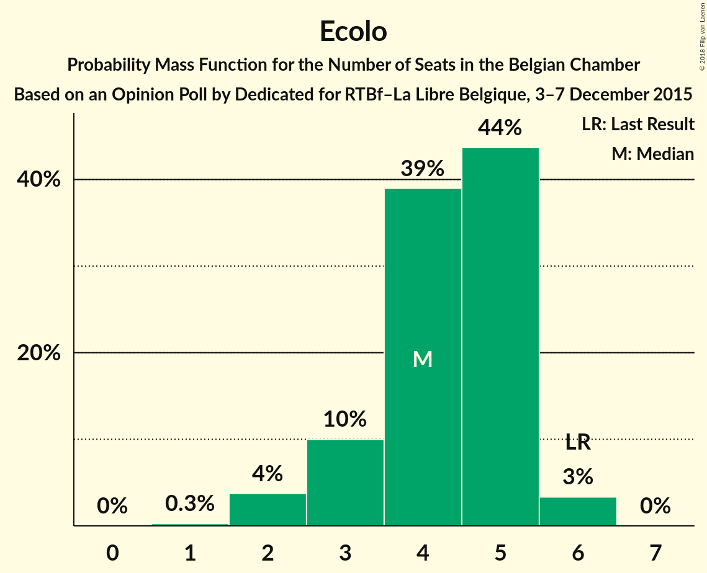

| Number of Seats | Probability | Accumulated | Special Marks |
|:---------------:|:-----------:|:-----------:|:-------------:|
| 1 | 0.3% | 100% |  |
| 2 | 4% | 99.7% |  |
| 3 | 10% | 96% |  |
| 4 | 40% | 86% | Median |
| 5 | 43% | 47% |  |
| 6 | 3% | 3% | Last Result |
| 7 | 0% | 0% |  |

### PVDA

*For a full overview of the results for this party, see the [PVDA](party-pvda.html) page.*

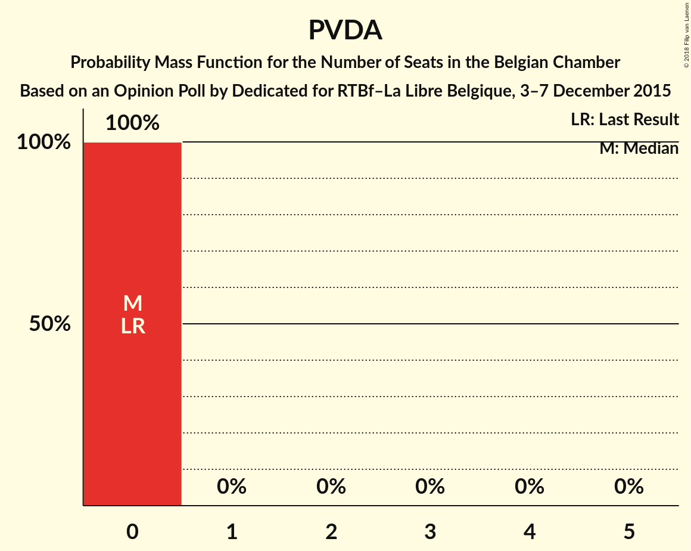

| Number of Seats | Probability | Accumulated | Special Marks |
|:---------------:|:-----------:|:-----------:|:-------------:|
| 0 | 100% | 100% | Last Result, Median |

### Parti Populaire

*For a full overview of the results for this party, see the [Parti Populaire](party-partipopulaire.html) page.*

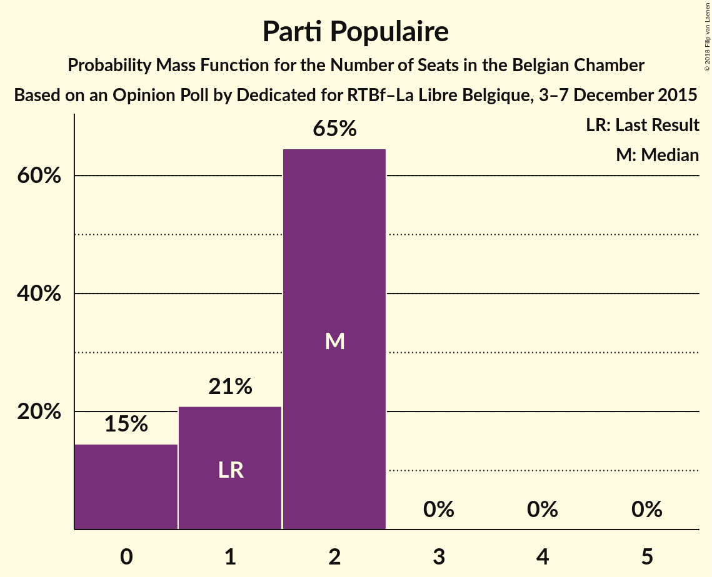

| Number of Seats | Probability | Accumulated | Special Marks |
|:---------------:|:-----------:|:-----------:|:-------------:|
| 0 | 13% | 100% |  |
| 1 | 23% | 87% | Last Result |
| 2 | 64% | 64% | Median |
| 3 | 0% | 0% |  |

### DéFI

*For a full overview of the results for this party, see the [DéFI](party-défi.html) page.*

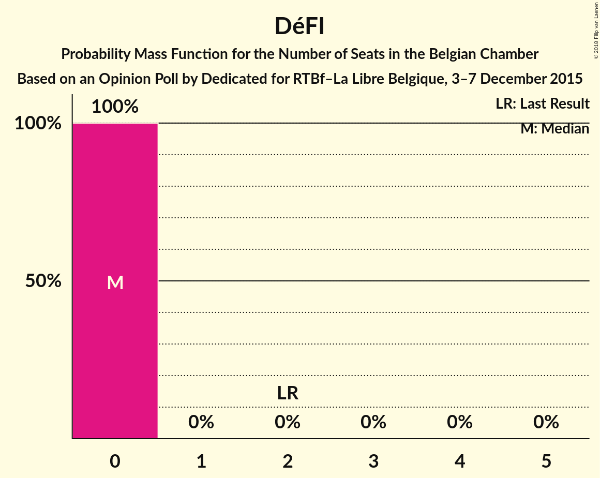

| Number of Seats | Probability | Accumulated | Special Marks |
|:---------------:|:-----------:|:-----------:|:-------------:|
| 0 | 100% | 100% | Median |
| 1 | 0% | 0% |  |
| 2 | 0% | 0% | Last Result |

## Coalitions

### Confidence Intervals

| Coalition | Last Result | Median | Majority? | 80% Confidence Interval | 90% Confidence Interval | 95% Confidence Interval | 99% Confidence Interval |
|:---------:|:-----------:|:------:|:---------:|:-----------------------:|:-----------------------:|:-----------------------:|:-----------------------:|
| CD&V – sp.a – PS – Open Vld – MR – Groen – cdH – Ecolo | 109 | 90 | 100% | 88–93 | 87–94 | 86–94 | 85–96 |
| CD&V – sp.a – PS – Open Vld – MR – cdH | 97 | 76 | 53% | 73–78 | 72–79 | 72–80 | 71–81 |
| N-VA – CD&V – Open Vld – MR – cdH | 94 | 75 | 43% | 73–78 | 72–78 | 71–79 | 70–81 |
| sp.a – PS – Open Vld – MR – Groen – Ecolo | 82 | 70 | 0.1% | 67–72 | 66–73 | 66–74 | 64–75 |
| CD&V – sp.a – PS – Groen – cdH – PTB – Ecolo – PVDA | 77 | 69 | 0.1% | 66–71 | 66–72 | 65–73 | 64–74 |
| N-VA – CD&V – Open Vld – MR | 85 | 68 | 0% | 66–71 | 65–71 | 64–72 | 63–73 |
| CD&V – sp.a – PS – Groen – cdH – Ecolo | 75 | 64 | 0% | 62–67 | 61–68 | 60–69 | 59–70 |
| CD&V – PS – Open Vld – MR – cdH | 84 | 63 | 0% | 61–65 | 60–66 | 59–67 | 58–68 |
| CD&V – Open Vld – MR – Groen – cdH – Ecolo | 73 | 61 | 0% | 59–64 | 58–64 | 57–65 | 56–66 |
| sp.a – PS – Groen – cdH – PTB – Ecolo – PVDA | 59 | 55 | 0% | 53–58 | 52–58 | 52–59 | 50–60 |
| sp.a – PS – Open Vld – MR | 70 | 55 | 0% | 53–57 | 52–58 | 51–58 | 50–60 |
| CD&V – sp.a – PS – cdH | 63 | 50 | 0% | 48–52 | 47–53 | 46–54 | 45–55 |
| sp.a – PS – Groen – PTB – Ecolo – PVDA | 50 | 48 | 0% | 46–51 | 45–51 | 44–52 | 43–53 |
| CD&V – Open Vld – MR – cdH | 61 | 46 | 0% | 45–49 | 44–50 | 43–50 | 42–52 |

### CD&V – sp.a – PS – Open Vld – MR – Groen – cdH – Ecolo

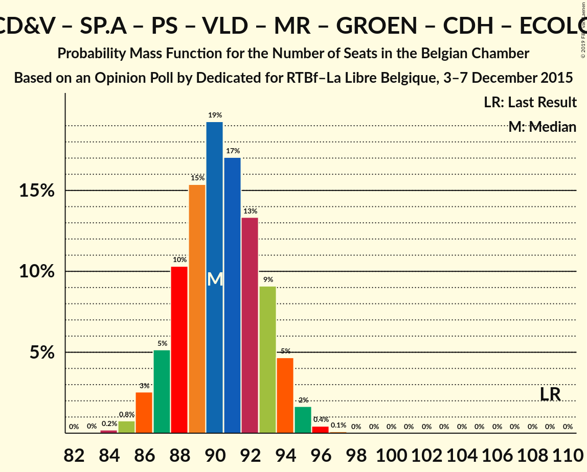

| Number of Seats | Probability | Accumulated | Special Marks |
|:---------------:|:-----------:|:-----------:|:-------------:|
| 84 | 0.2% | 100% |  |
| 85 | 0.8% | 99.8% |  |
| 86 | 3% | 99.0% |  |
| 87 | 5% | 96% |  |
| 88 | 10% | 91% |  |
| 89 | 15% | 81% | Median |
| 90 | 19% | 66% |  |
| 91 | 17% | 46% |  |
| 92 | 13% | 29% |  |
| 93 | 9% | 16% |  |
| 94 | 5% | 7% |  |
| 95 | 2% | 2% |  |
| 96 | 0.4% | 0.6% |  |
| 97 | 0.1% | 0.1% |  |
| 98 | 0% | 0% |  |
| 99 | 0% | 0% |  |
| 100 | 0% | 0% |  |
| 101 | 0% | 0% |  |
| 102 | 0% | 0% |  |
| 103 | 0% | 0% |  |
| 104 | 0% | 0% |  |
| 105 | 0% | 0% |  |
| 106 | 0% | 0% |  |
| 107 | 0% | 0% |  |
| 108 | 0% | 0% |  |
| 109 | 0% | 0% | Last Result |

### CD&V – sp.a – PS – Open Vld – MR – cdH

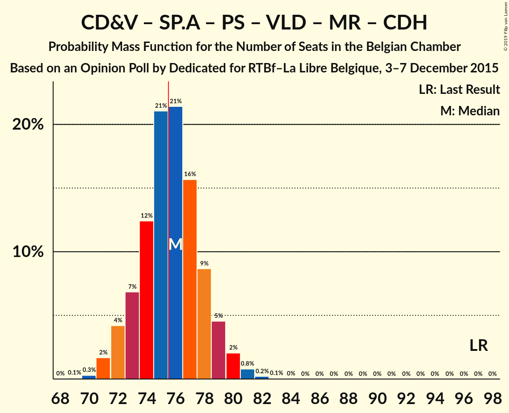

| Number of Seats | Probability | Accumulated | Special Marks |
|:---------------:|:-----------:|:-----------:|:-------------:|
| 69 | 0.1% | 100% |  |
| 70 | 0.3% | 99.9% |  |
| 71 | 2% | 99.6% |  |
| 72 | 4% | 98% |  |
| 73 | 7% | 94% |  |
| 74 | 12% | 87% |  |
| 75 | 21% | 74% | Median |
| 76 | 21% | 53% | Majority |
| 77 | 16% | 32% |  |
| 78 | 9% | 16% |  |
| 79 | 5% | 8% |  |
| 80 | 2% | 3% |  |
| 81 | 0.8% | 1.1% |  |
| 82 | 0.2% | 0.3% |  |
| 83 | 0.1% | 0.1% |  |
| 84 | 0% | 0% |  |
| 85 | 0% | 0% |  |
| 86 | 0% | 0% |  |
| 87 | 0% | 0% |  |
| 88 | 0% | 0% |  |
| 89 | 0% | 0% |  |
| 90 | 0% | 0% |  |
| 91 | 0% | 0% |  |
| 92 | 0% | 0% |  |
| 93 | 0% | 0% |  |
| 94 | 0% | 0% |  |
| 95 | 0% | 0% |  |
| 96 | 0% | 0% |  |
| 97 | 0% | 0% | Last Result |

### N-VA – CD&V – Open Vld – MR – cdH

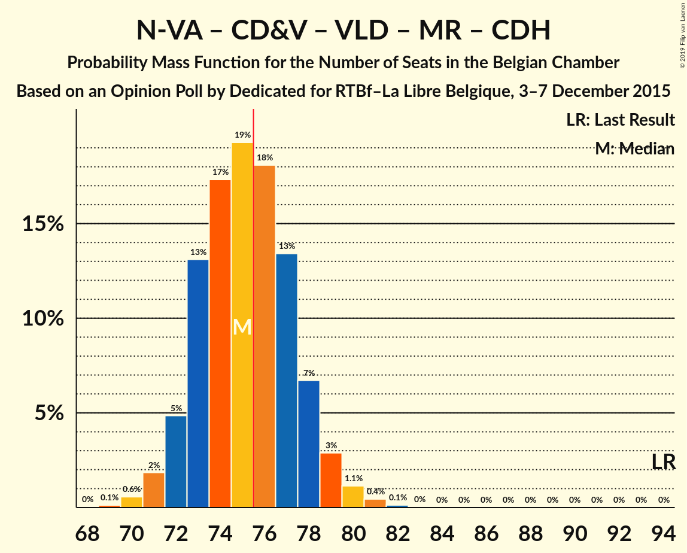

| Number of Seats | Probability | Accumulated | Special Marks |
|:---------------:|:-----------:|:-----------:|:-------------:|
| 69 | 0.1% | 100% |  |
| 70 | 0.6% | 99.8% |  |
| 71 | 2% | 99.3% |  |
| 72 | 5% | 97% |  |
| 73 | 13% | 93% |  |
| 74 | 17% | 79% |  |
| 75 | 19% | 62% | Median |
| 76 | 18% | 43% | Majority |
| 77 | 13% | 25% |  |
| 78 | 7% | 11% |  |
| 79 | 3% | 5% |  |
| 80 | 1.1% | 2% |  |
| 81 | 0.4% | 0.6% |  |
| 82 | 0.1% | 0.2% |  |
| 83 | 0% | 0% |  |
| 84 | 0% | 0% |  |
| 85 | 0% | 0% |  |
| 86 | 0% | 0% |  |
| 87 | 0% | 0% |  |
| 88 | 0% | 0% |  |
| 89 | 0% | 0% |  |
| 90 | 0% | 0% |  |
| 91 | 0% | 0% |  |
| 92 | 0% | 0% |  |
| 93 | 0% | 0% |  |
| 94 | 0% | 0% | Last Result |

### sp.a – PS – Open Vld – MR – Groen – Ecolo

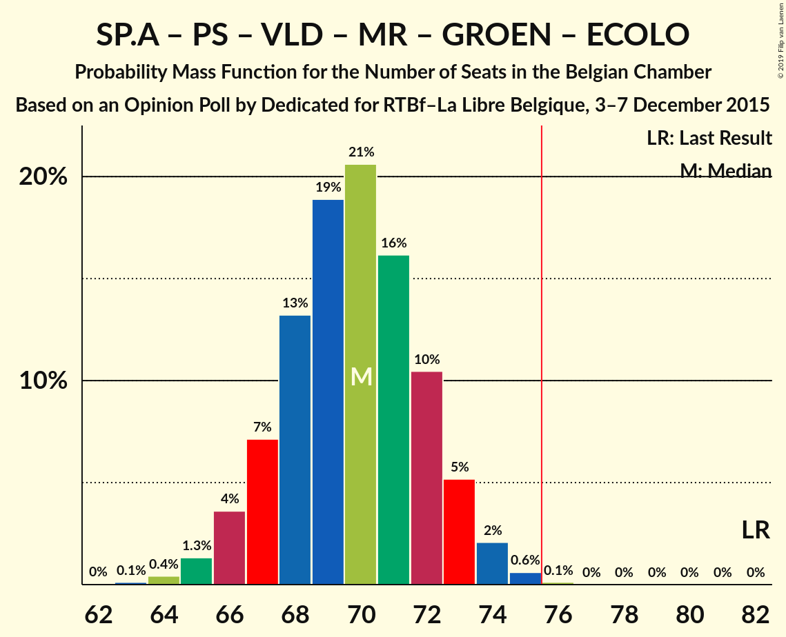

| Number of Seats | Probability | Accumulated | Special Marks |
|:---------------:|:-----------:|:-----------:|:-------------:|
| 63 | 0.1% | 100% |  |
| 64 | 0.4% | 99.8% |  |
| 65 | 1.3% | 99.4% |  |
| 66 | 4% | 98% |  |
| 67 | 7% | 94% |  |
| 68 | 13% | 87% |  |
| 69 | 19% | 74% | Median |
| 70 | 21% | 55% |  |
| 71 | 16% | 35% |  |
| 72 | 10% | 18% |  |
| 73 | 5% | 8% |  |
| 74 | 2% | 3% |  |
| 75 | 0.6% | 0.7% |  |
| 76 | 0.1% | 0.1% | Majority |
| 77 | 0% | 0% |  |
| 78 | 0% | 0% |  |
| 79 | 0% | 0% |  |
| 80 | 0% | 0% |  |
| 81 | 0% | 0% |  |
| 82 | 0% | 0% | Last Result |

### CD&V – sp.a – PS – Groen – cdH – PTB – Ecolo – PVDA

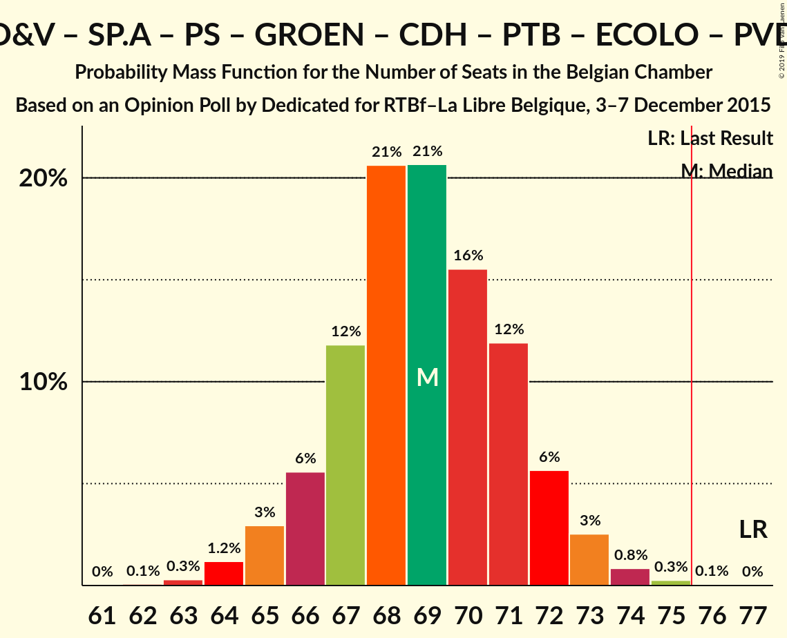

| Number of Seats | Probability | Accumulated | Special Marks |
|:---------------:|:-----------:|:-----------:|:-------------:|
| 62 | 0.1% | 100% |  |
| 63 | 0.3% | 99.9% |  |
| 64 | 1.2% | 99.6% |  |
| 65 | 3% | 98% |  |
| 66 | 6% | 95% |  |
| 67 | 12% | 90% | Median |
| 68 | 21% | 78% |  |
| 69 | 21% | 57% |  |
| 70 | 16% | 37% |  |
| 71 | 12% | 21% |  |
| 72 | 6% | 9% |  |
| 73 | 3% | 4% |  |
| 74 | 0.8% | 1.2% |  |
| 75 | 0.3% | 0.3% |  |
| 76 | 0.1% | 0.1% | Majority |
| 77 | 0% | 0% | Last Result |

### N-VA – CD&V – Open Vld – MR

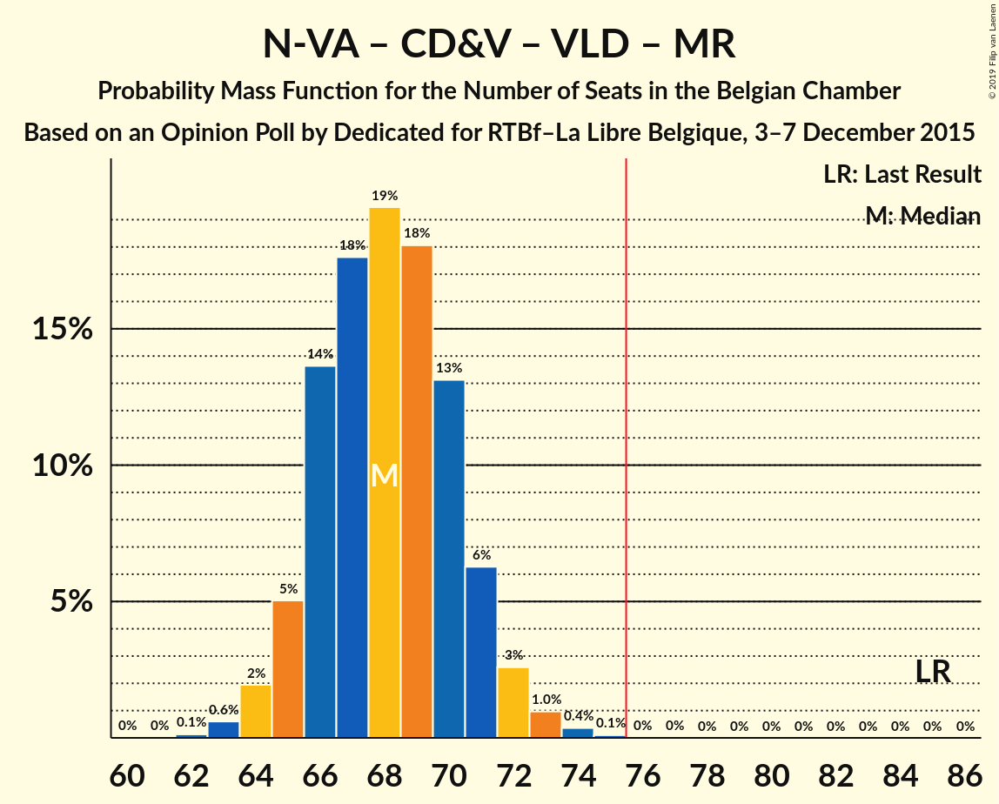

| Number of Seats | Probability | Accumulated | Special Marks |
|:---------------:|:-----------:|:-----------:|:-------------:|
| 62 | 0.1% | 100% |  |
| 63 | 0.6% | 99.8% |  |
| 64 | 2% | 99.2% |  |
| 65 | 5% | 97% |  |
| 66 | 14% | 92% |  |
| 67 | 18% | 79% |  |
| 68 | 19% | 61% | Median |
| 69 | 18% | 42% |  |
| 70 | 13% | 23% |  |
| 71 | 6% | 10% |  |
| 72 | 3% | 4% |  |
| 73 | 1.0% | 1.5% |  |
| 74 | 0.4% | 0.5% |  |
| 75 | 0.1% | 0.1% |  |
| 76 | 0% | 0% | Majority |
| 77 | 0% | 0% |  |
| 78 | 0% | 0% |  |
| 79 | 0% | 0% |  |
| 80 | 0% | 0% |  |
| 81 | 0% | 0% |  |
| 82 | 0% | 0% |  |
| 83 | 0% | 0% |  |
| 84 | 0% | 0% |  |
| 85 | 0% | 0% | Last Result |

### CD&V – sp.a – PS – Groen – cdH – Ecolo

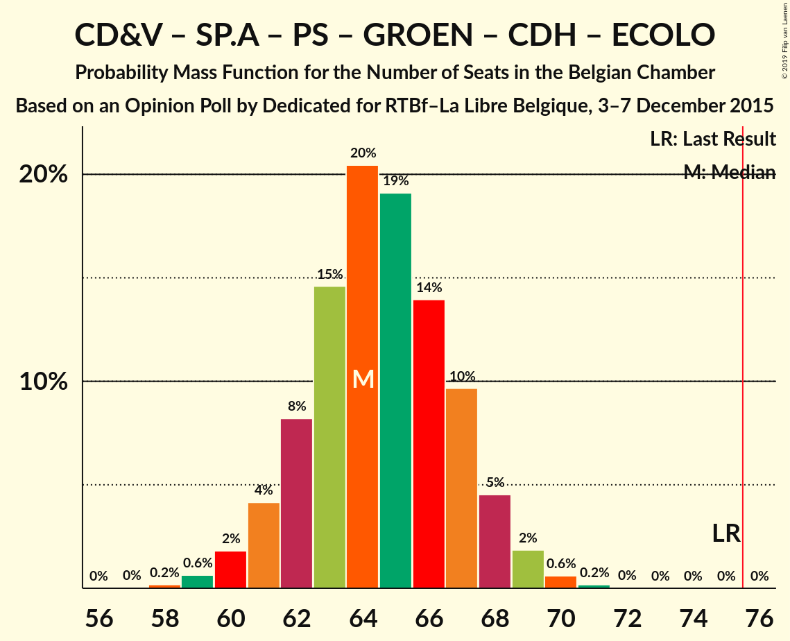

| Number of Seats | Probability | Accumulated | Special Marks |
|:---------------:|:-----------:|:-----------:|:-------------:|
| 58 | 0.2% | 100% |  |
| 59 | 0.6% | 99.8% |  |
| 60 | 2% | 99.1% |  |
| 61 | 4% | 97% |  |
| 62 | 8% | 93% |  |
| 63 | 15% | 85% | Median |
| 64 | 20% | 70% |  |
| 65 | 19% | 50% |  |
| 66 | 14% | 31% |  |
| 67 | 10% | 17% |  |
| 68 | 5% | 7% |  |
| 69 | 2% | 3% |  |
| 70 | 0.6% | 0.8% |  |
| 71 | 0.2% | 0.2% |  |
| 72 | 0% | 0.1% |  |
| 73 | 0% | 0% |  |
| 74 | 0% | 0% |  |
| 75 | 0% | 0% | Last Result |

### CD&V – PS – Open Vld – MR – cdH

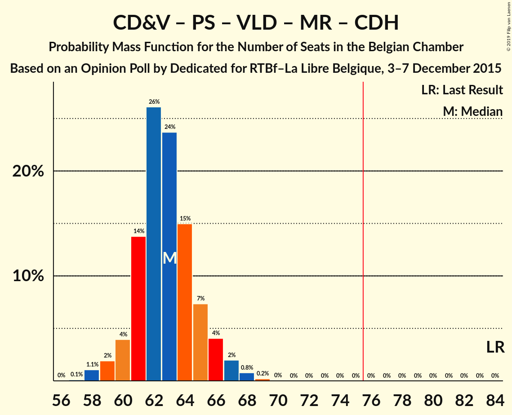

| Number of Seats | Probability | Accumulated | Special Marks |
|:---------------:|:-----------:|:-----------:|:-------------:|
| 57 | 0.1% | 100% |  |
| 58 | 1.1% | 99.9% |  |
| 59 | 2% | 98.8% |  |
| 60 | 4% | 97% |  |
| 61 | 14% | 93% |  |
| 62 | 26% | 79% | Median |
| 63 | 24% | 53% |  |
| 64 | 15% | 29% |  |
| 65 | 7% | 14% |  |
| 66 | 4% | 7% |  |
| 67 | 2% | 3% |  |
| 68 | 0.8% | 1.0% |  |
| 69 | 0.2% | 0.3% |  |
| 70 | 0% | 0.1% |  |
| 71 | 0% | 0% |  |
| 72 | 0% | 0% |  |
| 73 | 0% | 0% |  |
| 74 | 0% | 0% |  |
| 75 | 0% | 0% |  |
| 76 | 0% | 0% | Majority |
| 77 | 0% | 0% |  |
| 78 | 0% | 0% |  |
| 79 | 0% | 0% |  |
| 80 | 0% | 0% |  |
| 81 | 0% | 0% |  |
| 82 | 0% | 0% |  |
| 83 | 0% | 0% |  |
| 84 | 0% | 0% | Last Result |

### CD&V – Open Vld – MR – Groen – cdH – Ecolo

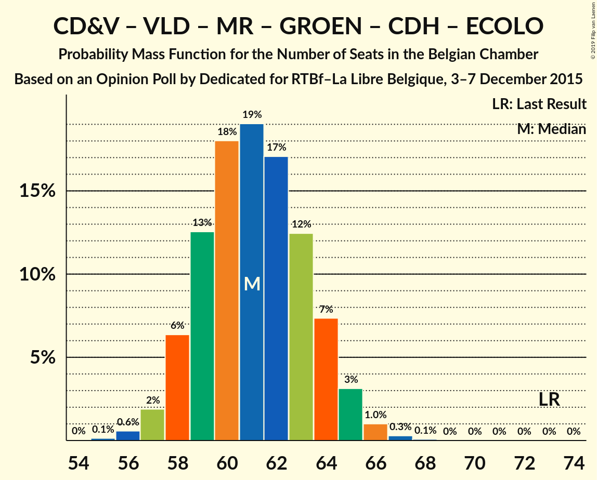

| Number of Seats | Probability | Accumulated | Special Marks |
|:---------------:|:-----------:|:-----------:|:-------------:|
| 55 | 0.1% | 100% |  |
| 56 | 0.6% | 99.8% |  |
| 57 | 2% | 99.3% |  |
| 58 | 6% | 97% |  |
| 59 | 13% | 91% |  |
| 60 | 18% | 78% | Median |
| 61 | 19% | 60% |  |
| 62 | 17% | 41% |  |
| 63 | 12% | 24% |  |
| 64 | 7% | 12% |  |
| 65 | 3% | 5% |  |
| 66 | 1.0% | 1.4% |  |
| 67 | 0.3% | 0.4% |  |
| 68 | 0.1% | 0.1% |  |
| 69 | 0% | 0% |  |
| 70 | 0% | 0% |  |
| 71 | 0% | 0% |  |
| 72 | 0% | 0% |  |
| 73 | 0% | 0% | Last Result |

### sp.a – PS – Groen – cdH – PTB – Ecolo – PVDA

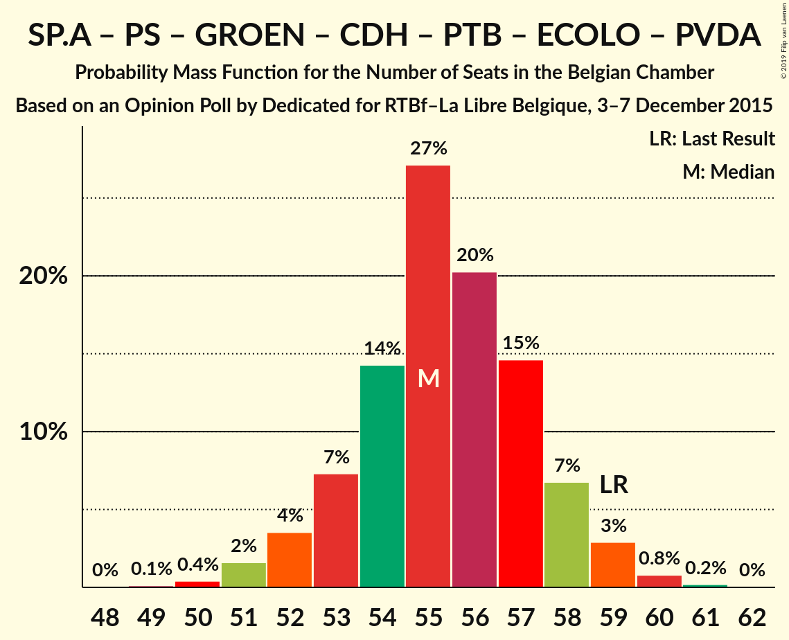

| Number of Seats | Probability | Accumulated | Special Marks |
|:---------------:|:-----------:|:-----------:|:-------------:|
| 49 | 0.1% | 100% |  |
| 50 | 0.4% | 99.8% |  |
| 51 | 2% | 99.4% |  |
| 52 | 4% | 98% |  |
| 53 | 7% | 94% |  |
| 54 | 14% | 87% | Median |
| 55 | 27% | 73% |  |
| 56 | 20% | 46% |  |
| 57 | 15% | 25% |  |
| 58 | 7% | 11% |  |
| 59 | 3% | 4% | Last Result |
| 60 | 0.8% | 1.0% |  |
| 61 | 0.2% | 0.2% |  |
| 62 | 0% | 0% |  |

### sp.a – PS – Open Vld – MR

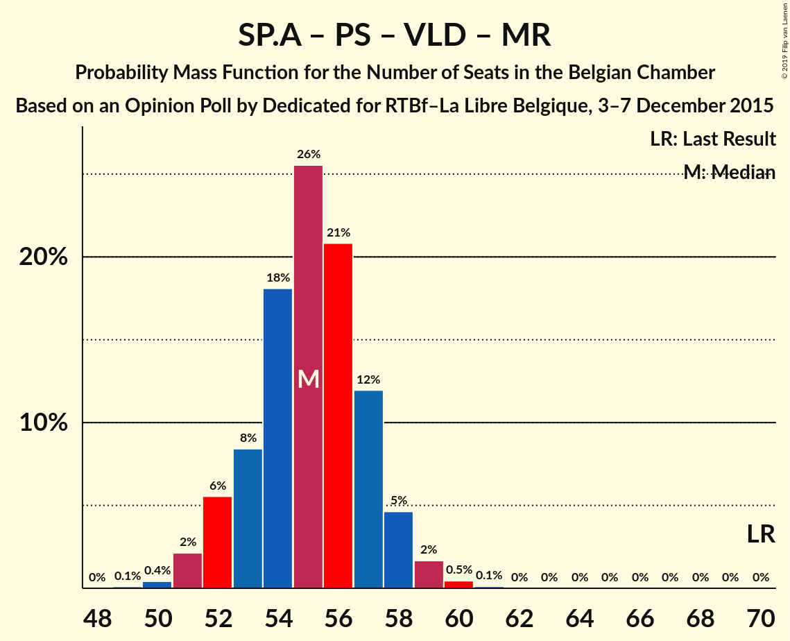

| Number of Seats | Probability | Accumulated | Special Marks |
|:---------------:|:-----------:|:-----------:|:-------------:|
| 49 | 0.1% | 100% |  |
| 50 | 0.4% | 99.9% |  |
| 51 | 2% | 99.4% |  |
| 52 | 6% | 97% |  |
| 53 | 8% | 92% |  |
| 54 | 18% | 83% |  |
| 55 | 26% | 65% | Median |
| 56 | 21% | 40% |  |
| 57 | 12% | 19% |  |
| 58 | 5% | 7% |  |
| 59 | 2% | 2% |  |
| 60 | 0.5% | 0.6% |  |
| 61 | 0.1% | 0.1% |  |
| 62 | 0% | 0% |  |
| 63 | 0% | 0% |  |
| 64 | 0% | 0% |  |
| 65 | 0% | 0% |  |
| 66 | 0% | 0% |  |
| 67 | 0% | 0% |  |
| 68 | 0% | 0% |  |
| 69 | 0% | 0% |  |
| 70 | 0% | 0% | Last Result |

### CD&V – sp.a – PS – cdH

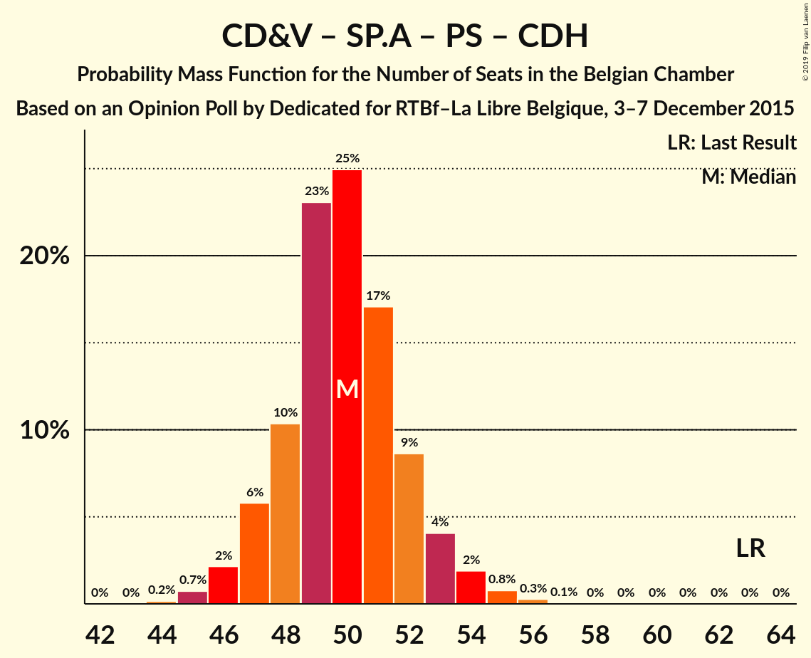

| Number of Seats | Probability | Accumulated | Special Marks |
|:---------------:|:-----------:|:-----------:|:-------------:|
| 44 | 0.2% | 100% |  |
| 45 | 0.7% | 99.8% |  |
| 46 | 2% | 99.1% |  |
| 47 | 6% | 97% |  |
| 48 | 10% | 91% |  |
| 49 | 23% | 81% | Median |
| 50 | 25% | 58% |  |
| 51 | 17% | 33% |  |
| 52 | 9% | 16% |  |
| 53 | 4% | 7% |  |
| 54 | 2% | 3% |  |
| 55 | 0.8% | 1.1% |  |
| 56 | 0.3% | 0.3% |  |
| 57 | 0.1% | 0.1% |  |
| 58 | 0% | 0% |  |
| 59 | 0% | 0% |  |
| 60 | 0% | 0% |  |
| 61 | 0% | 0% |  |
| 62 | 0% | 0% |  |
| 63 | 0% | 0% | Last Result |

### sp.a – PS – Groen – PTB – Ecolo – PVDA

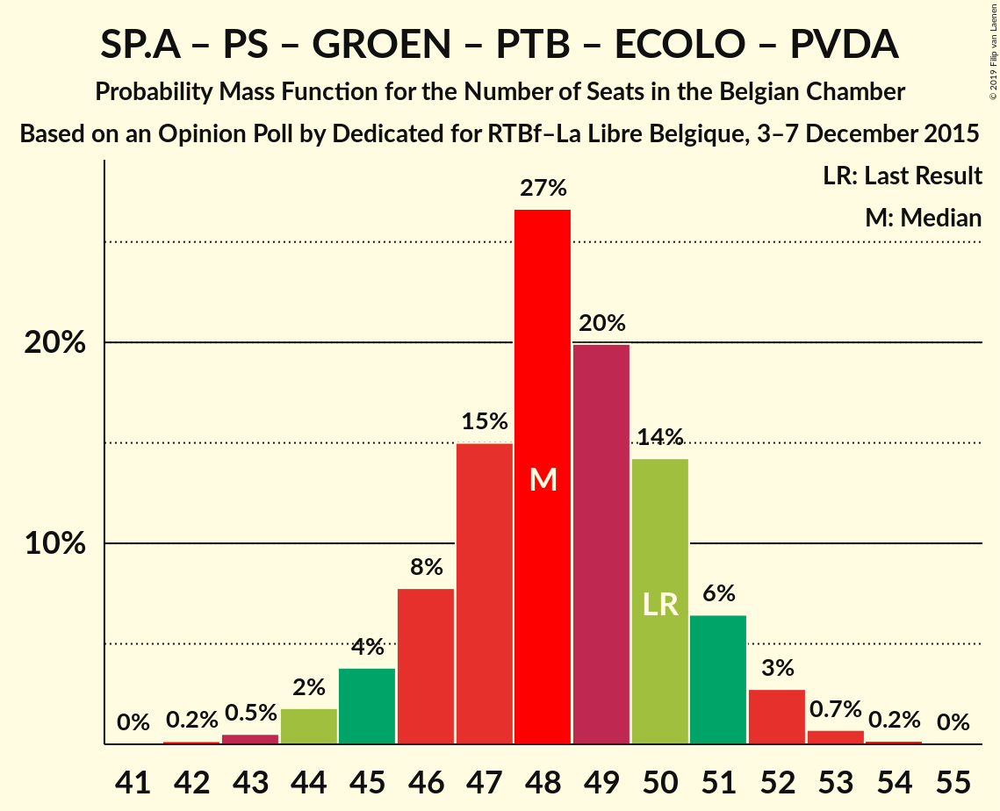

| Number of Seats | Probability | Accumulated | Special Marks |
|:---------------:|:-----------:|:-----------:|:-------------:|
| 41 | 0% | 100% |  |
| 42 | 0.2% | 99.9% |  |
| 43 | 0.5% | 99.8% |  |
| 44 | 2% | 99.3% |  |
| 45 | 4% | 97% |  |
| 46 | 8% | 94% |  |
| 47 | 15% | 86% | Median |
| 48 | 27% | 71% |  |
| 49 | 20% | 44% |  |
| 50 | 14% | 24% | Last Result |
| 51 | 6% | 10% |  |
| 52 | 3% | 4% |  |
| 53 | 0.7% | 0.9% |  |
| 54 | 0.2% | 0.2% |  |
| 55 | 0% | 0% |  |

### CD&V – Open Vld – MR – cdH

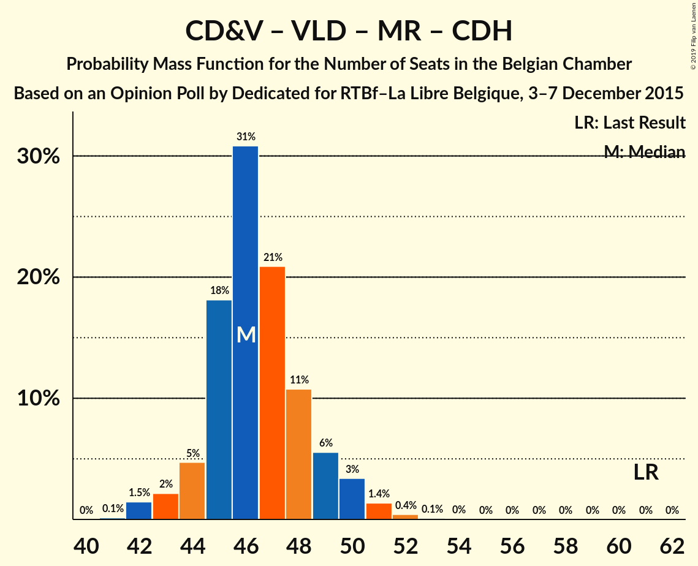

| Number of Seats | Probability | Accumulated | Special Marks |
|:---------------:|:-----------:|:-----------:|:-------------:|
| 41 | 0.1% | 100% |  |
| 42 | 1.5% | 99.8% |  |
| 43 | 2% | 98% |  |
| 44 | 5% | 96% |  |
| 45 | 18% | 92% |  |
| 46 | 31% | 73% | Median |
| 47 | 21% | 43% |  |
| 48 | 11% | 22% |  |
| 49 | 6% | 11% |  |
| 50 | 3% | 5% |  |
| 51 | 1.4% | 2% |  |
| 52 | 0.4% | 0.6% |  |
| 53 | 0.1% | 0.1% |  |
| 54 | 0% | 0% |  |
| 55 | 0% | 0% |  |
| 56 | 0% | 0% |  |
| 57 | 0% | 0% |  |
| 58 | 0% | 0% |  |
| 59 | 0% | 0% |  |
| 60 | 0% | 0% |  |
| 61 | 0% | 0% | Last Result |

## Technical Information

### Opinion Poll

+ **Polling firm:** Dedicated
+ **Commissioner(s):** RTBf–La Libre Belgique
+ **Fieldwork period:** 3–7 December 2015

### Calculations

+ **Sample size:** 1484
+ **Simulations done:** 2,097,152
+ **Error estimate:** 0.88%

