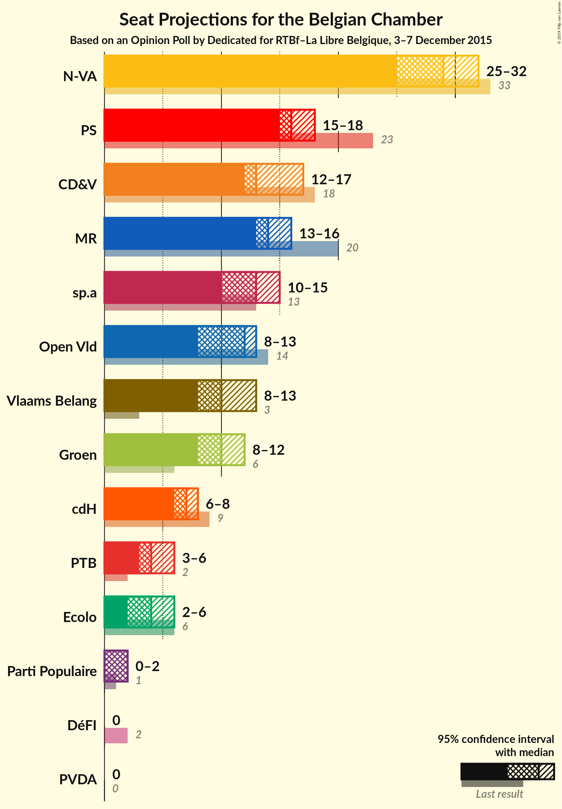

# Opinion Poll by Dedicated for RTBf–La Libre Belgique, 3–7 December 2015

Areas included: Flanders

<a href="#voting-intentions">Voting Intentions</a> | <a href="#seats">Seats</a> | <a href="#coalitions">Coalitions</a> | <a href="#technical-information">Technical Information</a>

## Voting Intentions

### Confidence Intervals

| Party | Last Result | Poll Result | 80% Confidence Interval | 90% Confidence Interval | 95% Confidence Interval | 99% Confidence Interval |
|:-----:|:-----------:|:-----------:|:-----------------------:|:-----------------------:|:-----------------------:|:-----------------------:|
| N-VA | 20.3% | 29.2% | 27.4–31.1% |26.9–31.6% |26.4–32.1% |25.6–33.0% |
| CD&V | 11.6% | 15.1% | 13.7–16.6% |13.3–17.0% |13.0–17.4% |12.3–18.2% |
| sp.a | 8.8% | 14.1% | 12.8–15.7% |12.4–16.1% |12.1–16.5% |11.5–17.2% |
| Open Vld | 9.8% | 12.6% | 11.4–14.1% |11.0–14.5% |10.7–14.8% |10.1–15.6% |
| Vlaams Belang | 3.7% | 11.9% | 10.7–13.3% |10.3–13.7% |10.0–14.1% |9.5–14.8% |
| Groen | 5.3% | 11.6% | 10.4–13.0% |10.1–13.4% |9.8–13.8% |9.2–14.5% |
| PVDA | 1.8% | 2.9% | 2.3–3.7% |2.2–4.0% |2.0–4.2% |1.8–4.6% |

*Note:* The poll result column reflects the actual value used in the calculations. Published results may vary slightly, and in addition be rounded to fewer digits.

## Seats

### Confidence Intervals

| Party | Last Result | Median | 80% Confidence Interval | 90% Confidence Interval | 95% Confidence Interval | 99% Confidence Interval |
|:-----:|:-----------:|:------:|:-----------------------:|:-----------------------:|:-----------------------:|:-----------------------:|
| <a href="#n-va">N-VA</a> | 33 | 29 | 27–31 |26–31 |25–32 |24–33 |
| <a href="#cd&v">CD&V</a> | 18 | 13 | 13–15 |13–16 |12–17 |10–18 |
| <a href="#sp.a">sp.a</a> | 13 | 13 | 11–14 |11–15 |10–15 |9–16 |
| <a href="#open-vld">Open Vld</a> | 14 | 12 | 11–12 |10–13 |9–13 |8–14 |
| <a href="#vlaams-belang">Vlaams Belang</a> | 3 | 10 | 8–12 |8–12 |8–13 |8–13 |
| <a href="#groen">Groen</a> | 6 | 10 | 9–12 |8–12 |8–12 |7–12 |
| <a href="#pvda">PVDA</a> | 0 | 0 | 0 |0 |0 |0 |

### N-VA

*For a full overview of the results for this party, see the [N-VA](party-nva.html) page.*

| Number of Seats | Probability | Accumulated | Special Marks |
|:---------------:|:-----------:|:-----------:|:-------------:|
| 24 | 1.2% | 100% |  |
| 25 | 2% | 98.8% |  |
| 26 | 4% | 97% |  |
| 27 | 16% | 93% |  |
| 28 | 22% | 77% |  |
| 29 | 24% | 55% | Median |
| 30 | 16% | 31% |  |
| 31 | 13% | 16% |  |
| 32 | 2% | 3% |  |
| 33 | 0.6% | 0.9% | Last Result |
| 34 | 0.2% | 0.3% |  |
| 35 | 0% | 0% |  |

### CD&V

*For a full overview of the results for this party, see the [CD&V](party-cdv.html) page.*

| Number of Seats | Probability | Accumulated | Special Marks |
|:---------------:|:-----------:|:-----------:|:-------------:|
| 9 | 0.1% | 100% |  |
| 10 | 0.5% | 99.9% |  |
| 11 | 1.1% | 99.4% |  |
| 12 | 2% | 98% |  |
| 13 | 60% | 96% | Median |
| 14 | 23% | 36% |  |
| 15 | 6% | 13% |  |
| 16 | 3% | 7% |  |
| 17 | 3% | 4% |  |
| 18 | 2% | 2% | Last Result |
| 19 | 0% | 0% |  |

### sp.a

*For a full overview of the results for this party, see the [sp.a](party-spa.html) page.*

| Number of Seats | Probability | Accumulated | Special Marks |
|:---------------:|:-----------:|:-----------:|:-------------:|
| 9 | 1.0% | 100% |  |
| 10 | 2% | 99.0% |  |
| 11 | 10% | 97% |  |
| 12 | 8% | 87% |  |
| 13 | 60% | 79% | Last Result, Median |
| 14 | 12% | 19% |  |
| 15 | 7% | 8% |  |
| 16 | 0.4% | 0.7% |  |
| 17 | 0.2% | 0.3% |  |
| 18 | 0.1% | 0.1% |  |
| 19 | 0% | 0% |  |

### Open Vld

*For a full overview of the results for this party, see the [Open Vld](party-openvld.html) page.*

| Number of Seats | Probability | Accumulated | Special Marks |
|:---------------:|:-----------:|:-----------:|:-------------:|
| 8 | 2% | 100% |  |
| 9 | 2% | 98% |  |
| 10 | 4% | 96% |  |
| 11 | 41% | 92% |  |
| 12 | 45% | 51% | Median |
| 13 | 6% | 7% |  |
| 14 | 0.5% | 0.7% | Last Result |
| 15 | 0.1% | 0.2% |  |
| 16 | 0% | 0.1% |  |
| 17 | 0% | 0% |  |

### Vlaams Belang

*For a full overview of the results for this party, see the [Vlaams Belang](party-vlaamsbelang.html) page.*

| Number of Seats | Probability | Accumulated | Special Marks |
|:---------------:|:-----------:|:-----------:|:-------------:|
| 3 | 0% | 100% | Last Result |
| 4 | 0% | 100% |  |
| 5 | 0% | 100% |  |
| 6 | 0% | 100% |  |
| 7 | 0.1% | 100% |  |
| 8 | 34% | 99.9% |  |
| 9 | 11% | 66% |  |
| 10 | 10% | 55% | Median |
| 11 | 12% | 45% |  |
| 12 | 30% | 33% |  |
| 13 | 3% | 3% |  |
| 14 | 0.3% | 0.3% |  |
| 15 | 0.1% | 0.1% |  |
| 16 | 0% | 0% |  |

### Groen

*For a full overview of the results for this party, see the [Groen](party-groen.html) page.*

| Number of Seats | Probability | Accumulated | Special Marks |
|:---------------:|:-----------:|:-----------:|:-------------:|
| 6 | 0.4% | 100% | Last Result |
| 7 | 0.6% | 99.6% |  |
| 8 | 4% | 99.0% |  |
| 9 | 14% | 95% |  |
| 10 | 38% | 80% | Median |
| 11 | 23% | 43% |  |
| 12 | 20% | 20% |  |
| 13 | 0.2% | 0.2% |  |
| 14 | 0% | 0% |  |

### PVDA

*For a full overview of the results for this party, see the [PVDA](party-pvda.html) page.*

| Number of Seats | Probability | Accumulated | Special Marks |
|:---------------:|:-----------:|:-----------:|:-------------:|
| 0 | 100% | 100% | Last Result, Median |

## Coalitions

### Confidence Intervals

| Coalition | Last Result | Median | Majority? | 80% Confidence Interval | 90% Confidence Interval | 95% Confidence Interval | 99% Confidence Interval |
|:---------:|:-----------:|:------:|:---------:|:-----------------------:|:-----------------------:|:-----------------------:|:-----------------------:|

## Technical Information

### Opinion Poll

+ **Polling firm:** Dedicated
+ **Commissioner(s):** RTBf–La Libre Belgique
+ **Fieldwork period:** 3–7 December 2015

### Calculations

+ **Sample size:** 990
+ **Simulations done:** 1,048,576
+ **Error estimate:** 1.01%

