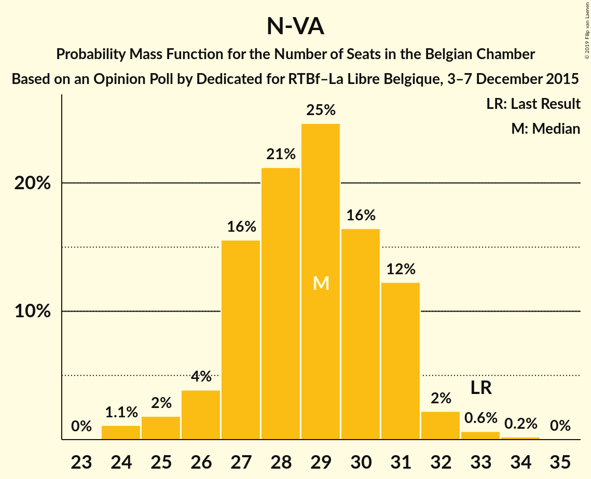
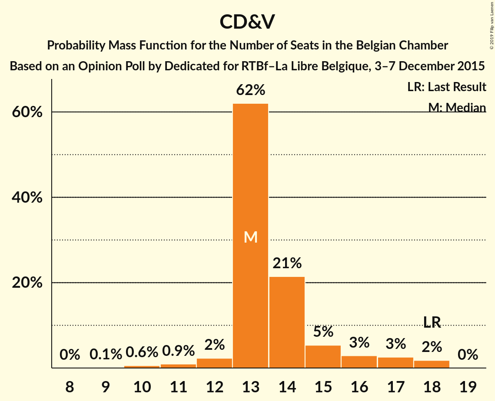
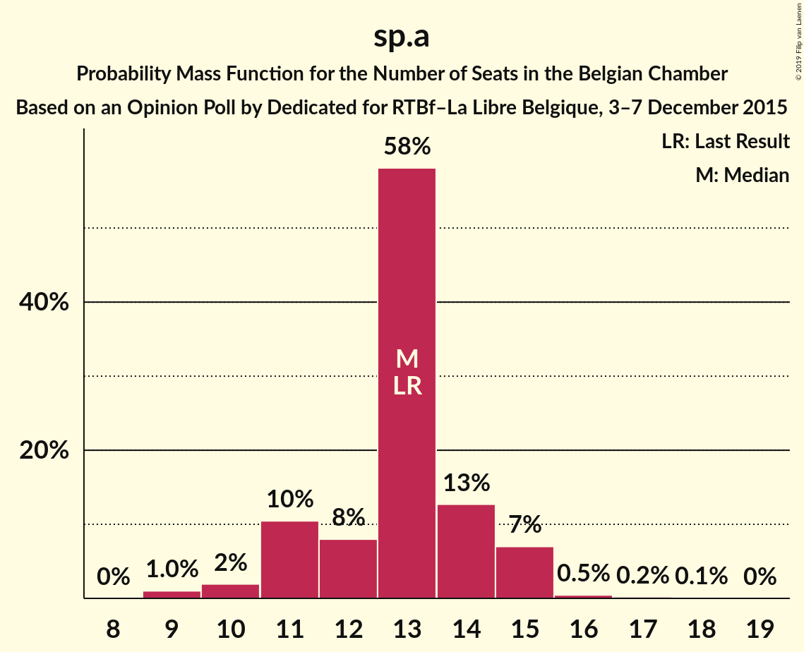
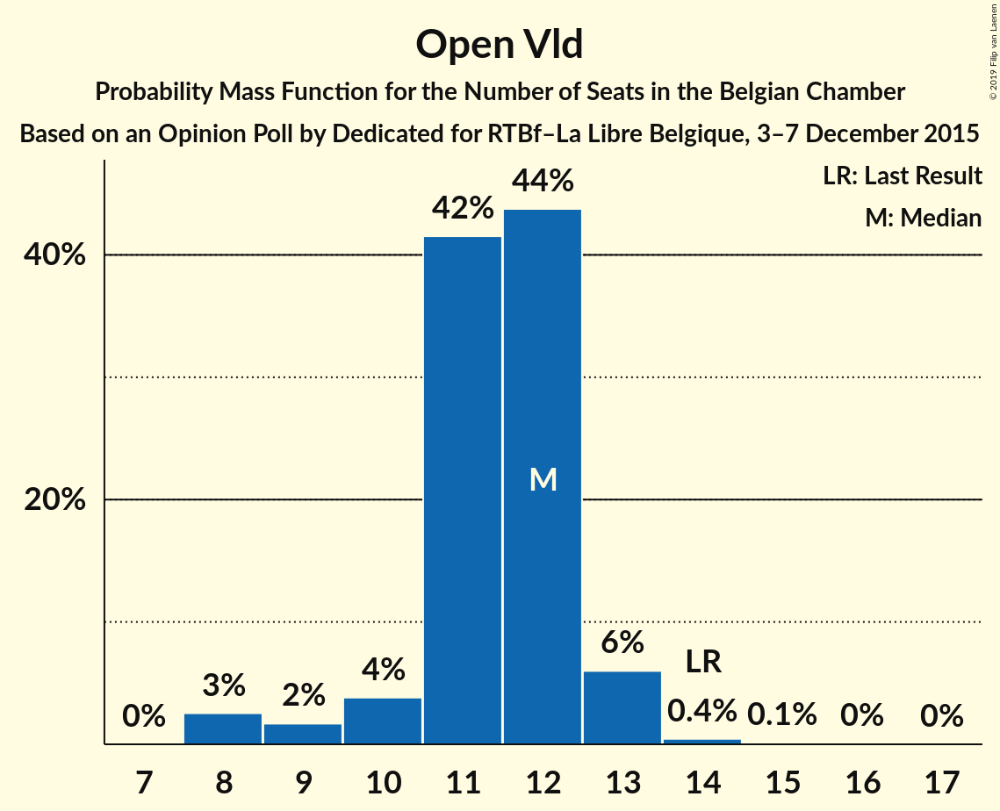
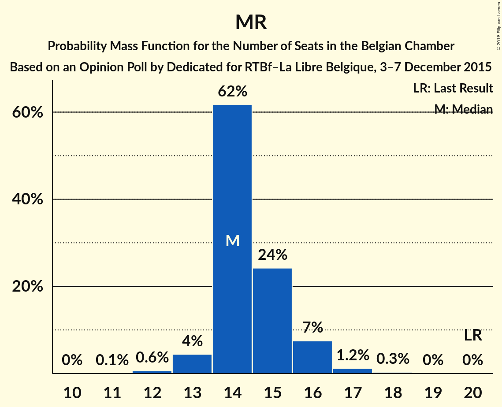
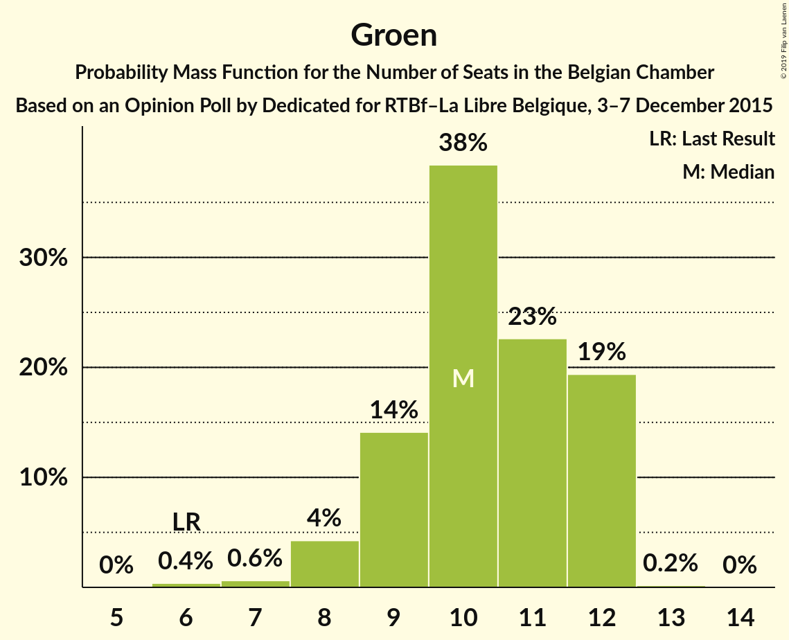
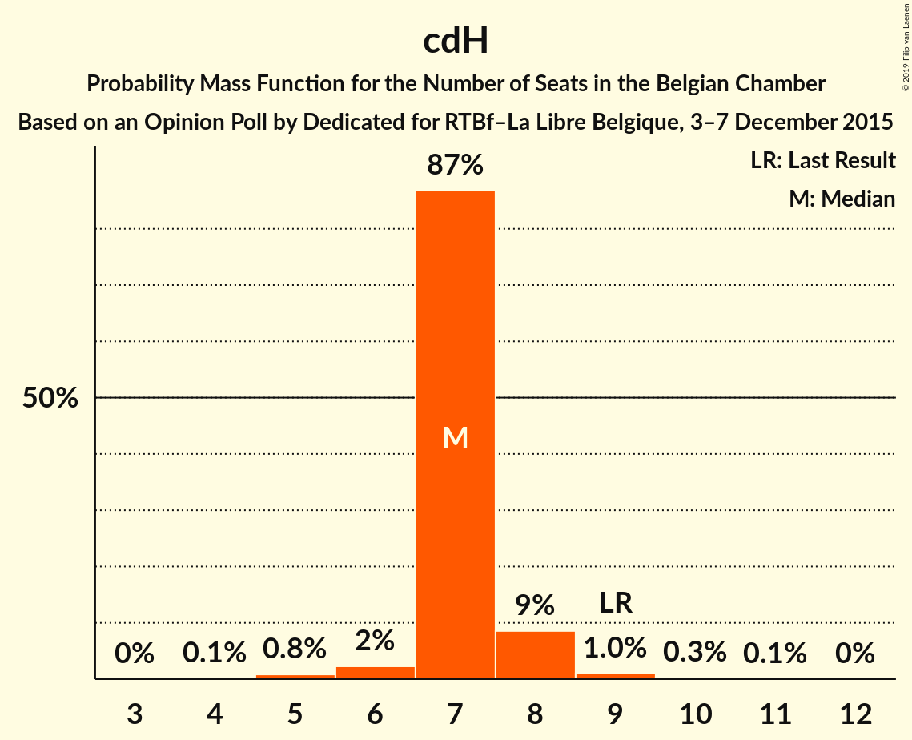
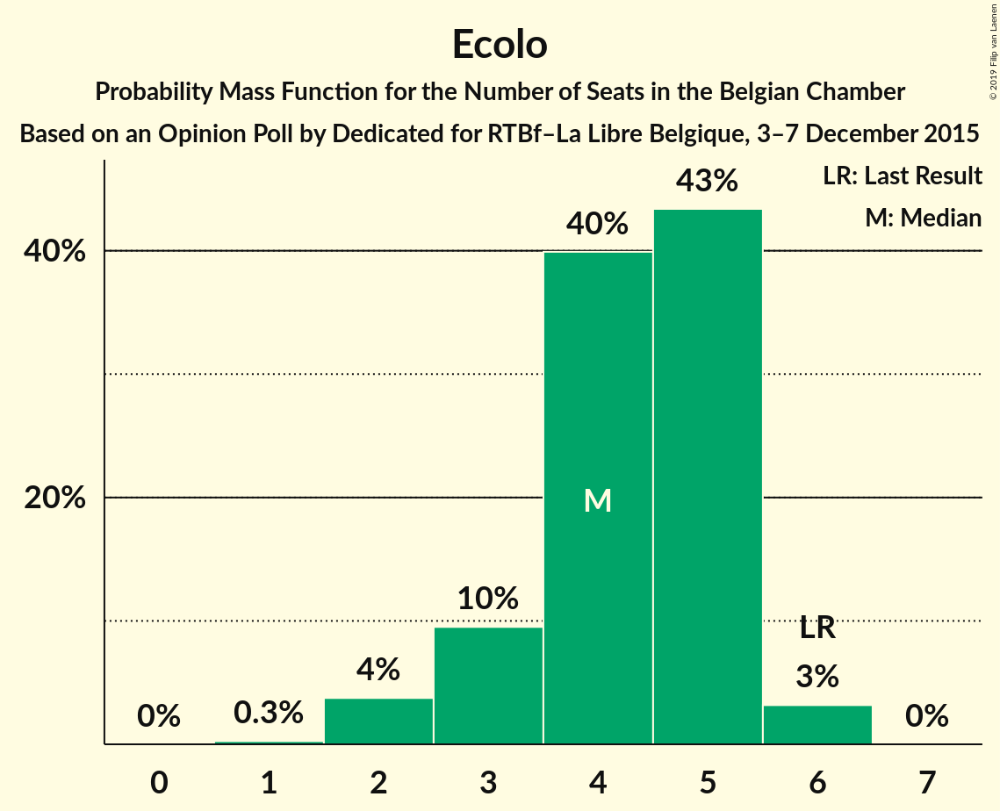
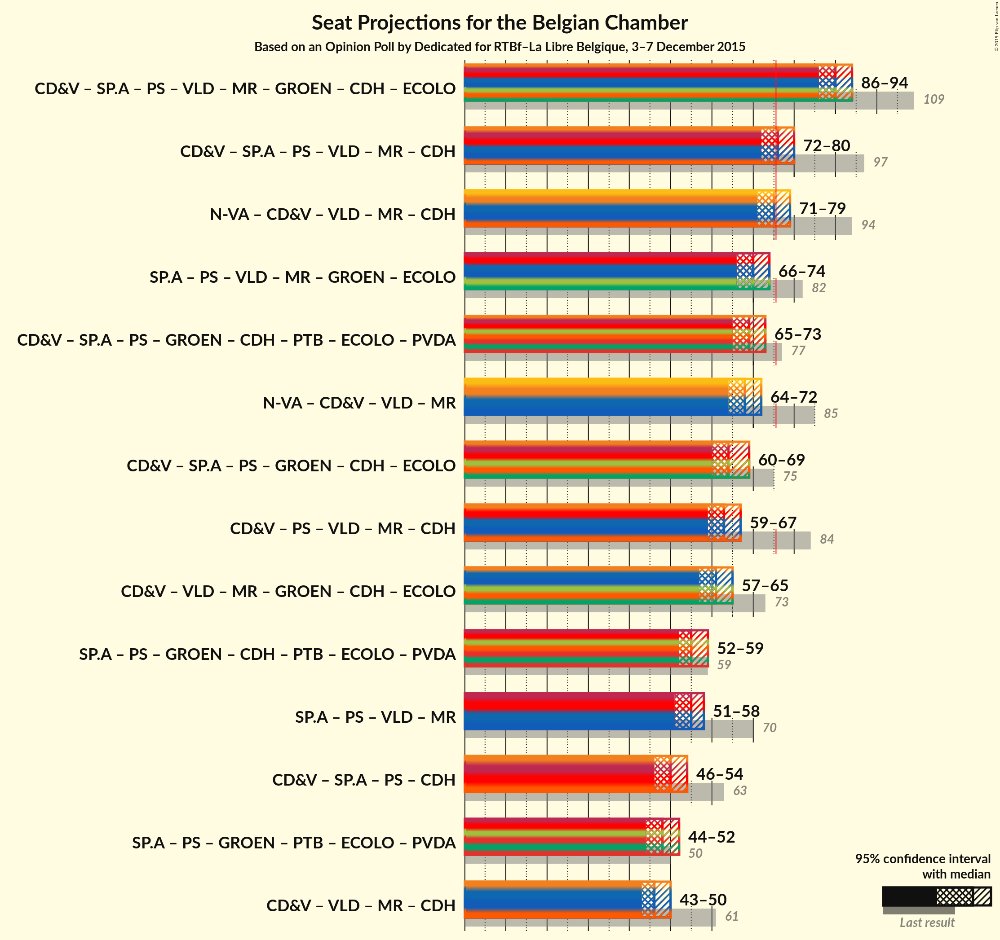

# Opinion Poll by Dedicated for RTBf–La Libre Belgique, 3–7 December 2015

Areas included: Flanders, Wallonia

<a href="#voting-intentions">Voting Intentions</a> | <a href="#seats">Seats</a> | <a href="#coalitions">Coalitions</a> | <a href="#technical-information">Technical Information</a>

## Voting Intentions

### Confidence Intervals

| Party | Last Result | Poll Result | 80% Confidence Interval | 90% Confidence Interval | 95% Confidence Interval | 99% Confidence Interval |
|:-----:|:-----------:|:-----------:|:-----------------------:|:-----------------------:|:-----------------------:|:-----------------------:|
| N-VA | 20.3% | 19.5% | 27.4–31.1% |26.9–31.6% |26.5–32.1% |25.6–33.0% |
| CD&V | 11.6% | 10.0% | 13.7–16.6% |13.3–17.0% |13.0–17.4% |12.3–18.2% |
| sp.a | 8.8% | 9.4% | 12.8–15.6% |12.4–16.1% |12.1–16.5% |11.5–17.2% |
| PS | 11.7% | 9.0% | 25.4–29.2% |24.9–29.8% |24.5–30.2% |23.6–31.2% |
| Open Vld | 9.8% | 8.4% | 11.4–14.1% |11.0–14.5% |10.7–14.8% |10.1–15.6% |
| MR | 9.6% | 8.2% | 23.0–26.6% |22.5–27.2% |22.0–27.6% |21.2–28.6% |
| Vlaams Belang | 3.7% | 8.0% | 10.7–13.3% |10.3–13.7% |10.1–14.1% |9.5–14.8% |
| Groen | 5.3% | 7.7% | 10.4–13.0% |10.1–13.4% |9.8–13.8% |9.2–14.5% |
| cdH | 5.0% | 4.5% | 12.2–15.1% |11.8–15.5% |11.5–15.9% |10.8–16.7% |
| PTB | 2.0% | 3.4% | 9.1–11.7% |8.8–12.1% |8.5–12.5% |8.0–13.2% |
| Ecolo | 3.3% | 3.2% | 8.3–10.8% |8.0–11.2% |7.7–11.5% |7.2–12.2% |
| PVDA | 1.8% | 2.0% | 2.4–3.7% |2.2–4.0% |2.0–4.2% |1.8–4.6% |
| Parti Populaire | 1.5% | 1.8% | 4.5–6.5% |4.3–6.8% |4.1–7.0% |3.7–7.6% |
| DéFI | 1.8% | 1.1% | 2.6–4.1% |2.4–4.3% |2.2–4.5% |2.0–5.0% |

*Note:* The poll result column reflects the actual value used in the calculations. Published results may vary slightly, and in addition be rounded to fewer digits.

## Seats

### Confidence Intervals

| Party | Last Result | Median | 80% Confidence Interval | 90% Confidence Interval | 95% Confidence Interval | 99% Confidence Interval |
|:-----:|:-----------:|:------:|:-----------------------:|:-----------------------:|:-----------------------:|:-----------------------:|
| <a href="#n-va">N-VA</a> | 33 | 29 | 27–31 |26–31 |25–32 |24–33 |
| <a href="#cd&v">CD&V</a> | 18 | 13 | 13–15 |13–16 |12–17 |10–18 |
| <a href="#sp.a">sp.a</a> | 13 | 13 | 11–14 |11–15 |10–15 |9–16 |
| <a href="#ps">PS</a> | 23 | 16 | 15–18 |15–18 |15–18 |14–18 |
| <a href="#open-vld">Open Vld</a> | 14 | 12 | 11–12 |10–13 |9–13 |8–14 |
| <a href="#mr">MR</a> | 20 | 14 | 14–15 |13–16 |13–16 |12–17 |
| <a href="#vlaams-belang">Vlaams Belang</a> | 3 | 10 | 8–12 |8–12 |8–13 |8–13 |
| <a href="#groen">Groen</a> | 6 | 10 | 9–12 |8–12 |8–12 |7–12 |
| <a href="#cdh">cdH</a> | 9 | 7 | 7–8 |7–8 |6–8 |5–9 |
| <a href="#ptb">PTB</a> | 2 | 4 | 4–5 |4–6 |3–6 |3–7 |
| <a href="#ecolo">Ecolo</a> | 6 | 4 | 3–5 |3–5 |2–6 |2–6 |
| <a href="#pvda">PVDA</a> | 0 | 0 | 0 |0 |0 |0 |
| <a href="#parti-populaire">Parti Populaire</a> | 1 | 2 | 0–2 |0–2 |0–2 |0–2 |
| <a href="#défi">DéFI</a> | 2 | 0 | 0 |0 |0 |0 |

### N-VA

*For a full overview of the results for this party, see the [N-VA](party-n-va.html) page.*

| Number of Seats | Probability | Accumulated | Special Marks |
|:---------------:|:-----------:|:-----------:|:-------------:|
| 24 | 1.2% | 100% |  |
| 25 | 2% | 98.8% |  |
| 26 | 4% | 97% |  |
| 27 | 16% | 93% |  |
| 28 | 22% | 77% |  |
| 29 | 24% | 55% | Median |
| 30 | 16% | 31% |  |
| 31 | 13% | 16% |  |
| 32 | 2% | 3% |  |
| 33 | 0.6% | 0.9% | Last Result |
| 34 | 0.2% | 0.3% |  |
| 35 | 0% | 0% |  |

### CD&V

*For a full overview of the results for this party, see the [CD&V](party-cdv.html) page.*

| Number of Seats | Probability | Accumulated | Special Marks |
|:---------------:|:-----------:|:-----------:|:-------------:|
| 9 | 0.1% | 100% |  |
| 10 | 0.5% | 99.9% |  |
| 11 | 1.1% | 99.4% |  |
| 12 | 2% | 98% |  |
| 13 | 60% | 96% | Median |
| 14 | 23% | 36% |  |
| 15 | 6% | 13% |  |
| 16 | 3% | 7% |  |
| 17 | 3% | 4% |  |
| 18 | 2% | 2% | Last Result |
| 19 | 0% | 0% |  |

### sp.a

*For a full overview of the results for this party, see the [sp.a](party-spa.html) page.*

| Number of Seats | Probability | Accumulated | Special Marks |
|:---------------:|:-----------:|:-----------:|:-------------:|
| 9 | 1.0% | 100% |  |
| 10 | 2% | 99.0% |  |
| 11 | 10% | 97% |  |
| 12 | 8% | 87% |  |
| 13 | 60% | 79% | Last Result, Median |
| 14 | 12% | 19% |  |
| 15 | 7% | 8% |  |
| 16 | 0.4% | 0.7% |  |
| 17 | 0.2% | 0.3% |  |
| 18 | 0.1% | 0.1% |  |
| 19 | 0% | 0% |  |

### PS

*For a full overview of the results for this party, see the [PS](party-ps.html) page.*

| Number of Seats | Probability | Accumulated | Special Marks |
|:---------------:|:-----------:|:-----------:|:-------------:|
| 13 | 0.2% | 100% |  |
| 14 | 0.7% | 99.8% |  |
| 15 | 11% | 99.1% |  |
| 16 | 55% | 88% | Median |
| 17 | 23% | 34% |  |
| 18 | 10% | 11% |  |
| 19 | 0.2% | 0.2% |  |
| 20 | 0% | 0% |  |
| 21 | 0% | 0% |  |
| 22 | 0% | 0% |  |
| 23 | 0% | 0% | Last Result |

### Open Vld

*For a full overview of the results for this party, see the [Open Vld](party-openvld.html) page.*

| Number of Seats | Probability | Accumulated | Special Marks |
|:---------------:|:-----------:|:-----------:|:-------------:|
| 8 | 2% | 100% |  |
| 9 | 2% | 98% |  |
| 10 | 4% | 96% |  |
| 11 | 41% | 92% |  |
| 12 | 45% | 51% | Median |
| 13 | 6% | 7% |  |
| 14 | 0.5% | 0.7% | Last Result |
| 15 | 0.1% | 0.2% |  |
| 16 | 0% | 0.1% |  |
| 17 | 0% | 0% |  |

### MR

*For a full overview of the results for this party, see the [MR](party-mr.html) page.*

| Number of Seats | Probability | Accumulated | Special Marks |
|:---------------:|:-----------:|:-----------:|:-------------:|
| 11 | 0.1% | 100% |  |
| 12 | 0.8% | 99.9% |  |
| 13 | 5% | 99.1% |  |
| 14 | 59% | 94% | Median |
| 15 | 26% | 35% |  |
| 16 | 7% | 9% |  |
| 17 | 1.2% | 2% |  |
| 18 | 0.3% | 0.3% |  |
| 19 | 0% | 0% |  |
| 20 | 0% | 0% | Last Result |

### Vlaams Belang

*For a full overview of the results for this party, see the [Vlaams Belang](party-vlaamsbelang.html) page.*

| Number of Seats | Probability | Accumulated | Special Marks |
|:---------------:|:-----------:|:-----------:|:-------------:|
| 3 | 0% | 100% | Last Result |
| 4 | 0% | 100% |  |
| 5 | 0% | 100% |  |
| 6 | 0% | 100% |  |
| 7 | 0.1% | 100% |  |
| 8 | 34% | 99.9% |  |
| 9 | 11% | 66% |  |
| 10 | 10% | 55% | Median |
| 11 | 12% | 45% |  |
| 12 | 30% | 33% |  |
| 13 | 3% | 3% |  |
| 14 | 0.3% | 0.3% |  |
| 15 | 0.1% | 0.1% |  |
| 16 | 0% | 0% |  |

### Groen

*For a full overview of the results for this party, see the [Groen](party-groen.html) page.*

| Number of Seats | Probability | Accumulated | Special Marks |
|:---------------:|:-----------:|:-----------:|:-------------:|
| 6 | 0.4% | 100% | Last Result |
| 7 | 0.6% | 99.6% |  |
| 8 | 4% | 99.0% |  |
| 9 | 14% | 95% |  |
| 10 | 38% | 80% | Median |
| 11 | 23% | 43% |  |
| 12 | 20% | 20% |  |
| 13 | 0.2% | 0.2% |  |
| 14 | 0% | 0% |  |

### cdH

*For a full overview of the results for this party, see the [cdH](party-cdh.html) page.*

| Number of Seats | Probability | Accumulated | Special Marks |
|:---------------:|:-----------:|:-----------:|:-------------:|
| 4 | 0.1% | 100% |  |
| 5 | 1.1% | 99.9% |  |
| 6 | 2% | 98.8% |  |
| 7 | 86% | 96% | Median |
| 8 | 9% | 10% |  |
| 9 | 1.1% | 1.5% | Last Result |
| 10 | 0.4% | 0.4% |  |
| 11 | 0.1% | 0.1% |  |
| 12 | 0% | 0% |  |

### PTB

*For a full overview of the results for this party, see the [PTB](party-ptb.html) page.*

| Number of Seats | Probability | Accumulated | Special Marks |
|:---------------:|:-----------:|:-----------:|:-------------:|
| 2 | 0% | 100% | Last Result |
| 3 | 4% | 100% |  |
| 4 | 61% | 96% | Median |
| 5 | 26% | 35% |  |
| 6 | 8% | 8% |  |
| 7 | 0.8% | 0.9% |  |
| 8 | 0% | 0% |  |

### Ecolo

*For a full overview of the results for this party, see the [Ecolo](party-ecolo.html) page.*

| Number of Seats | Probability | Accumulated | Special Marks |
|:---------------:|:-----------:|:-----------:|:-------------:|
| 1 | 0.3% | 100% |  |
| 2 | 4% | 99.7% |  |
| 3 | 10% | 96% |  |
| 4 | 39% | 86% | Median |
| 5 | 44% | 47% |  |
| 6 | 3% | 3% | Last Result |
| 7 | 0% | 0% |  |

### PVDA

*For a full overview of the results for this party, see the [PVDA](party-pvda.html) page.*

| Number of Seats | Probability | Accumulated | Special Marks |
|:---------------:|:-----------:|:-----------:|:-------------:|
| 0 | 100% | 100% | Last Result, Median |

### Parti Populaire

*For a full overview of the results for this party, see the [Parti Populaire](party-partipopulaire.html) page.*

| Number of Seats | Probability | Accumulated | Special Marks |
|:---------------:|:-----------:|:-----------:|:-------------:|
| 0 | 15% | 100% |  |
| 1 | 21% | 85% | Last Result |
| 2 | 65% | 65% | Median |
| 3 | 0% | 0% |  |

### DéFI

*For a full overview of the results for this party, see the [DéFI](party-défi.html) page.*

| Number of Seats | Probability | Accumulated | Special Marks |
|:---------------:|:-----------:|:-----------:|:-------------:|
| 0 | 100% | 100% | Median |
| 1 | 0% | 0% |  |
| 2 | 0% | 0% | Last Result |

## Coalitions

### Confidence Intervals

| Coalition | Last Result | Median | Majority? | 80% Confidence Interval | 90% Confidence Interval | 95% Confidence Interval | 99% Confidence Interval |
|:---------:|:-----------:|:------:|:---------:|:-----------------------:|:-----------------------:|:-----------------------:|:-----------------------:|
| CD&V – sp.a – PS – Open Vld – MR – Groen – cdH – Ecolo | 109 | 90 | 100% | 88–93 | 87–94 | 86–94 | 85–96 |
| CD&V – sp.a – PS – Open Vld – MR – cdH | 97 | 76 | 54% | 73–78 | 72–79 | 72–80 | 71–81 |
| N-VA – CD&V – Open Vld – MR – cdH | 94 | 75 | 43% | 73–78 | 72–78 | 72–79 | 70–81 |
| sp.a – PS – Open Vld – MR – Groen – Ecolo | 82 | 70 | 0.1% | 67–72 | 66–73 | 66–74 | 64–75 |
| CD&V – sp.a – PS – Groen – cdH – PTB – Ecolo – PVDA | 77 | 69 | 0.1% | 66–71 | 66–72 | 65–73 | 64–74 |
| N-VA – CD&V – Open Vld – MR | 85 | 68 | 0% | 66–71 | 65–71 | 64–72 | 63–73 |
| CD&V – sp.a – PS – Groen – cdH – Ecolo | 75 | 64 | 0% | 62–67 | 61–68 | 60–69 | 59–70 |
| CD&V – PS – Open Vld – MR – cdH | 84 | 63 | 0% | 61–65 | 60–66 | 59–67 | 58–68 |
| sp.a – PS – Groen – cdH – PTB – Ecolo – PVDA | 59 | 55 | 0% | 53–58 | 52–58 | 52–59 | 50–60 |
| sp.a – PS – Open Vld – MR | 70 | 55 | 0% | 53–57 | 52–58 | 51–58 | 50–60 |
| CD&V – sp.a – PS – cdH | 63 | 50 | 0% | 48–52 | 47–53 | 46–54 | 45–55 |
| sp.a – PS – Groen – PTB – Ecolo – PVDA | 50 | 48 | 0% | 46–50 | 45–51 | 45–52 | 43–53 |
| CD&V – Open Vld – MR – cdH | 61 | 46 | 0% | 45–49 | 44–50 | 43–50 | 42–52 |
| CD&V – Open Vld – MR – Groen – cdH – Ecolo | 73 | 26 | 0% | 25–27 | 24–27 | 24–27 | 23–28 |

### CD&V – sp.a – PS – Open Vld – MR – Groen – cdH – Ecolo

| Number of Seats | Probability | Accumulated | Special Marks |
|:---------------:|:-----------:|:-----------:|:-------------:|
| 84 | 0.2% | 100% |  |
| 85 | 0.8% | 99.7% |  |
| 86 | 3% | 99.0% |  |
| 87 | 5% | 96% |  |
| 88 | 10% | 91% |  |
| 89 | 15% | 81% | Median |
| 90 | 19% | 66% |  |
| 91 | 17% | 47% |  |
| 92 | 14% | 30% |  |
| 93 | 9% | 16% |  |
| 94 | 4% | 7% |  |
| 95 | 2% | 2% |  |
| 96 | 0.4% | 0.5% |  |
| 97 | 0.1% | 0.1% |  |
| 98 | 0% | 0% |  |
| 99 | 0% | 0% |  |
| 100 | 0% | 0% |  |
| 101 | 0% | 0% |  |
| 102 | 0% | 0% |  |
| 103 | 0% | 0% |  |
| 104 | 0% | 0% |  |
| 105 | 0% | 0% |  |
| 106 | 0% | 0% |  |
| 107 | 0% | 0% |  |
| 108 | 0% | 0% |  |
| 109 | 0% | 0% | Last Result |

### CD&V – sp.a – PS – Open Vld – MR – cdH

| Number of Seats | Probability | Accumulated | Special Marks |
|:---------------:|:-----------:|:-----------:|:-------------:|
| 69 | 0.1% | 100% |  |
| 70 | 0.3% | 99.9% |  |
| 71 | 2% | 99.6% |  |
| 72 | 4% | 98% |  |
| 73 | 7% | 94% |  |
| 74 | 12% | 87% |  |
| 75 | 21% | 75% | Median |
| 76 | 22% | 54% | Majority |
| 77 | 16% | 32% |  |
| 78 | 9% | 16% |  |
| 79 | 4% | 7% |  |
| 80 | 2% | 3% |  |
| 81 | 0.8% | 1.1% |  |
| 82 | 0.2% | 0.3% |  |
| 83 | 0.1% | 0.1% |  |
| 84 | 0% | 0% |  |
| 85 | 0% | 0% |  |
| 86 | 0% | 0% |  |
| 87 | 0% | 0% |  |
| 88 | 0% | 0% |  |
| 89 | 0% | 0% |  |
| 90 | 0% | 0% |  |
| 91 | 0% | 0% |  |
| 92 | 0% | 0% |  |
| 93 | 0% | 0% |  |
| 94 | 0% | 0% |  |
| 95 | 0% | 0% |  |
| 96 | 0% | 0% |  |
| 97 | 0% | 0% | Last Result |

### N-VA – CD&V – Open Vld – MR – cdH

| Number of Seats | Probability | Accumulated | Special Marks |
|:---------------:|:-----------:|:-----------:|:-------------:|
| 69 | 0.1% | 100% |  |
| 70 | 0.6% | 99.9% |  |
| 71 | 2% | 99.3% |  |
| 72 | 5% | 98% |  |
| 73 | 13% | 92% |  |
| 74 | 17% | 79% |  |
| 75 | 19% | 62% | Median |
| 76 | 18% | 43% | Majority |
| 77 | 13% | 25% |  |
| 78 | 7% | 11% |  |
| 79 | 3% | 5% |  |
| 80 | 1.2% | 2% |  |
| 81 | 0.4% | 0.6% |  |
| 82 | 0.1% | 0.2% |  |
| 83 | 0% | 0% |  |
| 84 | 0% | 0% |  |
| 85 | 0% | 0% |  |
| 86 | 0% | 0% |  |
| 87 | 0% | 0% |  |
| 88 | 0% | 0% |  |
| 89 | 0% | 0% |  |
| 90 | 0% | 0% |  |
| 91 | 0% | 0% |  |
| 92 | 0% | 0% |  |
| 93 | 0% | 0% |  |
| 94 | 0% | 0% | Last Result |

### sp.a – PS – Open Vld – MR – Groen – Ecolo

| Number of Seats | Probability | Accumulated | Special Marks |
|:---------------:|:-----------:|:-----------:|:-------------:|
| 63 | 0.1% | 100% |  |
| 64 | 0.4% | 99.8% |  |
| 65 | 1.4% | 99.4% |  |
| 66 | 4% | 98% |  |
| 67 | 7% | 94% |  |
| 68 | 13% | 88% |  |
| 69 | 19% | 75% | Median |
| 70 | 21% | 56% |  |
| 71 | 16% | 35% |  |
| 72 | 11% | 18% |  |
| 73 | 5% | 8% |  |
| 74 | 2% | 3% |  |
| 75 | 0.6% | 0.7% |  |
| 76 | 0.1% | 0.1% | Majority |
| 77 | 0% | 0% |  |
| 78 | 0% | 0% |  |
| 79 | 0% | 0% |  |
| 80 | 0% | 0% |  |
| 81 | 0% | 0% |  |
| 82 | 0% | 0% | Last Result |

### CD&V – sp.a – PS – Groen – cdH – PTB – Ecolo – PVDA

| Number of Seats | Probability | Accumulated | Special Marks |
|:---------------:|:-----------:|:-----------:|:-------------:|
| 62 | 0.1% | 100% |  |
| 63 | 0.3% | 99.9% |  |
| 64 | 1.2% | 99.6% |  |
| 65 | 3% | 98% |  |
| 66 | 6% | 96% |  |
| 67 | 12% | 90% | Median |
| 68 | 21% | 78% |  |
| 69 | 21% | 58% |  |
| 70 | 15% | 37% |  |
| 71 | 12% | 21% |  |
| 72 | 6% | 9% |  |
| 73 | 2% | 4% |  |
| 74 | 0.8% | 1.1% |  |
| 75 | 0.2% | 0.3% |  |
| 76 | 0.1% | 0.1% | Majority |
| 77 | 0% | 0% | Last Result |

### N-VA – CD&V – Open Vld – MR

| Number of Seats | Probability | Accumulated | Special Marks |
|:---------------:|:-----------:|:-----------:|:-------------:|
| 62 | 0.1% | 100% |  |
| 63 | 0.6% | 99.8% |  |
| 64 | 2% | 99.2% |  |
| 65 | 5% | 97% |  |
| 66 | 14% | 92% |  |
| 67 | 18% | 79% |  |
| 68 | 19% | 61% | Median |
| 69 | 18% | 42% |  |
| 70 | 13% | 23% |  |
| 71 | 6% | 10% |  |
| 72 | 3% | 4% |  |
| 73 | 1.0% | 1.5% |  |
| 74 | 0.4% | 0.5% |  |
| 75 | 0.1% | 0.1% |  |
| 76 | 0% | 0% | Majority |
| 77 | 0% | 0% |  |
| 78 | 0% | 0% |  |
| 79 | 0% | 0% |  |
| 80 | 0% | 0% |  |
| 81 | 0% | 0% |  |
| 82 | 0% | 0% |  |
| 83 | 0% | 0% |  |
| 84 | 0% | 0% |  |
| 85 | 0% | 0% | Last Result |

### CD&V – sp.a – PS – Groen – cdH – Ecolo

| Number of Seats | Probability | Accumulated | Special Marks |
|:---------------:|:-----------:|:-----------:|:-------------:|
| 58 | 0.2% | 100% |  |
| 59 | 0.6% | 99.8% |  |
| 60 | 2% | 99.1% |  |
| 61 | 4% | 97% |  |
| 62 | 8% | 93% |  |
| 63 | 15% | 85% | Median |
| 64 | 20% | 70% |  |
| 65 | 19% | 50% |  |
| 66 | 14% | 31% |  |
| 67 | 10% | 17% |  |
| 68 | 4% | 7% |  |
| 69 | 2% | 3% |  |
| 70 | 0.6% | 0.8% |  |
| 71 | 0.2% | 0.2% |  |
| 72 | 0% | 0.1% |  |
| 73 | 0% | 0% |  |
| 74 | 0% | 0% |  |
| 75 | 0% | 0% | Last Result |

### CD&V – PS – Open Vld – MR – cdH

| Number of Seats | Probability | Accumulated | Special Marks |
|:---------------:|:-----------:|:-----------:|:-------------:|
| 57 | 0.1% | 100% |  |
| 58 | 1.0% | 99.9% |  |
| 59 | 2% | 98.8% |  |
| 60 | 4% | 97% |  |
| 61 | 13% | 93% |  |
| 62 | 26% | 80% | Median |
| 63 | 24% | 54% |  |
| 64 | 15% | 30% |  |
| 65 | 7% | 14% |  |
| 66 | 4% | 7% |  |
| 67 | 2% | 3% |  |
| 68 | 0.8% | 1.0% |  |
| 69 | 0.2% | 0.3% |  |
| 70 | 0% | 0.1% |  |
| 71 | 0% | 0% |  |
| 72 | 0% | 0% |  |
| 73 | 0% | 0% |  |
| 74 | 0% | 0% |  |
| 75 | 0% | 0% |  |
| 76 | 0% | 0% | Majority |
| 77 | 0% | 0% |  |
| 78 | 0% | 0% |  |
| 79 | 0% | 0% |  |
| 80 | 0% | 0% |  |
| 81 | 0% | 0% |  |
| 82 | 0% | 0% |  |
| 83 | 0% | 0% |  |
| 84 | 0% | 0% | Last Result |

### sp.a – PS – Groen – cdH – PTB – Ecolo – PVDA

| Number of Seats | Probability | Accumulated | Special Marks |
|:---------------:|:-----------:|:-----------:|:-------------:|
| 49 | 0.1% | 100% |  |
| 50 | 0.4% | 99.9% |  |
| 51 | 2% | 99.4% |  |
| 52 | 3% | 98% |  |
| 53 | 7% | 94% |  |
| 54 | 14% | 87% | Median |
| 55 | 27% | 73% |  |
| 56 | 21% | 46% |  |
| 57 | 14% | 25% |  |
| 58 | 7% | 10% |  |
| 59 | 3% | 4% | Last Result |
| 60 | 0.8% | 1.0% |  |
| 61 | 0.2% | 0.2% |  |
| 62 | 0% | 0% |  |

### sp.a – PS – Open Vld – MR

| Number of Seats | Probability | Accumulated | Special Marks |
|:---------------:|:-----------:|:-----------:|:-------------:|
| 49 | 0.1% | 100% |  |
| 50 | 0.5% | 99.9% |  |
| 51 | 2% | 99.4% |  |
| 52 | 5% | 97% |  |
| 53 | 8% | 92% |  |
| 54 | 18% | 84% |  |
| 55 | 26% | 66% | Median |
| 56 | 21% | 39% |  |
| 57 | 12% | 18% |  |
| 58 | 4% | 7% |  |
| 59 | 2% | 2% |  |
| 60 | 0.4% | 0.6% |  |
| 61 | 0.1% | 0.1% |  |
| 62 | 0% | 0% |  |
| 63 | 0% | 0% |  |
| 64 | 0% | 0% |  |
| 65 | 0% | 0% |  |
| 66 | 0% | 0% |  |
| 67 | 0% | 0% |  |
| 68 | 0% | 0% |  |
| 69 | 0% | 0% |  |
| 70 | 0% | 0% | Last Result |

### CD&V – sp.a – PS – cdH

| Number of Seats | Probability | Accumulated | Special Marks |
|:---------------:|:-----------:|:-----------:|:-------------:|
| 44 | 0.2% | 100% |  |
| 45 | 0.8% | 99.8% |  |
| 46 | 2% | 99.0% |  |
| 47 | 6% | 97% |  |
| 48 | 11% | 91% |  |
| 49 | 23% | 81% | Median |
| 50 | 25% | 57% |  |
| 51 | 17% | 32% |  |
| 52 | 8% | 15% |  |
| 53 | 4% | 7% |  |
| 54 | 2% | 3% |  |
| 55 | 0.8% | 1.1% |  |
| 56 | 0.3% | 0.3% |  |
| 57 | 0.1% | 0.1% |  |
| 58 | 0% | 0% |  |
| 59 | 0% | 0% |  |
| 60 | 0% | 0% |  |
| 61 | 0% | 0% |  |
| 62 | 0% | 0% |  |
| 63 | 0% | 0% | Last Result |

### sp.a – PS – Groen – PTB – Ecolo – PVDA

| Number of Seats | Probability | Accumulated | Special Marks |
|:---------------:|:-----------:|:-----------:|:-------------:|
| 42 | 0.1% | 100% |  |
| 43 | 0.5% | 99.8% |  |
| 44 | 2% | 99.3% |  |
| 45 | 4% | 98% |  |
| 46 | 8% | 94% |  |
| 47 | 15% | 86% | Median |
| 48 | 27% | 71% |  |
| 49 | 21% | 44% |  |
| 50 | 14% | 24% | Last Result |
| 51 | 6% | 10% |  |
| 52 | 3% | 3% |  |
| 53 | 0.7% | 0.9% |  |
| 54 | 0.2% | 0.2% |  |
| 55 | 0% | 0% |  |

### CD&V – Open Vld – MR – cdH

| Number of Seats | Probability | Accumulated | Special Marks |
|:---------------:|:-----------:|:-----------:|:-------------:|
| 41 | 0.2% | 100% |  |
| 42 | 1.4% | 99.8% |  |
| 43 | 2% | 98% |  |
| 44 | 5% | 96% |  |
| 45 | 17% | 91% |  |
| 46 | 31% | 74% | Median |
| 47 | 22% | 44% |  |
| 48 | 11% | 22% |  |
| 49 | 6% | 11% |  |
| 50 | 3% | 5% |  |
| 51 | 1.4% | 2% |  |
| 52 | 0.4% | 0.6% |  |
| 53 | 0.1% | 0.1% |  |
| 54 | 0% | 0% |  |
| 55 | 0% | 0% |  |
| 56 | 0% | 0% |  |
| 57 | 0% | 0% |  |
| 58 | 0% | 0% |  |
| 59 | 0% | 0% |  |
| 60 | 0% | 0% |  |
| 61 | 0% | 0% | Last Result |

### CD&V – Open Vld – MR – Groen – cdH – Ecolo

| Number of Seats | Probability | Accumulated | Special Marks |
|:---------------:|:-----------:|:-----------:|:-------------:|
| 22 | 0.1% | 100% |  |
| 23 | 0.6% | 99.9% |  |
| 24 | 6% | 99.3% |  |
| 25 | 35% | 93% |  |
| 26 | 33% | 58% |  |
| 27 | 24% | 25% |  |
| 28 | 2% | 2% |  |
| 29 | 0.2% | 0.2% |  |
| 30 | 0% | 0% |  |
| 31 | 0% | 0% |  |
| 32 | 0% | 0% |  |
| 33 | 0% | 0% |  |
| 34 | 0% | 0% |  |
| 35 | 0% | 0% |  |
| 36 | 0% | 0% |  |
| 37 | 0% | 0% |  |
| 38 | 0% | 0% |  |
| 39 | 0% | 0% |  |
| 40 | 0% | 0% |  |
| 41 | 0% | 0% |  |
| 42 | 0% | 0% |  |
| 43 | 0% | 0% |  |
| 44 | 0% | 0% |  |
| 45 | 0% | 0% |  |
| 46 | 0% | 0% |  |
| 47 | 0% | 0% |  |
| 48 | 0% | 0% |  |
| 49 | 0% | 0% |  |
| 50 | 0% | 0% |  |
| 51 | 0% | 0% |  |
| 52 | 0% | 0% |  |
| 53 | 0% | 0% |  |
| 54 | 0% | 0% |  |
| 55 | 0% | 0% |  |
| 56 | 0% | 0% |  |
| 57 | 0% | 0% |  |
| 58 | 0% | 0% |  |
| 59 | 0% | 0% |  |
| 60 | 0% | 0% | Median |
| 61 | 0% | 0% |  |
| 62 | 0% | 0% |  |
| 63 | 0% | 0% |  |
| 64 | 0% | 0% |  |
| 65 | 0% | 0% |  |
| 66 | 0% | 0% |  |
| 67 | 0% | 0% |  |
| 68 | 0% | 0% |  |
| 69 | 0% | 0% |  |
| 70 | 0% | 0% |  |
| 71 | 0% | 0% |  |
| 72 | 0% | 0% |  |
| 73 | 0% | 0% | Last Result |

## Technical Information

### Opinion Poll

+ **Polling firm:** Dedicated
+ **Commissioner(s):** RTBf–La Libre Belgique
+ **Fieldwork period:** 3–7 December 2015

### Calculations

+ **Sample size:** 1484
+ **Simulations done:** 1,048,576
+ **Error estimate:** 1.01%

