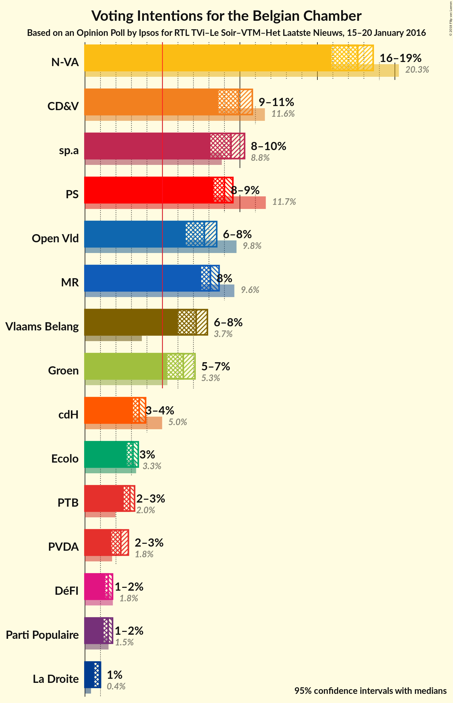
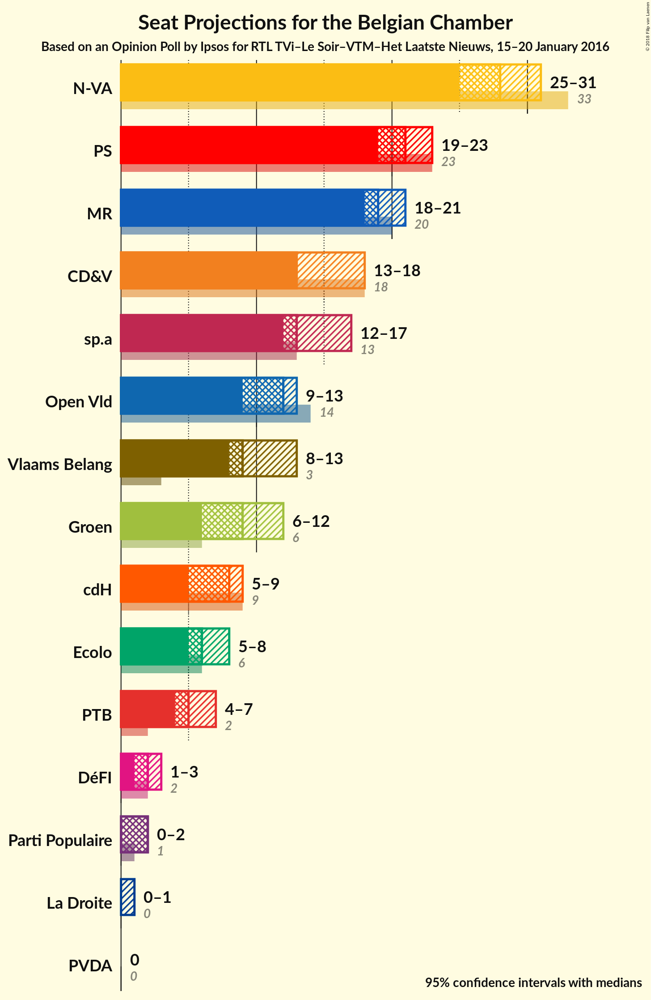
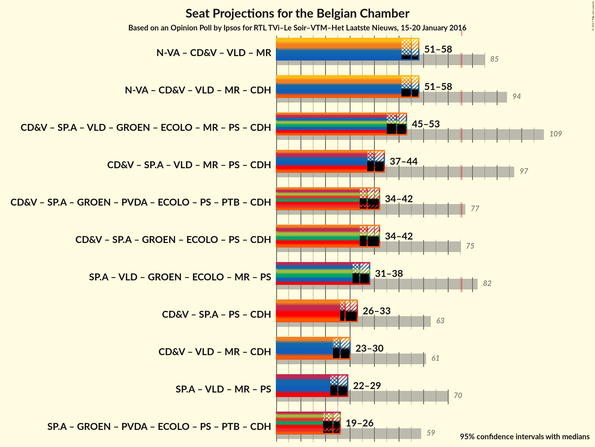

# Opinion Poll by Ipsos for RTL TVi–Le Soir–VTM–Het Laatste Nieuws, 15-20 January 2016

<a href="#voting-intentions">Voting Intentions</a> | <a href="#seats">Seats</a> | <a href="#coalitions">Coalitions</a> | <a href="#technical-information">Technical Information</a>

## Voting Intentions

### Confidence Intervals

| Party | Last Result | Poll Result | 80% Confidence Interval | 90% Confidence Interval | 95% Confidence Interval | 99% Confidence Interval |
|:-----:|:-----------:|:-----------:|:-----------------------:|:-----------------------:|:-----------------------:|:-----------------------:|
| N-VA | 20.3% | 28.5% | 26.7–30.3% |26.2–30.8% |25.8–31.3% |25.0–32.2% |
| CD&V | 11.6% | 16.0% | 14.6–17.6% |14.2–18.0% |13.9–18.4% |13.3–19.1% |
| sp.a | 8.8% | 15.2% | 13.9–16.8% |13.5–17.2% |13.2–17.6% |12.6–18.3% |
| Open Vld | 9.8% | 12.5% | 11.2–13.9% |10.9–14.3% |10.6–14.6% |10.0–15.3% |
| Vlaams Belang | 3.7% | 11.6% | 10.4–13.0% |10.1–13.4% |9.8–13.7% |9.3–14.4% |
| Groen | 5.3% | 10.3% | 9.1–11.6% |8.8–11.9% |8.6–12.3% |8.0–12.9% |
| PVDA | 1.8% | 3.7% | 3.1–4.6% |2.9–4.9% |2.7–5.1% |2.5–5.5% |

*Note:* The poll result column reflects the actual value used in the calculations. Published results may vary slightly, and in addition be rounded to fewer digits.

## Seats

### Confidence Intervals

| Party | Last Result | Median | 80% Confidence Interval | 90% Confidence Interval | 95% Confidence Interval | 99% Confidence Interval |
|:-----:|:-----------:|:------:|:-----------------------:|:-----------------------:|:-----------------------:|:-----------------------:|
| <a href="#n-va">N-VA</a> | 33 | 28 | 26–31 |25–31 |24–31 |24–32 |
| <a href="#cd&v">CD&V</a> | 18 | 14 | 13–18 |13–18 |13–18 |13–18 |
| <a href="#sp.a">sp.a</a> | 13 | 14 | 13–15 |13–16 |12–17 |11–18 |
| <a href="#open-vld">Open Vld</a> | 14 | 12 | 11–12 |10–13 |9–13 |8–13 |
| <a href="#vlaams-belang">Vlaams Belang</a> | 3 | 9 | 8–12 |8–12 |8–13 |8–13 |
| <a href="#groen">Groen</a> | 6 | 9 | 7–10 |6–11 |6–11 |6–12 |
| <a href="#pvda">PVDA</a> | 0 | 0 | 0 |0 |0 |0 |

### N-VA

*For a full overview of the results for this party, see the [N-VA](party-nva.html) page.*

| Number of Seats | Probability | Accumulated | Special Marks |
|:---------------:|:-----------:|:-----------:|:-------------:|
| 24 | 3% | 100% |  |
| 25 | 3% | 97% |  |
| 26 | 9% | 94% |  |
| 27 | 15% | 85% |  |
| 28 | 22% | 70% | Median |
| 29 | 21% | 48% |  |
| 30 | 15% | 27% |  |
| 31 | 11% | 12% |  |
| 32 | 0.6% | 0.9% |  |
| 33 | 0.2% | 0.3% | Last Result |
| 34 | 0.1% | 0.1% |  |
| 35 | 0% | 0% |  |

### CD&V

*For a full overview of the results for this party, see the [CD&V](party-cdv.html) page.*

| Number of Seats | Probability | Accumulated | Special Marks |
|:---------------:|:-----------:|:-----------:|:-------------:|
| 11 | 0% | 100% |  |
| 12 | 0.2% | 99.9% |  |
| 13 | 41% | 99.8% |  |
| 14 | 18% | 59% | Median |
| 15 | 10% | 41% |  |
| 16 | 8% | 31% |  |
| 17 | 10% | 23% |  |
| 18 | 13% | 13% | Last Result |
| 19 | 0% | 0% |  |

### sp.a

*For a full overview of the results for this party, see the [sp.a](party-spa.html) page.*

| Number of Seats | Probability | Accumulated | Special Marks |
|:---------------:|:-----------:|:-----------:|:-------------:|
| 10 | 0.1% | 100% |  |
| 11 | 1.2% | 99.9% |  |
| 12 | 1.4% | 98.7% |  |
| 13 | 47% | 97% | Last Result |
| 14 | 15% | 50% | Median |
| 15 | 28% | 35% |  |
| 16 | 3% | 8% |  |
| 17 | 3% | 5% |  |
| 18 | 2% | 2% |  |
| 19 | 0% | 0% |  |

### Open Vld

*For a full overview of the results for this party, see the [Open Vld](party-openvld.html) page.*

| Number of Seats | Probability | Accumulated | Special Marks |
|:---------------:|:-----------:|:-----------:|:-------------:|
| 8 | 2% | 100% |  |
| 9 | 2% | 98% |  |
| 10 | 3% | 96% |  |
| 11 | 37% | 93% |  |
| 12 | 48% | 55% | Median |
| 13 | 7% | 7% |  |
| 14 | 0.3% | 0.4% | Last Result |
| 15 | 0.1% | 0.2% |  |
| 16 | 0% | 0.1% |  |
| 17 | 0% | 0% |  |

### Vlaams Belang

*For a full overview of the results for this party, see the [Vlaams Belang](party-vlaamsbelang.html) page.*

| Number of Seats | Probability | Accumulated | Special Marks |
|:---------------:|:-----------:|:-----------:|:-------------:|
| 3 | 0% | 100% | Last Result |
| 4 | 0% | 100% |  |
| 5 | 0% | 100% |  |
| 6 | 0% | 100% |  |
| 7 | 0.1% | 100% |  |
| 8 | 41% | 99.9% |  |
| 9 | 13% | 59% | Median |
| 10 | 11% | 45% |  |
| 11 | 12% | 35% |  |
| 12 | 20% | 23% |  |
| 13 | 3% | 3% |  |
| 14 | 0.1% | 0.2% |  |
| 15 | 0% | 0% |  |

### Groen

*For a full overview of the results for this party, see the [Groen](party-groen.html) page.*

| Number of Seats | Probability | Accumulated | Special Marks |
|:---------------:|:-----------:|:-----------:|:-------------:|
| 5 | 0.2% | 100% |  |
| 6 | 10% | 99.8% | Last Result |
| 7 | 6% | 90% |  |
| 8 | 16% | 84% |  |
| 9 | 33% | 68% | Median |
| 10 | 26% | 35% |  |
| 11 | 7% | 9% |  |
| 12 | 2% | 2% |  |
| 13 | 0% | 0% |  |

### PVDA

*For a full overview of the results for this party, see the [PVDA](party-pvda.html) page.*

| Number of Seats | Probability | Accumulated | Special Marks |
|:---------------:|:-----------:|:-----------:|:-------------:|
| 0 | 100% | 100% | Last Result, Median |

## Coalitions

### Confidence Intervals

| Coalition | Last Result | Median | Majority? | 80% Confidence Interval | 90% Confidence Interval | 95% Confidence Interval | 99% Confidence Interval |
|:---------:|:-----------:|:------:|:---------:|:-----------------------:|:-----------------------:|:-----------------------:|:-----------------------:|

## Technical Information

### Opinion Poll

+ **Pollster:** Ipsos
+ **Media:** RTL TVi–Le Soir–VTM–Het Laatste Nieuws
+ **Fieldwork period:** 15-20 January 2016

### Calculations

+ **Sample size:** 1043
+ **Simulations done:** 16,777,216
+ **Error estimate:** 0.72%

