# Opinion Poll by Ipsos for RTL TVi–Le Soir–VTM–Het Laatste Nieuws, 15–20 January 2016

Areas included: Brussels, Flanders, Wallonia

<a href="#voting-intentions">Voting Intentions</a> | <a href="#seats">Seats</a> | <a href="#coalitions">Coalitions</a> | <a href="#technical-information">Technical Information</a>

## Voting Intentions

### Confidence Intervals

| Party | Last Result | Poll Result | 80% Confidence Interval | 90% Confidence Interval | 95% Confidence Interval | 99% Confidence Interval |
|:-----:|:-----------:|:-----------:|:-----------------------:|:-----------------------:|:-----------------------:|:-----------------------:|
| N-VA | 20.3% | 17.6% | 16.5–18.4% |16.2–18.5% |15.9–18.6% |15.4–18.7% |
| CD&V | 11.6% | 9.9% | 9.0–10.6% |8.8–10.7% |8.6–10.8% |8.2–10.8% |
| PS | 11.7% | 9.5% | 8.5–8.9% |8.4–9.0% |8.3–9.0% |8.1–9.0% |
| sp.a | 8.8% | 9.4% | 8.5–10.1% |8.3–10.2% |8.1–10.3% |7.8–10.3% |
| MR | 9.6% | 8.7% | 7.7–8.0% |7.6–8.1% |7.5–8.1% |7.3–8.1% |
| Open Vld | 9.8% | 7.7% | 6.9–8.3% |6.7–8.4% |6.5–8.5% |6.2–8.5% |
| Vlaams Belang | 3.7% | 7.2% | 6.4–7.8% |6.2–7.9% |6.0–7.9% |5.7–8.0% |
| Groen | 5.3% | 6.3% | 5.6–6.9% |5.4–7.0% |5.3–7.1% |5.0–7.1% |
| cdH | 5.0% | 3.9% | 3.2–3.5% |3.2–3.5% |3.1–3.5% |3.0–3.5% |
| Ecolo | 3.3% | 3.4% | 2.8–3.1% |2.7–3.1% |2.7–3.1% |2.6–3.1% |
| PTB | 2.0% | 3.2% | 2.6–2.8% |2.5–2.9% |2.5–2.9% |2.4–2.9% |
| PVDA | 1.8% | 2.3% | 1.9–2.7% |1.8–2.7% |1.7–2.8% |1.5–2.8% |
| DéFI | 1.8% | 1.8% | 1.4–1.5% |1.3–1.5% |1.3–1.5% |1.2–1.5% |
| Parti Populaire | 1.5% | 1.8% | 1.3–1.5% |1.3–1.5% |1.2–1.5% |1.1–1.5% |
| La Droite | 0.4% | 0.9% | 0.7–1.0% |0.7–1.0% |0.6–1.0% |0.6–1.0% |

*Note:* The poll result column reflects the actual value used in the calculations. Published results may vary slightly, and in addition be rounded to fewer digits.

## Seats

### Confidence Intervals

| Party | Last Result | Median | 80% Confidence Interval | 90% Confidence Interval | 95% Confidence Interval | 99% Confidence Interval |
|:-----:|:-----------:|:------:|:-----------------------:|:-----------------------:|:-----------------------:|:-----------------------:|
| <a href="#n-va">N-VA</a> | 33 | 28 | 26–31 |26–31 |25–31 |24–32 |
| <a href="#cd&v">CD&V</a> | 18 | 13 | 13–17 |13–18 |13–18 |13–18 |
| <a href="#ps">PS</a> | 23 | 21 | 20–22 |20–23 |19–23 |19–24 |
| <a href="#sp.a">sp.a</a> | 13 | 13 | 13–15 |13–16 |12–17 |11–18 |
| <a href="#mr">MR</a> | 20 | 19 | 18–20 |18–21 |18–21 |17–22 |
| <a href="#open-vld">Open Vld</a> | 14 | 12 | 11–12 |10–13 |9–13 |8–14 |
| <a href="#vlaams-belang">Vlaams Belang</a> | 3 | 9 | 8–12 |8–12 |8–13 |8–13 |
| <a href="#groen">Groen</a> | 6 | 9 | 8–11 |6–11 |6–12 |6–12 |
| <a href="#cdh">cdH</a> | 9 | 8 | 6–9 |6–9 |5–9 |5–9 |
| <a href="#ecolo">Ecolo</a> | 6 | 6 | 5–7 |5–7 |5–8 |4–8 |
| <a href="#ptb">PTB</a> | 2 | 5 | 4–6 |4–6 |4–7 |4–7 |
| <a href="#pvda">PVDA</a> | 0 | 0 | 0 |0 |0 |0 |
| <a href="#défi">DéFI</a> | 2 | 2 | 2 |2–3 |1–3 |1–3 |
| <a href="#parti-populaire">Parti Populaire</a> | 1 | 2 | 0–2 |0–2 |0–2 |0–2 |
| <a href="#la-droite">La Droite</a> | 0 | 0 | 0 |0–1 |0–1 |0–1 |

### N-VA

*For a full overview of the results for this party, see the [N-VA](party-n-va.html) page.*

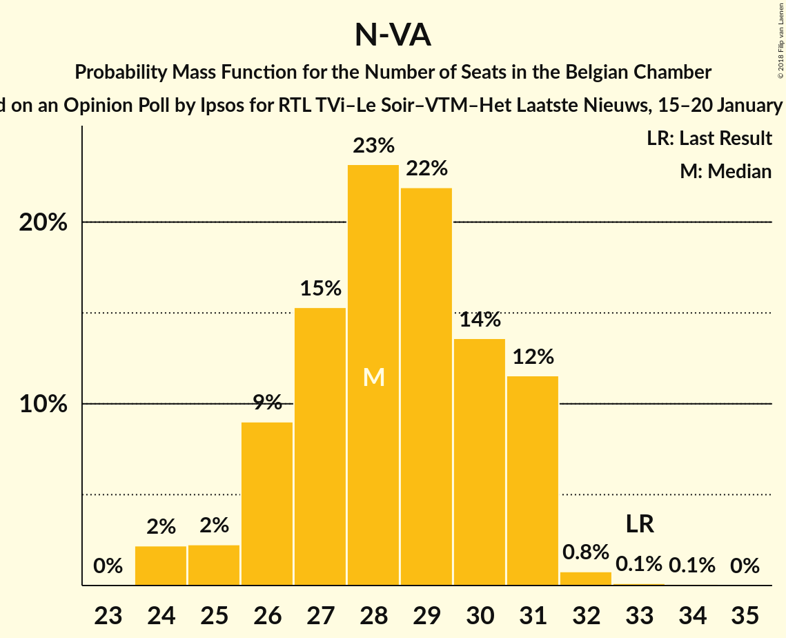

| Number of Seats | Probability | Accumulated | Special Marks |
|:---------------:|:-----------:|:-----------:|:-------------:|
| 24 | 2% | 100% |  |
| 25 | 2% | 98% |  |
| 26 | 9% | 95% |  |
| 27 | 16% | 87% |  |
| 28 | 23% | 71% | Median |
| 29 | 22% | 47% |  |
| 30 | 14% | 26% |  |
| 31 | 11% | 12% |  |
| 32 | 0.7% | 0.9% |  |
| 33 | 0.1% | 0.2% | Last Result |
| 34 | 0.1% | 0.1% |  |
| 35 | 0% | 0% |  |

### CD&V

*For a full overview of the results for this party, see the [CD&V](party-cdv.html) page.*

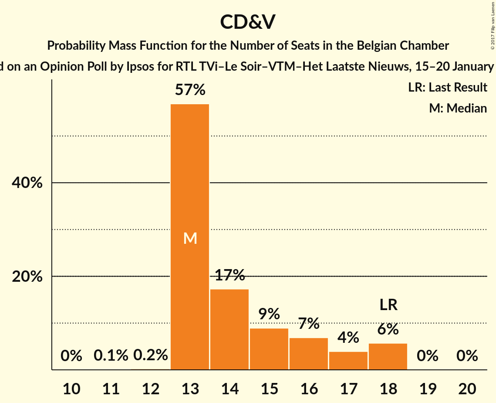

| Number of Seats | Probability | Accumulated | Special Marks |
|:---------------:|:-----------:|:-----------:|:-------------:|
| 11 | 0.1% | 100% |  |
| 12 | 0.3% | 99.9% |  |
| 13 | 58% | 99.6% | Median |
| 14 | 17% | 42% |  |
| 15 | 8% | 25% |  |
| 16 | 6% | 17% |  |
| 17 | 4% | 11% |  |
| 18 | 6% | 6% | Last Result |
| 19 | 0% | 0.1% |  |
| 20 | 0% | 0% |  |

### PS

*For a full overview of the results for this party, see the [PS](party-ps.html) page.*

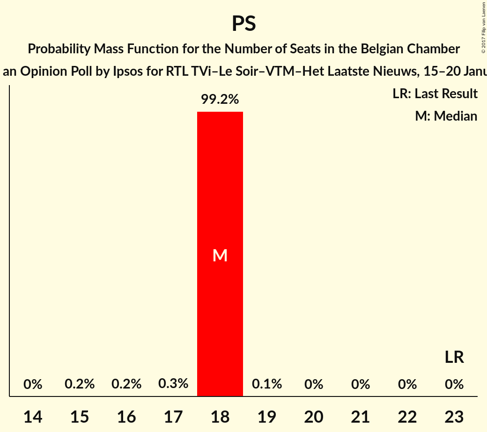

| Number of Seats | Probability | Accumulated | Special Marks |
|:---------------:|:-----------:|:-----------:|:-------------:|
| 18 | 0.2% | 100% |  |
| 19 | 4% | 99.8% |  |
| 20 | 26% | 96% |  |
| 21 | 29% | 70% | Median |
| 22 | 32% | 41% |  |
| 23 | 9% | 10% | Last Result |
| 24 | 0.4% | 0.5% |  |
| 25 | 0.1% | 0.1% |  |
| 26 | 0% | 0% |  |

### sp.a

*For a full overview of the results for this party, see the [sp.a](party-spa.html) page.*

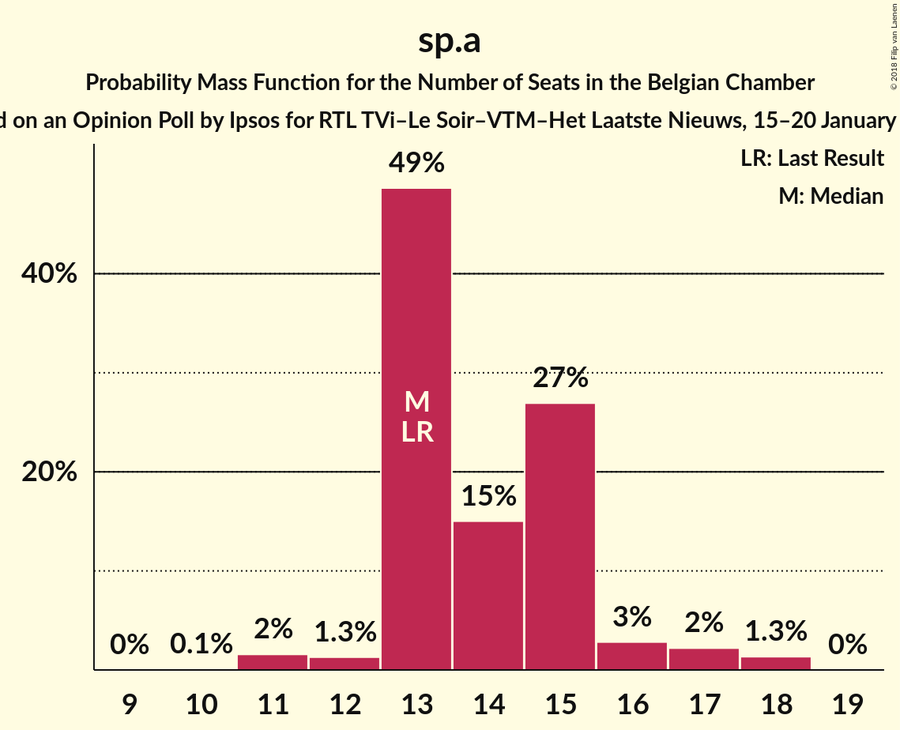

| Number of Seats | Probability | Accumulated | Special Marks |
|:---------------:|:-----------:|:-----------:|:-------------:|
| 10 | 0.1% | 100% |  |
| 11 | 1.5% | 99.9% |  |
| 12 | 1.2% | 98% |  |
| 13 | 48% | 97% | Last Result, Median |
| 14 | 16% | 49% |  |
| 15 | 27% | 33% |  |
| 16 | 3% | 6% |  |
| 17 | 3% | 4% |  |
| 18 | 1.2% | 1.3% |  |
| 19 | 0% | 0% |  |

### MR

*For a full overview of the results for this party, see the [MR](party-mr.html) page.*

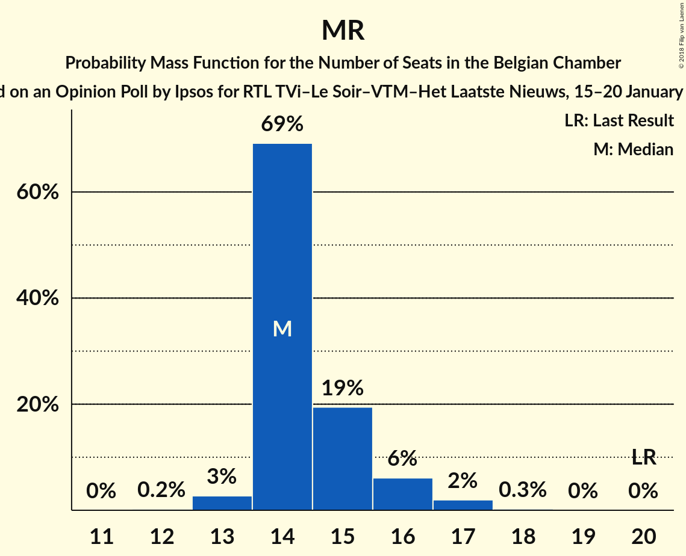

| Number of Seats | Probability | Accumulated | Special Marks |
|:---------------:|:-----------:|:-----------:|:-------------:|
| 16 | 0.1% | 100% |  |
| 17 | 1.3% | 99.9% |  |
| 18 | 24% | 98.6% |  |
| 19 | 48% | 74% | Median |
| 20 | 18% | 26% | Last Result |
| 21 | 6% | 8% |  |
| 22 | 2% | 2% |  |
| 23 | 0.3% | 0.3% |  |
| 24 | 0% | 0% |  |

### Open Vld

*For a full overview of the results for this party, see the [Open Vld](party-openvld.html) page.*

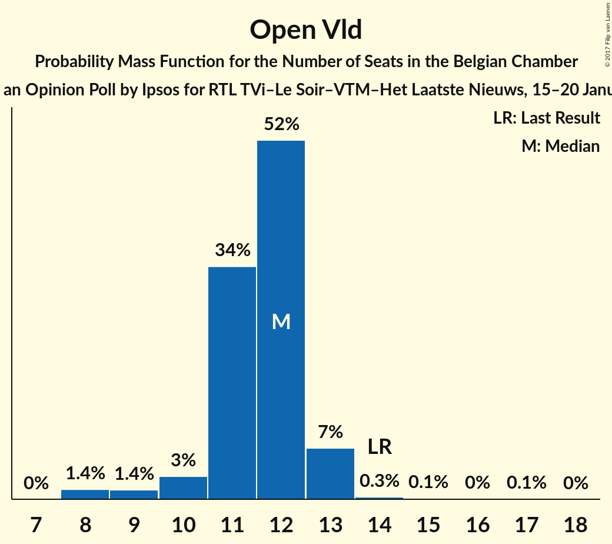

| Number of Seats | Probability | Accumulated | Special Marks |
|:---------------:|:-----------:|:-----------:|:-------------:|
| 8 | 1.5% | 100% |  |
| 9 | 1.4% | 98.5% |  |
| 10 | 3% | 97% |  |
| 11 | 33% | 94% |  |
| 12 | 52% | 61% | Median |
| 13 | 8% | 8% |  |
| 14 | 0.4% | 0.6% | Last Result |
| 15 | 0.1% | 0.2% |  |
| 16 | 0% | 0.1% |  |
| 17 | 0.1% | 0.1% |  |
| 18 | 0% | 0% |  |

### Vlaams Belang

*For a full overview of the results for this party, see the [Vlaams Belang](party-vlaamsbelang.html) page.*

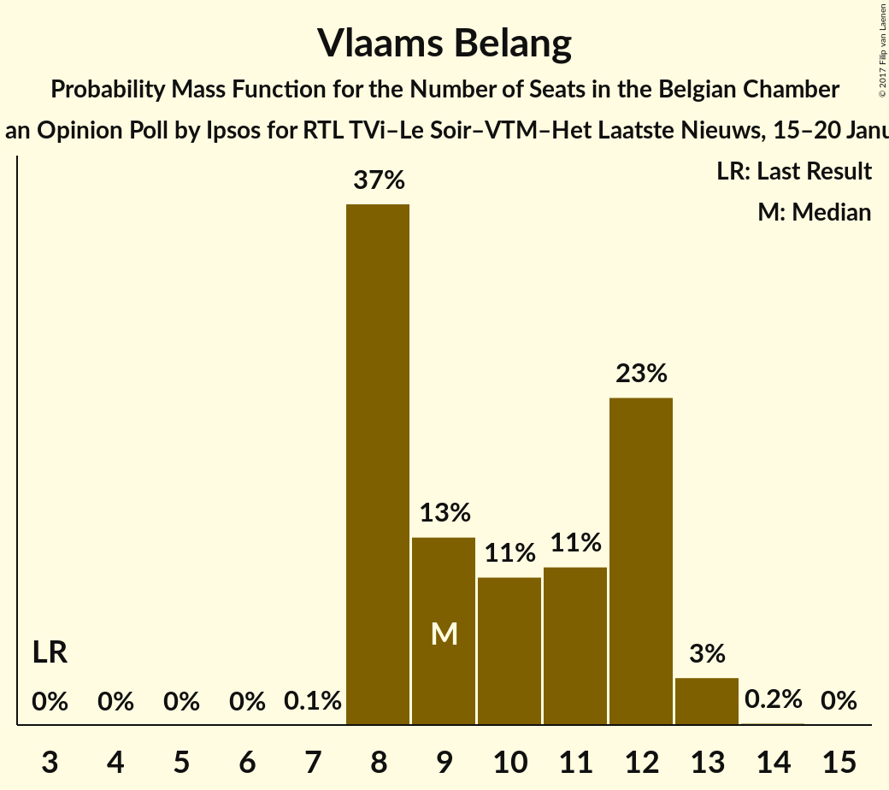

| Number of Seats | Probability | Accumulated | Special Marks |
|:---------------:|:-----------:|:-----------:|:-------------:|
| 3 | 0% | 100% | Last Result |
| 4 | 0% | 100% |  |
| 5 | 0% | 100% |  |
| 6 | 0% | 100% |  |
| 7 | 0.1% | 100% |  |
| 8 | 37% | 99.9% |  |
| 9 | 13% | 63% | Median |
| 10 | 11% | 50% |  |
| 11 | 12% | 39% |  |
| 12 | 23% | 27% |  |
| 13 | 3% | 4% |  |
| 14 | 0.2% | 0.2% |  |
| 15 | 0% | 0% |  |

### Groen

*For a full overview of the results for this party, see the [Groen](party-groen.html) page.*

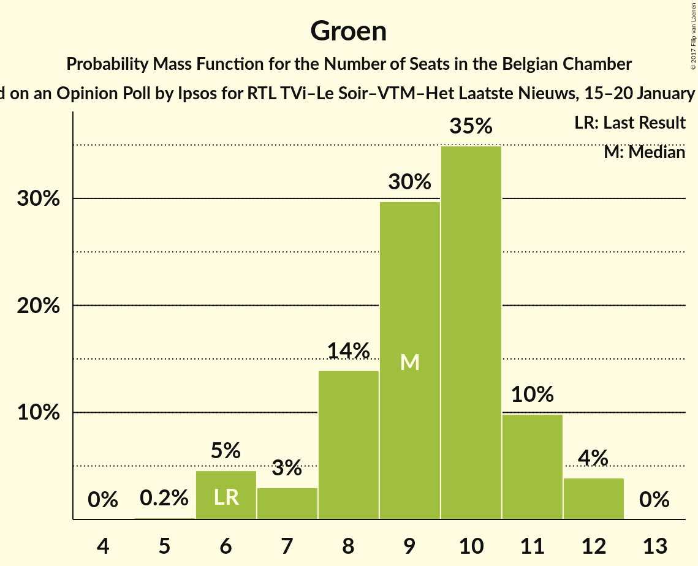

| Number of Seats | Probability | Accumulated | Special Marks |
|:---------------:|:-----------:|:-----------:|:-------------:|
| 5 | 0.2% | 100% |  |
| 6 | 5% | 99.8% | Last Result |
| 7 | 3% | 95% |  |
| 8 | 13% | 92% |  |
| 9 | 30% | 78% | Median |
| 10 | 35% | 49% |  |
| 11 | 10% | 14% |  |
| 12 | 4% | 4% |  |
| 13 | 0% | 0% |  |

### cdH

*For a full overview of the results for this party, see the [cdH](party-cdh.html) page.*

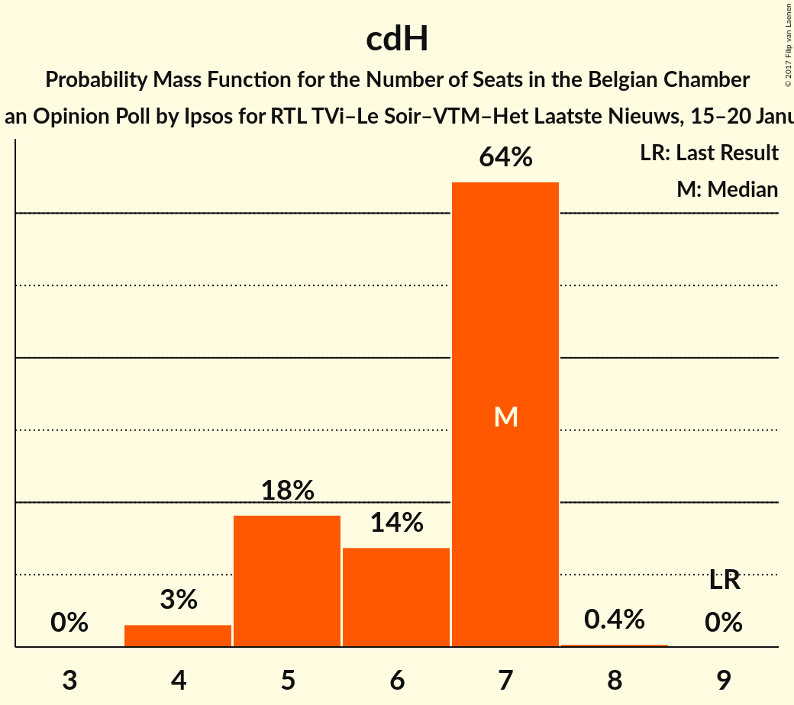

| Number of Seats | Probability | Accumulated | Special Marks |
|:---------------:|:-----------:|:-----------:|:-------------:|
| 5 | 3% | 100% |  |
| 6 | 14% | 97% |  |
| 7 | 15% | 83% |  |
| 8 | 55% | 68% | Median |
| 9 | 12% | 12% | Last Result |
| 10 | 0.1% | 0.1% |  |
| 11 | 0% | 0% |  |

### Ecolo

*For a full overview of the results for this party, see the [Ecolo](party-ecolo.html) page.*

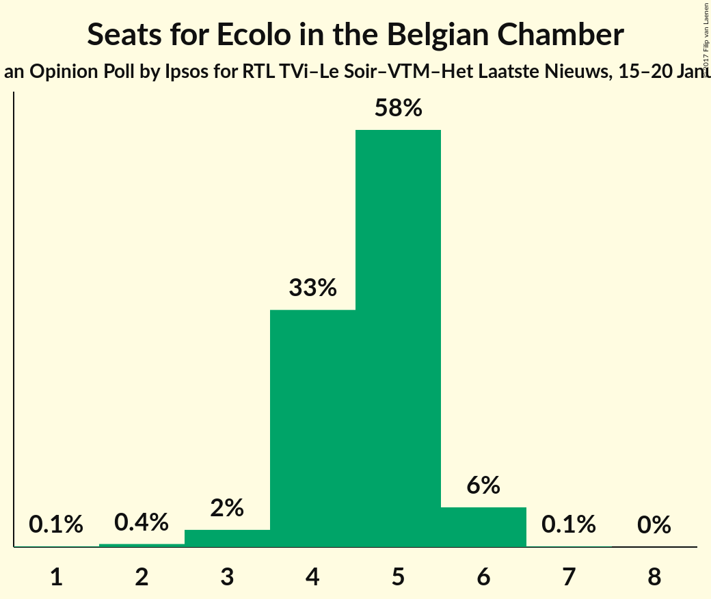

| Number of Seats | Probability | Accumulated | Special Marks |
|:---------------:|:-----------:|:-----------:|:-------------:|
| 3 | 0.2% | 100% |  |
| 4 | 1.0% | 99.7% |  |
| 5 | 13% | 98.7% |  |
| 6 | 42% | 86% | Last Result, Median |
| 7 | 40% | 44% |  |
| 8 | 4% | 4% |  |
| 9 | 0.1% | 0.1% |  |
| 10 | 0% | 0% |  |

### PTB

*For a full overview of the results for this party, see the [PTB](party-ptb.html) page.*

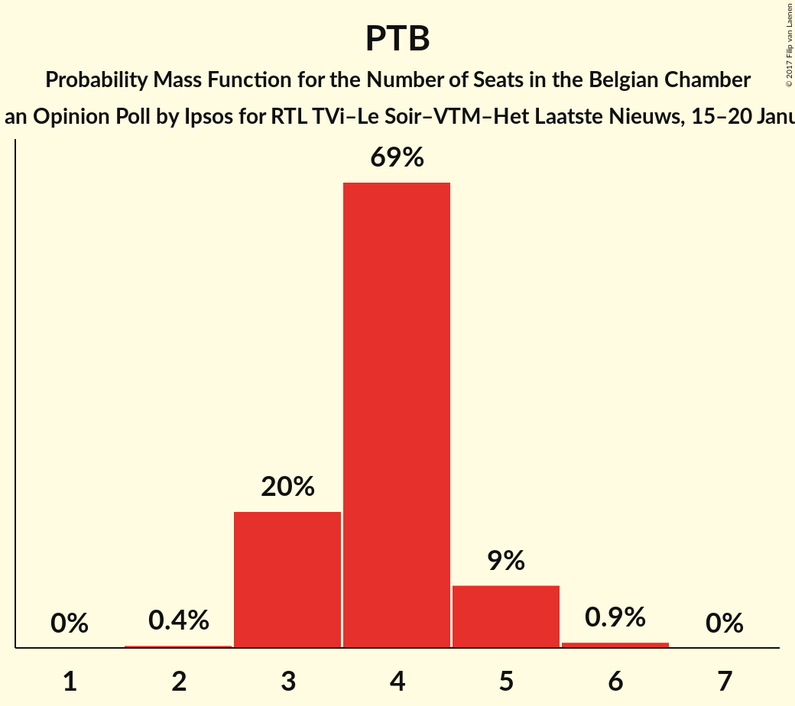

| Number of Seats | Probability | Accumulated | Special Marks |
|:---------------:|:-----------:|:-----------:|:-------------:|
| 2 | 0% | 100% | Last Result |
| 3 | 0.5% | 100% |  |
| 4 | 15% | 99.5% |  |
| 5 | 57% | 85% | Median |
| 6 | 24% | 27% |  |
| 7 | 3% | 3% |  |
| 8 | 0.2% | 0.2% |  |
| 9 | 0% | 0% |  |

### PVDA

*For a full overview of the results for this party, see the [PVDA](party-pvda.html) page.*

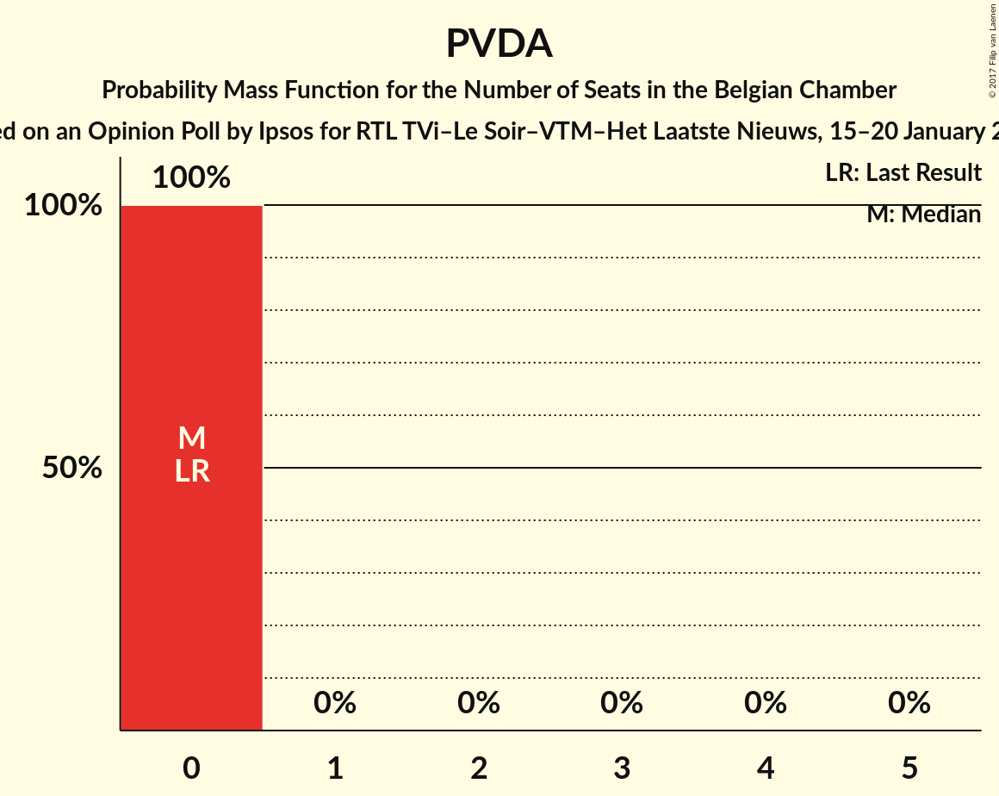

| Number of Seats | Probability | Accumulated | Special Marks |
|:---------------:|:-----------:|:-----------:|:-------------:|
| 0 | 100% | 100% | Last Result, Median |

### DéFI

*For a full overview of the results for this party, see the [DéFI](party-défi.html) page.*

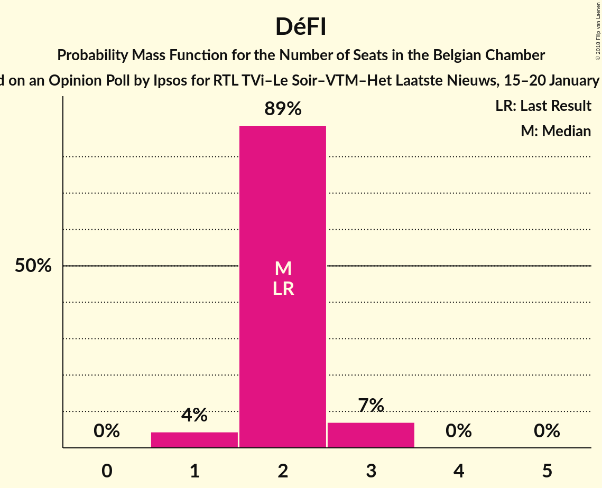

| Number of Seats | Probability | Accumulated | Special Marks |
|:---------------:|:-----------:|:-----------:|:-------------:|
| 1 | 4% | 100% |  |
| 2 | 89% | 96% | Last Result, Median |
| 3 | 7% | 7% |  |
| 4 | 0% | 0% |  |

### Parti Populaire

*For a full overview of the results for this party, see the [Parti Populaire](party-partipopulaire.html) page.*

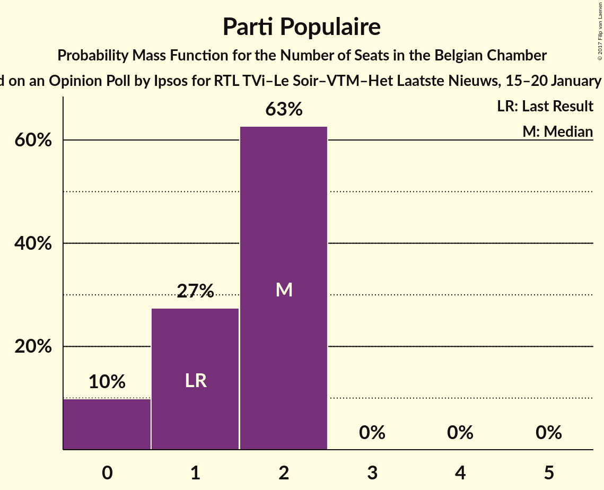

| Number of Seats | Probability | Accumulated | Special Marks |
|:---------------:|:-----------:|:-----------:|:-------------:|
| 0 | 10% | 100% |  |
| 1 | 25% | 90% | Last Result |
| 2 | 65% | 65% | Median |
| 3 | 0.1% | 0.1% |  |
| 4 | 0% | 0% |  |

### La Droite

*For a full overview of the results for this party, see the [La Droite](party-ladroite.html) page.*

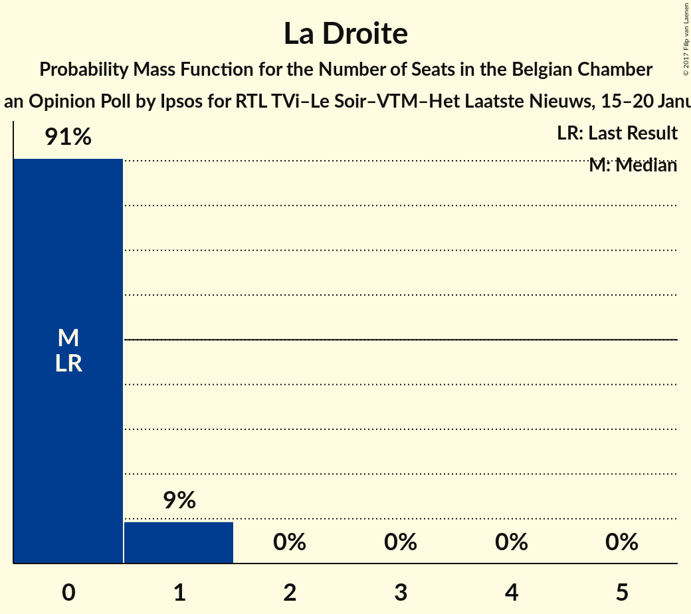

| Number of Seats | Probability | Accumulated | Special Marks |
|:---------------:|:-----------:|:-----------:|:-------------:|
| 0 | 90% | 100% | Last Result, Median |
| 1 | 10% | 10% |  |
| 2 | 0% | 0% |  |

## Coalitions

### Confidence Intervals

| Coalition | Last Result | Median | Majority? | 80% Confidence Interval | 90% Confidence Interval | 95% Confidence Interval | 99% Confidence Interval |
|:---------:|:-----------:|:------:|:---------:|:-----------------------:|:-----------------------:|:-----------------------:|:-----------------------:|
| CD&V – PS – sp.a – MR – Open Vld – Groen – cdH – Ecolo | 109 | 103 | 100% | 100–106 | 99–107 | 99–107 | 98–109 |
| CD&V – PS – sp.a – MR – Open Vld – cdH | 97 | 87 | 100% | 85–90 | 84–91 | 83–92 | 82–94 |
| PS – sp.a – MR – Open Vld – Groen – Ecolo | 82 | 81 | 99.5% | 79–84 | 78–85 | 77–86 | 76–87 |
| N-VA – CD&V – MR – Open Vld – cdH | 94 | 81 | 99.2% | 78–83 | 77–84 | 77–85 | 75–86 |
| CD&V – PS – sp.a – Groen – cdH – Ecolo – PTB – PVDA | 77 | 77 | 82% | 75–80 | 74–81 | 73–82 | 72–83 |
| CD&V – PS – MR – Open Vld – cdH | 84 | 73 | 16% | 71–76 | 71–77 | 70–78 | 69–79 |
| N-VA – CD&V – MR – Open Vld | 85 | 73 | 12% | 70–76 | 70–77 | 69–77 | 68–79 |
| CD&V – PS – sp.a – Groen – cdH – Ecolo | 75 | 72 | 9% | 70–75 | 69–76 | 68–77 | 67–78 |
| CD&V – MR – Open Vld – Groen – cdH – Ecolo | 73 | 68 | 0% | 65–71 | 65–72 | 64–72 | 63–74 |
| PS – sp.a – MR – Open Vld | 70 | 66 | 0% | 63–68 | 63–69 | 62–70 | 61–71 |
| PS – sp.a – Groen – cdH – Ecolo – PTB – PVDA | 59 | 63 | 0% | 61–66 | 60–67 | 59–67 | 58–69 |
| CD&V – PS – sp.a – cdH | 63 | 56 | 0% | 54–60 | 54–61 | 53–61 | 52–63 |
| PS – sp.a – Groen – Ecolo – PTB – PVDA | 50 | 56 | 0% | 53–58 | 53–59 | 52–60 | 51–61 |
| CD&V – MR – Open Vld – cdH | 61 | 52 | 0% | 50–55 | 49–56 | 49–57 | 48–58 |

### CD&V – PS – sp.a – MR – Open Vld – Groen – cdH – Ecolo

| Number of Seats | Probability | Accumulated | Special Marks |
|:---------------:|:-----------:|:-----------:|:-------------:|
| 96 | 0.1% | 100% |  |
| 97 | 0.3% | 99.9% |  |
| 98 | 1.2% | 99.6% |  |
| 99 | 3% | 98% |  |
| 100 | 7% | 95% |  |
| 101 | 13% | 88% | Median |
| 102 | 18% | 75% |  |
| 103 | 18% | 57% |  |
| 104 | 15% | 39% |  |
| 105 | 11% | 24% |  |
| 106 | 7% | 14% |  |
| 107 | 4% | 6% |  |
| 108 | 2% | 2% |  |
| 109 | 0.5% | 0.6% | Last Result |
| 110 | 0.1% | 0.1% |  |
| 111 | 0% | 0% |  |

### CD&V – PS – sp.a – MR – Open Vld – cdH

| Number of Seats | Probability | Accumulated | Special Marks |
|:---------------:|:-----------:|:-----------:|:-------------:|
| 81 | 0.2% | 100% |  |
| 82 | 0.6% | 99.8% |  |
| 83 | 2% | 99.1% |  |
| 84 | 5% | 97% |  |
| 85 | 12% | 92% |  |
| 86 | 17% | 80% | Median |
| 87 | 19% | 63% |  |
| 88 | 16% | 45% |  |
| 89 | 12% | 29% |  |
| 90 | 8% | 16% |  |
| 91 | 5% | 8% |  |
| 92 | 2% | 4% |  |
| 93 | 1.0% | 2% |  |
| 94 | 0.4% | 0.6% |  |
| 95 | 0.1% | 0.2% |  |
| 96 | 0% | 0% |  |
| 97 | 0% | 0% | Last Result |

### PS – sp.a – MR – Open Vld – Groen – Ecolo

| Number of Seats | Probability | Accumulated | Special Marks |
|:---------------:|:-----------:|:-----------:|:-------------:|
| 74 | 0.1% | 100% |  |
| 75 | 0.3% | 99.8% |  |
| 76 | 0.9% | 99.5% | Majority |
| 77 | 2% | 98.6% |  |
| 78 | 5% | 96% |  |
| 79 | 10% | 91% |  |
| 80 | 15% | 81% | Median |
| 81 | 19% | 66% |  |
| 82 | 18% | 48% | Last Result |
| 83 | 13% | 30% |  |
| 84 | 8% | 16% |  |
| 85 | 5% | 8% |  |
| 86 | 2% | 3% |  |
| 87 | 0.8% | 1.1% |  |
| 88 | 0.2% | 0.3% |  |
| 89 | 0.1% | 0.1% |  |
| 90 | 0% | 0% |  |

### N-VA – CD&V – MR – Open Vld – cdH

| Number of Seats | Probability | Accumulated | Special Marks |
|:---------------:|:-----------:|:-----------:|:-------------:|
| 73 | 0.1% | 100% |  |
| 74 | 0.2% | 99.9% |  |
| 75 | 0.6% | 99.8% |  |
| 76 | 2% | 99.2% | Majority |
| 77 | 4% | 98% |  |
| 78 | 9% | 93% |  |
| 79 | 15% | 84% |  |
| 80 | 18% | 70% | Median |
| 81 | 17% | 52% |  |
| 82 | 15% | 35% |  |
| 83 | 10% | 19% |  |
| 84 | 5% | 10% |  |
| 85 | 3% | 4% |  |
| 86 | 1.1% | 2% |  |
| 87 | 0.3% | 0.4% |  |
| 88 | 0.1% | 0.1% |  |
| 89 | 0% | 0% |  |
| 90 | 0% | 0% |  |
| 91 | 0% | 0% |  |
| 92 | 0% | 0% |  |
| 93 | 0% | 0% |  |
| 94 | 0% | 0% | Last Result |

### CD&V – PS – sp.a – Groen – cdH – Ecolo – PTB – PVDA

| Number of Seats | Probability | Accumulated | Special Marks |
|:---------------:|:-----------:|:-----------:|:-------------:|
| 70 | 0.1% | 100% |  |
| 71 | 0.2% | 99.9% |  |
| 72 | 0.8% | 99.7% |  |
| 73 | 2% | 98.9% |  |
| 74 | 5% | 97% |  |
| 75 | 10% | 92% | Median |
| 76 | 16% | 82% | Majority |
| 77 | 19% | 66% | Last Result |
| 78 | 17% | 47% |  |
| 79 | 12% | 30% |  |
| 80 | 9% | 18% |  |
| 81 | 5% | 9% |  |
| 82 | 3% | 4% |  |
| 83 | 1.0% | 1.4% |  |
| 84 | 0.3% | 0.4% |  |
| 85 | 0.1% | 0.1% |  |
| 86 | 0% | 0% |  |

### CD&V – PS – MR – Open Vld – cdH

| Number of Seats | Probability | Accumulated | Special Marks |
|:---------------:|:-----------:|:-----------:|:-------------:|
| 67 | 0.1% | 100% |  |
| 68 | 0.3% | 99.9% |  |
| 69 | 1.0% | 99.6% |  |
| 70 | 3% | 98.6% |  |
| 71 | 10% | 95% |  |
| 72 | 19% | 85% |  |
| 73 | 22% | 66% | Median |
| 74 | 17% | 44% |  |
| 75 | 11% | 27% |  |
| 76 | 7% | 16% | Majority |
| 77 | 5% | 9% |  |
| 78 | 3% | 4% |  |
| 79 | 1.0% | 1.3% |  |
| 80 | 0.2% | 0.3% |  |
| 81 | 0% | 0.1% |  |
| 82 | 0% | 0% |  |
| 83 | 0% | 0% |  |
| 84 | 0% | 0% | Last Result |

### N-VA – CD&V – MR – Open Vld

| Number of Seats | Probability | Accumulated | Special Marks |
|:---------------:|:-----------:|:-----------:|:-------------:|
| 66 | 0.1% | 100% |  |
| 67 | 0.3% | 99.9% |  |
| 68 | 0.8% | 99.6% |  |
| 69 | 2% | 98.8% |  |
| 70 | 7% | 97% |  |
| 71 | 14% | 90% |  |
| 72 | 17% | 76% | Median |
| 73 | 18% | 59% |  |
| 74 | 17% | 41% |  |
| 75 | 12% | 24% |  |
| 76 | 7% | 12% | Majority |
| 77 | 3% | 6% |  |
| 78 | 2% | 2% |  |
| 79 | 0.5% | 0.7% |  |
| 80 | 0.2% | 0.2% |  |
| 81 | 0% | 0% |  |
| 82 | 0% | 0% |  |
| 83 | 0% | 0% |  |
| 84 | 0% | 0% |  |
| 85 | 0% | 0% | Last Result |

### CD&V – PS – sp.a – Groen – cdH – Ecolo

| Number of Seats | Probability | Accumulated | Special Marks |
|:---------------:|:-----------:|:-----------:|:-------------:|
| 65 | 0.1% | 100% |  |
| 66 | 0.3% | 99.9% |  |
| 67 | 1.0% | 99.6% |  |
| 68 | 3% | 98.5% |  |
| 69 | 6% | 96% |  |
| 70 | 11% | 90% | Median |
| 71 | 16% | 79% |  |
| 72 | 19% | 63% |  |
| 73 | 16% | 45% |  |
| 74 | 12% | 29% |  |
| 75 | 8% | 17% | Last Result |
| 76 | 5% | 9% | Majority |
| 77 | 2% | 4% |  |
| 78 | 0.9% | 1.3% |  |
| 79 | 0.3% | 0.4% |  |
| 80 | 0.1% | 0.1% |  |
| 81 | 0% | 0% |  |

### CD&V – MR – Open Vld – Groen – cdH – Ecolo

| Number of Seats | Probability | Accumulated | Special Marks |
|:---------------:|:-----------:|:-----------:|:-------------:|
| 61 | 0.1% | 100% |  |
| 62 | 0.3% | 99.9% |  |
| 63 | 1.0% | 99.6% |  |
| 64 | 3% | 98.5% |  |
| 65 | 8% | 95% |  |
| 66 | 14% | 88% |  |
| 67 | 18% | 73% | Median |
| 68 | 17% | 55% |  |
| 69 | 14% | 38% |  |
| 70 | 11% | 24% |  |
| 71 | 7% | 13% |  |
| 72 | 4% | 6% |  |
| 73 | 2% | 2% | Last Result |
| 74 | 0.4% | 0.5% |  |
| 75 | 0.1% | 0.1% |  |
| 76 | 0% | 0% | Majority |

### PS – sp.a – MR – Open Vld

| Number of Seats | Probability | Accumulated | Special Marks |
|:---------------:|:-----------:|:-----------:|:-------------:|
| 59 | 0.1% | 100% |  |
| 60 | 0.3% | 99.9% |  |
| 61 | 0.9% | 99.6% |  |
| 62 | 3% | 98.7% |  |
| 63 | 8% | 96% |  |
| 64 | 15% | 88% |  |
| 65 | 20% | 74% | Median |
| 66 | 20% | 54% |  |
| 67 | 15% | 34% |  |
| 68 | 10% | 18% |  |
| 69 | 5% | 8% |  |
| 70 | 2% | 3% | Last Result |
| 71 | 0.8% | 1.1% |  |
| 72 | 0.2% | 0.3% |  |
| 73 | 0.1% | 0.1% |  |
| 74 | 0% | 0% |  |

### PS – sp.a – Groen – cdH – Ecolo – PTB – PVDA

| Number of Seats | Probability | Accumulated | Special Marks |
|:---------------:|:-----------:|:-----------:|:-------------:|
| 56 | 0% | 100% |  |
| 57 | 0.2% | 99.9% |  |
| 58 | 0.6% | 99.8% |  |
| 59 | 2% | 99.1% | Last Result |
| 60 | 4% | 97% |  |
| 61 | 9% | 93% |  |
| 62 | 15% | 84% | Median |
| 63 | 20% | 70% |  |
| 64 | 21% | 49% |  |
| 65 | 14% | 29% |  |
| 66 | 8% | 14% |  |
| 67 | 4% | 6% |  |
| 68 | 2% | 2% |  |
| 69 | 0.6% | 0.7% |  |
| 70 | 0.1% | 0.2% |  |
| 71 | 0% | 0% |  |

### CD&V – PS – sp.a – cdH

| Number of Seats | Probability | Accumulated | Special Marks |
|:---------------:|:-----------:|:-----------:|:-------------:|
| 50 | 0% | 100% |  |
| 51 | 0.3% | 99.9% |  |
| 52 | 1.0% | 99.7% |  |
| 53 | 3% | 98.7% |  |
| 54 | 9% | 95% |  |
| 55 | 17% | 86% | Median |
| 56 | 20% | 69% |  |
| 57 | 18% | 49% |  |
| 58 | 13% | 31% |  |
| 59 | 8% | 18% |  |
| 60 | 5% | 10% |  |
| 61 | 3% | 5% |  |
| 62 | 1.4% | 2% |  |
| 63 | 0.6% | 0.9% | Last Result |
| 64 | 0.2% | 0.3% |  |
| 65 | 0.1% | 0.1% |  |
| 66 | 0% | 0% |  |

### PS – sp.a – Groen – Ecolo – PTB – PVDA

| Number of Seats | Probability | Accumulated | Special Marks |
|:---------------:|:-----------:|:-----------:|:-------------:|
| 49 | 0.1% | 100% |  |
| 50 | 0.4% | 99.9% | Last Result |
| 51 | 1.3% | 99.5% |  |
| 52 | 3% | 98% |  |
| 53 | 7% | 95% |  |
| 54 | 12% | 88% | Median |
| 55 | 19% | 76% |  |
| 56 | 21% | 57% |  |
| 57 | 17% | 37% |  |
| 58 | 11% | 20% |  |
| 59 | 5% | 9% |  |
| 60 | 2% | 4% |  |
| 61 | 1.0% | 1.4% |  |
| 62 | 0.3% | 0.4% |  |
| 63 | 0.1% | 0.1% |  |
| 64 | 0% | 0% |  |

### CD&V – MR – Open Vld – cdH

| Number of Seats | Probability | Accumulated | Special Marks |
|:---------------:|:-----------:|:-----------:|:-------------:|
| 46 | 0.1% | 100% |  |
| 47 | 0.4% | 99.9% |  |
| 48 | 1.2% | 99.5% |  |
| 49 | 4% | 98% |  |
| 50 | 11% | 94% |  |
| 51 | 20% | 84% |  |
| 52 | 23% | 63% | Median |
| 53 | 16% | 40% |  |
| 54 | 10% | 24% |  |
| 55 | 7% | 14% |  |
| 56 | 5% | 7% |  |
| 57 | 2% | 3% |  |
| 58 | 0.6% | 0.8% |  |
| 59 | 0.1% | 0.2% |  |
| 60 | 0% | 0% |  |
| 61 | 0% | 0% | Last Result |

## Technical Information

### Opinion Poll

+ **Polling firm:** Ipsos
+ **Commissioner(s):** RTL TVi–Le Soir–VTM–Het Laatste Nieuws
+ **Fieldwork period:** 15–20 January 2016

### Calculations

+ **Sample size:** 1687
+ **Simulations done:** 2,097,152
+ **Error estimate:** 0.99%

