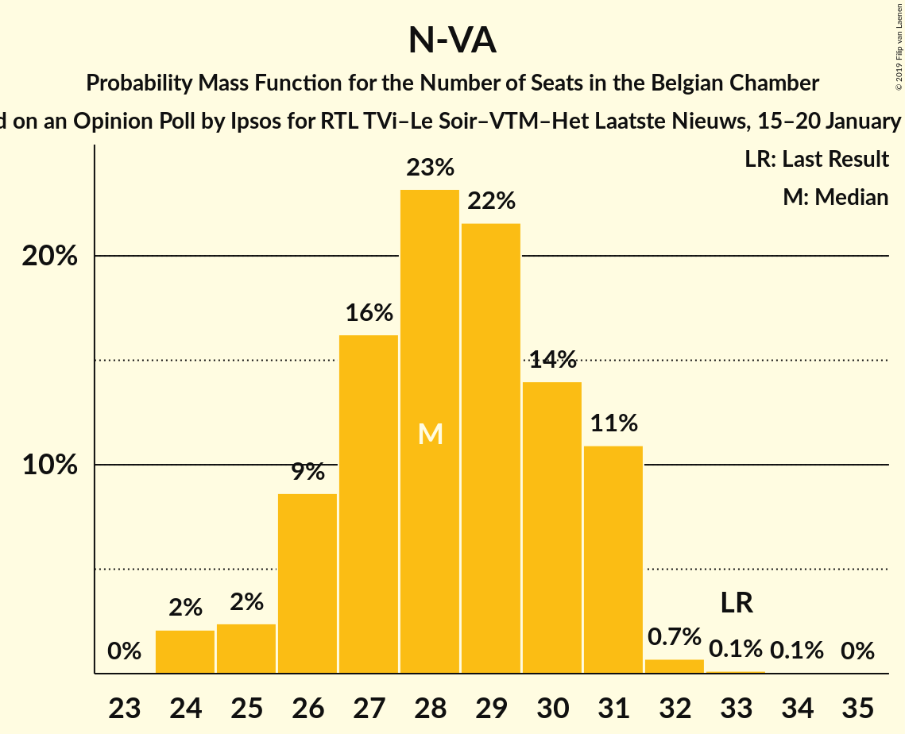
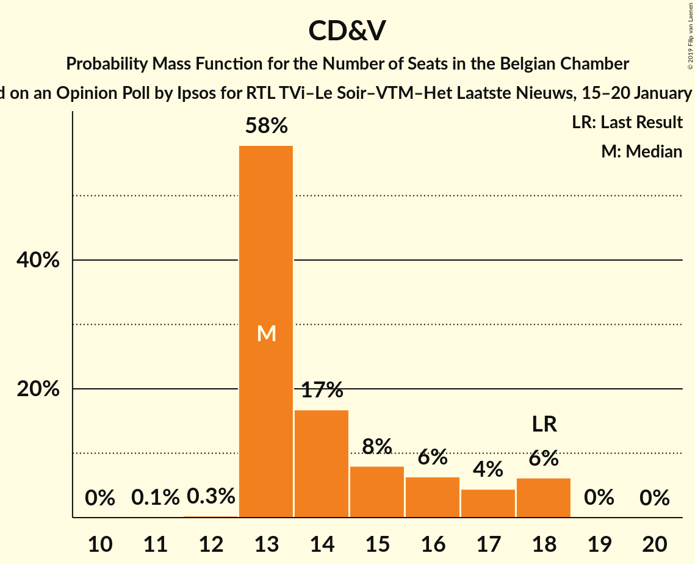
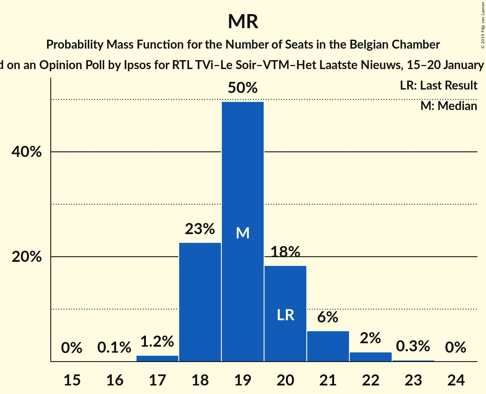
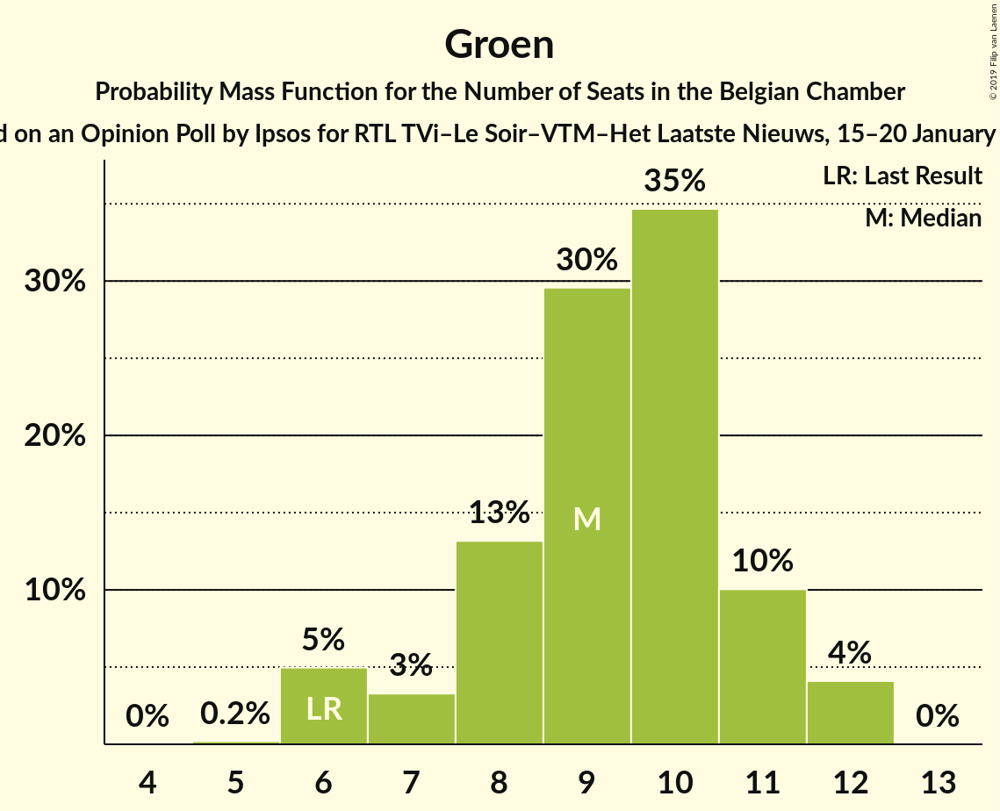
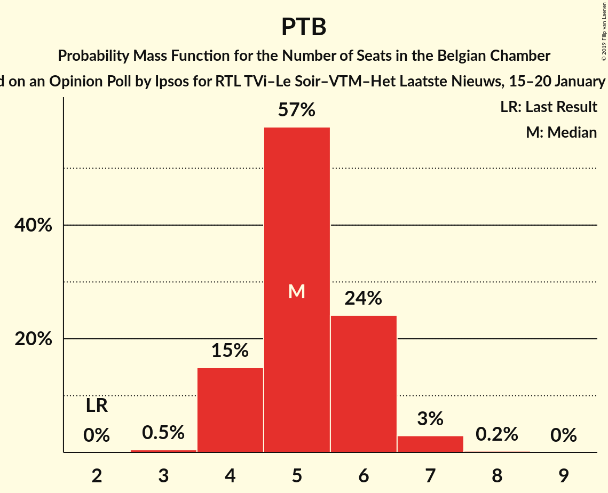
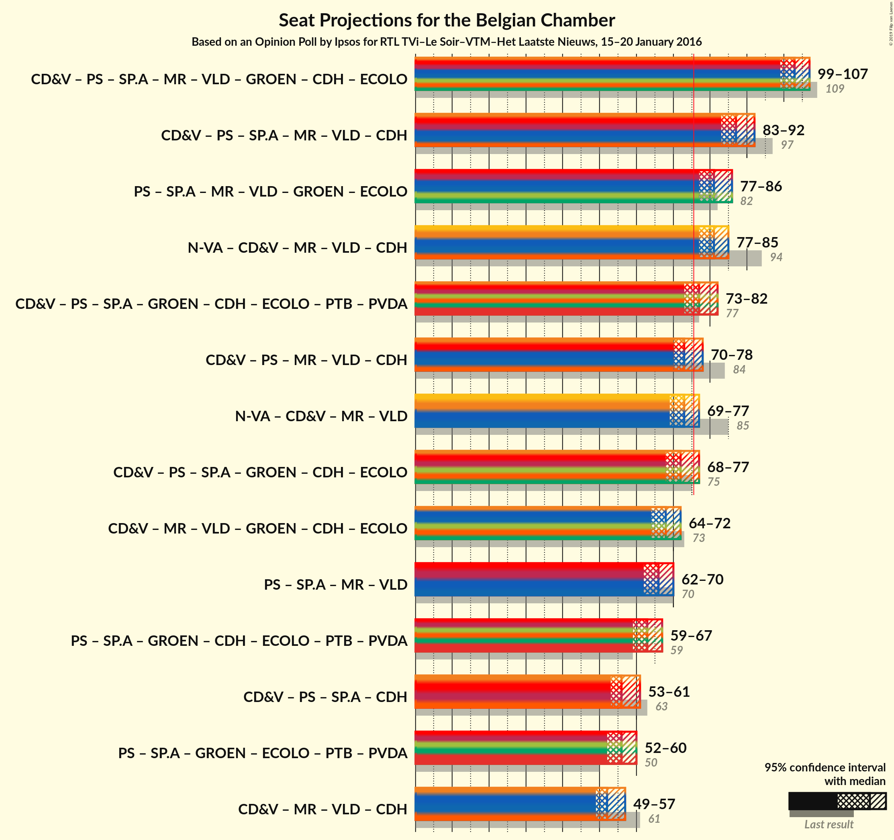

# Opinion Poll by Ipsos for RTL TVi–Le Soir–VTM–Het Laatste Nieuws, 15–20 January 2016

Areas included: Brussels, Flanders, Wallonia

<a href="#voting-intentions">Voting Intentions</a> | <a href="#seats">Seats</a> | <a href="#coalitions">Coalitions</a> | <a href="#technical-information">Technical Information</a>

## Voting Intentions

### Confidence Intervals

| Party | Last Result | Poll Result | 80% Confidence Interval | 90% Confidence Interval | 95% Confidence Interval | 99% Confidence Interval |
|:-----:|:-----------:|:-----------:|:-----------------------:|:-----------------------:|:-----------------------:|:-----------------------:|
| N-VA | 20.3% | 17.6% | 26.7–30.3% |26.2–30.8% |25.8–31.3% |25.0–32.2% |
| CD&V | 11.6% | 9.9% | 14.6–17.6% |14.2–18.0% |13.9–18.4% |13.3–19.1% |
| PS | 11.7% | 9.5% | N/A |N/A |N/A |N/A |
| sp.a | 8.8% | 9.4% | 13.9–16.8% |13.5–17.2% |13.2–17.6% |12.6–18.3% |
| MR | 9.6% | 8.7% | N/A |N/A |N/A |N/A |
| Open Vld | 9.8% | 7.7% | 11.2–13.9% |10.9–14.3% |10.6–14.6% |10.0–15.3% |
| Vlaams Belang | 3.7% | 7.2% | 10.4–13.0% |10.1–13.4% |9.8–13.7% |9.3–14.4% |
| Groen | 5.3% | 6.3% | 9.1–11.6% |8.8–11.9% |8.6–12.3% |8.0–12.9% |
| cdH | 5.0% | 3.9% | N/A |N/A |N/A |N/A |
| Ecolo | 3.3% | 3.4% | N/A |N/A |N/A |N/A |
| PTB | 2.0% | 3.2% | N/A |N/A |N/A |N/A |
| PVDA | 1.8% | 2.3% | 3.1–4.6% |2.9–4.9% |2.7–5.1% |2.5–5.5% |
| DéFI | 1.8% | 1.8% | N/A |N/A |N/A |N/A |
| Parti Populaire | 1.5% | 1.8% | N/A |N/A |N/A |N/A |
| La Droite | 0.4% | 0.9% | N/A |N/A |N/A |N/A |

*Note:* The poll result column reflects the actual value used in the calculations. Published results may vary slightly, and in addition be rounded to fewer digits.

## Seats

### Confidence Intervals

| Party | Last Result | Median | 80% Confidence Interval | 90% Confidence Interval | 95% Confidence Interval | 99% Confidence Interval |
|:-----:|:-----------:|:------:|:-----------------------:|:-----------------------:|:-----------------------:|:-----------------------:|
| <a href="#n-va">N-VA</a> | 33 | 28 | 26–31 |26–31 |25–31 |24–32 |
| <a href="#cd&v">CD&V</a> | 18 | 13 | 13–16 |13–18 |13–18 |13–18 |
| <a href="#ps">PS</a> | 23 | 21 | 20–22 |20–22 |19–22 |19–23 |
| <a href="#sp.a">sp.a</a> | 13 | 13 | 13–15 |13–16 |12–17 |11–18 |
| <a href="#mr">MR</a> | 20 | 19 | 19–20 |19–21 |18–21 |18–22 |
| <a href="#open-vld">Open Vld</a> | 14 | 12 | 11–12 |10–13 |9–13 |8–14 |
| <a href="#vlaams-belang">Vlaams Belang</a> | 3 | 9 | 8–12 |8–12 |8–13 |8–13 |
| <a href="#groen">Groen</a> | 6 | 9 | 8–11 |7–11 |6–12 |6–12 |
| <a href="#cdh">cdH</a> | 9 | 8 | 6–8 |6–8 |5–8 |5–9 |
| <a href="#ecolo">Ecolo</a> | 6 | 7 | 6–7 |6–8 |5–8 |4–8 |
| <a href="#ptb">PTB</a> | 2 | 5 | 4–6 |4–6 |4–6 |3–7 |
| <a href="#pvda">PVDA</a> | 0 | 0 | 0 |0 |0 |0 |
| <a href="#défi">DéFI</a> | 2 | 2 | 2 |2 |2 |2–3 |
| <a href="#parti-populaire">Parti Populaire</a> | 1 | 2 | 1–2 |0–2 |0–2 |0–2 |
| <a href="#la-droite">La Droite</a> | 0 | 0 | 0 |0–1 |0–1 |0–1 |

### N-VA

*For a full overview of the results for this party, see the [N-VA](party-n-va.html) page.*

| Number of Seats | Probability | Accumulated | Special Marks |
|:---------------:|:-----------:|:-----------:|:-------------:|
| 24 | 2% | 100% |  |
| 25 | 2% | 98% |  |
| 26 | 9% | 96% |  |
| 27 | 15% | 87% |  |
| 28 | 23% | 71% | Median |
| 29 | 22% | 48% |  |
| 30 | 14% | 26% |  |
| 31 | 12% | 13% |  |
| 32 | 0.8% | 1.0% |  |
| 33 | 0.1% | 0.2% | Last Result |
| 34 | 0.1% | 0.1% |  |
| 35 | 0% | 0% |  |

### CD&V

*For a full overview of the results for this party, see the [CD&V](party-cdv.html) page.*

| Number of Seats | Probability | Accumulated | Special Marks |
|:---------------:|:-----------:|:-----------:|:-------------:|
| 11 | 0.1% | 100% |  |
| 12 | 0.2% | 99.9% |  |
| 13 | 57% | 99.7% | Median |
| 14 | 17% | 43% |  |
| 15 | 9% | 26% |  |
| 16 | 7% | 17% |  |
| 17 | 4% | 10% |  |
| 18 | 6% | 6% | Last Result |
| 19 | 0% | 0.1% |  |
| 20 | 0% | 0% |  |

### PS

*For a full overview of the results for this party, see the [PS](party-ps.html) page.*

| Number of Seats | Probability | Accumulated | Special Marks |
|:---------------:|:-----------:|:-----------:|:-------------:|
| 18 | 0.1% | 100% |  |
| 19 | 3% | 99.9% |  |
| 20 | 29% | 97% |  |
| 21 | 29% | 68% | Median |
| 22 | 37% | 39% |  |
| 23 | 1.4% | 2% | Last Result |
| 24 | 0.3% | 0.3% |  |
| 25 | 0% | 0% |  |

### sp.a

*For a full overview of the results for this party, see the [sp.a](party-spa.html) page.*

| Number of Seats | Probability | Accumulated | Special Marks |
|:---------------:|:-----------:|:-----------:|:-------------:|
| 10 | 0.1% | 100% |  |
| 11 | 2% | 99.9% |  |
| 12 | 1.2% | 98% |  |
| 13 | 48% | 97% | Last Result, Median |
| 14 | 15% | 49% |  |
| 15 | 27% | 34% |  |
| 16 | 3% | 6% |  |
| 17 | 3% | 4% |  |
| 18 | 1.2% | 1.2% |  |
| 19 | 0% | 0% |  |

### MR

*For a full overview of the results for this party, see the [MR](party-mr.html) page.*

| Number of Seats | Probability | Accumulated | Special Marks |
|:---------------:|:-----------:|:-----------:|:-------------:|
| 17 | 0.3% | 100% |  |
| 18 | 3% | 99.7% |  |
| 19 | 69% | 96% | Median |
| 20 | 19% | 28% | Last Result |
| 21 | 6% | 8% |  |
| 22 | 2% | 2% |  |
| 23 | 0.3% | 0.3% |  |
| 24 | 0% | 0% |  |

### Open Vld

*For a full overview of the results for this party, see the [Open Vld](party-openvld.html) page.*

| Number of Seats | Probability | Accumulated | Special Marks |
|:---------------:|:-----------:|:-----------:|:-------------:|
| 8 | 1.4% | 100% |  |
| 9 | 1.4% | 98.6% |  |
| 10 | 3% | 97% |  |
| 11 | 34% | 94% |  |
| 12 | 52% | 60% | Median |
| 13 | 7% | 8% |  |
| 14 | 0.3% | 0.5% | Last Result |
| 15 | 0.1% | 0.2% |  |
| 16 | 0% | 0.1% |  |
| 17 | 0.1% | 0.1% |  |
| 18 | 0% | 0% |  |

### Vlaams Belang

*For a full overview of the results for this party, see the [Vlaams Belang](party-vlaamsbelang.html) page.*

| Number of Seats | Probability | Accumulated | Special Marks |
|:---------------:|:-----------:|:-----------:|:-------------:|
| 3 | 0% | 100% | Last Result |
| 4 | 0% | 100% |  |
| 5 | 0% | 100% |  |
| 6 | 0% | 100% |  |
| 7 | 0.1% | 100% |  |
| 8 | 37% | 99.9% |  |
| 9 | 13% | 63% | Median |
| 10 | 11% | 49% |  |
| 11 | 11% | 38% |  |
| 12 | 23% | 27% |  |
| 13 | 3% | 4% |  |
| 14 | 0.2% | 0.2% |  |
| 15 | 0% | 0% |  |

### Groen

*For a full overview of the results for this party, see the [Groen](party-groen.html) page.*

| Number of Seats | Probability | Accumulated | Special Marks |
|:---------------:|:-----------:|:-----------:|:-------------:|
| 5 | 0.2% | 100% |  |
| 6 | 5% | 99.8% | Last Result |
| 7 | 3% | 95% |  |
| 8 | 14% | 92% |  |
| 9 | 30% | 78% | Median |
| 10 | 35% | 49% |  |
| 11 | 10% | 14% |  |
| 12 | 4% | 4% |  |
| 13 | 0% | 0% |  |

### cdH

*For a full overview of the results for this party, see the [cdH](party-cdh.html) page.*

| Number of Seats | Probability | Accumulated | Special Marks |
|:---------------:|:-----------:|:-----------:|:-------------:|
| 5 | 3% | 100% |  |
| 6 | 18% | 97% |  |
| 7 | 14% | 79% |  |
| 8 | 64% | 65% | Median |
| 9 | 0.7% | 0.7% | Last Result |
| 10 | 0% | 0% |  |

### Ecolo

*For a full overview of the results for this party, see the [Ecolo](party-ecolo.html) page.*

| Number of Seats | Probability | Accumulated | Special Marks |
|:---------------:|:-----------:|:-----------:|:-------------:|
| 3 | 0.1% | 100% |  |
| 4 | 0.4% | 99.9% |  |
| 5 | 3% | 99.5% |  |
| 6 | 35% | 97% | Last Result |
| 7 | 56% | 62% | Median |
| 8 | 6% | 6% |  |
| 9 | 0.1% | 0.1% |  |
| 10 | 0% | 0% |  |

### PTB

*For a full overview of the results for this party, see the [PTB](party-ptb.html) page.*

| Number of Seats | Probability | Accumulated | Special Marks |
|:---------------:|:-----------:|:-----------:|:-------------:|
| 2 | 0% | 100% | Last Result |
| 3 | 0.5% | 100% |  |
| 4 | 20% | 99.5% |  |
| 5 | 69% | 79% | Median |
| 6 | 10% | 11% |  |
| 7 | 0.9% | 0.9% |  |
| 8 | 0% | 0% |  |

### PVDA

*For a full overview of the results for this party, see the [PVDA](party-pvda.html) page.*

| Number of Seats | Probability | Accumulated | Special Marks |
|:---------------:|:-----------:|:-----------:|:-------------:|
| 0 | 100% | 100% | Last Result, Median |

### DéFI

*For a full overview of the results for this party, see the [DéFI](party-défi.html) page.*

| Number of Seats | Probability | Accumulated | Special Marks |
|:---------------:|:-----------:|:-----------:|:-------------:|
| 2 | 98.7% | 100% | Last Result, Median |
| 3 | 1.3% | 1.3% |  |
| 4 | 0% | 0% |  |

### Parti Populaire

*For a full overview of the results for this party, see the [Parti Populaire](party-partipopulaire.html) page.*

| Number of Seats | Probability | Accumulated | Special Marks |
|:---------------:|:-----------:|:-----------:|:-------------:|
| 0 | 10% | 100% |  |
| 1 | 27% | 90% | Last Result |
| 2 | 62% | 63% | Median |
| 3 | 0.4% | 0.4% |  |
| 4 | 0% | 0% |  |

### La Droite

*For a full overview of the results for this party, see the [La Droite](party-ladroite.html) page.*

| Number of Seats | Probability | Accumulated | Special Marks |
|:---------------:|:-----------:|:-----------:|:-------------:|
| 0 | 91% | 100% | Last Result, Median |
| 1 | 9% | 9% |  |
| 2 | 0% | 0% |  |

## Coalitions

### Confidence Intervals

| Coalition | Last Result | Median | Majority? | 80% Confidence Interval | 90% Confidence Interval | 95% Confidence Interval | 99% Confidence Interval |
|:---------:|:-----------:|:------:|:---------:|:-----------------------:|:-----------------------:|:-----------------------:|:-----------------------:|
| CD&V – PS – sp.a – MR – Open Vld – Groen – cdH – Ecolo | 109 | 103 | 100% | 101–106 | 100–107 | 99–108 | 98–109 |
| CD&V – PS – sp.a – MR – Open Vld – cdH | 97 | 87 | 100% | 85–90 | 84–91 | 84–92 | 82–93 |
| PS – sp.a – MR – Open Vld – Groen – Ecolo | 82 | 82 | 99.8% | 79–85 | 78–85 | 78–86 | 76–87 |
| N-VA – CD&V – MR – Open Vld – cdH | 94 | 81 | 99.4% | 78–83 | 77–84 | 77–85 | 75–86 |
| CD&V – PS – sp.a – Groen – cdH – Ecolo – PTB – PVDA | 77 | 77 | 79% | 75–80 | 74–81 | 73–82 | 72–83 |
| CD&V – PS – MR – Open Vld – cdH | 84 | 73 | 14% | 71–76 | 71–77 | 70–78 | 69–79 |
| N-VA – CD&V – MR – Open Vld | 85 | 73 | 13% | 71–76 | 70–77 | 70–77 | 68–79 |
| CD&V – PS – sp.a – Groen – cdH – Ecolo | 75 | 72 | 8% | 70–75 | 69–76 | 68–77 | 67–78 |
| PS – sp.a – MR – Open Vld | 70 | 66 | 0% | 64–68 | 63–69 | 62–70 | 61–71 |
| PS – sp.a – Groen – cdH – Ecolo – PTB – PVDA | 59 | 63 | 0% | 61–66 | 60–66 | 59–67 | 58–68 |
| CD&V – PS – sp.a – cdH | 63 | 56 | 0% | 54–59 | 53–60 | 53–61 | 52–63 |
| PS – sp.a – Groen – Ecolo – PTB – PVDA | 50 | 56 | 0% | 53–58 | 53–59 | 52–60 | 51–61 |
| CD&V – MR – Open Vld – cdH | 61 | 52 | 0% | 50–55 | 50–56 | 49–56 | 48–58 |
| CD&V – MR – Open Vld – Groen – cdH – Ecolo | 73 | 33 | 0% | 32–35 | 32–35 | 31–35 | 31–36 |

### CD&V – PS – sp.a – MR – Open Vld – Groen – cdH – Ecolo

| Number of Seats | Probability | Accumulated | Special Marks |
|:---------------:|:-----------:|:-----------:|:-------------:|
| 97 | 0.2% | 100% |  |
| 98 | 0.7% | 99.8% |  |
| 99 | 2% | 99.1% |  |
| 100 | 6% | 97% |  |
| 101 | 11% | 91% |  |
| 102 | 17% | 79% | Median |
| 103 | 19% | 62% |  |
| 104 | 16% | 43% |  |
| 105 | 12% | 28% |  |
| 106 | 8% | 16% |  |
| 107 | 5% | 7% |  |
| 108 | 2% | 3% |  |
| 109 | 0.5% | 0.6% | Last Result |
| 110 | 0.1% | 0.1% |  |
| 111 | 0% | 0% |  |

### CD&V – PS – sp.a – MR – Open Vld – cdH

| Number of Seats | Probability | Accumulated | Special Marks |
|:---------------:|:-----------:|:-----------:|:-------------:|
| 81 | 0.2% | 100% |  |
| 82 | 0.6% | 99.8% |  |
| 83 | 1.5% | 99.2% |  |
| 84 | 5% | 98% |  |
| 85 | 12% | 93% |  |
| 86 | 18% | 81% | Median |
| 87 | 20% | 63% |  |
| 88 | 16% | 43% |  |
| 89 | 12% | 27% |  |
| 90 | 8% | 15% |  |
| 91 | 4% | 7% |  |
| 92 | 2% | 3% |  |
| 93 | 0.8% | 1.2% |  |
| 94 | 0.3% | 0.4% |  |
| 95 | 0.1% | 0.1% |  |
| 96 | 0% | 0% |  |
| 97 | 0% | 0% | Last Result |

### PS – sp.a – MR – Open Vld – Groen – Ecolo

| Number of Seats | Probability | Accumulated | Special Marks |
|:---------------:|:-----------:|:-----------:|:-------------:|
| 74 | 0% | 100% |  |
| 75 | 0.1% | 99.9% |  |
| 76 | 0.5% | 99.8% | Majority |
| 77 | 1.3% | 99.3% |  |
| 78 | 3% | 98% |  |
| 79 | 7% | 95% |  |
| 80 | 13% | 88% |  |
| 81 | 19% | 75% | Median |
| 82 | 20% | 56% | Last Result |
| 83 | 16% | 36% |  |
| 84 | 10% | 21% |  |
| 85 | 6% | 10% |  |
| 86 | 3% | 5% |  |
| 87 | 1.2% | 2% |  |
| 88 | 0.3% | 0.4% |  |
| 89 | 0.1% | 0.1% |  |
| 90 | 0% | 0% |  |

### N-VA – CD&V – MR – Open Vld – cdH

| Number of Seats | Probability | Accumulated | Special Marks |
|:---------------:|:-----------:|:-----------:|:-------------:|
| 74 | 0.1% | 100% |  |
| 75 | 0.4% | 99.8% |  |
| 76 | 1.2% | 99.4% | Majority |
| 77 | 3% | 98% |  |
| 78 | 8% | 95% |  |
| 79 | 15% | 86% |  |
| 80 | 18% | 72% | Median |
| 81 | 17% | 53% |  |
| 82 | 17% | 37% |  |
| 83 | 11% | 19% |  |
| 84 | 5% | 9% |  |
| 85 | 2% | 4% |  |
| 86 | 0.9% | 1.2% |  |
| 87 | 0.2% | 0.3% |  |
| 88 | 0.1% | 0.1% |  |
| 89 | 0% | 0% |  |
| 90 | 0% | 0% |  |
| 91 | 0% | 0% |  |
| 92 | 0% | 0% |  |
| 93 | 0% | 0% |  |
| 94 | 0% | 0% | Last Result |

### CD&V – PS – sp.a – Groen – cdH – Ecolo – PTB – PVDA

| Number of Seats | Probability | Accumulated | Special Marks |
|:---------------:|:-----------:|:-----------:|:-------------:|
| 70 | 0.1% | 100% |  |
| 71 | 0.2% | 99.9% |  |
| 72 | 0.8% | 99.7% |  |
| 73 | 3% | 98.9% |  |
| 74 | 6% | 96% |  |
| 75 | 11% | 91% |  |
| 76 | 17% | 79% | Median, Majority |
| 77 | 20% | 63% | Last Result |
| 78 | 16% | 42% |  |
| 79 | 12% | 27% |  |
| 80 | 8% | 15% |  |
| 81 | 4% | 7% |  |
| 82 | 2% | 3% |  |
| 83 | 0.6% | 0.9% |  |
| 84 | 0.2% | 0.2% |  |
| 85 | 0.1% | 0.1% |  |
| 86 | 0% | 0% |  |

### CD&V – PS – MR – Open Vld – cdH

| Number of Seats | Probability | Accumulated | Special Marks |
|:---------------:|:-----------:|:-----------:|:-------------:|
| 68 | 0.3% | 100% |  |
| 69 | 0.8% | 99.6% |  |
| 70 | 3% | 98.9% |  |
| 71 | 10% | 96% |  |
| 72 | 21% | 86% |  |
| 73 | 23% | 66% | Median |
| 74 | 17% | 42% |  |
| 75 | 10% | 25% |  |
| 76 | 7% | 14% | Majority |
| 77 | 5% | 7% |  |
| 78 | 2% | 3% |  |
| 79 | 0.6% | 0.8% |  |
| 80 | 0.1% | 0.1% |  |
| 81 | 0% | 0% |  |
| 82 | 0% | 0% |  |
| 83 | 0% | 0% |  |
| 84 | 0% | 0% | Last Result |

### N-VA – CD&V – MR – Open Vld

| Number of Seats | Probability | Accumulated | Special Marks |
|:---------------:|:-----------:|:-----------:|:-------------:|
| 67 | 0.1% | 100% |  |
| 68 | 0.5% | 99.8% |  |
| 69 | 1.3% | 99.3% |  |
| 70 | 5% | 98% |  |
| 71 | 12% | 93% |  |
| 72 | 18% | 81% | Median |
| 73 | 16% | 63% |  |
| 74 | 20% | 47% |  |
| 75 | 14% | 27% |  |
| 76 | 7% | 13% | Majority |
| 77 | 4% | 6% |  |
| 78 | 2% | 2% |  |
| 79 | 0.5% | 0.7% |  |
| 80 | 0.1% | 0.2% |  |
| 81 | 0% | 0% |  |
| 82 | 0% | 0% |  |
| 83 | 0% | 0% |  |
| 84 | 0% | 0% |  |
| 85 | 0% | 0% | Last Result |

### CD&V – PS – sp.a – Groen – cdH – Ecolo

| Number of Seats | Probability | Accumulated | Special Marks |
|:---------------:|:-----------:|:-----------:|:-------------:|
| 65 | 0.1% | 100% |  |
| 66 | 0.2% | 99.9% |  |
| 67 | 0.8% | 99.7% |  |
| 68 | 2% | 98.8% |  |
| 69 | 5% | 96% |  |
| 70 | 11% | 91% |  |
| 71 | 16% | 80% | Median |
| 72 | 19% | 64% |  |
| 73 | 17% | 45% |  |
| 74 | 12% | 28% |  |
| 75 | 8% | 16% | Last Result |
| 76 | 5% | 8% | Majority |
| 77 | 2% | 3% |  |
| 78 | 0.7% | 1.0% |  |
| 79 | 0.2% | 0.3% |  |
| 80 | 0.1% | 0.1% |  |
| 81 | 0% | 0% |  |

### PS – sp.a – MR – Open Vld

| Number of Seats | Probability | Accumulated | Special Marks |
|:---------------:|:-----------:|:-----------:|:-------------:|
| 60 | 0.2% | 100% |  |
| 61 | 0.7% | 99.7% |  |
| 62 | 2% | 99.0% |  |
| 63 | 6% | 97% |  |
| 64 | 14% | 91% |  |
| 65 | 20% | 77% | Median |
| 66 | 22% | 57% |  |
| 67 | 16% | 35% |  |
| 68 | 11% | 19% |  |
| 69 | 5% | 8% |  |
| 70 | 2% | 3% | Last Result |
| 71 | 0.7% | 1.0% |  |
| 72 | 0.2% | 0.3% |  |
| 73 | 0.1% | 0.1% |  |
| 74 | 0% | 0% |  |

### PS – sp.a – Groen – cdH – Ecolo – PTB – PVDA

| Number of Seats | Probability | Accumulated | Special Marks |
|:---------------:|:-----------:|:-----------:|:-------------:|
| 56 | 0% | 100% |  |
| 57 | 0.2% | 99.9% |  |
| 58 | 0.6% | 99.8% |  |
| 59 | 2% | 99.1% | Last Result |
| 60 | 5% | 97% |  |
| 61 | 9% | 93% |  |
| 62 | 17% | 83% |  |
| 63 | 23% | 67% | Median |
| 64 | 20% | 44% |  |
| 65 | 12% | 23% |  |
| 66 | 6% | 11% |  |
| 67 | 3% | 5% |  |
| 68 | 1.1% | 2% |  |
| 69 | 0.3% | 0.4% |  |
| 70 | 0.1% | 0.1% |  |
| 71 | 0% | 0% |  |

### CD&V – PS – sp.a – cdH

| Number of Seats | Probability | Accumulated | Special Marks |
|:---------------:|:-----------:|:-----------:|:-------------:|
| 51 | 0.3% | 100% |  |
| 52 | 1.0% | 99.7% |  |
| 53 | 4% | 98.7% |  |
| 54 | 12% | 95% |  |
| 55 | 19% | 83% | Median |
| 56 | 22% | 65% |  |
| 57 | 17% | 42% |  |
| 58 | 11% | 25% |  |
| 59 | 7% | 14% |  |
| 60 | 4% | 7% |  |
| 61 | 2% | 3% |  |
| 62 | 0.9% | 1.4% |  |
| 63 | 0.4% | 0.5% | Last Result |
| 64 | 0.1% | 0.1% |  |
| 65 | 0% | 0% |  |

### PS – sp.a – Groen – Ecolo – PTB – PVDA

| Number of Seats | Probability | Accumulated | Special Marks |
|:---------------:|:-----------:|:-----------:|:-------------:|
| 49 | 0.1% | 100% |  |
| 50 | 0.3% | 99.9% | Last Result |
| 51 | 1.1% | 99.6% |  |
| 52 | 3% | 98% |  |
| 53 | 6% | 96% |  |
| 54 | 13% | 89% |  |
| 55 | 20% | 76% | Median |
| 56 | 22% | 56% |  |
| 57 | 17% | 35% |  |
| 58 | 10% | 18% |  |
| 59 | 5% | 8% |  |
| 60 | 2% | 3% |  |
| 61 | 0.8% | 1.0% |  |
| 62 | 0.2% | 0.2% |  |
| 63 | 0% | 0% |  |

### CD&V – MR – Open Vld – cdH

| Number of Seats | Probability | Accumulated | Special Marks |
|:---------------:|:-----------:|:-----------:|:-------------:|
| 46 | 0.1% | 100% |  |
| 47 | 0.2% | 99.9% |  |
| 48 | 0.9% | 99.7% |  |
| 49 | 3% | 98.8% |  |
| 50 | 9% | 96% |  |
| 51 | 20% | 86% |  |
| 52 | 26% | 66% | Median |
| 53 | 16% | 40% |  |
| 54 | 10% | 23% |  |
| 55 | 7% | 14% |  |
| 56 | 5% | 7% |  |
| 57 | 2% | 2% |  |
| 58 | 0.4% | 0.6% |  |
| 59 | 0.1% | 0.1% |  |
| 60 | 0% | 0% |  |
| 61 | 0% | 0% | Last Result |

### CD&V – MR – Open Vld – Groen – cdH – Ecolo

| Number of Seats | Probability | Accumulated | Special Marks |
|:---------------:|:-----------:|:-----------:|:-------------:|
| 30 | 0.2% | 100% |  |
| 31 | 3% | 99.8% |  |
| 32 | 11% | 97% |  |
| 33 | 43% | 87% |  |
| 34 | 31% | 43% |  |
| 35 | 11% | 12% |  |
| 36 | 0.7% | 0.8% |  |
| 37 | 0.1% | 0.1% |  |
| 38 | 0% | 0% |  |
| 39 | 0% | 0% |  |
| 40 | 0% | 0% |  |
| 41 | 0% | 0% |  |
| 42 | 0% | 0% |  |
| 43 | 0% | 0% |  |
| 44 | 0% | 0% |  |
| 45 | 0% | 0% |  |
| 46 | 0% | 0% |  |
| 47 | 0% | 0% |  |
| 48 | 0% | 0% |  |
| 49 | 0% | 0% |  |
| 50 | 0% | 0% |  |
| 51 | 0% | 0% |  |
| 52 | 0% | 0% |  |
| 53 | 0% | 0% |  |
| 54 | 0% | 0% |  |
| 55 | 0% | 0% |  |
| 56 | 0% | 0% |  |
| 57 | 0% | 0% |  |
| 58 | 0% | 0% |  |
| 59 | 0% | 0% |  |
| 60 | 0% | 0% |  |
| 61 | 0% | 0% |  |
| 62 | 0% | 0% |  |
| 63 | 0% | 0% |  |
| 64 | 0% | 0% |  |
| 65 | 0% | 0% |  |
| 66 | 0% | 0% |  |
| 67 | 0% | 0% |  |
| 68 | 0% | 0% | Median |
| 69 | 0% | 0% |  |
| 70 | 0% | 0% |  |
| 71 | 0% | 0% |  |
| 72 | 0% | 0% |  |
| 73 | 0% | 0% | Last Result |

## Technical Information

### Opinion Poll

+ **Polling firm:** Ipsos
+ **Commissioner(s):** RTL TVi–Le Soir–VTM–Het Laatste Nieuws
+ **Fieldwork period:** 15–20 January 2016

### Calculations

+ **Sample size:** 1687
+ **Simulations done:** 1,048,576
+ **Error estimate:** 1.11%

