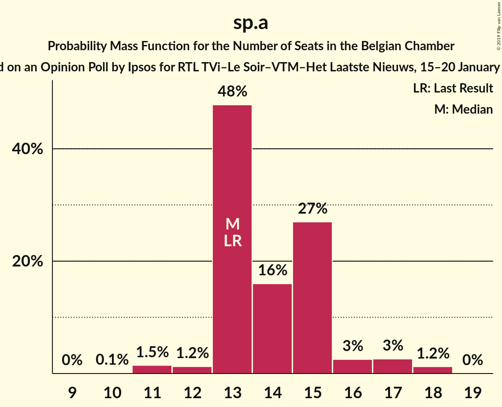
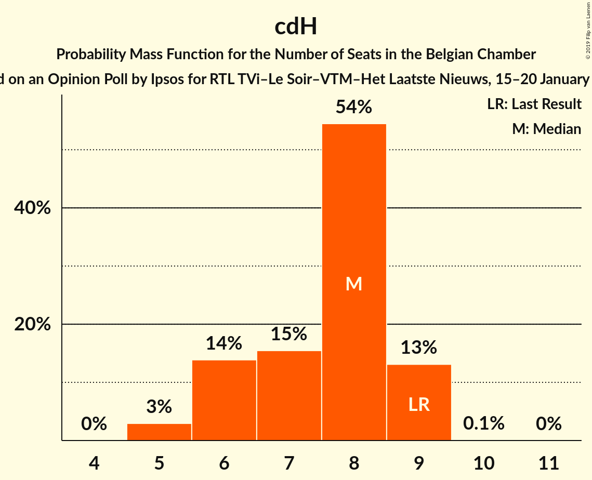
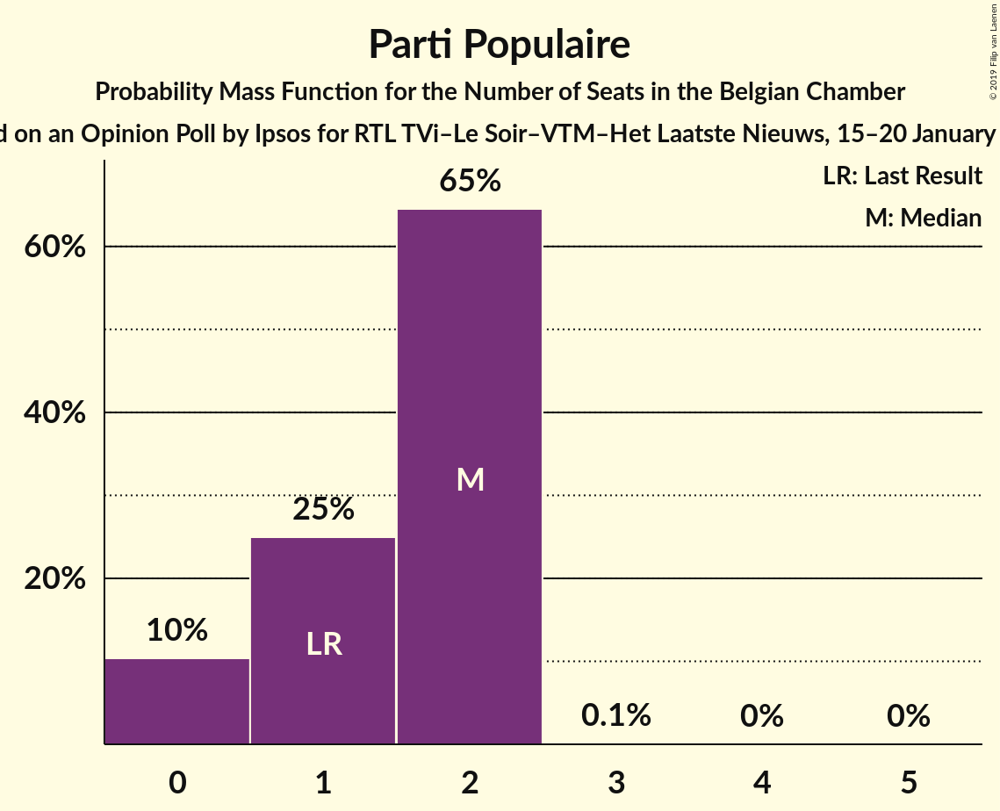
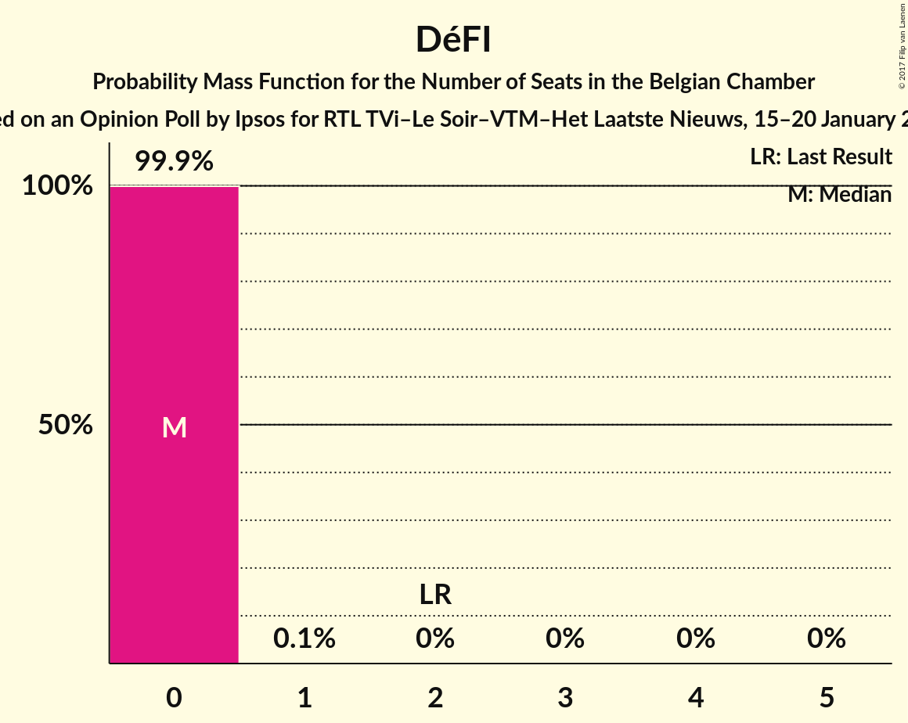
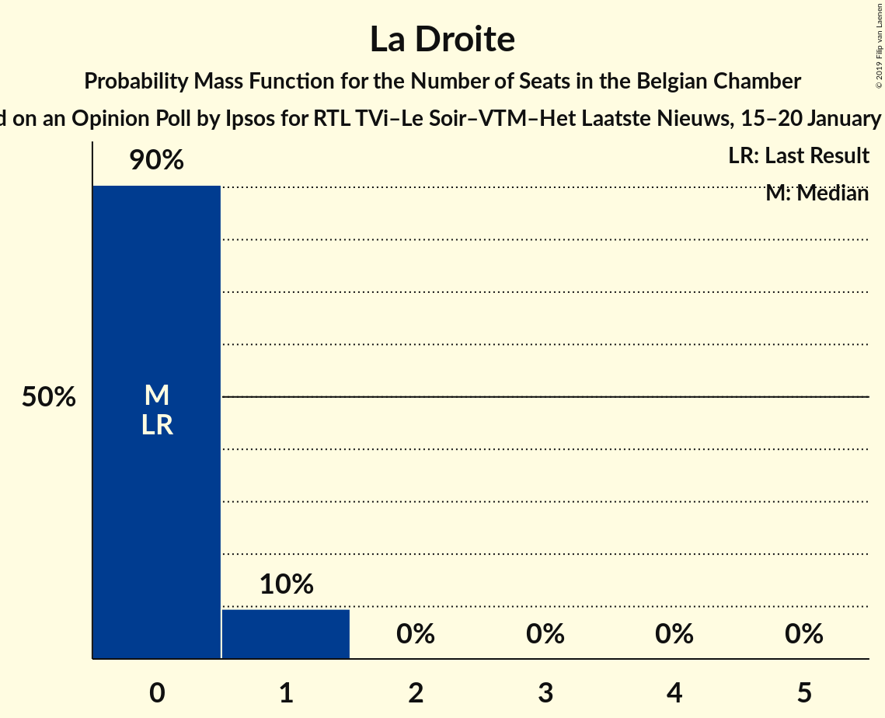

# Opinion Poll by Ipsos for RTL TVi–Le Soir–VTM–Het Laatste Nieuws, 15–20 January 2016

Areas included: Flanders, Wallonia

<a href="#voting-intentions">Voting Intentions</a> | <a href="#seats">Seats</a> | <a href="#coalitions">Coalitions</a> | <a href="#technical-information">Technical Information</a>

## Voting Intentions

### Confidence Intervals

| Party | Last Result | Poll Result | 80% Confidence Interval | 90% Confidence Interval | 95% Confidence Interval | 99% Confidence Interval |
|:-----:|:-----------:|:-----------:|:-----------------------:|:-----------------------:|:-----------------------:|:-----------------------:|
| N-VA | 20.3% | 19.0% | 26.7–30.3% |26.2–30.8% |25.8–31.3% |25.0–32.2% |
| CD&V | 11.6% | 10.7% | 14.6–17.6% |14.2–18.0% |13.9–18.4% |13.3–19.1% |
| sp.a | 8.8% | 10.2% | 13.9–16.8% |13.5–17.2% |13.2–17.6% |12.6–18.3% |
| PS | 11.7% | 8.8% | N/A |N/A |N/A |N/A |
| Open Vld | 9.8% | 8.3% | 11.2–13.9% |10.9–14.3% |10.6–14.6% |10.0–15.3% |
| Vlaams Belang | 3.7% | 7.7% | 10.4–13.0% |10.1–13.4% |9.8–13.7% |9.3–14.4% |
| MR | 9.6% | 7.7% | N/A |N/A |N/A |N/A |
| Groen | 5.3% | 6.8% | 9.1–11.6% |8.8–11.9% |8.6–12.3% |8.0–12.9% |
| cdH | 5.0% | 3.7% | N/A |N/A |N/A |N/A |
| Ecolo | 3.3% | 3.1% | N/A |N/A |N/A |N/A |
| PTB | 2.0% | 2.9% | N/A |N/A |N/A |N/A |
| PVDA | 1.8% | 2.5% | 3.1–4.6% |2.9–4.9% |2.7–5.1% |2.5–5.5% |
| Parti Populaire | 1.5% | 1.7% | N/A |N/A |N/A |N/A |
| DéFI | 1.8% | 1.2% | N/A |N/A |N/A |N/A |
| La Droite | 0.4% | 1.0% | N/A |N/A |N/A |N/A |

*Note:* The poll result column reflects the actual value used in the calculations. Published results may vary slightly, and in addition be rounded to fewer digits.

## Seats

### Confidence Intervals

| Party | Last Result | Median | 80% Confidence Interval | 90% Confidence Interval | 95% Confidence Interval | 99% Confidence Interval |
|:-----:|:-----------:|:------:|:-----------------------:|:-----------------------:|:-----------------------:|:-----------------------:|
| <a href="#n-va">N-VA</a> | 33 | 28 | 26–31 |26–31 |25–31 |24–32 |
| <a href="#cd&v">CD&V</a> | 18 | 13 | 13–16 |13–18 |13–18 |13–18 |
| <a href="#sp.a">sp.a</a> | 13 | 13 | 13–15 |13–16 |12–17 |11–18 |
| <a href="#ps">PS</a> | 23 | 18 | 18 |18 |18 |17–18 |
| <a href="#open-vld">Open Vld</a> | 14 | 12 | 11–12 |10–13 |9–13 |8–14 |
| <a href="#vlaams-belang">Vlaams Belang</a> | 3 | 9 | 8–12 |8–12 |8–13 |8–13 |
| <a href="#mr">MR</a> | 20 | 14 | 14 |14 |14 |14 |
| <a href="#groen">Groen</a> | 6 | 9 | 8–11 |7–11 |6–12 |6–12 |
| <a href="#cdh">cdH</a> | 9 | 7 | 7 |7 |7 |4–7 |
| <a href="#ecolo">Ecolo</a> | 6 | 4 | 4 |4 |4 |4–5 |
| <a href="#ptb">PTB</a> | 2 | 3 | 3 |3 |3 |3–4 |
| <a href="#pvda">PVDA</a> | 0 | 0 | 0 |0 |0 |0 |
| <a href="#parti-populaire">Parti Populaire</a> | 1 | 2 | 2 |2 |2 |2 |
| <a href="#défi">DéFI</a> | 2 | 0 | 0 |0 |0 |0 |
| <a href="#la-droite">La Droite</a> | 0 | 0 | 0 |0 |0 |0 |

### N-VA

*For a full overview of the results for this party, see the [N-VA](party-nva.html) page.*

| Number of Seats | Probability | Accumulated | Special Marks |
|:---------------:|:-----------:|:-----------:|:-------------:|
| 24 | 2% | 100% |  |
| 25 | 2% | 98% |  |
| 26 | 9% | 96% |  |
| 27 | 15% | 87% |  |
| 28 | 23% | 71% | Median |
| 29 | 22% | 48% |  |
| 30 | 14% | 26% |  |
| 31 | 12% | 13% |  |
| 32 | 0.8% | 1.0% |  |
| 33 | 0.1% | 0.2% | Last Result |
| 34 | 0.1% | 0.1% |  |
| 35 | 0% | 0% |  |

### CD&V

*For a full overview of the results for this party, see the [CD&V](party-cdv.html) page.*

| Number of Seats | Probability | Accumulated | Special Marks |
|:---------------:|:-----------:|:-----------:|:-------------:|
| 11 | 0.1% | 100% |  |
| 12 | 0.2% | 99.9% |  |
| 13 | 57% | 99.7% | Median |
| 14 | 17% | 43% |  |
| 15 | 9% | 26% |  |
| 16 | 7% | 17% |  |
| 17 | 4% | 10% |  |
| 18 | 6% | 6% | Last Result |
| 19 | 0% | 0.1% |  |
| 20 | 0% | 0% |  |

### sp.a

*For a full overview of the results for this party, see the [sp.a](party-spa.html) page.*

| Number of Seats | Probability | Accumulated | Special Marks |
|:---------------:|:-----------:|:-----------:|:-------------:|
| 10 | 0.1% | 100% |  |
| 11 | 2% | 99.9% |  |
| 12 | 1.2% | 98% |  |
| 13 | 48% | 97% | Last Result, Median |
| 14 | 15% | 49% |  |
| 15 | 27% | 34% |  |
| 16 | 3% | 6% |  |
| 17 | 3% | 4% |  |
| 18 | 1.2% | 1.2% |  |
| 19 | 0% | 0% |  |

### PS

*For a full overview of the results for this party, see the [PS](party-ps.html) page.*

| Number of Seats | Probability | Accumulated | Special Marks |
|:---------------:|:-----------:|:-----------:|:-------------:|
| 15 | 0.2% | 100% |  |
| 16 | 0.2% | 99.8% |  |
| 17 | 0.3% | 99.6% |  |
| 18 | 99.2% | 99.3% | Median |
| 19 | 0.1% | 0.1% |  |
| 20 | 0% | 0% |  |
| 21 | 0% | 0% |  |
| 22 | 0% | 0% |  |
| 23 | 0% | 0% | Last Result |

### Open Vld

*For a full overview of the results for this party, see the [Open Vld](party-openvld.html) page.*

| Number of Seats | Probability | Accumulated | Special Marks |
|:---------------:|:-----------:|:-----------:|:-------------:|
| 8 | 1.4% | 100% |  |
| 9 | 1.4% | 98.6% |  |
| 10 | 3% | 97% |  |
| 11 | 34% | 94% |  |
| 12 | 52% | 60% | Median |
| 13 | 7% | 8% |  |
| 14 | 0.3% | 0.5% | Last Result |
| 15 | 0.1% | 0.2% |  |
| 16 | 0% | 0.1% |  |
| 17 | 0.1% | 0.1% |  |
| 18 | 0% | 0% |  |

### Vlaams Belang

*For a full overview of the results for this party, see the [Vlaams Belang](party-vlaamsbelang.html) page.*

| Number of Seats | Probability | Accumulated | Special Marks |
|:---------------:|:-----------:|:-----------:|:-------------:|
| 3 | 0% | 100% | Last Result |
| 4 | 0% | 100% |  |
| 5 | 0% | 100% |  |
| 6 | 0% | 100% |  |
| 7 | 0.1% | 100% |  |
| 8 | 37% | 99.9% |  |
| 9 | 13% | 63% | Median |
| 10 | 11% | 49% |  |
| 11 | 11% | 38% |  |
| 12 | 23% | 27% |  |
| 13 | 3% | 4% |  |
| 14 | 0.2% | 0.2% |  |
| 15 | 0% | 0% |  |

### MR

*For a full overview of the results for this party, see the [MR](party-mr.html) page.*

| Number of Seats | Probability | Accumulated | Special Marks |
|:---------------:|:-----------:|:-----------:|:-------------:|
| 13 | 0.4% | 100% |  |
| 14 | 99.3% | 99.6% | Median |
| 15 | 0% | 0.3% |  |
| 16 | 0.2% | 0.3% |  |
| 17 | 0.1% | 0.1% |  |
| 18 | 0% | 0% |  |
| 19 | 0% | 0% |  |
| 20 | 0% | 0% | Last Result |

### Groen

*For a full overview of the results for this party, see the [Groen](party-groen.html) page.*

| Number of Seats | Probability | Accumulated | Special Marks |
|:---------------:|:-----------:|:-----------:|:-------------:|
| 5 | 0.2% | 100% |  |
| 6 | 5% | 99.8% | Last Result |
| 7 | 3% | 95% |  |
| 8 | 14% | 92% |  |
| 9 | 30% | 78% | Median |
| 10 | 35% | 49% |  |
| 11 | 10% | 14% |  |
| 12 | 4% | 4% |  |
| 13 | 0% | 0% |  |

### cdH

*For a full overview of the results for this party, see the [cdH](party-cdh.html) page.*

| Number of Seats | Probability | Accumulated | Special Marks |
|:---------------:|:-----------:|:-----------:|:-------------:|
| 3 | 0.1% | 100% |  |
| 4 | 0.5% | 99.9% |  |
| 5 | 0.1% | 99.4% |  |
| 6 | 0.1% | 99.3% |  |
| 7 | 98.9% | 99.2% | Median |
| 8 | 0.3% | 0.3% |  |
| 9 | 0% | 0% | Last Result |

### Ecolo

*For a full overview of the results for this party, see the [Ecolo](party-ecolo.html) page.*

| Number of Seats | Probability | Accumulated | Special Marks |
|:---------------:|:-----------:|:-----------:|:-------------:|
| 4 | 98.7% | 100% | Median |
| 5 | 1.2% | 1.3% |  |
| 6 | 0% | 0% | Last Result |

### PTB

*For a full overview of the results for this party, see the [PTB](party-ptb.html) page.*

| Number of Seats | Probability | Accumulated | Special Marks |
|:---------------:|:-----------:|:-----------:|:-------------:|
| 2 | 0.1% | 100% | Last Result |
| 3 | 98.8% | 99.9% | Median |
| 4 | 0.7% | 1.1% |  |
| 5 | 0.1% | 0.5% |  |
| 6 | 0.4% | 0.4% |  |
| 7 | 0% | 0% |  |

### PVDA

*For a full overview of the results for this party, see the [PVDA](party-pvda.html) page.*

| Number of Seats | Probability | Accumulated | Special Marks |
|:---------------:|:-----------:|:-----------:|:-------------:|
| 0 | 100% | 100% | Last Result, Median |

### Parti Populaire

*For a full overview of the results for this party, see the [Parti Populaire](party-partipopulaire.html) page.*

| Number of Seats | Probability | Accumulated | Special Marks |
|:---------------:|:-----------:|:-----------:|:-------------:|
| 0 | 0.3% | 100% |  |
| 1 | 0.1% | 99.7% | Last Result |
| 2 | 99.6% | 99.6% | Median |
| 3 | 0% | 0% |  |

### DéFI

*For a full overview of the results for this party, see the [DéFI](party-dfi.html) page.*

| Number of Seats | Probability | Accumulated | Special Marks |
|:---------------:|:-----------:|:-----------:|:-------------:|
| 0 | 99.7% | 100% | Median |
| 1 | 0.3% | 0.3% |  |
| 2 | 0% | 0% | Last Result |

### La Droite

*For a full overview of the results for this party, see the [La Droite](party-ladroite.html) page.*

| Number of Seats | Probability | Accumulated | Special Marks |
|:---------------:|:-----------:|:-----------:|:-------------:|
| 0 | 99.9% | 100% | Last Result, Median |
| 1 | 0.1% | 0.1% |  |
| 2 | 0% | 0% |  |

## Coalitions

### Confidence Intervals

| Coalition | Last Result | Median | Majority? | 80% Confidence Interval | 90% Confidence Interval | 95% Confidence Interval | 99% Confidence Interval |
|:---------:|:-----------:|:------:|:---------:|:-----------------------:|:-----------------------:|:-----------------------:|:-----------------------:|
| CD&V – sp.a – PS – Open Vld – MR – Groen – cdH – Ecolo | 109 | 92 | 100% | 89–95 | 89–95 | 88–96 | 87–97 |
| CD&V – sp.a – PS – Open Vld – MR – cdH | 97 | 78 | 97% | 76–81 | 76–82 | 75–83 | 74–84 |
| N-VA – CD&V – Open Vld – MR – cdH | 94 | 75 | 42% | 73–77 | 72–78 | 72–79 | 70–80 |
| sp.a – PS – Open Vld – MR – Groen – Ecolo | 82 | 71 | 0.2% | 69–73 | 68–74 | 67–75 | 66–75 |
| CD&V – sp.a – PS – Groen – cdH – Ecolo – PTB – PVDA | 77 | 69 | 0.1% | 67–72 | 66–73 | 66–73 | 65–74 |
| N-VA – CD&V – Open Vld – MR | 85 | 68 | 0% | 66–70 | 65–71 | 65–72 | 63–73 |
| CD&V – sp.a – PS – Groen – cdH – Ecolo | 75 | 66 | 0% | 64–69 | 63–70 | 63–70 | 62–71 |
| CD&V – PS – Open Vld – MR – cdH | 84 | 64 | 0% | 63–67 | 63–68 | 62–68 | 60–69 |
| sp.a – PS – Open Vld – MR | 70 | 57 | 0% | 56–59 | 55–60 | 54–61 | 53–61 |
| sp.a – PS – Groen – cdH – Ecolo – PTB – PVDA | 59 | 55 | 0% | 53–57 | 52–58 | 52–59 | 51–60 |
| CD&V – sp.a – PS – cdH | 63 | 53 | 0% | 51–55 | 51–56 | 51–57 | 49–58 |
| sp.a – PS – Groen – Ecolo – PTB – PVDA | 50 | 48 | 0% | 46–50 | 46–51 | 45–52 | 44–53 |
| CD&V – Open Vld – MR – cdH | 61 | 46 | 0% | 45–49 | 45–50 | 44–50 | 42–51 |
| CD&V – Open Vld – MR – Groen – cdH – Ecolo | 73 | 25 | 0% | 25 | 25 | 25 | 24–26 |

### CD&V – sp.a – PS – Open Vld – MR – Groen – cdH – Ecolo

| Number of Seats | Probability | Accumulated | Special Marks |
|:---------------:|:-----------:|:-----------:|:-------------:|
| 86 | 0.1% | 100% |  |
| 87 | 0.8% | 99.9% |  |
| 88 | 3% | 99.1% |  |
| 89 | 8% | 96% |  |
| 90 | 13% | 88% | Median |
| 91 | 23% | 75% |  |
| 92 | 18% | 52% |  |
| 93 | 14% | 34% |  |
| 94 | 10% | 20% |  |
| 95 | 7% | 10% |  |
| 96 | 3% | 3% |  |
| 97 | 0.3% | 0.5% |  |
| 98 | 0.2% | 0.2% |  |
| 99 | 0% | 0% |  |
| 100 | 0% | 0% |  |
| 101 | 0% | 0% |  |
| 102 | 0% | 0% |  |
| 103 | 0% | 0% |  |
| 104 | 0% | 0% |  |
| 105 | 0% | 0% |  |
| 106 | 0% | 0% |  |
| 107 | 0% | 0% |  |
| 108 | 0% | 0% |  |
| 109 | 0% | 0% | Last Result |

### CD&V – sp.a – PS – Open Vld – MR – cdH

| Number of Seats | Probability | Accumulated | Special Marks |
|:---------------:|:-----------:|:-----------:|:-------------:|
| 72 | 0% | 100% |  |
| 73 | 0.4% | 99.9% |  |
| 74 | 1.1% | 99.6% |  |
| 75 | 2% | 98% |  |
| 76 | 9% | 97% | Majority |
| 77 | 22% | 88% | Median |
| 78 | 22% | 67% |  |
| 79 | 19% | 45% |  |
| 80 | 12% | 26% |  |
| 81 | 9% | 15% |  |
| 82 | 3% | 6% |  |
| 83 | 2% | 3% |  |
| 84 | 0.5% | 0.8% |  |
| 85 | 0.2% | 0.3% |  |
| 86 | 0% | 0% |  |
| 87 | 0% | 0% |  |
| 88 | 0% | 0% |  |
| 89 | 0% | 0% |  |
| 90 | 0% | 0% |  |
| 91 | 0% | 0% |  |
| 92 | 0% | 0% |  |
| 93 | 0% | 0% |  |
| 94 | 0% | 0% |  |
| 95 | 0% | 0% |  |
| 96 | 0% | 0% |  |
| 97 | 0% | 0% | Last Result |

### N-VA – CD&V – Open Vld – MR – cdH

| Number of Seats | Probability | Accumulated | Special Marks |
|:---------------:|:-----------:|:-----------:|:-------------:|
| 68 | 0.1% | 100% |  |
| 69 | 0.2% | 99.9% |  |
| 70 | 0.7% | 99.7% |  |
| 71 | 1.5% | 99.0% |  |
| 72 | 5% | 98% |  |
| 73 | 15% | 92% |  |
| 74 | 21% | 77% | Median |
| 75 | 15% | 57% |  |
| 76 | 22% | 42% | Majority |
| 77 | 12% | 20% |  |
| 78 | 5% | 8% |  |
| 79 | 2% | 3% |  |
| 80 | 0.8% | 0.9% |  |
| 81 | 0.1% | 0.1% |  |
| 82 | 0% | 0% |  |
| 83 | 0% | 0% |  |
| 84 | 0% | 0% |  |
| 85 | 0% | 0% |  |
| 86 | 0% | 0% |  |
| 87 | 0% | 0% |  |
| 88 | 0% | 0% |  |
| 89 | 0% | 0% |  |
| 90 | 0% | 0% |  |
| 91 | 0% | 0% |  |
| 92 | 0% | 0% |  |
| 93 | 0% | 0% |  |
| 94 | 0% | 0% | Last Result |

### sp.a – PS – Open Vld – MR – Groen – Ecolo

| Number of Seats | Probability | Accumulated | Special Marks |
|:---------------:|:-----------:|:-----------:|:-------------:|
| 64 | 0.1% | 100% |  |
| 65 | 0.2% | 99.9% |  |
| 66 | 0.8% | 99.7% |  |
| 67 | 2% | 98.9% |  |
| 68 | 5% | 97% |  |
| 69 | 13% | 92% |  |
| 70 | 21% | 78% | Median |
| 71 | 27% | 58% |  |
| 72 | 14% | 30% |  |
| 73 | 9% | 16% |  |
| 74 | 4% | 7% |  |
| 75 | 3% | 3% |  |
| 76 | 0.1% | 0.2% | Majority |
| 77 | 0% | 0% |  |
| 78 | 0% | 0% |  |
| 79 | 0% | 0% |  |
| 80 | 0% | 0% |  |
| 81 | 0% | 0% |  |
| 82 | 0% | 0% | Last Result |

### CD&V – sp.a – PS – Groen – cdH – Ecolo – PTB – PVDA

| Number of Seats | Probability | Accumulated | Special Marks |
|:---------------:|:-----------:|:-----------:|:-------------:|
| 64 | 0.2% | 100% |  |
| 65 | 2% | 99.8% |  |
| 66 | 4% | 98% |  |
| 67 | 12% | 94% | Median |
| 68 | 18% | 82% |  |
| 69 | 24% | 64% |  |
| 70 | 14% | 39% |  |
| 71 | 12% | 25% |  |
| 72 | 8% | 13% |  |
| 73 | 4% | 5% |  |
| 74 | 1.0% | 1.5% |  |
| 75 | 0.3% | 0.4% |  |
| 76 | 0.1% | 0.1% | Majority |
| 77 | 0% | 0% | Last Result |

### N-VA – CD&V – Open Vld – MR

| Number of Seats | Probability | Accumulated | Special Marks |
|:---------------:|:-----------:|:-----------:|:-------------:|
| 61 | 0.1% | 100% |  |
| 62 | 0.2% | 99.9% |  |
| 63 | 0.6% | 99.8% |  |
| 64 | 1.4% | 99.1% |  |
| 65 | 5% | 98% |  |
| 66 | 15% | 92% |  |
| 67 | 21% | 78% | Median |
| 68 | 15% | 57% |  |
| 69 | 22% | 42% |  |
| 70 | 12% | 20% |  |
| 71 | 5% | 8% |  |
| 72 | 2% | 3% |  |
| 73 | 0.8% | 0.9% |  |
| 74 | 0.1% | 0.1% |  |
| 75 | 0% | 0% |  |
| 76 | 0% | 0% | Majority |
| 77 | 0% | 0% |  |
| 78 | 0% | 0% |  |
| 79 | 0% | 0% |  |
| 80 | 0% | 0% |  |
| 81 | 0% | 0% |  |
| 82 | 0% | 0% |  |
| 83 | 0% | 0% |  |
| 84 | 0% | 0% |  |
| 85 | 0% | 0% | Last Result |

### CD&V – sp.a – PS – Groen – cdH – Ecolo

| Number of Seats | Probability | Accumulated | Special Marks |
|:---------------:|:-----------:|:-----------:|:-------------:|
| 60 | 0.1% | 100% |  |
| 61 | 0.2% | 99.9% |  |
| 62 | 2% | 99.7% |  |
| 63 | 4% | 98% |  |
| 64 | 12% | 94% | Median |
| 65 | 18% | 82% |  |
| 66 | 24% | 63% |  |
| 67 | 14% | 39% |  |
| 68 | 12% | 25% |  |
| 69 | 8% | 13% |  |
| 70 | 4% | 5% |  |
| 71 | 1.0% | 1.5% |  |
| 72 | 0.3% | 0.4% |  |
| 73 | 0.1% | 0.1% |  |
| 74 | 0% | 0% |  |
| 75 | 0% | 0% | Last Result |

### CD&V – PS – Open Vld – MR – cdH

| Number of Seats | Probability | Accumulated | Special Marks |
|:---------------:|:-----------:|:-----------:|:-------------:|
| 59 | 0.1% | 100% |  |
| 60 | 0.8% | 99.9% |  |
| 61 | 1.0% | 99.1% |  |
| 62 | 3% | 98% |  |
| 63 | 19% | 95% |  |
| 64 | 36% | 76% | Median |
| 65 | 17% | 40% |  |
| 66 | 8% | 23% |  |
| 67 | 6% | 14% |  |
| 68 | 6% | 8% |  |
| 69 | 2% | 2% |  |
| 70 | 0.1% | 0.1% |  |
| 71 | 0% | 0% |  |
| 72 | 0% | 0% |  |
| 73 | 0% | 0% |  |
| 74 | 0% | 0% |  |
| 75 | 0% | 0% |  |
| 76 | 0% | 0% | Majority |
| 77 | 0% | 0% |  |
| 78 | 0% | 0% |  |
| 79 | 0% | 0% |  |
| 80 | 0% | 0% |  |
| 81 | 0% | 0% |  |
| 82 | 0% | 0% |  |
| 83 | 0% | 0% |  |
| 84 | 0% | 0% | Last Result |

### sp.a – PS – Open Vld – MR

| Number of Seats | Probability | Accumulated | Special Marks |
|:---------------:|:-----------:|:-----------:|:-------------:|
| 53 | 0.9% | 100% |  |
| 54 | 2% | 99.1% |  |
| 55 | 3% | 97% |  |
| 56 | 19% | 95% |  |
| 57 | 33% | 75% | Median |
| 58 | 17% | 43% |  |
| 59 | 18% | 26% |  |
| 60 | 5% | 8% |  |
| 61 | 3% | 3% |  |
| 62 | 0.4% | 0.5% |  |
| 63 | 0% | 0.1% |  |
| 64 | 0% | 0% |  |
| 65 | 0% | 0% |  |
| 66 | 0% | 0% |  |
| 67 | 0% | 0% |  |
| 68 | 0% | 0% |  |
| 69 | 0% | 0% |  |
| 70 | 0% | 0% | Last Result |

### sp.a – PS – Groen – cdH – Ecolo – PTB – PVDA

| Number of Seats | Probability | Accumulated | Special Marks |
|:---------------:|:-----------:|:-----------:|:-------------:|
| 50 | 0.2% | 100% |  |
| 51 | 1.4% | 99.8% |  |
| 52 | 3% | 98% |  |
| 53 | 8% | 95% |  |
| 54 | 18% | 87% | Median |
| 55 | 28% | 69% |  |
| 56 | 23% | 41% |  |
| 57 | 9% | 18% |  |
| 58 | 5% | 9% |  |
| 59 | 3% | 3% | Last Result |
| 60 | 0.6% | 0.6% |  |
| 61 | 0.1% | 0.1% |  |
| 62 | 0% | 0% |  |

### CD&V – sp.a – PS – cdH

| Number of Seats | Probability | Accumulated | Special Marks |
|:---------------:|:-----------:|:-----------:|:-------------:|
| 47 | 0.1% | 100% |  |
| 48 | 0.2% | 99.9% |  |
| 49 | 0.8% | 99.8% |  |
| 50 | 1.1% | 98.9% |  |
| 51 | 20% | 98% | Median |
| 52 | 24% | 78% |  |
| 53 | 27% | 54% |  |
| 54 | 10% | 27% |  |
| 55 | 8% | 17% |  |
| 56 | 6% | 9% |  |
| 57 | 2% | 4% |  |
| 58 | 1.3% | 2% |  |
| 59 | 0.2% | 0.4% |  |
| 60 | 0.1% | 0.1% |  |
| 61 | 0% | 0% |  |
| 62 | 0% | 0% |  |
| 63 | 0% | 0% | Last Result |

### sp.a – PS – Groen – Ecolo – PTB – PVDA

| Number of Seats | Probability | Accumulated | Special Marks |
|:---------------:|:-----------:|:-----------:|:-------------:|
| 43 | 0.1% | 100% |  |
| 44 | 1.4% | 99.8% |  |
| 45 | 3% | 98% |  |
| 46 | 8% | 95% |  |
| 47 | 18% | 87% | Median |
| 48 | 28% | 70% |  |
| 49 | 23% | 41% |  |
| 50 | 9% | 18% | Last Result |
| 51 | 5% | 9% |  |
| 52 | 3% | 4% |  |
| 53 | 0.7% | 0.8% |  |
| 54 | 0.1% | 0.2% |  |
| 55 | 0% | 0.1% |  |
| 56 | 0% | 0% |  |

### CD&V – Open Vld – MR – cdH

| Number of Seats | Probability | Accumulated | Special Marks |
|:---------------:|:-----------:|:-----------:|:-------------:|
| 41 | 0.1% | 100% |  |
| 42 | 0.8% | 99.9% |  |
| 43 | 1.0% | 99.1% |  |
| 44 | 3% | 98% |  |
| 45 | 19% | 95% |  |
| 46 | 36% | 76% | Median |
| 47 | 17% | 40% |  |
| 48 | 8% | 23% |  |
| 49 | 6% | 15% |  |
| 50 | 6% | 8% |  |
| 51 | 2% | 2% |  |
| 52 | 0.1% | 0.1% |  |
| 53 | 0% | 0% |  |
| 54 | 0% | 0% |  |
| 55 | 0% | 0% |  |
| 56 | 0% | 0% |  |
| 57 | 0% | 0% |  |
| 58 | 0% | 0% |  |
| 59 | 0% | 0% |  |
| 60 | 0% | 0% |  |
| 61 | 0% | 0% | Last Result |

### CD&V – Open Vld – MR – Groen – cdH – Ecolo

| Number of Seats | Probability | Accumulated | Special Marks |
|:---------------:|:-----------:|:-----------:|:-------------:|
| 22 | 0.4% | 100% |  |
| 23 | 0% | 99.6% |  |
| 24 | 0.2% | 99.6% |  |
| 25 | 98.8% | 99.4% |  |
| 26 | 0.2% | 0.5% |  |
| 27 | 0.3% | 0.4% |  |
| 28 | 0.1% | 0.1% |  |
| 29 | 0% | 0% |  |
| 30 | 0% | 0% |  |
| 31 | 0% | 0% |  |
| 32 | 0% | 0% |  |
| 33 | 0% | 0% |  |
| 34 | 0% | 0% |  |
| 35 | 0% | 0% |  |
| 36 | 0% | 0% |  |
| 37 | 0% | 0% |  |
| 38 | 0% | 0% |  |
| 39 | 0% | 0% |  |
| 40 | 0% | 0% |  |
| 41 | 0% | 0% |  |
| 42 | 0% | 0% |  |
| 43 | 0% | 0% |  |
| 44 | 0% | 0% |  |
| 45 | 0% | 0% |  |
| 46 | 0% | 0% |  |
| 47 | 0% | 0% |  |
| 48 | 0% | 0% |  |
| 49 | 0% | 0% |  |
| 50 | 0% | 0% |  |
| 51 | 0% | 0% |  |
| 52 | 0% | 0% |  |
| 53 | 0% | 0% |  |
| 54 | 0% | 0% |  |
| 55 | 0% | 0% |  |
| 56 | 0% | 0% |  |
| 57 | 0% | 0% |  |
| 58 | 0% | 0% |  |
| 59 | 0% | 0% | Median |
| 60 | 0% | 0% |  |
| 61 | 0% | 0% |  |
| 62 | 0% | 0% |  |
| 63 | 0% | 0% |  |
| 64 | 0% | 0% |  |
| 65 | 0% | 0% |  |
| 66 | 0% | 0% |  |
| 67 | 0% | 0% |  |
| 68 | 0% | 0% |  |
| 69 | 0% | 0% |  |
| 70 | 0% | 0% |  |
| 71 | 0% | 0% |  |
| 72 | 0% | 0% |  |
| 73 | 0% | 0% | Last Result |

## Technical Information

### Opinion Poll

+ **Polling firm:** Ipsos
+ **Commissioner(s):** RTL TVi–Le Soir–VTM–Het Laatste Nieuws
+ **Fieldwork period:** 15–20 January 2016

### Calculations

+ **Sample size:** 1563
+ **Simulations done:** 1,048,576
+ **Error estimate:** 1.11%

