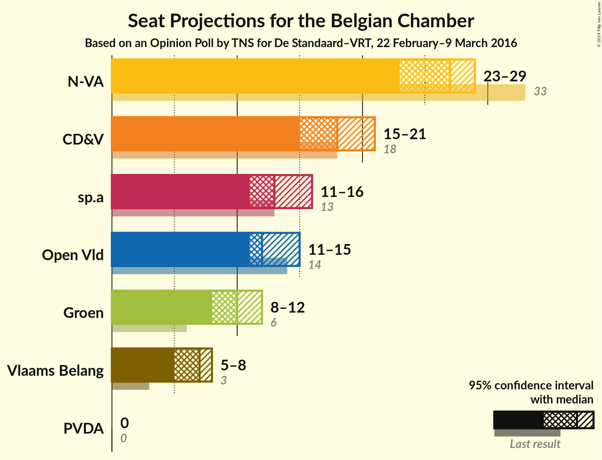
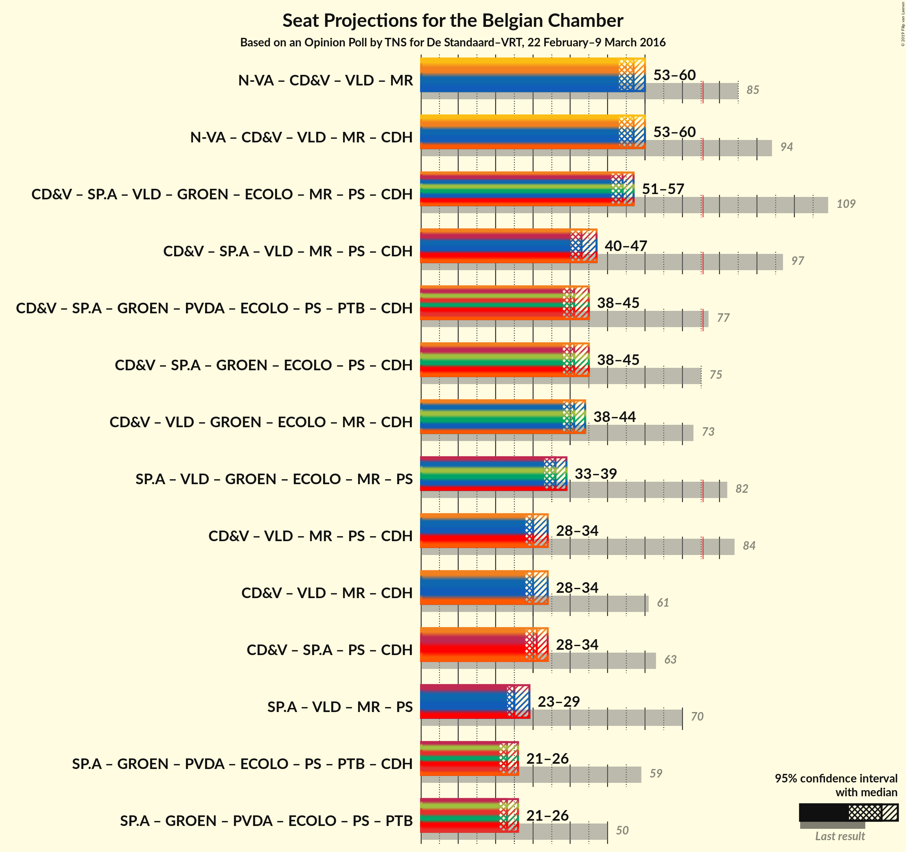

# Opinion Poll by TNS for De Standaard–VRT, 22 February–9 March 2016

Areas included: Flanders

<a href="#voting-intentions">Voting Intentions</a> | <a href="#seats">Seats</a> | <a href="#coalitions">Coalitions</a> | <a href="#technical-information">Technical Information</a>

## Voting Intentions

### Confidence Intervals

| Party | Last Result | Poll Result | 80% Confidence Interval | 90% Confidence Interval | 95% Confidence Interval | 99% Confidence Interval |
|:-----:|:-----------:|:-----------:|:-----------------------:|:-----------------------:|:-----------------------:|:-----------------------:|
| N-VA | 20.3% | 27.3% | 25.5–29.1% |25.0–29.6% |24.6–30.1% |23.8–31.0% |
| CD&V | 11.6% | 19.1% | 17.6–20.8% |17.2–21.2% |16.8–21.7% |16.1–22.5% |
| sp.a | 8.8% | 14.7% | 13.4–16.2% |13.0–16.7% |12.7–17.1% |12.0–17.8% |
| Open Vld | 9.8% | 14.1% | 12.8–15.6% |12.4–16.0% |12.1–16.4% |11.5–17.2% |
| Groen | 5.3% | 11.6% | 10.4–13.0% |10.1–13.4% |9.8–13.8% |9.3–14.5% |
| Vlaams Belang | 3.7% | 8.1% | 7.1–9.3% |6.8–9.6% |6.5–9.9% |6.1–10.5% |
| PVDA | 1.8% | 4.0% | 3.3–4.9% |3.1–5.2% |2.9–5.4% |2.6–5.9% |

*Note:* The poll result column reflects the actual value used in the calculations. Published results may vary slightly, and in addition be rounded to fewer digits.

## Seats

### Confidence Intervals

| Party | Last Result | Median | 80% Confidence Interval | 90% Confidence Interval | 95% Confidence Interval | 99% Confidence Interval |
|:-----:|:-----------:|:------:|:-----------------------:|:-----------------------:|:-----------------------:|:-----------------------:|
| <a href="#n-va">N-VA</a> | 33 | 27 | 24–28 |24–29 |23–29 |23–31 |
| <a href="#cd&v">CD&V</a> | 18 | 18 | 16–19 |16–20 |15–21 |14–22 |
| <a href="#sp.a">sp.a</a> | 13 | 13 | 12–15 |12–15 |11–16 |10–17 |
| <a href="#open-vld">Open Vld</a> | 14 | 12 | 11–13 |11–14 |11–15 |11–17 |
| <a href="#groen">Groen</a> | 6 | 10 | 8–12 |8–12 |8–12 |7–12 |
| <a href="#vlaams-belang">Vlaams Belang</a> | 3 | 7 | 5–8 |5–8 |5–8 |3–8 |
| <a href="#pvda">PVDA</a> | 0 | 0 | 0 |0 |0 |0 |

### N-VA

*For a full overview of the results for this party, see the [N-VA](party-nva.html) page.*

| Number of Seats | Probability | Accumulated | Special Marks |
|:---------------:|:-----------:|:-----------:|:-------------:|
| 22 | 0.2% | 100% |  |
| 23 | 5% | 99.8% |  |
| 24 | 7% | 95% |  |
| 25 | 11% | 88% |  |
| 26 | 21% | 77% |  |
| 27 | 33% | 57% | Median |
| 28 | 14% | 24% |  |
| 29 | 7% | 10% |  |
| 30 | 2% | 2% |  |
| 31 | 0.8% | 0.8% |  |
| 32 | 0% | 0% |  |
| 33 | 0% | 0% | Last Result |

### CD&V

*For a full overview of the results for this party, see the [CD&V](party-cdv.html) page.*

| Number of Seats | Probability | Accumulated | Special Marks |
|:---------------:|:-----------:|:-----------:|:-------------:|
| 13 | 0.3% | 100% |  |
| 14 | 0.7% | 99.7% |  |
| 15 | 3% | 99.1% |  |
| 16 | 6% | 96% |  |
| 17 | 19% | 90% |  |
| 18 | 46% | 71% | Last Result, Median |
| 19 | 17% | 25% |  |
| 20 | 5% | 8% |  |
| 21 | 2% | 3% |  |
| 22 | 1.1% | 1.1% |  |
| 23 | 0% | 0.1% |  |
| 24 | 0% | 0% |  |

### sp.a

*For a full overview of the results for this party, see the [sp.a](party-spa.html) page.*

| Number of Seats | Probability | Accumulated | Special Marks |
|:---------------:|:-----------:|:-----------:|:-------------:|
| 9 | 0.5% | 100% |  |
| 10 | 1.5% | 99.5% |  |
| 11 | 3% | 98% |  |
| 12 | 6% | 95% |  |
| 13 | 63% | 89% | Last Result, Median |
| 14 | 16% | 27% |  |
| 15 | 6% | 10% |  |
| 16 | 3% | 4% |  |
| 17 | 0.8% | 0.9% |  |
| 18 | 0.1% | 0.1% |  |
| 19 | 0% | 0% |  |

### Open Vld

*For a full overview of the results for this party, see the [Open Vld](party-openvld.html) page.*

| Number of Seats | Probability | Accumulated | Special Marks |
|:---------------:|:-----------:|:-----------:|:-------------:|
| 9 | 0.1% | 100% |  |
| 10 | 0.4% | 99.9% |  |
| 11 | 26% | 99.5% |  |
| 12 | 32% | 74% | Median |
| 13 | 32% | 42% |  |
| 14 | 6% | 10% | Last Result |
| 15 | 3% | 4% |  |
| 16 | 0.8% | 1.3% |  |
| 17 | 0.4% | 0.5% |  |
| 18 | 0.1% | 0.1% |  |
| 19 | 0% | 0% |  |

### Groen

*For a full overview of the results for this party, see the [Groen](party-groen.html) page.*

| Number of Seats | Probability | Accumulated | Special Marks |
|:---------------:|:-----------:|:-----------:|:-------------:|
| 6 | 0.2% | 100% | Last Result |
| 7 | 0.6% | 99.8% |  |
| 8 | 13% | 99.2% |  |
| 9 | 13% | 87% |  |
| 10 | 29% | 73% | Median |
| 11 | 14% | 44% |  |
| 12 | 30% | 30% |  |
| 13 | 0.1% | 0.1% |  |
| 14 | 0% | 0% |  |

### Vlaams Belang

*For a full overview of the results for this party, see the [Vlaams Belang](party-vlaamsbelang.html) page.*

| Number of Seats | Probability | Accumulated | Special Marks |
|:---------------:|:-----------:|:-----------:|:-------------:|
| 2 | 0.1% | 100% |  |
| 3 | 0.4% | 99.9% | Last Result |
| 4 | 0.5% | 99.5% |  |
| 5 | 20% | 99.0% |  |
| 6 | 18% | 79% |  |
| 7 | 35% | 61% | Median |
| 8 | 26% | 26% |  |
| 9 | 0% | 0% |  |

### PVDA

*For a full overview of the results for this party, see the [PVDA](party-pvda.html) page.*

| Number of Seats | Probability | Accumulated | Special Marks |
|:---------------:|:-----------:|:-----------:|:-------------:|
| 0 | 100% | 100% | Last Result, Median |

## Coalitions

### Confidence Intervals

| Coalition | Last Result | Median | Majority? | 80% Confidence Interval | 90% Confidence Interval | 95% Confidence Interval | 99% Confidence Interval |
|:---------:|:-----------:|:------:|:---------:|:-----------------------:|:-----------------------:|:-----------------------:|:-----------------------:|

## Technical Information

### Opinion Poll

+ **Pollster:** TNS
+ **Media:** De Standaard–VRT
+ **Fieldwork period:** 22 February–9 March 2016

### Calculations

+ **Sample size:** 1005
+ **Simulations done:** 8,388,608
+ **Error estimate:** 0.78%

