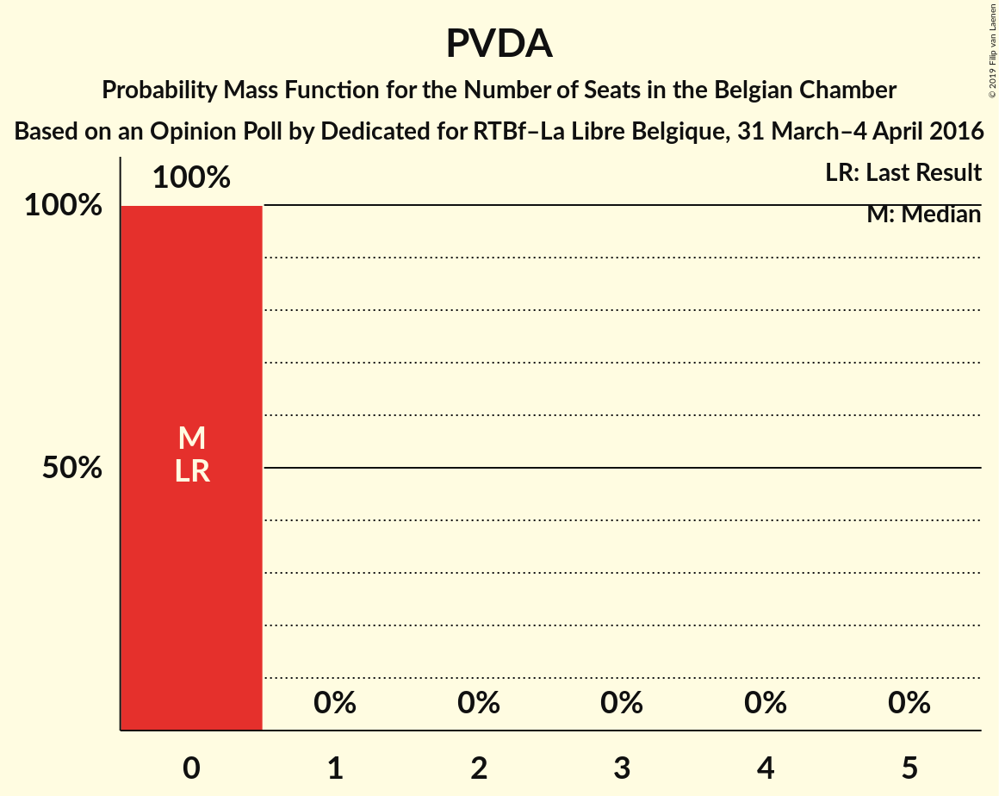

# Opinion Poll by Dedicated for RTBf–La Libre Belgique, 31 March–4 April 2016

Areas included: Flanders

<a href="#voting-intentions">Voting Intentions</a> | <a href="#seats">Seats</a> | <a href="#coalitions">Coalitions</a> | <a href="#technical-information">Technical Information</a>

## Voting Intentions

### Confidence Intervals

| Party | Last Result | Poll Result | 80% Confidence Interval | 90% Confidence Interval | 95% Confidence Interval | 99% Confidence Interval |
|:-----:|:-----------:|:-----------:|:-----------------------:|:-----------------------:|:-----------------------:|:-----------------------:|
| N-VA | 20.3% | 25.5% | 23.6–27.7% |23.0–28.3% |22.5–28.8% |21.6–29.8% |
| CD&V | 11.6% | 18.3% | 16.6–20.2% |16.1–20.7% |15.7–21.2% |14.9–22.2% |
| sp.a | 8.8% | 14.4% | 12.8–16.2% |12.4–16.7% |12.0–17.1% |11.3–18.0% |
| Open Vld | 9.8% | 13.3% | 11.8–15.0% |11.4–15.5% |11.1–15.9% |10.4–16.8% |
| Vlaams Belang | 3.7% | 12.4% | 10.9–14.0% |10.5–14.5% |10.2–14.9% |9.5–15.8% |
| Groen | 5.3% | 10.2% | 8.9–11.8% |8.6–12.2% |8.2–12.6% |7.7–13.4% |
| PVDA | 1.8% | 3.8% | 3.0–4.8% |2.8–5.1% |2.6–5.4% |2.3–5.9% |
| Piratenpartij | 0.3% | 1.3% | 0.9–2.1% |0.8–2.3% |0.7–2.5% |0.6–2.9% |

*Note:* The poll result column reflects the actual value used in the calculations. Published results may vary slightly, and in addition be rounded to fewer digits.

## Seats

### Confidence Intervals

| Party | Last Result | Median | 80% Confidence Interval | 90% Confidence Interval | 95% Confidence Interval | 99% Confidence Interval |
|:-----:|:-----------:|:------:|:-----------------------:|:-----------------------:|:-----------------------:|:-----------------------:|
| <a href="#n-va">N-VA</a> | 33 | 24 | 23–28 |22–28 |22–29 |20–30 |
| <a href="#cd&v">CD&V</a> | 18 | 18 | 15–19 |15–20 |14–21 |13–22 |
| <a href="#sp.a">sp.a</a> | 13 | 13 | 11–15 |11–15 |10–16 |9–18 |
| <a href="#open-vld">Open Vld</a> | 14 | 12 | 11–13 |11–13 |10–15 |8–17 |
| <a href="#vlaams-belang">Vlaams Belang</a> | 3 | 11 | 8–13 |8–13 |8–14 |8–15 |
| <a href="#groen">Groen</a> | 6 | 9 | 6–11 |6–11 |6–12 |5–12 |
| <a href="#pvda">PVDA</a> | 0 | 0 | 0 |0 |0 |0 |
| <a href="#piratenpartij">Piratenpartij</a> | 0 | 0 | 0 |0 |0 |0 |

### N-VA

*For a full overview of the results for this party, see the [N-VA](party-n-va.html) page.*

| Number of Seats | Probability | Accumulated | Special Marks |
|:---------------:|:-----------:|:-----------:|:-------------:|
| 19 | 0.1% | 100% |  |
| 20 | 0.6% | 99.9% |  |
| 21 | 1.5% | 99.3% |  |
| 22 | 3% | 98% |  |
| 23 | 8% | 95% |  |
| 24 | 37% | 87% | Median |
| 25 | 14% | 50% |  |
| 26 | 11% | 35% |  |
| 27 | 13% | 24% |  |
| 28 | 8% | 11% |  |
| 29 | 2% | 3% |  |
| 30 | 0.8% | 0.9% |  |
| 31 | 0.1% | 0.1% |  |
| 32 | 0% | 0% |  |
| 33 | 0% | 0% | Last Result |

### CD&V

*For a full overview of the results for this party, see the [CD&V](party-cdv.html) page.*

| Number of Seats | Probability | Accumulated | Special Marks |
|:---------------:|:-----------:|:-----------:|:-------------:|
| 13 | 2% | 100% |  |
| 14 | 2% | 98% |  |
| 15 | 12% | 96% |  |
| 16 | 8% | 84% |  |
| 17 | 15% | 76% |  |
| 18 | 48% | 61% | Last Result, Median |
| 19 | 5% | 13% |  |
| 20 | 4% | 8% |  |
| 21 | 3% | 4% |  |
| 22 | 0.9% | 1.1% |  |
| 23 | 0.1% | 0.1% |  |
| 24 | 0% | 0% |  |

### sp.a

*For a full overview of the results for this party, see the [sp.a](party-spa.html) page.*

| Number of Seats | Probability | Accumulated | Special Marks |
|:---------------:|:-----------:|:-----------:|:-------------:|
| 9 | 1.0% | 100% |  |
| 10 | 3% | 98.9% |  |
| 11 | 7% | 96% |  |
| 12 | 6% | 88% |  |
| 13 | 57% | 83% | Last Result, Median |
| 14 | 12% | 26% |  |
| 15 | 10% | 14% |  |
| 16 | 3% | 4% |  |
| 17 | 0.6% | 1.2% |  |
| 18 | 0.6% | 0.6% |  |
| 19 | 0% | 0% |  |

### Open Vld

*For a full overview of the results for this party, see the [Open Vld](party-openvld.html) page.*

| Number of Seats | Probability | Accumulated | Special Marks |
|:---------------:|:-----------:|:-----------:|:-------------:|
| 8 | 0.6% | 100% |  |
| 9 | 0.9% | 99.4% |  |
| 10 | 2% | 98% |  |
| 11 | 23% | 96% |  |
| 12 | 50% | 73% | Median |
| 13 | 19% | 23% |  |
| 14 | 1.3% | 4% | Last Result |
| 15 | 1.4% | 3% |  |
| 16 | 0.9% | 2% |  |
| 17 | 0.7% | 0.7% |  |
| 18 | 0.1% | 0.1% |  |
| 19 | 0% | 0% |  |

### Vlaams Belang

*For a full overview of the results for this party, see the [Vlaams Belang](party-vlaamsbelang.html) page.*

| Number of Seats | Probability | Accumulated | Special Marks |
|:---------------:|:-----------:|:-----------:|:-------------:|
| 3 | 0% | 100% | Last Result |
| 4 | 0% | 100% |  |
| 5 | 0% | 100% |  |
| 6 | 0% | 100% |  |
| 7 | 0% | 100% |  |
| 8 | 25% | 100% |  |
| 9 | 8% | 75% |  |
| 10 | 6% | 67% |  |
| 11 | 11% | 60% | Median |
| 12 | 36% | 49% |  |
| 13 | 9% | 13% |  |
| 14 | 3% | 4% |  |
| 15 | 0.8% | 0.9% |  |
| 16 | 0% | 0% |  |

### Groen

*For a full overview of the results for this party, see the [Groen](party-groen.html) page.*

| Number of Seats | Probability | Accumulated | Special Marks |
|:---------------:|:-----------:|:-----------:|:-------------:|
| 5 | 1.2% | 100% |  |
| 6 | 11% | 98.8% | Last Result |
| 7 | 4% | 88% |  |
| 8 | 28% | 84% |  |
| 9 | 21% | 56% | Median |
| 10 | 24% | 35% |  |
| 11 | 6% | 11% |  |
| 12 | 4% | 4% |  |
| 13 | 0% | 0% |  |

### PVDA

*For a full overview of the results for this party, see the [PVDA](party-pvda.html) page.*

| Number of Seats | Probability | Accumulated | Special Marks |
|:---------------:|:-----------:|:-----------:|:-------------:|
| 0 | 100% | 100% | Last Result, Median |

### Piratenpartij

*For a full overview of the results for this party, see the [Piratenpartij](party-piratenpartij.html) page.*

| Number of Seats | Probability | Accumulated | Special Marks |
|:---------------:|:-----------:|:-----------:|:-------------:|
| 0 | 99.9% | 100% | Last Result, Median |
| 1 | 0.1% | 0.1% |  |
| 2 | 0% | 0% |  |

## Coalitions

### Confidence Intervals

| Coalition | Last Result | Median | Majority? | 80% Confidence Interval | 90% Confidence Interval | 95% Confidence Interval | 99% Confidence Interval |
|:---------:|:-----------:|:------:|:---------:|:-----------------------:|:-----------------------:|:-----------------------:|:-----------------------:|

## Technical Information

### Opinion Poll

+ **Polling firm:** Dedicated
+ **Commissioner(s):** RTBf–La Libre Belgique
+ **Fieldwork period:** 31 March–4 April 2016

### Calculations

+ **Sample size:** 744
+ **Simulations done:** 1,048,576
+ **Error estimate:** 2.41%

