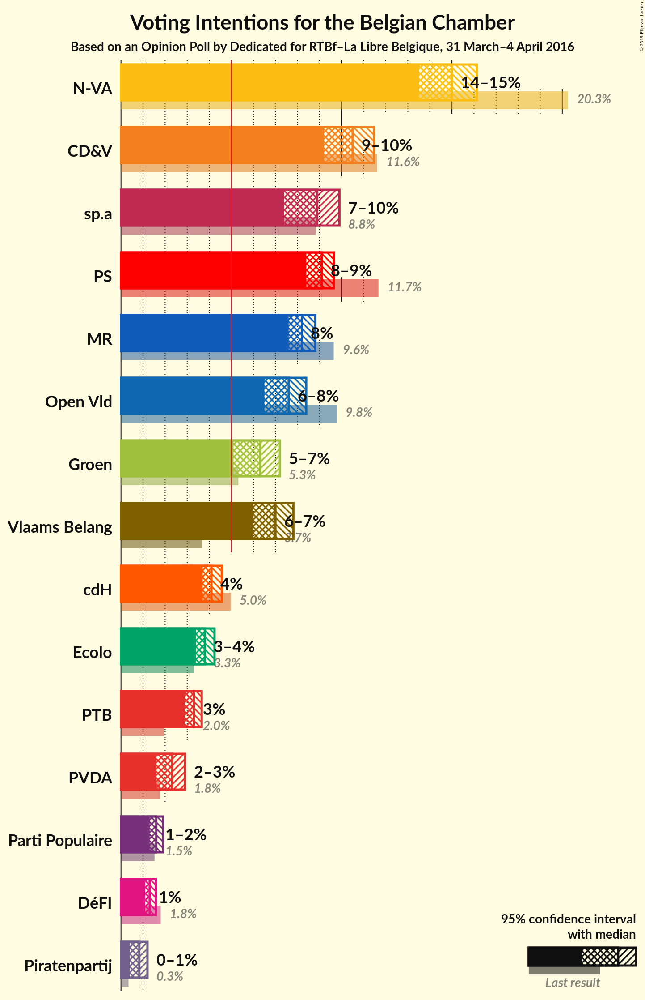
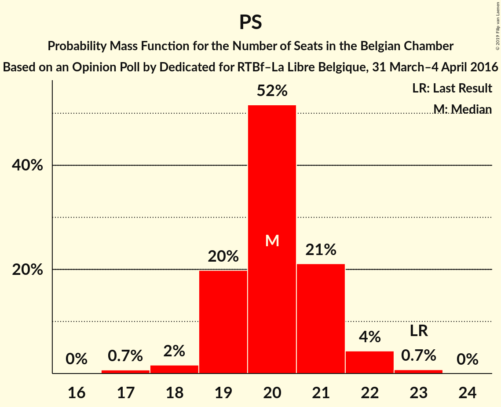
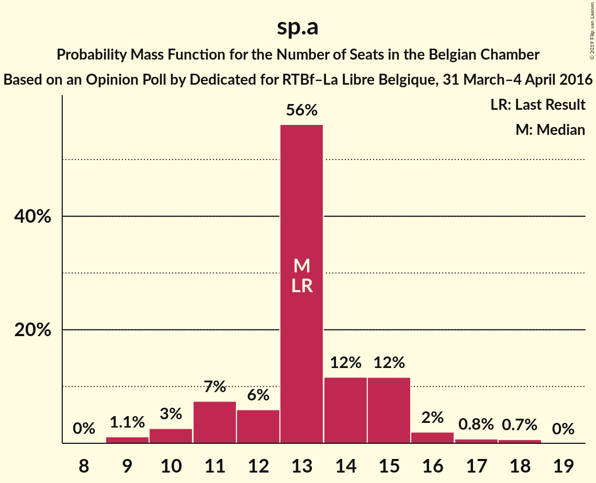
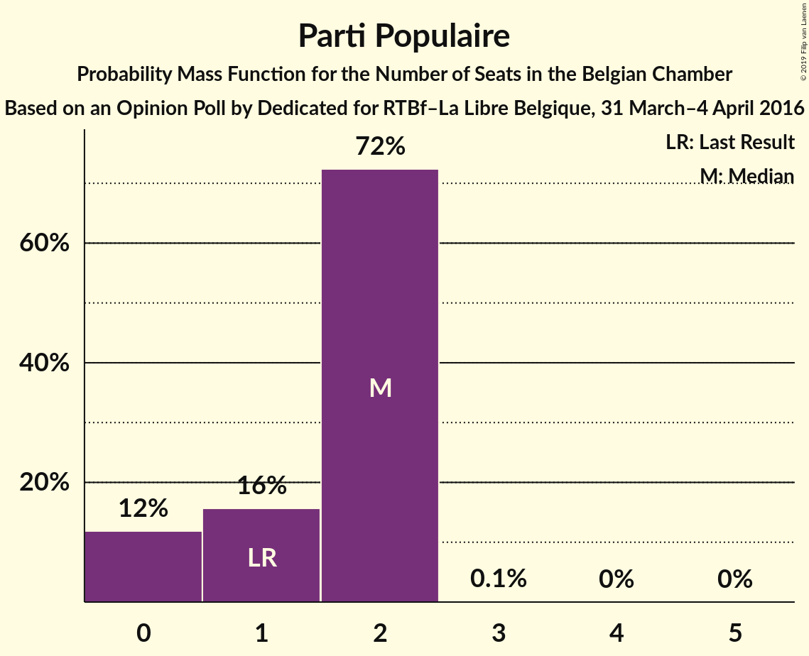

# Opinion Poll by Dedicated for RTBf–La Libre Belgique, 31 March–4 April 2016

Areas included: Brussels, Flanders, Wallonia

<a href="#voting-intentions">Voting Intentions</a> | <a href="#seats">Seats</a> | <a href="#coalitions">Coalitions</a> | <a href="#technical-information">Technical Information</a>

## Voting Intentions

### Confidence Intervals

| Party | Last Result | Poll Result | 80% Confidence Interval | 90% Confidence Interval | 95% Confidence Interval | 99% Confidence Interval |
|:-----:|:-----------:|:-----------:|:-----------------------:|:-----------------------:|:-----------------------:|:-----------------------:|
| N-VA | 20.3% | 16.1% | 23.6–27.7% |23.0–28.3% |22.5–28.8% |21.6–29.8% |
| CD&V | 11.6% | 11.5% | 16.6–20.2% |16.1–20.7% |15.7–21.2% |14.9–22.2% |
| PS | 11.7% | 9.6% | 24.6–28.3% |24.1–28.8% |23.7–29.2% |22.9–30.2% |
| sp.a | 8.8% | 8.9% | 12.8–16.1% |12.4–16.7% |12.0–17.1% |11.3–18.0% |
| MR | 9.6% | 8.8% | 22.2–25.7% |21.7–26.2% |21.3–26.7% |20.5–27.6% |
| Open Vld | 9.8% | 8.4% | 11.8–15.0% |11.4–15.5% |11.1–15.9% |10.4–16.8% |
| Vlaams Belang | 3.7% | 7.8% | 10.9–14.0% |10.5–14.5% |10.2–14.9% |9.5–15.8% |
| Groen | 5.3% | 6.3% | 8.9–11.8% |8.6–12.2% |8.2–12.6% |7.7–13.4% |
| cdH | 5.0% | 4.6% | 11.5–14.3% |11.2–14.7% |10.9–15.1% |10.3–15.8% |
| Ecolo | 3.3% | 4.2% | 9.9–12.5% |9.5–12.9% |9.2–13.2% |8.7–13.9% |
| PTB | 2.0% | 3.7% | 9.3–11.8% |9.0–12.2% |8.7–12.5% |8.1–13.2% |
| PVDA | 1.8% | 2.3% | 3.0–4.8% |2.8–5.1% |2.6–5.4% |2.3–5.9% |
| Parti Populaire | 1.5% | 1.9% | 4.7–6.5% |4.4–6.8% |4.2–7.1% |3.8–7.6% |
| DéFI | 1.8% | 1.6% | 1.9–3.1% |1.7–3.3% |1.6–3.5% |1.4–3.9% |
| Piratenpartij | 0.3% | 0.8% | 0.9–2.1% |0.8–2.3% |0.7–2.5% |0.6–2.8% |

*Note:* The poll result column reflects the actual value used in the calculations. Published results may vary slightly, and in addition be rounded to fewer digits.

## Seats

### Confidence Intervals

| Party | Last Result | Median | 80% Confidence Interval | 90% Confidence Interval | 95% Confidence Interval | 99% Confidence Interval |
|:-----:|:-----------:|:------:|:-----------------------:|:-----------------------:|:-----------------------:|:-----------------------:|
| <a href="#n-va">N-VA</a> | 33 | 25 | 23–28 |23–28 |22–29 |20–30 |
| <a href="#cd&v">CD&V</a> | 18 | 18 | 15–19 |15–20 |14–21 |13–22 |
| <a href="#ps">PS</a> | 23 | 20 | 19–21 |19–22 |19–22 |17–23 |
| <a href="#sp.a">sp.a</a> | 13 | 13 | 11–15 |11–15 |10–16 |9–18 |
| <a href="#mr">MR</a> | 20 | 18 | 17–19 |17–19 |17–20 |16–20 |
| <a href="#open-vld">Open Vld</a> | 14 | 12 | 11–13 |11–13 |10–15 |8–17 |
| <a href="#vlaams-belang">Vlaams Belang</a> | 3 | 11 | 8–13 |8–13 |8–14 |8–15 |
| <a href="#groen">Groen</a> | 6 | 9 | 6–11 |6–11 |6–12 |5–12 |
| <a href="#cdh">cdH</a> | 9 | 9 | 8–9 |7–9 |7–9 |6–10 |
| <a href="#ecolo">Ecolo</a> | 6 | 7 | 7–8 |6–8 |6–9 |6–9 |
| <a href="#ptb">PTB</a> | 2 | 5 | 5–6 |4–6 |4–7 |4–8 |
| <a href="#pvda">PVDA</a> | 0 | 0 | 0 |0 |0 |0 |
| <a href="#parti-populaire">Parti Populaire</a> | 1 | 2 | 0–2 |0–2 |0–2 |0–2 |
| <a href="#défi">DéFI</a> | 2 | 2 | 1–2 |1–2 |1–3 |1–3 |
| <a href="#piratenpartij">Piratenpartij</a> | 0 | 0 | 0 |0 |0 |0 |

### N-VA

*For a full overview of the results for this party, see the [N-VA](party-n-va.html) page.*

| Number of Seats | Probability | Accumulated | Special Marks |
|:---------------:|:-----------:|:-----------:|:-------------:|
| 19 | 0.1% | 100% |  |
| 20 | 0.5% | 99.9% |  |
| 21 | 1.3% | 99.4% |  |
| 22 | 3% | 98% |  |
| 23 | 7% | 95% |  |
| 24 | 32% | 88% |  |
| 25 | 18% | 56% | Median |
| 26 | 11% | 38% |  |
| 27 | 13% | 26% |  |
| 28 | 9% | 13% |  |
| 29 | 3% | 4% |  |
| 30 | 1.0% | 1.3% |  |
| 31 | 0.2% | 0.3% |  |
| 32 | 0% | 0% |  |
| 33 | 0% | 0% | Last Result |

### CD&V

*For a full overview of the results for this party, see the [CD&V](party-cdv.html) page.*

| Number of Seats | Probability | Accumulated | Special Marks |
|:---------------:|:-----------:|:-----------:|:-------------:|
| 13 | 2% | 100% |  |
| 14 | 2% | 98% |  |
| 15 | 12% | 96% |  |
| 16 | 8% | 84% |  |
| 17 | 15% | 76% |  |
| 18 | 48% | 61% | Last Result, Median |
| 19 | 5% | 13% |  |
| 20 | 4% | 8% |  |
| 21 | 3% | 4% |  |
| 22 | 0.9% | 1.1% |  |
| 23 | 0.1% | 0.1% |  |
| 24 | 0% | 0% |  |

### PS

*For a full overview of the results for this party, see the [PS](party-ps.html) page.*

| Number of Seats | Probability | Accumulated | Special Marks |
|:---------------:|:-----------:|:-----------:|:-------------:|
| 17 | 0.5% | 100% |  |
| 18 | 2% | 99.5% |  |
| 19 | 18% | 98% |  |
| 20 | 48% | 80% | Median |
| 21 | 26% | 32% |  |
| 22 | 5% | 6% |  |
| 23 | 1.0% | 1.0% | Last Result |
| 24 | 0% | 0% |  |

### sp.a

*For a full overview of the results for this party, see the [sp.a](party-spa.html) page.*

| Number of Seats | Probability | Accumulated | Special Marks |
|:---------------:|:-----------:|:-----------:|:-------------:|
| 9 | 1.0% | 100% |  |
| 10 | 3% | 98.9% |  |
| 11 | 7% | 96% |  |
| 12 | 6% | 88% |  |
| 13 | 57% | 83% | Last Result, Median |
| 14 | 12% | 26% |  |
| 15 | 10% | 14% |  |
| 16 | 3% | 4% |  |
| 17 | 0.6% | 1.2% |  |
| 18 | 0.6% | 0.6% |  |
| 19 | 0% | 0% |  |

### MR

*For a full overview of the results for this party, see the [MR](party-mr.html) page.*

| Number of Seats | Probability | Accumulated | Special Marks |
|:---------------:|:-----------:|:-----------:|:-------------:|
| 15 | 0.2% | 100% |  |
| 16 | 2% | 99.8% |  |
| 17 | 13% | 98% |  |
| 18 | 64% | 86% | Median |
| 19 | 19% | 22% |  |
| 20 | 2% | 3% | Last Result |
| 21 | 0.3% | 0.3% |  |
| 22 | 0% | 0% |  |

### Open Vld

*For a full overview of the results for this party, see the [Open Vld](party-openvld.html) page.*

| Number of Seats | Probability | Accumulated | Special Marks |
|:---------------:|:-----------:|:-----------:|:-------------:|
| 8 | 0.6% | 100% |  |
| 9 | 0.9% | 99.4% |  |
| 10 | 2% | 98% |  |
| 11 | 23% | 96% |  |
| 12 | 50% | 73% | Median |
| 13 | 19% | 23% |  |
| 14 | 1.3% | 4% | Last Result |
| 15 | 1.4% | 3% |  |
| 16 | 0.9% | 2% |  |
| 17 | 0.7% | 0.7% |  |
| 18 | 0.1% | 0.1% |  |
| 19 | 0% | 0% |  |

### Vlaams Belang

*For a full overview of the results for this party, see the [Vlaams Belang](party-vlaamsbelang.html) page.*

| Number of Seats | Probability | Accumulated | Special Marks |
|:---------------:|:-----------:|:-----------:|:-------------:|
| 3 | 0% | 100% | Last Result |
| 4 | 0% | 100% |  |
| 5 | 0% | 100% |  |
| 6 | 0% | 100% |  |
| 7 | 0% | 100% |  |
| 8 | 25% | 100% |  |
| 9 | 8% | 75% |  |
| 10 | 6% | 67% |  |
| 11 | 11% | 60% | Median |
| 12 | 36% | 49% |  |
| 13 | 9% | 13% |  |
| 14 | 3% | 4% |  |
| 15 | 0.8% | 0.9% |  |
| 16 | 0% | 0% |  |

### Groen

*For a full overview of the results for this party, see the [Groen](party-groen.html) page.*

| Number of Seats | Probability | Accumulated | Special Marks |
|:---------------:|:-----------:|:-----------:|:-------------:|
| 5 | 1.2% | 100% |  |
| 6 | 11% | 98.8% | Last Result |
| 7 | 4% | 88% |  |
| 8 | 28% | 84% |  |
| 9 | 21% | 56% | Median |
| 10 | 24% | 35% |  |
| 11 | 6% | 11% |  |
| 12 | 4% | 4% |  |
| 13 | 0% | 0% |  |

### cdH

*For a full overview of the results for this party, see the [cdH](party-cdh.html) page.*

| Number of Seats | Probability | Accumulated | Special Marks |
|:---------------:|:-----------:|:-----------:|:-------------:|
| 5 | 0.2% | 100% |  |
| 6 | 1.1% | 99.8% |  |
| 7 | 4% | 98.8% |  |
| 8 | 35% | 95% |  |
| 9 | 59% | 60% | Last Result, Median |
| 10 | 1.4% | 2% |  |
| 11 | 0.1% | 0.2% |  |
| 12 | 0% | 0% |  |

### Ecolo

*For a full overview of the results for this party, see the [Ecolo](party-ecolo.html) page.*

| Number of Seats | Probability | Accumulated | Special Marks |
|:---------------:|:-----------:|:-----------:|:-------------:|
| 5 | 0.4% | 100% |  |
| 6 | 6% | 99.6% | Last Result |
| 7 | 52% | 93% | Median |
| 8 | 38% | 41% |  |
| 9 | 3% | 3% |  |
| 10 | 0.1% | 0.1% |  |
| 11 | 0% | 0% |  |

### PTB

*For a full overview of the results for this party, see the [PTB](party-ptb.html) page.*

| Number of Seats | Probability | Accumulated | Special Marks |
|:---------------:|:-----------:|:-----------:|:-------------:|
| 2 | 0% | 100% | Last Result |
| 3 | 0.2% | 100% |  |
| 4 | 7% | 99.8% |  |
| 5 | 66% | 92% | Median |
| 6 | 22% | 26% |  |
| 7 | 3% | 4% |  |
| 8 | 1.0% | 1.0% |  |
| 9 | 0% | 0% |  |

### PVDA

*For a full overview of the results for this party, see the [PVDA](party-pvda.html) page.*

| Number of Seats | Probability | Accumulated | Special Marks |
|:---------------:|:-----------:|:-----------:|:-------------:|
| 0 | 100% | 100% | Last Result, Median |

### Parti Populaire

*For a full overview of the results for this party, see the [Parti Populaire](party-partipopulaire.html) page.*

| Number of Seats | Probability | Accumulated | Special Marks |
|:---------------:|:-----------:|:-----------:|:-------------:|
| 0 | 12% | 100% |  |
| 1 | 15% | 88% | Last Result |
| 2 | 73% | 73% | Median |
| 3 | 0.1% | 0.1% |  |
| 4 | 0% | 0% |  |

### DéFI

*For a full overview of the results for this party, see the [DéFI](party-défi.html) page.*

| Number of Seats | Probability | Accumulated | Special Marks |
|:---------------:|:-----------:|:-----------:|:-------------:|
| 1 | 23% | 100% |  |
| 2 | 73% | 77% | Last Result, Median |
| 3 | 4% | 4% |  |
| 4 | 0% | 0% |  |

### Piratenpartij

*For a full overview of the results for this party, see the [Piratenpartij](party-piratenpartij.html) page.*

| Number of Seats | Probability | Accumulated | Special Marks |
|:---------------:|:-----------:|:-----------:|:-------------:|
| 0 | 99.9% | 100% | Last Result, Median |
| 1 | 0.1% | 0.1% |  |
| 2 | 0% | 0% |  |

## Coalitions

### Confidence Intervals

| Coalition | Last Result | Median | Majority? | 80% Confidence Interval | 90% Confidence Interval | 95% Confidence Interval | 99% Confidence Interval |
|:---------:|:-----------:|:------:|:---------:|:-----------------------:|:-----------------------:|:-----------------------:|:-----------------------:|
| CD&V – PS – sp.a – MR – Open Vld – Groen – cdH – Ecolo | 109 | 105 | 100% | 103–108 | 102–109 | 101–110 | 99–112 |
| CD&V – PS – sp.a – MR – Open Vld – cdH | 97 | 89 | 100% | 87–92 | 86–93 | 85–94 | 84–95 |
| N-VA – CD&V – MR – Open Vld – cdH | 94 | 81 | 99.4% | 78–85 | 78–85 | 77–86 | 75–87 |
| CD&V – PS – sp.a – Groen – cdH – Ecolo – PTB – PVDA | 77 | 81 | 98.5% | 78–84 | 77–85 | 76–85 | 74–87 |
| PS – sp.a – MR – Open Vld – Groen – Ecolo | 82 | 79 | 97% | 77–82 | 76–83 | 75–84 | 74–85 |
| CD&V – PS – MR – Open Vld – cdH | 84 | 76 | 64% | 74–79 | 73–80 | 72–81 | 70–82 |
| CD&V – PS – sp.a – Groen – cdH – Ecolo | 75 | 75 | 47% | 72–78 | 72–79 | 71–80 | 69–82 |
| N-VA – CD&V – MR – Open Vld | 85 | 73 | 14% | 70–76 | 69–77 | 68–77 | 67–78 |
| PS – sp.a – MR – Open Vld | 70 | 63 | 0% | 61–66 | 60–67 | 60–68 | 58–69 |
| PS – sp.a – Groen – cdH – Ecolo – PTB – PVDA | 59 | 63 | 0% | 60–66 | 60–67 | 59–68 | 58–69 |
| CD&V – PS – sp.a – cdH | 63 | 59 | 0% | 57–62 | 56–63 | 55–64 | 54–65 |
| CD&V – MR – Open Vld – cdH | 61 | 56 | 0% | 54–58 | 53–59 | 52–60 | 51–62 |
| PS – sp.a – Groen – Ecolo – PTB – PVDA | 50 | 55 | 0% | 52–57 | 51–58 | 51–59 | 49–60 |
| CD&V – MR – Open Vld – Groen – cdH – Ecolo | 73 | 34 | 0% | 33–35 | 32–35 | 32–36 | 32–36 |

### CD&V – PS – sp.a – MR – Open Vld – Groen – cdH – Ecolo

| Number of Seats | Probability | Accumulated | Special Marks |
|:---------------:|:-----------:|:-----------:|:-------------:|
| 98 | 0.1% | 100% |  |
| 99 | 0.4% | 99.8% |  |
| 100 | 1.0% | 99.4% |  |
| 101 | 2% | 98% |  |
| 102 | 5% | 96% |  |
| 103 | 9% | 91% |  |
| 104 | 14% | 82% |  |
| 105 | 20% | 68% |  |
| 106 | 18% | 48% | Median |
| 107 | 12% | 29% |  |
| 108 | 8% | 17% |  |
| 109 | 5% | 9% | Last Result |
| 110 | 3% | 5% |  |
| 111 | 1.2% | 2% |  |
| 112 | 0.4% | 0.5% |  |
| 113 | 0.1% | 0.1% |  |
| 114 | 0% | 0% |  |

### CD&V – PS – sp.a – MR – Open Vld – cdH

| Number of Seats | Probability | Accumulated | Special Marks |
|:---------------:|:-----------:|:-----------:|:-------------:|
| 82 | 0.1% | 100% |  |
| 83 | 0.3% | 99.8% |  |
| 84 | 1.0% | 99.5% |  |
| 85 | 2% | 98.6% |  |
| 86 | 5% | 96% |  |
| 87 | 10% | 91% |  |
| 88 | 16% | 80% |  |
| 89 | 20% | 64% |  |
| 90 | 18% | 45% | Median |
| 91 | 11% | 27% |  |
| 92 | 7% | 15% |  |
| 93 | 4% | 9% |  |
| 94 | 3% | 4% |  |
| 95 | 1.2% | 2% |  |
| 96 | 0.4% | 0.5% |  |
| 97 | 0.1% | 0.1% | Last Result |
| 98 | 0% | 0% |  |

### N-VA – CD&V – MR – Open Vld – cdH

| Number of Seats | Probability | Accumulated | Special Marks |
|:---------------:|:-----------:|:-----------:|:-------------:|
| 74 | 0.1% | 100% |  |
| 75 | 0.5% | 99.8% |  |
| 76 | 1.2% | 99.4% | Majority |
| 77 | 3% | 98% |  |
| 78 | 7% | 95% |  |
| 79 | 14% | 88% |  |
| 80 | 16% | 75% |  |
| 81 | 14% | 59% |  |
| 82 | 13% | 44% | Median |
| 83 | 13% | 32% |  |
| 84 | 9% | 19% |  |
| 85 | 7% | 10% |  |
| 86 | 2% | 3% |  |
| 87 | 0.7% | 1.0% |  |
| 88 | 0.2% | 0.3% |  |
| 89 | 0% | 0.1% |  |
| 90 | 0% | 0% |  |
| 91 | 0% | 0% |  |
| 92 | 0% | 0% |  |
| 93 | 0% | 0% |  |
| 94 | 0% | 0% | Last Result |

### CD&V – PS – sp.a – Groen – cdH – Ecolo – PTB – PVDA

| Number of Seats | Probability | Accumulated | Special Marks |
|:---------------:|:-----------:|:-----------:|:-------------:|
| 73 | 0.1% | 100% |  |
| 74 | 0.4% | 99.8% |  |
| 75 | 1.0% | 99.5% |  |
| 76 | 2% | 98.5% | Majority |
| 77 | 5% | 96% | Last Result |
| 78 | 8% | 91% |  |
| 79 | 13% | 83% |  |
| 80 | 19% | 70% |  |
| 81 | 18% | 51% | Median |
| 82 | 14% | 33% |  |
| 83 | 9% | 20% |  |
| 84 | 5% | 10% |  |
| 85 | 3% | 5% |  |
| 86 | 1.4% | 2% |  |
| 87 | 0.5% | 0.7% |  |
| 88 | 0.2% | 0.2% |  |
| 89 | 0% | 0% |  |

### PS – sp.a – MR – Open Vld – Groen – Ecolo

| Number of Seats | Probability | Accumulated | Special Marks |
|:---------------:|:-----------:|:-----------:|:-------------:|
| 72 | 0.1% | 100% |  |
| 73 | 0.3% | 99.9% |  |
| 74 | 0.8% | 99.6% |  |
| 75 | 2% | 98.8% |  |
| 76 | 5% | 97% | Majority |
| 77 | 9% | 91% |  |
| 78 | 15% | 82% |  |
| 79 | 19% | 67% | Median |
| 80 | 16% | 48% |  |
| 81 | 13% | 31% |  |
| 82 | 9% | 19% | Last Result |
| 83 | 5% | 9% |  |
| 84 | 3% | 4% |  |
| 85 | 1.1% | 2% |  |
| 86 | 0.4% | 0.5% |  |
| 87 | 0.1% | 0.1% |  |
| 88 | 0% | 0% |  |

### CD&V – PS – MR – Open Vld – cdH

| Number of Seats | Probability | Accumulated | Special Marks |
|:---------------:|:-----------:|:-----------:|:-------------:|
| 69 | 0.1% | 100% |  |
| 70 | 0.4% | 99.9% |  |
| 71 | 1.0% | 99.5% |  |
| 72 | 2% | 98% |  |
| 73 | 6% | 96% |  |
| 74 | 11% | 90% |  |
| 75 | 16% | 80% |  |
| 76 | 20% | 64% | Majority |
| 77 | 19% | 44% | Median |
| 78 | 13% | 25% |  |
| 79 | 6% | 12% |  |
| 80 | 3% | 6% |  |
| 81 | 2% | 3% |  |
| 82 | 0.7% | 1.1% |  |
| 83 | 0.2% | 0.3% |  |
| 84 | 0.1% | 0.1% | Last Result |
| 85 | 0% | 0% |  |

### CD&V – PS – sp.a – Groen – cdH – Ecolo

| Number of Seats | Probability | Accumulated | Special Marks |
|:---------------:|:-----------:|:-----------:|:-------------:|
| 67 | 0.1% | 100% |  |
| 68 | 0.2% | 99.9% |  |
| 69 | 0.5% | 99.8% |  |
| 70 | 1.3% | 99.3% |  |
| 71 | 3% | 98% |  |
| 72 | 6% | 95% |  |
| 73 | 9% | 89% |  |
| 74 | 14% | 80% |  |
| 75 | 19% | 66% | Last Result |
| 76 | 18% | 47% | Median, Majority |
| 77 | 13% | 30% |  |
| 78 | 8% | 17% |  |
| 79 | 5% | 9% |  |
| 80 | 2% | 4% |  |
| 81 | 1.1% | 2% |  |
| 82 | 0.4% | 0.5% |  |
| 83 | 0.1% | 0.1% |  |
| 84 | 0% | 0% |  |

### N-VA – CD&V – MR – Open Vld

| Number of Seats | Probability | Accumulated | Special Marks |
|:---------------:|:-----------:|:-----------:|:-------------:|
| 65 | 0.1% | 100% |  |
| 66 | 0.3% | 99.9% |  |
| 67 | 0.8% | 99.7% |  |
| 68 | 2% | 98.9% |  |
| 69 | 4% | 97% |  |
| 70 | 11% | 93% |  |
| 71 | 16% | 81% |  |
| 72 | 15% | 66% |  |
| 73 | 13% | 50% | Median |
| 74 | 14% | 38% |  |
| 75 | 10% | 24% |  |
| 76 | 8% | 14% | Majority |
| 77 | 4% | 6% |  |
| 78 | 1.3% | 2% |  |
| 79 | 0.4% | 0.5% |  |
| 80 | 0.1% | 0.1% |  |
| 81 | 0% | 0% |  |
| 82 | 0% | 0% |  |
| 83 | 0% | 0% |  |
| 84 | 0% | 0% |  |
| 85 | 0% | 0% | Last Result |

### PS – sp.a – MR – Open Vld

| Number of Seats | Probability | Accumulated | Special Marks |
|:---------------:|:-----------:|:-----------:|:-------------:|
| 57 | 0.1% | 100% |  |
| 58 | 0.5% | 99.8% |  |
| 59 | 2% | 99.3% |  |
| 60 | 4% | 98% |  |
| 61 | 9% | 93% |  |
| 62 | 16% | 84% |  |
| 63 | 23% | 68% | Median |
| 64 | 21% | 45% |  |
| 65 | 12% | 25% |  |
| 66 | 6% | 12% |  |
| 67 | 3% | 6% |  |
| 68 | 2% | 3% |  |
| 69 | 0.7% | 0.9% |  |
| 70 | 0.2% | 0.2% | Last Result |
| 71 | 0% | 0.1% |  |
| 72 | 0% | 0% |  |

### PS – sp.a – Groen – cdH – Ecolo – PTB – PVDA

| Number of Seats | Probability | Accumulated | Special Marks |
|:---------------:|:-----------:|:-----------:|:-------------:|
| 56 | 0.1% | 100% |  |
| 57 | 0.3% | 99.9% |  |
| 58 | 1.0% | 99.6% |  |
| 59 | 3% | 98.6% | Last Result |
| 60 | 6% | 96% |  |
| 61 | 10% | 89% |  |
| 62 | 16% | 79% |  |
| 63 | 18% | 63% | Median |
| 64 | 17% | 44% |  |
| 65 | 13% | 27% |  |
| 66 | 8% | 14% |  |
| 67 | 4% | 6% |  |
| 68 | 2% | 3% |  |
| 69 | 0.6% | 0.9% |  |
| 70 | 0.2% | 0.3% |  |
| 71 | 0.1% | 0.1% |  |
| 72 | 0% | 0% |  |

### CD&V – PS – sp.a – cdH

| Number of Seats | Probability | Accumulated | Special Marks |
|:---------------:|:-----------:|:-----------:|:-------------:|
| 52 | 0.1% | 100% |  |
| 53 | 0.3% | 99.9% |  |
| 54 | 1.0% | 99.5% |  |
| 55 | 3% | 98.6% |  |
| 56 | 6% | 96% |  |
| 57 | 10% | 90% |  |
| 58 | 15% | 80% |  |
| 59 | 20% | 65% |  |
| 60 | 19% | 45% | Median |
| 61 | 12% | 26% |  |
| 62 | 7% | 14% |  |
| 63 | 4% | 7% | Last Result |
| 64 | 2% | 3% |  |
| 65 | 0.7% | 0.9% |  |
| 66 | 0.2% | 0.2% |  |
| 67 | 0% | 0.1% |  |
| 68 | 0% | 0% |  |

### CD&V – MR – Open Vld – cdH

| Number of Seats | Probability | Accumulated | Special Marks |
|:---------------:|:-----------:|:-----------:|:-------------:|
| 49 | 0.1% | 100% |  |
| 50 | 0.3% | 99.9% |  |
| 51 | 1.0% | 99.6% |  |
| 52 | 2% | 98.6% |  |
| 53 | 6% | 96% |  |
| 54 | 12% | 91% |  |
| 55 | 16% | 79% |  |
| 56 | 22% | 63% |  |
| 57 | 21% | 41% | Median |
| 58 | 11% | 20% |  |
| 59 | 5% | 9% |  |
| 60 | 3% | 5% |  |
| 61 | 1.4% | 2% | Last Result |
| 62 | 0.5% | 0.6% |  |
| 63 | 0.1% | 0.2% |  |
| 64 | 0% | 0% |  |

### PS – sp.a – Groen – Ecolo – PTB – PVDA

| Number of Seats | Probability | Accumulated | Special Marks |
|:---------------:|:-----------:|:-----------:|:-------------:|
| 48 | 0.1% | 100% |  |
| 49 | 0.5% | 99.8% |  |
| 50 | 2% | 99.3% | Last Result |
| 51 | 5% | 98% |  |
| 52 | 8% | 93% |  |
| 53 | 14% | 85% |  |
| 54 | 18% | 70% | Median |
| 55 | 18% | 53% |  |
| 56 | 15% | 34% |  |
| 57 | 10% | 19% |  |
| 58 | 5% | 9% |  |
| 59 | 2% | 4% |  |
| 60 | 0.9% | 1.4% |  |
| 61 | 0.3% | 0.4% |  |
| 62 | 0.1% | 0.1% |  |
| 63 | 0% | 0% |  |

### CD&V – MR – Open Vld – Groen – cdH – Ecolo

| Number of Seats | Probability | Accumulated | Special Marks |
|:---------------:|:-----------:|:-----------:|:-------------:|
| 30 | 0% | 100% |  |
| 31 | 0.4% | 99.9% |  |
| 32 | 5% | 99.5% |  |
| 33 | 22% | 95% |  |
| 34 | 41% | 72% |  |
| 35 | 28% | 31% |  |
| 36 | 3% | 3% |  |
| 37 | 0.3% | 0.3% |  |
| 38 | 0% | 0% |  |
| 39 | 0% | 0% |  |
| 40 | 0% | 0% |  |
| 41 | 0% | 0% |  |
| 42 | 0% | 0% |  |
| 43 | 0% | 0% |  |
| 44 | 0% | 0% |  |
| 45 | 0% | 0% |  |
| 46 | 0% | 0% |  |
| 47 | 0% | 0% |  |
| 48 | 0% | 0% |  |
| 49 | 0% | 0% |  |
| 50 | 0% | 0% |  |
| 51 | 0% | 0% |  |
| 52 | 0% | 0% |  |
| 53 | 0% | 0% |  |
| 54 | 0% | 0% |  |
| 55 | 0% | 0% |  |
| 56 | 0% | 0% |  |
| 57 | 0% | 0% |  |
| 58 | 0% | 0% |  |
| 59 | 0% | 0% |  |
| 60 | 0% | 0% |  |
| 61 | 0% | 0% |  |
| 62 | 0% | 0% |  |
| 63 | 0% | 0% |  |
| 64 | 0% | 0% |  |
| 65 | 0% | 0% |  |
| 66 | 0% | 0% |  |
| 67 | 0% | 0% |  |
| 68 | 0% | 0% |  |
| 69 | 0% | 0% |  |
| 70 | 0% | 0% |  |
| 71 | 0% | 0% |  |
| 72 | 0% | 0% |  |
| 73 | 0% | 0% | Last Result, Median |

## Technical Information

### Opinion Poll

+ **Polling firm:** Dedicated
+ **Commissioner(s):** RTBf–La Libre Belgique
+ **Fieldwork period:** 31 March–4 April 2016

### Calculations

+ **Sample size:** 1203
+ **Simulations done:** 1,048,576
+ **Error estimate:** 2.41%

