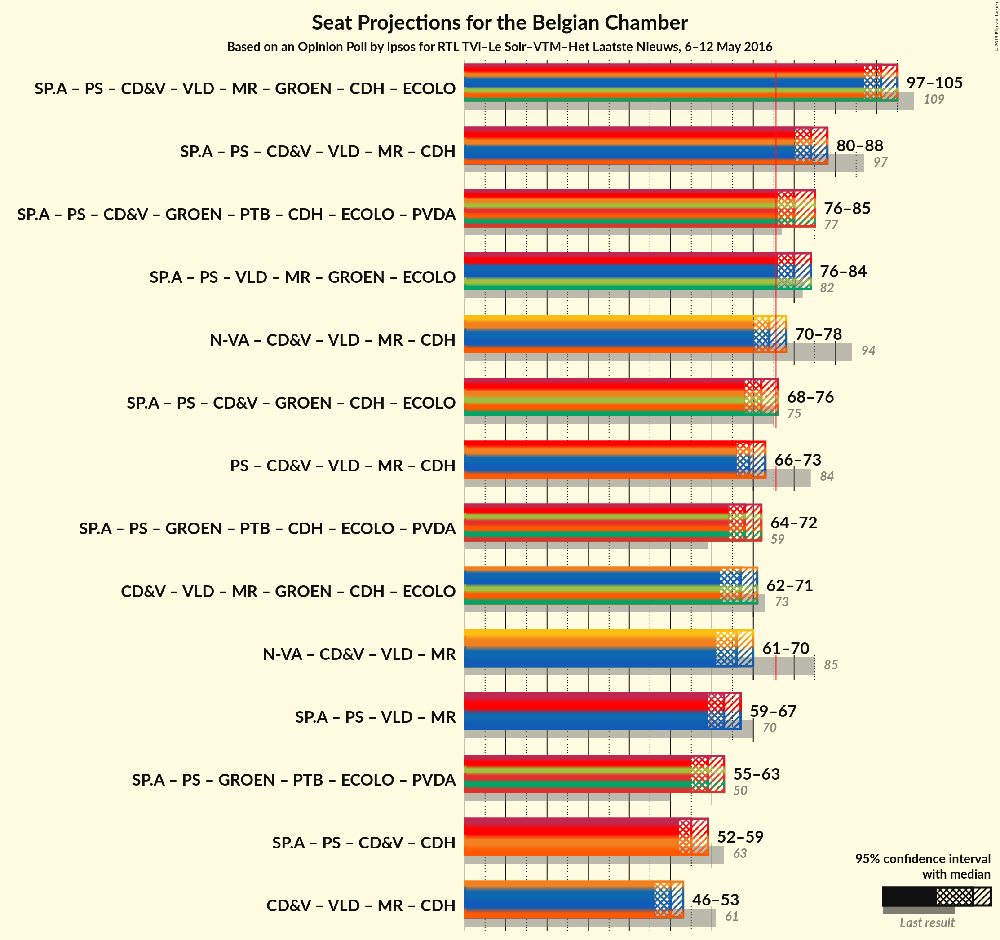

# Opinion Poll by Ipsos for RTL TVi–Le Soir–VTM–Het Laatste Nieuws, 6–12 May 2016

<a href="#voting-intentions">Voting Intentions</a> | <a href="#seats">Seats</a> | <a href="#coalitions">Coalitions</a> | <a href="#technical-information">Technical Information</a>

## Voting Intentions

### Confidence Intervals

| Party | Last Result | Poll Result | 80% Confidence Interval | 90% Confidence Interval | 95% Confidence Interval | 99% Confidence Interval |
|:-----:|:-----------:|:-----------:|:-----------------------:|:-----------------------:|:-----------------------:|:-----------------------:|
| N-VA | 20.3% | 16.2% | 22.6–26.0% |22.1–26.5% |21.7–26.9% |20.9–27.8% |
| sp.a | 8.8% | 10.4% | 14.2–17.1% |13.9–17.6% |13.5–17.9% |12.9–18.7% |
| Vlaams Belang | 3.7% | 9.3% | 12.6–15.3% |12.2–15.7% |11.9–16.1% |11.3–16.8% |
| CD&V | 11.6% | 9.2% | 12.5–15.2% |12.1–15.7% |11.8–16.0% |11.2–16.7% |
| Open Vld | 9.8% | 8.8% | 11.9–14.6% |11.6–15.0% |11.3–15.4% |10.7–16.1% |
| PS | 11.7% | 8.6% | N/A |N/A |N/A |N/A |
| Groen | 5.3% | 7.4% | 9.9–12.4% |9.6–12.8% |9.3–13.2% |8.8–13.8% |
| MR | 9.6% | 6.7% | N/A |N/A |N/A |N/A |
| PTB | 2.0% | 4.5% | N/A |N/A |N/A |N/A |
| cdH | 5.0% | 4.0% | N/A |N/A |N/A |N/A |
| Ecolo | 3.3% | 3.3% | N/A |N/A |N/A |N/A |
| PVDA | 1.8% | 3.2% | 4.0–5.7% |3.8–6.0% |3.6–6.3% |3.3–6.8% |
| Parti Populaire | 1.5% | 1.8% | N/A |N/A |N/A |N/A |
| DéFI | 1.8% | 1.1% | N/A |N/A |N/A |N/A |
| La Droite | 0.4% | 0.6% | N/A |N/A |N/A |N/A |

*Note:* The poll result column reflects the actual value used in the calculations. Published results may vary slightly, and in addition be rounded to fewer digits.

## Seats

### Confidence Intervals

| Party | Last Result | Median | 80% Confidence Interval | 90% Confidence Interval | 95% Confidence Interval | 99% Confidence Interval |
|:-----:|:-----------:|:------:|:-----------------------:|:-----------------------:|:-----------------------:|:-----------------------:|
| <a href="#n-va">N-VA</a> | 33 | 24 | 23–26 |22–27 |21–27 |20–28 |
| <a href="#sp.a">sp.a</a> | 13 | 15 | 13–17 |13–17 |13–18 |12–18 |
| <a href="#vlaams-belang">Vlaams Belang</a> | 3 | 13 | 12–15 |12–15 |11–15 |9–15 |
| <a href="#cd&v">CD&V</a> | 18 | 13 | 12–13 |11–14 |10–15 |9–16 |
| <a href="#open-vld">Open Vld</a> | 14 | 12 | 11–13 |11–13 |11–14 |10–16 |
| <a href="#ps">PS</a> | 23 | 16 | 14–17 |14–17 |14–18 |13–18 |
| <a href="#groen">Groen</a> | 6 | 10 | 9–12 |8–12 |8–12 |7–12 |
| <a href="#mr">MR</a> | 20 | 12 | 10–14 |10–14 |10–14 |10–14 |
| <a href="#ptb">PTB</a> | 2 | 7 | 5–8 |5–8 |5–8 |5–8 |
| <a href="#cdh">cdH</a> | 9 | 7 | 6–8 |5–8 |5–8 |4–8 |
| <a href="#ecolo">Ecolo</a> | 6 | 5 | 3–6 |3–6 |3–6 |3–6 |
| <a href="#pvda">PVDA</a> | 0 | 0 | 0 |0 |0 |0 |
| <a href="#parti-populaire">Parti Populaire</a> | 1 | 2 | 1–2 |0–2 |0–2 |0–2 |
| <a href="#défi">DéFI</a> | 2 | 0 | 0 |0 |0 |0 |
| <a href="#la-droite">La Droite</a> | 0 | 0 | 0 |0 |0 |0 |

### N-VA

*For a full overview of the results for this party, see the [N-VA](party-nva.html) page.*

| Number of Seats | Probability | Accumulated | Special Marks |
|:---------------:|:-----------:|:-----------:|:-------------:|
| 20 | 1.1% | 100% |  |
| 21 | 3% | 98.9% |  |
| 22 | 6% | 96% |  |
| 23 | 15% | 90% |  |
| 24 | 44% | 75% | Median |
| 25 | 13% | 31% |  |
| 26 | 11% | 17% |  |
| 27 | 5% | 6% |  |
| 28 | 1.3% | 1.5% |  |
| 29 | 0.2% | 0.2% |  |
| 30 | 0% | 0% |  |
| 31 | 0% | 0% |  |
| 32 | 0% | 0% |  |
| 33 | 0% | 0% | Last Result |

### sp.a

*For a full overview of the results for this party, see the [sp.a](party-spa.html) page.*

| Number of Seats | Probability | Accumulated | Special Marks |
|:---------------:|:-----------:|:-----------:|:-------------:|
| 11 | 0.1% | 100% |  |
| 12 | 0.5% | 99.8% |  |
| 13 | 16% | 99.3% | Last Result |
| 14 | 32% | 83% |  |
| 15 | 28% | 51% | Median |
| 16 | 11% | 23% |  |
| 17 | 8% | 12% |  |
| 18 | 3% | 3% |  |
| 19 | 0.1% | 0.1% |  |
| 20 | 0% | 0% |  |

### Vlaams Belang

*For a full overview of the results for this party, see the [Vlaams Belang](party-vlaamsbelang.html) page.*

| Number of Seats | Probability | Accumulated | Special Marks |
|:---------------:|:-----------:|:-----------:|:-------------:|
| 3 | 0% | 100% | Last Result |
| 4 | 0% | 100% |  |
| 5 | 0% | 100% |  |
| 6 | 0% | 100% |  |
| 7 | 0% | 100% |  |
| 8 | 0.3% | 100% |  |
| 9 | 0.3% | 99.7% |  |
| 10 | 0.8% | 99.4% |  |
| 11 | 3% | 98.6% |  |
| 12 | 40% | 96% |  |
| 13 | 19% | 55% | Median |
| 14 | 22% | 36% |  |
| 15 | 13% | 14% |  |
| 16 | 0.2% | 0.3% |  |
| 17 | 0.1% | 0.1% |  |
| 18 | 0% | 0% |  |

### CD&V

*For a full overview of the results for this party, see the [CD&V](party-cdv.html) page.*

| Number of Seats | Probability | Accumulated | Special Marks |
|:---------------:|:-----------:|:-----------:|:-------------:|
| 9 | 1.0% | 100% |  |
| 10 | 2% | 99.0% |  |
| 11 | 5% | 97% |  |
| 12 | 8% | 92% |  |
| 13 | 75% | 84% | Median |
| 14 | 6% | 9% |  |
| 15 | 2% | 3% |  |
| 16 | 0.7% | 1.2% |  |
| 17 | 0.3% | 0.5% |  |
| 18 | 0.2% | 0.2% | Last Result |
| 19 | 0% | 0% |  |

### Open Vld

*For a full overview of the results for this party, see the [Open Vld](party-openvld.html) page.*

| Number of Seats | Probability | Accumulated | Special Marks |
|:---------------:|:-----------:|:-----------:|:-------------:|
| 8 | 0.1% | 100% |  |
| 9 | 0.1% | 99.9% |  |
| 10 | 1.3% | 99.7% |  |
| 11 | 22% | 98% |  |
| 12 | 48% | 77% | Median |
| 13 | 24% | 28% |  |
| 14 | 2% | 4% | Last Result |
| 15 | 1.1% | 2% |  |
| 16 | 0.4% | 0.6% |  |
| 17 | 0.3% | 0.3% |  |
| 18 | 0% | 0% |  |

### PS

*For a full overview of the results for this party, see the [PS](party-ps.html) page.*

| Number of Seats | Probability | Accumulated | Special Marks |
|:---------------:|:-----------:|:-----------:|:-------------:|
| 12 | 0.1% | 100% |  |
| 13 | 0.9% | 99.9% |  |
| 14 | 17% | 99.0% |  |
| 15 | 18% | 82% |  |
| 16 | 50% | 63% | Median |
| 17 | 9% | 13% |  |
| 18 | 3% | 4% |  |
| 19 | 0.3% | 0.4% |  |
| 20 | 0% | 0% |  |
| 21 | 0% | 0% |  |
| 22 | 0% | 0% |  |
| 23 | 0% | 0% | Last Result |

### Groen

*For a full overview of the results for this party, see the [Groen](party-groen.html) page.*

| Number of Seats | Probability | Accumulated | Special Marks |
|:---------------:|:-----------:|:-----------:|:-------------:|
| 6 | 0.5% | 100% | Last Result |
| 7 | 0.6% | 99.5% |  |
| 8 | 9% | 99.0% |  |
| 9 | 20% | 90% |  |
| 10 | 30% | 70% | Median |
| 11 | 19% | 40% |  |
| 12 | 21% | 21% |  |
| 13 | 0% | 0.1% |  |
| 14 | 0% | 0% |  |

### MR

*For a full overview of the results for this party, see the [MR](party-mr.html) page.*

| Number of Seats | Probability | Accumulated | Special Marks |
|:---------------:|:-----------:|:-----------:|:-------------:|
| 9 | 0.1% | 100% |  |
| 10 | 11% | 99.9% |  |
| 11 | 24% | 89% |  |
| 12 | 17% | 64% | Median |
| 13 | 29% | 48% |  |
| 14 | 18% | 18% |  |
| 15 | 0.2% | 0.2% |  |
| 16 | 0% | 0% |  |
| 17 | 0% | 0% |  |
| 18 | 0% | 0% |  |
| 19 | 0% | 0% |  |
| 20 | 0% | 0% | Last Result |

### PTB

*For a full overview of the results for this party, see the [PTB](party-ptb.html) page.*

| Number of Seats | Probability | Accumulated | Special Marks |
|:---------------:|:-----------:|:-----------:|:-------------:|
| 2 | 0% | 100% | Last Result |
| 3 | 0% | 100% |  |
| 4 | 0.2% | 100% |  |
| 5 | 10% | 99.8% |  |
| 6 | 14% | 89% |  |
| 7 | 51% | 76% | Median |
| 8 | 24% | 24% |  |
| 9 | 0.3% | 0.3% |  |
| 10 | 0% | 0% |  |

### cdH

*For a full overview of the results for this party, see the [cdH](party-cdh.html) page.*

| Number of Seats | Probability | Accumulated | Special Marks |
|:---------------:|:-----------:|:-----------:|:-------------:|
| 3 | 0.1% | 100% |  |
| 4 | 0.6% | 99.9% |  |
| 5 | 7% | 99.3% |  |
| 6 | 14% | 92% |  |
| 7 | 63% | 78% | Median |
| 8 | 16% | 16% |  |
| 9 | 0.1% | 0.1% | Last Result |
| 10 | 0% | 0% |  |

### Ecolo

*For a full overview of the results for this party, see the [Ecolo](party-ecolo.html) page.*

| Number of Seats | Probability | Accumulated | Special Marks |
|:---------------:|:-----------:|:-----------:|:-------------:|
| 2 | 0.1% | 100% |  |
| 3 | 13% | 99.9% |  |
| 4 | 11% | 87% |  |
| 5 | 62% | 77% | Median |
| 6 | 14% | 14% | Last Result |
| 7 | 0.2% | 0.2% |  |
| 8 | 0% | 0% |  |

### PVDA

*For a full overview of the results for this party, see the [PVDA](party-pvda.html) page.*

| Number of Seats | Probability | Accumulated | Special Marks |
|:---------------:|:-----------:|:-----------:|:-------------:|
| 0 | 100% | 100% | Last Result, Median |

### Parti Populaire

*For a full overview of the results for this party, see the [Parti Populaire](party-partipopulaire.html) page.*

| Number of Seats | Probability | Accumulated | Special Marks |
|:---------------:|:-----------:|:-----------:|:-------------:|
| 0 | 9% | 100% |  |
| 1 | 16% | 91% | Last Result |
| 2 | 75% | 75% | Median |
| 3 | 0% | 0% |  |

### DéFI

*For a full overview of the results for this party, see the [DéFI](party-dfi.html) page.*

| Number of Seats | Probability | Accumulated | Special Marks |
|:---------------:|:-----------:|:-----------:|:-------------:|
| 0 | 99.9% | 100% | Median |
| 1 | 0.1% | 0.1% |  |
| 2 | 0% | 0% | Last Result |

### La Droite

*For a full overview of the results for this party, see the [La Droite](party-ladroite.html) page.*

| Number of Seats | Probability | Accumulated | Special Marks |
|:---------------:|:-----------:|:-----------:|:-------------:|
| 0 | 100% | 100% | Last Result, Median |

## Coalitions

### Confidence Intervals

| Coalition | Last Result | Median | Majority? | 80% Confidence Interval | 90% Confidence Interval | 95% Confidence Interval | 99% Confidence Interval |
|:---------:|:-----------:|:------:|:---------:|:-----------------------:|:-----------------------:|:-----------------------:|:-----------------------:|
| sp.a – CD&V – Open Vld – PS – Groen – MR – cdH – Ecolo | 109 | 89 | 100% | 87–92 | 86–92 | 86–93 | 85–94 |
| sp.a – CD&V – Open Vld – PS – MR – cdH | 97 | 74 | 27% | 72–77 | 71–78 | 71–78 | 70–79 |
| sp.a – CD&V – PS – Groen – PTB – cdH – Ecolo – PVDA | 77 | 72 | 4% | 69–75 | 69–75 | 68–76 | 67–77 |
| sp.a – Open Vld – PS – Groen – MR – Ecolo | 82 | 70 | 0.3% | 67–72 | 66–73 | 66–74 | 65–75 |
| N-VA – CD&V – Open Vld – MR – cdH | 94 | 68 | 0% | 66–71 | 65–72 | 64–72 | 63–73 |
| sp.a – CD&V – PS – Groen – cdH – Ecolo | 75 | 65 | 0% | 62–68 | 62–68 | 61–69 | 60–70 |
| N-VA – CD&V – Open Vld – MR | 85 | 61 | 0% | 59–64 | 58–65 | 57–65 | 56–66 |
| sp.a – PS – Groen – PTB – cdH – Ecolo – PVDA | 59 | 59 | 0% | 56–62 | 56–62 | 55–63 | 54–64 |
| sp.a – Open Vld – PS – MR | 70 | 55 | 0% | 52–57 | 52–58 | 51–59 | 50–60 |
| sp.a – CD&V – PS – cdH | 63 | 50 | 0% | 48–52 | 47–53 | 46–54 | 45–55 |
| CD&V – Open Vld – MR – cdH | 61 | 44 | 0% | 42–46 | 41–47 | 41–47 | 39–49 |

### sp.a – CD&V – Open Vld – PS – Groen – MR – cdH – Ecolo

| Number of Seats | Probability | Accumulated | Special Marks |
|:---------------:|:-----------:|:-----------:|:-------------:|
| 83 | 0.1% | 100% |  |
| 84 | 0.4% | 99.9% |  |
| 85 | 1.2% | 99.5% |  |
| 86 | 4% | 98% |  |
| 87 | 11% | 94% |  |
| 88 | 16% | 83% |  |
| 89 | 21% | 67% |  |
| 90 | 21% | 46% | Median |
| 91 | 14% | 25% |  |
| 92 | 7% | 11% |  |
| 93 | 3% | 4% |  |
| 94 | 0.9% | 1.4% |  |
| 95 | 0.3% | 0.4% |  |
| 96 | 0.1% | 0.1% |  |
| 97 | 0% | 0% |  |
| 98 | 0% | 0% |  |
| 99 | 0% | 0% |  |
| 100 | 0% | 0% |  |
| 101 | 0% | 0% |  |
| 102 | 0% | 0% |  |
| 103 | 0% | 0% |  |
| 104 | 0% | 0% |  |
| 105 | 0% | 0% |  |
| 106 | 0% | 0% |  |
| 107 | 0% | 0% |  |
| 108 | 0% | 0% |  |
| 109 | 0% | 0% | Last Result |

### sp.a – CD&V – Open Vld – PS – MR – cdH

| Number of Seats | Probability | Accumulated | Special Marks |
|:---------------:|:-----------:|:-----------:|:-------------:|
| 68 | 0.1% | 100% |  |
| 69 | 0.4% | 99.9% |  |
| 70 | 1.3% | 99.5% |  |
| 71 | 4% | 98% |  |
| 72 | 11% | 94% |  |
| 73 | 18% | 83% |  |
| 74 | 20% | 65% |  |
| 75 | 17% | 45% | Median |
| 76 | 14% | 27% | Majority |
| 77 | 8% | 13% |  |
| 78 | 4% | 6% |  |
| 79 | 1.5% | 2% |  |
| 80 | 0.4% | 0.5% |  |
| 81 | 0.1% | 0.1% |  |
| 82 | 0% | 0% |  |
| 83 | 0% | 0% |  |
| 84 | 0% | 0% |  |
| 85 | 0% | 0% |  |
| 86 | 0% | 0% |  |
| 87 | 0% | 0% |  |
| 88 | 0% | 0% |  |
| 89 | 0% | 0% |  |
| 90 | 0% | 0% |  |
| 91 | 0% | 0% |  |
| 92 | 0% | 0% |  |
| 93 | 0% | 0% |  |
| 94 | 0% | 0% |  |
| 95 | 0% | 0% |  |
| 96 | 0% | 0% |  |
| 97 | 0% | 0% | Last Result |

### sp.a – CD&V – PS – Groen – PTB – cdH – Ecolo – PVDA

| Number of Seats | Probability | Accumulated | Special Marks |
|:---------------:|:-----------:|:-----------:|:-------------:|
| 65 | 0.1% | 100% |  |
| 66 | 0.3% | 99.9% |  |
| 67 | 0.8% | 99.6% |  |
| 68 | 3% | 98.8% |  |
| 69 | 8% | 96% |  |
| 70 | 13% | 89% |  |
| 71 | 18% | 75% |  |
| 72 | 20% | 58% |  |
| 73 | 16% | 38% | Median |
| 74 | 12% | 22% |  |
| 75 | 6% | 10% |  |
| 76 | 3% | 4% | Majority |
| 77 | 0.9% | 1.2% | Last Result |
| 78 | 0.2% | 0.3% |  |
| 79 | 0.1% | 0.1% |  |
| 80 | 0% | 0% |  |

### sp.a – Open Vld – PS – Groen – MR – Ecolo

| Number of Seats | Probability | Accumulated | Special Marks |
|:---------------:|:-----------:|:-----------:|:-------------:|
| 63 | 0.1% | 100% |  |
| 64 | 0.3% | 99.9% |  |
| 65 | 1.3% | 99.6% |  |
| 66 | 4% | 98% |  |
| 67 | 9% | 94% |  |
| 68 | 15% | 85% |  |
| 69 | 19% | 70% |  |
| 70 | 19% | 51% | Median |
| 71 | 15% | 32% |  |
| 72 | 9% | 17% |  |
| 73 | 4% | 7% |  |
| 74 | 2% | 3% |  |
| 75 | 0.7% | 0.9% |  |
| 76 | 0.2% | 0.3% | Majority |
| 77 | 0% | 0.1% |  |
| 78 | 0% | 0% |  |
| 79 | 0% | 0% |  |
| 80 | 0% | 0% |  |
| 81 | 0% | 0% |  |
| 82 | 0% | 0% | Last Result |

### N-VA – CD&V – Open Vld – MR – cdH

| Number of Seats | Probability | Accumulated | Special Marks |
|:---------------:|:-----------:|:-----------:|:-------------:|
| 61 | 0.1% | 100% |  |
| 62 | 0.3% | 99.9% |  |
| 63 | 1.0% | 99.7% |  |
| 64 | 3% | 98.7% |  |
| 65 | 6% | 96% |  |
| 66 | 11% | 90% |  |
| 67 | 16% | 79% |  |
| 68 | 19% | 63% | Median |
| 69 | 18% | 44% |  |
| 70 | 13% | 26% |  |
| 71 | 8% | 13% |  |
| 72 | 4% | 5% |  |
| 73 | 1.2% | 2% |  |
| 74 | 0.3% | 0.3% |  |
| 75 | 0.1% | 0.1% |  |
| 76 | 0% | 0% | Majority |
| 77 | 0% | 0% |  |
| 78 | 0% | 0% |  |
| 79 | 0% | 0% |  |
| 80 | 0% | 0% |  |
| 81 | 0% | 0% |  |
| 82 | 0% | 0% |  |
| 83 | 0% | 0% |  |
| 84 | 0% | 0% |  |
| 85 | 0% | 0% |  |
| 86 | 0% | 0% |  |
| 87 | 0% | 0% |  |
| 88 | 0% | 0% |  |
| 89 | 0% | 0% |  |
| 90 | 0% | 0% |  |
| 91 | 0% | 0% |  |
| 92 | 0% | 0% |  |
| 93 | 0% | 0% |  |
| 94 | 0% | 0% | Last Result |

### sp.a – CD&V – PS – Groen – cdH – Ecolo

| Number of Seats | Probability | Accumulated | Special Marks |
|:---------------:|:-----------:|:-----------:|:-------------:|
| 58 | 0.1% | 100% |  |
| 59 | 0.3% | 99.9% |  |
| 60 | 0.8% | 99.6% |  |
| 61 | 3% | 98.8% |  |
| 62 | 7% | 96% |  |
| 63 | 12% | 89% |  |
| 64 | 17% | 77% |  |
| 65 | 19% | 60% |  |
| 66 | 17% | 41% | Median |
| 67 | 13% | 24% |  |
| 68 | 7% | 11% |  |
| 69 | 3% | 4% |  |
| 70 | 0.9% | 1.3% |  |
| 71 | 0.3% | 0.4% |  |
| 72 | 0.1% | 0.1% |  |
| 73 | 0% | 0% |  |
| 74 | 0% | 0% |  |
| 75 | 0% | 0% | Last Result |

### N-VA – CD&V – Open Vld – MR

| Number of Seats | Probability | Accumulated | Special Marks |
|:---------------:|:-----------:|:-----------:|:-------------:|
| 55 | 0.2% | 100% |  |
| 56 | 0.9% | 99.7% |  |
| 57 | 2% | 98.8% |  |
| 58 | 6% | 96% |  |
| 59 | 11% | 91% |  |
| 60 | 15% | 80% |  |
| 61 | 18% | 65% | Median |
| 62 | 18% | 47% |  |
| 63 | 14% | 29% |  |
| 64 | 9% | 16% |  |
| 65 | 5% | 7% |  |
| 66 | 2% | 2% |  |
| 67 | 0.4% | 0.5% |  |
| 68 | 0.1% | 0.1% |  |
| 69 | 0% | 0% |  |
| 70 | 0% | 0% |  |
| 71 | 0% | 0% |  |
| 72 | 0% | 0% |  |
| 73 | 0% | 0% |  |
| 74 | 0% | 0% |  |
| 75 | 0% | 0% |  |
| 76 | 0% | 0% | Majority |
| 77 | 0% | 0% |  |
| 78 | 0% | 0% |  |
| 79 | 0% | 0% |  |
| 80 | 0% | 0% |  |
| 81 | 0% | 0% |  |
| 82 | 0% | 0% |  |
| 83 | 0% | 0% |  |
| 84 | 0% | 0% |  |
| 85 | 0% | 0% | Last Result |

### sp.a – PS – Groen – PTB – cdH – Ecolo – PVDA

| Number of Seats | Probability | Accumulated | Special Marks |
|:---------------:|:-----------:|:-----------:|:-------------:|
| 53 | 0.2% | 100% |  |
| 54 | 0.6% | 99.8% |  |
| 55 | 3% | 99.1% |  |
| 56 | 7% | 97% |  |
| 57 | 13% | 89% |  |
| 58 | 17% | 77% |  |
| 59 | 19% | 60% | Last Result |
| 60 | 16% | 40% | Median |
| 61 | 12% | 24% |  |
| 62 | 7% | 12% |  |
| 63 | 3% | 5% |  |
| 64 | 1.1% | 2% |  |
| 65 | 0.3% | 0.4% |  |
| 66 | 0.1% | 0.1% |  |
| 67 | 0% | 0% |  |

### sp.a – Open Vld – PS – MR

| Number of Seats | Probability | Accumulated | Special Marks |
|:---------------:|:-----------:|:-----------:|:-------------:|
| 49 | 0.1% | 100% |  |
| 50 | 0.8% | 99.9% |  |
| 51 | 4% | 99.0% |  |
| 52 | 10% | 95% |  |
| 53 | 16% | 85% |  |
| 54 | 19% | 69% |  |
| 55 | 18% | 50% | Median |
| 56 | 15% | 32% |  |
| 57 | 9% | 17% |  |
| 58 | 5% | 8% |  |
| 59 | 2% | 3% |  |
| 60 | 0.6% | 0.8% |  |
| 61 | 0.1% | 0.2% |  |
| 62 | 0% | 0% |  |
| 63 | 0% | 0% |  |
| 64 | 0% | 0% |  |
| 65 | 0% | 0% |  |
| 66 | 0% | 0% |  |
| 67 | 0% | 0% |  |
| 68 | 0% | 0% |  |
| 69 | 0% | 0% |  |
| 70 | 0% | 0% | Last Result |

### sp.a – CD&V – PS – cdH

| Number of Seats | Probability | Accumulated | Special Marks |
|:---------------:|:-----------:|:-----------:|:-------------:|
| 43 | 0% | 100% |  |
| 44 | 0.2% | 99.9% |  |
| 45 | 0.5% | 99.8% |  |
| 46 | 2% | 99.3% |  |
| 47 | 6% | 97% |  |
| 48 | 12% | 92% |  |
| 49 | 18% | 80% |  |
| 50 | 23% | 62% |  |
| 51 | 18% | 39% | Median |
| 52 | 11% | 21% |  |
| 53 | 6% | 10% |  |
| 54 | 3% | 4% |  |
| 55 | 0.9% | 1.1% |  |
| 56 | 0.2% | 0.3% |  |
| 57 | 0% | 0.1% |  |
| 58 | 0% | 0% |  |
| 59 | 0% | 0% |  |
| 60 | 0% | 0% |  |
| 61 | 0% | 0% |  |
| 62 | 0% | 0% |  |
| 63 | 0% | 0% | Last Result |

### CD&V – Open Vld – MR – cdH

| Number of Seats | Probability | Accumulated | Special Marks |
|:---------------:|:-----------:|:-----------:|:-------------:|
| 38 | 0.1% | 100% |  |
| 39 | 0.7% | 99.8% |  |
| 40 | 2% | 99.2% |  |
| 41 | 4% | 98% |  |
| 42 | 11% | 93% |  |
| 43 | 20% | 82% |  |
| 44 | 22% | 62% | Median |
| 45 | 21% | 40% |  |
| 46 | 12% | 19% |  |
| 47 | 4% | 7% |  |
| 48 | 1.5% | 2% |  |
| 49 | 0.6% | 0.8% |  |
| 50 | 0.2% | 0.2% |  |
| 51 | 0% | 0% |  |
| 52 | 0% | 0% |  |
| 53 | 0% | 0% |  |
| 54 | 0% | 0% |  |
| 55 | 0% | 0% |  |
| 56 | 0% | 0% |  |
| 57 | 0% | 0% |  |
| 58 | 0% | 0% |  |
| 59 | 0% | 0% |  |
| 60 | 0% | 0% |  |
| 61 | 0% | 0% | Last Result |

## Technical Information

### Opinion Poll

+ **Pollster:** Ipsos
+ **Media:** RTL TVi–Le Soir–VTM–Het Laatste Nieuws
+ **Fieldwork period:** 6–12 May 2016

### Calculations

+ **Sample size:** 1564
+ **Simulations done:** 16,777,216
+ **Error estimate:** 0.44%

