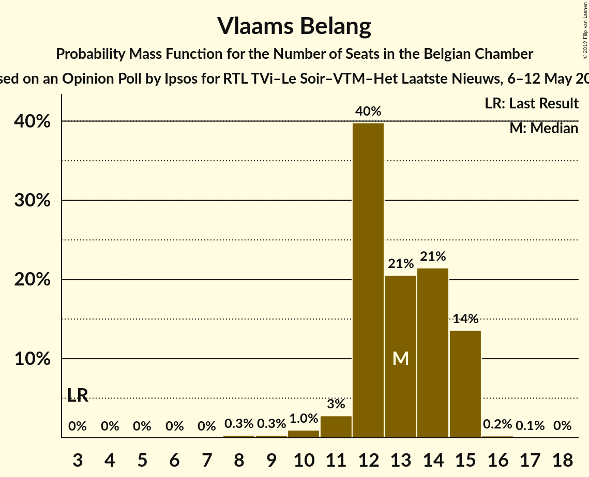
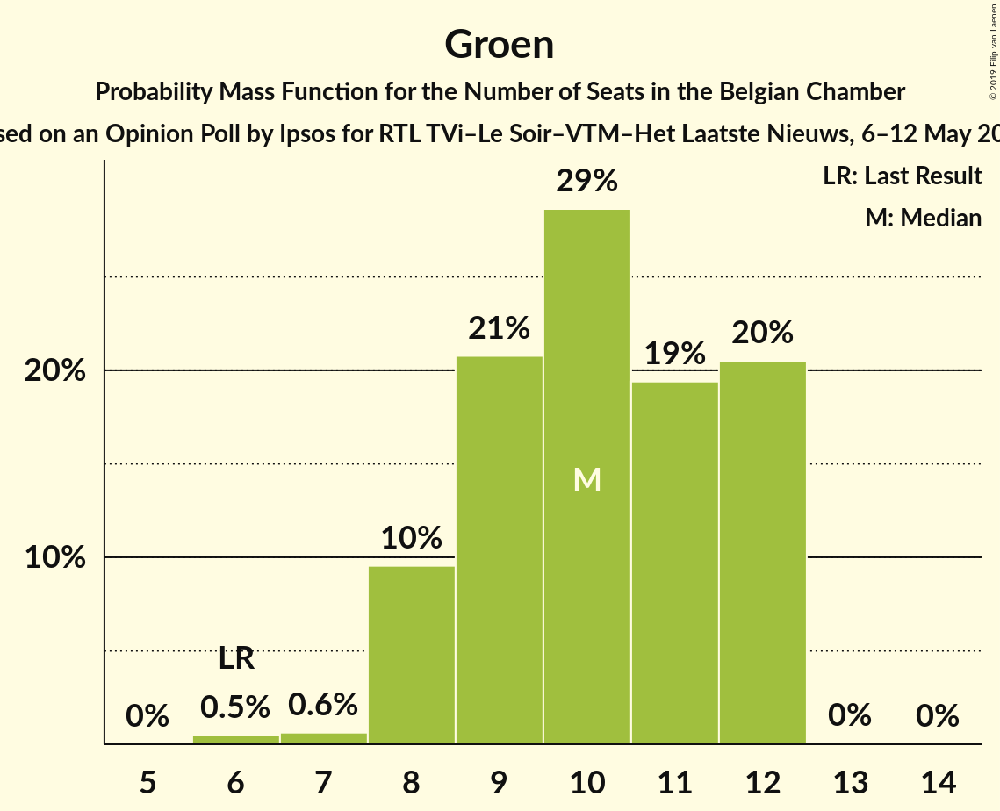
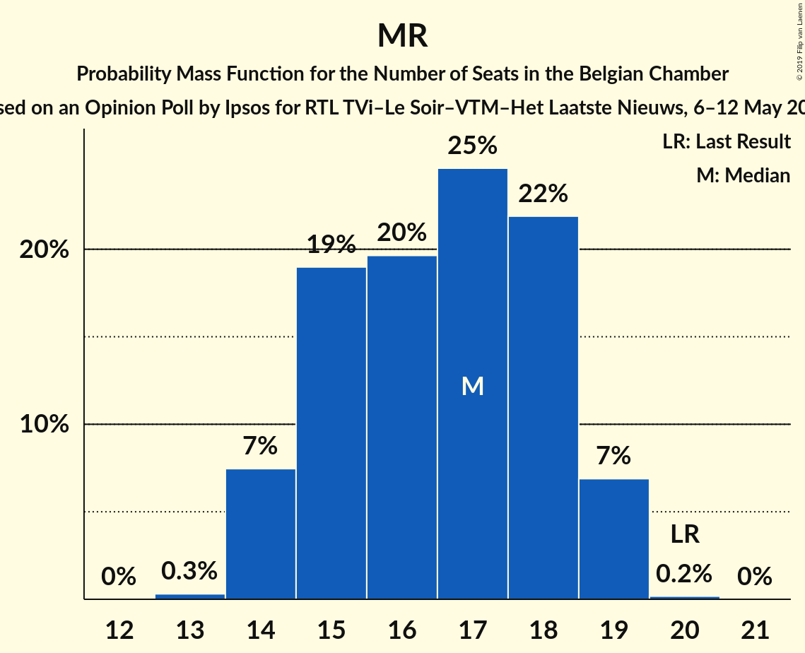
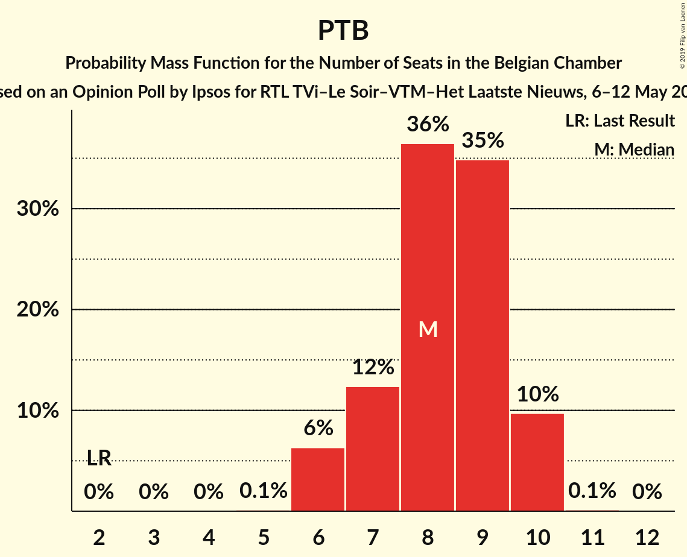
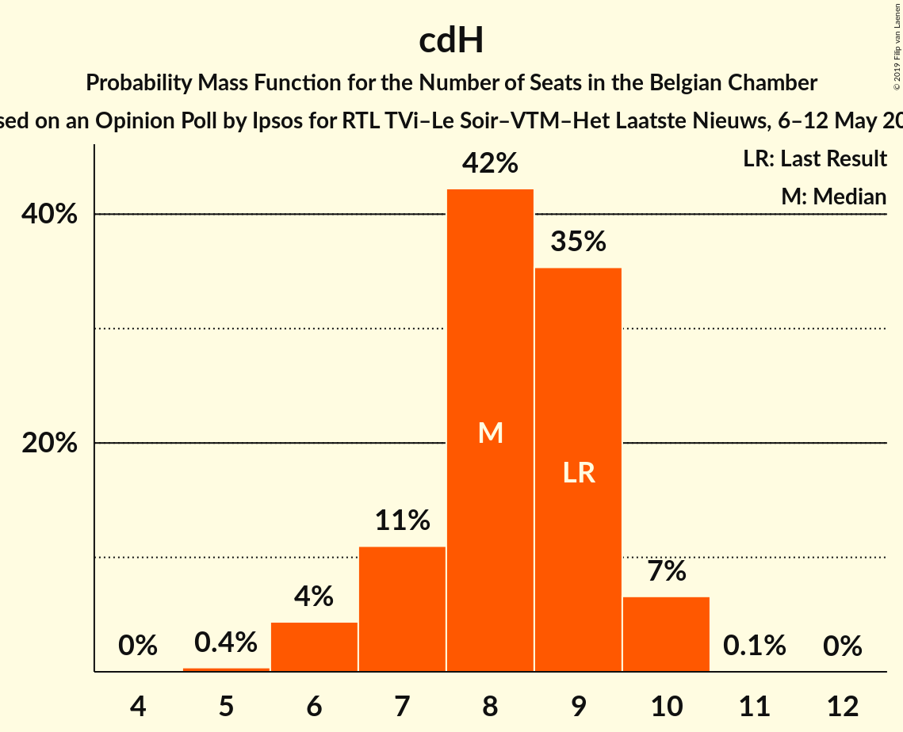

# Opinion Poll by Ipsos for RTL TVi–Le Soir–VTM–Het Laatste Nieuws, 6–12 May 2016

Areas included: Flanders, Wallonia

<a href="#voting-intentions">Voting Intentions</a> | <a href="#seats">Seats</a> | <a href="#coalitions">Coalitions</a> | <a href="#technical-information">Technical Information</a>

## Voting Intentions

### Confidence Intervals

| Party | Last Result | Poll Result | 80% Confidence Interval | 90% Confidence Interval | 95% Confidence Interval | 99% Confidence Interval |
|:-----:|:-----------:|:-----------:|:-----------------------:|:-----------------------:|:-----------------------:|:-----------------------:|
| N-VA | 20.3% | 16.2% | 22.6–26.0% |22.1–26.5% |21.7–26.9% |20.9–27.8% |
| sp.a | 8.8% | 10.4% | 14.2–17.1% |13.9–17.6% |13.5–17.9% |12.9–18.7% |
| Vlaams Belang | 3.7% | 9.3% | 12.6–15.3% |12.2–15.7% |11.9–16.1% |11.3–16.8% |
| CD&V | 11.6% | 9.2% | 12.5–15.2% |12.1–15.7% |11.8–16.0% |11.2–16.7% |
| Open Vld | 9.8% | 8.8% | 11.9–14.6% |11.6–15.0% |11.3–15.4% |10.7–16.1% |
| PS | 11.7% | 8.6% | N/A |N/A |N/A |N/A |
| Groen | 5.3% | 7.4% | 9.9–12.4% |9.6–12.8% |9.3–13.2% |8.8–13.8% |
| MR | 9.6% | 6.7% | N/A |N/A |N/A |N/A |
| PTB | 2.0% | 4.5% | N/A |N/A |N/A |N/A |
| cdH | 5.0% | 4.0% | N/A |N/A |N/A |N/A |
| Ecolo | 3.3% | 3.3% | N/A |N/A |N/A |N/A |
| PVDA | 1.8% | 3.2% | 4.0–5.7% |3.8–6.0% |3.6–6.3% |3.3–6.8% |
| Parti Populaire | 1.5% | 1.8% | N/A |N/A |N/A |N/A |
| DéFI | 1.8% | 1.1% | N/A |N/A |N/A |N/A |
| La Droite | 0.4% | 0.6% | N/A |N/A |N/A |N/A |

*Note:* The poll result column reflects the actual value used in the calculations. Published results may vary slightly, and in addition be rounded to fewer digits.

## Seats

### Confidence Intervals

| Party | Last Result | Median | 80% Confidence Interval | 90% Confidence Interval | 95% Confidence Interval | 99% Confidence Interval |
|:-----:|:-----------:|:------:|:-----------------------:|:-----------------------:|:-----------------------:|:-----------------------:|
| <a href="#n-va">N-VA</a> | 33 | 24 | 23–26 |21–27 |21–27 |20–28 |
| <a href="#sp.a">sp.a</a> | 13 | 15 | 13–17 |13–17 |13–18 |12–18 |
| <a href="#vlaams-belang">Vlaams Belang</a> | 3 | 13 | 12–15 |12–15 |11–15 |9–15 |
| <a href="#cd&v">CD&V</a> | 18 | 13 | 12–13 |11–14 |10–15 |9–17 |
| <a href="#open-vld">Open Vld</a> | 14 | 12 | 11–13 |11–13 |11–14 |10–16 |
| <a href="#ps">PS</a> | 23 | 14 | 14–16 |14–16 |14–17 |14–17 |
| <a href="#groen">Groen</a> | 6 | 10 | 9–12 |8–12 |8–12 |6–12 |
| <a href="#mr">MR</a> | 20 | 13 | 11–14 |11–14 |11–14 |11–14 |
| <a href="#ptb">PTB</a> | 2 | 7 | 5–9 |5–9 |4–9 |4–10 |
| <a href="#cdh">cdH</a> | 9 | 7 | 6–7 |6–7 |6–7 |6–7 |
| <a href="#ecolo">Ecolo</a> | 6 | 5 | 4–6 |4–6 |4–6 |4–6 |
| <a href="#pvda">PVDA</a> | 0 | 0 | 0 |0 |0 |0 |
| <a href="#parti-populaire">Parti Populaire</a> | 1 | 1 | 1–3 |1–3 |0–3 |0–3 |
| <a href="#défi">DéFI</a> | 2 | 0 | 0 |0 |0 |0 |
| <a href="#la-droite">La Droite</a> | 0 | 0 | 0 |0 |0 |0 |

### N-VA

*For a full overview of the results for this party, see the [N-VA](party-nva.html) page.*

| Number of Seats | Probability | Accumulated | Special Marks |
|:---------------:|:-----------:|:-----------:|:-------------:|
| 20 | 1.0% | 100% |  |
| 21 | 4% | 98.9% |  |
| 22 | 4% | 95% |  |
| 23 | 16% | 91% |  |
| 24 | 44% | 74% | Median |
| 25 | 12% | 31% |  |
| 26 | 12% | 18% |  |
| 27 | 5% | 7% |  |
| 28 | 1.2% | 1.4% |  |
| 29 | 0.1% | 0.2% |  |
| 30 | 0% | 0% |  |
| 31 | 0% | 0% |  |
| 32 | 0% | 0% |  |
| 33 | 0% | 0% | Last Result |

### sp.a

*For a full overview of the results for this party, see the [sp.a](party-spa.html) page.*

| Number of Seats | Probability | Accumulated | Special Marks |
|:---------------:|:-----------:|:-----------:|:-------------:|
| 11 | 0.1% | 100% |  |
| 12 | 0.5% | 99.8% |  |
| 13 | 16% | 99.3% | Last Result |
| 14 | 32% | 83% |  |
| 15 | 28% | 51% | Median |
| 16 | 10% | 22% |  |
| 17 | 9% | 12% |  |
| 18 | 3% | 3% |  |
| 19 | 0.1% | 0.1% |  |
| 20 | 0% | 0% |  |

### Vlaams Belang

*For a full overview of the results for this party, see the [Vlaams Belang](party-vlaamsbelang.html) page.*

| Number of Seats | Probability | Accumulated | Special Marks |
|:---------------:|:-----------:|:-----------:|:-------------:|
| 3 | 0% | 100% | Last Result |
| 4 | 0% | 100% |  |
| 5 | 0% | 100% |  |
| 6 | 0% | 100% |  |
| 7 | 0% | 100% |  |
| 8 | 0.3% | 100% |  |
| 9 | 0.2% | 99.7% |  |
| 10 | 1.1% | 99.4% |  |
| 11 | 3% | 98% |  |
| 12 | 41% | 96% |  |
| 13 | 20% | 54% | Median |
| 14 | 21% | 34% |  |
| 15 | 13% | 13% |  |
| 16 | 0.2% | 0.3% |  |
| 17 | 0.1% | 0.1% |  |
| 18 | 0% | 0% |  |

### CD&V

*For a full overview of the results for this party, see the [CD&V](party-cdv.html) page.*

| Number of Seats | Probability | Accumulated | Special Marks |
|:---------------:|:-----------:|:-----------:|:-------------:|
| 9 | 0.9% | 100% |  |
| 10 | 2% | 99.1% |  |
| 11 | 4% | 97% |  |
| 12 | 9% | 93% |  |
| 13 | 75% | 84% | Median |
| 14 | 6% | 10% |  |
| 15 | 2% | 3% |  |
| 16 | 0.8% | 1.3% |  |
| 17 | 0.3% | 0.5% |  |
| 18 | 0.2% | 0.2% | Last Result |
| 19 | 0% | 0% |  |

### Open Vld

*For a full overview of the results for this party, see the [Open Vld](party-openvld.html) page.*

| Number of Seats | Probability | Accumulated | Special Marks |
|:---------------:|:-----------:|:-----------:|:-------------:|
| 8 | 0.1% | 100% |  |
| 9 | 0.1% | 99.9% |  |
| 10 | 1.4% | 99.7% |  |
| 11 | 20% | 98% |  |
| 12 | 49% | 78% | Median |
| 13 | 26% | 30% |  |
| 14 | 2% | 4% | Last Result |
| 15 | 1.0% | 2% |  |
| 16 | 0.4% | 0.7% |  |
| 17 | 0.3% | 0.3% |  |
| 18 | 0% | 0% |  |

### PS

*For a full overview of the results for this party, see the [PS](party-ps.html) page.*

| Number of Seats | Probability | Accumulated | Special Marks |
|:---------------:|:-----------:|:-----------:|:-------------:|
| 14 | 57% | 100% | Median |
| 15 | 8% | 43% |  |
| 16 | 30% | 34% |  |
| 17 | 4% | 4% |  |
| 18 | 0.1% | 0.1% |  |
| 19 | 0% | 0% |  |
| 20 | 0% | 0% |  |
| 21 | 0% | 0% |  |
| 22 | 0% | 0% |  |
| 23 | 0% | 0% | Last Result |

### Groen

*For a full overview of the results for this party, see the [Groen](party-groen.html) page.*

| Number of Seats | Probability | Accumulated | Special Marks |
|:---------------:|:-----------:|:-----------:|:-------------:|
| 6 | 0.5% | 100% | Last Result |
| 7 | 0.6% | 99.5% |  |
| 8 | 8% | 98.9% |  |
| 9 | 21% | 91% |  |
| 10 | 29% | 69% | Median |
| 11 | 20% | 40% |  |
| 12 | 20% | 20% |  |
| 13 | 0% | 0.1% |  |
| 14 | 0% | 0% |  |

### MR

*For a full overview of the results for this party, see the [MR](party-mr.html) page.*

| Number of Seats | Probability | Accumulated | Special Marks |
|:---------------:|:-----------:|:-----------:|:-------------:|
| 10 | 0.2% | 100% |  |
| 11 | 20% | 99.8% |  |
| 12 | 6% | 80% |  |
| 13 | 34% | 74% | Median |
| 14 | 39% | 39% |  |
| 15 | 0.1% | 0.1% |  |
| 16 | 0% | 0% |  |
| 17 | 0% | 0% |  |
| 18 | 0% | 0% |  |
| 19 | 0% | 0% |  |
| 20 | 0% | 0% | Last Result |

### PTB

*For a full overview of the results for this party, see the [PTB](party-ptb.html) page.*

| Number of Seats | Probability | Accumulated | Special Marks |
|:---------------:|:-----------:|:-----------:|:-------------:|
| 2 | 0% | 100% | Last Result |
| 3 | 0% | 100% |  |
| 4 | 4% | 100% |  |
| 5 | 12% | 96% |  |
| 6 | 30% | 84% |  |
| 7 | 34% | 54% | Median |
| 8 | 0.3% | 20% |  |
| 9 | 19% | 20% |  |
| 10 | 0.7% | 0.7% |  |
| 11 | 0% | 0% |  |

### cdH

*For a full overview of the results for this party, see the [cdH](party-cdh.html) page.*

| Number of Seats | Probability | Accumulated | Special Marks |
|:---------------:|:-----------:|:-----------:|:-------------:|
| 4 | 0.1% | 100% |  |
| 5 | 0.1% | 99.9% |  |
| 6 | 46% | 99.8% |  |
| 7 | 54% | 54% | Median |
| 8 | 0% | 0.1% |  |
| 9 | 0.1% | 0.1% | Last Result |
| 10 | 0% | 0% |  |

### Ecolo

*For a full overview of the results for this party, see the [Ecolo](party-ecolo.html) page.*

| Number of Seats | Probability | Accumulated | Special Marks |
|:---------------:|:-----------:|:-----------:|:-------------:|
| 4 | 10% | 100% |  |
| 5 | 56% | 90% | Median |
| 6 | 34% | 34% | Last Result |
| 7 | 0% | 0% |  |

### PVDA

*For a full overview of the results for this party, see the [PVDA](party-pvda.html) page.*

| Number of Seats | Probability | Accumulated | Special Marks |
|:---------------:|:-----------:|:-----------:|:-------------:|
| 0 | 100% | 100% | Last Result, Median |

### Parti Populaire

*For a full overview of the results for this party, see the [Parti Populaire](party-partipopulaire.html) page.*

| Number of Seats | Probability | Accumulated | Special Marks |
|:---------------:|:-----------:|:-----------:|:-------------:|
| 0 | 4% | 100% |  |
| 1 | 47% | 96% | Last Result, Median |
| 2 | 19% | 48% |  |
| 3 | 30% | 30% |  |
| 4 | 0% | 0% |  |

### DéFI

*For a full overview of the results for this party, see the [DéFI](party-dfi.html) page.*

| Number of Seats | Probability | Accumulated | Special Marks |
|:---------------:|:-----------:|:-----------:|:-------------:|
| 0 | 100% | 100% | Median |
| 1 | 0% | 0% |  |
| 2 | 0% | 0% | Last Result |

### La Droite

*For a full overview of the results for this party, see the [La Droite](party-ladroite.html) page.*

| Number of Seats | Probability | Accumulated | Special Marks |
|:---------------:|:-----------:|:-----------:|:-------------:|
| 0 | 100% | 100% | Last Result, Median |

## Coalitions

### Confidence Intervals

| Coalition | Last Result | Median | Majority? | 80% Confidence Interval | 90% Confidence Interval | 95% Confidence Interval | 99% Confidence Interval |
|:---------:|:-----------:|:------:|:---------:|:-----------------------:|:-----------------------:|:-----------------------:|:-----------------------:|
| sp.a – CD&V – Open Vld – PS – Groen – MR – cdH – Ecolo | 109 | 89 | 100% | 87–92 | 86–93 | 86–94 | 84–95 |
| sp.a – CD&V – Open Vld – PS – MR – cdH | 97 | 74 | 21% | 72–76 | 71–77 | 71–78 | 69–79 |
| sp.a – CD&V – PS – Groen – PTB – cdH – Ecolo – PVDA | 77 | 71 | 3% | 69–74 | 68–75 | 67–76 | 66–77 |
| sp.a – Open Vld – PS – Groen – MR – Ecolo | 82 | 70 | 0.6% | 67–73 | 67–74 | 66–74 | 65–76 |
| N-VA – CD&V – Open Vld – MR – cdH | 94 | 69 | 0% | 66–71 | 65–72 | 64–72 | 63–73 |
| sp.a – CD&V – PS – Groen – cdH – Ecolo | 75 | 64 | 0% | 62–67 | 62–68 | 61–68 | 59–70 |
| N-VA – CD&V – Open Vld – MR | 85 | 62 | 0% | 59–65 | 59–65 | 58–66 | 57–67 |
| CD&V – Open Vld – PS – MR – cdH | 84 | 59 | 0% | 57–61 | 57–62 | 56–63 | 55–64 |
| sp.a – PS – Groen – PTB – cdH – Ecolo – PVDA | 59 | 58 | 0% | 56–61 | 55–62 | 55–63 | 53–64 |
| sp.a – Open Vld – PS – MR | 70 | 54 | 0% | 52–57 | 52–58 | 52–58 | 51–59 |
| sp.a – PS – Groen – PTB – Ecolo – PVDA | 50 | 51 | 0% | 49–55 | 48–56 | 48–57 | 46–58 |
| sp.a – CD&V – PS – cdH | 63 | 49 | 0% | 47–51 | 46–52 | 46–53 | 45–54 |
| CD&V – Open Vld – MR – cdH | 61 | 45 | 0% | 42–46 | 41–47 | 41–48 | 39–49 |
| CD&V – Open Vld – Groen – MR – cdH – Ecolo | 73 | 25 | 0% | 22–26 | 22–26 | 22–27 | 22–27 |

### sp.a – CD&V – Open Vld – PS – Groen – MR – cdH – Ecolo

| Number of Seats | Probability | Accumulated | Special Marks |
|:---------------:|:-----------:|:-----------:|:-------------:|
| 83 | 0.1% | 100% |  |
| 84 | 0.4% | 99.9% |  |
| 85 | 1.3% | 99.4% |  |
| 86 | 5% | 98% |  |
| 87 | 11% | 94% |  |
| 88 | 16% | 83% |  |
| 89 | 21% | 67% | Median |
| 90 | 19% | 46% |  |
| 91 | 13% | 27% |  |
| 92 | 7% | 14% |  |
| 93 | 4% | 7% |  |
| 94 | 3% | 4% |  |
| 95 | 0.8% | 1.1% |  |
| 96 | 0.2% | 0.3% |  |
| 97 | 0.1% | 0.1% |  |
| 98 | 0% | 0% |  |
| 99 | 0% | 0% |  |
| 100 | 0% | 0% |  |
| 101 | 0% | 0% |  |
| 102 | 0% | 0% |  |
| 103 | 0% | 0% |  |
| 104 | 0% | 0% |  |
| 105 | 0% | 0% |  |
| 106 | 0% | 0% |  |
| 107 | 0% | 0% |  |
| 108 | 0% | 0% |  |
| 109 | 0% | 0% | Last Result |

### sp.a – CD&V – Open Vld – PS – MR – cdH

| Number of Seats | Probability | Accumulated | Special Marks |
|:---------------:|:-----------:|:-----------:|:-------------:|
| 68 | 0.1% | 100% |  |
| 69 | 0.4% | 99.8% |  |
| 70 | 2% | 99.4% |  |
| 71 | 6% | 98% |  |
| 72 | 14% | 92% |  |
| 73 | 20% | 78% |  |
| 74 | 20% | 58% | Median |
| 75 | 16% | 38% |  |
| 76 | 12% | 21% | Majority |
| 77 | 6% | 9% |  |
| 78 | 2% | 3% |  |
| 79 | 1.1% | 1.4% |  |
| 80 | 0.3% | 0.3% |  |
| 81 | 0% | 0.1% |  |
| 82 | 0% | 0% |  |
| 83 | 0% | 0% |  |
| 84 | 0% | 0% |  |
| 85 | 0% | 0% |  |
| 86 | 0% | 0% |  |
| 87 | 0% | 0% |  |
| 88 | 0% | 0% |  |
| 89 | 0% | 0% |  |
| 90 | 0% | 0% |  |
| 91 | 0% | 0% |  |
| 92 | 0% | 0% |  |
| 93 | 0% | 0% |  |
| 94 | 0% | 0% |  |
| 95 | 0% | 0% |  |
| 96 | 0% | 0% |  |
| 97 | 0% | 0% | Last Result |

### sp.a – CD&V – PS – Groen – PTB – cdH – Ecolo – PVDA

| Number of Seats | Probability | Accumulated | Special Marks |
|:---------------:|:-----------:|:-----------:|:-------------:|
| 64 | 0.1% | 100% |  |
| 65 | 0.2% | 99.9% |  |
| 66 | 0.8% | 99.7% |  |
| 67 | 2% | 98.9% |  |
| 68 | 7% | 97% |  |
| 69 | 17% | 90% |  |
| 70 | 16% | 73% |  |
| 71 | 17% | 58% | Median |
| 72 | 14% | 40% |  |
| 73 | 11% | 26% |  |
| 74 | 7% | 15% |  |
| 75 | 5% | 8% |  |
| 76 | 2% | 3% | Majority |
| 77 | 0.6% | 0.8% | Last Result |
| 78 | 0.2% | 0.2% |  |
| 79 | 0% | 0.1% |  |
| 80 | 0% | 0% |  |

### sp.a – Open Vld – PS – Groen – MR – Ecolo

| Number of Seats | Probability | Accumulated | Special Marks |
|:---------------:|:-----------:|:-----------:|:-------------:|
| 64 | 0.1% | 100% |  |
| 65 | 0.7% | 99.9% |  |
| 66 | 2% | 99.1% |  |
| 67 | 8% | 97% |  |
| 68 | 13% | 89% |  |
| 69 | 18% | 75% | Median |
| 70 | 19% | 57% |  |
| 71 | 15% | 38% |  |
| 72 | 10% | 23% |  |
| 73 | 7% | 12% |  |
| 74 | 4% | 6% |  |
| 75 | 2% | 2% |  |
| 76 | 0.5% | 0.6% | Majority |
| 77 | 0.1% | 0.2% |  |
| 78 | 0% | 0% |  |
| 79 | 0% | 0% |  |
| 80 | 0% | 0% |  |
| 81 | 0% | 0% |  |
| 82 | 0% | 0% | Last Result |

### N-VA – CD&V – Open Vld – MR – cdH

| Number of Seats | Probability | Accumulated | Special Marks |
|:---------------:|:-----------:|:-----------:|:-------------:|
| 61 | 0.1% | 100% |  |
| 62 | 0.3% | 99.9% |  |
| 63 | 1.0% | 99.6% |  |
| 64 | 2% | 98.6% |  |
| 65 | 5% | 97% |  |
| 66 | 8% | 91% |  |
| 67 | 11% | 83% |  |
| 68 | 18% | 72% |  |
| 69 | 19% | 54% | Median |
| 70 | 15% | 36% |  |
| 71 | 12% | 20% |  |
| 72 | 6% | 8% |  |
| 73 | 2% | 2% |  |
| 74 | 0.4% | 0.5% |  |
| 75 | 0.1% | 0.1% |  |
| 76 | 0% | 0% | Majority |
| 77 | 0% | 0% |  |
| 78 | 0% | 0% |  |
| 79 | 0% | 0% |  |
| 80 | 0% | 0% |  |
| 81 | 0% | 0% |  |
| 82 | 0% | 0% |  |
| 83 | 0% | 0% |  |
| 84 | 0% | 0% |  |
| 85 | 0% | 0% |  |
| 86 | 0% | 0% |  |
| 87 | 0% | 0% |  |
| 88 | 0% | 0% |  |
| 89 | 0% | 0% |  |
| 90 | 0% | 0% |  |
| 91 | 0% | 0% |  |
| 92 | 0% | 0% |  |
| 93 | 0% | 0% |  |
| 94 | 0% | 0% | Last Result |

### sp.a – CD&V – PS – Groen – cdH – Ecolo

| Number of Seats | Probability | Accumulated | Special Marks |
|:---------------:|:-----------:|:-----------:|:-------------:|
| 58 | 0.1% | 100% |  |
| 59 | 0.4% | 99.9% |  |
| 60 | 1.1% | 99.5% |  |
| 61 | 3% | 98% |  |
| 62 | 10% | 95% |  |
| 63 | 20% | 85% |  |
| 64 | 21% | 65% | Median |
| 65 | 19% | 45% |  |
| 66 | 13% | 26% |  |
| 67 | 7% | 13% |  |
| 68 | 3% | 6% |  |
| 69 | 2% | 2% |  |
| 70 | 0.6% | 0.8% |  |
| 71 | 0.1% | 0.2% |  |
| 72 | 0% | 0.1% |  |
| 73 | 0% | 0% |  |
| 74 | 0% | 0% |  |
| 75 | 0% | 0% | Last Result |

### N-VA – CD&V – Open Vld – MR

| Number of Seats | Probability | Accumulated | Special Marks |
|:---------------:|:-----------:|:-----------:|:-------------:|
| 55 | 0.1% | 100% |  |
| 56 | 0.3% | 99.9% |  |
| 57 | 1.2% | 99.6% |  |
| 58 | 3% | 98% |  |
| 59 | 7% | 96% |  |
| 60 | 11% | 89% |  |
| 61 | 16% | 78% |  |
| 62 | 20% | 62% | Median |
| 63 | 17% | 43% |  |
| 64 | 13% | 25% |  |
| 65 | 8% | 12% |  |
| 66 | 3% | 4% |  |
| 67 | 0.7% | 0.9% |  |
| 68 | 0.2% | 0.2% |  |
| 69 | 0% | 0% |  |
| 70 | 0% | 0% |  |
| 71 | 0% | 0% |  |
| 72 | 0% | 0% |  |
| 73 | 0% | 0% |  |
| 74 | 0% | 0% |  |
| 75 | 0% | 0% |  |
| 76 | 0% | 0% | Majority |
| 77 | 0% | 0% |  |
| 78 | 0% | 0% |  |
| 79 | 0% | 0% |  |
| 80 | 0% | 0% |  |
| 81 | 0% | 0% |  |
| 82 | 0% | 0% |  |
| 83 | 0% | 0% |  |
| 84 | 0% | 0% |  |
| 85 | 0% | 0% | Last Result |

### CD&V – Open Vld – PS – MR – cdH

| Number of Seats | Probability | Accumulated | Special Marks |
|:---------------:|:-----------:|:-----------:|:-------------:|
| 54 | 0.3% | 100% |  |
| 55 | 1.1% | 99.7% |  |
| 56 | 3% | 98.7% |  |
| 57 | 7% | 96% |  |
| 58 | 19% | 89% |  |
| 59 | 29% | 70% | Median |
| 60 | 22% | 41% |  |
| 61 | 10% | 19% |  |
| 62 | 6% | 10% |  |
| 63 | 3% | 4% |  |
| 64 | 0.8% | 1.2% |  |
| 65 | 0.3% | 0.4% |  |
| 66 | 0.1% | 0.1% |  |
| 67 | 0% | 0% |  |
| 68 | 0% | 0% |  |
| 69 | 0% | 0% |  |
| 70 | 0% | 0% |  |
| 71 | 0% | 0% |  |
| 72 | 0% | 0% |  |
| 73 | 0% | 0% |  |
| 74 | 0% | 0% |  |
| 75 | 0% | 0% |  |
| 76 | 0% | 0% | Majority |
| 77 | 0% | 0% |  |
| 78 | 0% | 0% |  |
| 79 | 0% | 0% |  |
| 80 | 0% | 0% |  |
| 81 | 0% | 0% |  |
| 82 | 0% | 0% |  |
| 83 | 0% | 0% |  |
| 84 | 0% | 0% | Last Result |

### sp.a – PS – Groen – PTB – cdH – Ecolo – PVDA

| Number of Seats | Probability | Accumulated | Special Marks |
|:---------------:|:-----------:|:-----------:|:-------------:|
| 52 | 0.1% | 100% |  |
| 53 | 0.6% | 99.9% |  |
| 54 | 1.4% | 99.3% |  |
| 55 | 7% | 98% |  |
| 56 | 16% | 90% |  |
| 57 | 15% | 75% |  |
| 58 | 17% | 59% | Median |
| 59 | 15% | 43% | Last Result |
| 60 | 12% | 28% |  |
| 61 | 7% | 16% |  |
| 62 | 5% | 9% |  |
| 63 | 3% | 4% |  |
| 64 | 0.7% | 1.0% |  |
| 65 | 0.2% | 0.3% |  |
| 66 | 0.1% | 0.1% |  |
| 67 | 0% | 0% |  |

### sp.a – Open Vld – PS – MR

| Number of Seats | Probability | Accumulated | Special Marks |
|:---------------:|:-----------:|:-----------:|:-------------:|
| 49 | 0.1% | 100% |  |
| 50 | 0.2% | 99.9% |  |
| 51 | 2% | 99.8% |  |
| 52 | 10% | 98% |  |
| 53 | 17% | 88% |  |
| 54 | 22% | 71% | Median |
| 55 | 19% | 49% |  |
| 56 | 15% | 30% |  |
| 57 | 9% | 14% |  |
| 58 | 3% | 5% |  |
| 59 | 1.5% | 2% |  |
| 60 | 0.3% | 0.4% |  |
| 61 | 0.1% | 0.1% |  |
| 62 | 0% | 0% |  |
| 63 | 0% | 0% |  |
| 64 | 0% | 0% |  |
| 65 | 0% | 0% |  |
| 66 | 0% | 0% |  |
| 67 | 0% | 0% |  |
| 68 | 0% | 0% |  |
| 69 | 0% | 0% |  |
| 70 | 0% | 0% | Last Result |

### sp.a – PS – Groen – PTB – Ecolo – PVDA

| Number of Seats | Probability | Accumulated | Special Marks |
|:---------------:|:-----------:|:-----------:|:-------------:|
| 45 | 0.1% | 100% |  |
| 46 | 0.5% | 99.9% |  |
| 47 | 1.1% | 99.4% |  |
| 48 | 6% | 98% |  |
| 49 | 13% | 92% |  |
| 50 | 13% | 79% | Last Result |
| 51 | 18% | 66% | Median |
| 52 | 13% | 48% |  |
| 53 | 11% | 35% |  |
| 54 | 10% | 24% |  |
| 55 | 5% | 14% |  |
| 56 | 5% | 8% |  |
| 57 | 3% | 4% |  |
| 58 | 0.7% | 1.0% |  |
| 59 | 0.2% | 0.3% |  |
| 60 | 0.1% | 0.1% |  |
| 61 | 0% | 0% |  |

### sp.a – CD&V – PS – cdH

| Number of Seats | Probability | Accumulated | Special Marks |
|:---------------:|:-----------:|:-----------:|:-------------:|
| 43 | 0.1% | 100% |  |
| 44 | 0.3% | 99.9% |  |
| 45 | 1.1% | 99.5% |  |
| 46 | 4% | 98% |  |
| 47 | 13% | 94% |  |
| 48 | 25% | 81% |  |
| 49 | 22% | 56% | Median |
| 50 | 16% | 34% |  |
| 51 | 10% | 18% |  |
| 52 | 5% | 8% |  |
| 53 | 2% | 3% |  |
| 54 | 0.7% | 0.9% |  |
| 55 | 0.2% | 0.2% |  |
| 56 | 0% | 0% |  |
| 57 | 0% | 0% |  |
| 58 | 0% | 0% |  |
| 59 | 0% | 0% |  |
| 60 | 0% | 0% |  |
| 61 | 0% | 0% |  |
| 62 | 0% | 0% |  |
| 63 | 0% | 0% | Last Result |

### CD&V – Open Vld – MR – cdH

| Number of Seats | Probability | Accumulated | Special Marks |
|:---------------:|:-----------:|:-----------:|:-------------:|
| 38 | 0.3% | 100% |  |
| 39 | 0.5% | 99.7% |  |
| 40 | 1.2% | 99.2% |  |
| 41 | 5% | 98% |  |
| 42 | 10% | 93% |  |
| 43 | 9% | 83% |  |
| 44 | 16% | 74% |  |
| 45 | 29% | 58% | Median |
| 46 | 19% | 28% |  |
| 47 | 6% | 9% |  |
| 48 | 2% | 3% |  |
| 49 | 0.8% | 1.2% |  |
| 50 | 0.4% | 0.4% |  |
| 51 | 0.1% | 0.1% |  |
| 52 | 0% | 0% |  |
| 53 | 0% | 0% |  |
| 54 | 0% | 0% |  |
| 55 | 0% | 0% |  |
| 56 | 0% | 0% |  |
| 57 | 0% | 0% |  |
| 58 | 0% | 0% |  |
| 59 | 0% | 0% |  |
| 60 | 0% | 0% |  |
| 61 | 0% | 0% | Last Result |

### CD&V – Open Vld – Groen – MR – cdH – Ecolo

| Number of Seats | Probability | Accumulated | Special Marks |
|:---------------:|:-----------:|:-----------:|:-------------:|
| 20 | 0.1% | 100% |  |
| 21 | 0% | 99.9% |  |
| 22 | 20% | 99.9% |  |
| 23 | 0.1% | 80% |  |
| 24 | 6% | 80% |  |
| 25 | 40% | 74% |  |
| 26 | 30% | 34% |  |
| 27 | 4% | 4% |  |
| 28 | 0% | 0% |  |
| 29 | 0% | 0% |  |
| 30 | 0% | 0% |  |
| 31 | 0% | 0% |  |
| 32 | 0% | 0% |  |
| 33 | 0% | 0% |  |
| 34 | 0% | 0% |  |
| 35 | 0% | 0% |  |
| 36 | 0% | 0% |  |
| 37 | 0% | 0% |  |
| 38 | 0% | 0% |  |
| 39 | 0% | 0% |  |
| 40 | 0% | 0% |  |
| 41 | 0% | 0% |  |
| 42 | 0% | 0% |  |
| 43 | 0% | 0% |  |
| 44 | 0% | 0% |  |
| 45 | 0% | 0% |  |
| 46 | 0% | 0% |  |
| 47 | 0% | 0% |  |
| 48 | 0% | 0% |  |
| 49 | 0% | 0% |  |
| 50 | 0% | 0% |  |
| 51 | 0% | 0% |  |
| 52 | 0% | 0% |  |
| 53 | 0% | 0% |  |
| 54 | 0% | 0% |  |
| 55 | 0% | 0% |  |
| 56 | 0% | 0% |  |
| 57 | 0% | 0% |  |
| 58 | 0% | 0% |  |
| 59 | 0% | 0% |  |
| 60 | 0% | 0% | Median |
| 61 | 0% | 0% |  |
| 62 | 0% | 0% |  |
| 63 | 0% | 0% |  |
| 64 | 0% | 0% |  |
| 65 | 0% | 0% |  |
| 66 | 0% | 0% |  |
| 67 | 0% | 0% |  |
| 68 | 0% | 0% |  |
| 69 | 0% | 0% |  |
| 70 | 0% | 0% |  |
| 71 | 0% | 0% |  |
| 72 | 0% | 0% |  |
| 73 | 0% | 0% | Last Result |

## Technical Information

### Opinion Poll

+ **Polling firm:** Ipsos
+ **Commissioner(s):** RTL TVi–Le Soir–VTM–Het Laatste Nieuws
+ **Fieldwork period:** 6–12 May 2016

### Calculations

+ **Sample size:** 1564
+ **Simulations done:** 1,048,576
+ **Error estimate:** 1.11%

