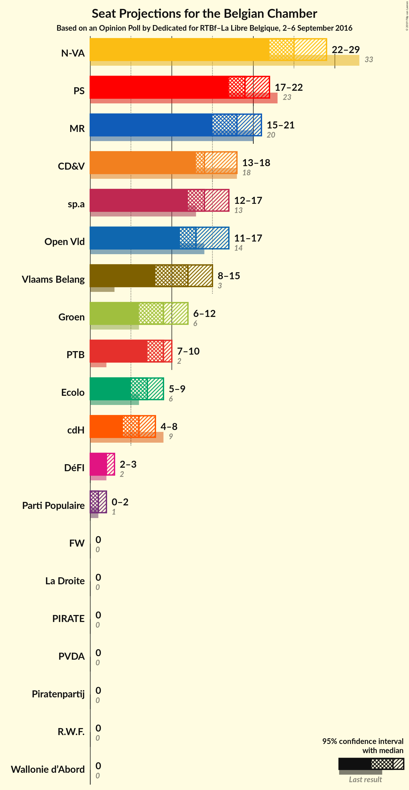
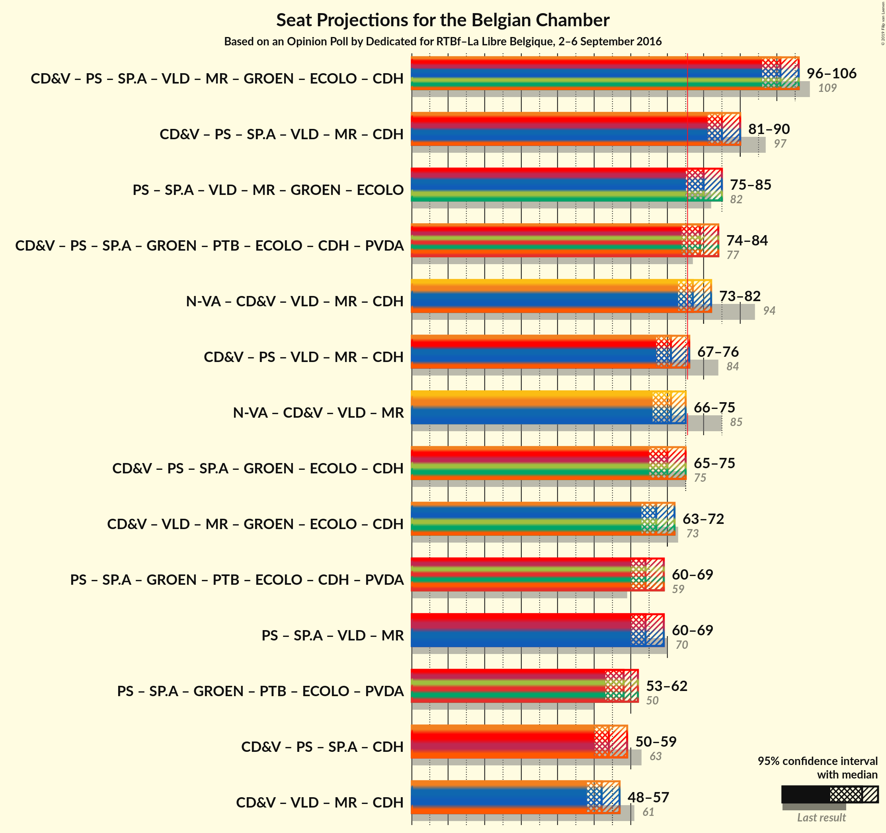

# Opinion Poll by Dedicated for RTBf–La Libre Belgique, 2–6 September 2016

<a href="#voting-intentions">Voting Intentions</a> | <a href="#seats">Seats</a> | <a href="#coalitions">Coalitions</a> | <a href="#technical-information">Technical Information</a>

## Voting Intentions

### Confidence Intervals

| Party | Last Result | Poll Result | 80% Confidence Interval | 90% Confidence Interval | 95% Confidence Interval | 99% Confidence Interval |
|:-----:|:-----------:|:-----------:|:-----------------------:|:-----------------------:|:-----------------------:|:-----------------------:|
| N-VA | 20.3% | 25.2% | 23.2–27.3% |22.7–27.8% |22.2–28.4% |21.3–29.4% |
| CD&V | 11.6% | 15.6% | 14.0–17.4% |13.6–17.9% |13.2–18.4% |12.5–19.2% |
| sp.a | 8.8% | 14.9% | 13.4–16.7% |13.0–17.2% |12.6–17.6% |11.9–18.5% |
| Open Vld | 9.8% | 14.0% | 12.5–15.8% |12.1–16.2% |11.7–16.7% |11.1–17.5% |
| Vlaams Belang | 3.7% | 13.1% | 11.6–14.8% |11.2–15.3% |10.9–15.7% |10.2–16.5% |
| Groen | 5.3% | 10.0% | 8.7–11.5% |8.3–11.9% |8.0–12.3% |7.5–13.1% |
| PVDA | 1.8% | 5.1% | 4.2–6.3% |4.0–6.6% |3.8–6.9% |3.4–7.5% |
| Piratenpartij | 0.3% | 1.4% | 1.0–2.2% |0.9–2.4% |0.8–2.6% |0.6–3.0% |

*Note:* The poll result column reflects the actual value used in the calculations. Published results may vary slightly, and in addition be rounded to fewer digits.

## Seats

### Confidence Intervals

| Party | Last Result | Median | 80% Confidence Interval | 90% Confidence Interval | 95% Confidence Interval | 99% Confidence Interval |
|:-----:|:-----------:|:------:|:-----------------------:|:-----------------------:|:-----------------------:|:-----------------------:|
| <a href="#n-va">N-VA</a> | 33 | 24 | 23–28 |22–28 |22–29 |20–30 |
| <a href="#cd&v">CD&V</a> | 18 | 14 | 13–18 |13–18 |13–18 |12–18 |
| <a href="#sp.a">sp.a</a> | 13 | 14 | 13–16 |12–17 |11–17 |10–18 |
| <a href="#open-vld">Open Vld</a> | 14 | 12 | 12–15 |11–17 |11–17 |10–17 |
| <a href="#vlaams-belang">Vlaams Belang</a> | 3 | 12 | 10–14 |8–15 |8–15 |8–15 |
| <a href="#groen">Groen</a> | 6 | 8 | 6–10 |6–11 |6–12 |5–12 |
| <a href="#pvda">PVDA</a> | 0 | 0 | 0 |0 |0 |0 |
| <a href="#piratenpartij">Piratenpartij</a> | 0 | 0 | 0 |0 |0 |0 |

### N-VA

*For a full overview of the results for this party, see the [N-VA](party-nva.html) page.*

| Number of Seats | Probability | Accumulated | Special Marks |
|:---------------:|:-----------:|:-----------:|:-------------:|
| 19 | 0.1% | 100% |  |
| 20 | 0.7% | 99.9% |  |
| 21 | 2% | 99.2% |  |
| 22 | 3% | 98% |  |
| 23 | 8% | 94% |  |
| 24 | 41% | 86% | Median |
| 25 | 13% | 45% |  |
| 26 | 11% | 32% |  |
| 27 | 9% | 21% |  |
| 28 | 8% | 12% |  |
| 29 | 2% | 4% |  |
| 30 | 1.1% | 1.3% |  |
| 31 | 0.2% | 0.2% |  |
| 32 | 0% | 0% |  |
| 33 | 0% | 0% | Last Result |

### CD&V

*For a full overview of the results for this party, see the [CD&V](party-cdv.html) page.*

| Number of Seats | Probability | Accumulated | Special Marks |
|:---------------:|:-----------:|:-----------:|:-------------:|
| 10 | 0.1% | 100% |  |
| 11 | 0.3% | 99.9% |  |
| 12 | 1.5% | 99.6% |  |
| 13 | 46% | 98% |  |
| 14 | 13% | 52% | Median |
| 15 | 11% | 39% |  |
| 16 | 10% | 28% |  |
| 17 | 6% | 18% |  |
| 18 | 12% | 12% | Last Result |
| 19 | 0.2% | 0.3% |  |
| 20 | 0% | 0% |  |

### sp.a

*For a full overview of the results for this party, see the [sp.a](party-spa.html) page.*

| Number of Seats | Probability | Accumulated | Special Marks |
|:---------------:|:-----------:|:-----------:|:-------------:|
| 9 | 0.2% | 100% |  |
| 10 | 0.7% | 99.8% |  |
| 11 | 2% | 99.1% |  |
| 12 | 4% | 97% |  |
| 13 | 43% | 94% | Last Result |
| 14 | 14% | 51% | Median |
| 15 | 26% | 37% |  |
| 16 | 4% | 11% |  |
| 17 | 4% | 6% |  |
| 18 | 2% | 2% |  |
| 19 | 0.1% | 0.2% |  |
| 20 | 0% | 0% |  |

### Open Vld

*For a full overview of the results for this party, see the [Open Vld](party-openvld.html) page.*

| Number of Seats | Probability | Accumulated | Special Marks |
|:---------------:|:-----------:|:-----------:|:-------------:|
| 8 | 0.1% | 100% |  |
| 9 | 0.1% | 99.9% |  |
| 10 | 0.3% | 99.8% |  |
| 11 | 8% | 99.5% |  |
| 12 | 44% | 92% | Median |
| 13 | 27% | 48% |  |
| 14 | 8% | 21% | Last Result |
| 15 | 5% | 13% |  |
| 16 | 2% | 8% |  |
| 17 | 5% | 5% |  |
| 18 | 0.4% | 0.4% |  |
| 19 | 0% | 0% |  |

### Vlaams Belang

*For a full overview of the results for this party, see the [Vlaams Belang](party-vlaamsbelang.html) page.*

| Number of Seats | Probability | Accumulated | Special Marks |
|:---------------:|:-----------:|:-----------:|:-------------:|
| 3 | 0% | 100% | Last Result |
| 4 | 0% | 100% |  |
| 5 | 0% | 100% |  |
| 6 | 0% | 100% |  |
| 7 | 0% | 100% |  |
| 8 | 5% | 100% |  |
| 9 | 2% | 95% |  |
| 10 | 3% | 92% |  |
| 11 | 6% | 89% |  |
| 12 | 45% | 83% | Median |
| 13 | 16% | 38% |  |
| 14 | 16% | 22% |  |
| 15 | 6% | 6% |  |
| 16 | 0.1% | 0.1% |  |
| 17 | 0% | 0% |  |

### Groen

*For a full overview of the results for this party, see the [Groen](party-groen.html) page.*

| Number of Seats | Probability | Accumulated | Special Marks |
|:---------------:|:-----------:|:-----------:|:-------------:|
| 5 | 1.2% | 100% |  |
| 6 | 15% | 98.8% | Last Result |
| 7 | 8% | 84% |  |
| 8 | 27% | 77% | Median |
| 9 | 18% | 49% |  |
| 10 | 23% | 31% |  |
| 11 | 4% | 9% |  |
| 12 | 5% | 5% |  |
| 13 | 0% | 0% |  |

### PVDA

*For a full overview of the results for this party, see the [PVDA](party-pvda.html) page.*

| Number of Seats | Probability | Accumulated | Special Marks |
|:---------------:|:-----------:|:-----------:|:-------------:|
| 0 | 100% | 100% | Last Result, Median |

### Piratenpartij

*For a full overview of the results for this party, see the [Piratenpartij](party-piratenpartij.html) page.*

| Number of Seats | Probability | Accumulated | Special Marks |
|:---------------:|:-----------:|:-----------:|:-------------:|
| 0 | 99.7% | 100% | Last Result, Median |
| 1 | 0.2% | 0.3% |  |
| 2 | 0% | 0% |  |

## Coalitions

### Confidence Intervals

| Coalition | Last Result | Median | Majority? | 80% Confidence Interval | 90% Confidence Interval | 95% Confidence Interval | 99% Confidence Interval |
|:---------:|:-----------:|:------:|:---------:|:-----------------------:|:-----------------------:|:-----------------------:|:-----------------------:|

## Technical Information

### Opinion Poll

+ **Pollster:** Dedicated
+ **Media:** RTBf–La Libre Belgique
+ **Fieldwork period:** 2–6 September 2016

### Calculations

+ **Sample size:** 763
+ **Simulations done:** 2,097,152
+ **Error estimate:** 1.94%

