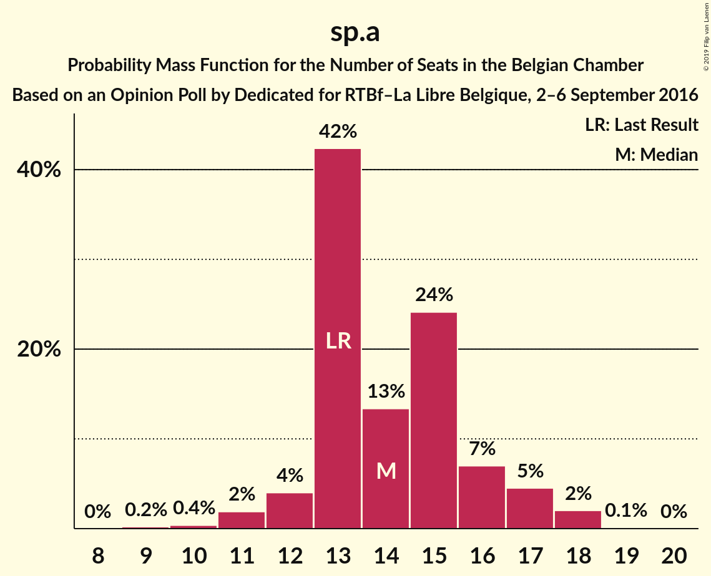
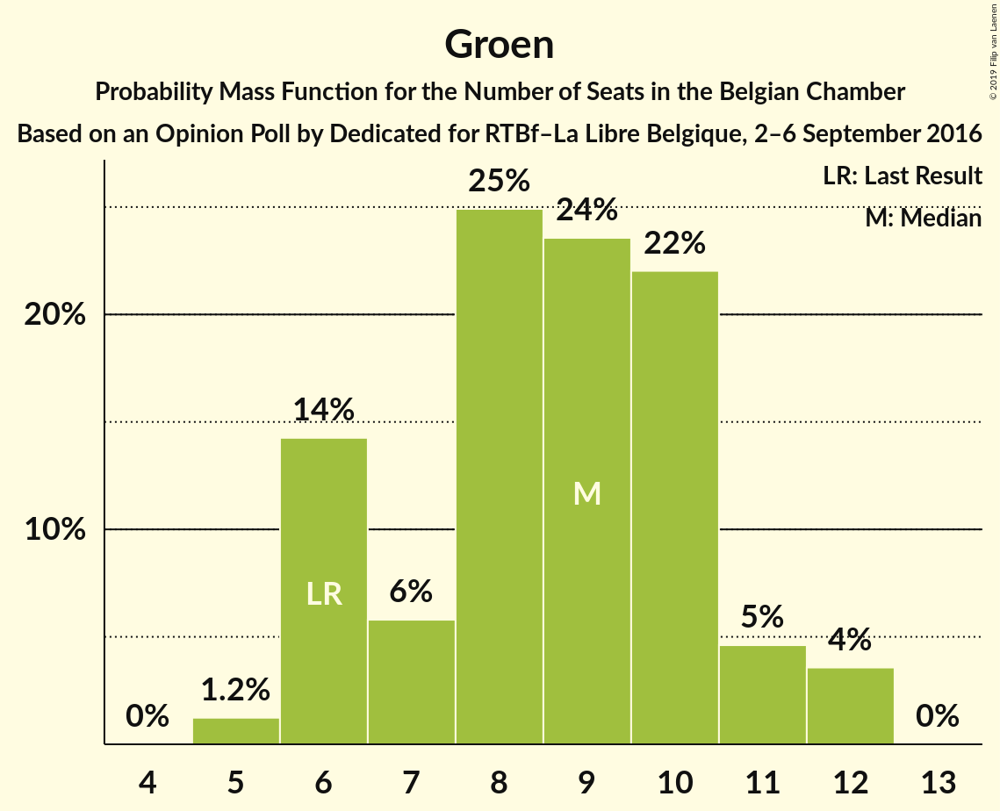

# Opinion Poll by Dedicated for RTBf–La Libre Belgique, 2–6 September 2016

Areas included: Flanders, Wallonia

<a href="#voting-intentions">Voting Intentions</a> | <a href="#seats">Seats</a> | <a href="#coalitions">Coalitions</a> | <a href="#technical-information">Technical Information</a>

## Voting Intentions

### Confidence Intervals

| Party | Last Result | Poll Result | 80% Confidence Interval | 90% Confidence Interval | 95% Confidence Interval | 99% Confidence Interval |
|:-----:|:-----------:|:-----------:|:-----------------------:|:-----------------------:|:-----------------------:|:-----------------------:|
| N-VA | 20.3% | 16.8% | 23.2–27.3% |22.7–27.8% |22.2–28.4% |21.3–29.4% |
| CD&V | 11.6% | 10.4% | 14.0–17.4% |13.6–17.9% |13.2–18.4% |12.5–19.2% |
| sp.a | 8.8% | 10.0% | 13.4–16.7% |13.0–17.2% |12.6–17.6% |11.9–18.5% |
| Open Vld | 9.8% | 9.4% | 12.5–15.8% |12.1–16.2% |11.7–16.7% |11.1–17.5% |
| Vlaams Belang | 3.7% | 8.7% | 11.6–14.8% |11.2–15.3% |10.9–15.7% |10.2–16.5% |
| PS | 11.7% | 8.5% | N/A |N/A |N/A |N/A |
| MR | 9.6% | 7.8% | N/A |N/A |N/A |N/A |
| Groen | 5.3% | 6.6% | 8.7–11.5% |8.3–11.9% |8.0–12.3% |7.5–13.1% |
| PTB | 2.0% | 4.9% | N/A |N/A |N/A |N/A |
| cdH | 5.0% | 3.5% | N/A |N/A |N/A |N/A |
| PVDA | 1.8% | 3.4% | 4.2–6.3% |4.0–6.6% |3.8–6.9% |3.4–7.5% |
| Ecolo | 3.3% | 3.1% | N/A |N/A |N/A |N/A |
| Parti Populaire | 1.5% | 1.7% | N/A |N/A |N/A |N/A |
| DéFI | 1.8% | 1.3% | N/A |N/A |N/A |N/A |
| Piratenpartij | 0.3% | 1.0% | 1.0–2.2% |0.9–2.4% |0.8–2.6% |0.6–3.0% |
| La Droite | 0.4% | 0.9% | N/A |N/A |N/A |N/A |
| Wallonie d’Abord | 0.2% | 0.4% | N/A |N/A |N/A |N/A |
| PIRATE | 0.1% | 0.3% | N/A |N/A |N/A |N/A |
| FW | 0.1% | 0.3% | N/A |N/A |N/A |N/A |
| R.W.F. | 0.1% | 0.2% | N/A |N/A |N/A |N/A |

*Note:* The poll result column reflects the actual value used in the calculations. Published results may vary slightly, and in addition be rounded to fewer digits.

## Seats

### Confidence Intervals

| Party | Last Result | Median | 80% Confidence Interval | 90% Confidence Interval | 95% Confidence Interval | 99% Confidence Interval |
|:-----:|:-----------:|:------:|:-----------------------:|:-----------------------:|:-----------------------:|:-----------------------:|
| <a href="#n-va">N-VA</a> | 33 | 24 | 24–27 |23–28 |22–29 |20–30 |
| <a href="#cd&v">CD&V</a> | 18 | 14 | 13–17 |13–18 |13–18 |12–18 |
| <a href="#sp.a">sp.a</a> | 13 | 14 | 13–16 |12–17 |12–17 |10–18 |
| <a href="#open-vld">Open Vld</a> | 14 | 12 | 12–15 |11–16 |11–17 |10–17 |
| <a href="#vlaams-belang">Vlaams Belang</a> | 3 | 12 | 10–14 |8–14 |8–15 |8–15 |
| <a href="#ps">PS</a> | 23 | 15 | 15–16 |15–16 |15–16 |13–16 |
| <a href="#mr">MR</a> | 20 | 12 | 12–14 |12–14 |12–15 |10–15 |
| <a href="#groen">Groen</a> | 6 | 9 | 6–11 |6–11 |6–12 |5–12 |
| <a href="#ptb">PTB</a> | 2 | 8 | 8 |8 |7–8 |6–8 |
| <a href="#cdh">cdH</a> | 9 | 8 | 5–8 |5–8 |4–8 |3–8 |
| <a href="#pvda">PVDA</a> | 0 | 0 | 0 |0 |0 |0 |
| <a href="#ecolo">Ecolo</a> | 6 | 5 | 3–5 |3–5 |0–5 |0–7 |
| <a href="#parti-populaire">Parti Populaire</a> | 1 | 0 | 0–2 |0–2 |0–2 |0–4 |
| <a href="#défi">DéFI</a> | 2 | 0 | 0 |0 |0–2 |0–2 |
| <a href="#piratenpartij">Piratenpartij</a> | 0 | 0 | 0 |0 |0 |0 |
| <a href="#la-droite">La Droite</a> | 0 | 0 | 0 |0 |0–2 |0–2 |
| <a href="#wallonie-d’abord">Wallonie d’Abord</a> | 0 | 0 | 0 |0 |0 |0–1 |
| <a href="#pirate">PIRATE</a> | 0 | 0 | 0 |0 |0 |0 |
| <a href="#fw">FW</a> | 0 | 0 | 0 |0 |0 |0 |
| <a href="#r.w.f.">R.W.F.</a> | 0 | 0 | 0 |0 |0 |0 |

### N-VA

*For a full overview of the results for this party, see the [N-VA](party-nva.html) page.*

| Number of Seats | Probability | Accumulated | Special Marks |
|:---------------:|:-----------:|:-----------:|:-------------:|
| 19 | 0% | 100% |  |
| 20 | 0.7% | 99.9% |  |
| 21 | 1.4% | 99.3% |  |
| 22 | 2% | 98% |  |
| 23 | 5% | 96% |  |
| 24 | 42% | 90% | Median |
| 25 | 11% | 48% |  |
| 26 | 17% | 37% |  |
| 27 | 11% | 20% |  |
| 28 | 6% | 9% |  |
| 29 | 1.4% | 3% |  |
| 30 | 2% | 2% |  |
| 31 | 0.1% | 0.1% |  |
| 32 | 0% | 0% |  |
| 33 | 0% | 0% | Last Result |

### CD&V

*For a full overview of the results for this party, see the [CD&V](party-cdv.html) page.*

| Number of Seats | Probability | Accumulated | Special Marks |
|:---------------:|:-----------:|:-----------:|:-------------:|
| 10 | 0.1% | 100% |  |
| 11 | 0.3% | 99.9% |  |
| 12 | 0.9% | 99.6% |  |
| 13 | 44% | 98.7% |  |
| 14 | 13% | 55% | Median |
| 15 | 15% | 42% |  |
| 16 | 8% | 27% |  |
| 17 | 11% | 20% |  |
| 18 | 8% | 9% | Last Result |
| 19 | 0.2% | 0.2% |  |
| 20 | 0% | 0% |  |

### sp.a

*For a full overview of the results for this party, see the [sp.a](party-spa.html) page.*

| Number of Seats | Probability | Accumulated | Special Marks |
|:---------------:|:-----------:|:-----------:|:-------------:|
| 9 | 0.2% | 100% |  |
| 10 | 0.4% | 99.8% |  |
| 11 | 2% | 99.4% |  |
| 12 | 4% | 98% |  |
| 13 | 42% | 93% | Last Result |
| 14 | 12% | 51% | Median |
| 15 | 26% | 39% |  |
| 16 | 7% | 13% |  |
| 17 | 4% | 6% |  |
| 18 | 2% | 2% |  |
| 19 | 0.1% | 0.1% |  |
| 20 | 0% | 0% |  |

### Open Vld

*For a full overview of the results for this party, see the [Open Vld](party-openvld.html) page.*

| Number of Seats | Probability | Accumulated | Special Marks |
|:---------------:|:-----------:|:-----------:|:-------------:|
| 8 | 0.1% | 100% |  |
| 9 | 0.1% | 99.9% |  |
| 10 | 0.4% | 99.8% |  |
| 11 | 8% | 99.5% |  |
| 12 | 44% | 92% | Median |
| 13 | 31% | 47% |  |
| 14 | 4% | 16% | Last Result |
| 15 | 3% | 12% |  |
| 16 | 5% | 9% |  |
| 17 | 4% | 4% |  |
| 18 | 0.3% | 0.3% |  |
| 19 | 0% | 0% |  |

### Vlaams Belang

*For a full overview of the results for this party, see the [Vlaams Belang](party-vlaamsbelang.html) page.*

| Number of Seats | Probability | Accumulated | Special Marks |
|:---------------:|:-----------:|:-----------:|:-------------:|
| 3 | 0% | 100% | Last Result |
| 4 | 0% | 100% |  |
| 5 | 0% | 100% |  |
| 6 | 0% | 100% |  |
| 7 | 0% | 100% |  |
| 8 | 6% | 100% |  |
| 9 | 2% | 94% |  |
| 10 | 3% | 92% |  |
| 11 | 9% | 89% |  |
| 12 | 48% | 80% | Median |
| 13 | 16% | 32% |  |
| 14 | 12% | 16% |  |
| 15 | 3% | 4% |  |
| 16 | 0.1% | 0.2% |  |
| 17 | 0% | 0% |  |

### PS

*For a full overview of the results for this party, see the [PS](party-ps.html) page.*

| Number of Seats | Probability | Accumulated | Special Marks |
|:---------------:|:-----------:|:-----------:|:-------------:|
| 13 | 1.0% | 100% |  |
| 14 | 1.0% | 98.9% |  |
| 15 | 83% | 98% | Median |
| 16 | 14% | 14% |  |
| 17 | 0.1% | 0.4% |  |
| 18 | 0.3% | 0.3% |  |
| 19 | 0% | 0% |  |
| 20 | 0% | 0% |  |
| 21 | 0% | 0% |  |
| 22 | 0% | 0% |  |
| 23 | 0% | 0% | Last Result |

### MR

*For a full overview of the results for this party, see the [MR](party-mr.html) page.*

| Number of Seats | Probability | Accumulated | Special Marks |
|:---------------:|:-----------:|:-----------:|:-------------:|
| 10 | 0.6% | 100% |  |
| 11 | 0.4% | 99.4% |  |
| 12 | 79% | 99.1% | Median |
| 13 | 3% | 20% |  |
| 14 | 13% | 17% |  |
| 15 | 4% | 4% |  |
| 16 | 0% | 0.1% |  |
| 17 | 0.1% | 0.1% |  |
| 18 | 0% | 0% |  |
| 19 | 0% | 0% |  |
| 20 | 0% | 0% | Last Result |

### Groen

*For a full overview of the results for this party, see the [Groen](party-groen.html) page.*

| Number of Seats | Probability | Accumulated | Special Marks |
|:---------------:|:-----------:|:-----------:|:-------------:|
| 5 | 1.5% | 100% |  |
| 6 | 16% | 98.5% | Last Result |
| 7 | 6% | 83% |  |
| 8 | 22% | 77% |  |
| 9 | 24% | 55% | Median |
| 10 | 20% | 31% |  |
| 11 | 6% | 10% |  |
| 12 | 4% | 4% |  |
| 13 | 0% | 0% |  |

### PTB

*For a full overview of the results for this party, see the [PTB](party-ptb.html) page.*

| Number of Seats | Probability | Accumulated | Special Marks |
|:---------------:|:-----------:|:-----------:|:-------------:|
| 2 | 0% | 100% | Last Result |
| 3 | 0% | 100% |  |
| 4 | 0.1% | 100% |  |
| 5 | 0% | 99.9% |  |
| 6 | 0.5% | 99.9% |  |
| 7 | 3% | 99.3% |  |
| 8 | 96% | 97% | Median |
| 9 | 0% | 0.3% |  |
| 10 | 0% | 0.3% |  |
| 11 | 0.2% | 0.3% |  |
| 12 | 0.1% | 0.1% |  |
| 13 | 0% | 0% |  |

### cdH

*For a full overview of the results for this party, see the [cdH](party-cdh.html) page.*

| Number of Seats | Probability | Accumulated | Special Marks |
|:---------------:|:-----------:|:-----------:|:-------------:|
| 3 | 1.1% | 100% |  |
| 4 | 3% | 98.9% |  |
| 5 | 10% | 96% |  |
| 6 | 2% | 86% |  |
| 7 | 4% | 84% |  |
| 8 | 80% | 80% | Median |
| 9 | 0% | 0% | Last Result |

### PVDA

*For a full overview of the results for this party, see the [PVDA](party-pvda.html) page.*

| Number of Seats | Probability | Accumulated | Special Marks |
|:---------------:|:-----------:|:-----------:|:-------------:|
| 0 | 100% | 100% | Last Result, Median |

### Ecolo

*For a full overview of the results for this party, see the [Ecolo](party-ecolo.html) page.*

| Number of Seats | Probability | Accumulated | Special Marks |
|:---------------:|:-----------:|:-----------:|:-------------:|
| 0 | 3% | 100% |  |
| 1 | 0% | 97% |  |
| 2 | 0% | 97% |  |
| 3 | 14% | 97% |  |
| 4 | 1.5% | 82% |  |
| 5 | 80% | 81% | Median |
| 6 | 0.1% | 1.1% | Last Result |
| 7 | 1.0% | 1.0% |  |
| 8 | 0% | 0% |  |

### Parti Populaire

*For a full overview of the results for this party, see the [Parti Populaire](party-partipopulaire.html) page.*

| Number of Seats | Probability | Accumulated | Special Marks |
|:---------------:|:-----------:|:-----------:|:-------------:|
| 0 | 83% | 100% | Median |
| 1 | 1.0% | 17% | Last Result |
| 2 | 15% | 16% |  |
| 3 | 0% | 2% |  |
| 4 | 1.5% | 1.5% |  |
| 5 | 0% | 0% |  |

### DéFI

*For a full overview of the results for this party, see the [DéFI](party-dfi.html) page.*

| Number of Seats | Probability | Accumulated | Special Marks |
|:---------------:|:-----------:|:-----------:|:-------------:|
| 0 | 96% | 100% | Median |
| 1 | 1.0% | 4% |  |
| 2 | 3% | 3% | Last Result |
| 3 | 0% | 0% |  |

### Piratenpartij

*For a full overview of the results for this party, see the [Piratenpartij](party-piratenpartij.html) page.*

| Number of Seats | Probability | Accumulated | Special Marks |
|:---------------:|:-----------:|:-----------:|:-------------:|
| 0 | 99.8% | 100% | Last Result, Median |
| 1 | 0.2% | 0.2% |  |
| 2 | 0% | 0% |  |

### La Droite

*For a full overview of the results for this party, see the [La Droite](party-ladroite.html) page.*

| Number of Seats | Probability | Accumulated | Special Marks |
|:---------------:|:-----------:|:-----------:|:-------------:|
| 0 | 97% | 100% | Last Result, Median |
| 1 | 0.4% | 3% |  |
| 2 | 3% | 3% |  |
| 3 | 0% | 0% |  |

### Wallonie d’Abord

*For a full overview of the results for this party, see the [Wallonie d’Abord](party-walloniedabord.html) page.*

| Number of Seats | Probability | Accumulated | Special Marks |
|:---------------:|:-----------:|:-----------:|:-------------:|
| 0 | 98% | 100% | Last Result, Median |
| 1 | 2% | 2% |  |
| 2 | 0% | 0% |  |

### PIRATE

*For a full overview of the results for this party, see the [PIRATE](party-pirate.html) page.*

| Number of Seats | Probability | Accumulated | Special Marks |
|:---------------:|:-----------:|:-----------:|:-------------:|
| 0 | 100% | 100% | Last Result, Median |

### FW

*For a full overview of the results for this party, see the [FW](party-fw.html) page.*

| Number of Seats | Probability | Accumulated | Special Marks |
|:---------------:|:-----------:|:-----------:|:-------------:|
| 0 | 100% | 100% | Last Result, Median |

### R.W.F.

*For a full overview of the results for this party, see the [R.W.F.](party-rwf.html) page.*

| Number of Seats | Probability | Accumulated | Special Marks |
|:---------------:|:-----------:|:-----------:|:-------------:|
| 0 | 100% | 100% | Last Result, Median |

## Coalitions

### Confidence Intervals

| Coalition | Last Result | Median | Majority? | 80% Confidence Interval | 90% Confidence Interval | 95% Confidence Interval | 99% Confidence Interval |
|:---------:|:-----------:|:------:|:---------:|:-----------------------:|:-----------------------:|:-----------------------:|:-----------------------:|
| CD&V – sp.a – Open Vld – PS – MR – Groen – cdH – Ecolo | 109 | 90 | 100% | 87–92 | 86–93 | 85–94 | 83–95 |
| CD&V – sp.a – Open Vld – PS – MR – cdH | 97 | 76 | 62% | 73–79 | 73–80 | 72–81 | 70–83 |
| CD&V – sp.a – PS – Groen – PTB – cdH – PVDA – Ecolo | 77 | 73 | 8% | 68–75 | 67–76 | 66–77 | 64–79 |
| N-VA – CD&V – Open Vld – MR – cdH | 94 | 72 | 7% | 69–75 | 69–76 | 68–76 | 66–78 |
| sp.a – Open Vld – PS – MR – Groen – Ecolo | 82 | 68 | 0.1% | 65–70 | 64–71 | 63–72 | 62–74 |
| N-VA – CD&V – Open Vld – MR | 85 | 65 | 0% | 62–68 | 61–69 | 61–70 | 59–71 |
| CD&V – sp.a – PS – Groen – cdH – Ecolo | 75 | 65 | 0% | 60–67 | 59–68 | 58–69 | 56–71 |
| CD&V – Open Vld – PS – MR – cdH | 84 | 62 | 0% | 60–65 | 59–66 | 59–67 | 57–68 |
| sp.a – PS – Groen – PTB – cdH – PVDA – Ecolo | 59 | 58 | 0% | 54–61 | 53–62 | 52–62 | 50–63 |
| sp.a – Open Vld – PS – MR | 70 | 54 | 0% | 52–57 | 51–58 | 51–60 | 49–61 |
| CD&V – sp.a – PS – cdH | 63 | 51 | 0% | 49–54 | 47–54 | 47–55 | 45–57 |
| sp.a – PS – Groen – PTB – PVDA – Ecolo | 50 | 50 | 0% | 47–53 | 47–54 | 46–54 | 44–55 |
| CD&V – Open Vld – MR – cdH | 61 | 47 | 0% | 45–50 | 44–51 | 44–52 | 42–53 |
| CD&V – Open Vld – MR – Groen – cdH – Ecolo | 73 | 25 | 0% | 22–25 | 22–25 | 21–25 | 21–26 |

### CD&V – sp.a – Open Vld – PS – MR – Groen – cdH – Ecolo

| Number of Seats | Probability | Accumulated | Special Marks |
|:---------------:|:-----------:|:-----------:|:-------------:|
| 81 | 0.1% | 100% |  |
| 82 | 0.2% | 99.9% |  |
| 83 | 0.5% | 99.8% |  |
| 84 | 1.1% | 99.2% |  |
| 85 | 3% | 98% |  |
| 86 | 5% | 95% |  |
| 87 | 9% | 90% |  |
| 88 | 12% | 81% |  |
| 89 | 17% | 69% | Median |
| 90 | 18% | 52% |  |
| 91 | 22% | 34% |  |
| 92 | 5% | 12% |  |
| 93 | 4% | 8% |  |
| 94 | 2% | 4% |  |
| 95 | 1.4% | 2% |  |
| 96 | 0.3% | 0.4% |  |
| 97 | 0.1% | 0.1% |  |
| 98 | 0% | 0% |  |
| 99 | 0% | 0% |  |
| 100 | 0% | 0% |  |
| 101 | 0% | 0% |  |
| 102 | 0% | 0% |  |
| 103 | 0% | 0% |  |
| 104 | 0% | 0% |  |
| 105 | 0% | 0% |  |
| 106 | 0% | 0% |  |
| 107 | 0% | 0% |  |
| 108 | 0% | 0% |  |
| 109 | 0% | 0% | Last Result |

### CD&V – sp.a – Open Vld – PS – MR – cdH

| Number of Seats | Probability | Accumulated | Special Marks |
|:---------------:|:-----------:|:-----------:|:-------------:|
| 68 | 0.1% | 100% |  |
| 69 | 0.2% | 99.9% |  |
| 70 | 0.4% | 99.7% |  |
| 71 | 0.6% | 99.3% |  |
| 72 | 2% | 98.8% |  |
| 73 | 8% | 96% |  |
| 74 | 10% | 89% |  |
| 75 | 17% | 79% | Median |
| 76 | 13% | 62% | Majority |
| 77 | 20% | 49% |  |
| 78 | 15% | 29% |  |
| 79 | 4% | 13% |  |
| 80 | 5% | 9% |  |
| 81 | 2% | 4% |  |
| 82 | 1.2% | 2% |  |
| 83 | 0.4% | 0.6% |  |
| 84 | 0.1% | 0.2% |  |
| 85 | 0.1% | 0.1% |  |
| 86 | 0% | 0% |  |
| 87 | 0% | 0% |  |
| 88 | 0% | 0% |  |
| 89 | 0% | 0% |  |
| 90 | 0% | 0% |  |
| 91 | 0% | 0% |  |
| 92 | 0% | 0% |  |
| 93 | 0% | 0% |  |
| 94 | 0% | 0% |  |
| 95 | 0% | 0% |  |
| 96 | 0% | 0% |  |
| 97 | 0% | 0% | Last Result |

### CD&V – sp.a – PS – Groen – PTB – cdH – PVDA – Ecolo

| Number of Seats | Probability | Accumulated | Special Marks |
|:---------------:|:-----------:|:-----------:|:-------------:|
| 62 | 0.1% | 100% |  |
| 63 | 0.2% | 99.9% |  |
| 64 | 0.5% | 99.8% |  |
| 65 | 1.0% | 99.3% |  |
| 66 | 2% | 98% |  |
| 67 | 3% | 97% |  |
| 68 | 4% | 94% |  |
| 69 | 6% | 89% |  |
| 70 | 7% | 83% |  |
| 71 | 11% | 76% |  |
| 72 | 15% | 65% |  |
| 73 | 16% | 50% | Median |
| 74 | 12% | 34% |  |
| 75 | 14% | 22% |  |
| 76 | 4% | 8% | Majority |
| 77 | 2% | 4% | Last Result |
| 78 | 0.8% | 1.4% |  |
| 79 | 0.5% | 0.6% |  |
| 80 | 0.1% | 0.1% |  |
| 81 | 0% | 0% |  |

### N-VA – CD&V – Open Vld – MR – cdH

| Number of Seats | Probability | Accumulated | Special Marks |
|:---------------:|:-----------:|:-----------:|:-------------:|
| 65 | 0.1% | 100% |  |
| 66 | 0.5% | 99.8% |  |
| 67 | 0.9% | 99.4% |  |
| 68 | 2% | 98% |  |
| 69 | 7% | 96% |  |
| 70 | 14% | 90% | Median |
| 71 | 15% | 76% |  |
| 72 | 17% | 60% |  |
| 73 | 16% | 44% |  |
| 74 | 12% | 28% |  |
| 75 | 9% | 16% |  |
| 76 | 5% | 7% | Majority |
| 77 | 1.2% | 2% |  |
| 78 | 0.8% | 1.2% |  |
| 79 | 0.3% | 0.5% |  |
| 80 | 0.1% | 0.2% |  |
| 81 | 0% | 0% |  |
| 82 | 0% | 0% |  |
| 83 | 0% | 0% |  |
| 84 | 0% | 0% |  |
| 85 | 0% | 0% |  |
| 86 | 0% | 0% |  |
| 87 | 0% | 0% |  |
| 88 | 0% | 0% |  |
| 89 | 0% | 0% |  |
| 90 | 0% | 0% |  |
| 91 | 0% | 0% |  |
| 92 | 0% | 0% |  |
| 93 | 0% | 0% |  |
| 94 | 0% | 0% | Last Result |

### sp.a – Open Vld – PS – MR – Groen – Ecolo

| Number of Seats | Probability | Accumulated | Special Marks |
|:---------------:|:-----------:|:-----------:|:-------------:|
| 61 | 0.1% | 100% |  |
| 62 | 0.6% | 99.8% |  |
| 63 | 3% | 99.2% |  |
| 64 | 5% | 96% |  |
| 65 | 10% | 92% |  |
| 66 | 15% | 81% |  |
| 67 | 16% | 66% | Median |
| 68 | 20% | 50% |  |
| 69 | 11% | 30% |  |
| 70 | 12% | 19% |  |
| 71 | 4% | 7% |  |
| 72 | 2% | 3% |  |
| 73 | 1.0% | 1.5% |  |
| 74 | 0.3% | 0.5% |  |
| 75 | 0.2% | 0.2% |  |
| 76 | 0% | 0.1% | Majority |
| 77 | 0% | 0% |  |
| 78 | 0% | 0% |  |
| 79 | 0% | 0% |  |
| 80 | 0% | 0% |  |
| 81 | 0% | 0% |  |
| 82 | 0% | 0% | Last Result |

### N-VA – CD&V – Open Vld – MR

| Number of Seats | Probability | Accumulated | Special Marks |
|:---------------:|:-----------:|:-----------:|:-------------:|
| 58 | 0.2% | 100% |  |
| 59 | 0.5% | 99.8% |  |
| 60 | 0.9% | 99.3% |  |
| 61 | 5% | 98% |  |
| 62 | 12% | 94% | Median |
| 63 | 14% | 82% |  |
| 64 | 16% | 68% |  |
| 65 | 16% | 52% |  |
| 66 | 13% | 36% |  |
| 67 | 11% | 23% |  |
| 68 | 7% | 12% |  |
| 69 | 3% | 5% |  |
| 70 | 2% | 3% |  |
| 71 | 0.6% | 1.0% |  |
| 72 | 0.2% | 0.4% |  |
| 73 | 0.1% | 0.1% |  |
| 74 | 0% | 0% |  |
| 75 | 0% | 0% |  |
| 76 | 0% | 0% | Majority |
| 77 | 0% | 0% |  |
| 78 | 0% | 0% |  |
| 79 | 0% | 0% |  |
| 80 | 0% | 0% |  |
| 81 | 0% | 0% |  |
| 82 | 0% | 0% |  |
| 83 | 0% | 0% |  |
| 84 | 0% | 0% |  |
| 85 | 0% | 0% | Last Result |

### CD&V – sp.a – PS – Groen – cdH – Ecolo

| Number of Seats | Probability | Accumulated | Special Marks |
|:---------------:|:-----------:|:-----------:|:-------------:|
| 54 | 0% | 100% |  |
| 55 | 0.2% | 99.9% |  |
| 56 | 0.4% | 99.8% |  |
| 57 | 0.9% | 99.4% |  |
| 58 | 2% | 98% |  |
| 59 | 3% | 97% |  |
| 60 | 4% | 94% |  |
| 61 | 6% | 90% |  |
| 62 | 7% | 84% |  |
| 63 | 11% | 76% |  |
| 64 | 15% | 65% |  |
| 65 | 16% | 51% | Median |
| 66 | 12% | 34% |  |
| 67 | 14% | 22% |  |
| 68 | 4% | 8% |  |
| 69 | 2% | 4% |  |
| 70 | 0.8% | 1.4% |  |
| 71 | 0.5% | 0.6% |  |
| 72 | 0.1% | 0.1% |  |
| 73 | 0% | 0% |  |
| 74 | 0% | 0% |  |
| 75 | 0% | 0% | Last Result |

### CD&V – Open Vld – PS – MR – cdH

| Number of Seats | Probability | Accumulated | Special Marks |
|:---------------:|:-----------:|:-----------:|:-------------:|
| 55 | 0.2% | 100% |  |
| 56 | 0.3% | 99.8% |  |
| 57 | 0.3% | 99.5% |  |
| 58 | 0.9% | 99.2% |  |
| 59 | 4% | 98% |  |
| 60 | 17% | 94% |  |
| 61 | 20% | 77% | Median |
| 62 | 15% | 58% |  |
| 63 | 13% | 42% |  |
| 64 | 12% | 30% |  |
| 65 | 10% | 17% |  |
| 66 | 4% | 8% |  |
| 67 | 2% | 3% |  |
| 68 | 0.7% | 1.1% |  |
| 69 | 0.3% | 0.4% |  |
| 70 | 0.1% | 0.2% |  |
| 71 | 0% | 0% |  |
| 72 | 0% | 0% |  |
| 73 | 0% | 0% |  |
| 74 | 0% | 0% |  |
| 75 | 0% | 0% |  |
| 76 | 0% | 0% | Majority |
| 77 | 0% | 0% |  |
| 78 | 0% | 0% |  |
| 79 | 0% | 0% |  |
| 80 | 0% | 0% |  |
| 81 | 0% | 0% |  |
| 82 | 0% | 0% |  |
| 83 | 0% | 0% |  |
| 84 | 0% | 0% | Last Result |

### sp.a – PS – Groen – PTB – cdH – PVDA – Ecolo

| Number of Seats | Probability | Accumulated | Special Marks |
|:---------------:|:-----------:|:-----------:|:-------------:|
| 48 | 0% | 100% |  |
| 49 | 0.2% | 99.9% |  |
| 50 | 0.6% | 99.7% |  |
| 51 | 1.5% | 99.1% |  |
| 52 | 2% | 98% |  |
| 53 | 3% | 96% |  |
| 54 | 4% | 92% |  |
| 55 | 9% | 88% |  |
| 56 | 8% | 79% |  |
| 57 | 14% | 71% |  |
| 58 | 13% | 57% |  |
| 59 | 20% | 45% | Last Result, Median |
| 60 | 13% | 25% |  |
| 61 | 6% | 12% |  |
| 62 | 4% | 6% |  |
| 63 | 1.3% | 2% |  |
| 64 | 0.3% | 0.4% |  |
| 65 | 0.1% | 0.1% |  |
| 66 | 0% | 0% |  |

### sp.a – Open Vld – PS – MR

| Number of Seats | Probability | Accumulated | Special Marks |
|:---------------:|:-----------:|:-----------:|:-------------:|
| 48 | 0.1% | 100% |  |
| 49 | 0.5% | 99.9% |  |
| 50 | 0.6% | 99.4% |  |
| 51 | 5% | 98.8% |  |
| 52 | 22% | 94% |  |
| 53 | 12% | 72% | Median |
| 54 | 15% | 59% |  |
| 55 | 15% | 44% |  |
| 56 | 12% | 30% |  |
| 57 | 10% | 18% |  |
| 58 | 4% | 8% |  |
| 59 | 2% | 5% |  |
| 60 | 2% | 3% |  |
| 61 | 0.6% | 0.9% |  |
| 62 | 0.1% | 0.3% |  |
| 63 | 0.1% | 0.2% |  |
| 64 | 0% | 0.1% |  |
| 65 | 0% | 0% |  |
| 66 | 0% | 0% |  |
| 67 | 0% | 0% |  |
| 68 | 0% | 0% |  |
| 69 | 0% | 0% |  |
| 70 | 0% | 0% | Last Result |

### CD&V – sp.a – PS – cdH

| Number of Seats | Probability | Accumulated | Special Marks |
|:---------------:|:-----------:|:-----------:|:-------------:|
| 43 | 0.2% | 100% |  |
| 44 | 0.2% | 99.8% |  |
| 45 | 0.8% | 99.5% |  |
| 46 | 1.1% | 98.8% |  |
| 47 | 3% | 98% |  |
| 48 | 4% | 95% |  |
| 49 | 15% | 91% |  |
| 50 | 14% | 76% |  |
| 51 | 20% | 62% | Median |
| 52 | 13% | 41% |  |
| 53 | 16% | 29% |  |
| 54 | 8% | 13% |  |
| 55 | 2% | 5% |  |
| 56 | 1.3% | 2% |  |
| 57 | 1.0% | 1.1% |  |
| 58 | 0.1% | 0.2% |  |
| 59 | 0% | 0% |  |
| 60 | 0% | 0% |  |
| 61 | 0% | 0% |  |
| 62 | 0% | 0% |  |
| 63 | 0% | 0% | Last Result |

### sp.a – PS – Groen – PTB – PVDA – Ecolo

| Number of Seats | Probability | Accumulated | Special Marks |
|:---------------:|:-----------:|:-----------:|:-------------:|
| 43 | 0.2% | 100% |  |
| 44 | 0.4% | 99.7% |  |
| 45 | 1.1% | 99.3% |  |
| 46 | 2% | 98% |  |
| 47 | 7% | 96% |  |
| 48 | 8% | 88% |  |
| 49 | 16% | 80% |  |
| 50 | 15% | 65% | Last Result |
| 51 | 22% | 49% | Median |
| 52 | 14% | 28% |  |
| 53 | 7% | 13% |  |
| 54 | 4% | 6% |  |
| 55 | 1.4% | 2% |  |
| 56 | 0.3% | 0.4% |  |
| 57 | 0.1% | 0.1% |  |
| 58 | 0% | 0% |  |

### CD&V – Open Vld – MR – cdH

| Number of Seats | Probability | Accumulated | Special Marks |
|:---------------:|:-----------:|:-----------:|:-------------:|
| 40 | 0% | 100% |  |
| 41 | 0.3% | 99.9% |  |
| 42 | 0.5% | 99.7% |  |
| 43 | 1.4% | 99.2% |  |
| 44 | 5% | 98% |  |
| 45 | 17% | 92% |  |
| 46 | 19% | 75% | Median |
| 47 | 15% | 56% |  |
| 48 | 13% | 41% |  |
| 49 | 12% | 28% |  |
| 50 | 9% | 16% |  |
| 51 | 4% | 7% |  |
| 52 | 2% | 3% |  |
| 53 | 0.5% | 0.8% |  |
| 54 | 0.2% | 0.3% |  |
| 55 | 0.1% | 0.1% |  |
| 56 | 0% | 0% |  |
| 57 | 0% | 0% |  |
| 58 | 0% | 0% |  |
| 59 | 0% | 0% |  |
| 60 | 0% | 0% |  |
| 61 | 0% | 0% | Last Result |

### CD&V – Open Vld – MR – Groen – cdH – Ecolo

| Number of Seats | Probability | Accumulated | Special Marks |
|:---------------:|:-----------:|:-----------:|:-------------:|
| 19 | 0.2% | 100% |  |
| 20 | 0% | 99.8% |  |
| 21 | 3% | 99.8% |  |
| 22 | 15% | 97% |  |
| 23 | 1.4% | 82% |  |
| 24 | 0% | 80% |  |
| 25 | 79% | 80% |  |
| 26 | 1.1% | 1.1% |  |
| 27 | 0% | 0% |  |
| 28 | 0% | 0% |  |
| 29 | 0% | 0% |  |
| 30 | 0% | 0% |  |
| 31 | 0% | 0% |  |
| 32 | 0% | 0% |  |
| 33 | 0% | 0% |  |
| 34 | 0% | 0% |  |
| 35 | 0% | 0% |  |
| 36 | 0% | 0% |  |
| 37 | 0% | 0% |  |
| 38 | 0% | 0% |  |
| 39 | 0% | 0% |  |
| 40 | 0% | 0% |  |
| 41 | 0% | 0% |  |
| 42 | 0% | 0% |  |
| 43 | 0% | 0% |  |
| 44 | 0% | 0% |  |
| 45 | 0% | 0% |  |
| 46 | 0% | 0% |  |
| 47 | 0% | 0% |  |
| 48 | 0% | 0% |  |
| 49 | 0% | 0% |  |
| 50 | 0% | 0% |  |
| 51 | 0% | 0% |  |
| 52 | 0% | 0% |  |
| 53 | 0% | 0% |  |
| 54 | 0% | 0% |  |
| 55 | 0% | 0% |  |
| 56 | 0% | 0% |  |
| 57 | 0% | 0% |  |
| 58 | 0% | 0% |  |
| 59 | 0% | 0% |  |
| 60 | 0% | 0% | Median |
| 61 | 0% | 0% |  |
| 62 | 0% | 0% |  |
| 63 | 0% | 0% |  |
| 64 | 0% | 0% |  |
| 65 | 0% | 0% |  |
| 66 | 0% | 0% |  |
| 67 | 0% | 0% |  |
| 68 | 0% | 0% |  |
| 69 | 0% | 0% |  |
| 70 | 0% | 0% |  |
| 71 | 0% | 0% |  |
| 72 | 0% | 0% |  |
| 73 | 0% | 0% | Last Result |

## Technical Information

### Opinion Poll

+ **Polling firm:** Dedicated
+ **Commissioner(s):** RTBf–La Libre Belgique
+ **Fieldwork period:** 2–6 September 2016

### Calculations

+ **Sample size:** 1143
+ **Simulations done:** 1,048,576
+ **Error estimate:** 1.55%

