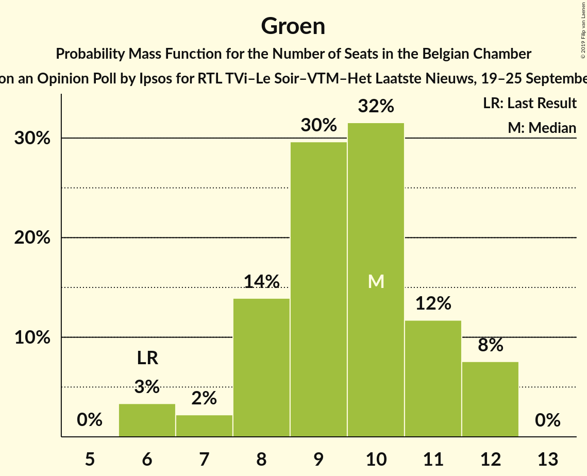
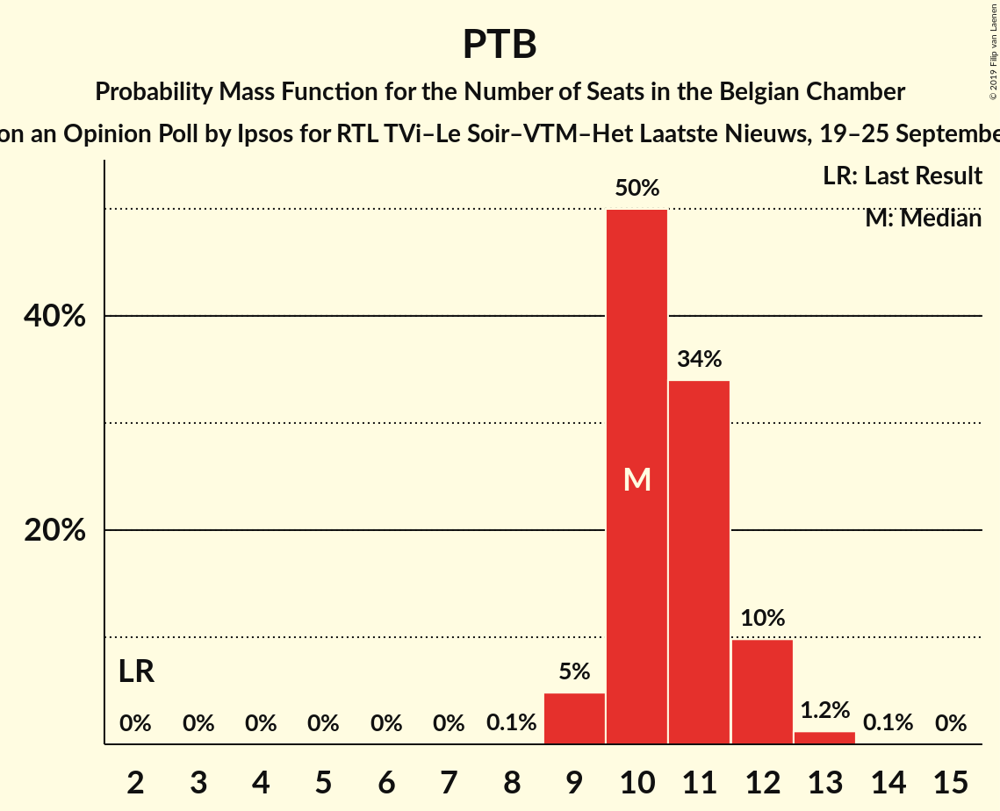
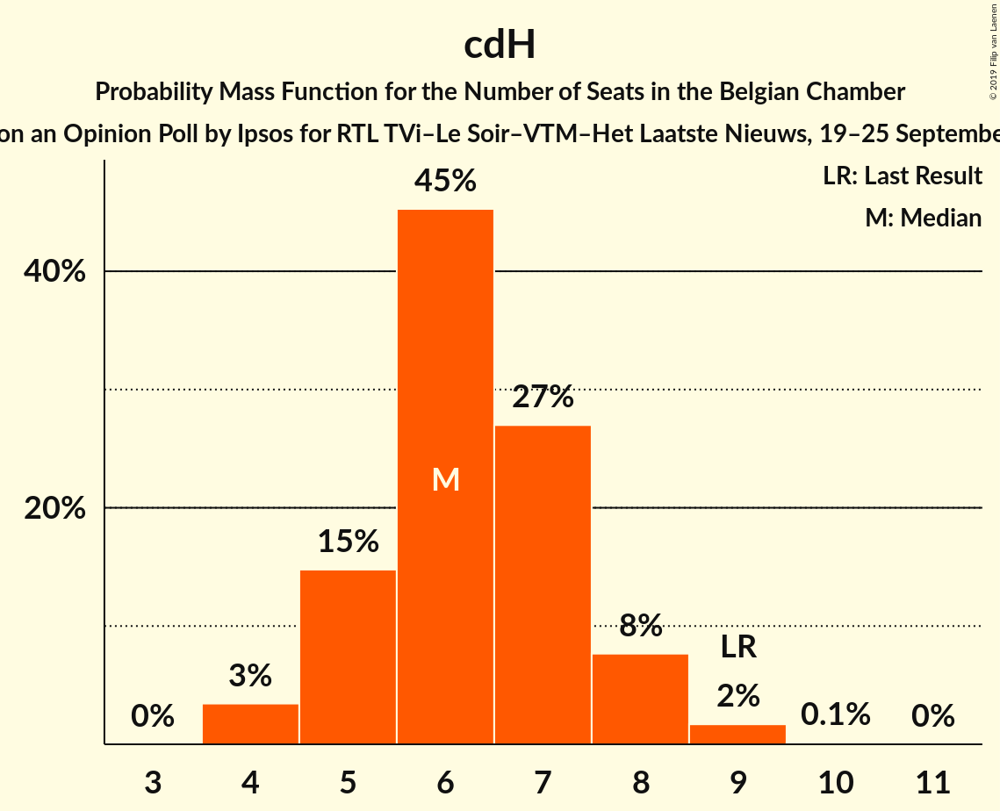

# Opinion Poll by Ipsos for RTL TVi–Le Soir–VTM–Het Laatste Nieuws, 19–25 September 2016

Areas included: Flanders, Wallonia

<a href="#voting-intentions">Voting Intentions</a> | <a href="#seats">Seats</a> | <a href="#coalitions">Coalitions</a> | <a href="#technical-information">Technical Information</a>

## Voting Intentions

### Confidence Intervals

| Party | Last Result | Poll Result | 80% Confidence Interval | 90% Confidence Interval | 95% Confidence Interval | 99% Confidence Interval |
|:-----:|:-----------:|:-----------:|:-----------------------:|:-----------------------:|:-----------------------:|:-----------------------:|
| N-VA | 20.3% | 17.3% | 24.2–27.8% |23.7–28.3% |23.3–28.8% |22.5–29.7% |
| CD&V | 11.6% | 11.7% | 16.1–19.3% |15.7–19.7% |15.3–20.1% |14.7–20.9% |
| sp.a | 8.8% | 9.2% | 12.4–15.2% |12.0–15.7% |11.7–16.0% |11.1–16.8% |
| Open Vld | 9.8% | 8.4% | 11.2–14.0% |10.9–14.4% |10.6–14.7% |10.0–15.5% |
| PS | 11.7% | 8.2% | N/A |N/A |N/A |N/A |
| Vlaams Belang | 3.7% | 8.0% | 10.8–13.4% |10.4–13.8% |10.1–14.2% |9.5–14.9% |
| MR | 9.6% | 7.4% | N/A |N/A |N/A |N/A |
| Groen | 5.3% | 7.1% | 9.5–12.1% |9.2–12.4% |8.9–12.8% |8.4–13.5% |
| PTB | 2.0% | 5.4% | N/A |N/A |N/A |N/A |
| cdH | 5.0% | 3.3% | N/A |N/A |N/A |N/A |
| PVDA | 1.8% | 2.6% | 3.2–4.8% |3.0–5.0% |2.8–5.3% |2.5–5.7% |
| Ecolo | 3.3% | 2.5% | N/A |N/A |N/A |N/A |
| Parti Populaire | 1.5% | 2.0% | N/A |N/A |N/A |N/A |
| La Droite | 0.4% | 1.4% | N/A |N/A |N/A |N/A |
| DéFI | 1.8% | 0.8% | N/A |N/A |N/A |N/A |

*Note:* The poll result column reflects the actual value used in the calculations. Published results may vary slightly, and in addition be rounded to fewer digits.

## Seats

### Confidence Intervals

| Party | Last Result | Median | 80% Confidence Interval | 90% Confidence Interval | 95% Confidence Interval | 99% Confidence Interval |
|:-----:|:-----------:|:------:|:-----------------------:|:-----------------------:|:-----------------------:|:-----------------------:|
| <a href="#n-va">N-VA</a> | 33 | 26 | 24–28 |24–28 |23–29 |22–31 |
| <a href="#cd&v">CD&V</a> | 18 | 18 | 15–18 |14–18 |13–19 |13–21 |
| <a href="#sp.a">sp.a</a> | 13 | 13 | 11–14 |11–15 |10–15 |9–16 |
| <a href="#open-vld">Open Vld</a> | 14 | 12 | 11–12 |10–13 |9–13 |8–14 |
| <a href="#ps">PS</a> | 23 | 15 | 14–16 |14–16 |13–17 |13–18 |
| <a href="#vlaams-belang">Vlaams Belang</a> | 3 | 11 | 8–12 |8–13 |8–13 |8–14 |
| <a href="#mr">MR</a> | 20 | 14 | 13–15 |13–16 |12–17 |12–17 |
| <a href="#groen">Groen</a> | 6 | 10 | 8–11 |7–12 |6–12 |6–12 |
| <a href="#ptb">PTB</a> | 2 | 8 | 8–9 |7–10 |7–10 |7–10 |
| <a href="#cdh">cdH</a> | 9 | 5 | 4–6 |3–7 |3–7 |3–7 |
| <a href="#pvda">PVDA</a> | 0 | 0 | 0 |0 |0 |0 |
| <a href="#ecolo">Ecolo</a> | 6 | 3 | 2–4 |1–4 |1–4 |1–5 |
| <a href="#parti-populaire">Parti Populaire</a> | 1 | 2 | 1–2 |1–2 |0–2 |0–3 |
| <a href="#la-droite">La Droite</a> | 0 | 0 | 0–1 |0–2 |0–2 |0–2 |
| <a href="#défi">DéFI</a> | 2 | 0 | 0 |0 |0 |0 |

### N-VA

*For a full overview of the results for this party, see the [N-VA](party-n-va.html) page.*

| Number of Seats | Probability | Accumulated | Special Marks |
|:---------------:|:-----------:|:-----------:|:-------------:|
| 20 | 0.1% | 100% |  |
| 21 | 0.2% | 99.9% |  |
| 22 | 0.7% | 99.7% |  |
| 23 | 3% | 99.0% |  |
| 24 | 34% | 96% |  |
| 25 | 11% | 62% |  |
| 26 | 16% | 51% | Median |
| 27 | 21% | 35% |  |
| 28 | 10% | 14% |  |
| 29 | 3% | 4% |  |
| 30 | 0.8% | 1.3% |  |
| 31 | 0.5% | 0.5% |  |
| 32 | 0% | 0% |  |
| 33 | 0% | 0% | Last Result |

### CD&V

*For a full overview of the results for this party, see the [CD&V](party-cdv.html) page.*

| Number of Seats | Probability | Accumulated | Special Marks |
|:---------------:|:-----------:|:-----------:|:-------------:|
| 13 | 4% | 100% |  |
| 14 | 5% | 96% |  |
| 15 | 8% | 91% |  |
| 16 | 9% | 83% |  |
| 17 | 17% | 74% |  |
| 18 | 53% | 57% | Last Result, Median |
| 19 | 2% | 4% |  |
| 20 | 0.9% | 2% |  |
| 21 | 0.5% | 0.8% |  |
| 22 | 0.3% | 0.3% |  |
| 23 | 0% | 0% |  |

### sp.a

*For a full overview of the results for this party, see the [sp.a](party-spa.html) page.*

| Number of Seats | Probability | Accumulated | Special Marks |
|:---------------:|:-----------:|:-----------:|:-------------:|
| 9 | 2% | 100% |  |
| 10 | 3% | 98% |  |
| 11 | 11% | 96% |  |
| 12 | 8% | 85% |  |
| 13 | 63% | 77% | Last Result, Median |
| 14 | 7% | 13% |  |
| 15 | 5% | 6% |  |
| 16 | 0.4% | 0.7% |  |
| 17 | 0.2% | 0.3% |  |
| 18 | 0.1% | 0.1% |  |
| 19 | 0% | 0% |  |

### Open Vld

*For a full overview of the results for this party, see the [Open Vld](party-openvld.html) page.*

| Number of Seats | Probability | Accumulated | Special Marks |
|:---------------:|:-----------:|:-----------:|:-------------:|
| 8 | 2% | 100% |  |
| 9 | 1.3% | 98% |  |
| 10 | 3% | 97% |  |
| 11 | 42% | 94% |  |
| 12 | 43% | 52% | Median |
| 13 | 8% | 9% |  |
| 14 | 0.4% | 0.7% | Last Result |
| 15 | 0.2% | 0.3% |  |
| 16 | 0.1% | 0.1% |  |
| 17 | 0.1% | 0.1% |  |
| 18 | 0% | 0% |  |

### PS

*For a full overview of the results for this party, see the [PS](party-ps.html) page.*

| Number of Seats | Probability | Accumulated | Special Marks |
|:---------------:|:-----------:|:-----------:|:-------------:|
| 12 | 0.5% | 100% |  |
| 13 | 4% | 99.5% |  |
| 14 | 10% | 96% |  |
| 15 | 38% | 85% | Median |
| 16 | 44% | 48% |  |
| 17 | 3% | 4% |  |
| 18 | 0.7% | 0.9% |  |
| 19 | 0.1% | 0.1% |  |
| 20 | 0% | 0% |  |
| 21 | 0% | 0% |  |
| 22 | 0% | 0% |  |
| 23 | 0% | 0% | Last Result |

### Vlaams Belang

*For a full overview of the results for this party, see the [Vlaams Belang](party-vlaamsbelang.html) page.*

| Number of Seats | Probability | Accumulated | Special Marks |
|:---------------:|:-----------:|:-----------:|:-------------:|
| 3 | 0% | 100% | Last Result |
| 4 | 0% | 100% |  |
| 5 | 0% | 100% |  |
| 6 | 0% | 100% |  |
| 7 | 0% | 100% |  |
| 8 | 24% | 100% |  |
| 9 | 7% | 76% |  |
| 10 | 12% | 69% |  |
| 11 | 12% | 57% | Median |
| 12 | 39% | 45% |  |
| 13 | 5% | 6% |  |
| 14 | 0.8% | 1.0% |  |
| 15 | 0.2% | 0.2% |  |
| 16 | 0% | 0% |  |

### MR

*For a full overview of the results for this party, see the [MR](party-mr.html) page.*

| Number of Seats | Probability | Accumulated | Special Marks |
|:---------------:|:-----------:|:-----------:|:-------------:|
| 11 | 0.2% | 100% |  |
| 12 | 3% | 99.8% |  |
| 13 | 20% | 97% |  |
| 14 | 50% | 77% | Median |
| 15 | 19% | 27% |  |
| 16 | 6% | 8% |  |
| 17 | 2% | 3% |  |
| 18 | 0.1% | 0.1% |  |
| 19 | 0% | 0% |  |
| 20 | 0% | 0% | Last Result |

### Groen

*For a full overview of the results for this party, see the [Groen](party-groen.html) page.*

| Number of Seats | Probability | Accumulated | Special Marks |
|:---------------:|:-----------:|:-----------:|:-------------:|
| 6 | 3% | 100% | Last Result |
| 7 | 2% | 97% |  |
| 8 | 14% | 94% |  |
| 9 | 29% | 80% |  |
| 10 | 32% | 51% | Median |
| 11 | 11% | 19% |  |
| 12 | 8% | 8% |  |
| 13 | 0% | 0% |  |

### PTB

*For a full overview of the results for this party, see the [PTB](party-ptb.html) page.*

| Number of Seats | Probability | Accumulated | Special Marks |
|:---------------:|:-----------:|:-----------:|:-------------:|
| 2 | 0% | 100% | Last Result |
| 3 | 0% | 100% |  |
| 4 | 0% | 100% |  |
| 5 | 0% | 100% |  |
| 6 | 0.1% | 100% |  |
| 7 | 6% | 99.9% |  |
| 8 | 55% | 94% | Median |
| 9 | 30% | 39% |  |
| 10 | 8% | 9% |  |
| 11 | 0.4% | 0.5% |  |
| 12 | 0% | 0% |  |

### cdH

*For a full overview of the results for this party, see the [cdH](party-cdh.html) page.*

| Number of Seats | Probability | Accumulated | Special Marks |
|:---------------:|:-----------:|:-----------:|:-------------:|
| 3 | 5% | 100% |  |
| 4 | 19% | 95% |  |
| 5 | 55% | 76% | Median |
| 6 | 16% | 21% |  |
| 7 | 5% | 5% |  |
| 8 | 0.4% | 0.4% |  |
| 9 | 0% | 0% | Last Result |

### PVDA

*For a full overview of the results for this party, see the [PVDA](party-pvda.html) page.*

| Number of Seats | Probability | Accumulated | Special Marks |
|:---------------:|:-----------:|:-----------:|:-------------:|
| 0 | 100% | 100% | Last Result, Median |

### Ecolo

*For a full overview of the results for this party, see the [Ecolo](party-ecolo.html) page.*

| Number of Seats | Probability | Accumulated | Special Marks |
|:---------------:|:-----------:|:-----------:|:-------------:|
| 1 | 9% | 100% |  |
| 2 | 10% | 91% |  |
| 3 | 64% | 81% | Median |
| 4 | 16% | 17% |  |
| 5 | 1.0% | 1.1% |  |
| 6 | 0.1% | 0.1% | Last Result |
| 7 | 0% | 0% |  |

### Parti Populaire

*For a full overview of the results for this party, see the [Parti Populaire](party-partipopulaire.html) page.*

| Number of Seats | Probability | Accumulated | Special Marks |
|:---------------:|:-----------:|:-----------:|:-------------:|
| 0 | 3% | 100% |  |
| 1 | 8% | 97% | Last Result |
| 2 | 89% | 89% | Median |
| 3 | 0.6% | 0.6% |  |
| 4 | 0% | 0% |  |

### La Droite

*For a full overview of the results for this party, see the [La Droite](party-ladroite.html) page.*

| Number of Seats | Probability | Accumulated | Special Marks |
|:---------------:|:-----------:|:-----------:|:-------------:|
| 0 | 70% | 100% | Last Result, Median |
| 1 | 21% | 30% |  |
| 2 | 9% | 9% |  |
| 3 | 0% | 0% |  |

### DéFI

*For a full overview of the results for this party, see the [DéFI](party-défi.html) page.*

| Number of Seats | Probability | Accumulated | Special Marks |
|:---------------:|:-----------:|:-----------:|:-------------:|
| 0 | 100% | 100% | Median |
| 1 | 0% | 0% |  |
| 2 | 0% | 0% | Last Result |

## Coalitions

### Confidence Intervals

| Coalition | Last Result | Median | Majority? | 80% Confidence Interval | 90% Confidence Interval | 95% Confidence Interval | 99% Confidence Interval |
|:---------:|:-----------:|:------:|:---------:|:-----------------------:|:-----------------------:|:-----------------------:|:-----------------------:|
| CD&V – sp.a – Open Vld – PS – MR – Groen – cdH – Ecolo | 109 | 88 | 100% | 86–91 | 85–91 | 84–92 | 82–93 |
| CD&V – sp.a – Open Vld – PS – MR – cdH | 97 | 76 | 57% | 73–78 | 72–79 | 71–80 | 70–81 |
| N-VA – CD&V – Open Vld – MR – cdH | 94 | 73 | 17% | 71–76 | 70–77 | 69–78 | 68–79 |
| CD&V – sp.a – PS – Groen – PTB – cdH – PVDA – Ecolo | 77 | 71 | 2% | 68–74 | 67–74 | 66–75 | 65–76 |
| N-VA – CD&V – Open Vld – MR | 85 | 68 | 0.1% | 66–71 | 65–72 | 64–73 | 63–74 |
| sp.a – Open Vld – PS – MR – Groen – Ecolo | 82 | 66 | 0% | 63–69 | 63–70 | 62–70 | 61–72 |
| CD&V – Open Vld – PS – MR – cdH | 84 | 63 | 0% | 60–65 | 60–66 | 59–67 | 57–68 |
| CD&V – sp.a – PS – Groen – cdH – Ecolo | 75 | 63 | 0% | 60–65 | 59–66 | 58–67 | 56–68 |
| sp.a – PS – Groen – PTB – cdH – PVDA – Ecolo | 59 | 54 | 0% | 51–56 | 50–57 | 50–58 | 48–59 |
| sp.a – Open Vld – PS – MR | 70 | 54 | 0% | 51–56 | 50–57 | 50–57 | 49–59 |
| CD&V – sp.a – PS – cdH | 63 | 50 | 0% | 47–53 | 46–53 | 46–54 | 44–55 |
| sp.a – PS – Groen – PTB – PVDA – Ecolo | 50 | 49 | 0% | 46–51 | 46–52 | 45–53 | 44–54 |
| CD&V – Open Vld – MR – cdH | 61 | 48 | 0% | 45–50 | 44–50 | 44–51 | 42–53 |
| CD&V – Open Vld – MR – Groen – cdH – Ecolo | 73 | 22 | 0% | 21–23 | 20–23 | 20–24 | 19–24 |

### CD&V – sp.a – Open Vld – PS – MR – Groen – cdH – Ecolo

| Number of Seats | Probability | Accumulated | Special Marks |
|:---------------:|:-----------:|:-----------:|:-------------:|
| 81 | 0.1% | 100% |  |
| 82 | 0.4% | 99.8% |  |
| 83 | 1.0% | 99.5% |  |
| 84 | 2% | 98.5% |  |
| 85 | 6% | 96% |  |
| 86 | 10% | 90% |  |
| 87 | 17% | 80% |  |
| 88 | 19% | 64% |  |
| 89 | 21% | 45% |  |
| 90 | 13% | 24% | Median |
| 91 | 7% | 11% |  |
| 92 | 3% | 4% |  |
| 93 | 1.3% | 2% |  |
| 94 | 0.3% | 0.4% |  |
| 95 | 0% | 0.1% |  |
| 96 | 0% | 0% |  |
| 97 | 0% | 0% |  |
| 98 | 0% | 0% |  |
| 99 | 0% | 0% |  |
| 100 | 0% | 0% |  |
| 101 | 0% | 0% |  |
| 102 | 0% | 0% |  |
| 103 | 0% | 0% |  |
| 104 | 0% | 0% |  |
| 105 | 0% | 0% |  |
| 106 | 0% | 0% |  |
| 107 | 0% | 0% |  |
| 108 | 0% | 0% |  |
| 109 | 0% | 0% | Last Result |

### CD&V – sp.a – Open Vld – PS – MR – cdH

| Number of Seats | Probability | Accumulated | Special Marks |
|:---------------:|:-----------:|:-----------:|:-------------:|
| 68 | 0.1% | 100% |  |
| 69 | 0.2% | 99.9% |  |
| 70 | 0.6% | 99.7% |  |
| 71 | 2% | 99.1% |  |
| 72 | 4% | 97% |  |
| 73 | 8% | 93% |  |
| 74 | 12% | 86% |  |
| 75 | 17% | 74% |  |
| 76 | 18% | 57% | Majority |
| 77 | 19% | 39% | Median |
| 78 | 11% | 20% |  |
| 79 | 5% | 8% |  |
| 80 | 2% | 3% |  |
| 81 | 0.9% | 1.3% |  |
| 82 | 0.3% | 0.4% |  |
| 83 | 0.1% | 0.1% |  |
| 84 | 0% | 0% |  |
| 85 | 0% | 0% |  |
| 86 | 0% | 0% |  |
| 87 | 0% | 0% |  |
| 88 | 0% | 0% |  |
| 89 | 0% | 0% |  |
| 90 | 0% | 0% |  |
| 91 | 0% | 0% |  |
| 92 | 0% | 0% |  |
| 93 | 0% | 0% |  |
| 94 | 0% | 0% |  |
| 95 | 0% | 0% |  |
| 96 | 0% | 0% |  |
| 97 | 0% | 0% | Last Result |

### N-VA – CD&V – Open Vld – MR – cdH

| Number of Seats | Probability | Accumulated | Special Marks |
|:---------------:|:-----------:|:-----------:|:-------------:|
| 67 | 0.2% | 100% |  |
| 68 | 0.7% | 99.8% |  |
| 69 | 2% | 99.1% |  |
| 70 | 5% | 97% |  |
| 71 | 12% | 92% |  |
| 72 | 19% | 80% |  |
| 73 | 16% | 60% |  |
| 74 | 14% | 44% |  |
| 75 | 13% | 30% | Median |
| 76 | 9% | 17% | Majority |
| 77 | 5% | 8% |  |
| 78 | 2% | 3% |  |
| 79 | 0.7% | 0.9% |  |
| 80 | 0.2% | 0.2% |  |
| 81 | 0% | 0% |  |
| 82 | 0% | 0% |  |
| 83 | 0% | 0% |  |
| 84 | 0% | 0% |  |
| 85 | 0% | 0% |  |
| 86 | 0% | 0% |  |
| 87 | 0% | 0% |  |
| 88 | 0% | 0% |  |
| 89 | 0% | 0% |  |
| 90 | 0% | 0% |  |
| 91 | 0% | 0% |  |
| 92 | 0% | 0% |  |
| 93 | 0% | 0% |  |
| 94 | 0% | 0% | Last Result |

### CD&V – sp.a – PS – Groen – PTB – cdH – PVDA – Ecolo

| Number of Seats | Probability | Accumulated | Special Marks |
|:---------------:|:-----------:|:-----------:|:-------------:|
| 63 | 0.1% | 100% |  |
| 64 | 0.2% | 99.9% |  |
| 65 | 0.7% | 99.6% |  |
| 66 | 2% | 99.0% |  |
| 67 | 4% | 97% |  |
| 68 | 7% | 94% |  |
| 69 | 11% | 86% |  |
| 70 | 16% | 75% |  |
| 71 | 18% | 59% |  |
| 72 | 17% | 41% | Median |
| 73 | 13% | 24% |  |
| 74 | 7% | 11% |  |
| 75 | 3% | 5% |  |
| 76 | 1.3% | 2% | Majority |
| 77 | 0.3% | 0.4% | Last Result |
| 78 | 0.1% | 0.1% |  |
| 79 | 0% | 0% |  |

### N-VA – CD&V – Open Vld – MR

| Number of Seats | Probability | Accumulated | Special Marks |
|:---------------:|:-----------:|:-----------:|:-------------:|
| 62 | 0.2% | 100% |  |
| 63 | 0.6% | 99.8% |  |
| 64 | 2% | 99.2% |  |
| 65 | 5% | 97% |  |
| 66 | 12% | 92% |  |
| 67 | 19% | 80% |  |
| 68 | 16% | 61% |  |
| 69 | 14% | 45% |  |
| 70 | 14% | 31% | Median |
| 71 | 9% | 17% |  |
| 72 | 5% | 8% |  |
| 73 | 2% | 3% |  |
| 74 | 0.8% | 1.0% |  |
| 75 | 0.2% | 0.3% |  |
| 76 | 0% | 0.1% | Majority |
| 77 | 0% | 0% |  |
| 78 | 0% | 0% |  |
| 79 | 0% | 0% |  |
| 80 | 0% | 0% |  |
| 81 | 0% | 0% |  |
| 82 | 0% | 0% |  |
| 83 | 0% | 0% |  |
| 84 | 0% | 0% |  |
| 85 | 0% | 0% | Last Result |

### sp.a – Open Vld – PS – MR – Groen – Ecolo

| Number of Seats | Probability | Accumulated | Special Marks |
|:---------------:|:-----------:|:-----------:|:-------------:|
| 59 | 0.1% | 100% |  |
| 60 | 0.3% | 99.9% |  |
| 61 | 1.1% | 99.5% |  |
| 62 | 3% | 98% |  |
| 63 | 6% | 95% |  |
| 64 | 11% | 89% |  |
| 65 | 16% | 78% |  |
| 66 | 19% | 62% |  |
| 67 | 18% | 42% | Median |
| 68 | 12% | 25% |  |
| 69 | 7% | 12% |  |
| 70 | 3% | 5% |  |
| 71 | 1.3% | 2% |  |
| 72 | 0.4% | 0.6% |  |
| 73 | 0.1% | 0.1% |  |
| 74 | 0% | 0% |  |
| 75 | 0% | 0% |  |
| 76 | 0% | 0% | Majority |
| 77 | 0% | 0% |  |
| 78 | 0% | 0% |  |
| 79 | 0% | 0% |  |
| 80 | 0% | 0% |  |
| 81 | 0% | 0% |  |
| 82 | 0% | 0% | Last Result |

### CD&V – Open Vld – PS – MR – cdH

| Number of Seats | Probability | Accumulated | Special Marks |
|:---------------:|:-----------:|:-----------:|:-------------:|
| 56 | 0.1% | 100% |  |
| 57 | 0.4% | 99.8% |  |
| 58 | 1.3% | 99.4% |  |
| 59 | 3% | 98% |  |
| 60 | 6% | 95% |  |
| 61 | 10% | 89% |  |
| 62 | 15% | 80% |  |
| 63 | 20% | 64% |  |
| 64 | 24% | 44% | Median |
| 65 | 13% | 20% |  |
| 66 | 5% | 8% |  |
| 67 | 2% | 3% |  |
| 68 | 0.7% | 1.0% |  |
| 69 | 0.2% | 0.3% |  |
| 70 | 0.1% | 0.1% |  |
| 71 | 0% | 0% |  |
| 72 | 0% | 0% |  |
| 73 | 0% | 0% |  |
| 74 | 0% | 0% |  |
| 75 | 0% | 0% |  |
| 76 | 0% | 0% | Majority |
| 77 | 0% | 0% |  |
| 78 | 0% | 0% |  |
| 79 | 0% | 0% |  |
| 80 | 0% | 0% |  |
| 81 | 0% | 0% |  |
| 82 | 0% | 0% |  |
| 83 | 0% | 0% |  |
| 84 | 0% | 0% | Last Result |

### CD&V – sp.a – PS – Groen – cdH – Ecolo

| Number of Seats | Probability | Accumulated | Special Marks |
|:---------------:|:-----------:|:-----------:|:-------------:|
| 55 | 0.1% | 100% |  |
| 56 | 0.4% | 99.8% |  |
| 57 | 1.0% | 99.5% |  |
| 58 | 2% | 98% |  |
| 59 | 5% | 96% |  |
| 60 | 9% | 91% |  |
| 61 | 13% | 82% |  |
| 62 | 17% | 69% |  |
| 63 | 18% | 52% |  |
| 64 | 16% | 34% | Median |
| 65 | 10% | 18% |  |
| 66 | 5% | 8% |  |
| 67 | 2% | 3% |  |
| 68 | 0.8% | 1.1% |  |
| 69 | 0.2% | 0.2% |  |
| 70 | 0% | 0% |  |
| 71 | 0% | 0% |  |
| 72 | 0% | 0% |  |
| 73 | 0% | 0% |  |
| 74 | 0% | 0% |  |
| 75 | 0% | 0% | Last Result |

### sp.a – PS – Groen – PTB – cdH – PVDA – Ecolo

| Number of Seats | Probability | Accumulated | Special Marks |
|:---------------:|:-----------:|:-----------:|:-------------:|
| 47 | 0.1% | 100% |  |
| 48 | 0.5% | 99.8% |  |
| 49 | 1.3% | 99.3% |  |
| 50 | 3% | 98% |  |
| 51 | 7% | 95% |  |
| 52 | 11% | 88% |  |
| 53 | 17% | 77% |  |
| 54 | 21% | 60% | Median |
| 55 | 20% | 39% |  |
| 56 | 11% | 19% |  |
| 57 | 5% | 8% |  |
| 58 | 2% | 3% |  |
| 59 | 0.6% | 0.8% | Last Result |
| 60 | 0.1% | 0.2% |  |
| 61 | 0% | 0% |  |

### sp.a – Open Vld – PS – MR

| Number of Seats | Probability | Accumulated | Special Marks |
|:---------------:|:-----------:|:-----------:|:-------------:|
| 47 | 0.1% | 100% |  |
| 48 | 0.4% | 99.9% |  |
| 49 | 1.4% | 99.5% |  |
| 50 | 3% | 98% |  |
| 51 | 7% | 95% |  |
| 52 | 13% | 88% |  |
| 53 | 18% | 75% |  |
| 54 | 22% | 57% | Median |
| 55 | 19% | 34% |  |
| 56 | 10% | 16% |  |
| 57 | 4% | 6% |  |
| 58 | 2% | 2% |  |
| 59 | 0.5% | 0.7% |  |
| 60 | 0.2% | 0.2% |  |
| 61 | 0% | 0.1% |  |
| 62 | 0% | 0% |  |
| 63 | 0% | 0% |  |
| 64 | 0% | 0% |  |
| 65 | 0% | 0% |  |
| 66 | 0% | 0% |  |
| 67 | 0% | 0% |  |
| 68 | 0% | 0% |  |
| 69 | 0% | 0% |  |
| 70 | 0% | 0% | Last Result |

### CD&V – sp.a – PS – cdH

| Number of Seats | Probability | Accumulated | Special Marks |
|:---------------:|:-----------:|:-----------:|:-------------:|
| 42 | 0% | 100% |  |
| 43 | 0.2% | 99.9% |  |
| 44 | 0.5% | 99.8% |  |
| 45 | 1.4% | 99.3% |  |
| 46 | 3% | 98% |  |
| 47 | 6% | 95% |  |
| 48 | 10% | 88% |  |
| 49 | 14% | 79% |  |
| 50 | 18% | 65% |  |
| 51 | 19% | 47% | Median |
| 52 | 17% | 28% |  |
| 53 | 7% | 11% |  |
| 54 | 3% | 4% |  |
| 55 | 1.0% | 1.3% |  |
| 56 | 0.3% | 0.4% |  |
| 57 | 0.1% | 0.1% |  |
| 58 | 0% | 0% |  |
| 59 | 0% | 0% |  |
| 60 | 0% | 0% |  |
| 61 | 0% | 0% |  |
| 62 | 0% | 0% |  |
| 63 | 0% | 0% | Last Result |

### sp.a – PS – Groen – PTB – PVDA – Ecolo

| Number of Seats | Probability | Accumulated | Special Marks |
|:---------------:|:-----------:|:-----------:|:-------------:|
| 42 | 0.1% | 100% |  |
| 43 | 0.4% | 99.9% |  |
| 44 | 1.2% | 99.5% |  |
| 45 | 3% | 98% |  |
| 46 | 7% | 95% |  |
| 47 | 11% | 88% |  |
| 48 | 17% | 77% |  |
| 49 | 21% | 60% | Median |
| 50 | 20% | 39% | Last Result |
| 51 | 11% | 19% |  |
| 52 | 5% | 8% |  |
| 53 | 2% | 3% |  |
| 54 | 0.6% | 0.8% |  |
| 55 | 0.1% | 0.2% |  |
| 56 | 0% | 0% |  |

### CD&V – Open Vld – MR – cdH

| Number of Seats | Probability | Accumulated | Special Marks |
|:---------------:|:-----------:|:-----------:|:-------------:|
| 41 | 0.1% | 100% |  |
| 42 | 0.4% | 99.8% |  |
| 43 | 2% | 99.4% |  |
| 44 | 4% | 98% |  |
| 45 | 7% | 94% |  |
| 46 | 10% | 87% |  |
| 47 | 18% | 77% |  |
| 48 | 27% | 60% |  |
| 49 | 19% | 33% | Median |
| 50 | 9% | 13% |  |
| 51 | 3% | 5% |  |
| 52 | 1.0% | 2% |  |
| 53 | 0.4% | 0.5% |  |
| 54 | 0.1% | 0.2% |  |
| 55 | 0% | 0% |  |
| 56 | 0% | 0% |  |
| 57 | 0% | 0% |  |
| 58 | 0% | 0% |  |
| 59 | 0% | 0% |  |
| 60 | 0% | 0% |  |
| 61 | 0% | 0% | Last Result |

### CD&V – Open Vld – MR – Groen – cdH – Ecolo

| Number of Seats | Probability | Accumulated | Special Marks |
|:---------------:|:-----------:|:-----------:|:-------------:|
| 19 | 1.3% | 100% |  |
| 20 | 5% | 98.7% |  |
| 21 | 17% | 93% |  |
| 22 | 51% | 77% |  |
| 23 | 21% | 26% |  |
| 24 | 4% | 5% |  |
| 25 | 0.4% | 0.5% |  |
| 26 | 0% | 0% |  |
| 27 | 0% | 0% |  |
| 28 | 0% | 0% |  |
| 29 | 0% | 0% |  |
| 30 | 0% | 0% |  |
| 31 | 0% | 0% |  |
| 32 | 0% | 0% |  |
| 33 | 0% | 0% |  |
| 34 | 0% | 0% |  |
| 35 | 0% | 0% |  |
| 36 | 0% | 0% |  |
| 37 | 0% | 0% |  |
| 38 | 0% | 0% |  |
| 39 | 0% | 0% |  |
| 40 | 0% | 0% |  |
| 41 | 0% | 0% |  |
| 42 | 0% | 0% |  |
| 43 | 0% | 0% |  |
| 44 | 0% | 0% |  |
| 45 | 0% | 0% |  |
| 46 | 0% | 0% |  |
| 47 | 0% | 0% |  |
| 48 | 0% | 0% |  |
| 49 | 0% | 0% |  |
| 50 | 0% | 0% |  |
| 51 | 0% | 0% |  |
| 52 | 0% | 0% |  |
| 53 | 0% | 0% |  |
| 54 | 0% | 0% |  |
| 55 | 0% | 0% |  |
| 56 | 0% | 0% |  |
| 57 | 0% | 0% |  |
| 58 | 0% | 0% |  |
| 59 | 0% | 0% |  |
| 60 | 0% | 0% |  |
| 61 | 0% | 0% |  |
| 62 | 0% | 0% | Median |
| 63 | 0% | 0% |  |
| 64 | 0% | 0% |  |
| 65 | 0% | 0% |  |
| 66 | 0% | 0% |  |
| 67 | 0% | 0% |  |
| 68 | 0% | 0% |  |
| 69 | 0% | 0% |  |
| 70 | 0% | 0% |  |
| 71 | 0% | 0% |  |
| 72 | 0% | 0% |  |
| 73 | 0% | 0% | Last Result |

## Technical Information

### Opinion Poll

+ **Polling firm:** Ipsos
+ **Commissioner(s):** RTL TVi–Le Soir–VTM–Het Laatste Nieuws
+ **Fieldwork period:** 19–25 September 2016

### Calculations

+ **Sample size:** 1473
+ **Simulations done:** 1,048,576
+ **Error estimate:** 1.74%

