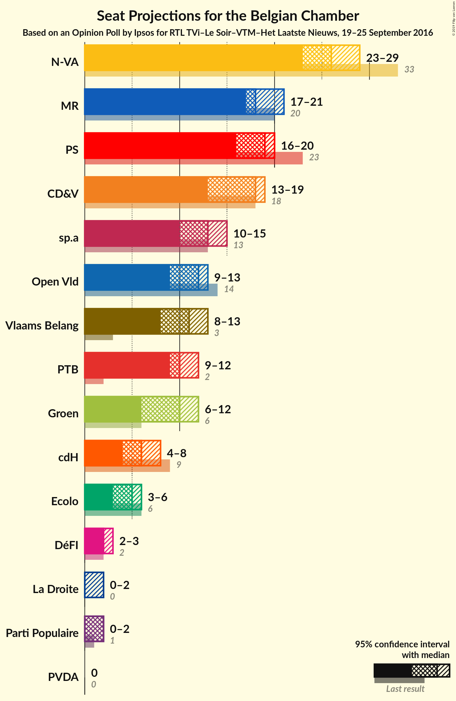
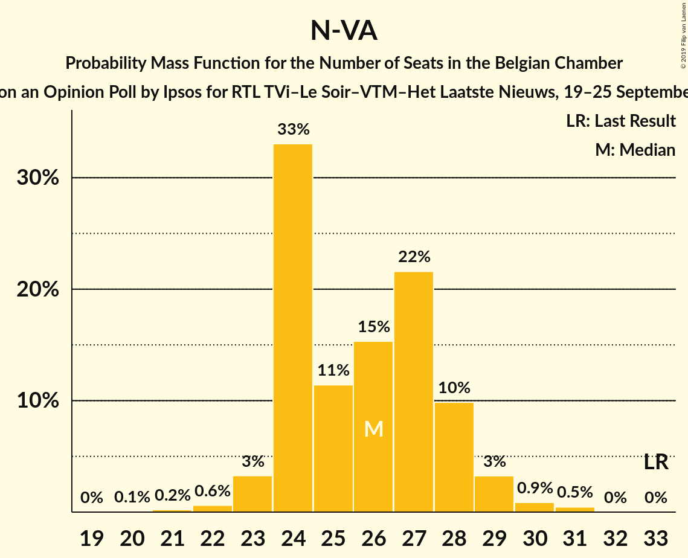
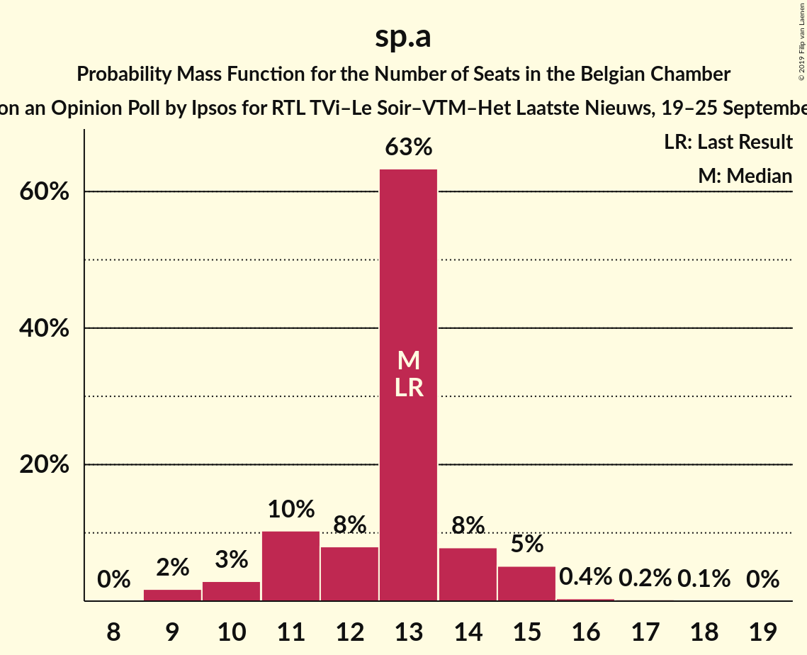
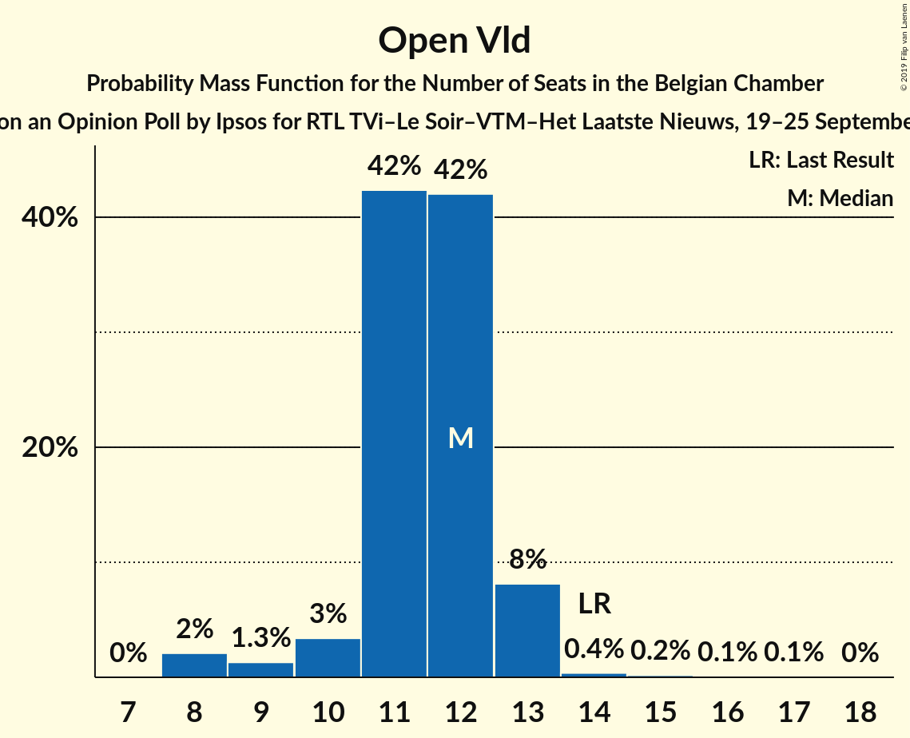
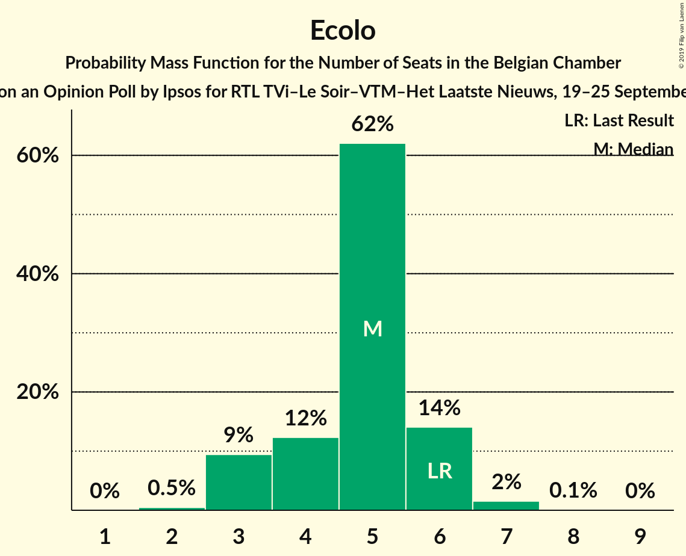

# Opinion Poll by Ipsos for RTL TVi–Le Soir–VTM–Het Laatste Nieuws, 19–25 September 2016

Areas included: Brussels, Flanders, Wallonia

<a href="#voting-intentions">Voting Intentions</a> | <a href="#seats">Seats</a> | <a href="#coalitions">Coalitions</a> | <a href="#technical-information">Technical Information</a>

## Voting Intentions

### Confidence Intervals

| Party | Last Result | Poll Result | 80% Confidence Interval | 90% Confidence Interval | 95% Confidence Interval | 99% Confidence Interval |
|:-----:|:-----------:|:-----------:|:-----------------------:|:-----------------------:|:-----------------------:|:-----------------------:|
| N-VA | 20.3% | 16.0% | 14.9–16.8% |14.6–17.0% |14.4–17.1% |13.9–17.1% |
| CD&V | 11.6% | 10.9% | 9.9–11.6% |9.7–11.7% |9.5–11.8% |9.1–11.9% |
| PS | 11.7% | 8.7% | 7.7–8.1% |7.6–8.2% |7.6–8.2% |7.4–8.2% |
| sp.a | 8.8% | 8.5% | 7.6–9.1% |7.4–9.2% |7.2–9.3% |6.9–9.4% |
| MR | 9.6% | 8.4% | 7.4–7.8% |7.3–7.8% |7.2–7.8% |7.0–7.8% |
| Open Vld | 9.8% | 7.7% | 6.9–8.3% |6.7–8.5% |6.5–8.5% |6.2–8.6% |
| Vlaams Belang | 3.7% | 7.4% | 6.6–8.0% |6.4–8.1% |6.2–8.2% |5.9–8.3% |
| Groen | 5.3% | 6.6% | 5.8–7.2% |5.7–7.3% |5.5–7.4% |5.1–7.4% |
| PTB | 2.0% | 5.8% | 5.0–5.3% |4.9–5.3% |4.8–5.3% |4.7–5.3% |
| cdH | 5.0% | 3.6% | 2.9–3.2% |2.9–3.2% |2.8–3.2% |2.7–3.2% |
| Ecolo | 3.3% | 3.0% | 2.4–2.7% |2.4–2.7% |2.3–2.7% |2.2–2.7% |
| PVDA | 1.8% | 2.4% | 1.9–2.8% |1.8–2.8% |1.7–2.9% |1.6–2.9% |
| Parti Populaire | 1.5% | 1.9% | 1.4–1.6% |1.4–1.6% |1.3–1.6% |1.2–1.6% |
| DéFI | 1.8% | 1.6% | 1.2–1.3% |1.2–1.3% |1.1–1.3% |1.1–1.3% |
| La Droite | 0.4% | 1.3% | 1.0–1.3% |1.0–1.4% |0.9–1.4% |0.9–1.4% |

*Note:* The poll result column reflects the actual value used in the calculations. Published results may vary slightly, and in addition be rounded to fewer digits.

## Seats

### Confidence Intervals

| Party | Last Result | Median | 80% Confidence Interval | 90% Confidence Interval | 95% Confidence Interval | 99% Confidence Interval |
|:-----:|:-----------:|:------:|:-----------------------:|:-----------------------:|:-----------------------:|:-----------------------:|
| <a href="#n-va">N-VA</a> | 33 | 26 | 24–28 |24–28 |23–29 |22–30 |
| <a href="#cd&v">CD&V</a> | 18 | 18 | 15–18 |14–18 |13–19 |13–21 |
| <a href="#ps">PS</a> | 23 | 19 | 17–20 |17–20 |16–20 |16–21 |
| <a href="#sp.a">sp.a</a> | 13 | 13 | 11–14 |11–15 |10–15 |9–16 |
| <a href="#mr">MR</a> | 20 | 18 | 17–20 |17–20 |17–21 |16–22 |
| <a href="#open-vld">Open Vld</a> | 14 | 12 | 11–12 |10–13 |9–13 |8–14 |
| <a href="#vlaams-belang">Vlaams Belang</a> | 3 | 11 | 8–12 |8–13 |8–13 |8–14 |
| <a href="#groen">Groen</a> | 6 | 10 | 8–11 |7–12 |6–12 |6–12 |
| <a href="#ptb">PTB</a> | 2 | 10 | 10–12 |10–12 |9–12 |9–13 |
| <a href="#cdh">cdH</a> | 9 | 6 | 5–7 |5–8 |4–8 |4–9 |
| <a href="#ecolo">Ecolo</a> | 6 | 5 | 4–6 |3–6 |3–6 |2–7 |
| <a href="#pvda">PVDA</a> | 0 | 0 | 0 |0 |0 |0 |
| <a href="#parti-populaire">Parti Populaire</a> | 1 | 2 | 1–2 |1–2 |0–2 |0–3 |
| <a href="#défi">DéFI</a> | 2 | 2 | 2 |2–3 |2–3 |2–3 |
| <a href="#la-droite">La Droite</a> | 0 | 0 | 0–1 |0–2 |0–2 |0–2 |

### N-VA

*For a full overview of the results for this party, see the [N-VA](party-n-va.html) page.*

| Number of Seats | Probability | Accumulated | Special Marks |
|:---------------:|:-----------:|:-----------:|:-------------:|
| 20 | 0.1% | 100% |  |
| 21 | 0.2% | 99.9% |  |
| 22 | 0.6% | 99.7% |  |
| 23 | 3% | 99.1% |  |
| 24 | 33% | 96% |  |
| 25 | 11% | 63% |  |
| 26 | 15% | 51% | Median |
| 27 | 22% | 36% |  |
| 28 | 10% | 14% |  |
| 29 | 3% | 5% |  |
| 30 | 0.9% | 1.3% |  |
| 31 | 0.5% | 0.5% |  |
| 32 | 0% | 0% |  |
| 33 | 0% | 0% | Last Result |

### CD&V

*For a full overview of the results for this party, see the [CD&V](party-cdv.html) page.*

| Number of Seats | Probability | Accumulated | Special Marks |
|:---------------:|:-----------:|:-----------:|:-------------:|
| 13 | 4% | 100% |  |
| 14 | 5% | 96% |  |
| 15 | 7% | 91% |  |
| 16 | 9% | 83% |  |
| 17 | 15% | 74% |  |
| 18 | 55% | 59% | Last Result, Median |
| 19 | 2% | 4% |  |
| 20 | 0.9% | 2% |  |
| 21 | 0.5% | 0.8% |  |
| 22 | 0.3% | 0.3% |  |
| 23 | 0% | 0% |  |

### PS

*For a full overview of the results for this party, see the [PS](party-ps.html) page.*

| Number of Seats | Probability | Accumulated | Special Marks |
|:---------------:|:-----------:|:-----------:|:-------------:|
| 15 | 0.4% | 100% |  |
| 16 | 3% | 99.6% |  |
| 17 | 9% | 97% |  |
| 18 | 32% | 88% |  |
| 19 | 44% | 56% | Median |
| 20 | 11% | 12% |  |
| 21 | 1.3% | 2% |  |
| 22 | 0.3% | 0.3% |  |
| 23 | 0% | 0% | Last Result |

### sp.a

*For a full overview of the results for this party, see the [sp.a](party-spa.html) page.*

| Number of Seats | Probability | Accumulated | Special Marks |
|:---------------:|:-----------:|:-----------:|:-------------:|
| 9 | 2% | 100% |  |
| 10 | 3% | 98% |  |
| 11 | 10% | 95% |  |
| 12 | 8% | 85% |  |
| 13 | 63% | 77% | Last Result, Median |
| 14 | 8% | 14% |  |
| 15 | 5% | 6% |  |
| 16 | 0.4% | 0.7% |  |
| 17 | 0.2% | 0.3% |  |
| 18 | 0.1% | 0.1% |  |
| 19 | 0% | 0% |  |

### MR

*For a full overview of the results for this party, see the [MR](party-mr.html) page.*

| Number of Seats | Probability | Accumulated | Special Marks |
|:---------------:|:-----------:|:-----------:|:-------------:|
| 15 | 0.1% | 100% |  |
| 16 | 2% | 99.9% |  |
| 17 | 15% | 98% |  |
| 18 | 38% | 83% | Median |
| 19 | 30% | 45% |  |
| 20 | 11% | 15% | Last Result |
| 21 | 4% | 5% |  |
| 22 | 1.0% | 1.0% |  |
| 23 | 0.1% | 0.1% |  |
| 24 | 0% | 0% |  |

### Open Vld

*For a full overview of the results for this party, see the [Open Vld](party-openvld.html) page.*

| Number of Seats | Probability | Accumulated | Special Marks |
|:---------------:|:-----------:|:-----------:|:-------------:|
| 8 | 2% | 100% |  |
| 9 | 1.3% | 98% |  |
| 10 | 3% | 97% |  |
| 11 | 42% | 93% |  |
| 12 | 42% | 51% | Median |
| 13 | 8% | 9% |  |
| 14 | 0.4% | 0.7% | Last Result |
| 15 | 0.2% | 0.3% |  |
| 16 | 0.1% | 0.1% |  |
| 17 | 0.1% | 0.1% |  |
| 18 | 0% | 0% |  |

### Vlaams Belang

*For a full overview of the results for this party, see the [Vlaams Belang](party-vlaamsbelang.html) page.*

| Number of Seats | Probability | Accumulated | Special Marks |
|:---------------:|:-----------:|:-----------:|:-------------:|
| 3 | 0% | 100% | Last Result |
| 4 | 0% | 100% |  |
| 5 | 0% | 100% |  |
| 6 | 0% | 100% |  |
| 7 | 0% | 100% |  |
| 8 | 25% | 100% |  |
| 9 | 7% | 75% |  |
| 10 | 10% | 68% |  |
| 11 | 14% | 58% | Median |
| 12 | 38% | 44% |  |
| 13 | 5% | 6% |  |
| 14 | 0.8% | 1.1% |  |
| 15 | 0.2% | 0.2% |  |
| 16 | 0% | 0% |  |

### Groen

*For a full overview of the results for this party, see the [Groen](party-groen.html) page.*

| Number of Seats | Probability | Accumulated | Special Marks |
|:---------------:|:-----------:|:-----------:|:-------------:|
| 6 | 3% | 100% | Last Result |
| 7 | 2% | 97% |  |
| 8 | 14% | 94% |  |
| 9 | 30% | 80% |  |
| 10 | 32% | 51% | Median |
| 11 | 12% | 19% |  |
| 12 | 8% | 8% |  |
| 13 | 0% | 0% |  |

### PTB

*For a full overview of the results for this party, see the [PTB](party-ptb.html) page.*

| Number of Seats | Probability | Accumulated | Special Marks |
|:---------------:|:-----------:|:-----------:|:-------------:|
| 2 | 0% | 100% | Last Result |
| 3 | 0% | 100% |  |
| 4 | 0% | 100% |  |
| 5 | 0% | 100% |  |
| 6 | 0% | 100% |  |
| 7 | 0% | 100% |  |
| 8 | 0.1% | 100% |  |
| 9 | 5% | 99.9% |  |
| 10 | 50% | 95% | Median |
| 11 | 34% | 45% |  |
| 12 | 10% | 11% |  |
| 13 | 1.2% | 1.3% |  |
| 14 | 0.1% | 0.1% |  |
| 15 | 0% | 0% |  |

### cdH

*For a full overview of the results for this party, see the [cdH](party-cdh.html) page.*

| Number of Seats | Probability | Accumulated | Special Marks |
|:---------------:|:-----------:|:-----------:|:-------------:|
| 4 | 3% | 100% |  |
| 5 | 15% | 97% |  |
| 6 | 45% | 82% | Median |
| 7 | 27% | 36% |  |
| 8 | 8% | 9% |  |
| 9 | 2% | 2% | Last Result |
| 10 | 0.1% | 0.1% |  |
| 11 | 0% | 0% |  |

### Ecolo

*For a full overview of the results for this party, see the [Ecolo](party-ecolo.html) page.*

| Number of Seats | Probability | Accumulated | Special Marks |
|:---------------:|:-----------:|:-----------:|:-------------:|
| 2 | 0.5% | 100% |  |
| 3 | 9% | 99.5% |  |
| 4 | 12% | 90% |  |
| 5 | 62% | 78% | Median |
| 6 | 14% | 16% | Last Result |
| 7 | 2% | 2% |  |
| 8 | 0.1% | 0.1% |  |
| 9 | 0% | 0% |  |

### PVDA

*For a full overview of the results for this party, see the [PVDA](party-pvda.html) page.*

| Number of Seats | Probability | Accumulated | Special Marks |
|:---------------:|:-----------:|:-----------:|:-------------:|
| 0 | 100% | 100% | Last Result, Median |

### Parti Populaire

*For a full overview of the results for this party, see the [Parti Populaire](party-partipopulaire.html) page.*

| Number of Seats | Probability | Accumulated | Special Marks |
|:---------------:|:-----------:|:-----------:|:-------------:|
| 0 | 3% | 100% |  |
| 1 | 8% | 97% | Last Result |
| 2 | 89% | 89% | Median |
| 3 | 0.6% | 0.6% |  |
| 4 | 0% | 0% |  |

### DéFI

*For a full overview of the results for this party, see the [DéFI](party-défi.html) page.*

| Number of Seats | Probability | Accumulated | Special Marks |
|:---------------:|:-----------:|:-----------:|:-------------:|
| 1 | 0.4% | 100% |  |
| 2 | 92% | 99.6% | Last Result, Median |
| 3 | 8% | 8% |  |
| 4 | 0% | 0% |  |

### La Droite

*For a full overview of the results for this party, see the [La Droite](party-ladroite.html) page.*

| Number of Seats | Probability | Accumulated | Special Marks |
|:---------------:|:-----------:|:-----------:|:-------------:|
| 0 | 69% | 100% | Last Result, Median |
| 1 | 24% | 31% |  |
| 2 | 7% | 7% |  |
| 3 | 0% | 0% |  |

## Coalitions

### Confidence Intervals

| Coalition | Last Result | Median | Majority? | 80% Confidence Interval | 90% Confidence Interval | 95% Confidence Interval | 99% Confidence Interval |
|:---------:|:-----------:|:------:|:---------:|:-----------------------:|:-----------------------:|:-----------------------:|:-----------------------:|
| CD&V – PS – sp.a – MR – Open Vld – Groen – cdH – Ecolo | 109 | 99 | 100% | 96–101 | 95–102 | 95–103 | 93–104 |
| CD&V – PS – sp.a – MR – Open Vld – cdH | 97 | 85 | 100% | 82–87 | 81–88 | 80–89 | 79–90 |
| CD&V – PS – sp.a – Groen – PTB – cdH – Ecolo – PVDA | 77 | 80 | 96% | 77–82 | 76–83 | 75–84 | 73–85 |
| N-VA – CD&V – MR – Open Vld – cdH | 94 | 79 | 95% | 76–82 | 76–83 | 75–83 | 74–85 |
| PS – sp.a – MR – Open Vld – Groen – Ecolo | 82 | 76 | 53% | 73–78 | 72–79 | 71–80 | 70–81 |
| N-VA – CD&V – MR – Open Vld | 85 | 73 | 12% | 70–76 | 69–77 | 69–77 | 67–79 |
| CD&V – PS – MR – Open Vld – cdH | 84 | 72 | 3% | 69–74 | 68–75 | 68–76 | 66–77 |
| CD&V – PS – sp.a – Groen – cdH – Ecolo | 75 | 69 | 0.1% | 66–72 | 65–73 | 64–73 | 63–75 |
| CD&V – MR – Open Vld – Groen – cdH – Ecolo | 73 | 68 | 0% | 65–70 | 64–71 | 63–72 | 62–73 |
| PS – sp.a – Groen – PTB – cdH – Ecolo – PVDA | 59 | 63 | 0% | 60–65 | 59–66 | 58–66 | 57–67 |
| PS – sp.a – MR – Open Vld | 70 | 61 | 0% | 59–64 | 58–64 | 57–65 | 56–67 |
| PS – sp.a – Groen – PTB – Ecolo – PVDA | 50 | 56 | 0% | 54–59 | 53–59 | 52–60 | 51–61 |
| CD&V – PS – sp.a – cdH | 63 | 55 | 0% | 52–57 | 51–58 | 50–59 | 49–60 |
| CD&V – MR – Open Vld – cdH | 61 | 53 | 0% | 51–56 | 50–56 | 49–57 | 48–58 |

### CD&V – PS – sp.a – MR – Open Vld – Groen – cdH – Ecolo

| Number of Seats | Probability | Accumulated | Special Marks |
|:---------------:|:-----------:|:-----------:|:-------------:|
| 91 | 0% | 100% |  |
| 92 | 0.2% | 99.9% |  |
| 93 | 0.5% | 99.8% |  |
| 94 | 1.3% | 99.3% |  |
| 95 | 3% | 98% |  |
| 96 | 6% | 95% |  |
| 97 | 11% | 89% |  |
| 98 | 17% | 77% |  |
| 99 | 19% | 61% |  |
| 100 | 20% | 41% |  |
| 101 | 12% | 22% | Median |
| 102 | 6% | 10% |  |
| 103 | 2% | 4% |  |
| 104 | 1.1% | 1.4% |  |
| 105 | 0.3% | 0.3% |  |
| 106 | 0% | 0% |  |
| 107 | 0% | 0% |  |
| 108 | 0% | 0% |  |
| 109 | 0% | 0% | Last Result |

### CD&V – PS – sp.a – MR – Open Vld – cdH

| Number of Seats | Probability | Accumulated | Special Marks |
|:---------------:|:-----------:|:-----------:|:-------------:|
| 77 | 0.1% | 100% |  |
| 78 | 0.3% | 99.9% |  |
| 79 | 0.8% | 99.6% |  |
| 80 | 2% | 98.8% |  |
| 81 | 5% | 97% |  |
| 82 | 8% | 92% |  |
| 83 | 13% | 84% |  |
| 84 | 17% | 71% |  |
| 85 | 19% | 55% |  |
| 86 | 18% | 36% | Median |
| 87 | 10% | 18% |  |
| 88 | 5% | 8% |  |
| 89 | 2% | 3% |  |
| 90 | 0.8% | 1.1% |  |
| 91 | 0.3% | 0.3% |  |
| 92 | 0.1% | 0.1% |  |
| 93 | 0% | 0% |  |
| 94 | 0% | 0% |  |
| 95 | 0% | 0% |  |
| 96 | 0% | 0% |  |
| 97 | 0% | 0% | Last Result |

### CD&V – PS – sp.a – Groen – PTB – cdH – Ecolo – PVDA

| Number of Seats | Probability | Accumulated | Special Marks |
|:---------------:|:-----------:|:-----------:|:-------------:|
| 71 | 0% | 100% |  |
| 72 | 0.1% | 99.9% |  |
| 73 | 0.4% | 99.8% |  |
| 74 | 1.1% | 99.4% |  |
| 75 | 2% | 98% |  |
| 76 | 5% | 96% | Majority |
| 77 | 9% | 91% | Last Result |
| 78 | 13% | 82% |  |
| 79 | 16% | 69% |  |
| 80 | 18% | 52% |  |
| 81 | 16% | 35% | Median |
| 82 | 11% | 19% |  |
| 83 | 5% | 8% |  |
| 84 | 2% | 3% |  |
| 85 | 0.8% | 1.1% |  |
| 86 | 0.2% | 0.3% |  |
| 87 | 0% | 0% |  |

### N-VA – CD&V – MR – Open Vld – cdH

| Number of Seats | Probability | Accumulated | Special Marks |
|:---------------:|:-----------:|:-----------:|:-------------:|
| 72 | 0.1% | 100% |  |
| 73 | 0.4% | 99.9% |  |
| 74 | 1.2% | 99.5% |  |
| 75 | 3% | 98% |  |
| 76 | 8% | 95% | Majority |
| 77 | 14% | 87% |  |
| 78 | 18% | 73% |  |
| 79 | 15% | 55% |  |
| 80 | 14% | 40% | Median |
| 81 | 12% | 26% |  |
| 82 | 8% | 14% |  |
| 83 | 4% | 6% |  |
| 84 | 2% | 2% |  |
| 85 | 0.6% | 0.7% |  |
| 86 | 0.1% | 0.2% |  |
| 87 | 0% | 0% |  |
| 88 | 0% | 0% |  |
| 89 | 0% | 0% |  |
| 90 | 0% | 0% |  |
| 91 | 0% | 0% |  |
| 92 | 0% | 0% |  |
| 93 | 0% | 0% |  |
| 94 | 0% | 0% | Last Result |

### PS – sp.a – MR – Open Vld – Groen – Ecolo

| Number of Seats | Probability | Accumulated | Special Marks |
|:---------------:|:-----------:|:-----------:|:-------------:|
| 68 | 0.1% | 100% |  |
| 69 | 0.2% | 99.9% |  |
| 70 | 0.7% | 99.7% |  |
| 71 | 2% | 99.0% |  |
| 72 | 4% | 97% |  |
| 73 | 8% | 92% |  |
| 74 | 14% | 84% |  |
| 75 | 18% | 70% |  |
| 76 | 19% | 53% | Majority |
| 77 | 15% | 34% | Median |
| 78 | 10% | 19% |  |
| 79 | 5% | 9% |  |
| 80 | 2% | 4% |  |
| 81 | 0.9% | 1.3% |  |
| 82 | 0.3% | 0.4% | Last Result |
| 83 | 0.1% | 0.1% |  |
| 84 | 0% | 0% |  |

### N-VA – CD&V – MR – Open Vld

| Number of Seats | Probability | Accumulated | Special Marks |
|:---------------:|:-----------:|:-----------:|:-------------:|
| 66 | 0.1% | 100% |  |
| 67 | 0.5% | 99.9% |  |
| 68 | 2% | 99.4% |  |
| 69 | 4% | 98% |  |
| 70 | 10% | 94% |  |
| 71 | 16% | 84% |  |
| 72 | 17% | 68% |  |
| 73 | 14% | 51% |  |
| 74 | 14% | 36% | Median |
| 75 | 11% | 22% |  |
| 76 | 6% | 12% | Majority |
| 77 | 3% | 5% |  |
| 78 | 1.3% | 2% |  |
| 79 | 0.5% | 0.6% |  |
| 80 | 0.1% | 0.2% |  |
| 81 | 0% | 0% |  |
| 82 | 0% | 0% |  |
| 83 | 0% | 0% |  |
| 84 | 0% | 0% |  |
| 85 | 0% | 0% | Last Result |

### CD&V – PS – MR – Open Vld – cdH

| Number of Seats | Probability | Accumulated | Special Marks |
|:---------------:|:-----------:|:-----------:|:-------------:|
| 64 | 0% | 100% |  |
| 65 | 0.2% | 99.9% |  |
| 66 | 0.6% | 99.8% |  |
| 67 | 2% | 99.2% |  |
| 68 | 4% | 98% |  |
| 69 | 6% | 94% |  |
| 70 | 10% | 88% |  |
| 71 | 16% | 77% |  |
| 72 | 21% | 62% |  |
| 73 | 22% | 40% | Median |
| 74 | 11% | 19% |  |
| 75 | 5% | 7% |  |
| 76 | 2% | 3% | Majority |
| 77 | 0.6% | 0.9% |  |
| 78 | 0.2% | 0.3% |  |
| 79 | 0.1% | 0.1% |  |
| 80 | 0% | 0% |  |
| 81 | 0% | 0% |  |
| 82 | 0% | 0% |  |
| 83 | 0% | 0% |  |
| 84 | 0% | 0% | Last Result |

### CD&V – PS – sp.a – Groen – cdH – Ecolo

| Number of Seats | Probability | Accumulated | Special Marks |
|:---------------:|:-----------:|:-----------:|:-------------:|
| 61 | 0.1% | 100% |  |
| 62 | 0.3% | 99.9% |  |
| 63 | 0.7% | 99.6% |  |
| 64 | 2% | 98.9% |  |
| 65 | 4% | 97% |  |
| 66 | 7% | 94% |  |
| 67 | 11% | 86% |  |
| 68 | 15% | 75% |  |
| 69 | 17% | 60% |  |
| 70 | 17% | 43% |  |
| 71 | 13% | 26% | Median |
| 72 | 7% | 13% |  |
| 73 | 3% | 5% |  |
| 74 | 1.3% | 2% |  |
| 75 | 0.4% | 0.6% | Last Result |
| 76 | 0.1% | 0.1% | Majority |
| 77 | 0% | 0% |  |

### CD&V – MR – Open Vld – Groen – cdH – Ecolo

| Number of Seats | Probability | Accumulated | Special Marks |
|:---------------:|:-----------:|:-----------:|:-------------:|
| 60 | 0.1% | 100% |  |
| 61 | 0.3% | 99.9% |  |
| 62 | 0.8% | 99.6% |  |
| 63 | 2% | 98.8% |  |
| 64 | 4% | 97% |  |
| 65 | 7% | 93% |  |
| 66 | 12% | 86% |  |
| 67 | 19% | 75% |  |
| 68 | 23% | 56% |  |
| 69 | 17% | 33% | Median |
| 70 | 9% | 16% |  |
| 71 | 4% | 7% |  |
| 72 | 2% | 3% |  |
| 73 | 0.6% | 0.8% | Last Result |
| 74 | 0.2% | 0.2% |  |
| 75 | 0% | 0% |  |

### PS – sp.a – Groen – PTB – cdH – Ecolo – PVDA

| Number of Seats | Probability | Accumulated | Special Marks |
|:---------------:|:-----------:|:-----------:|:-------------:|
| 55 | 0.1% | 100% |  |
| 56 | 0.3% | 99.9% |  |
| 57 | 0.8% | 99.6% |  |
| 58 | 2% | 98.8% |  |
| 59 | 5% | 97% | Last Result |
| 60 | 8% | 92% |  |
| 61 | 13% | 83% |  |
| 62 | 19% | 70% |  |
| 63 | 21% | 52% | Median |
| 64 | 16% | 30% |  |
| 65 | 8% | 14% |  |
| 66 | 4% | 6% |  |
| 67 | 1.4% | 2% |  |
| 68 | 0.4% | 0.5% |  |
| 69 | 0.1% | 0.1% |  |
| 70 | 0% | 0% |  |

### PS – sp.a – MR – Open Vld

| Number of Seats | Probability | Accumulated | Special Marks |
|:---------------:|:-----------:|:-----------:|:-------------:|
| 54 | 0% | 100% |  |
| 55 | 0.2% | 99.9% |  |
| 56 | 0.8% | 99.7% |  |
| 57 | 2% | 99.0% |  |
| 58 | 5% | 97% |  |
| 59 | 9% | 92% |  |
| 60 | 15% | 82% |  |
| 61 | 20% | 67% |  |
| 62 | 21% | 47% | Median |
| 63 | 14% | 26% |  |
| 64 | 7% | 12% |  |
| 65 | 3% | 5% |  |
| 66 | 1.1% | 2% |  |
| 67 | 0.4% | 0.5% |  |
| 68 | 0.1% | 0.1% |  |
| 69 | 0% | 0% |  |
| 70 | 0% | 0% | Last Result |

### PS – sp.a – Groen – PTB – Ecolo – PVDA

| Number of Seats | Probability | Accumulated | Special Marks |
|:---------------:|:-----------:|:-----------:|:-------------:|
| 49 | 0.1% | 100% |  |
| 50 | 0.3% | 99.9% | Last Result |
| 51 | 1.0% | 99.6% |  |
| 52 | 3% | 98.6% |  |
| 53 | 6% | 96% |  |
| 54 | 9% | 90% |  |
| 55 | 15% | 81% |  |
| 56 | 20% | 66% |  |
| 57 | 21% | 46% | Median |
| 58 | 14% | 25% |  |
| 59 | 7% | 11% |  |
| 60 | 3% | 4% |  |
| 61 | 1.0% | 1.3% |  |
| 62 | 0.3% | 0.3% |  |
| 63 | 0.1% | 0.1% |  |
| 64 | 0% | 0% |  |

### CD&V – PS – sp.a – cdH

| Number of Seats | Probability | Accumulated | Special Marks |
|:---------------:|:-----------:|:-----------:|:-------------:|
| 47 | 0.1% | 100% |  |
| 48 | 0.3% | 99.9% |  |
| 49 | 1.0% | 99.5% |  |
| 50 | 2% | 98.6% |  |
| 51 | 5% | 96% |  |
| 52 | 8% | 92% |  |
| 53 | 12% | 84% |  |
| 54 | 16% | 72% |  |
| 55 | 19% | 56% |  |
| 56 | 18% | 38% | Median |
| 57 | 12% | 19% |  |
| 58 | 5% | 8% |  |
| 59 | 2% | 3% |  |
| 60 | 0.6% | 0.9% |  |
| 61 | 0.2% | 0.2% |  |
| 62 | 0% | 0.1% |  |
| 63 | 0% | 0% | Last Result |

### CD&V – MR – Open Vld – cdH

| Number of Seats | Probability | Accumulated | Special Marks |
|:---------------:|:-----------:|:-----------:|:-------------:|
| 46 | 0.1% | 100% |  |
| 47 | 0.2% | 99.9% |  |
| 48 | 0.9% | 99.7% |  |
| 49 | 2% | 98.8% |  |
| 50 | 5% | 96% |  |
| 51 | 8% | 91% |  |
| 52 | 13% | 84% |  |
| 53 | 21% | 71% |  |
| 54 | 24% | 50% | Median |
| 55 | 15% | 26% |  |
| 56 | 7% | 10% |  |
| 57 | 2% | 4% |  |
| 58 | 0.8% | 1.2% |  |
| 59 | 0.3% | 0.4% |  |
| 60 | 0.1% | 0.1% |  |
| 61 | 0% | 0% | Last Result |

## Technical Information

### Opinion Poll

+ **Polling firm:** Ipsos
+ **Commissioner(s):** RTL TVi–Le Soir–VTM–Het Laatste Nieuws
+ **Fieldwork period:** 19–25 September 2016

### Calculations

+ **Sample size:** 1590
+ **Simulations done:** 2,097,152
+ **Error estimate:** 0.64%

