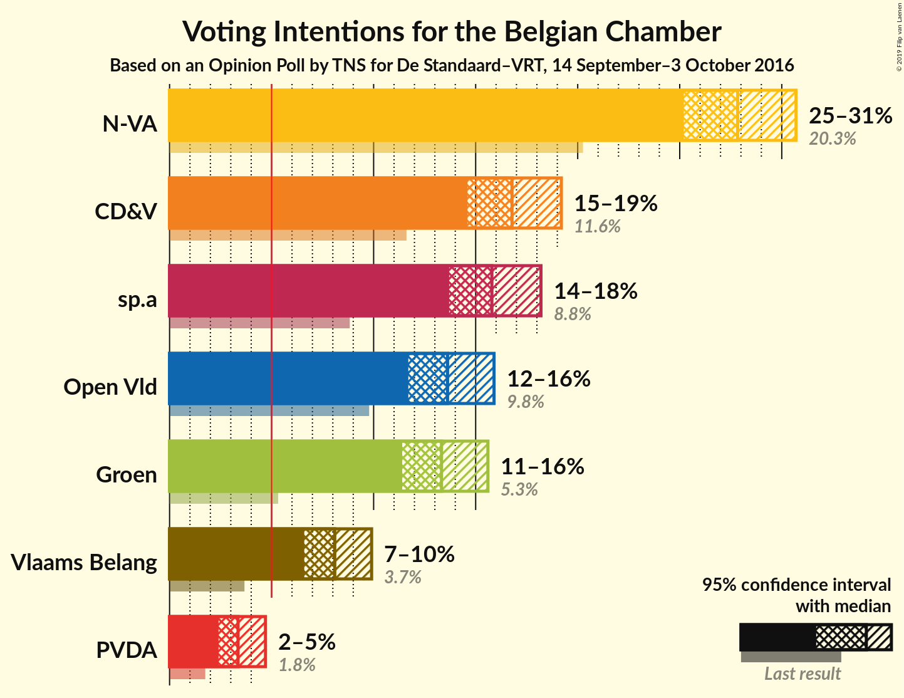
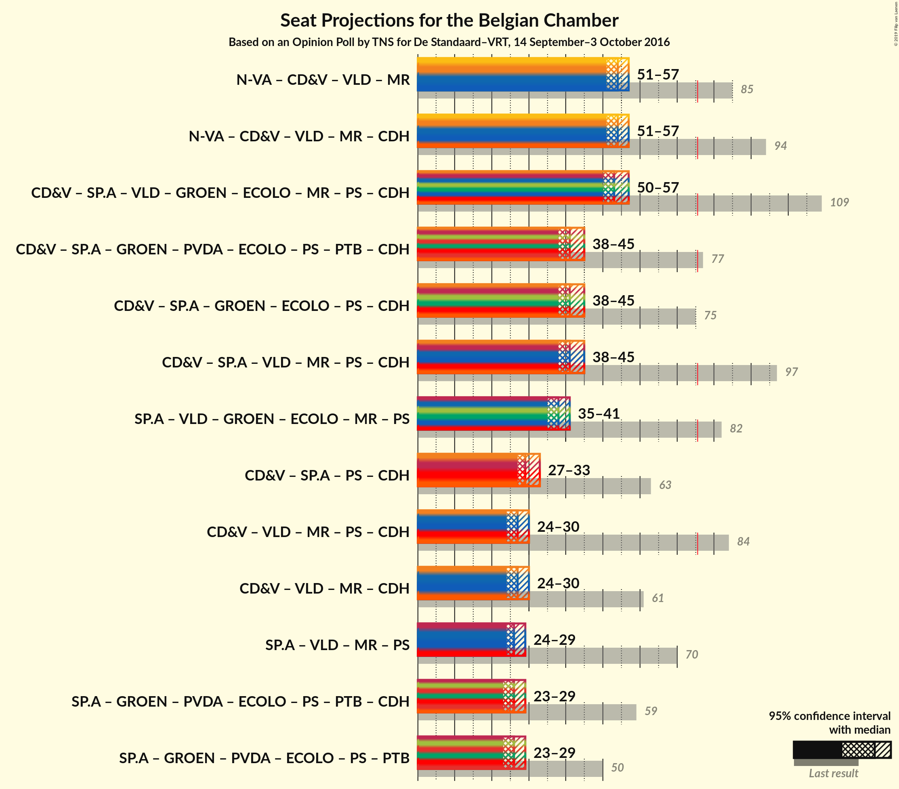

# Opinion Poll by TNS for De Standaard–VRT, 14 September–3 October 2016

Areas included: Flanders

<a href="#voting-intentions">Voting Intentions</a> | <a href="#seats">Seats</a> | <a href="#coalitions">Coalitions</a> | <a href="#technical-information">Technical Information</a>

## Voting Intentions

### Confidence Intervals

| Party | Last Result | Poll Result | 80% Confidence Interval | 90% Confidence Interval | 95% Confidence Interval | 99% Confidence Interval |
|:-----:|:-----------:|:-----------:|:-----------------------:|:-----------------------:|:-----------------------:|:-----------------------:|
| N-VA | 20.3% | 27.8% | 26.1–29.7% |25.6–30.2% |25.2–30.7% |24.3–31.6% |
| CD&V | 11.6% | 16.8% | 15.3–18.4% |15.0–18.8% |14.6–19.2% |13.9–20.0% |
| sp.a | 8.8% | 15.8% | 14.4–17.3% |14.0–17.8% |13.7–18.2% |13.0–18.9% |
| Open Vld | 9.8% | 13.6% | 12.3–15.1% |11.9–15.5% |11.6–15.9% |11.1–16.6% |
| Groen | 5.3% | 13.3% | 12.0–14.8% |11.7–15.2% |11.4–15.6% |10.8–16.3% |
| Vlaams Belang | 3.7% | 8.1% | 7.1–9.3% |6.8–9.6% |6.6–10.0% |6.1–10.5% |
| PVDA | 1.8% | 3.4% | 2.7–4.2% |2.6–4.5% |2.4–4.7% |2.1–5.1% |

*Note:* The poll result column reflects the actual value used in the calculations. Published results may vary slightly, and in addition be rounded to fewer digits.

## Seats

### Confidence Intervals

| Party | Last Result | Median | 80% Confidence Interval | 90% Confidence Interval | 95% Confidence Interval | 99% Confidence Interval |
|:-----:|:-----------:|:------:|:-----------------------:|:-----------------------:|:-----------------------:|:-----------------------:|
| <a href="#n-va">N-VA</a> | 33 | 27 | 25–29 |24–30 |24–30 |23–31 |
| <a href="#cd&v">CD&V</a> | 18 | 15 | 13–18 |13–18 |13–18 |13–18 |
| <a href="#sp.a">sp.a</a> | 13 | 14 | 13–16 |13–17 |13–17 |12–18 |
| <a href="#open-vld">Open Vld</a> | 14 | 12 | 11–13 |11–13 |11–14 |10–16 |
| <a href="#groen">Groen</a> | 6 | 12 | 11–12 |10–12 |10–13 |9–15 |
| <a href="#vlaams-belang">Vlaams Belang</a> | 3 | 7 | 5–8 |5–8 |5–8 |3–8 |
| <a href="#pvda">PVDA</a> | 0 | 0 | 0 |0 |0 |0 |

### N-VA

*For a full overview of the results for this party, see the [N-VA](party-nva.html) page.*

| Number of Seats | Probability | Accumulated | Special Marks |
|:---------------:|:-----------:|:-----------:|:-------------:|
| 22 | 0.1% | 100% |  |
| 23 | 0.7% | 99.9% |  |
| 24 | 6% | 99.2% |  |
| 25 | 9% | 93% |  |
| 26 | 21% | 84% |  |
| 27 | 29% | 63% | Median |
| 28 | 17% | 35% |  |
| 29 | 11% | 18% |  |
| 30 | 4% | 7% |  |
| 31 | 2% | 2% |  |
| 32 | 0.1% | 0.2% |  |
| 33 | 0% | 0% | Last Result |

### CD&V

*For a full overview of the results for this party, see the [CD&V](party-cdv.html) page.*

| Number of Seats | Probability | Accumulated | Special Marks |
|:---------------:|:-----------:|:-----------:|:-------------:|
| 12 | 0.1% | 100% |  |
| 13 | 23% | 99.9% |  |
| 14 | 16% | 77% |  |
| 15 | 21% | 61% | Median |
| 16 | 17% | 41% |  |
| 17 | 10% | 24% |  |
| 18 | 13% | 14% | Last Result |
| 19 | 0.3% | 0.3% |  |
| 20 | 0% | 0.1% |  |
| 21 | 0% | 0% |  |

### sp.a

*For a full overview of the results for this party, see the [sp.a](party-spa.html) page.*

| Number of Seats | Probability | Accumulated | Special Marks |
|:---------------:|:-----------:|:-----------:|:-------------:|
| 10 | 0.1% | 100% |  |
| 11 | 0.4% | 99.9% |  |
| 12 | 1.0% | 99.5% |  |
| 13 | 40% | 98% | Last Result |
| 14 | 19% | 59% | Median |
| 15 | 25% | 40% |  |
| 16 | 7% | 14% |  |
| 17 | 5% | 7% |  |
| 18 | 1.4% | 1.4% |  |
| 19 | 0% | 0% |  |

### Open Vld

*For a full overview of the results for this party, see the [Open Vld](party-openvld.html) page.*

| Number of Seats | Probability | Accumulated | Special Marks |
|:---------------:|:-----------:|:-----------:|:-------------:|
| 8 | 0.2% | 100% |  |
| 9 | 0.2% | 99.8% |  |
| 10 | 1.2% | 99.6% |  |
| 11 | 21% | 98% |  |
| 12 | 54% | 77% | Median |
| 13 | 20% | 23% |  |
| 14 | 2% | 3% | Last Result |
| 15 | 0.8% | 1.4% |  |
| 16 | 0.5% | 0.6% |  |
| 17 | 0.1% | 0.1% |  |
| 18 | 0% | 0% |  |

### Groen

*For a full overview of the results for this party, see the [Groen](party-groen.html) page.*

| Number of Seats | Probability | Accumulated | Special Marks |
|:---------------:|:-----------:|:-----------:|:-------------:|
| 6 | 0% | 100% | Last Result |
| 7 | 0% | 100% |  |
| 8 | 0.2% | 100% |  |
| 9 | 1.5% | 99.8% |  |
| 10 | 6% | 98% |  |
| 11 | 10% | 92% |  |
| 12 | 78% | 83% | Median |
| 13 | 3% | 5% |  |
| 14 | 1.1% | 2% |  |
| 15 | 0.9% | 1.1% |  |
| 16 | 0.3% | 0.3% |  |
| 17 | 0% | 0% |  |

### Vlaams Belang

*For a full overview of the results for this party, see the [Vlaams Belang](party-vlaamsbelang.html) page.*

| Number of Seats | Probability | Accumulated | Special Marks |
|:---------------:|:-----------:|:-----------:|:-------------:|
| 2 | 0.1% | 100% |  |
| 3 | 0.5% | 99.9% | Last Result |
| 4 | 0.5% | 99.3% |  |
| 5 | 10% | 98.8% |  |
| 6 | 23% | 89% |  |
| 7 | 42% | 66% | Median |
| 8 | 24% | 24% |  |
| 9 | 0% | 0% |  |

### PVDA

*For a full overview of the results for this party, see the [PVDA](party-pvda.html) page.*

| Number of Seats | Probability | Accumulated | Special Marks |
|:---------------:|:-----------:|:-----------:|:-------------:|
| 0 | 100% | 100% | Last Result, Median |

## Coalitions

### Confidence Intervals

| Coalition | Last Result | Median | Majority? | 80% Confidence Interval | 90% Confidence Interval | 95% Confidence Interval | 99% Confidence Interval |
|:---------:|:-----------:|:------:|:---------:|:-----------------------:|:-----------------------:|:-----------------------:|:-----------------------:|

## Technical Information

### Opinion Poll

+ **Polling firm:** TNS
+ **Commissioner(s):** De Standaard–VRT
+ **Fieldwork period:** 14 September–3 October 2016

### Calculations

+ **Sample size:** 1013
+ **Simulations done:** 1,048,576
+ **Error estimate:** 0.70%

