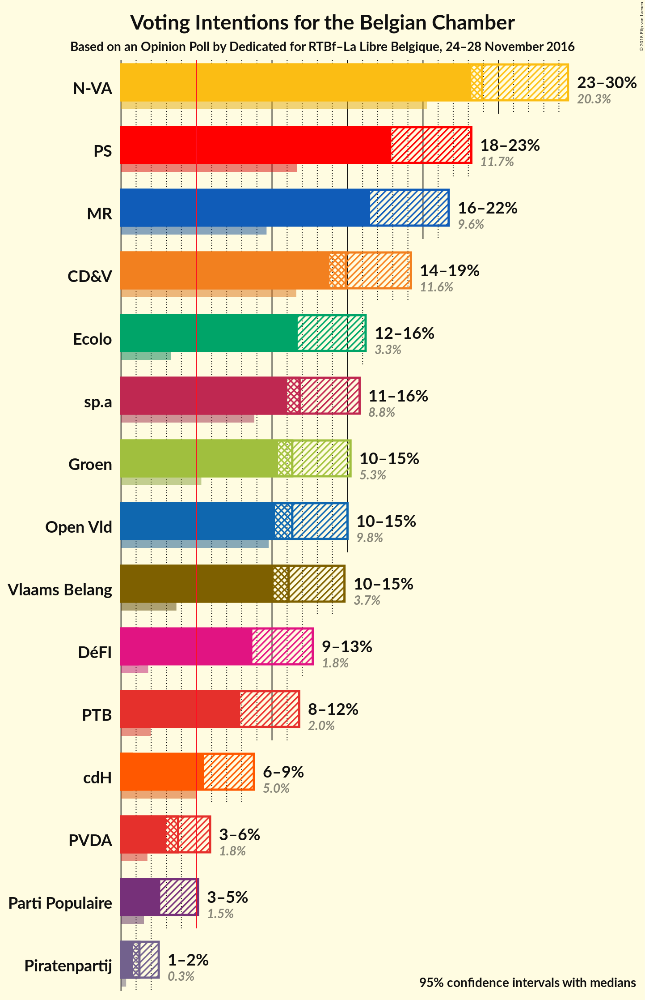
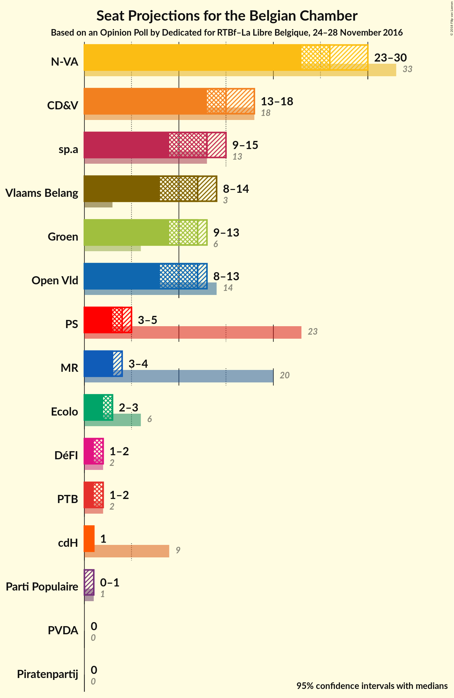
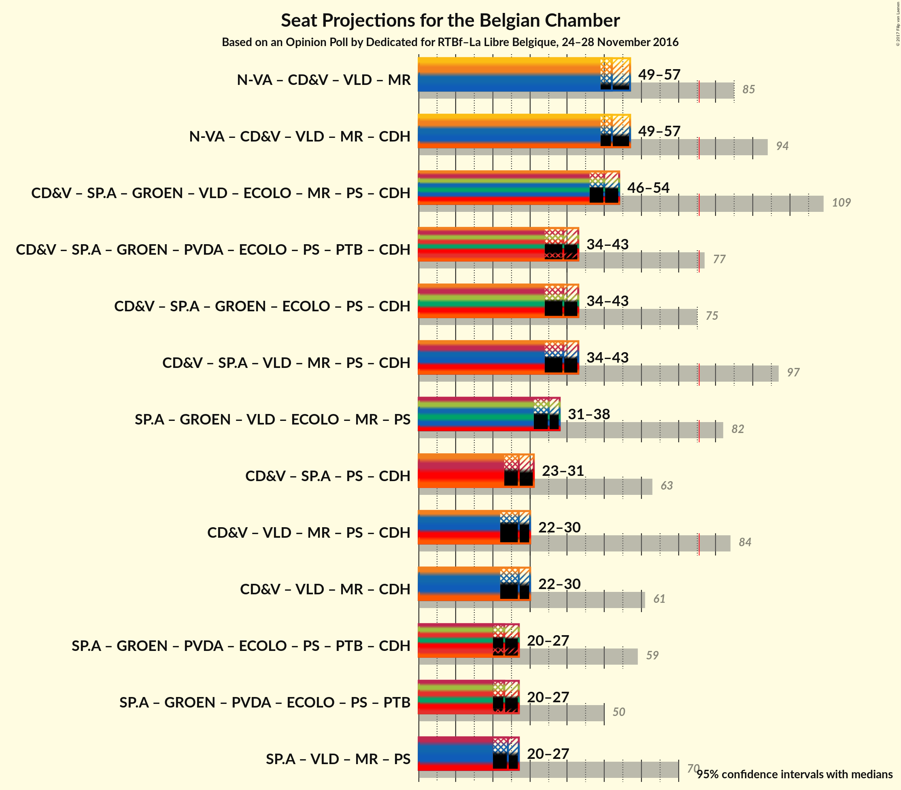

# Opinion Poll by Dedicated for RTBf–La Libre Belgique, 24–28 November 2016

Areas included: Flanders

<a href="#voting-intentions">Voting Intentions</a> | <a href="#seats">Seats</a> | <a href="#coalitions">Coalitions</a> | <a href="#technical-information">Technical Information</a>

## Voting Intentions

### Confidence Intervals

| Party | Last Result | Poll Result | 80% Confidence Interval | 90% Confidence Interval | 95% Confidence Interval | 99% Confidence Interval |
|:-----:|:-----------:|:-----------:|:-----------------------:|:-----------------------:|:-----------------------:|:-----------------------:|
| N-VA | 20.3% | 26.3% | 24.2–28.4% |23.7–29.0% |23.2–29.6% |22.3–30.6% |
| CD&V | 11.6% | 16.3% | 14.7–18.2% |14.2–18.7% |13.8–19.2% |13.1–20.1% |
| sp.a | 8.8% | 13.2% | 11.7–14.9% |11.3–15.4% |10.9–15.9% |10.3–16.7% |
| Groen | 5.3% | 12.7% | 11.2–14.4% |10.8–14.8% |10.4–15.3% |9.8–16.1% |
| Open Vld | 9.8% | 12.4% | 10.9–14.1% |10.5–14.6% |10.2–15.0% |9.5–15.8% |
| Vlaams Belang | 3.7% | 12.2% | 10.8–13.9% |10.4–14.4% |10.1–14.8% |9.4–15.7% |
| PVDA | 1.8% | 4.2% | 3.4–5.3% |3.2–5.7% |3.0–5.9% |2.6–6.5% |
| Piratenpartij | 0.3% | 1.4% | 0.9–2.1% |0.8–2.3% |0.7–2.5% |0.6–2.9% |

*Note:* The poll result column reflects the actual value used in the calculations. Published results may vary slightly, and in addition be rounded to fewer digits.

## Seats

### Confidence Intervals

| Party | Last Result | Median | 80% Confidence Interval | 90% Confidence Interval | 95% Confidence Interval | 99% Confidence Interval |
|:-----:|:-----------:|:------:|:-----------------------:|:-----------------------:|:-----------------------:|:-----------------------:|
| <a href="#n-va">N-VA</a> | 33 | 31 | 31 |27–31 |27–31 |26–31 |
| <a href="#cd&v">CD&V</a> | 18 | 14 | 14 |13–14 |13–14 |13–18 |
| <a href="#sp.a">sp.a</a> | 13 | 11 | 11 |11–14 |11–14 |9–14 |
| <a href="#groen">Groen</a> | 6 | 9 | 9 |9–10 |9–10 |9–11 |
| <a href="#open-vld">Open Vld</a> | 14 | 11 | 11 |8–11 |8–12 |8–13 |
| <a href="#vlaams-belang">Vlaams Belang</a> | 3 | 11 | 11 |11–15 |11–15 |8–15 |
| <a href="#pvda">PVDA</a> | 0 | 0 | 0 |0 |0 |0 |
| <a href="#piratenpartij">Piratenpartij</a> | 0 | 0 | 0 |0 |0 |0 |

### N-VA

*For a full overview of the results for this party, see the [N-VA](party-nva.html) page.*

| Number of Seats | Probability | Accumulated | Special Marks |
|:---------------:|:-----------:|:-----------:|:-------------:|
| 24 | 0.3% | 100% |  |
| 25 | 0.1% | 99.7% |  |
| 26 | 2% | 99.6% |  |
| 27 | 6% | 98% |  |
| 28 | 0.5% | 92% |  |
| 29 | 0.2% | 91% |  |
| 30 | 0.4% | 91% |  |
| 31 | 91% | 91% | Median |
| 32 | 0% | 0% |  |
| 33 | 0% | 0% | Last Result |

### CD&V

*For a full overview of the results for this party, see the [CD&V](party-cdv.html) page.*

| Number of Seats | Probability | Accumulated | Special Marks |
|:---------------:|:-----------:|:-----------:|:-------------:|
| 13 | 8% | 100% |  |
| 14 | 91% | 92% | Median |
| 15 | 0% | 1.5% |  |
| 16 | 0.7% | 1.5% |  |
| 17 | 0.2% | 0.8% |  |
| 18 | 0.6% | 0.6% | Last Result |
| 19 | 0% | 0% |  |

### sp.a

*For a full overview of the results for this party, see the [sp.a](party-spa.html) page.*

| Number of Seats | Probability | Accumulated | Special Marks |
|:---------------:|:-----------:|:-----------:|:-------------:|
| 8 | 0.1% | 100% |  |
| 9 | 0.5% | 99.9% |  |
| 10 | 0.5% | 99.4% |  |
| 11 | 91% | 98.9% | Median |
| 12 | 0% | 8% |  |
| 13 | 3% | 8% | Last Result |
| 14 | 5% | 5% |  |
| 15 | 0% | 0.1% |  |
| 16 | 0% | 0.1% |  |
| 17 | 0.1% | 0.1% |  |
| 18 | 0% | 0% |  |

### Groen

*For a full overview of the results for this party, see the [Groen](party-groen.html) page.*

| Number of Seats | Probability | Accumulated | Special Marks |
|:---------------:|:-----------:|:-----------:|:-------------:|
| 6 | 0% | 100% | Last Result |
| 7 | 0.1% | 100% |  |
| 8 | 0% | 99.9% |  |
| 9 | 91% | 99.9% | Median |
| 10 | 8% | 9% |  |
| 11 | 0.8% | 1.1% |  |
| 12 | 0.3% | 0.3% |  |
| 13 | 0% | 0% |  |

### Open Vld

*For a full overview of the results for this party, see the [Open Vld](party-openvld.html) page.*

| Number of Seats | Probability | Accumulated | Special Marks |
|:---------------:|:-----------:|:-----------:|:-------------:|
| 7 | 0.1% | 100% |  |
| 8 | 5% | 99.9% |  |
| 9 | 0.1% | 95% |  |
| 10 | 0.1% | 94% |  |
| 11 | 91% | 94% | Median |
| 12 | 1.3% | 3% |  |
| 13 | 2% | 2% |  |
| 14 | 0.1% | 0.2% | Last Result |
| 15 | 0% | 0.1% |  |
| 16 | 0% | 0.1% |  |
| 17 | 0.1% | 0.1% |  |
| 18 | 0% | 0% |  |

### Vlaams Belang

*For a full overview of the results for this party, see the [Vlaams Belang](party-vlaamsbelang.html) page.*

| Number of Seats | Probability | Accumulated | Special Marks |
|:---------------:|:-----------:|:-----------:|:-------------:|
| 3 | 0% | 100% | Last Result |
| 4 | 0% | 100% |  |
| 5 | 0% | 100% |  |
| 6 | 0% | 100% |  |
| 7 | 0% | 100% |  |
| 8 | 0.8% | 100% |  |
| 9 | 0.2% | 99.2% |  |
| 10 | 0.4% | 99.1% |  |
| 11 | 91% | 98.7% | Median |
| 12 | 2% | 8% |  |
| 13 | 0.1% | 6% |  |
| 14 | 0.1% | 6% |  |
| 15 | 5% | 5% |  |
| 16 | 0% | 0% |  |

### PVDA

*For a full overview of the results for this party, see the [PVDA](party-pvda.html) page.*

| Number of Seats | Probability | Accumulated | Special Marks |
|:---------------:|:-----------:|:-----------:|:-------------:|
| 0 | 100% | 100% | Last Result, Median |

### Piratenpartij

*For a full overview of the results for this party, see the [Piratenpartij](party-piratenpartij.html) page.*

| Number of Seats | Probability | Accumulated | Special Marks |
|:---------------:|:-----------:|:-----------:|:-------------:|
| 0 | 100% | 100% | Last Result, Median |

## Coalitions

### Confidence Intervals

| Coalition | Last Result | Median | Majority? | 80% Confidence Interval | 90% Confidence Interval | 95% Confidence Interval | 99% Confidence Interval |
|:---------:|:-----------:|:------:|:---------:|:-----------------------:|:-----------------------:|:-----------------------:|:-----------------------:|

## Technical Information

### Opinion Poll

+ **Pollster:** Dedicated
+ **Media:** RTBf–La Libre Belgique
+ **Fieldwork period:** 24–28 November 2016

### Calculations

+ **Sample size:** 735
+ **Simulations done:** 1,024
+ **Error estimate:** 3.52%

