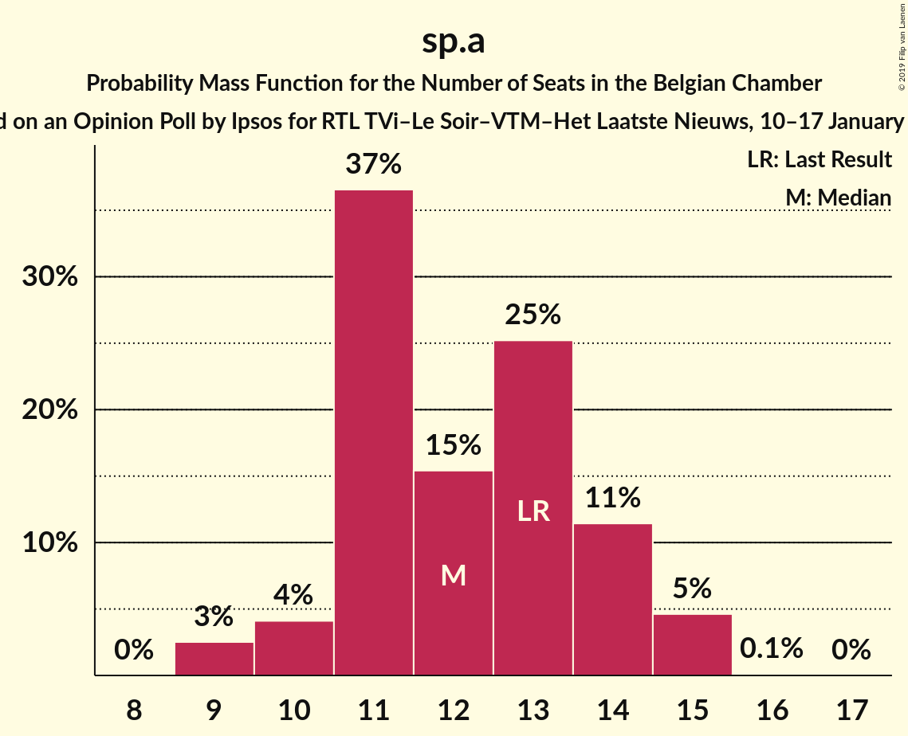

# Opinion Poll by Ipsos for RTL TVi–Le Soir–VTM–Het Laatste Nieuws, 10–17 January 2017

Areas included: Brussels, Flanders, Wallonia

<a href="#voting-intentions">Voting Intentions</a> | <a href="#seats">Seats</a> | <a href="#coalitions">Coalitions</a> | <a href="#technical-information">Technical Information</a>

## Voting Intentions

### Confidence Intervals

| Party | Last Result | Poll Result | 80% Confidence Interval | 90% Confidence Interval | 95% Confidence Interval | 99% Confidence Interval |
|:-----:|:-----------:|:-----------:|:-----------------------:|:-----------------------:|:-----------------------:|:-----------------------:|
| N-VA | 20.3% | 17.3% | 25.6–29.3% |25.1–29.8% |24.7–30.3% |23.8–31.2% |
| CD&V | 11.6% | 9.4% | 13.5–16.5% |13.2–16.9% |12.8–17.3% |12.2–18.1% |
| PS | 11.7% | 8.6% | N/A |N/A |N/A |N/A |
| sp.a | 8.8% | 8.3% | 11.9–14.7% |11.5–15.1% |11.2–15.5% |10.6–16.2% |
| Open Vld | 9.8% | 8.2% | 11.6–14.3% |11.2–14.8% |10.9–15.1% |10.3–15.9% |
| Groen | 5.3% | 7.6% | 11.0–13.7% |10.6–14.1% |10.3–14.5% |9.7–15.2% |
| MR | 9.6% | 7.3% | N/A |N/A |N/A |N/A |
| Vlaams Belang | 3.7% | 6.5% | 9.1–11.6% |8.8–12.0% |8.5–12.4% |8.0–13.0% |
| PTB | 2.0% | 5.9% | N/A |N/A |N/A |N/A |
| Ecolo | 3.3% | 4.4% | N/A |N/A |N/A |N/A |
| cdH | 5.0% | 4.0% | N/A |N/A |N/A |N/A |
| PVDA | 1.8% | 3.3% | 4.6–6.4% |4.3–6.8% |4.1–7.0% |3.8–7.5% |
| Parti Populaire | 1.5% | 1.7% | N/A |N/A |N/A |N/A |
| DéFI | 1.8% | 1.5% | N/A |N/A |N/A |N/A |
| La Droite | 0.4% | 1.1% | N/A |N/A |N/A |N/A |

*Note:* The poll result column reflects the actual value used in the calculations. Published results may vary slightly, and in addition be rounded to fewer digits.

## Seats

### Confidence Intervals

| Party | Last Result | Median | 80% Confidence Interval | 90% Confidence Interval | 95% Confidence Interval | 99% Confidence Interval |
|:-----:|:-----------:|:------:|:-----------------------:|:-----------------------:|:-----------------------:|:-----------------------:|
| <a href="#n-va">N-VA</a> | 33 | 29 | 27–31 |26–31 |25–32 |24–33 |
| <a href="#cd&v">CD&V</a> | 18 | 14 | 13–16 |13–17 |13–18 |12–18 |
| <a href="#ps">PS</a> | 23 | 18 | 16–20 |16–20 |16–20 |15–21 |
| <a href="#sp.a">sp.a</a> | 13 | 13 | 11–14 |10–14 |9–15 |9–15 |
| <a href="#open-vld">Open Vld</a> | 14 | 12 | 11–13 |11–13 |11–14 |9–16 |
| <a href="#groen">Groen</a> | 6 | 12 | 10–12 |10–12 |9–12 |8–14 |
| <a href="#mr">MR</a> | 20 | 16 | 14–17 |13–17 |13–18 |12–18 |
| <a href="#vlaams-belang">Vlaams Belang</a> | 3 | 8 | 8–11 |8–12 |7–12 |7–12 |
| <a href="#ptb">PTB</a> | 2 | 10 | 10–12 |9–12 |9–12 |9–13 |
| <a href="#ecolo">Ecolo</a> | 6 | 8 | 7–9 |7–10 |6–10 |6–10 |
| <a href="#cdh">cdH</a> | 9 | 7 | 6–9 |5–9 |5–9 |4–10 |
| <a href="#pvda">PVDA</a> | 0 | 0 | 0 |0 |0 |0 |
| <a href="#parti-populaire">Parti Populaire</a> | 1 | 1 | 0–2 |0–2 |0–2 |0–2 |
| <a href="#défi">DéFI</a> | 2 | 1 | 1–2 |1–2 |1–2 |1–2 |
| <a href="#la-droite">La Droite</a> | 0 | 0 | 0–1 |0–1 |0–1 |0–2 |

### N-VA

*For a full overview of the results for this party, see the [N-VA](party-n-va.html) page.*

| Number of Seats | Probability | Accumulated | Special Marks |
|:---------------:|:-----------:|:-----------:|:-------------:|
| 24 | 1.2% | 100% |  |
| 25 | 3% | 98.7% |  |
| 26 | 4% | 96% |  |
| 27 | 11% | 92% |  |
| 28 | 27% | 81% |  |
| 29 | 28% | 54% | Median |
| 30 | 14% | 27% |  |
| 31 | 8% | 13% |  |
| 32 | 4% | 5% |  |
| 33 | 0.9% | 1.2% | Last Result |
| 34 | 0.2% | 0.3% |  |
| 35 | 0% | 0% |  |

### CD&V

*For a full overview of the results for this party, see the [CD&V](party-cdv.html) page.*

| Number of Seats | Probability | Accumulated | Special Marks |
|:---------------:|:-----------:|:-----------:|:-------------:|
| 10 | 0.1% | 100% |  |
| 11 | 0.2% | 99.8% |  |
| 12 | 1.1% | 99.6% |  |
| 13 | 31% | 98.5% |  |
| 14 | 39% | 67% | Median |
| 15 | 9% | 28% |  |
| 16 | 9% | 19% |  |
| 17 | 6% | 10% |  |
| 18 | 4% | 4% | Last Result |
| 19 | 0% | 0% |  |

### PS

*For a full overview of the results for this party, see the [PS](party-ps.html) page.*

| Number of Seats | Probability | Accumulated | Special Marks |
|:---------------:|:-----------:|:-----------:|:-------------:|
| 15 | 2% | 100% |  |
| 16 | 11% | 98% |  |
| 17 | 27% | 86% |  |
| 18 | 31% | 59% | Median |
| 19 | 16% | 28% |  |
| 20 | 11% | 12% |  |
| 21 | 0.7% | 0.8% |  |
| 22 | 0.2% | 0.2% |  |
| 23 | 0% | 0% | Last Result |

### sp.a

*For a full overview of the results for this party, see the [sp.a](party-spa.html) page.*

| Number of Seats | Probability | Accumulated | Special Marks |
|:---------------:|:-----------:|:-----------:|:-------------:|
| 9 | 3% | 100% |  |
| 10 | 4% | 97% |  |
| 11 | 17% | 94% |  |
| 12 | 13% | 77% |  |
| 13 | 46% | 64% | Last Result, Median |
| 14 | 14% | 18% |  |
| 15 | 4% | 5% |  |
| 16 | 0.3% | 0.4% |  |
| 17 | 0.1% | 0.1% |  |
| 18 | 0% | 0% |  |

### Open Vld

*For a full overview of the results for this party, see the [Open Vld](party-openvld.html) page.*

| Number of Seats | Probability | Accumulated | Special Marks |
|:---------------:|:-----------:|:-----------:|:-------------:|
| 8 | 0.5% | 100% |  |
| 9 | 0.6% | 99.5% |  |
| 10 | 0.5% | 98.9% |  |
| 11 | 22% | 98% |  |
| 12 | 53% | 76% | Median |
| 13 | 19% | 23% |  |
| 14 | 3% | 4% | Last Result |
| 15 | 0.8% | 2% |  |
| 16 | 0.5% | 0.8% |  |
| 17 | 0.2% | 0.3% |  |
| 18 | 0% | 0% |  |

### Groen

*For a full overview of the results for this party, see the [Groen](party-groen.html) page.*

| Number of Seats | Probability | Accumulated | Special Marks |
|:---------------:|:-----------:|:-----------:|:-------------:|
| 6 | 0% | 100% | Last Result |
| 7 | 0% | 100% |  |
| 8 | 0.5% | 100% |  |
| 9 | 2% | 99.4% |  |
| 10 | 14% | 97% |  |
| 11 | 18% | 83% |  |
| 12 | 64% | 66% | Median |
| 13 | 1.2% | 2% |  |
| 14 | 0.3% | 0.7% |  |
| 15 | 0.2% | 0.4% |  |
| 16 | 0.1% | 0.2% |  |
| 17 | 0% | 0% |  |

### MR

*For a full overview of the results for this party, see the [MR](party-mr.html) page.*

| Number of Seats | Probability | Accumulated | Special Marks |
|:---------------:|:-----------:|:-----------:|:-------------:|
| 12 | 1.0% | 100% |  |
| 13 | 6% | 99.0% |  |
| 14 | 14% | 93% |  |
| 15 | 18% | 79% |  |
| 16 | 33% | 61% | Median |
| 17 | 24% | 28% |  |
| 18 | 4% | 4% |  |
| 19 | 0.2% | 0.2% |  |
| 20 | 0% | 0% | Last Result |

### Vlaams Belang

*For a full overview of the results for this party, see the [Vlaams Belang](party-vlaamsbelang.html) page.*

| Number of Seats | Probability | Accumulated | Special Marks |
|:---------------:|:-----------:|:-----------:|:-------------:|
| 3 | 0% | 100% | Last Result |
| 4 | 0% | 100% |  |
| 5 | 0% | 100% |  |
| 6 | 0.1% | 100% |  |
| 7 | 3% | 99.9% |  |
| 8 | 72% | 97% | Median |
| 9 | 10% | 25% |  |
| 10 | 5% | 15% |  |
| 11 | 4% | 11% |  |
| 12 | 7% | 7% |  |
| 13 | 0.3% | 0.3% |  |
| 14 | 0% | 0% |  |

### PTB

*For a full overview of the results for this party, see the [PTB](party-ptb.html) page.*

| Number of Seats | Probability | Accumulated | Special Marks |
|:---------------:|:-----------:|:-----------:|:-------------:|
| 2 | 0% | 100% | Last Result |
| 3 | 0% | 100% |  |
| 4 | 0% | 100% |  |
| 5 | 0% | 100% |  |
| 6 | 0% | 100% |  |
| 7 | 0% | 100% |  |
| 8 | 0.1% | 100% |  |
| 9 | 7% | 99.9% |  |
| 10 | 44% | 92% | Median |
| 11 | 37% | 48% |  |
| 12 | 11% | 12% |  |
| 13 | 1.2% | 1.3% |  |
| 14 | 0.1% | 0.1% |  |
| 15 | 0% | 0% |  |

### Ecolo

*For a full overview of the results for this party, see the [Ecolo](party-ecolo.html) page.*

| Number of Seats | Probability | Accumulated | Special Marks |
|:---------------:|:-----------:|:-----------:|:-------------:|
| 5 | 0.2% | 100% |  |
| 6 | 2% | 99.8% | Last Result |
| 7 | 13% | 97% |  |
| 8 | 36% | 85% | Median |
| 9 | 42% | 48% |  |
| 10 | 6% | 6% |  |
| 11 | 0.4% | 0.5% |  |
| 12 | 0.1% | 0.1% |  |
| 13 | 0% | 0% |  |

### cdH

*For a full overview of the results for this party, see the [cdH](party-cdh.html) page.*

| Number of Seats | Probability | Accumulated | Special Marks |
|:---------------:|:-----------:|:-----------:|:-------------:|
| 4 | 0.9% | 100% |  |
| 5 | 6% | 99.1% |  |
| 6 | 21% | 93% |  |
| 7 | 30% | 72% | Median |
| 8 | 27% | 42% |  |
| 9 | 14% | 15% | Last Result |
| 10 | 1.1% | 1.1% |  |
| 11 | 0% | 0% |  |

### PVDA

*For a full overview of the results for this party, see the [PVDA](party-pvda.html) page.*

| Number of Seats | Probability | Accumulated | Special Marks |
|:---------------:|:-----------:|:-----------:|:-------------:|
| 0 | 100% | 100% | Last Result, Median |

### Parti Populaire

*For a full overview of the results for this party, see the [Parti Populaire](party-partipopulaire.html) page.*

| Number of Seats | Probability | Accumulated | Special Marks |
|:---------------:|:-----------:|:-----------:|:-------------:|
| 0 | 37% | 100% |  |
| 1 | 16% | 63% | Last Result, Median |
| 2 | 47% | 47% |  |
| 3 | 0% | 0% |  |

### DéFI

*For a full overview of the results for this party, see the [DéFI](party-défi.html) page.*

| Number of Seats | Probability | Accumulated | Special Marks |
|:---------------:|:-----------:|:-----------:|:-------------:|
| 1 | 60% | 100% | Median |
| 2 | 40% | 40% | Last Result |
| 3 | 0.2% | 0.2% |  |
| 4 | 0% | 0% |  |

### La Droite

*For a full overview of the results for this party, see the [La Droite](party-ladroite.html) page.*

| Number of Seats | Probability | Accumulated | Special Marks |
|:---------------:|:-----------:|:-----------:|:-------------:|
| 0 | 69% | 100% | Last Result, Median |
| 1 | 30% | 31% |  |
| 2 | 0.6% | 0.6% |  |
| 3 | 0% | 0% |  |

## Coalitions

### Confidence Intervals

| Coalition | Last Result | Median | Majority? | 80% Confidence Interval | 90% Confidence Interval | 95% Confidence Interval | 99% Confidence Interval |
|:---------:|:-----------:|:------:|:---------:|:-----------------------:|:-----------------------:|:-----------------------:|:-----------------------:|
| CD&V – PS – sp.a – Open Vld – Groen – MR – Ecolo – cdH | 109 | 100 | 100% | 97–102 | 96–103 | 95–103 | 94–105 |
| CD&V – PS – sp.a – Groen – PTB – Ecolo – cdH – PVDA | 77 | 82 | 99.8% | 79–85 | 79–86 | 78–87 | 76–88 |
| CD&V – PS – sp.a – Open Vld – MR – cdH | 97 | 80 | 97% | 77–82 | 76–83 | 75–84 | 74–85 |
| PS – sp.a – Open Vld – Groen – MR – Ecolo | 82 | 78 | 87% | 75–81 | 74–81 | 74–82 | 72–83 |
| N-VA – CD&V – Open Vld – MR – cdH | 94 | 78 | 85% | 75–81 | 74–81 | 73–82 | 72–84 |
| CD&V – PS – sp.a – Groen – Ecolo – cdH | 75 | 72 | 6% | 69–75 | 68–76 | 67–77 | 66–78 |
| N-VA – CD&V – Open Vld – MR | 85 | 71 | 1.0% | 68–73 | 67–74 | 66–75 | 65–76 |
| CD&V – Open Vld – Groen – MR – Ecolo – cdH | 73 | 69 | 0.1% | 66–72 | 65–73 | 65–73 | 63–75 |
| PS – sp.a – Groen – PTB – Ecolo – cdH – PVDA | 59 | 68 | 0% | 65–71 | 65–72 | 64–72 | 62–74 |
| CD&V – PS – Open Vld – MR – cdH | 84 | 67 | 0% | 65–70 | 64–71 | 63–71 | 62–72 |
| PS – sp.a – Groen – PTB – Ecolo – PVDA | 50 | 61 | 0% | 58–64 | 57–64 | 57–65 | 55–66 |
| PS – sp.a – Open Vld – MR | 70 | 58 | 0% | 56–60 | 55–61 | 54–62 | 53–63 |
| CD&V – PS – sp.a – cdH | 63 | 52 | 0% | 49–55 | 48–56 | 48–57 | 46–58 |
| CD&V – Open Vld – MR – cdH | 61 | 49 | 0% | 46–52 | 46–53 | 45–53 | 44–55 |

### CD&V – PS – sp.a – Open Vld – Groen – MR – Ecolo – cdH

| Number of Seats | Probability | Accumulated | Special Marks |
|:---------------:|:-----------:|:-----------:|:-------------:|
| 92 | 0.1% | 100% |  |
| 93 | 0.3% | 99.9% |  |
| 94 | 0.8% | 99.6% |  |
| 95 | 2% | 98.8% |  |
| 96 | 5% | 97% |  |
| 97 | 9% | 92% |  |
| 98 | 14% | 82% |  |
| 99 | 18% | 68% |  |
| 100 | 21% | 50% | Median |
| 101 | 15% | 30% |  |
| 102 | 9% | 14% |  |
| 103 | 4% | 6% |  |
| 104 | 1.4% | 2% |  |
| 105 | 0.5% | 0.7% |  |
| 106 | 0.2% | 0.2% |  |
| 107 | 0% | 0% |  |
| 108 | 0% | 0% |  |
| 109 | 0% | 0% | Last Result |

### CD&V – PS – sp.a – Groen – PTB – Ecolo – cdH – PVDA

| Number of Seats | Probability | Accumulated | Special Marks |
|:---------------:|:-----------:|:-----------:|:-------------:|
| 75 | 0.1% | 100% |  |
| 76 | 0.4% | 99.8% | Majority |
| 77 | 1.1% | 99.5% | Last Result |
| 78 | 3% | 98% |  |
| 79 | 6% | 95% |  |
| 80 | 11% | 89% |  |
| 81 | 15% | 78% |  |
| 82 | 18% | 63% | Median |
| 83 | 17% | 45% |  |
| 84 | 13% | 29% |  |
| 85 | 8% | 16% |  |
| 86 | 5% | 8% |  |
| 87 | 2% | 4% |  |
| 88 | 0.9% | 1.4% |  |
| 89 | 0.3% | 0.5% |  |
| 90 | 0.1% | 0.1% |  |
| 91 | 0% | 0% |  |

### CD&V – PS – sp.a – Open Vld – MR – cdH

| Number of Seats | Probability | Accumulated | Special Marks |
|:---------------:|:-----------:|:-----------:|:-------------:|
| 72 | 0.1% | 100% |  |
| 73 | 0.2% | 99.9% |  |
| 74 | 0.8% | 99.7% |  |
| 75 | 2% | 98.9% |  |
| 76 | 4% | 97% | Majority |
| 77 | 8% | 92% |  |
| 78 | 14% | 84% |  |
| 79 | 19% | 70% |  |
| 80 | 19% | 51% | Median |
| 81 | 15% | 32% |  |
| 82 | 9% | 17% |  |
| 83 | 5% | 8% |  |
| 84 | 2% | 3% |  |
| 85 | 0.8% | 1.0% |  |
| 86 | 0.2% | 0.2% |  |
| 87 | 0% | 0% |  |
| 88 | 0% | 0% |  |
| 89 | 0% | 0% |  |
| 90 | 0% | 0% |  |
| 91 | 0% | 0% |  |
| 92 | 0% | 0% |  |
| 93 | 0% | 0% |  |
| 94 | 0% | 0% |  |
| 95 | 0% | 0% |  |
| 96 | 0% | 0% |  |
| 97 | 0% | 0% | Last Result |

### PS – sp.a – Open Vld – Groen – MR – Ecolo

| Number of Seats | Probability | Accumulated | Special Marks |
|:---------------:|:-----------:|:-----------:|:-------------:|
| 71 | 0.1% | 100% |  |
| 72 | 0.5% | 99.8% |  |
| 73 | 1.4% | 99.3% |  |
| 74 | 4% | 98% |  |
| 75 | 7% | 94% |  |
| 76 | 12% | 87% | Majority |
| 77 | 17% | 75% |  |
| 78 | 19% | 58% |  |
| 79 | 17% | 40% | Median |
| 80 | 12% | 23% |  |
| 81 | 7% | 11% |  |
| 82 | 3% | 5% | Last Result |
| 83 | 1.1% | 2% |  |
| 84 | 0.4% | 0.5% |  |
| 85 | 0.1% | 0.1% |  |
| 86 | 0% | 0% |  |

### N-VA – CD&V – Open Vld – MR – cdH

| Number of Seats | Probability | Accumulated | Special Marks |
|:---------------:|:-----------:|:-----------:|:-------------:|
| 70 | 0.1% | 100% |  |
| 71 | 0.3% | 99.9% |  |
| 72 | 0.8% | 99.6% |  |
| 73 | 2% | 98.8% |  |
| 74 | 4% | 97% |  |
| 75 | 8% | 93% |  |
| 76 | 12% | 85% | Majority |
| 77 | 16% | 73% |  |
| 78 | 18% | 56% | Median |
| 79 | 16% | 39% |  |
| 80 | 11% | 23% |  |
| 81 | 7% | 11% |  |
| 82 | 3% | 5% |  |
| 83 | 1.1% | 2% |  |
| 84 | 0.4% | 0.5% |  |
| 85 | 0.1% | 0.1% |  |
| 86 | 0% | 0% |  |
| 87 | 0% | 0% |  |
| 88 | 0% | 0% |  |
| 89 | 0% | 0% |  |
| 90 | 0% | 0% |  |
| 91 | 0% | 0% |  |
| 92 | 0% | 0% |  |
| 93 | 0% | 0% |  |
| 94 | 0% | 0% | Last Result |

### CD&V – PS – sp.a – Groen – Ecolo – cdH

| Number of Seats | Probability | Accumulated | Special Marks |
|:---------------:|:-----------:|:-----------:|:-------------:|
| 64 | 0.1% | 100% |  |
| 65 | 0.2% | 99.9% |  |
| 66 | 0.6% | 99.7% |  |
| 67 | 2% | 99.1% |  |
| 68 | 5% | 97% |  |
| 69 | 9% | 93% |  |
| 70 | 13% | 84% |  |
| 71 | 17% | 70% |  |
| 72 | 18% | 53% | Median |
| 73 | 14% | 35% |  |
| 74 | 9% | 21% |  |
| 75 | 6% | 12% | Last Result |
| 76 | 4% | 6% | Majority |
| 77 | 2% | 3% |  |
| 78 | 0.7% | 1.0% |  |
| 79 | 0.2% | 0.3% |  |
| 80 | 0.1% | 0.1% |  |
| 81 | 0% | 0% |  |

### N-VA – CD&V – Open Vld – MR

| Number of Seats | Probability | Accumulated | Special Marks |
|:---------------:|:-----------:|:-----------:|:-------------:|
| 63 | 0.1% | 100% |  |
| 64 | 0.3% | 99.9% |  |
| 65 | 0.8% | 99.6% |  |
| 66 | 2% | 98.7% |  |
| 67 | 5% | 97% |  |
| 68 | 8% | 92% |  |
| 69 | 13% | 84% |  |
| 70 | 17% | 71% |  |
| 71 | 19% | 53% | Median |
| 72 | 16% | 34% |  |
| 73 | 11% | 19% |  |
| 74 | 5% | 8% |  |
| 75 | 2% | 3% |  |
| 76 | 0.7% | 1.0% | Majority |
| 77 | 0.2% | 0.3% |  |
| 78 | 0.1% | 0.1% |  |
| 79 | 0% | 0% |  |
| 80 | 0% | 0% |  |
| 81 | 0% | 0% |  |
| 82 | 0% | 0% |  |
| 83 | 0% | 0% |  |
| 84 | 0% | 0% |  |
| 85 | 0% | 0% | Last Result |

### CD&V – Open Vld – Groen – MR – Ecolo – cdH

| Number of Seats | Probability | Accumulated | Special Marks |
|:---------------:|:-----------:|:-----------:|:-------------:|
| 61 | 0% | 100% |  |
| 62 | 0.2% | 99.9% |  |
| 63 | 0.5% | 99.8% |  |
| 64 | 1.5% | 99.3% |  |
| 65 | 3% | 98% |  |
| 66 | 7% | 94% |  |
| 67 | 11% | 88% |  |
| 68 | 17% | 77% |  |
| 69 | 19% | 60% | Median |
| 70 | 17% | 41% |  |
| 71 | 12% | 24% |  |
| 72 | 7% | 12% |  |
| 73 | 3% | 6% | Last Result |
| 74 | 1.5% | 2% |  |
| 75 | 0.5% | 0.6% |  |
| 76 | 0.1% | 0.1% | Majority |
| 77 | 0% | 0% |  |

### PS – sp.a – Groen – PTB – Ecolo – cdH – PVDA

| Number of Seats | Probability | Accumulated | Special Marks |
|:---------------:|:-----------:|:-----------:|:-------------:|
| 59 | 0% | 100% | Last Result |
| 60 | 0% | 100% |  |
| 61 | 0.1% | 100% |  |
| 62 | 0.4% | 99.9% |  |
| 63 | 1.1% | 99.5% |  |
| 64 | 3% | 98% |  |
| 65 | 7% | 95% |  |
| 66 | 13% | 88% |  |
| 67 | 17% | 76% |  |
| 68 | 19% | 59% | Median |
| 69 | 16% | 40% |  |
| 70 | 12% | 24% |  |
| 71 | 7% | 12% |  |
| 72 | 3% | 6% |  |
| 73 | 2% | 2% |  |
| 74 | 0.5% | 0.7% |  |
| 75 | 0.1% | 0.2% |  |
| 76 | 0% | 0% | Majority |

### CD&V – PS – Open Vld – MR – cdH

| Number of Seats | Probability | Accumulated | Special Marks |
|:---------------:|:-----------:|:-----------:|:-------------:|
| 60 | 0.1% | 100% |  |
| 61 | 0.2% | 99.9% |  |
| 62 | 0.7% | 99.7% |  |
| 63 | 2% | 99.1% |  |
| 64 | 7% | 97% |  |
| 65 | 14% | 90% |  |
| 66 | 19% | 77% |  |
| 67 | 19% | 58% | Median |
| 68 | 16% | 38% |  |
| 69 | 11% | 22% |  |
| 70 | 6% | 11% |  |
| 71 | 3% | 5% |  |
| 72 | 1.3% | 2% |  |
| 73 | 0.3% | 0.5% |  |
| 74 | 0.1% | 0.1% |  |
| 75 | 0% | 0% |  |
| 76 | 0% | 0% | Majority |
| 77 | 0% | 0% |  |
| 78 | 0% | 0% |  |
| 79 | 0% | 0% |  |
| 80 | 0% | 0% |  |
| 81 | 0% | 0% |  |
| 82 | 0% | 0% |  |
| 83 | 0% | 0% |  |
| 84 | 0% | 0% | Last Result |

### PS – sp.a – Groen – PTB – Ecolo – PVDA

| Number of Seats | Probability | Accumulated | Special Marks |
|:---------------:|:-----------:|:-----------:|:-------------:|
| 50 | 0% | 100% | Last Result |
| 51 | 0% | 100% |  |
| 52 | 0% | 100% |  |
| 53 | 0% | 100% |  |
| 54 | 0.2% | 99.9% |  |
| 55 | 0.5% | 99.8% |  |
| 56 | 2% | 99.2% |  |
| 57 | 4% | 98% |  |
| 58 | 8% | 94% |  |
| 59 | 13% | 86% |  |
| 60 | 17% | 73% |  |
| 61 | 18% | 55% | Median |
| 62 | 16% | 37% |  |
| 63 | 11% | 21% |  |
| 64 | 6% | 11% |  |
| 65 | 3% | 4% |  |
| 66 | 1.1% | 2% |  |
| 67 | 0.3% | 0.5% |  |
| 68 | 0.1% | 0.1% |  |
| 69 | 0% | 0% |  |

### PS – sp.a – Open Vld – MR

| Number of Seats | Probability | Accumulated | Special Marks |
|:---------------:|:-----------:|:-----------:|:-------------:|
| 51 | 0.1% | 100% |  |
| 52 | 0.3% | 99.9% |  |
| 53 | 1.0% | 99.7% |  |
| 54 | 3% | 98.6% |  |
| 55 | 6% | 96% |  |
| 56 | 11% | 90% |  |
| 57 | 16% | 79% |  |
| 58 | 20% | 63% |  |
| 59 | 20% | 43% | Median |
| 60 | 13% | 23% |  |
| 61 | 6% | 10% |  |
| 62 | 2% | 3% |  |
| 63 | 0.8% | 1.1% |  |
| 64 | 0.2% | 0.3% |  |
| 65 | 0.1% | 0.1% |  |
| 66 | 0% | 0% |  |
| 67 | 0% | 0% |  |
| 68 | 0% | 0% |  |
| 69 | 0% | 0% |  |
| 70 | 0% | 0% | Last Result |

### CD&V – PS – sp.a – cdH

| Number of Seats | Probability | Accumulated | Special Marks |
|:---------------:|:-----------:|:-----------:|:-------------:|
| 45 | 0.1% | 100% |  |
| 46 | 0.6% | 99.8% |  |
| 47 | 2% | 99.3% |  |
| 48 | 4% | 98% |  |
| 49 | 8% | 94% |  |
| 50 | 13% | 86% |  |
| 51 | 18% | 73% |  |
| 52 | 18% | 55% | Median |
| 53 | 14% | 37% |  |
| 54 | 10% | 23% |  |
| 55 | 7% | 13% |  |
| 56 | 4% | 6% |  |
| 57 | 2% | 3% |  |
| 58 | 0.7% | 1.1% |  |
| 59 | 0.3% | 0.4% |  |
| 60 | 0.1% | 0.1% |  |
| 61 | 0% | 0% |  |
| 62 | 0% | 0% |  |
| 63 | 0% | 0% | Last Result |

### CD&V – Open Vld – MR – cdH

| Number of Seats | Probability | Accumulated | Special Marks |
|:---------------:|:-----------:|:-----------:|:-------------:|
| 42 | 0.1% | 100% |  |
| 43 | 0.2% | 99.9% |  |
| 44 | 0.9% | 99.7% |  |
| 45 | 3% | 98.8% |  |
| 46 | 6% | 96% |  |
| 47 | 12% | 90% |  |
| 48 | 17% | 78% |  |
| 49 | 19% | 61% | Median |
| 50 | 16% | 42% |  |
| 51 | 12% | 26% |  |
| 52 | 7% | 14% |  |
| 53 | 4% | 7% |  |
| 54 | 2% | 2% |  |
| 55 | 0.5% | 0.7% |  |
| 56 | 0.1% | 0.2% |  |
| 57 | 0% | 0% |  |
| 58 | 0% | 0% |  |
| 59 | 0% | 0% |  |
| 60 | 0% | 0% |  |
| 61 | 0% | 0% | Last Result |

## Technical Information

### Opinion Poll

+ **Polling firm:** Ipsos
+ **Commissioner(s):** RTL TVi–Le Soir–VTM–Het Laatste Nieuws
+ **Fieldwork period:** 10–17 January 2017

### Calculations

+ **Sample size:** 1557
+ **Simulations done:** 1,048,576
+ **Error estimate:** 1.83%

