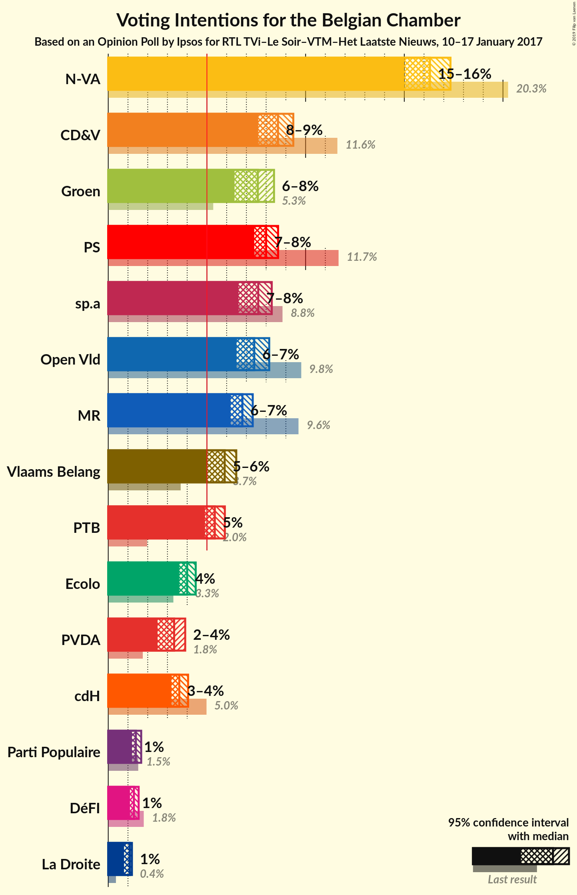

# Opinion Poll by Ipsos for RTL TVi–Le Soir–VTM–Het Laatste Nieuws, 10–17 January 2017

Areas included: Flanders, Wallonia

<a href="#voting-intentions">Voting Intentions</a> | <a href="#seats">Seats</a> | <a href="#coalitions">Coalitions</a> | <a href="#technical-information">Technical Information</a>

## Voting Intentions

### Confidence Intervals

| Party | Last Result | Poll Result | 80% Confidence Interval | 90% Confidence Interval | 95% Confidence Interval | 99% Confidence Interval |
|:-----:|:-----------:|:-----------:|:-----------------------:|:-----------------------:|:-----------------------:|:-----------------------:|
| N-VA | 20.3% | 18.3% | 25.6–29.3% |25.1–29.8% |24.7–30.3% |23.8–31.2% |
| CD&V | 11.6% | 10.0% | 13.5–16.5% |13.2–16.9% |12.8–17.3% |12.2–18.1% |
| sp.a | 8.8% | 8.8% | 11.9–14.7% |11.5–15.1% |11.2–15.5% |10.6–16.2% |
| Open Vld | 9.8% | 8.6% | 11.6–14.3% |11.2–14.8% |10.9–15.1% |10.3–15.9% |
| Groen | 5.3% | 8.2% | 11.0–13.7% |10.6–14.1% |10.3–14.5% |9.7–15.2% |
| PS | 11.7% | 7.8% | N/A |N/A |N/A |N/A |
| Vlaams Belang | 3.7% | 6.9% | 9.1–11.6% |8.8–12.0% |8.5–12.4% |8.0–13.0% |
| MR | 9.6% | 6.4% | N/A |N/A |N/A |N/A |
| PTB | 2.0% | 5.4% | N/A |N/A |N/A |N/A |
| cdH | 5.0% | 3.7% | N/A |N/A |N/A |N/A |
| Ecolo | 3.3% | 3.7% | N/A |N/A |N/A |N/A |
| PVDA | 1.8% | 3.6% | 4.6–6.4% |4.3–6.8% |4.1–7.0% |3.8–7.5% |
| Parti Populaire | 1.5% | 1.7% | N/A |N/A |N/A |N/A |
| La Droite | 0.4% | 1.2% | N/A |N/A |N/A |N/A |
| DéFI | 1.8% | 0.9% | N/A |N/A |N/A |N/A |

*Note:* The poll result column reflects the actual value used in the calculations. Published results may vary slightly, and in addition be rounded to fewer digits.

## Seats

### Confidence Intervals

| Party | Last Result | Median | 80% Confidence Interval | 90% Confidence Interval | 95% Confidence Interval | 99% Confidence Interval |
|:-----:|:-----------:|:------:|:-----------------------:|:-----------------------:|:-----------------------:|:-----------------------:|
| <a href="#n-va">N-VA</a> | 33 | 30 | 25–31 |25–31 |25–31 |24–31 |
| <a href="#cd&v">CD&V</a> | 18 | 13 | 13 |13 |13–15 |10–18 |
| <a href="#sp.a">sp.a</a> | 13 | 10 | 10–13 |10–13 |10–13 |9–15 |
| <a href="#open-vld">Open Vld</a> | 14 | 11 | 11 |11–18 |11–18 |11–18 |
| <a href="#groen">Groen</a> | 6 | 11 | 9–12 |9–12 |9–12 |9–16 |
| <a href="#ps">PS</a> | 23 | 16 | 14–16 |14–16 |14–16 |13–18 |
| <a href="#vlaams-belang">Vlaams Belang</a> | 3 | 12 | 12 |8–13 |8–13 |6–13 |
| <a href="#mr">MR</a> | 20 | 11 | 11–12 |11–12 |11–14 |10–15 |
| <a href="#ptb">PTB</a> | 2 | 7 | 7–8 |7–8 |7–10 |7–10 |
| <a href="#cdh">cdH</a> | 9 | 7 | 6–7 |6–7 |5–7 |3–8 |
| <a href="#ecolo">Ecolo</a> | 6 | 6 | 6 |5–6 |4–6 |3–7 |
| <a href="#pvda">PVDA</a> | 0 | 0 | 0 |0 |0 |0 |
| <a href="#parti-populaire">Parti Populaire</a> | 1 | 1 | 1–2 |0–2 |0–2 |0–2 |
| <a href="#la-droite">La Droite</a> | 0 | 0 | 0 |0 |0 |0 |
| <a href="#défi">DéFI</a> | 2 | 0 | 0 |0 |0 |0 |

### N-VA

*For a full overview of the results for this party, see the [N-VA](party-nva.html) page.*

| Number of Seats | Probability | Accumulated | Special Marks |
|:---------------:|:-----------:|:-----------:|:-------------:|
| 24 | 2% | 100% |  |
| 25 | 13% | 98% |  |
| 26 | 2% | 85% |  |
| 27 | 0.8% | 82% |  |
| 28 | 0% | 81% |  |
| 29 | 0.2% | 81% |  |
| 30 | 58% | 81% | Median |
| 31 | 23% | 23% |  |
| 32 | 0.4% | 0.4% |  |
| 33 | 0% | 0% | Last Result |

### CD&V

*For a full overview of the results for this party, see the [CD&V](party-cdv.html) page.*

| Number of Seats | Probability | Accumulated | Special Marks |
|:---------------:|:-----------:|:-----------:|:-------------:|
| 10 | 2% | 100% |  |
| 11 | 0% | 98% |  |
| 12 | 0% | 98% |  |
| 13 | 94% | 98% | Median |
| 14 | 0.7% | 4% |  |
| 15 | 2% | 3% |  |
| 16 | 0.2% | 0.9% |  |
| 17 | 0% | 0.7% |  |
| 18 | 0.7% | 0.7% | Last Result |
| 19 | 0% | 0% |  |

### sp.a

*For a full overview of the results for this party, see the [sp.a](party-spa.html) page.*

| Number of Seats | Probability | Accumulated | Special Marks |
|:---------------:|:-----------:|:-----------:|:-------------:|
| 8 | 0.2% | 100% |  |
| 9 | 0.4% | 99.8% |  |
| 10 | 60% | 99.4% | Median |
| 11 | 23% | 39% |  |
| 12 | 0% | 16% |  |
| 13 | 14% | 16% | Last Result |
| 14 | 0.1% | 2% |  |
| 15 | 2% | 2% |  |
| 16 | 0% | 0% |  |

### Open Vld

*For a full overview of the results for this party, see the [Open Vld](party-openvld.html) page.*

| Number of Seats | Probability | Accumulated | Special Marks |
|:---------------:|:-----------:|:-----------:|:-------------:|
| 11 | 91% | 100% | Median |
| 12 | 2% | 9% |  |
| 13 | 0% | 7% |  |
| 14 | 0% | 7% | Last Result |
| 15 | 0.2% | 7% |  |
| 16 | 0% | 6% |  |
| 17 | 0% | 6% |  |
| 18 | 6% | 6% |  |
| 19 | 0% | 0% |  |

### Groen

*For a full overview of the results for this party, see the [Groen](party-groen.html) page.*

| Number of Seats | Probability | Accumulated | Special Marks |
|:---------------:|:-----------:|:-----------:|:-------------:|
| 6 | 0% | 100% | Last Result |
| 7 | 0% | 100% |  |
| 8 | 0% | 100% |  |
| 9 | 23% | 100% |  |
| 10 | 4% | 77% |  |
| 11 | 58% | 73% | Median |
| 12 | 14% | 15% |  |
| 13 | 0.1% | 0.9% |  |
| 14 | 0% | 0.8% |  |
| 15 | 0.2% | 0.8% |  |
| 16 | 0.6% | 0.6% |  |
| 17 | 0% | 0% |  |

### PS

*For a full overview of the results for this party, see the [PS](party-ps.html) page.*

| Number of Seats | Probability | Accumulated | Special Marks |
|:---------------:|:-----------:|:-----------:|:-------------:|
| 13 | 1.1% | 100% |  |
| 14 | 10% | 98.8% |  |
| 15 | 1.4% | 89% |  |
| 16 | 87% | 88% | Median |
| 17 | 0% | 0.9% |  |
| 18 | 0.9% | 0.9% |  |
| 19 | 0% | 0% |  |
| 20 | 0% | 0% |  |
| 21 | 0% | 0% |  |
| 22 | 0% | 0% |  |
| 23 | 0% | 0% | Last Result |

### Vlaams Belang

*For a full overview of the results for this party, see the [Vlaams Belang](party-vlaamsbelang.html) page.*

| Number of Seats | Probability | Accumulated | Special Marks |
|:---------------:|:-----------:|:-----------:|:-------------:|
| 3 | 0% | 100% | Last Result |
| 4 | 0% | 100% |  |
| 5 | 0% | 100% |  |
| 6 | 0.6% | 100% |  |
| 7 | 0.8% | 99.4% |  |
| 8 | 7% | 98.7% |  |
| 9 | 0% | 92% |  |
| 10 | 0% | 92% |  |
| 11 | 0% | 92% |  |
| 12 | 83% | 92% | Median |
| 13 | 9% | 9% |  |
| 14 | 0% | 0% |  |

### MR

*For a full overview of the results for this party, see the [MR](party-mr.html) page.*

| Number of Seats | Probability | Accumulated | Special Marks |
|:---------------:|:-----------:|:-----------:|:-------------:|
| 10 | 2% | 100% |  |
| 11 | 85% | 98% | Median |
| 12 | 7% | 12% |  |
| 13 | 0% | 5% |  |
| 14 | 3% | 5% |  |
| 15 | 2% | 2% |  |
| 16 | 0% | 0% |  |
| 17 | 0% | 0% |  |
| 18 | 0% | 0% |  |
| 19 | 0% | 0% |  |
| 20 | 0% | 0% | Last Result |

### PTB

*For a full overview of the results for this party, see the [PTB](party-ptb.html) page.*

| Number of Seats | Probability | Accumulated | Special Marks |
|:---------------:|:-----------:|:-----------:|:-------------:|
| 2 | 0% | 100% | Last Result |
| 3 | 0% | 100% |  |
| 4 | 0% | 100% |  |
| 5 | 0% | 100% |  |
| 6 | 0% | 100% |  |
| 7 | 86% | 100% | Median |
| 8 | 9% | 14% |  |
| 9 | 0.5% | 4% |  |
| 10 | 4% | 4% |  |
| 11 | 0.3% | 0.3% |  |
| 12 | 0% | 0% |  |

### cdH

*For a full overview of the results for this party, see the [cdH](party-cdh.html) page.*

| Number of Seats | Probability | Accumulated | Special Marks |
|:---------------:|:-----------:|:-----------:|:-------------:|
| 3 | 0.7% | 100% |  |
| 4 | 0% | 99.3% |  |
| 5 | 3% | 99.2% |  |
| 6 | 8% | 96% |  |
| 7 | 86% | 88% | Median |
| 8 | 2% | 2% |  |
| 9 | 0% | 0% | Last Result |

### Ecolo

*For a full overview of the results for this party, see the [Ecolo](party-ecolo.html) page.*

| Number of Seats | Probability | Accumulated | Special Marks |
|:---------------:|:-----------:|:-----------:|:-------------:|
| 3 | 1.2% | 100% |  |
| 4 | 3% | 98.8% |  |
| 5 | 2% | 95% |  |
| 6 | 93% | 94% | Last Result, Median |
| 7 | 0.9% | 0.9% |  |
| 8 | 0% | 0% |  |

### PVDA

*For a full overview of the results for this party, see the [PVDA](party-pvda.html) page.*

| Number of Seats | Probability | Accumulated | Special Marks |
|:---------------:|:-----------:|:-----------:|:-------------:|
| 0 | 100% | 100% | Last Result, Median |

### Parti Populaire

*For a full overview of the results for this party, see the [Parti Populaire](party-partipopulaire.html) page.*

| Number of Seats | Probability | Accumulated | Special Marks |
|:---------------:|:-----------:|:-----------:|:-------------:|
| 0 | 6% | 100% |  |
| 1 | 84% | 94% | Last Result, Median |
| 2 | 10% | 10% |  |
| 3 | 0.1% | 0.1% |  |
| 4 | 0% | 0% |  |

### La Droite

*For a full overview of the results for this party, see the [La Droite](party-ladroite.html) page.*

| Number of Seats | Probability | Accumulated | Special Marks |
|:---------------:|:-----------:|:-----------:|:-------------:|
| 0 | 100% | 100% | Last Result, Median |

### DéFI

*For a full overview of the results for this party, see the [DéFI](party-dfi.html) page.*

| Number of Seats | Probability | Accumulated | Special Marks |
|:---------------:|:-----------:|:-----------:|:-------------:|
| 0 | 100% | 100% | Median |
| 1 | 0% | 0% |  |
| 2 | 0% | 0% | Last Result |

## Coalitions

### Confidence Intervals

| Coalition | Last Result | Median | Majority? | 80% Confidence Interval | 90% Confidence Interval | 95% Confidence Interval | 99% Confidence Interval |
|:---------:|:-----------:|:------:|:---------:|:-----------------------:|:-----------------------:|:-----------------------:|:-----------------------:|
| CD&V – sp.a – Open Vld – Groen – PS – MR – Ecolo – cdH | 109 | 85 | 100% | 84–89 | 83–94 | 82–94 | 82–95 |
| CD&V – sp.a – Open Vld – PS – MR – cdH | 97 | 68 | 7% | 68–71 | 67–77 | 66–78 | 66–78 |
| N-VA – CD&V – Open Vld – MR – cdH | 94 | 72 | 1.0% | 67–74 | 67–75 | 67–75 | 66–76 |
| CD&V – sp.a – Groen – PS – PTB – Ecolo – cdH – PVDA | 77 | 70 | 1.3% | 69–73 | 68–74 | 67–74 | 66–79 |
| sp.a – Open Vld – Groen – PS – MR – Ecolo | 82 | 65 | 0.1% | 64–69 | 64–73 | 63–74 | 62–74 |
| N-VA – CD&V – Open Vld – MR | 85 | 65 | 0% | 61–67 | 60–68 | 60–69 | 59–70 |
| CD&V – sp.a – Groen – PS – Ecolo – cdH | 75 | 63 | 0% | 60–66 | 59–67 | 58–67 | 56–72 |
| CD&V – Open Vld – Groen – MR – Ecolo – cdH | 73 | 59 | 0% | 57–60 | 57–65 | 57–65 | 55–69 |
| CD&V – Open Vld – PS – MR – cdH | 84 | 58 | 0% | 58 | 56–65 | 56–65 | 54–67 |
| sp.a – Groen – PS – PTB – Ecolo – cdH – PVDA | 59 | 57 | 0% | 55–61 | 55–61 | 54–61 | 53–65 |
| sp.a – Open Vld – PS – MR | 70 | 48 | 0% | 48–51 | 47–55 | 47–58 | 46–58 |
| sp.a – Groen – PS – PTB – Ecolo – PVDA | 50 | 50 | 0% | 49–54 | 49–54 | 48–55 | 47–58 |
| CD&V – sp.a – PS – cdH | 63 | 46 | 0% | 45–49 | 43–49 | 43–49 | 42–53 |
| CD&V – Open Vld – MR – cdH | 61 | 42 | 0% | 42–44 | 42–49 | 40–49 | 40–51 |

### CD&V – sp.a – Open Vld – Groen – PS – MR – Ecolo – cdH

| Number of Seats | Probability | Accumulated | Special Marks |
|:---------------:|:-----------:|:-----------:|:-------------:|
| 79 | 0.1% | 100% |  |
| 80 | 0.2% | 99.9% |  |
| 81 | 0% | 99.7% |  |
| 82 | 3% | 99.7% |  |
| 83 | 7% | 97% |  |
| 84 | 21% | 90% |  |
| 85 | 50% | 69% | Median |
| 86 | 0.2% | 19% |  |
| 87 | 2% | 19% |  |
| 88 | 0.3% | 18% |  |
| 89 | 9% | 17% |  |
| 90 | 0.2% | 8% |  |
| 91 | 0.1% | 8% |  |
| 92 | 0.8% | 8% |  |
| 93 | 0.4% | 7% |  |
| 94 | 5% | 6% |  |
| 95 | 2% | 2% |  |
| 96 | 0% | 0% |  |
| 97 | 0% | 0% |  |
| 98 | 0% | 0% |  |
| 99 | 0% | 0% |  |
| 100 | 0% | 0% |  |
| 101 | 0% | 0% |  |
| 102 | 0% | 0% |  |
| 103 | 0% | 0% |  |
| 104 | 0% | 0% |  |
| 105 | 0% | 0% |  |
| 106 | 0% | 0% |  |
| 107 | 0% | 0% |  |
| 108 | 0% | 0% |  |
| 109 | 0% | 0% | Last Result |

### CD&V – sp.a – Open Vld – PS – MR – cdH

| Number of Seats | Probability | Accumulated | Special Marks |
|:---------------:|:-----------:|:-----------:|:-------------:|
| 62 | 0.2% | 100% |  |
| 63 | 0.1% | 99.8% |  |
| 64 | 0.1% | 99.8% |  |
| 65 | 0.2% | 99.7% |  |
| 66 | 4% | 99.5% |  |
| 67 | 2% | 95% |  |
| 68 | 52% | 93% | Median |
| 69 | 22% | 41% |  |
| 70 | 0.5% | 19% |  |
| 71 | 10% | 18% |  |
| 72 | 0.9% | 8% |  |
| 73 | 0.1% | 7% |  |
| 74 | 0.2% | 7% |  |
| 75 | 0.2% | 7% |  |
| 76 | 0.8% | 7% | Majority |
| 77 | 2% | 6% |  |
| 78 | 4% | 4% |  |
| 79 | 0% | 0.1% |  |
| 80 | 0% | 0.1% |  |
| 81 | 0% | 0% |  |
| 82 | 0% | 0% |  |
| 83 | 0% | 0% |  |
| 84 | 0% | 0% |  |
| 85 | 0% | 0% |  |
| 86 | 0% | 0% |  |
| 87 | 0% | 0% |  |
| 88 | 0% | 0% |  |
| 89 | 0% | 0% |  |
| 90 | 0% | 0% |  |
| 91 | 0% | 0% |  |
| 92 | 0% | 0% |  |
| 93 | 0% | 0% |  |
| 94 | 0% | 0% |  |
| 95 | 0% | 0% |  |
| 96 | 0% | 0% |  |
| 97 | 0% | 0% | Last Result |

### N-VA – CD&V – Open Vld – MR – cdH

| Number of Seats | Probability | Accumulated | Special Marks |
|:---------------:|:-----------:|:-----------:|:-------------:|
| 64 | 0% | 100% |  |
| 65 | 0.1% | 99.9% |  |
| 66 | 2% | 99.8% |  |
| 67 | 9% | 98% |  |
| 68 | 0.2% | 89% |  |
| 69 | 0.9% | 89% |  |
| 70 | 0.8% | 88% |  |
| 71 | 0.6% | 87% |  |
| 72 | 54% | 87% | Median |
| 73 | 21% | 32% |  |
| 74 | 6% | 11% |  |
| 75 | 4% | 5% |  |
| 76 | 0.6% | 1.0% | Majority |
| 77 | 0.3% | 0.4% |  |
| 78 | 0.1% | 0.1% |  |
| 79 | 0% | 0% |  |
| 80 | 0% | 0% |  |
| 81 | 0% | 0% |  |
| 82 | 0% | 0% |  |
| 83 | 0% | 0% |  |
| 84 | 0% | 0% |  |
| 85 | 0% | 0% |  |
| 86 | 0% | 0% |  |
| 87 | 0% | 0% |  |
| 88 | 0% | 0% |  |
| 89 | 0% | 0% |  |
| 90 | 0% | 0% |  |
| 91 | 0% | 0% |  |
| 92 | 0% | 0% |  |
| 93 | 0% | 0% |  |
| 94 | 0% | 0% | Last Result |

### CD&V – sp.a – Groen – PS – PTB – Ecolo – cdH – PVDA

| Number of Seats | Probability | Accumulated | Special Marks |
|:---------------:|:-----------:|:-----------:|:-------------:|
| 65 | 0.1% | 100% |  |
| 66 | 0.8% | 99.9% |  |
| 67 | 4% | 99.2% |  |
| 68 | 6% | 96% |  |
| 69 | 20% | 90% |  |
| 70 | 51% | 70% | Median |
| 71 | 2% | 19% |  |
| 72 | 5% | 18% |  |
| 73 | 4% | 13% |  |
| 74 | 8% | 10% |  |
| 75 | 0.3% | 2% |  |
| 76 | 0.1% | 1.3% | Majority |
| 77 | 0.1% | 1.1% | Last Result |
| 78 | 0% | 1.0% |  |
| 79 | 1.0% | 1.0% |  |
| 80 | 0% | 0% |  |

### sp.a – Open Vld – Groen – PS – MR – Ecolo

| Number of Seats | Probability | Accumulated | Special Marks |
|:---------------:|:-----------:|:-----------:|:-------------:|
| 61 | 0% | 100% |  |
| 62 | 0.7% | 99.9% |  |
| 63 | 4% | 99.2% |  |
| 64 | 25% | 95% |  |
| 65 | 51% | 71% | Median |
| 66 | 0.3% | 20% |  |
| 67 | 1.2% | 20% |  |
| 68 | 0.9% | 19% |  |
| 69 | 9% | 18% |  |
| 70 | 0.2% | 9% |  |
| 71 | 0.4% | 9% |  |
| 72 | 2% | 9% |  |
| 73 | 3% | 6% |  |
| 74 | 4% | 4% |  |
| 75 | 0% | 0.1% |  |
| 76 | 0% | 0.1% | Majority |
| 77 | 0% | 0% |  |
| 78 | 0% | 0% |  |
| 79 | 0% | 0% |  |
| 80 | 0% | 0% |  |
| 81 | 0% | 0% |  |
| 82 | 0% | 0% | Last Result |

### N-VA – CD&V – Open Vld – MR

| Number of Seats | Probability | Accumulated | Special Marks |
|:---------------:|:-----------:|:-----------:|:-------------:|
| 59 | 2% | 100% |  |
| 60 | 8% | 98% |  |
| 61 | 0.7% | 90% |  |
| 62 | 0.5% | 89% |  |
| 63 | 0.4% | 89% |  |
| 64 | 2% | 89% |  |
| 65 | 50% | 87% | Median |
| 66 | 24% | 37% |  |
| 67 | 6% | 13% |  |
| 68 | 4% | 7% |  |
| 69 | 2% | 3% |  |
| 70 | 0.8% | 1.0% |  |
| 71 | 0.2% | 0.3% |  |
| 72 | 0.1% | 0.1% |  |
| 73 | 0% | 0% |  |
| 74 | 0% | 0% |  |
| 75 | 0% | 0% |  |
| 76 | 0% | 0% | Majority |
| 77 | 0% | 0% |  |
| 78 | 0% | 0% |  |
| 79 | 0% | 0% |  |
| 80 | 0% | 0% |  |
| 81 | 0% | 0% |  |
| 82 | 0% | 0% |  |
| 83 | 0% | 0% |  |
| 84 | 0% | 0% |  |
| 85 | 0% | 0% | Last Result |

### CD&V – sp.a – Groen – PS – Ecolo – cdH

| Number of Seats | Probability | Accumulated | Special Marks |
|:---------------:|:-----------:|:-----------:|:-------------:|
| 56 | 0.5% | 100% |  |
| 57 | 2% | 99.5% |  |
| 58 | 1.0% | 98% |  |
| 59 | 3% | 97% |  |
| 60 | 5% | 94% |  |
| 61 | 0.5% | 90% |  |
| 62 | 20% | 89% |  |
| 63 | 51% | 69% | Median |
| 64 | 1.3% | 18% |  |
| 65 | 4% | 17% |  |
| 66 | 4% | 13% |  |
| 67 | 8% | 9% |  |
| 68 | 0.2% | 1.4% |  |
| 69 | 0.2% | 1.2% |  |
| 70 | 0% | 1.0% |  |
| 71 | 0% | 1.0% |  |
| 72 | 1.0% | 1.0% |  |
| 73 | 0% | 0% |  |
| 74 | 0% | 0% |  |
| 75 | 0% | 0% | Last Result |

### CD&V – Open Vld – Groen – MR – Ecolo – cdH

| Number of Seats | Probability | Accumulated | Special Marks |
|:---------------:|:-----------:|:-----------:|:-------------:|
| 53 | 0.1% | 100% |  |
| 54 | 0% | 99.9% |  |
| 55 | 0.4% | 99.9% |  |
| 56 | 0.5% | 99.5% |  |
| 57 | 22% | 98.9% |  |
| 58 | 3% | 77% |  |
| 59 | 55% | 73% | Median |
| 60 | 9% | 18% |  |
| 61 | 0.5% | 9% |  |
| 62 | 0.3% | 8% |  |
| 63 | 0.1% | 8% |  |
| 64 | 0.1% | 8% |  |
| 65 | 5% | 8% |  |
| 66 | 0.1% | 2% |  |
| 67 | 0.2% | 2% |  |
| 68 | 0.1% | 2% |  |
| 69 | 2% | 2% |  |
| 70 | 0% | 0% |  |
| 71 | 0% | 0% |  |
| 72 | 0% | 0% |  |
| 73 | 0% | 0% | Last Result |

### CD&V – Open Vld – PS – MR – cdH

| Number of Seats | Probability | Accumulated | Special Marks |
|:---------------:|:-----------:|:-----------:|:-------------:|
| 52 | 0.3% | 100% |  |
| 53 | 0% | 99.7% |  |
| 54 | 0.2% | 99.7% |  |
| 55 | 0.2% | 99.5% |  |
| 56 | 8% | 99.3% |  |
| 57 | 0.5% | 91% |  |
| 58 | 81% | 90% | Median |
| 59 | 1.2% | 9% |  |
| 60 | 0.6% | 8% |  |
| 61 | 0.6% | 8% |  |
| 62 | 0.2% | 7% |  |
| 63 | 1.0% | 7% |  |
| 64 | 0.1% | 6% |  |
| 65 | 4% | 6% |  |
| 66 | 0% | 2% |  |
| 67 | 2% | 2% |  |
| 68 | 0% | 0% |  |
| 69 | 0% | 0% |  |
| 70 | 0% | 0% |  |
| 71 | 0% | 0% |  |
| 72 | 0% | 0% |  |
| 73 | 0% | 0% |  |
| 74 | 0% | 0% |  |
| 75 | 0% | 0% |  |
| 76 | 0% | 0% | Majority |
| 77 | 0% | 0% |  |
| 78 | 0% | 0% |  |
| 79 | 0% | 0% |  |
| 80 | 0% | 0% |  |
| 81 | 0% | 0% |  |
| 82 | 0% | 0% |  |
| 83 | 0% | 0% |  |
| 84 | 0% | 0% | Last Result |

### sp.a – Groen – PS – PTB – Ecolo – cdH – PVDA

| Number of Seats | Probability | Accumulated | Special Marks |
|:---------------:|:-----------:|:-----------:|:-------------:|
| 52 | 0.1% | 100% |  |
| 53 | 0.8% | 99.9% |  |
| 54 | 4% | 99.1% |  |
| 55 | 6% | 96% |  |
| 56 | 20% | 90% |  |
| 57 | 51% | 70% | Median |
| 58 | 3% | 19% |  |
| 59 | 5% | 16% | Last Result |
| 60 | 0.3% | 11% |  |
| 61 | 9% | 11% |  |
| 62 | 0.3% | 2% |  |
| 63 | 2% | 2% |  |
| 64 | 0% | 0.5% |  |
| 65 | 0.5% | 0.5% |  |
| 66 | 0% | 0% |  |

### sp.a – Open Vld – PS – MR

| Number of Seats | Probability | Accumulated | Special Marks |
|:---------------:|:-----------:|:-----------:|:-------------:|
| 45 | 0.1% | 100% |  |
| 46 | 0.5% | 99.9% |  |
| 47 | 6% | 99.4% |  |
| 48 | 52% | 94% | Median |
| 49 | 20% | 42% |  |
| 50 | 3% | 23% |  |
| 51 | 10% | 19% |  |
| 52 | 0.3% | 9% |  |
| 53 | 0.6% | 9% |  |
| 54 | 2% | 8% |  |
| 55 | 2% | 6% |  |
| 56 | 0.1% | 4% |  |
| 57 | 0.5% | 4% |  |
| 58 | 4% | 4% |  |
| 59 | 0% | 0.2% |  |
| 60 | 0.2% | 0.2% |  |
| 61 | 0% | 0% |  |
| 62 | 0% | 0% |  |
| 63 | 0% | 0% |  |
| 64 | 0% | 0% |  |
| 65 | 0% | 0% |  |
| 66 | 0% | 0% |  |
| 67 | 0% | 0% |  |
| 68 | 0% | 0% |  |
| 69 | 0% | 0% |  |
| 70 | 0% | 0% | Last Result |

### sp.a – Groen – PS – PTB – Ecolo – PVDA

| Number of Seats | Probability | Accumulated | Special Marks |
|:---------------:|:-----------:|:-----------:|:-------------:|
| 46 | 0.1% | 100% |  |
| 47 | 0.5% | 99.8% |  |
| 48 | 4% | 99.3% |  |
| 49 | 26% | 95% |  |
| 50 | 49% | 70% | Last Result, Median |
| 51 | 3% | 20% |  |
| 52 | 4% | 17% |  |
| 53 | 2% | 13% |  |
| 54 | 8% | 11% |  |
| 55 | 0.4% | 3% |  |
| 56 | 2% | 2% |  |
| 57 | 0.2% | 0.7% |  |
| 58 | 0.5% | 0.6% |  |
| 59 | 0% | 0% |  |

### CD&V – sp.a – PS – cdH

| Number of Seats | Probability | Accumulated | Special Marks |
|:---------------:|:-----------:|:-----------:|:-------------:|
| 41 | 0.3% | 100% |  |
| 42 | 2% | 99.7% |  |
| 43 | 6% | 98% |  |
| 44 | 2% | 93% |  |
| 45 | 1.3% | 90% |  |
| 46 | 51% | 89% | Median |
| 47 | 21% | 38% |  |
| 48 | 4% | 17% |  |
| 49 | 11% | 13% |  |
| 50 | 1.0% | 2% |  |
| 51 | 0.1% | 0.6% |  |
| 52 | 0% | 0.5% |  |
| 53 | 0% | 0.5% |  |
| 54 | 0.5% | 0.5% |  |
| 55 | 0% | 0% |  |
| 56 | 0% | 0% |  |
| 57 | 0% | 0% |  |
| 58 | 0% | 0% |  |
| 59 | 0% | 0% |  |
| 60 | 0% | 0% |  |
| 61 | 0% | 0% |  |
| 62 | 0% | 0% |  |
| 63 | 0% | 0% | Last Result |

### CD&V – Open Vld – MR – cdH

| Number of Seats | Probability | Accumulated | Special Marks |
|:---------------:|:-----------:|:-----------:|:-------------:|
| 37 | 0.3% | 100% |  |
| 38 | 0% | 99.7% |  |
| 39 | 0.1% | 99.7% |  |
| 40 | 3% | 99.6% |  |
| 41 | 0.6% | 97% |  |
| 42 | 84% | 96% | Median |
| 43 | 1.1% | 13% |  |
| 44 | 2% | 12% |  |
| 45 | 2% | 9% |  |
| 46 | 0.3% | 7% |  |
| 47 | 0.7% | 7% |  |
| 48 | 0.1% | 6% |  |
| 49 | 4% | 6% |  |
| 50 | 0% | 2% |  |
| 51 | 2% | 2% |  |
| 52 | 0.1% | 0.2% |  |
| 53 | 0.1% | 0.1% |  |
| 54 | 0% | 0% |  |
| 55 | 0% | 0% |  |
| 56 | 0% | 0% |  |
| 57 | 0% | 0% |  |
| 58 | 0% | 0% |  |
| 59 | 0% | 0% |  |
| 60 | 0% | 0% |  |
| 61 | 0% | 0% | Last Result |

## Technical Information

### Opinion Poll

+ **Pollster:** Ipsos
+ **Media:** RTL TVi–Le Soir–VTM–Het Laatste Nieuws
+ **Fieldwork period:** 10–17 January 2017

### Calculations

+ **Sample size:** 1442
+ **Simulations done:** 1,024
+ **Error estimate:** 1.55%

