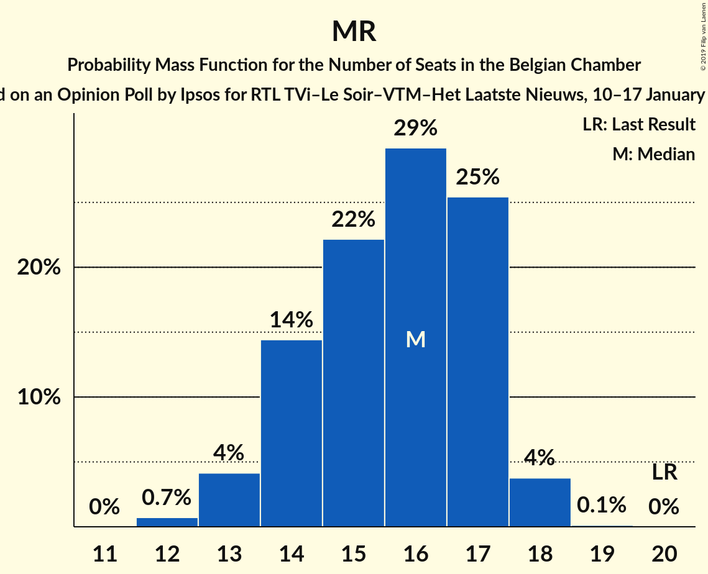

# Opinion Poll by Ipsos for RTL TVi–Le Soir–VTM–Het Laatste Nieuws, 10–17 January 2017

Areas included: Brussels, Flanders, Wallonia

<a href="#voting-intentions">Voting Intentions</a> | <a href="#seats">Seats</a> | <a href="#coalitions">Coalitions</a> | <a href="#technical-information">Technical Information</a>

## Voting Intentions

### Confidence Intervals

| Party | Last Result | Poll Result | 80% Confidence Interval | 90% Confidence Interval | 95% Confidence Interval | 99% Confidence Interval |
|:-----:|:-----------:|:-----------:|:-----------------------:|:-----------------------:|:-----------------------:|:-----------------------:|
| N-VA | 20.3% | 17.3% | 15.4–16.3% |15.2–16.3% |15.0–16.3% |14.6–16.4% |
| CD&V | 11.6% | 9.4% | 7.9–8.6% |7.7–8.6% |7.6–8.6% |7.3–8.6% |
| PS | 11.7% | 8.6% | 7.6–8.0% |7.5–8.0% |7.4–8.0% |7.2–8.0% |
| sp.a | 8.8% | 8.3% | 6.9–7.6% |6.7–7.6% |6.6–7.6% |6.3–7.6% |
| Open Vld | 9.8% | 8.2% | 6.8–7.4% |6.6–7.4% |6.5–7.4% |6.2–7.4% |
| Groen | 5.3% | 7.6% | 6.8–8.2% |6.5–8.3% |6.4–8.4% |6.0–8.4% |
| MR | 9.6% | 7.3% | 6.4–6.7% |6.3–6.8% |6.2–6.8% |6.0–6.8% |
| Vlaams Belang | 3.7% | 6.5% | 5.2–5.8% |5.1–5.8% |5.0–5.9% |4.7–5.9% |
| PTB | 2.0% | 5.9% | 5.1–5.4% |5.0–5.4% |4.9–5.4% |4.7–5.4% |
| Ecolo | 3.3% | 4.4% | 3.7–4.0% |3.6–4.0% |3.6–4.0% |3.4–4.0% |
| cdH | 5.0% | 4.0% | 3.3–3.6% |3.2–3.6% |3.2–3.6% |3.0–3.6% |
| PVDA | 1.8% | 3.3% | 2.8–3.8% |2.7–3.9% |2.5–3.9% |2.3–4.0% |
| Parti Populaire | 1.5% | 1.7% | 1.2–1.4% |1.2–1.4% |1.2–1.4% |1.1–1.4% |
| DéFI | 1.8% | 1.5% | 1.2–1.3% |1.1–1.3% |1.1–1.3% |1.0–1.3% |
| La Droite | 0.4% | 1.1% | 0.9–1.2% |0.8–1.2% |0.8–1.2% |0.7–1.2% |

*Note:* The poll result column reflects the actual value used in the calculations. Published results may vary slightly, and in addition be rounded to fewer digits.

## Seats

### Confidence Intervals

| Party | Last Result | Median | 80% Confidence Interval | 90% Confidence Interval | 95% Confidence Interval | 99% Confidence Interval |
|:-----:|:-----------:|:------:|:-----------------------:|:-----------------------:|:-----------------------:|:-----------------------:|
| <a href="#n-va">N-VA</a> | 33 | 28 | 26–30 |25–30 |24–31 |23–32 |
| <a href="#cd&v">CD&V</a> | 18 | 14 | 13–15 |13–17 |12–17 |11–18 |
| <a href="#ps">PS</a> | 23 | 18 | 16–20 |16–20 |16–20 |15–21 |
| <a href="#sp.a">sp.a</a> | 13 | 12 | 11–14 |10–14 |9–15 |9–15 |
| <a href="#open-vld">Open Vld</a> | 14 | 12 | 11–13 |10–13 |10–14 |8–15 |
| <a href="#groen">Groen</a> | 6 | 11 | 10–12 |10–12 |9–12 |8–13 |
| <a href="#mr">MR</a> | 20 | 16 | 14–17 |14–17 |13–18 |12–18 |
| <a href="#vlaams-belang">Vlaams Belang</a> | 3 | 8 | 7–10 |7–11 |7–12 |7–12 |
| <a href="#ptb">PTB</a> | 2 | 11 | 10–12 |9–12 |9–13 |9–13 |
| <a href="#ecolo">Ecolo</a> | 6 | 8 | 7–9 |7–9 |6–10 |6–10 |
| <a href="#cdh">cdH</a> | 9 | 7 | 6–9 |5–9 |5–9 |4–10 |
| <a href="#pvda">PVDA</a> | 0 | 3 | 1–3 |1–4 |1–4 |1–5 |
| <a href="#parti-populaire">Parti Populaire</a> | 1 | 1 | 0–2 |0–2 |0–2 |0–2 |
| <a href="#défi">DéFI</a> | 2 | 2 | 1–2 |1–2 |1–2 |1–2 |
| <a href="#la-droite">La Droite</a> | 0 | 0 | 0–1 |0–1 |0–1 |0–1 |

### N-VA

*For a full overview of the results for this party, see the [N-VA](party-n-va.html) page.*

| Number of Seats | Probability | Accumulated | Special Marks |
|:---------------:|:-----------:|:-----------:|:-------------:|
| 23 | 0.6% | 100% |  |
| 24 | 3% | 99.4% |  |
| 25 | 7% | 97% |  |
| 26 | 14% | 90% |  |
| 27 | 21% | 76% |  |
| 28 | 23% | 55% | Median |
| 29 | 20% | 32% |  |
| 30 | 9% | 12% |  |
| 31 | 2% | 3% |  |
| 32 | 0.9% | 1.2% |  |
| 33 | 0.3% | 0.3% | Last Result |
| 34 | 0% | 0% |  |

### CD&V

*For a full overview of the results for this party, see the [CD&V](party-cdv.html) page.*

| Number of Seats | Probability | Accumulated | Special Marks |
|:---------------:|:-----------:|:-----------:|:-------------:|
| 10 | 0.2% | 100% |  |
| 11 | 2% | 99.7% |  |
| 12 | 2% | 98% |  |
| 13 | 32% | 96% |  |
| 14 | 44% | 64% | Median |
| 15 | 10% | 20% |  |
| 16 | 4% | 10% |  |
| 17 | 3% | 6% |  |
| 18 | 2% | 2% | Last Result |
| 19 | 0% | 0% |  |

### PS

*For a full overview of the results for this party, see the [PS](party-ps.html) page.*

| Number of Seats | Probability | Accumulated | Special Marks |
|:---------------:|:-----------:|:-----------:|:-------------:|
| 15 | 2% | 100% |  |
| 16 | 12% | 98% |  |
| 17 | 27% | 85% |  |
| 18 | 27% | 58% | Median |
| 19 | 18% | 31% |  |
| 20 | 12% | 13% |  |
| 21 | 0.7% | 0.9% |  |
| 22 | 0.1% | 0.2% |  |
| 23 | 0% | 0% | Last Result |

### sp.a

*For a full overview of the results for this party, see the [sp.a](party-spa.html) page.*

| Number of Seats | Probability | Accumulated | Special Marks |
|:---------------:|:-----------:|:-----------:|:-------------:|
| 9 | 3% | 100% |  |
| 10 | 4% | 97% |  |
| 11 | 37% | 93% |  |
| 12 | 15% | 57% | Median |
| 13 | 25% | 41% | Last Result |
| 14 | 11% | 16% |  |
| 15 | 5% | 5% |  |
| 16 | 0.1% | 0.1% |  |
| 17 | 0% | 0% |  |

### Open Vld

*For a full overview of the results for this party, see the [Open Vld](party-openvld.html) page.*

| Number of Seats | Probability | Accumulated | Special Marks |
|:---------------:|:-----------:|:-----------:|:-------------:|
| 8 | 0.7% | 100% |  |
| 9 | 1.4% | 99.3% |  |
| 10 | 4% | 98% |  |
| 11 | 18% | 94% |  |
| 12 | 61% | 76% | Median |
| 13 | 12% | 15% |  |
| 14 | 2% | 3% | Last Result |
| 15 | 0.6% | 0.9% |  |
| 16 | 0.2% | 0.3% |  |
| 17 | 0.1% | 0.1% |  |
| 18 | 0% | 0% |  |

### Groen

*For a full overview of the results for this party, see the [Groen](party-groen.html) page.*

| Number of Seats | Probability | Accumulated | Special Marks |
|:---------------:|:-----------:|:-----------:|:-------------:|
| 6 | 0% | 100% | Last Result |
| 7 | 0.3% | 100% |  |
| 8 | 0.5% | 99.7% |  |
| 9 | 2% | 99.2% |  |
| 10 | 21% | 97% |  |
| 11 | 44% | 76% | Median |
| 12 | 30% | 32% |  |
| 13 | 1.5% | 2% |  |
| 14 | 0.2% | 0.3% |  |
| 15 | 0.1% | 0.1% |  |
| 16 | 0% | 0% |  |

### MR

*For a full overview of the results for this party, see the [MR](party-mr.html) page.*

| Number of Seats | Probability | Accumulated | Special Marks |
|:---------------:|:-----------:|:-----------:|:-------------:|
| 12 | 0.7% | 100% |  |
| 13 | 4% | 99.3% |  |
| 14 | 14% | 95% |  |
| 15 | 22% | 81% |  |
| 16 | 29% | 59% | Median |
| 17 | 25% | 29% |  |
| 18 | 4% | 4% |  |
| 19 | 0.1% | 0.1% |  |
| 20 | 0% | 0% | Last Result |

### Vlaams Belang

*For a full overview of the results for this party, see the [Vlaams Belang](party-vlaamsbelang.html) page.*

| Number of Seats | Probability | Accumulated | Special Marks |
|:---------------:|:-----------:|:-----------:|:-------------:|
| 3 | 0% | 100% | Last Result |
| 4 | 0% | 100% |  |
| 5 | 0% | 100% |  |
| 6 | 0.2% | 100% |  |
| 7 | 12% | 99.8% |  |
| 8 | 68% | 88% | Median |
| 9 | 9% | 20% |  |
| 10 | 4% | 11% |  |
| 11 | 3% | 7% |  |
| 12 | 3% | 3% |  |
| 13 | 0.3% | 0.3% |  |
| 14 | 0% | 0% |  |

### PTB

*For a full overview of the results for this party, see the [PTB](party-ptb.html) page.*

| Number of Seats | Probability | Accumulated | Special Marks |
|:---------------:|:-----------:|:-----------:|:-------------:|
| 2 | 0% | 100% | Last Result |
| 3 | 0% | 100% |  |
| 4 | 0% | 100% |  |
| 5 | 0% | 100% |  |
| 6 | 0% | 100% |  |
| 7 | 0% | 100% |  |
| 8 | 0.1% | 100% |  |
| 9 | 6% | 99.9% |  |
| 10 | 39% | 94% |  |
| 11 | 38% | 55% | Median |
| 12 | 14% | 17% |  |
| 13 | 2% | 3% |  |
| 14 | 0.2% | 0.2% |  |
| 15 | 0% | 0% |  |

### Ecolo

*For a full overview of the results for this party, see the [Ecolo](party-ecolo.html) page.*

| Number of Seats | Probability | Accumulated | Special Marks |
|:---------------:|:-----------:|:-----------:|:-------------:|
| 5 | 0.4% | 100% |  |
| 6 | 4% | 99.6% | Last Result |
| 7 | 22% | 95% |  |
| 8 | 45% | 74% | Median |
| 9 | 25% | 29% |  |
| 10 | 3% | 3% |  |
| 11 | 0.3% | 0.3% |  |
| 12 | 0% | 0% |  |

### cdH

*For a full overview of the results for this party, see the [cdH](party-cdh.html) page.*

| Number of Seats | Probability | Accumulated | Special Marks |
|:---------------:|:-----------:|:-----------:|:-------------:|
| 4 | 0.6% | 100% |  |
| 5 | 5% | 99.4% |  |
| 6 | 17% | 94% |  |
| 7 | 30% | 77% | Median |
| 8 | 32% | 47% |  |
| 9 | 13% | 14% | Last Result |
| 10 | 2% | 2% |  |
| 11 | 0% | 0% |  |

### PVDA

*For a full overview of the results for this party, see the [PVDA](party-pvda.html) page.*

| Number of Seats | Probability | Accumulated | Special Marks |
|:---------------:|:-----------:|:-----------:|:-------------:|
| 0 | 0% | 100% | Last Result |
| 1 | 12% | 100% |  |
| 2 | 33% | 88% |  |
| 3 | 49% | 55% | Median |
| 4 | 4% | 6% |  |
| 5 | 2% | 2% |  |
| 6 | 0.4% | 0.5% |  |
| 7 | 0% | 0% |  |

### Parti Populaire

*For a full overview of the results for this party, see the [Parti Populaire](party-partipopulaire.html) page.*

| Number of Seats | Probability | Accumulated | Special Marks |
|:---------------:|:-----------:|:-----------:|:-------------:|
| 0 | 36% | 100% |  |
| 1 | 17% | 64% | Last Result, Median |
| 2 | 47% | 47% |  |
| 3 | 0% | 0% |  |

### DéFI

*For a full overview of the results for this party, see the [DéFI](party-défi.html) page.*

| Number of Seats | Probability | Accumulated | Special Marks |
|:---------------:|:-----------:|:-----------:|:-------------:|
| 1 | 45% | 100% |  |
| 2 | 55% | 55% | Last Result, Median |
| 3 | 0.2% | 0.2% |  |
| 4 | 0% | 0% |  |

### La Droite

*For a full overview of the results for this party, see the [La Droite](party-ladroite.html) page.*

| Number of Seats | Probability | Accumulated | Special Marks |
|:---------------:|:-----------:|:-----------:|:-------------:|
| 0 | 72% | 100% | Last Result, Median |
| 1 | 28% | 28% |  |
| 2 | 0.5% | 0.5% |  |
| 3 | 0% | 0% |  |

## Coalitions

### Confidence Intervals

| Coalition | Last Result | Median | Majority? | 80% Confidence Interval | 90% Confidence Interval | 95% Confidence Interval | 99% Confidence Interval |
|:---------:|:-----------:|:------:|:---------:|:-----------------------:|:-----------------------:|:-----------------------:|:-----------------------:|
| CD&V – PS – sp.a – Open Vld – Groen – MR – Ecolo – cdH | 109 | 98 | 100% | 95–101 | 94–101 | 94–102 | 92–103 |
| CD&V – PS – sp.a – Groen – PTB – Ecolo – cdH – PVDA | 77 | 84 | 100% | 81–87 | 80–87 | 79–88 | 78–90 |
| CD&V – PS – sp.a – Open Vld – MR – cdH | 97 | 79 | 94% | 76–82 | 75–82 | 75–83 | 73–84 |
| N-VA – CD&V – Open Vld – MR – cdH | 94 | 77 | 68% | 74–79 | 73–80 | 72–81 | 70–82 |
| PS – sp.a – Open Vld – Groen – MR – Ecolo | 82 | 77 | 70% | 74–79 | 73–80 | 72–81 | 71–82 |
| CD&V – PS – sp.a – Groen – Ecolo – cdH | 75 | 70 | 2% | 68–73 | 67–74 | 66–75 | 65–77 |
| PS – sp.a – Groen – PTB – Ecolo – cdH – PVDA | 59 | 70 | 0.5% | 67–72 | 66–73 | 65–74 | 64–76 |
| N-VA – CD&V – Open Vld – MR | 85 | 69 | 0.1% | 66–72 | 66–72 | 65–73 | 63–74 |
| CD&V – Open Vld – Groen – MR – Ecolo – cdH | 73 | 68 | 0% | 65–71 | 64–71 | 63–72 | 62–73 |
| CD&V – PS – Open Vld – MR – cdH | 84 | 67 | 0% | 64–69 | 63–70 | 63–71 | 61–72 |
| PS – sp.a – Groen – PTB – Ecolo – PVDA | 50 | 62 | 0% | 59–65 | 59–66 | 58–67 | 57–68 |
| PS – sp.a – Open Vld – MR | 70 | 58 | 0% | 55–60 | 54–61 | 54–61 | 52–63 |
| CD&V – PS – sp.a – cdH | 63 | 51 | 0% | 48–54 | 48–55 | 47–56 | 46–57 |
| CD&V – Open Vld – MR – cdH | 61 | 49 | 0% | 46–51 | 45–52 | 45–53 | 43–54 |

### CD&V – PS – sp.a – Open Vld – Groen – MR – Ecolo – cdH

| Number of Seats | Probability | Accumulated | Special Marks |
|:---------------:|:-----------:|:-----------:|:-------------:|
| 91 | 0.2% | 100% |  |
| 92 | 0.5% | 99.8% |  |
| 93 | 1.4% | 99.3% |  |
| 94 | 3% | 98% |  |
| 95 | 7% | 94% |  |
| 96 | 12% | 87% |  |
| 97 | 17% | 75% |  |
| 98 | 19% | 58% | Median |
| 99 | 17% | 39% |  |
| 100 | 12% | 22% |  |
| 101 | 6% | 10% |  |
| 102 | 3% | 4% |  |
| 103 | 0.9% | 1.2% |  |
| 104 | 0.3% | 0.3% |  |
| 105 | 0.1% | 0.1% |  |
| 106 | 0% | 0% |  |
| 107 | 0% | 0% |  |
| 108 | 0% | 0% |  |
| 109 | 0% | 0% | Last Result |

### CD&V – PS – sp.a – Groen – PTB – Ecolo – cdH – PVDA

| Number of Seats | Probability | Accumulated | Special Marks |
|:---------------:|:-----------:|:-----------:|:-------------:|
| 76 | 0.1% | 100% | Majority |
| 77 | 0.3% | 99.9% | Last Result |
| 78 | 0.8% | 99.6% |  |
| 79 | 2% | 98.8% |  |
| 80 | 5% | 96% |  |
| 81 | 9% | 91% |  |
| 82 | 14% | 82% |  |
| 83 | 17% | 68% |  |
| 84 | 17% | 50% | Median |
| 85 | 14% | 33% |  |
| 86 | 9% | 19% |  |
| 87 | 5% | 10% |  |
| 88 | 3% | 5% |  |
| 89 | 1.2% | 2% |  |
| 90 | 0.4% | 0.6% |  |
| 91 | 0.1% | 0.2% |  |
| 92 | 0% | 0.1% |  |
| 93 | 0% | 0% |  |

### CD&V – PS – sp.a – Open Vld – MR – cdH

| Number of Seats | Probability | Accumulated | Special Marks |
|:---------------:|:-----------:|:-----------:|:-------------:|
| 71 | 0% | 100% |  |
| 72 | 0.2% | 99.9% |  |
| 73 | 0.6% | 99.8% |  |
| 74 | 2% | 99.2% |  |
| 75 | 4% | 98% |  |
| 76 | 8% | 94% | Majority |
| 77 | 13% | 86% |  |
| 78 | 17% | 73% |  |
| 79 | 18% | 56% | Median |
| 80 | 16% | 38% |  |
| 81 | 11% | 22% |  |
| 82 | 6% | 11% |  |
| 83 | 3% | 4% |  |
| 84 | 1.0% | 1.4% |  |
| 85 | 0.3% | 0.4% |  |
| 86 | 0.1% | 0.1% |  |
| 87 | 0% | 0% |  |
| 88 | 0% | 0% |  |
| 89 | 0% | 0% |  |
| 90 | 0% | 0% |  |
| 91 | 0% | 0% |  |
| 92 | 0% | 0% |  |
| 93 | 0% | 0% |  |
| 94 | 0% | 0% |  |
| 95 | 0% | 0% |  |
| 96 | 0% | 0% |  |
| 97 | 0% | 0% | Last Result |

### N-VA – CD&V – Open Vld – MR – cdH

| Number of Seats | Probability | Accumulated | Special Marks |
|:---------------:|:-----------:|:-----------:|:-------------:|
| 69 | 0.1% | 100% |  |
| 70 | 0.4% | 99.8% |  |
| 71 | 1.1% | 99.4% |  |
| 72 | 3% | 98% |  |
| 73 | 5% | 96% |  |
| 74 | 9% | 90% |  |
| 75 | 14% | 81% |  |
| 76 | 17% | 68% | Majority |
| 77 | 17% | 51% | Median |
| 78 | 15% | 33% |  |
| 79 | 10% | 19% |  |
| 80 | 5% | 9% |  |
| 81 | 2% | 3% |  |
| 82 | 0.7% | 1.0% |  |
| 83 | 0.2% | 0.3% |  |
| 84 | 0% | 0.1% |  |
| 85 | 0% | 0% |  |
| 86 | 0% | 0% |  |
| 87 | 0% | 0% |  |
| 88 | 0% | 0% |  |
| 89 | 0% | 0% |  |
| 90 | 0% | 0% |  |
| 91 | 0% | 0% |  |
| 92 | 0% | 0% |  |
| 93 | 0% | 0% |  |
| 94 | 0% | 0% | Last Result |

### PS – sp.a – Open Vld – Groen – MR – Ecolo

| Number of Seats | Probability | Accumulated | Special Marks |
|:---------------:|:-----------:|:-----------:|:-------------:|
| 69 | 0% | 100% |  |
| 70 | 0.2% | 99.9% |  |
| 71 | 0.6% | 99.8% |  |
| 72 | 2% | 99.1% |  |
| 73 | 5% | 97% |  |
| 74 | 9% | 93% |  |
| 75 | 14% | 84% |  |
| 76 | 18% | 70% | Majority |
| 77 | 18% | 52% | Median |
| 78 | 15% | 33% |  |
| 79 | 10% | 18% |  |
| 80 | 5% | 9% |  |
| 81 | 2% | 3% |  |
| 82 | 0.8% | 1.2% | Last Result |
| 83 | 0.3% | 0.3% |  |
| 84 | 0.1% | 0.1% |  |
| 85 | 0% | 0% |  |

### CD&V – PS – sp.a – Groen – Ecolo – cdH

| Number of Seats | Probability | Accumulated | Special Marks |
|:---------------:|:-----------:|:-----------:|:-------------:|
| 63 | 0.1% | 100% |  |
| 64 | 0.3% | 99.9% |  |
| 65 | 0.9% | 99.6% |  |
| 66 | 2% | 98.8% |  |
| 67 | 6% | 96% |  |
| 68 | 11% | 90% |  |
| 69 | 16% | 79% |  |
| 70 | 18% | 64% | Median |
| 71 | 17% | 46% |  |
| 72 | 13% | 29% |  |
| 73 | 8% | 17% |  |
| 74 | 5% | 8% |  |
| 75 | 2% | 4% | Last Result |
| 76 | 1.0% | 2% | Majority |
| 77 | 0.4% | 0.5% |  |
| 78 | 0.1% | 0.2% |  |
| 79 | 0% | 0% |  |

### PS – sp.a – Groen – PTB – Ecolo – cdH – PVDA

| Number of Seats | Probability | Accumulated | Special Marks |
|:---------------:|:-----------:|:-----------:|:-------------:|
| 59 | 0% | 100% | Last Result |
| 60 | 0% | 100% |  |
| 61 | 0% | 100% |  |
| 62 | 0% | 100% |  |
| 63 | 0.2% | 100% |  |
| 64 | 0.6% | 99.8% |  |
| 65 | 2% | 99.2% |  |
| 66 | 5% | 97% |  |
| 67 | 9% | 93% |  |
| 68 | 14% | 83% |  |
| 69 | 18% | 69% |  |
| 70 | 18% | 51% | Median |
| 71 | 14% | 33% |  |
| 72 | 9% | 19% |  |
| 73 | 5% | 9% |  |
| 74 | 3% | 4% |  |
| 75 | 1.1% | 2% |  |
| 76 | 0.4% | 0.5% | Majority |
| 77 | 0.1% | 0.1% |  |
| 78 | 0% | 0% |  |

### N-VA – CD&V – Open Vld – MR

| Number of Seats | Probability | Accumulated | Special Marks |
|:---------------:|:-----------:|:-----------:|:-------------:|
| 62 | 0.1% | 100% |  |
| 63 | 0.4% | 99.8% |  |
| 64 | 1.2% | 99.4% |  |
| 65 | 3% | 98% |  |
| 66 | 6% | 95% |  |
| 67 | 11% | 89% |  |
| 68 | 15% | 79% |  |
| 69 | 19% | 63% |  |
| 70 | 18% | 45% | Median |
| 71 | 14% | 27% |  |
| 72 | 8% | 13% |  |
| 73 | 3% | 5% |  |
| 74 | 1.1% | 2% |  |
| 75 | 0.3% | 0.4% |  |
| 76 | 0.1% | 0.1% | Majority |
| 77 | 0% | 0% |  |
| 78 | 0% | 0% |  |
| 79 | 0% | 0% |  |
| 80 | 0% | 0% |  |
| 81 | 0% | 0% |  |
| 82 | 0% | 0% |  |
| 83 | 0% | 0% |  |
| 84 | 0% | 0% |  |
| 85 | 0% | 0% | Last Result |

### CD&V – Open Vld – Groen – MR – Ecolo – cdH

| Number of Seats | Probability | Accumulated | Special Marks |
|:---------------:|:-----------:|:-----------:|:-------------:|
| 60 | 0.1% | 100% |  |
| 61 | 0.2% | 99.9% |  |
| 62 | 0.7% | 99.7% |  |
| 63 | 2% | 99.0% |  |
| 64 | 4% | 97% |  |
| 65 | 7% | 93% |  |
| 66 | 12% | 86% |  |
| 67 | 16% | 74% |  |
| 68 | 18% | 58% | Median |
| 69 | 16% | 40% |  |
| 70 | 12% | 24% |  |
| 71 | 7% | 12% |  |
| 72 | 3% | 5% |  |
| 73 | 1.2% | 2% | Last Result |
| 74 | 0.3% | 0.4% |  |
| 75 | 0.1% | 0.1% |  |
| 76 | 0% | 0% | Majority |

### CD&V – PS – Open Vld – MR – cdH

| Number of Seats | Probability | Accumulated | Special Marks |
|:---------------:|:-----------:|:-----------:|:-------------:|
| 60 | 0.1% | 100% |  |
| 61 | 0.5% | 99.8% |  |
| 62 | 1.3% | 99.4% |  |
| 63 | 3% | 98% |  |
| 64 | 8% | 95% |  |
| 65 | 14% | 87% |  |
| 66 | 19% | 73% |  |
| 67 | 20% | 54% | Median |
| 68 | 16% | 34% |  |
| 69 | 10% | 18% |  |
| 70 | 5% | 8% |  |
| 71 | 2% | 3% |  |
| 72 | 0.8% | 1.1% |  |
| 73 | 0.2% | 0.3% |  |
| 74 | 0.1% | 0.1% |  |
| 75 | 0% | 0% |  |
| 76 | 0% | 0% | Majority |
| 77 | 0% | 0% |  |
| 78 | 0% | 0% |  |
| 79 | 0% | 0% |  |
| 80 | 0% | 0% |  |
| 81 | 0% | 0% |  |
| 82 | 0% | 0% |  |
| 83 | 0% | 0% |  |
| 84 | 0% | 0% | Last Result |

### PS – sp.a – Groen – PTB – Ecolo – PVDA

| Number of Seats | Probability | Accumulated | Special Marks |
|:---------------:|:-----------:|:-----------:|:-------------:|
| 50 | 0% | 100% | Last Result |
| 51 | 0% | 100% |  |
| 52 | 0% | 100% |  |
| 53 | 0% | 100% |  |
| 54 | 0% | 100% |  |
| 55 | 0.1% | 100% |  |
| 56 | 0.3% | 99.9% |  |
| 57 | 1.0% | 99.6% |  |
| 58 | 3% | 98.6% |  |
| 59 | 6% | 96% |  |
| 60 | 11% | 89% |  |
| 61 | 15% | 78% |  |
| 62 | 18% | 63% |  |
| 63 | 17% | 45% | Median |
| 64 | 13% | 29% |  |
| 65 | 8% | 16% |  |
| 66 | 4% | 7% |  |
| 67 | 2% | 3% |  |
| 68 | 0.8% | 1.1% |  |
| 69 | 0.3% | 0.4% |  |
| 70 | 0.1% | 0.1% |  |
| 71 | 0% | 0% |  |

### PS – sp.a – Open Vld – MR

| Number of Seats | Probability | Accumulated | Special Marks |
|:---------------:|:-----------:|:-----------:|:-------------:|
| 51 | 0.1% | 100% |  |
| 52 | 0.5% | 99.8% |  |
| 53 | 2% | 99.3% |  |
| 54 | 5% | 98% |  |
| 55 | 9% | 93% |  |
| 56 | 15% | 84% |  |
| 57 | 19% | 69% |  |
| 58 | 19% | 50% | Median |
| 59 | 15% | 31% |  |
| 60 | 9% | 16% |  |
| 61 | 5% | 7% |  |
| 62 | 2% | 2% |  |
| 63 | 0.5% | 0.7% |  |
| 64 | 0.1% | 0.1% |  |
| 65 | 0% | 0% |  |
| 66 | 0% | 0% |  |
| 67 | 0% | 0% |  |
| 68 | 0% | 0% |  |
| 69 | 0% | 0% |  |
| 70 | 0% | 0% | Last Result |

### CD&V – PS – sp.a – cdH

| Number of Seats | Probability | Accumulated | Special Marks |
|:---------------:|:-----------:|:-----------:|:-------------:|
| 44 | 0.1% | 100% |  |
| 45 | 0.2% | 99.9% |  |
| 46 | 0.9% | 99.7% |  |
| 47 | 3% | 98.8% |  |
| 48 | 7% | 96% |  |
| 49 | 12% | 89% |  |
| 50 | 16% | 78% |  |
| 51 | 17% | 62% | Median |
| 52 | 16% | 45% |  |
| 53 | 13% | 29% |  |
| 54 | 8% | 16% |  |
| 55 | 4% | 8% |  |
| 56 | 2% | 3% |  |
| 57 | 0.8% | 1.2% |  |
| 58 | 0.3% | 0.4% |  |
| 59 | 0.1% | 0.1% |  |
| 60 | 0% | 0% |  |
| 61 | 0% | 0% |  |
| 62 | 0% | 0% |  |
| 63 | 0% | 0% | Last Result |

### CD&V – Open Vld – MR – cdH

| Number of Seats | Probability | Accumulated | Special Marks |
|:---------------:|:-----------:|:-----------:|:-------------:|
| 42 | 0.1% | 100% |  |
| 43 | 0.5% | 99.8% |  |
| 44 | 1.4% | 99.3% |  |
| 45 | 3% | 98% |  |
| 46 | 7% | 95% |  |
| 47 | 13% | 87% |  |
| 48 | 18% | 74% |  |
| 49 | 19% | 57% | Median |
| 50 | 17% | 38% |  |
| 51 | 11% | 21% |  |
| 52 | 6% | 10% |  |
| 53 | 2% | 4% |  |
| 54 | 1.0% | 1.4% |  |
| 55 | 0.3% | 0.4% |  |
| 56 | 0.1% | 0.1% |  |
| 57 | 0% | 0% |  |
| 58 | 0% | 0% |  |
| 59 | 0% | 0% |  |
| 60 | 0% | 0% |  |
| 61 | 0% | 0% | Last Result |

## Technical Information

### Opinion Poll

+ **Polling firm:** Ipsos
+ **Commissioner(s):** RTL TVi–Le Soir–VTM–Het Laatste Nieuws
+ **Fieldwork period:** 10–17 January 2017

### Calculations

+ **Sample size:** 1557
+ **Simulations done:** 1,048,576
+ **Error estimate:** 1.83%

