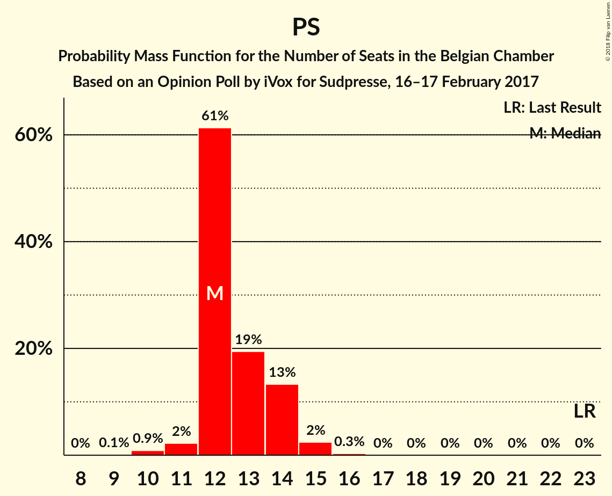
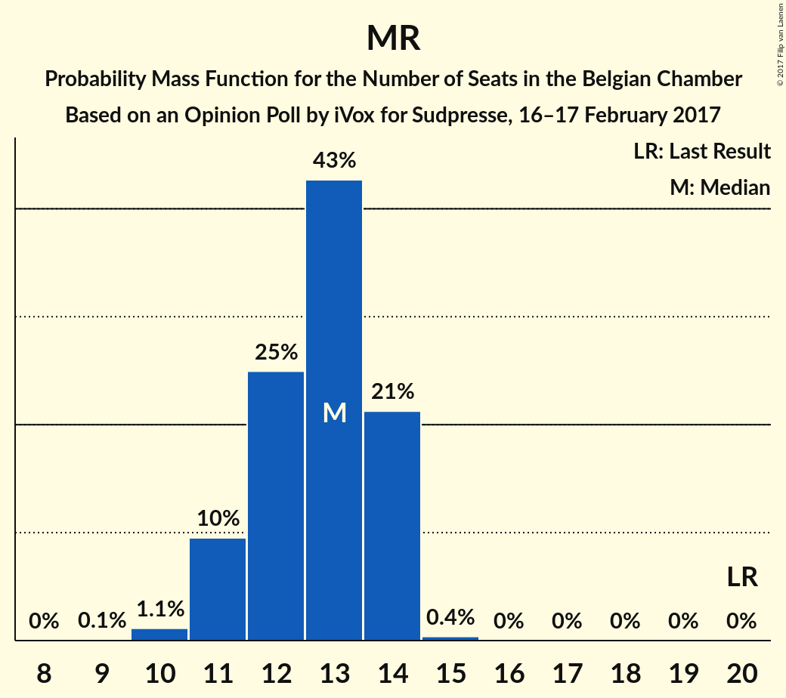
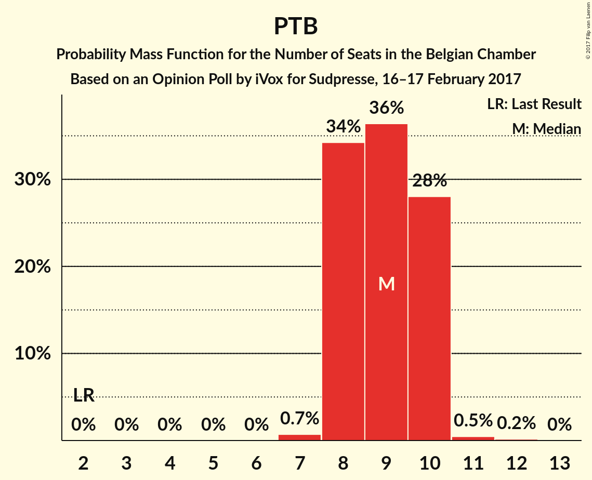
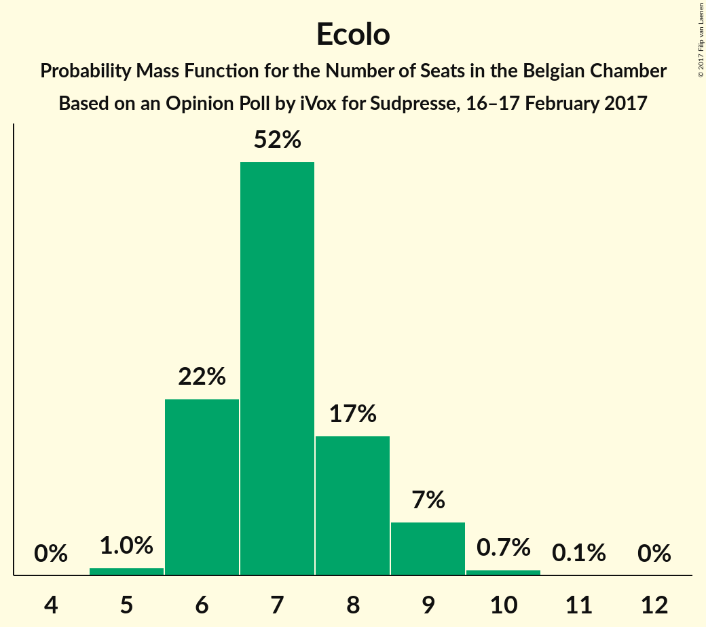
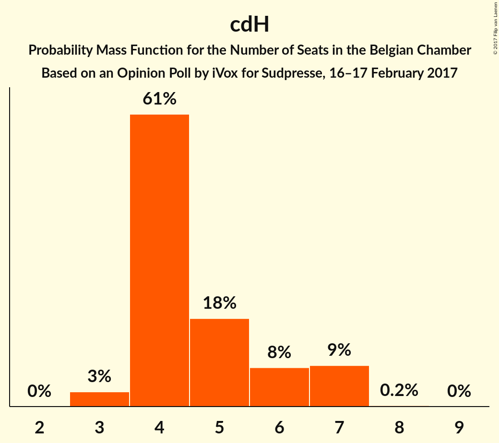
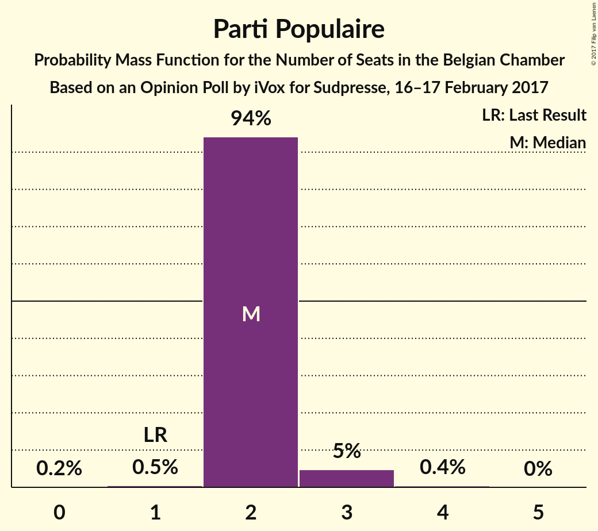
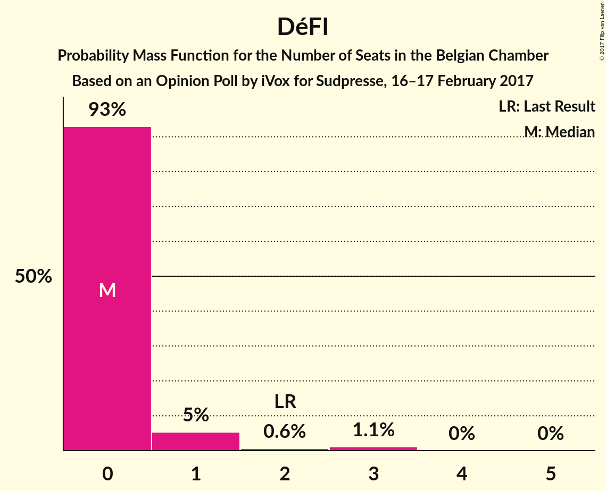

# Opinion Poll by iVox for Sudpresse, 16–17 February 2017

Areas included: Wallonia

<a href="#voting-intentions">Voting Intentions</a> | <a href="#seats">Seats</a> | <a href="#coalitions">Coalitions</a> | <a href="#technical-information">Technical Information</a>

## Voting Intentions

### Confidence Intervals

| Party | Last Result | Poll Result | 80% Confidence Interval | 90% Confidence Interval | 95% Confidence Interval | 99% Confidence Interval |
|:-----:|:-----------:|:-----------:|:-----------------------:|:-----------------------:|:-----------------------:|:-----------------------:|
| PS | 11.7% | 21.3% | 19.7–23.0% |19.2–23.5% |18.9–23.9% |18.1–24.8% |
| MR | 9.6% | 20.7% | 19.1–22.4% |18.7–22.9% |18.3–23.3% |17.6–24.1% |
| PTB | 2.0% | 17.4% | 15.9–19.0% |15.5–19.5% |15.2–19.9% |14.5–20.6% |
| Ecolo | 3.3% | 13.7% | 12.4–15.2% |12.0–15.6% |11.7–16.0% |11.1–16.7% |
| cdH | 5.0% | 10.1% | 9.0–11.4% |8.6–11.8% |8.4–12.1% |7.9–12.8% |
| Parti Populaire | 1.5% | 6.9% | 6.0–8.0% |5.7–8.3% |5.5–8.6% |5.1–9.2% |
| DéFI | 1.8% | 4.5% | 3.8–5.4% |3.6–5.7% |3.4–6.0% |3.1–6.5% |

*Note:* The poll result column reflects the actual value used in the calculations. Published results may vary slightly, and in addition be rounded to fewer digits.

## Seats

### Confidence Intervals

| Party | Last Result | Median | 80% Confidence Interval | 90% Confidence Interval | 95% Confidence Interval | 99% Confidence Interval |
|:-----:|:-----------:|:------:|:-----------------------:|:-----------------------:|:-----------------------:|:-----------------------:|
| <a href="#ps">PS</a> | 23 | 12 | 12–14 |12–14 |11–15 |10–15 |
| <a href="#mr">MR</a> | 20 | 13 | 11–14 |11–14 |11–14 |10–14 |
| <a href="#ptb">PTB</a> | 2 | 9 | 8–10 |8–10 |8–10 |7–11 |
| <a href="#ecolo">Ecolo</a> | 6 | 7 | 6–8 |6–9 |6–9 |5–10 |
| <a href="#cdh">cdH</a> | 9 | 4 | 4–6 |4–7 |3–7 |3–7 |
| <a href="#parti-populaire">Parti Populaire</a> | 1 | 2 | 2 |2–3 |2–3 |1–3 |
| <a href="#défi">DéFI</a> | 2 | 0 | 0 |0–1 |0–1 |0–3 |

### PS

*For a full overview of the results for this party, see the [PS](party-ps.html) page.*

| Number of Seats | Probability | Accumulated | Special Marks |
|:---------------:|:-----------:|:-----------:|:-------------:|
| 9 | 0.1% | 100% |  |
| 10 | 0.9% | 99.9% |  |
| 11 | 2% | 99.1% |  |
| 12 | 61% | 97% | Median |
| 13 | 19% | 35% |  |
| 14 | 13% | 16% |  |
| 15 | 2% | 3% |  |
| 16 | 0.3% | 0.3% |  |
| 17 | 0% | 0% |  |
| 18 | 0% | 0% |  |
| 19 | 0% | 0% |  |
| 20 | 0% | 0% |  |
| 21 | 0% | 0% |  |
| 22 | 0% | 0% |  |
| 23 | 0% | 0% | Last Result |

### MR

*For a full overview of the results for this party, see the [MR](party-mr.html) page.*

| Number of Seats | Probability | Accumulated | Special Marks |
|:---------------:|:-----------:|:-----------:|:-------------:|
| 9 | 0.1% | 100% |  |
| 10 | 1.1% | 99.9% |  |
| 11 | 10% | 98.8% |  |
| 12 | 24% | 89% |  |
| 13 | 45% | 65% | Median |
| 14 | 20% | 20% |  |
| 15 | 0.4% | 0.4% |  |
| 16 | 0% | 0% |  |
| 17 | 0% | 0% |  |
| 18 | 0% | 0% |  |
| 19 | 0% | 0% |  |
| 20 | 0% | 0% | Last Result |

### PTB

*For a full overview of the results for this party, see the [PTB](party-ptb.html) page.*

| Number of Seats | Probability | Accumulated | Special Marks |
|:---------------:|:-----------:|:-----------:|:-------------:|
| 2 | 0% | 100% | Last Result |
| 3 | 0% | 100% |  |
| 4 | 0% | 100% |  |
| 5 | 0% | 100% |  |
| 6 | 0% | 100% |  |
| 7 | 0.7% | 100% |  |
| 8 | 35% | 99.3% |  |
| 9 | 35% | 65% | Median |
| 10 | 29% | 30% |  |
| 11 | 0.5% | 0.6% |  |
| 12 | 0.1% | 0.2% |  |
| 13 | 0% | 0% |  |

### Ecolo

*For a full overview of the results for this party, see the [Ecolo](party-ecolo.html) page.*

| Number of Seats | Probability | Accumulated | Special Marks |
|:---------------:|:-----------:|:-----------:|:-------------:|
| 5 | 1.0% | 100% |  |
| 6 | 22% | 99.0% | Last Result |
| 7 | 51% | 77% | Median |
| 8 | 18% | 26% |  |
| 9 | 7% | 8% |  |
| 10 | 0.7% | 0.9% |  |
| 11 | 0.1% | 0.1% |  |
| 12 | 0% | 0% |  |

### cdH

*For a full overview of the results for this party, see the [cdH](party-cdh.html) page.*

| Number of Seats | Probability | Accumulated | Special Marks |
|:---------------:|:-----------:|:-----------:|:-------------:|
| 3 | 3% | 100% |  |
| 4 | 62% | 97% | Median |
| 5 | 18% | 35% |  |
| 6 | 8% | 17% |  |
| 7 | 8% | 9% |  |
| 8 | 0.2% | 0.2% |  |
| 9 | 0% | 0% | Last Result |

### Parti Populaire

*For a full overview of the results for this party, see the [Parti Populaire](party-partipopulaire.html) page.*

| Number of Seats | Probability | Accumulated | Special Marks |
|:---------------:|:-----------:|:-----------:|:-------------:|
| 0 | 0.2% | 100% |  |
| 1 | 0.5% | 99.8% | Last Result |
| 2 | 94% | 99.3% | Median |
| 3 | 5% | 5% |  |
| 4 | 0.4% | 0.4% |  |
| 5 | 0% | 0% |  |

### DéFI

*For a full overview of the results for this party, see the [DéFI](party-défi.html) page.*

| Number of Seats | Probability | Accumulated | Special Marks |
|:---------------:|:-----------:|:-----------:|:-------------:|
| 0 | 93% | 100% | Median |
| 1 | 5% | 7% |  |
| 2 | 0.6% | 2% | Last Result |
| 3 | 1.2% | 1.2% |  |
| 4 | 0% | 0% |  |

## Coalitions

### Confidence Intervals

| Coalition | Last Result | Median | Majority? | 80% Confidence Interval | 90% Confidence Interval | 95% Confidence Interval | 99% Confidence Interval |
|:---------:|:-----------:|:------:|:---------:|:-----------------------:|:-----------------------:|:-----------------------:|:-----------------------:|

## Technical Information

### Opinion Poll

+ **Polling firm:** iVox
+ **Commissioner(s):** Sudpresse
+ **Fieldwork period:** 16–17 February 2017

### Calculations

+ **Sample size:** 1001
+ **Simulations done:** 0
+ **Error estimate:** 100.00%

