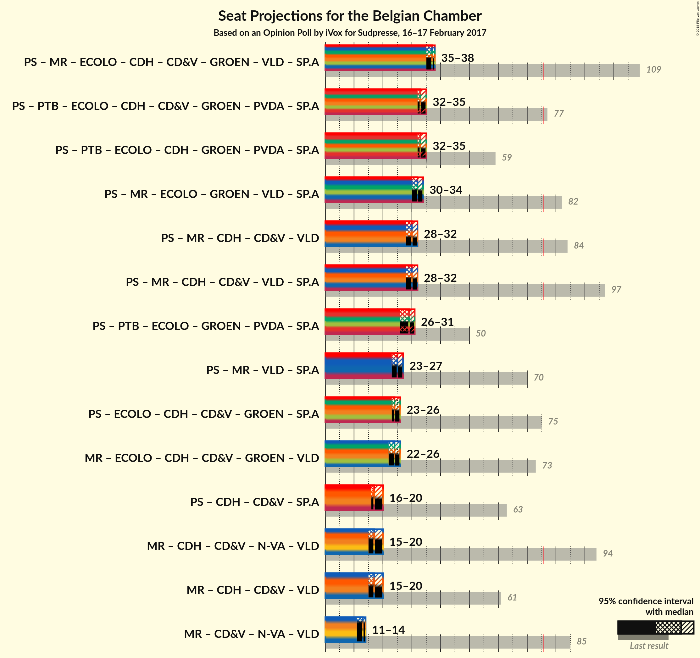

# Opinion Poll by iVox for Sudpresse, 16–17 February 2017

Areas included: Wallonia

<a href="#voting-intentions">Voting Intentions</a> | <a href="#seats">Seats</a> | <a href="#coalitions">Coalitions</a> | <a href="#technical-information">Technical Information</a>

## Voting Intentions

### Confidence Intervals

| Party | Last Result | Poll Result | 80% Confidence Interval | 90% Confidence Interval | 95% Confidence Interval | 99% Confidence Interval |
|:-----:|:-----------:|:-----------:|:-----------------------:|:-----------------------:|:-----------------------:|:-----------------------:|
| PS | 11.7% | 21.3% | N/A |N/A |N/A |N/A |
| MR | 9.6% | 20.7% | N/A |N/A |N/A |N/A |
| PTB | 2.0% | 17.4% | N/A |N/A |N/A |N/A |
| Ecolo | 3.3% | 13.7% | N/A |N/A |N/A |N/A |
| cdH | 5.0% | 10.1% | N/A |N/A |N/A |N/A |
| Parti Populaire | 1.5% | 6.9% | N/A |N/A |N/A |N/A |
| DéFI | 1.8% | 4.5% | N/A |N/A |N/A |N/A |

*Note:* The poll result column reflects the actual value used in the calculations. Published results may vary slightly, and in addition be rounded to fewer digits.

## Seats

### Confidence Intervals

| Party | Last Result | Median | 80% Confidence Interval | 90% Confidence Interval | 95% Confidence Interval | 99% Confidence Interval |
|:-----:|:-----------:|:------:|:-----------------------:|:-----------------------:|:-----------------------:|:-----------------------:|
| <a href="#ps">PS</a> | 23 | 12 | 12–14 |12–14 |11–15 |10–15 |
| <a href="#mr">MR</a> | 20 | 13 | 11–14 |11–14 |11–14 |10–14 |
| <a href="#ptb">PTB</a> | 2 | 9 | 8–10 |8–10 |8–10 |7–11 |
| <a href="#ecolo">Ecolo</a> | 6 | 7 | 6–8 |6–9 |6–9 |5–10 |
| <a href="#cdh">cdH</a> | 9 | 4 | 4–6 |4–7 |3–7 |3–7 |
| <a href="#parti-populaire">Parti Populaire</a> | 1 | 2 | 2 |2 |2–3 |1–3 |
| <a href="#défi">DéFI</a> | 2 | 0 | 0 |0–1 |0–1 |0–3 |

### PS

*For a full overview of the results for this party, see the [PS](party-ps.html) page.*

| Number of Seats | Probability | Accumulated | Special Marks |
|:---------------:|:-----------:|:-----------:|:-------------:|
| 9 | 0.1% | 100% |  |
| 10 | 0.7% | 99.9% |  |
| 11 | 2% | 99.2% |  |
| 12 | 63% | 97% | Median |
| 13 | 19% | 35% |  |
| 14 | 13% | 16% |  |
| 15 | 2% | 3% |  |
| 16 | 0.3% | 0.3% |  |
| 17 | 0% | 0% |  |
| 18 | 0% | 0% |  |
| 19 | 0% | 0% |  |
| 20 | 0% | 0% |  |
| 21 | 0% | 0% |  |
| 22 | 0% | 0% |  |
| 23 | 0% | 0% | Last Result |

### MR

*For a full overview of the results for this party, see the [MR](party-mr.html) page.*

| Number of Seats | Probability | Accumulated | Special Marks |
|:---------------:|:-----------:|:-----------:|:-------------:|
| 9 | 0.1% | 100% |  |
| 10 | 1.2% | 99.9% |  |
| 11 | 9% | 98.7% |  |
| 12 | 27% | 89% |  |
| 13 | 41% | 62% | Median |
| 14 | 21% | 21% |  |
| 15 | 0.3% | 0.3% |  |
| 16 | 0% | 0% |  |
| 17 | 0% | 0% |  |
| 18 | 0% | 0% |  |
| 19 | 0% | 0% |  |
| 20 | 0% | 0% | Last Result |

### PTB

*For a full overview of the results for this party, see the [PTB](party-ptb.html) page.*

| Number of Seats | Probability | Accumulated | Special Marks |
|:---------------:|:-----------:|:-----------:|:-------------:|
| 2 | 0% | 100% | Last Result |
| 3 | 0% | 100% |  |
| 4 | 0% | 100% |  |
| 5 | 0% | 100% |  |
| 6 | 0% | 100% |  |
| 7 | 0.7% | 100% |  |
| 8 | 32% | 99.3% |  |
| 9 | 38% | 67% | Median |
| 10 | 28% | 29% |  |
| 11 | 0.5% | 0.7% |  |
| 12 | 0.2% | 0.2% |  |
| 13 | 0% | 0% |  |

### Ecolo

*For a full overview of the results for this party, see the [Ecolo](party-ecolo.html) page.*

| Number of Seats | Probability | Accumulated | Special Marks |
|:---------------:|:-----------:|:-----------:|:-------------:|
| 5 | 0.9% | 100% |  |
| 6 | 22% | 99.0% | Last Result |
| 7 | 51% | 77% | Median |
| 8 | 17% | 25% |  |
| 9 | 7% | 8% |  |
| 10 | 0.8% | 0.9% |  |
| 11 | 0.1% | 0.1% |  |
| 12 | 0% | 0% |  |

### cdH

*For a full overview of the results for this party, see the [cdH](party-cdh.html) page.*

| Number of Seats | Probability | Accumulated | Special Marks |
|:---------------:|:-----------:|:-----------:|:-------------:|
| 3 | 3% | 100% |  |
| 4 | 62% | 97% | Median |
| 5 | 18% | 34% |  |
| 6 | 8% | 17% |  |
| 7 | 9% | 9% |  |
| 8 | 0.2% | 0.2% |  |
| 9 | 0% | 0% | Last Result |

### Parti Populaire

*For a full overview of the results for this party, see the [Parti Populaire](party-partipopulaire.html) page.*

| Number of Seats | Probability | Accumulated | Special Marks |
|:---------------:|:-----------:|:-----------:|:-------------:|
| 0 | 0.2% | 100% |  |
| 1 | 0.6% | 99.8% | Last Result |
| 2 | 94% | 99.2% | Median |
| 3 | 4% | 5% |  |
| 4 | 0.5% | 0.5% |  |
| 5 | 0% | 0% |  |

### DéFI

*For a full overview of the results for this party, see the [DéFI](party-dfi.html) page.*

| Number of Seats | Probability | Accumulated | Special Marks |
|:---------------:|:-----------:|:-----------:|:-------------:|
| 0 | 93% | 100% | Median |
| 1 | 5% | 7% |  |
| 2 | 0.7% | 2% | Last Result |
| 3 | 1.1% | 1.1% |  |
| 4 | 0% | 0% |  |

## Coalitions

### Confidence Intervals

| Coalition | Last Result | Median | Majority? | 80% Confidence Interval | 90% Confidence Interval | 95% Confidence Interval | 99% Confidence Interval |
|:---------:|:-----------:|:------:|:---------:|:-----------------------:|:-----------------------:|:-----------------------:|:-----------------------:|

## Technical Information

### Opinion Poll

+ **Pollster:** iVox
+ **Media:** Sudpresse
+ **Fieldwork period:** 16–17 February 2017

### Calculations

+ **Sample size:** 1001
+ **Simulations done:** 0
+ **Error estimate:** 100.00%

